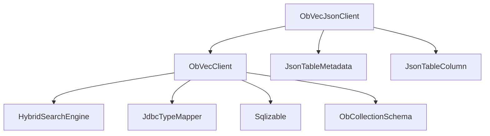
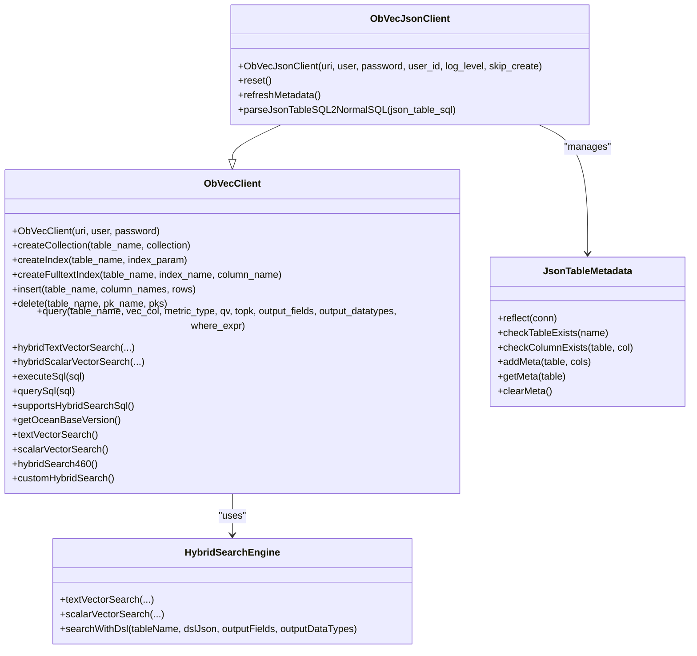
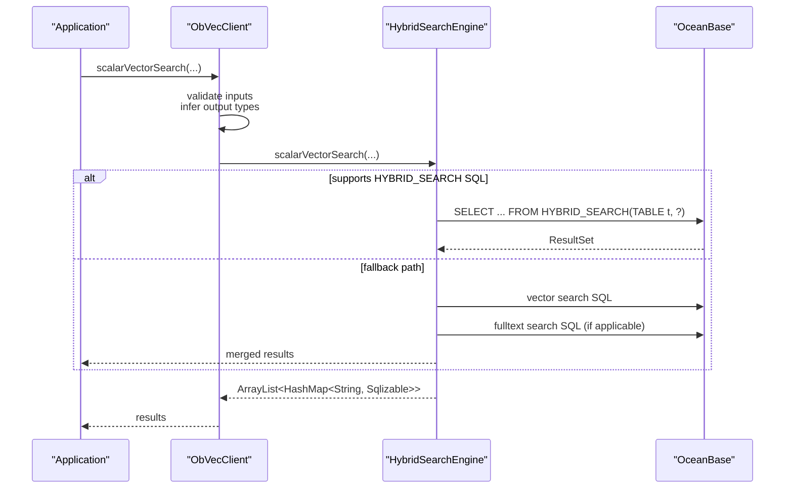
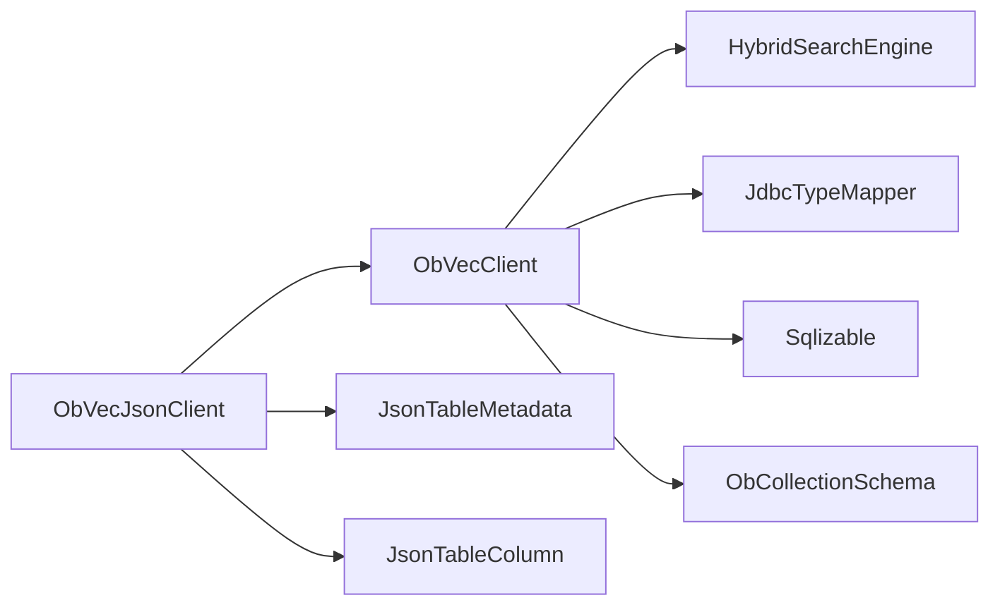

# Client API Reference

<cite>
**Referenced Files in This Document**
- [ObVecClient.java](file://src/main/java/com/oceanbase/obvector4j/ObVecClient.java)
- [ObVecJsonClient.java](file://src/main/java/com/oceanbase/obvector4j/ObVecJsonClient.java)
- [HybridSearchEngine.java](file://src/main/java/com/oceanbase/obvector4j/hybrid/HybridSearchEngine.java)
- [JdbcTypeMapper.java](file://src/main/java/com/oceanbase/obvector4j/util/JdbcTypeMapper.java)
- [Sqlizable.java](file://src/main/java/com/oceanbase/obvector4j/model/Sqlizable.java)
- [ObCollectionSchema.java](file://src/main/java/com/oceanbase/obvector4j/schema/ObCollectionSchema.java)
- [JsonTableMetadata.java](file://src/main/java/com/oceanbase/obvector4j/json_table/JsonTableMetadata.java)
- [JsonTableColumn.java](file://src/main/java/com/oceanbase/obvector4j/json_table/JsonTableColumn.java)
- [README.md](file://README.md)
</cite>

## Table of Contents
1. [Introduction](#introduction)
2. [Project Structure](#project-structure)
3. [Core Components](#core-components)
4. [Architecture Overview](#architecture-overview)
5. [Detailed Component Analysis](#detailed-component-analysis)
6. [Dependency Analysis](#dependency-analysis)
7. [Performance Considerations](#performance-considerations)
8. [Troubleshooting Guide](#troubleshooting-guide)
9. [Conclusion](#conclusion)
10. [Appendices](#appendices)

## Introduction
This document provides comprehensive API documentation for the main client interfaces:
- ObVecClient: primary entry point for connection management, schema/index operations, vector search, hybrid search builders, and direct SQL execution.
- ObVecJsonClient: JSON virtual table operations with dynamic schema evolution and JSON data manipulation.

It includes method signatures, parameter descriptions, return types, exception handling, usage patterns, practical examples, connection pooling guidance, error handling strategies, and performance optimization tips.

## Project Structure
The client APIs are implemented under com.oceanbase.obvector4j:
- ObVecClient is the core client providing CRUD, index management, vector similarity search, hybrid search (text+vector and scalar+vector), and direct SQL helpers.
- ObVecJsonClient extends ObVecClient to support a JSON virtual table layer with DDL parsing and metadata-driven schema evolution.
- HybridSearchEngine encapsulates hybrid search logic and SQL generation.
- Supporting utilities include type mapping and model abstractions.

**Diagram sources**
- [ObVecClient.java:1-603](file://src/main/java/com/oceanbase/obvector4j/ObVecClient.java#L1-L603)
- [HybridSearchEngine.java:1-281](file://src/main/java/com/oceanbase/obvector4j/hybrid/HybridSearchEngine.java#L1-L281)
- [JdbcTypeMapper.java:1-68](file://src/main/java/com/oceanbase/obvector4j/util/JdbcTypeMapper.java#L1-L68)
- [Sqlizable.java:1-10](file://src/main/java/com/oceanbase/obvector4j/model/Sqlizable.java#L1-L10)
- [ObCollectionSchema.java:1-47](file://src/main/java/com/oceanbase/obvector4j/schema/ObCollectionSchema.java#L1-L47)
- [ObVecJsonClient.java:1-828](file://src/main/java/com/oceanbase/obvector4j/ObVecJsonClient.java#L1-L828)
- [JsonTableMetadata.java:1-132](file://src/main/java/com/oceanbase/obvector4j/json_table/JsonTableMetadata.java#L1-L132)
- [JsonTableColumn.java:1-103](file://src/main/java/com/oceanbase/obvector4j/json_table/JsonTableColumn.java#L1-L103)

**Section sources**
- [README.md:1-127](file://README.md#L1-L127)

## Core Components
- ObVecClient
  - Connection lifecycle via JDBC DriverManager.
  - Schema and index management: create/drop collections, create vector/full-text indexes.
  - Vector similarity search: query(...) with metric validation and distance function resolution.
  - Hybrid search: textVectorSearch(...), scalarVectorSearch(...), DSL-based custom search.
  - Direct SQL: executeSql(...), querySql(...) returning typed rows.
  - Version detection and feature flags for HYBRID_SEARCH SQL (4.6.0+).
- ObVecJsonClient
  - Extends ObVecClient; manages two internal tables for JSON virtual tables.
  - Parses CREATE/ALTER/DROP statements into metadata updates and JSON data transformations.
  - Provides refresh/reset capabilities and metadata reflection.

Key responsibilities and relationships are illustrated below.

**Diagram sources**
- [ObVecClient.java:1-603](file://src/main/java/com/oceanbase/obvector4j/ObVecClient.java#L1-L603)
- [ObVecJsonClient.java:1-828](file://src/main/java/com/oceanbase/obvector4j/ObVecJsonClient.java#L1-L828)
- [HybridSearchEngine.java:1-281](file://src/main/java/com/oceanbase/obvector4j/hybrid/HybridSearchEngine.java#L1-L281)
- [JsonTableMetadata.java:1-132](file://src/main/java/com/oceanbase/obvector4j/json_table/JsonTableMetadata.java#L1-L132)

**Section sources**
- [ObVecClient.java:1-603](file://src/main/java/com/oceanbase/obvector4j/ObVecClient.java#L1-L603)
- [ObVecJsonClient.java:1-828](file://src/main/java/com/oceanbase/obvector4j/ObVecJsonClient.java#L1-L828)

## Architecture Overview
At runtime:
- ObVecClient holds a single JDBC Connection and delegates hybrid search to HybridSearchEngine.
- For OceanBase 4.6.0+, hybrid search uses HYBRID_SEARCH SQL with a DSL JSON payload; otherwise it falls back to legacy SQL paths.
- ObVecJsonClient intercepts JSON virtual table DDL (CREATE/ALTER/DROP) and maintains metadata in dedicated tables, applying changes to JSON documents accordingly.

**Diagram sources**
- [ObVecClient.java:438-450](file://src/main/java/com/oceanbase/obvector4j/ObVecClient.java#L438-L450)
- [HybridSearchEngine.java:74-97](file://src/main/java/com/oceanbase/obvector4j/hybrid/HybridSearchEngine.java#L74-L97)
- [HybridSearchEngine.java:114-143](file://src/main/java/com/oceanbase/obvector4j/hybrid/HybridSearchEngine.java#L114-L143)

## Detailed Component Analysis

### ObVecClient API

#### Connection Management
- Constructor: ObVecClient(String uri, String user, String password) throws Throwable
  - Establishes a JDBC connection using DriverManager.
  - Throws SQLException wrapped as Throwable on failure.
- getOceanBaseVersion(): OceanBaseVersion throws Throwable
  - Detects version by calling OB_VERSION(), falling back to VERSION().
  - Caches result after first call.
- supportsHybridSearchSql(): boolean throws Throwable
  - Returns true if connected cluster is at or above the minimum version for HYBRID_SEARCH SQL.

Usage pattern:
- Initialize once per application context.
- Use supportsHybridSearchSql() to branch behavior when needed.

**Section sources**
- [ObVecClient.java:37-45](file://src/main/java/com/oceanbase/obvector4j/ObVecClient.java#L37-L45)
- [ObVecClient.java:377-413](file://src/main/java/com/oceanbase/obvector4j/ObVecClient.java#L377-L413)

#### Schema and Index Operations
- createCollection(String table_name, ObCollectionSchema collection) throws Throwable
  - Generates CREATE TABLE from schema visitor and executes.
- dropCollection(String table_name) throws Throwable
  - Drops table if exists.
- hasCollection(String table_name): boolean throws Throwable
  - Checks existence via DatabaseMetaData.
- createIndex(String table_name, IndexParam index_param) throws Throwable
  - Creates vector index with provided parameters.
- createFulltextIndex(String table_name, String index_name, String column_name) throws Throwable
  - Adds FULLTEXT index on a text column.

Return types and exceptions:
- All methods throw Throwable on errors; ensure proper try/catch or propagate.

Practical example references:
- See integration tests for typical create/query flows.

**Section sources**
- [ObVecClient.java:116-173](file://src/main/java/com/oceanbase/obvector4j/ObVecClient.java#L116-L173)
- [ObVecClient.java:175-227](file://src/main/java/com/oceanbase/obvector4j/ObVecClient.java#L175-L227)
- [ObVecClient.java:137-152](file://src/main/java/com/oceanbase/obvector4j/ObVecClient.java#L137-L152)

#### Data Manipulation
- insert(String table_name, String[] column_names, ArrayList<Sqlizable[]> rows) throws Throwable
  - Batch insert with transactional semantics (auto-commit disabled during operation).
  - Validates row length vs columns; rolls back on failure.
- delete(String table_name, String primary_key_name, ArrayList<Sqlizable> primary_keys) throws Throwable
  - Bulk delete by primary key values.

Exceptions:
- UnsupportedOperationException if column count mismatch.
- SQLException propagated as Throwable.

**Section sources**
- [ObVecClient.java:229-281](file://src/main/java/com/oceanbase/obvector4j/ObVecClient.java#L229-L281)
- [ObVecClient.java:283-310](file://src/main/java/com/oceanbase/obvector4j/ObVecClient.java#L283-L310)

#### Vector Similarity Search
- query(String table_name, String vec_col_name, String metric_type, float[] qv, int topk, String[] output_fields, DataType[] output_datatypes, String where_expr) throws Throwable
  - Validates metric type, resolves distance function, formats vector literal.
  - Executes approximate nearest neighbor query with optional WHERE clause.
  - Maps result columns to Sqlizable instances based on provided DataTypes.

Return type:
- ArrayList<HashMap<String, Sqlizable>> representing rows keyed by column names.

Exceptions:
- IllegalArgumentException if output_datatypes length mismatches projected columns.
- Throwable on SQL errors.

**Section sources**
- [ObVecClient.java:312-372](file://src/main/java/com/oceanbase/obvector4j/ObVecClient.java#L312-L372)

#### Hybrid Search Builders and Methods
- textVectorSearch(): HybridTextVectorSearchBuilder
- scalarVectorSearch(): HybridScalarVectorSearchBuilder
- hybridTextVectorSearch(...): ArrayList<HashMap<String, Sqlizable>> throws Throwable
- hybridScalarVectorSearch(...): ArrayList<HashMap<String, Sqlizable>> throws Throwable
- hybridSearch460(): HybridSearch460 throws Throwable
- customHybridSearch(): HybridSearchCustomBuilder throws Throwable
- hybridSearchWithDsl(String tableName, String dslJson, String[] outputFields, DataType[] outputDataTypes): ArrayList<HashMap<String, Sqlizable>> throws Throwable

Behavior:
- If HYBRID_SEARCH SQL is supported, delegates to HybridSearchEngine which builds DSL JSON and executes HYBRID_SEARCH(TABLE t, ?).
- Otherwise, falls back to legacy SQL paths.

Exceptions:
- UnsupportedOperationException if version < required for 4.6.0 features.
- IllegalArgumentException for invalid outputs.

**Section sources**
- [ObVecClient.java:418-450](file://src/main/java/com/oceanbase/obvector4j/ObVecClient.java#L418-L450)
- [ObVecClient.java:594-601](file://src/main/java/com/oceanbase/obvector4j/ObVecClient.java#L594-L601)
- [ObVecClient.java:563-579](file://src/main/java/com/oceanbase/obvector4j/ObVecClient.java#L563-L579)
- [HybridSearchEngine.java:39-97](file://src/main/java/com/oceanbase/obvector4j/hybrid/HybridSearchEngine.java#L39-L97)

#### Direct SQL Execution
- executeSql(String sql) throws Throwable
  - Executes arbitrary DDL/DML.
- querySql(String sql) throws Throwable
  - Executes SELECT and maps columns to Sqlizable using JdbcTypeMapper and SqlizableFactory.

Return type:
- ArrayList<HashMap<String, Sqlizable>>.

Exceptions:
- IllegalArgumentException for empty SQL.
- SQLException propagated as Throwable.

**Section sources**
- [ObVecClient.java:512-557](file://src/main/java/com/oceanbase/obvector4j/ObVecClient.java#L512-L557)
- [JdbcTypeMapper.java:14-66](file://src/main/java/com/oceanbase/obvector4j/util/JdbcTypeMapper.java#L14-L66)

#### Type Inference
- inferColumnDataType(String tableName, String columnName): DataType throws Throwable
  - Infers SDK DataType from JDBC metadata.
- inferDataType(String tableName, String columnName): DataType throws Throwable
  - Protected helper used internally by hybrid search builders.

**Section sources**
- [ObVecClient.java:458-507](file://src/main/java/com/oceanbase/obvector4j/ObVecClient.java#L458-L507)

### ObVecJsonClient API

#### Initialization and Lifecycle
- ObVecJsonClient(String uri, String user, String password, String user_id, Level log_level, boolean skip_create) throws Throwable
  - Initializes parent ObVecClient.
  - Optionally creates internal JSON tables for data and metadata.
  - Reflects current metadata into memory cache.
- reset() throws Throwable
  - Truncates both internal tables and clears metadata cache.
- refreshMetadata() throws Throwable
  - Re-reads metadata from storage.

Exceptions:
- SQLException propagated as Throwable; rollback applied on failures.

**Section sources**
- [ObVecJsonClient.java:37-90](file://src/main/java/com/oceanbase/obvector4j/ObVecJsonClient.java#L37-L90)
- [ObVecJsonClient.java:92-115](file://src/main/java/com/oceanbase/obvector4j/ObVecJsonClient.java#L92-L115)

#### Dynamic Schema Evolution
- parseJsonTableSQL2NormalSQL(String json_table_sql) throws Throwable
  - Parses JSON virtual table DDL and applies changes:
    - CREATE TABLE: validates column definitions, stores metadata, validates defaults.
    - ALTER TABLE: supports ADD COLUMN, DROP COLUMN, MODIFY COLUMN, CHANGE COLUMN, RENAME TABLE.
    - DROP TABLE: removes metadata and associated JSON records.
  - Updates metadata cache and persists changes atomically within transactions.

Supported operations and constraints:
- Column types: TINYINT, INT, VARCHAR(n), DECIMAL(p,s), TIMESTAMP.
- Defaults validated against database expressions.
- Multiple column data types not supported in a single alter expression.

Exceptions:
- IllegalArgumentException for invalid statements, unsupported specs, or constraint violations.
- UnsupportedOperationException for unsupported operations.

**Section sources**
- [ObVecJsonClient.java:814-826](file://src/main/java/com/oceanbase/obvector4j/ObVecJsonClient.java#L814-L826)
- [ObVecJsonClient.java:125-260](file://src/main/java/com/oceanbase/obvector4j/ObVecJsonClient.java#L125-L260)
- [ObVecJsonClient.java:302-425](file://src/main/java/com/oceanbase/obvector4j/ObVecJsonClient.java#L302-L425)
- [ObVecJsonClient.java:495-580](file://src/main/java/com/oceanbase/obvector4j/ObVecJsonClient.java#L495-L580)
- [ObVecJsonClient.java:583-671](file://src/main/java/com/oceanbase/obvector4j/ObVecJsonClient.java#L583-L671)
- [ObVecJsonClient.java:673-708](file://src/main/java/com/oceanbase/obvector4j/ObVecJsonClient.java#L673-L708)
- [ObVecJsonClient.java:758-812](file://src/main/java/com/oceanbase/obvector4j/ObVecJsonClient.java#L758-L812)

#### Metadata Model
- JsonTableMetadata
  - Maintains an in-memory cache of table/column definitions per user_id.
  - reflect(Connection) loads metadata from meta_json_t.
- JsonTableColumn
  - Represents a column definition including type, nullability, default value, and factory for building typed values.

**Section sources**
- [JsonTableMetadata.java:1-132](file://src/main/java/com/oceanbase/obvector4j/json_table/JsonTableMetadata.java#L1-L132)
- [JsonTableColumn.java:1-103](file://src/main/java/com/oceanbase/obvector4j/json_table/JsonTableColumn.java#L1-L103)

## Dependency Analysis

**Diagram sources**
- [ObVecClient.java:1-603](file://src/main/java/com/oceanbase/obvector4j/ObVecClient.java#L1-L603)
- [HybridSearchEngine.java:1-281](file://src/main/java/com/oceanbase/obvector4j/hybrid/HybridSearchEngine.java#L1-L281)
- [JdbcTypeMapper.java:1-68](file://src/main/java/com/oceanbase/obvector4j/util/JdbcTypeMapper.java#L1-L68)
- [Sqlizable.java:1-10](file://src/main/java/com/oceanbase/obvector4j/model/Sqlizable.java#L1-L10)
- [ObCollectionSchema.java:1-47](file://src/main/java/com/oceanbase/obvector4j/schema/ObCollectionSchema.java#L1-L47)
- [ObVecJsonClient.java:1-828](file://src/main/java/com/oceanbase/obvector4j/ObVecJsonClient.java#L1-L828)
- [JsonTableMetadata.java:1-132](file://src/main/java/com/oceanbase/obvector4j/json_table/JsonTableMetadata.java#L1-L132)
- [JsonTableColumn.java:1-103](file://src/main/java/com/oceanbase/obvector4j/json_table/JsonTableColumn.java#L1-L103)

**Section sources**
- [ObVecClient.java:1-603](file://src/main/java/com/oceanbase/obvector4j/ObVecClient.java#L1-L603)
- [ObVecJsonClient.java:1-828](file://src/main/java/com/oceanbase/obvector4j/ObVecJsonClient.java#L1-L828)

## Performance Considerations
- Connection pooling: The client uses a single JDBC Connection obtained via DriverManager. For production, integrate a connection pool (e.g., HikariCP) and supply pooled connections through your own wrapper or reuse the existing connection object across multiple clients carefully. Avoid sharing a single connection across threads without synchronization.
- Batch inserts: Use insert(...) with multiple rows to leverage prepared statements and transactional commits. Keep batch sizes moderate to balance throughput and memory.
- Approximate search: The query(...) method uses APPROXIMATE LIMIT; tune HNSW ef_search via setHNSWEfSearch/getHNSWEfSearch for accuracy/performance trade-offs.
- Output field typing: Provide explicit DataType[] for output fields to avoid extra inference overhead and ensure correct Sqlizable mapping.
- Hybrid search: On 4.6.0+, prefer HYBRID_SEARCH SQL path for optimized execution; fall back only when necessary.

[No sources needed since this section provides general guidance]

## Troubleshooting Guide
Common issues and remedies:
- Empty or invalid SQL: executeSql/querySql throw IllegalArgumentException for empty strings. Ensure non-empty, trimmed SQL.
- Mismatched output types: query(...) throws IllegalArgumentException if output_datatypes length does not match projected columns. Align arrays precisely.
- Unsupported column specs in JSON virtual tables: ALTER statements with unsupported specs raise IllegalArgumentException. Validate column definitions before altering.
- Default value validation: Invalid DEFAULT expressions cause IllegalArgumentException during CREATE/ALTER. Test default expressions independently.
- Version requirements: hybridSearch460/customHybridSearch require OceanBase ≥ 4.6.0; otherwise, UnsupportedOperationException is thrown. Check supportsHybridSearchSql() before using 4.6.0 features.
- Transaction rollbacks: Batch insert and JSON DDL operations wrap changes in transactions; on failure, they attempt rollback. Inspect logs for underlying SQLException details.

**Section sources**
- [ObVecClient.java:512-557](file://src/main/java/com/oceanbase/obvector4j/ObVecClient.java#L512-L557)
- [ObVecClient.java:312-372](file://src/main/java/com/oceanbase/obvector4j/ObVecClient.java#L312-L372)
- [ObVecClient.java:594-601](file://src/main/java/com/oceanbase/obvector4j/ObVecClient.java#L594-L601)
- [ObVecJsonClient.java:125-260](file://src/main/java/com/oceanbase/obvector4j/ObVecJsonClient.java#L125-L260)
- [ObVecJsonClient.java:495-580](file://src/main/java/com/oceanbase/obvector4j/ObVecJsonClient.java#L495-L580)

## Conclusion
ObVecClient serves as the central API for vector and hybrid search, schema/index management, and direct SQL execution. ObVecJsonClient adds a flexible JSON virtual table layer with dynamic schema evolution. Together, they provide a robust foundation for building applications that combine vector similarity, scalar filtering, and full-text search over OceanBase.

[No sources needed since this section summarizes without analyzing specific files]

## Appendices

### Practical Examples (by reference)
- Table creation and indexing: see createCollection/createIndex/createFulltextIndex usage patterns.
- Vector insertion: use insert(...) with Sqlizable rows.
- Similarity search: use scalarVectorSearch(...) or query(...).
- Hybrid search: use textVectorSearch(...) or hybridSearch460().customSearch() for advanced DSL.
- JSON virtual tables: use parseJsonTableSQL2NormalSQL(...) to evolve schemas dynamically.

For concrete code samples, refer to integration tests and README quick start.

**Section sources**
- [README.md:40-84](file://README.md#L40-L84)