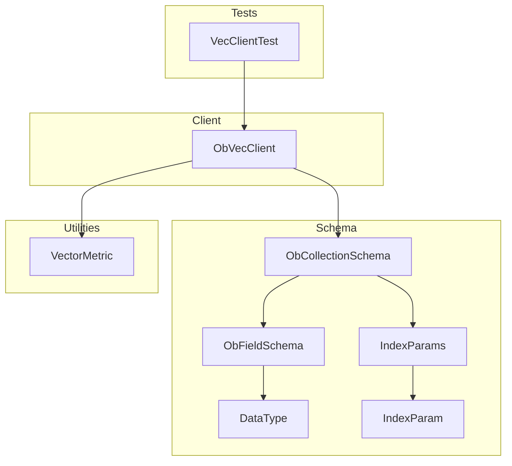
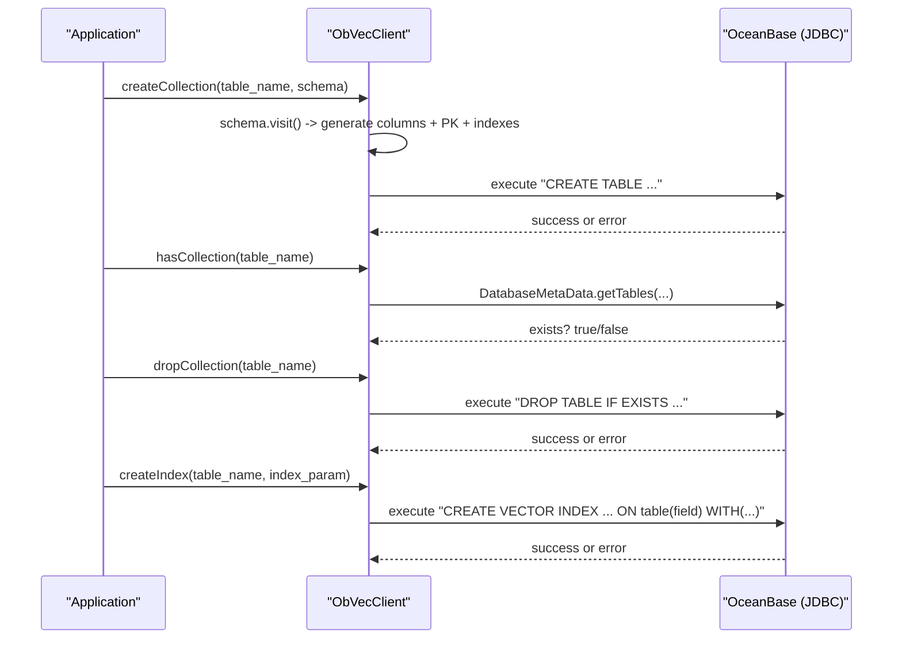
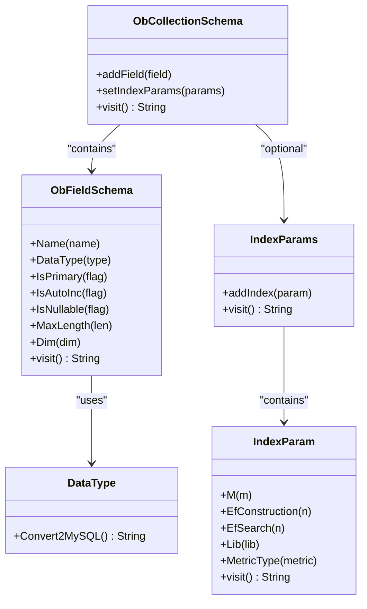
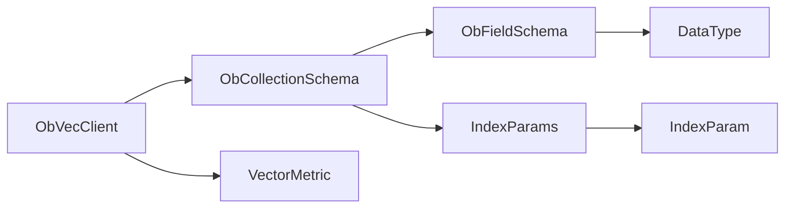
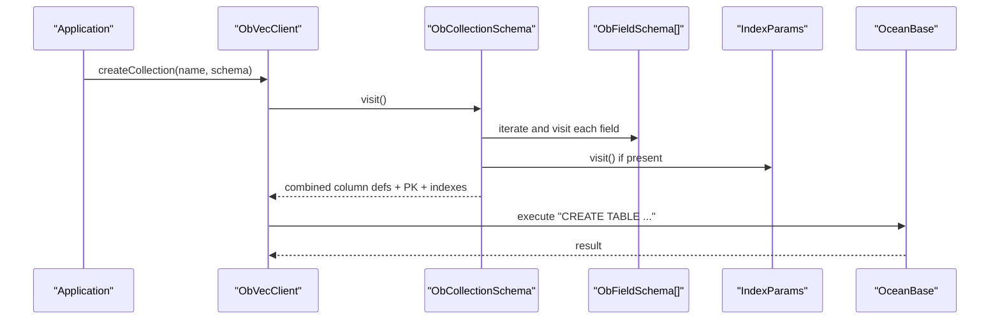
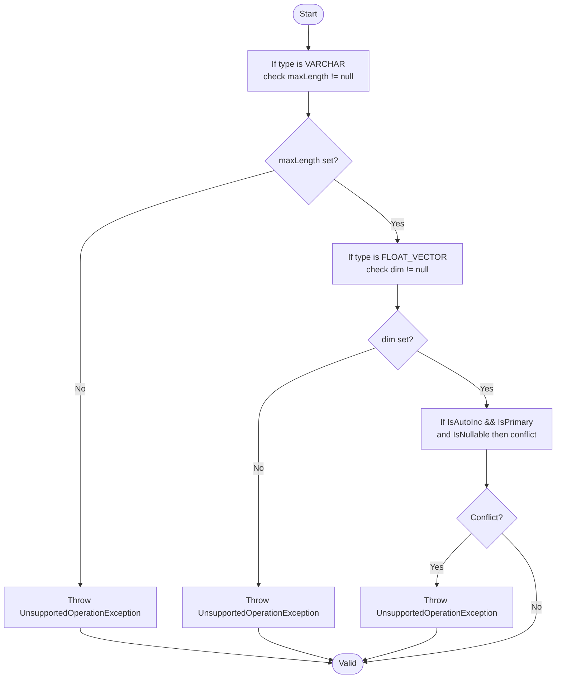

# Collection Operations

<cite>
**Referenced Files in This Document**
- [ObVecClient.java](file://src/main/java/com/oceanbase/obvector4j/ObVecClient.java)
- [ObCollectionSchema.java](file://src/main/java/com/oceanbase/obvector4j/schema/ObCollectionSchema.java)
- [ObFieldSchema.java](file://src/main/java/com/oceanbase/obvector4j/schema/ObFieldSchema.java)
- [DataType.java](file://src/main/java/com/oceanbase/obvector4j/schema/DataType.java)
- [IndexParams.java](file://src/main/java/com/oceanbase/obvector4j/schema/IndexParams.java)
- [IndexParam.java](file://src/main/java/com/oceanbase/obvector4j/schema/IndexParam.java)
- [VectorMetric.java](file://src/main/java/com/oceanbase/obvector4j/util/VectorMetric.java)
- [VecClientTest.java](file://src/test/java/com/oceanbase/obvector4j/integration/container/VecClientTest.java)
</cite>

## Table of Contents
1. [Introduction](#introduction)
2. [Project Structure](#project-structure)
3. [Core Components](#core-components)
4. [Architecture Overview](#architecture-overview)
5. [Detailed Component Analysis](#detailed-component-analysis)
6. [Dependency Analysis](#dependency-analysis)
7. [Performance Considerations](#performance-considerations)
8. [Troubleshooting Guide](#troubleshooting-guide)
9. [Conclusion](#conclusion)
10. [Appendices](#appendices)

## Introduction
This document explains collection (table) management operations in ObVecClient with a focus on:
- Creating collections via createCollection() using ObCollectionSchema, including data types and index configuration
- Deleting collections via dropCollection()
- Checking existence via hasCollection()
- Naming conventions, schema validation rules, and constraint specifications
- Practical examples for creating vector tables with different configurations, managing indexes, and handling lifecycle operations
- Error scenarios, transaction behavior, and performance considerations for large collections

## Project Structure
The collection management functionality is implemented primarily in the client class and supporting schema classes:
- Client entry point: ObVecClient
- Schema definitions: ObCollectionSchema, ObFieldSchema, DataType
- Index configuration: IndexParams, IndexParam
- Vector metric helpers: VectorMetric
- Example usage: VecClientTest

**Diagram sources**
- [ObVecClient.java:154-173](file://src/main/java/com/oceanbase/obvector4j/ObVecClient.java#L154-L173)
- [ObCollectionSchema.java:22-44](file://src/main/java/com/oceanbase/obvector4j/schema/ObCollectionSchema.java#L22-L44)
- [ObFieldSchema.java:85-103](file://src/main/java/com/oceanbase/obvector4j/schema/ObFieldSchema.java#L85-L103)
- [IndexParams.java:16-27](file://src/main/java/com/oceanbase/obvector4j/schema/IndexParams.java#L16-L27)
- [IndexParam.java:58-63](file://src/main/java/com/oceanbase/obvector4j/schema/IndexParam.java#L58-L63)
- [VectorMetric.java:11-27](file://src/main/java/com/oceanbase/obvector4j/util/VectorMetric.java#L11-L27)
- [VecClientTest.java:72-88](file://src/test/java/com/oceanbase/obvector4j/integration/container/VecClientTest.java#L72-L88)

**Section sources**
- [ObVecClient.java:154-173](file://src/main/java/com/oceanbase/obvector4j/ObVecClient.java#L154-L173)
- [ObCollectionSchema.java:22-44](file://src/main/java/com/oceanbase/obvector4j/schema/ObCollectionSchema.java#L22-L44)
- [ObFieldSchema.java:85-103](file://src/main/java/com/oceanbase/obvector4j/schema/ObFieldSchema.java#L85-L103)
- [IndexParams.java:16-27](file://src/main/java/com/oceanbase/obvector4j/schema/IndexParams.java#L16-L27)
- [IndexParam.java:58-63](file://src/main/java/com/oceanbase/obvector4j/schema/IndexParam.java#L58-L63)
- [VectorMetric.java:11-27](file://src/main/java/com/oceanbase/obvector4j/util/VectorMetric.java#L11-L27)
- [VecClientTest.java:72-88](file://src/test/java/com/oceanbase/obvector4j/integration/container/VecClientTest.java#L72-L88)

## Core Components
- ObVecClient: Provides createCollection(), dropCollection(), hasCollection(), createIndex(), and related utilities. It builds SQL statements and executes them over JDBC.
- ObCollectionSchema: Aggregates field definitions and optional index parameters; generates the CREATE TABLE column list and constraints.
- ObFieldSchema: Describes a single column with name, type, primary key flag, auto-increment, nullability, length/dimension constraints.
- DataType: Enumerates supported data types and maps to underlying database types.
- IndexParams: Holds multiple IndexParam entries and serializes them into table-level VECTOR INDEX clauses.
- IndexParam: Configures an HNSW-style vector index with parameters such as M, ef_construction, ef_search, library, and distance metric.
- VectorMetric: Validates and resolves metric names used by queries and index creation.

Key responsibilities:
- Schema-to-SQL generation for CREATE TABLE
- Index parameter validation and serialization
- Safe execution of DDL/DML with proper resource cleanup
- Transactional batch insert behavior

**Section sources**
- [ObVecClient.java:154-173](file://src/main/java/com/oceanbase/obvector4j/ObVecClient.java#L154-L173)
- [ObVecClient.java:175-198](file://src/main/java/com/oceanbase/obvector4j/ObVecClient.java#L175-L198)
- [ObVecClient.java:116-135](file://src/main/java/com/oceanbase/obvector4j/ObVecClient.java#L116-L135)
- [ObVecClient.java:137-152](file://src/main/java/com/oceanbase/obvector4j/ObVecClient.java#L137-L152)
- [ObCollectionSchema.java:22-44](file://src/main/java/com/oceanbase/obvector4j/schema/ObCollectionSchema.java#L22-L44)
- [ObFieldSchema.java:65-103](file://src/main/java/com/oceanbase/obvector4j/schema/ObFieldSchema.java#L65-L103)
- [IndexParams.java:16-27](file://src/main/java/com/oceanbase/obvector4j/schema/IndexParams.java#L16-L27)
- [IndexParam.java:37-63](file://src/main/java/com/oceanbase/obvector4j/schema/IndexParam.java#L37-L63)
- [VectorMetric.java:11-27](file://src/main/java/com/oceanbase/obvector4j/util/VectorMetric.java#L11-L27)

## Architecture Overview
The collection lifecycle flows through ObVecClient methods that translate high-level APIs into SQL executed against OceanBase.

**Diagram sources**
- [ObVecClient.java:154-173](file://src/main/java/com/oceanbase/obvector4j/ObVecClient.java#L154-L173)
- [ObVecClient.java:137-152](file://src/main/java/com/oceanbase/obvector4j/ObVecClient.java#L137-L152)
- [ObVecClient.java:116-135](file://src/main/java/com/oceanbase/obvector4j/ObVecClient.java#L116-L135)
- [ObVecClient.java:175-198](file://src/main/java/com/oceanbase/obvector4j/ObVecClient.java#L175-L198)
- [ObCollectionSchema.java:22-44](file://src/main/java/com/oceanbase/obvector4j/schema/ObCollectionSchema.java#L22-L44)
- [IndexParams.java:16-27](file://src/main/java/com/oceanbase/obvector4j/schema/IndexParams.java#L16-L27)
- [IndexParam.java:58-63](file://src/main/java/com/oceanbase/obvector4j/schema/IndexParam.java#L58-L63)

## Detailed Component Analysis

### createCollection(table_name, ObCollectionSchema)
Purpose:
- Creates a new collection (table) based on the provided schema. The method constructs a CREATE TABLE statement by visiting the schema object, which includes:
  - Column definitions generated from ObFieldSchema instances
  - Primary key definition if any fields are marked as primary
  - Optional inline VECTOR INDEX definitions from IndexParams

Behavior:
- Uses Statement.executeQuery to run the DDL
- Throws on errors; resources are closed in finally block

Schema composition:
- Columns: Each ObFieldSchema contributes a column definition string
- Primary keys: All fields flagged as primary are aggregated into a PRIMARY KEY(...) clause
- Inline indexes: If IndexParams is set, its visit() produces one or more VECTOR INDEX clauses appended to the table definition

Naming conventions:
- table_name is passed directly into the SQL without quoting or escaping. Follow your database’s identifier naming rules and avoid reserved words.

Validation and constraints:
- ObFieldSchema validates required parameters:
  - VARCHAR requires maxLength
  - FLOAT_VECTOR requires dim
  - Auto-increment columns cannot be nullable
- Data type mapping:
  - DataType enum maps to underlying database types (e.g., INT32 → INT, FLOAT_VECTOR → VECTOR(dim))

Error handling:
- Any SQL error propagates to the caller
- Statement is always closed in finally

Practical example references:
- See test usage for building a schema with primary key, vector column, JSON column, and inline index parameters.

**Section sources**
- [ObVecClient.java:154-173](file://src/main/java/com/oceanbase/obvector4j/ObVecClient.java#L154-L173)
- [ObCollectionSchema.java:22-44](file://src/main/java/com/oceanbase/obvector4j/schema/ObCollectionSchema.java#L22-L44)
- [ObFieldSchema.java:65-103](file://src/main/java/com/oceanbase/obvector4j/schema/ObFieldSchema.java#L65-L103)
- [DataType.java:19-34](file://src/main/java/com/oceanbase/obvector4j/schema/DataType.java#L19-L34)
- [IndexParams.java:16-27](file://src/main/java/com/oceanbase/obvector4j/schema/IndexParams.java#L16-L27)
- [VecClientTest.java:72-88](file://src/test/java/com/oceanbase/obvector4j/integration/container/VecClientTest.java#L72-L88)

#### Class Diagram: Schema Model

**Diagram sources**
- [ObCollectionSchema.java:22-44](file://src/main/java/com/oceanbase/obvector4j/schema/ObCollectionSchema.java#L22-L44)
- [ObFieldSchema.java:85-103](file://src/main/java/com/oceanbase/obvector4j/schema/ObFieldSchema.java#L85-L103)
- [IndexParams.java:16-27](file://src/main/java/com/oceanbase/obvector4j/schema/IndexParams.java#L16-L27)
- [IndexParam.java:58-63](file://src/main/java/com/oceanbase/obvector4j/schema/IndexParam.java#L58-L63)
- [DataType.java:19-34](file://src/main/java/com/oceanbase/obvector4j/schema/DataType.java#L19-L34)

### dropCollection(table_name)
Purpose:
- Drops an existing collection (table) if it exists.

Behavior:
- Executes DROP TABLE IF EXISTS <table_name>
- Throws on errors; Statement is closed in finally

Naming conventions:
- Same as createCollection; ensure the name matches exactly what was used during creation.

Error handling:
- Errors propagate to the caller; safe cleanup is guaranteed.

**Section sources**
- [ObVecClient.java:116-135](file://src/main/java/com/oceanbase/obvector4j/ObVecClient.java#L116-L135)

### hasCollection(table_name)
Purpose:
- Checks whether a collection (table) exists in the connected database.

Behavior:
- Uses JDBC DatabaseMetaData.getTables to inspect catalog metadata
- Returns true if found, false otherwise

Error handling:
- SQLExceptions are propagated to the caller

**Section sources**
- [ObVecClient.java:137-152](file://src/main/java/com/oceanbase/obvector4j/ObVecClient.java#L137-L152)

### createIndex(table_name, IndexParam)
Purpose:
- Creates a vector index on an existing table and vector column.

Behavior:
- Builds a CREATE VECTOR INDEX statement with index name, table, field, and WITH(...) parameters
- Executes via Statement.executeQuery

Index parameters:
- m, ef_construction, ef_search, lib, distance (metric), type=hnsw
- Metric validation: only specific metrics are allowed (see below)

Error handling:
- Errors propagate; Statement is closed in finally

**Section sources**
- [ObVecClient.java:175-198](file://src/main/java/com/oceanbase/obvector4j/ObVecClient.java#L175-L198)
- [IndexParam.java:37-63](file://src/main/java/com/oceanbase/obvector4j/schema/IndexParam.java#L37-L63)

### Data Types and Mapping
Supported types include numeric, floating-point, text-like, JSON, and vector types. They map to underlying database types as follows:
- BOOL → TINYINT
- INT8 → TINYINT
- INT16 → SMALLINT
- INT32 → INT
- INT64 → BIGINT
- FLOAT → FLOAT
- DOUBLE → DOUBLE
- STRING → LONGTEXT
- VARCHAR → VARCHAR
- JSON → JSON
- FLOAT_VECTOR → VECTOR(dim)

Constraints:
- VARCHAR requires maxLength
- FLOAT_VECTOR requires dim
- Auto-increment columns cannot be nullable

**Section sources**
- [DataType.java:19-34](file://src/main/java/com/oceanbase/obvector4j/schema/DataType.java#L19-L34)
- [ObFieldSchema.java:65-103](file://src/main/java/com/oceanbase/obvector4j/schema/ObFieldSchema.java#L65-L103)

### Index Configuration Details
IndexParam supports:
- Name and target vector field
- m: number of connections per layer
- ef_construction: build-time search width
- ef_search: runtime search width
- lib: indexing library (default vsag)
- metric_type: distance function (l2 or inner_product)
- type: hnsw (fixed)

Validation:
- Metric type must be one of the supported values; otherwise, an exception is thrown

Inline vs post-creation:
- Inline: Provide IndexParams when building ObCollectionSchema to include VECTOR INDEX definitions in CREATE TABLE
- Post-creation: Use createIndex() after the table exists

**Section sources**
- [IndexParam.java:37-63](file://src/main/java/com/oceanbase/obvector4j/schema/IndexParam.java#L37-L63)
- [IndexParams.java:16-27](file://src/main/java/com/oceanbase/obvector4j/schema/IndexParams.java#L16-L27)
- [ObCollectionSchema.java:22-44](file://src/main/java/com/oceanbase/obvector4j/schema/ObCollectionSchema.java#L22-L44)

### Practical Examples (by reference)
- Create a table with a primary key, a vector column, a JSON column, and an inline vector index: see test setup and creation steps
- Create a table with only a vector column and add a vector index afterward: see second table example in tests
- Query vectors using different metrics (l2, ip): see query calls in tests

References:
- [VecClientTest.java:72-88](file://src/test/java/com/oceanbase/obvector4j/integration/container/VecClientTest.java#L72-L88)
- [VecClientTest.java:126-148](file://src/test/java/com/oceanbase/obvector4j/integration/container/VecClientTest.java#L126-L148)
- [VecClientTest.java:150-166](file://src/test/java/com/oceanbase/obvector4j/integration/container/VecClientTest.java#L150-L166)

## Dependency Analysis
High-level dependencies among core components:

**Diagram sources**
- [ObVecClient.java:154-173](file://src/main/java/com/oceanbase/obvector4j/ObVecClient.java#L154-L173)
- [ObCollectionSchema.java:22-44](file://src/main/java/com/oceanbase/obvector4j/schema/ObCollectionSchema.java#L22-L44)
- [ObFieldSchema.java:85-103](file://src/main/java/com/oceanbase/obvector4j/schema/ObFieldSchema.java#L85-L103)
- [IndexParams.java:16-27](file://src/main/java/com/oceanbase/obvector4j/schema/IndexParams.java#L16-L27)
- [IndexParam.java:58-63](file://src/main/java/com/oceanbase/obvector4j/schema/IndexParam.java#L58-L63)
- [VectorMetric.java:11-27](file://src/main/java/com/oceanbase/obvector4j/util/VectorMetric.java#L11-L27)

**Section sources**
- [ObVecClient.java:154-173](file://src/main/java/com/oceanbase/obvector4j/ObVecClient.java#L154-L173)
- [ObCollectionSchema.java:22-44](file://src/main/java/com/oceanbase/obvector4j/schema/ObCollectionSchema.java#L22-L44)
- [ObFieldSchema.java:85-103](file://src/main/java/com/oceanbase/obvector4j/schema/ObFieldSchema.java#L85-L103)
- [IndexParams.java:16-27](file://src/main/java/com/oceanbase/obvector4j/schema/IndexParams.java#L16-L27)
- [IndexParam.java:58-63](file://src/main/java/com/oceanbase/obvector4j/schema/IndexParam.java#L58-L63)
- [VectorMetric.java:11-27](file://src/main/java/com/oceanbase/obvector4j/util/VectorMetric.java#L11-L27)

## Performance Considerations
- HNSW runtime parameter ef_search:
  - Can be adjusted at runtime via setHNSWEfSearch() and read via getHNSWEfSearch()
  - Higher ef_search improves recall but increases latency
- Index construction parameters:
  - ef_construction affects build time and memory usage
  - m influences graph connectivity and memory footprint
- Large collections:
  - Prefer batching inserts (the client’s insert method uses transactions internally)
  - Ensure appropriate index parameters for your workload
  - Consider full-text or scalar filters to reduce ANN scan scope where applicable

[No sources needed since this section provides general guidance]

## Troubleshooting Guide
Common issues and resolutions:
- Missing required parameters:
  - VARCHAR without maxLength or FLOAT_VECTOR without dim will throw an unsupported operation exception during schema visitation
- Invalid metric type:
  - IndexParam.MetricType() enforces allowed values; invalid values throw an exception
- Auto-increment and nullability:
  - An auto-increment column cannot be nullable; attempting this throws an exception
- Identifier naming:
  - Table and column names are not quoted or escaped by the client; use valid identifiers per your database rules
- Existence checks:
  - hasCollection() relies on JDBC metadata; ensure the connection has permissions to read metadata

Relevant code paths:
- Schema validation and visitation logic
- Index parameter validation
- Metadata-based existence check

**Section sources**
- [ObFieldSchema.java:65-103](file://src/main/java/com/oceanbase/obvector4j/schema/ObFieldSchema.java#L65-L103)
- [IndexParam.java:37-48](file://src/main/java/com/oceanbase/obvector4j/schema/IndexParam.java#L37-L48)
- [ObVecClient.java:137-152](file://src/main/java/com/oceanbase/obvector4j/ObVecClient.java#L137-L152)

## Conclusion
ObVecClient provides a concise API for managing vector-enabled collections:
- Define schemas with ObCollectionSchema and ObFieldSchema, including primary keys and vector dimensions
- Configure vector indexes inline or post-creation using IndexParams and IndexParam
- Manage lifecycle with createCollection(), hasCollection(), and dropCollection()
- Validate inputs early to avoid runtime failures
- Tune HNSW parameters for performance trade-offs between recall and latency

[No sources needed since this section summarizes without analyzing specific files]

## Appendices

### Sequence: createCollection Flow

**Diagram sources**
- [ObVecClient.java:154-173](file://src/main/java/com/oceanbase/obvector4j/ObVecClient.java#L154-L173)
- [ObCollectionSchema.java:22-44](file://src/main/java/com/oceanbase/obvector4j/schema/ObCollectionSchema.java#L22-L44)
- [ObFieldSchema.java:85-103](file://src/main/java/com/oceanbase/obvector4j/schema/ObFieldSchema.java#L85-L103)
- [IndexParams.java:16-27](file://src/main/java/com/oceanbase/obvector4j/schema/IndexParams.java#L16-L27)

### Flowchart: Schema Validation Rules

**Diagram sources**
- [ObFieldSchema.java:65-103](file://src/main/java/com/oceanbase/obvector4j/schema/ObFieldSchema.java#L65-L103)