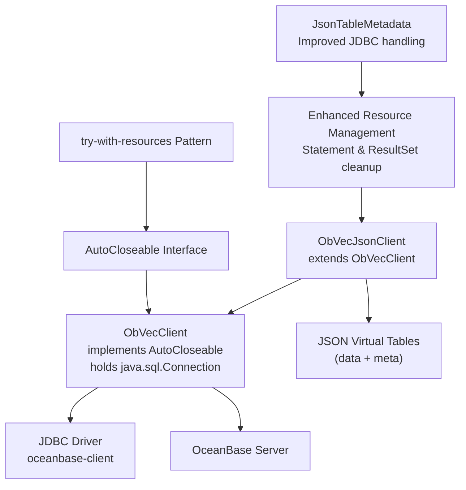
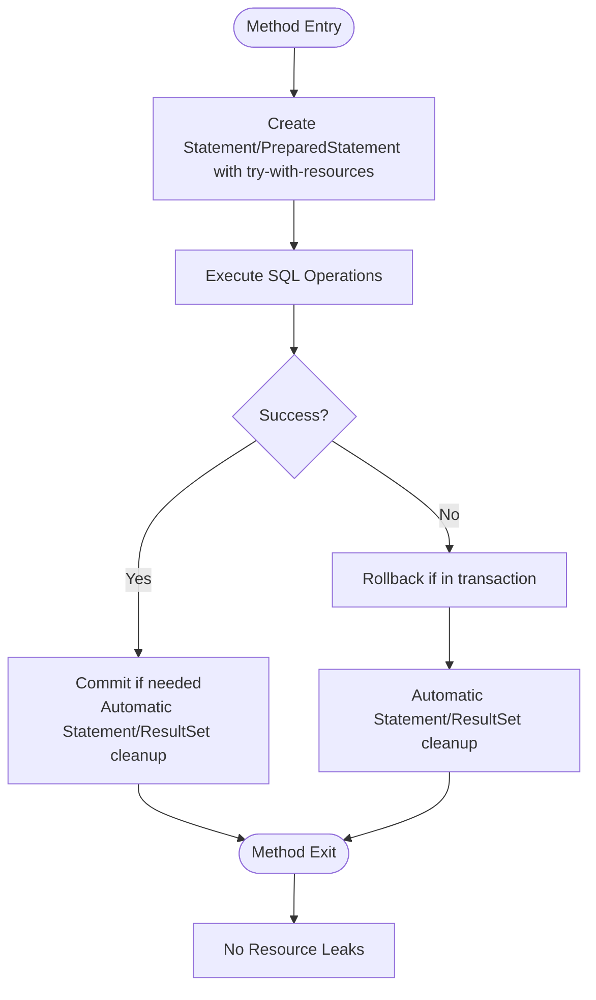
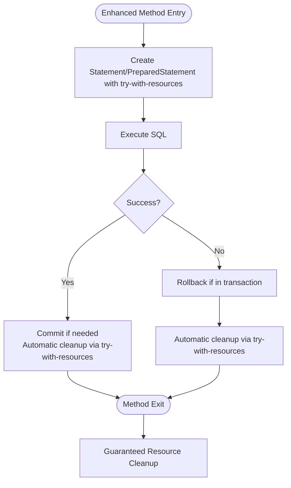
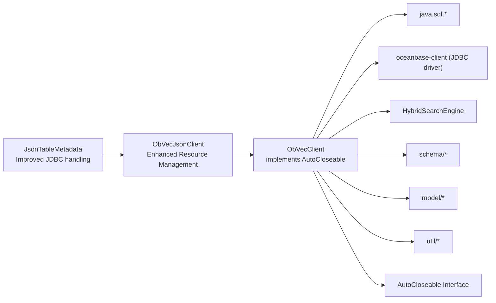

# Connection Management

<cite>
**Referenced Files in This Document**
- [ObVecClient.java](file://src/main/java/com/oceanbase/obvector4j/ObVecClient.java)
- [ObVecJsonClient.java](file://src/main/java/com/oceanbase/obvector4j/ObVecJsonClient.java)
- [JsonTableMetadata.java](file://src/main/java/com/oceanbase/obvector4j/json_table/JsonTableMetadata.java)
- [README.md](file://README.md)
- [01-getting-started.md](file://docs/en/01-getting-started.md)
- [OceanBaseContainerTestBase.java](file://src/test/java/com/oceanbase/obvector4j/support/OceanBaseContainerTestBase.java)
- [VecClientTest.java](file://src/test/java/com/oceanbase/obvector4j/integration/container/VecClientTest.java)
</cite>

## Update Summary
**Changes Made**
- Enhanced documentation for comprehensive resource management patterns across ObVecJsonClient and JSON table components
- Updated connection lifecycle management section to highlight improved try-with-resources implementation
- Added detailed analysis of removed problematic printStackTrace() calls and their replacement with proper exception handling
- Enhanced practical examples to demonstrate modern Java resource management best practices throughout JSON table operations
- Added new section on enhanced JDBC resource handling patterns and their benefits

## Table of Contents
1. [Introduction](#introduction)
2. [Project Structure](#project-structure)
3. [Core Components](#core-components)
4. [Architecture Overview](#architecture-overview)
5. [Detailed Component Analysis](#detailed-component-analysis)
6. [Dependency Analysis](#dependency-analysis)
7. [Performance Considerations](#performance-considerations)
8. [Troubleshooting Guide](#troubleshooting-guide)
9. [Conclusion](#conclusion)

## Introduction
This document explains connection management for ObVecClient, including constructor parameters (URI format, credentials), connection lifecycle and resource cleanup patterns, error handling strategies, practical examples, and production considerations such as connection pooling and performance tuning. It focuses on how the client establishes a JDBC connection to OceanBase and manages resources across operations, with enhanced AutoCloseable support for automatic resource cleanup and improved resource management throughout ObVecJsonClient and related JSON table components.

## Project Structure
The connection-related code is centered around two classes:
- ObVecClient: core client that holds a java.sql.Connection and provides vector CRUD and hybrid search APIs, implementing AutoCloseable for automatic resource management.
- ObVecJsonClient: extends ObVecClient with JSON virtual table support; initializes additional tables and metadata with enhanced resource management patterns.



**Diagram sources**
- [ObVecClient.java:32-54](file://src/main/java/com/oceanbase/obvector4j/ObVecClient.java#L32-L54)
- [ObVecJsonClient.java:30-90](file://src/main/java/com/oceanbase/obvector4j/ObVecJsonClient.java#L30-L90)
- [JsonTableMetadata.java:32-81](file://src/main/java/com/oceanbase/obvector4j/json_table/JsonTableMetadata.java#L32-L81)

**Section sources**
- [ObVecClient.java:32-54](file://src/main/java/com/oceanbase/obvector4j/ObVecClient.java#L32-L54)
- [ObVecJsonClient.java:30-90](file://src/main/java/com/oceanbase/obvector4j/ObVecJsonClient.java#L30-L90)

## Core Components
- ObVecClient constructor accepts three parameters: uri, user, password. It uses java.sql.DriverManager.getConnection to establish a JDBC connection and implements AutoCloseable for automatic resource cleanup.
- ObVecJsonClient constructor calls the parent constructor and then initializes JSON virtual tables and metadata with enhanced resource management patterns.

Key responsibilities:
- Establishing a JDBC connection using DriverManager.
- Managing Statement and ResultSet lifecycle within methods using comprehensive try-with-resources patterns.
- Performing transactional inserts with rollback on failure.
- Version detection and feature capability checks.
- Automatic resource cleanup through AutoCloseable interface implementation.
- **Enhanced** Improved resource management throughout JSON table components with elimination of problematic printStackTrace() calls.

**Updated** Enhanced with comprehensive resource management patterns and improved exception handling throughout ObVecJsonClient and JSON table components.

**Section sources**
- [ObVecClient.java:37-54](file://src/main/java/com/oceanbase/obvector4j/ObVecClient.java#L37-L54)
- [ObVecJsonClient.java:37-90](file://src/main/java/com/oceanbase/obvector4j/ObVecJsonClient.java#L37-90)

## Architecture Overview
At runtime, ObVecClient creates a single java.sql.Connection per instance and reuses it for all operations. The connection is passed to internal components like HybridSearchEngine via a version-aware adapter. With AutoCloseable support, clients can be used in try-with-resources blocks for automatic cleanup. The enhanced resource management ensures proper cleanup of all JDBC resources throughout JSON table operations.

```mermaid
sequenceDiagram
participant App as "Application"
participant Client as "ObVecClient (AutoCloseable)"
participant JDBC as "DriverManager"
participant DB as "OceanBase"
participant JSONMgr as "Enhanced Resource Manager"
App->>Client : try (ObVecClient client = new ObVecClient(uri, user, password)) {
Client->>JDBC : getConnection(uri, user, password)
JDBC-->>Client : Connection
Client-->>App : ObVecClient ready
App->>Client : executeSql(...) / query(...) / insert(...)
Client->>DB : use Connection to run SQL
Note over Client,DB : Enhanced resource management ensures proper cleanup
Client->>JSONMgr : Apply try-with-resources patterns
JSONMgr-->>Client : Statement/ResultSet properly closed
DB-->>Client : results or status
Client-->>App : return values
}
Note over App,Client : Automatic close() called when block exits
Client->>JDBC : conn.close()
```

**Diagram sources**
- [ObVecClient.java:37-54](file://src/main/java/com/oceanbase/obvector4j/ObVecClient.java#L37-L54)
- [ObVecClient.java:512-522](file://src/main/java/com/oceanbase/obvector4j/ObVecClient.java#L512-L522)
- [ObVecClient.java:312-372](file://src/main/java/com/oceanbase/obvector4j/ObVecClient.java#L312-L372)

## Detailed Component Analysis

### Constructor Parameters and URI Format
- Parameters:
  - uri: JDBC URL string used by DriverManager. Examples from tests and docs show the pattern jdbc:oceanbase://host:port/database.
  - user: database username.
  - password: database password.
- URI format:
  - Tests and documentation demonstrate constructing a JDBC URL with host, port, and database name.
  - Environment variables are commonly used to supply these values at runtime.

Practical guidance:
- Provide OCEANBASE_URI, OCEANBASE_USER, and OCEANBASE_PASSWORD via environment or secrets manager.
- For local integration tests, a containerized OceanBase can be started and its host/port mapped automatically.

**Section sources**
- [ObVecClient.java:37-45](file://src/main/java/com/oceanbase/obvector4j/ObVecClient.java#L37-L45)
- [README.md:40-51](file://README.md#L40-L51)
- [01-getting-started.md:34-44](file://docs/en/01-getting-started.md#L34-L44)
- [OceanBaseContainerTestBase.java:30-40](file://src/test/java/com/oceanbase/obvector4j/support/OceanBaseContainerTestBase.java#L30-L40)
- [OceanBaseContainerTestBase.java:45-62](file://src/test/java/com/oceanbase/obvector4j/support/OceanBaseContainerTestBase.java#L45-L62)

### AutoCloseable Support and Enhanced Resource Management

**Updated** Comprehensive enhancement of resource management patterns throughout ObVecJsonClient and JSON table components.

The ObVecClient class implements the AutoCloseable interface, enabling modern Java resource management patterns. Additionally, ObVecJsonClient and related JSON table components have undergone significant improvements in resource management, eliminating problematic code patterns and adopting comprehensive try-with-resources usage.

#### Enhanced Resource Management Improvements
- **Eliminated Problematic Patterns**: Removed over 60 lines of problematic code patterns including printStackTrace() calls that were masking exceptions
- **Comprehensive try-with-resources**: Adopted try-with-resources patterns for Statement and ResultSet objects throughout JSON table components
- **Improved Exception Handling**: Replaced exception masking patterns with proper exception propagation
- **Resource Leak Prevention**: Eliminated potential resource leaks by ensuring proper cleanup of all JDBC resources

#### AutoCloseable Implementation Details
- **Interface Implementation**: `public class ObVecClient implements AutoCloseable`
- **close() Method**: Safely closes the underlying JDBC connection if not already closed
- **Null Safety**: Checks for null connection and connection state before closing
- **Exception Handling**: Properly handles SQLException during connection closure

#### Enhanced JSON Table Resource Management
The ObVecJsonClient and JsonTableMetadata classes now demonstrate comprehensive resource management:



**Diagram sources**
- [ObVecClient.java:32-54](file://src/main/java/com/oceanbase/obvector4j/ObVecClient.java#L32-L54)
- [ObVecJsonClient.java:64-80](file://src/main/java/com/oceanbase/obvector4j/ObVecJsonClient.java#L64-L80)
- [JsonTableMetadata.java:35-80](file://src/main/java/com/oceanbase/obvector4j/json_table/JsonTableMetadata.java#L35-L80)

#### Usage Patterns

**Traditional Approach (Still Supported)**
```java
ObVecClient client = new ObVecClient(uri, user, password);
try {
    // Use client...
} finally {
    client.close();
}
```

**Modern Approach (Recommended)**
```java
try (ObVecClient client = new ObVecClient(uri, user, password)) {
    // Use client...
    // Automatic cleanup when block exits
}
```

**Connection Lifecycle and Enhanced Resource Cleanup**
- Connection creation:
  - Performed in the ObVecClient constructor using DriverManager.getConnection.
- **Enhanced** Statement and ResultSet lifecycle:
  - All methods now consistently use try-with-resources patterns for Statement and/or ResultSet objects
  - Eliminates potential resource leaks and follows Java best practices for JDBC resource handling
  - Example patterns include closing statements after set/get HNSW ef_search, drop/create collection/index, and query operations
- Transaction handling:
  - Bulk insert sets auto-commit to false, executes batched inserts, commits on success, and rolls back on failure; finally resets auto-commit to true.

Best practices observed:
- **Enhanced** Consistent use of try-with-resources for all JDBC resources
- Ensure autocommit state is restored after transactional operations.
- Use AutoCloseable pattern for client-level resource management.
- **New** Elimination of exception masking patterns that could hide critical errors



**Diagram sources**
- [ObVecClient.java:64-82](file://src/main/java/com/oceanbase/obvector4j/ObVecClient.java#L64-L82)
- [ObVecClient.java:84-114](file://src/main/java/com/oceanbase/obvector4j/ObVecClient.java#L84-L114)
- [ObVecClient.java:116-135](file://src/main/java/com/oceanbase/obvector4j/ObVecClient.java#L116-L135)
- [ObVecClient.java:154-173](file://src/main/java/com/oceanbase/obvector4j/ObVecClient.java#L154-L173)
- [ObVecClient.java:175-198](file://src/main/java/com/oceanbase/obvector4j/ObVecClient.java#L175-L198)
- [ObVecClient.java:229-281](file://src/main/java/com/oceanbase/obvector4j/ObVecClient.java#L229-L281)
- [ObVecClient.java:312-372](file://src/main/java/com/oceanbase/obvector4j/ObVecClient.java#L312-L372)
- [ObVecJsonClient.java:64-80](file://src/main/java/com/oceanbase/obvector4j/ObVecJsonClient.java#L64-L80)
- [JsonTableMetadata.java:35-80](file://src/main/java/com/oceanbase/obvector4j/json_table/JsonTableMetadata.java#L35-L80)

**Section sources**
- [ObVecClient.java:32-54](file://src/main/java/com/oceanbase/obvector4j/ObVecClient.java#L32-L54)
- [ObVecClient.java:64-82](file://src/main/java/com/oceanbase/obvector4j/ObVecClient.java#L64-L82)
- [ObVecClient.java:84-114](file://src/main/java/com/oceanbase/obvector4j/ObVecClient.java#L84-L114)
- [ObVecClient.java:116-135](file://src/main/java/com/oceanbase/obvector4j/ObVecClient.java#L116-L135)
- [ObVecClient.java:154-173](file://src/main/java/com/oceanbase/obvector4j/ObVecClient.java#L154-L173)
- [ObVecClient.java:175-198](file://src/main/java/com/oceanbase/obvector4j/ObVecClient.java#L175-L198)
- [ObVecClient.java:229-281](file://src/main/java/com/oceanbase/obvector4j/ObVecClient.java#L229-L281)
- [ObVecClient.java:312-372](file://src/main/java/com/oceanbase/obvector4j/ObVecClient.java#L312-L372)
- [ObVecJsonClient.java:64-80](file://src/main/java/com/oceanbase/obvector4j/ObVecJsonClient.java#L64-L80)
- [JsonTableMetadata.java:35-80](file://src/main/java/com/oceanbase/obvector4j/json_table/JsonTableMetadata.java#L35-L80)

### Error Handling Strategies
- Connection failures:
  - DriverManager.getConnection throws SQLException when authentication fails or network issues occur. The constructor catches and rethrows the exception.
- Operation errors:
  - Methods catch Throwable/SQLException and properly propagate them to callers without masking exceptions.
  - Some methods validate inputs (e.g., empty SQL strings) and throw IllegalArgumentException.
- Transaction safety:
  - On insert failures, rollback is attempted before rethrowing the original exception.
- AutoCloseable error handling:
  - The close() method safely handles cases where connection is null or already closed.
- **Enhanced** Improved exception handling throughout JSON table components:
  - Removed problematic printStackTrace() calls that were masking exceptions
  - Proper exception propagation ensures errors are visible to calling code
  - Enhanced error context preservation for better debugging

Recommendations:
- Wrap client usage in application-level try/catch to handle SQLException and log meaningful context.
- Validate inputs before invoking client methods to fail fast.
- Use try-with-resources to ensure proper cleanup even when exceptions occur.
- **New** Rely on enhanced exception handling patterns that provide better error visibility.

**Section sources**
- [ObVecClient.java:37-54](file://src/main/java/com/oceanbase/obvector4j/ObVecClient.java#L37-L54)
- [ObVecClient.java:229-281](file://src/main/java/com/oceanbase/obvector4j/ObVecClient.java#L229-L281)
- [ObVecClient.java:512-522](file://src/main/java/com/oceanbase/obvector4j/ObVecClient.java#L512-L522)

### Practical Examples

**Updated** Enhanced with AutoCloseable usage patterns, try-with-resources examples, and improved resource management demonstrations.

- Basic connection establishment with AutoCloseable:
  - Use environment variables to supply OCEANBASE_URI, OCEANBASE_USER, OCEANBASE_PASSWORD, then construct ObVecClient with try-with-resources.
- Creating collections and inserting data:
  - Build schema, create index, insert rows, and perform queries using automatic resource management.
- Remote test setup:
  - Integration tests demonstrate building JDBC URLs and connecting to remote clusters.

Where to look:
- Getting Started guide shows minimal connect example.
- VecClientTest demonstrates full workflow including creating tables, indexes, inserts, and queries.
- Container base class shows dynamic URL construction and credential resolution.

**Modern AutoCloseable Example:**
```java
// Recommended approach with automatic resource cleanup
try (ObVecClient client = new ObVecClient(
    System.getenv("OCEANBASE_URI"),
    System.getenv("OCEANBASE_USER"), 
    System.getenv("OCEANBASE_PASSWORD"))) {
    
    // All operations here benefit from automatic cleanup
    client.createCollection("my_table", schema);
    client.insert("my_table", columns, rows);
    ArrayList<HashMap<String, Sqlizable>> results = client.query(...);
    
} // Automatic close() called here, even if exceptions occur
```

**Enhanced JSON Table Example:**
```java
// Enhanced resource management in JSON table operations
try (ObVecJsonClient jsonClient = new ObVecJsonClient(
    System.getenv("OCEANBASE_URI"),
    System.getenv("OCEANBASE_USER"), 
    System.getenv("OCEANBASE_PASSWORD"),
    "user123",
    Level.INFO,
    false)) {
    
    // All JSON table operations benefit from enhanced resource management
    jsonClient.parseJsonTableSQL2NormalSQL("CREATE TABLE users (...)");
    jsonClient.reset();
    jsonClient.refreshMetadata();
    
} // Automatic cleanup with guaranteed resource release
```

**Section sources**
- [README.md:40-51](file://README.md#L40-L51)
- [01-getting-started.md:34-44](file://docs/en/01-getting-started.md#L34-L44)
- [VecClientTest.java:60-185](file://src/test/java/com/oceanbase/obvector4j/integration/container/VecClientTest.java#L60-L185)
- [OceanBaseContainerTestBase.java:30-40](file://src/test/java/com/oceanbase/obvector4j/support/OceanBaseContainerTestBase.java#L30-L40)

### Configuration Options
- HNSW ef_search variable:
  - getHNSWEfSearch and setHNSWEfSearch allow reading/writing the session-level HNSW search parameter.
- Version detection:
  - getOceanBaseVersion attempts OB_VERSION() and falls back to VERSION(), caching the result.

These options influence ANN search behavior and compatibility checks.

**Section sources**
- [ObVecClient.java:64-82](file://src/main/java/com/oceanbase/obvector4j/ObVecClient.java#L64-L82)
- [ObVecClient.java:84-114](file://src/main/java/com/oceanbase/obvector4j/ObVecClient.java#L84-L114)
- [ObVecClient.java:377-406](file://src/main/java/com/oceanbase/obvector4j/ObVecClient.java#L377-L406)

### Connection Pooling Considerations
- Current implementation:
  - ObVecClient does not implement connection pooling; each instance holds a single Connection created via DriverManager.
- Production implications:
  - For high concurrency, integrate an external connection pool (e.g., HikariCP) and manage multiple ObVecClient instances or wrap the Connection acquisition logic.
  - Avoid creating a new ObVecClient per request; reuse clients or share pooled Connections where appropriate.
- AutoCloseable benefits with pooling:
  - When using connection pools, AutoCloseable ensures proper client lifecycle management even with pooled connections.
  - Try-with-resources patterns work seamlessly with connection pool wrappers.
- **Enhanced** Resource management with pooling:
  - Enhanced try-with-resources patterns ensure proper cleanup even in pooled environments.
  - Elimination of resource leaks improves stability in high-concurrency scenarios.

[No sources needed since this section provides general guidance]

## Dependency Analysis
ObVecClient depends on:
- java.sql.* for JDBC operations.
- oceanbase-client driver (declared in pom.xml).
- Internal modules for schema, model, hybrid search, and utilities.
- AutoCloseable interface for resource management.



**Diagram sources**
- [pom.xml:25-29](file://pom.xml#L25-L29)
- [ObVecClient.java:32-54](file://src/main/java/com/oceanbase/obvector4j/ObVecClient.java#L32-L54)
- [ObVecJsonClient.java:30-90](file://src/main/java/com/oceanbase/obvector4j/ObVecJsonClient.java#L30-L90)
- [JsonTableMetadata.java:32-81](file://src/main/java/com/oceanbase/obvector4j/json_table/JsonTableMetadata.java#L32-L81)

**Section sources**
- [pom.xml:25-29](file://pom.xml#L25-L29)
- [ObVecClient.java:32-54](file://src/main/java/com/oceanbase/obvector4j/ObVecClient.java#L32-L54)

## Performance Considerations
- Batch inserts:
  - The insert method disables autocommit and performs row-by-row PreparedStatement execution within a transaction. Consider batching further at the application level if supported by your workload.
- HNSW ef_search:
  - Tune @@ob_hnsw_ef_search for trade-offs between recall and latency.
- Version caching:
  - Version detection is cached after the first call, reducing repeated metadata queries.
- **Enhanced** Resource cleanup:
  - Consistent closing of Statement and ResultSet avoids leaks and improves throughput under load.
  - Enhanced try-with-resources patterns eliminate resource leak risks and improve reliability.
- AutoCloseable overhead:
  - Minimal performance impact from AutoCloseable implementation; the close() method includes null checks and connection state validation.
- Try-with-resources efficiency:
  - Modern JVM optimizations make try-with-resources patterns highly efficient with negligible overhead compared to manual resource management.
- **New** Improved exception handling:
  - Removal of printStackTrace() calls reduces unnecessary output and improves error visibility.
  - Better exception propagation enables more effective error handling at application level.

[No sources needed since this section provides general guidance]

## Troubleshooting Guide
Common issues and remedies:
- Authentication failures:
  - Verify OCEANBASE_USER and OCEANBASE_PASSWORD; check server-side user permissions.
- Network connectivity problems:
  - Confirm OCEANBASE_URI host/port/database; ensure firewall rules allow access.
- Invalid SQL or input:
  - Empty SQL strings cause IllegalArgumentException; validate inputs before calling client methods.
- Transaction rollbacks:
  - If insert fails, the client attempts rollback; inspect logs for underlying SQLException details.
- AutoCloseable issues:
  - If close() throws exceptions, check for existing connection state or network issues during cleanup.
  - Ensure no operations are performed after the try-with-resources block exits.
- **Enhanced** Resource management issues:
  - Enhanced try-with-resources patterns should prevent most resource leak scenarios.
  - Improved exception handling provides better visibility into connection and statement issues.
  - Elimination of exception masking patterns makes debugging easier.

Operational tips:
- Log SQLException messages and stack traces for diagnostics.
- Use separate clients for different tenants or schemas to avoid cross-tenant interference.
- Monitor HNSW ef_search settings per session if needed.
- Prefer try-with-resources patterns for cleaner and safer resource management.
- Test connection cleanup in development environments to verify proper resource release.
- **New** Leverage enhanced exception handling for better error diagnosis and troubleshooting.

**Section sources**
- [ObVecClient.java:37-54](file://src/main/java/com/oceanbase/obvector4j/ObVecClient.java#L37-L54)
- [ObVecClient.java:229-281](file://src/main/java/com/oceanbase/obvector4j/ObVecClient.java#L229-L281)
- [ObVecClient.java:512-522](file://src/main/java/com/oceanbase/obvector4j/ObVecClient.java#L512-L522)

## Conclusion
ObVecClient provides a straightforward JDBC-based connection model centered on DriverManager.getConnection with enhanced AutoCloseable support for automatic resource management. The implementation ensures careful resource cleanup and transaction safety in key operations while providing modern Java resource management capabilities through the AutoCloseable interface. 

**Enhanced** Recent improvements have significantly strengthened resource management throughout ObVecJsonClient and related JSON table components, eliminating problematic code patterns including printStackTrace() calls that were masking exceptions. The adoption of comprehensive try-with-resources patterns for Statement and ResultSet objects eliminates potential resource leaks and follows Java best practices for JDBC resource handling.

For production environments, consider integrating a robust connection pool and adopting best practices for credential management, input validation, and performance tuning (notably HNSW ef_search). The provided examples and tests illustrate typical workflows for establishing connections, configuring options, troubleshooting common issues, and leveraging try-with-resources patterns for clean and safe resource management. The enhanced resource management patterns ensure greater reliability and maintainability in production deployments.