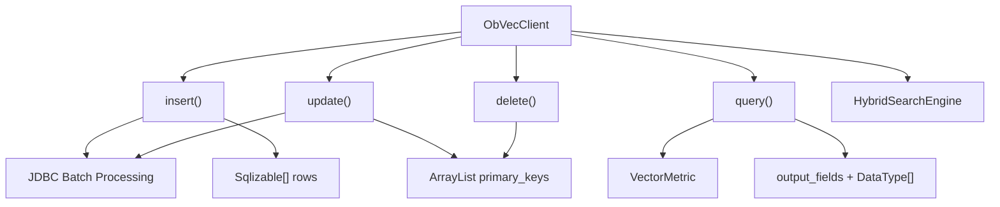
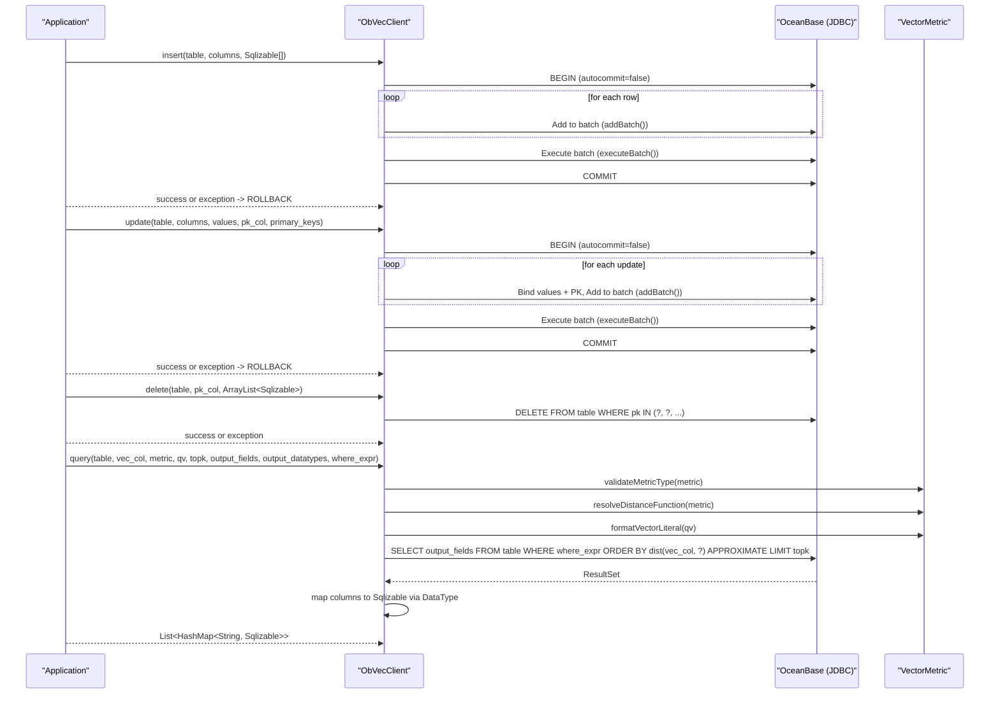
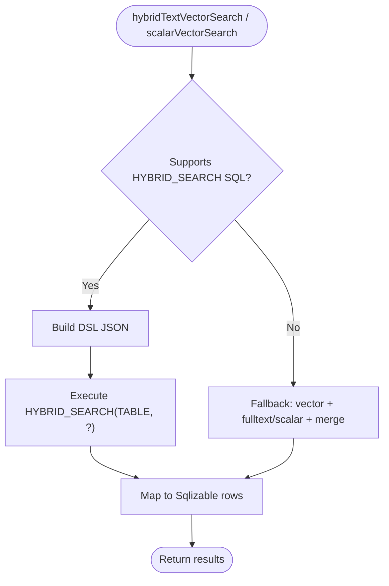
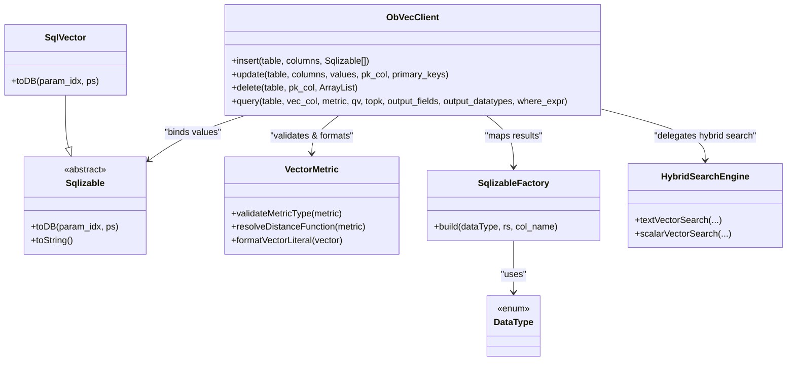

# Data Operations

<cite>
**Referenced Files in This Document**
- [ObVecClient.java](file://src/main/java/com/oceanbase/obvector4j/ObVecClient.java)
- [Sqlizable.java](file://src/main/java/com/oceanbase/obvector4j/model/Sqlizable.java)
- [SqlizableFactory.java](file://src/main/java/com/oceanbase/obvector4j/model/SqlizableFactory.java)
- [SqlVector.java](file://src/main/java/com/oceanbase/obvector4j/model/SqlVector.java)
- [DataType.java](file://src/main/java/com/oceanbase/obvector4j/schema/DataType.java)
- [VectorMetric.java](file://src/main/java/com/oceanbase/obvector4j/util/VectorMetric.java)
- [HybridSearchEngine.java](file://src/main/java/com/oceanbase/obvector4j/hybrid/HybridSearchEngine.java)
- [FilterBuilder.java](file://src/main/java/com/oceanbase/obvector4j/filter/FilterBuilder.java)
- [VecClientTest.java](file://src/test/java/com/oceanbase/obvector4j/integration/container/VecClientTest.java)
- [HybridSearchTest.java](file://src/test/java/com/oceanbase/obvector4j/integration/container/HybridSearchTest.java)
</cite>

## Update Summary
**Changes Made**
- Added comprehensive documentation for the new update() method with batch update capabilities
- Updated core components section to include update functionality alongside insert(), delete(), and query()
- Enhanced architecture overview diagram to show update method flow
- Added detailed component analysis for the update() method
- Updated performance considerations to include batch update optimization details
- Expanded troubleshooting guide with update-specific error handling scenarios

## Table of Contents
1. [Introduction](#introduction)
2. [Project Structure](#project-structure)
3. [Core Components](#core-components)
4. [Architecture Overview](#architecture-overview)
5. [Detailed Component Analysis](#detailed-component-analysis)
6. [Dependency Analysis](#dependency-analysis)
7. [Performance Considerations](#performance-considerations)
8. [Troubleshooting Guide](#troubleshooting-guide)
9. [Conclusion](#conclusion)
10. [Appendices](#appendices)

## Introduction
This document explains data manipulation operations for vector and scalar data, focusing on:
- insert(): optimized batch insertion using JDBC addBatch()/executeBatch() with Sqlizable arrays and transaction management
- **update()**: batch update operations by primary key with transaction management and automatic rollback
- delete(): bulk deletion by primary keys
- query(): vector similarity search with distance metrics (cosine, L2, inner product), top-k results, output field projection, and WHERE clause filtering
It also covers practical usage patterns, performance optimization, memory management, and error handling for large datasets.

## Project Structure
The data operations are primarily implemented in the client entry point and supporting utilities:
- ObVecClient provides insert(), update(), delete(), and query() methods
- VectorMetric supports metric validation and SQL generation helpers
- Sqlizable and its factory handle parameter binding and result mapping
- HybridSearchEngine implements advanced hybrid search paths and fallbacks



**Diagram sources**
- [ObVecClient.java:165-278](file://src/main/java/com/oceanbase/obvector4j/ObVecClient.java#L165-L278)
- [VectorMetric.java:11-40](file://src/main/java/com/oceanbase/obvector4j/util/VectorMetric.java#L11-L40)
- [HybridSearchEngine.java:145-198](file://src/main/java/com/oceanbase/obvector4j/hybrid/HybridSearchEngine.java#L145-L198)

**Section sources**
- [ObVecClient.java:165-278](file://src/main/java/com/oceanbase/obvector4j/ObVecClient.java#L165-L278)
- [VectorMetric.java:11-40](file://src/main/java/com/oceanbase/obvector4j/util/VectorMetric.java#L11-L40)
- [HybridSearchEngine.java:145-198](file://src/main/java/com/oceanbase/obvector4j/hybrid/HybridSearchEngine.java#L145-L198)

## Core Components
- **Optimized batch insert with transactions**:
  - Uses JDBC PreparedStatement.addBatch() and executeBatch() for efficient batch processing
  - Single transaction with automatic commit/rollback handling
  - Validates column count and binds each Sqlizable value via toDB()
  - Streamlined exception handling with proper rollback on failure
- **Batch update by primary key with transactions**:
  - Uses JDBC PreparedStatement.addBatch() and executeBatch() for efficient batch updates
  - Single transaction with automatic commit/rollback handling
  - Validates values size matches primary_keys size and column count alignment
  - Generates UPDATE statements with SET clauses for specified columns and WHERE clause for primary key matching
  - Binds both update values and primary key parameters efficiently
- Bulk delete by primary keys:
  - Builds an IN clause with placeholders and binds each Sqlizable key
- Vector similarity query:
  - Validates metric type, resolves distance function, formats vector literal
  - Constructs SELECT with projected fields, optional WHERE clause, ORDER BY distance, APPROXIMATE LIMIT topk
  - Maps each column to Sqlizable using DataType and SqlizableFactory

Key types:
- Sqlizable: abstract base for values bound to PreparedStatement parameters
- SqlizableFactory: builds typed Sqlizable instances from ResultSet columns
- DataType: maps logical types to database types and influences result mapping
- VectorMetric: validates metric type and generates SQL fragments for vectors

**Section sources**
- [ObVecClient.java:165-278](file://src/main/java/com/oceanbase/obvector4j/ObVecClient.java#L165-L278)
- [Sqlizable.java:6-9](file://src/main/java/com/oceanbase/obvector4j/model/Sqlizable.java#L6-L9)
- [SqlizableFactory.java:8-38](file://src/main/java/com/oceanbase/obvector4j/model/SqlizableFactory.java#L8-L38)
- [DataType.java:3-35](file://src/main/java/com/oceanbase/obvector4j/schema/DataType.java#L3-L35)
- [VectorMetric.java:11-40](file://src/main/java/com/oceanbase/obvector4j/util/VectorMetric.java#L11-L40)

## Architecture Overview
The data operations flow through JDBC with prepared statements and typed wrappers. The following diagram shows how insert(), update(), delete(), and query() interact with the database and internal helpers.



**Diagram sources**
- [ObVecClient.java:165-278](file://src/main/java/com/oceanbase/obvector4j/ObVecClient.java#L165-L278)
- [VectorMetric.java:11-40](file://src/main/java/com/oceanbase/obvector4j/util/VectorMetric.java#L11-L40)

## Detailed Component Analysis

### insert(): Optimized Batch Insertion with JDBC Batch Processing and Transactions
**Updated** Significantly optimized using JDBC addBatch() and executeBatch() methods instead of individual INSERT statements in loops.

Behavior:
- Skips empty batches
- Disables autocommit to start a single transaction
- Prepares a single INSERT statement with placeholders
- For each row:
  - Validates that the number of Sqlizable values matches the number of columns
  - Binds each value using toDB(param_index, preparedStatement)
  - Adds to batch using addBatch()
- Executes all batched inserts at once using executeBatch()
- On success: commits the entire transaction
- On failure: attempts rollback and rethrows the original exception
- Ensures autocommit is restored in finally block

**Performance Benefits:**
- Reduced network round trips by batching multiple INSERT operations
- Improved throughput through JDBC driver optimizations
- Lower memory overhead compared to individual statement execution
- Transaction-level atomicity ensures data consistency

Practical notes:
- Use SqlVector for vector columns and other Sqlizable subclasses for scalar columns
- Ensure column order in column_names aligns with the order of Sqlizable[] rows
- Large batches benefit significantly from JDBC driver optimizations

Example references:
- See integration test usage for constructing rows and calling insert().

**Section sources**
- [ObVecClient.java:165-204](file://src/main/java/com/oceanbase/obvector4j/ObVecClient.java#L165-L204)
- [Sqlizable.java:6-9](file://src/main/java/com/oceanbase/obvector4j/model/Sqlizable.java#L6-L9)
- [SqlVector.java:14-22](file://src/main/java/com/oceanbase/obvector4j/model/SqlVector.java#L14-L22)
- [VecClientTest.java:90-98](file://src/test/java/com/oceanbase/obvector4j/integration/container/VecClientTest.java#L90-L98)

### update(): Batch Update by Primary Key with Transaction Management
**New** Comprehensive batch update functionality for modifying existing rows by their primary keys.

Behavior:
- Skips empty update batches
- Validates that values array size matches primary_keys array size
- Disables autocommit to start a single transaction
- Generates UPDATE statement with SET clauses for specified columns and WHERE clause for primary key
- For each update operation:
  - Validates that the number of update values matches the number of columns to update
  - Binds each update value using toDB(param_index, preparedStatement)
  - Binds corresponding primary key value using toDB()
  - Adds to batch using addBatch()
- Executes all batched updates at once using executeBatch()
- On success: commits the entire transaction
- On failure: attempts rollback and rethrows the original exception
- Ensures autocommit is restored in finally block

**Parameters:**
- table_name: Target table name
- column_names: Array of column names to update (excluding primary key)
- values: ArrayList of Sqlizable[] arrays containing new values for each row
- primary_key_name: Name of the primary key column
- primary_keys: ArrayList of Sqlizable values identifying rows to update

**Transaction Management:**
- Single transaction encompasses entire batch operation
- Automatic rollback on any error during batch execution
- Atomicity ensures all-or-nothing semantics for batch updates

**Performance Benefits:**
- Reduced network overhead through JDBC batch processing
- Efficient parameter binding for both update values and primary keys
- Transaction-level consistency guarantees
- Optimized for large-scale update operations

Practical notes:
- Column order in column_names must align with the order of values in each Sqlizable[] array
- Primary key values must correspond one-to-one with update value arrays
- Use appropriate Sqlizable subclasses for different data types (SqlInteger, SqlText, SqlVector, etc.)

Example usage pattern:
```java
// Prepare update data
ArrayList<Sqlizable[]> update_values = new ArrayList<>();
update_values.add(new Sqlizable[]{new SqlText("updated_doc_1"), new SqlVector(new float[]{1.0f, 2.0f, 3.0f})});
update_values.add(new Sqlizable[]{new SqlText("updated_doc_2"), new SqlVector(new float[]{1.1f, 2.2f, 3.3f})});

ArrayList<Sqlizable> primary_keys = new ArrayList<>();
primary_keys.add(new SqlInteger(1));
primary_keys.add(new SqlInteger(2));

client.update("table_name", new String[]{"c2", "c3"}, update_values, "c1", primary_keys);
```

**Section sources**
- [ObVecClient.java:223-278](file://src/main/java/com/oceanbase/obvector4j/ObVecClient.java#L223-L278)
- [Sqlizable.java:6-9](file://src/main/java/com/oceanbase/obvector4j/model/Sqlizable.java#L6-L9)

### delete(): Bulk Deletion by Primary Keys
Behavior:
- Builds a DELETE statement with an IN clause sized to the number of primary keys
- Binds each Sqlizable primary key using toDB()
- Executes the update once

Notes:
- All provided primary keys are deleted in a single statement
- If the list is empty, the generated IN clause will be empty; ensure callers guard against this case

Example references:
- See integration test usage for deleting multiple IDs.

**Section sources**
- [ObVecClient.java:206-221](file://src/main/java/com/oceanbase/obvector4j/ObVecClient.java#L206-L221)
- [VecClientTest.java:120-124](file://src/test/java/com/oceanbase/obvector4j/integration/container/VecClientTest.java#L120-L124)

### query(): Vector Similarity Search with Metrics, Top-k, Projection, and Filtering
Behavior:
- Validates metric type and resolves the corresponding distance function
- Formats the query vector into a literal string
- Builds a SELECT with:
  - Projected output_fields
  - Optional WHERE clause (where_expr)
  - ORDER BY distance(vec_col, ?) ASC
  - APPROXIMATE LIMIT topk
- Reads ResultSet metadata and maps each column to a typed Sqlizable using DataType and SqlizableFactory

Supported metrics:
- cosine -> cosine_distance
- l2 -> l2_distance
- ip -> negative_inner_product

Output field projection:
- output_fields specifies which columns to return
- output_datatypes must match the length of output_fields; otherwise, an IllegalArgumentException is thrown

WHERE clause filtering:
- Pass a raw SQL fragment as where_expr to filter rows before similarity ranking

Top-k results:
- topk controls the maximum number of returned rows

Example references:
- See integration tests for querying with different metrics and projections.

**Section sources**
- [ObVecClient.java:280-327](file://src/main/java/com/oceanbase/obvector4j/ObVecClient.java#L280-327)
- [VectorMetric.java:11-40](file://src/main/java/com/oceanbase/obvector4j/util/VectorMetric.java#L11-L40)
- [SqlizableFactory.java:8-38](file://src/main/java/com/oceanbase/obvector4j/model/SqlizableFactory.java#L8-L38)
- [VecClientTest.java:100-118](file://src/test/java/com/oceanbase/obvector4j/integration/container/VecClientTest.java#L100-L118)

#### Distance Metrics and Ordering Semantics
- cosine: uses cosine_distance; lower distance means more similar
- l2: uses l2_distance; lower distance means more similar
- ip: uses negative_inner_product; higher inner product corresponds to smaller negative_inner_product, thus closer in ordering

These mappings are resolved at runtime and used in ORDER BY clauses.

**Section sources**
- [VectorMetric.java:11-27](file://src/main/java/com/oceanbase/obvector4j/util/VectorMetric.java#L11-L27)
- [ObVecClient.java:291-303](file://src/main/java/com/oceanbase/obvector4j/ObVecClient.java#L291-303)

#### Advanced Hybrid Search (Optional Path)
For richer scenarios (text + vector or scalar + vector), the engine can use HYBRID_SEARCH SQL when supported, or fall back to combining vector and full-text/scalar queries and merging results.



**Diagram sources**
- [HybridSearchEngine.java:39-97](file://src/main/java/com/oceanbase/obvector4j/hybrid/HybridSearchEngine.java#L39-L97)
- [HybridSearchEngine.java:114-143](file://src/main/java/com/oceanbase/obvector4j/hybrid/HybridSearchEngine.java#L114-L143)

**Section sources**
- [HybridSearchEngine.java:39-97](file://src/main/java/com/oceanbase/obvector4j/hybrid/HybridSearchEngine.java#L39-L97)
- [HybridSearchEngine.java:114-143](file://src/main/java/com/oceanbase/obvector4j/hybrid/HybridSearchEngine.java#L114-L143)

## Dependency Analysis
The core dependencies among components involved in data operations:



**Diagram sources**
- [ObVecClient.java:165-327](file://src/main/java/com/oceanbase/obvector4j/ObVecClient.java#L165-L327)
- [Sqlizable.java:6-9](file://src/main/java/com/oceanbase/obvector4j/model/Sqlizable.java#L6-L9)
- [SqlVector.java:7-22](file://src/main/java/com/oceanbase/obvector4j/model/SqlVector.java#L7-L22)
- [SqlizableFactory.java:8-38](file://src/main/java/com/oceanbase/obvector4j/model/SqlizableFactory.java#L8-L38)
- [DataType.java:3-35](file://src/main/java/com/oceanbase/obvector4j/schema/DataType.java#L3-L35)
- [VectorMetric.java:11-40](file://src/main/java/com/oceanbase/obvector4j/util/VectorMetric.java#L11-L40)
- [HybridSearchEngine.java:39-97](file://src/main/java/com/oceanbase/obvector4j/hybrid/HybridSearchEngine.java#L39-L97)

**Section sources**
- [ObVecClient.java:165-327](file://src/main/java/com/oceanbase/obvector4j/ObVecClient.java#L165-L327)
- [Sqlizable.java:6-9](file://src/main/java/com/oceanbase/obvector4j/model/Sqlizable.java#L6-L9)
- [SqlVector.java:7-22](file://src/main/java/com/oceanbase/obvector4j/model/SqlVector.java#L7-L22)
- [SqlizableFactory.java:8-38](file://src/main/java/com/oceanbase/obvector4j/model/SqlizableFactory.java#L8-L38)
- [DataType.java:3-35](file://src/main/java/com/oceanbase/obvector4j/schema/DataType.java#L3-L35)
- [VectorMetric.java:11-40](file://src/main/java/com/oceanbase/obvector4j/util/VectorMetric.java#L11-L40)
- [HybridSearchEngine.java:39-97](file://src/main/java/com/oceanbase/obvector4j/hybrid/HybridSearchEngine.java#L39-L97)

## Performance Considerations
**Updated** Enhanced with batch processing optimization details including the new update() method.

- **Batch size tuning**:
  - insert() and update() now use JDBC addBatch()/executeBatch() for optimal performance
  - Single transaction with batched execution reduces network overhead significantly
  - JDBC driver handles batch optimization internally for maximum throughput
- **Transaction management**:
  - Streamlined transaction handling with automatic commit/rollback for both insert() and update()
  - Single transaction encompasses entire batch operation
  - Atomicity ensures all-or-nothing semantics for batch operations
- **Memory efficiency**:
  - Batch processing reduces memory pressure compared to individual statement execution
  - PreparedStatement reuse minimizes object creation overhead
- **Update-specific optimizations**:
  - Efficient parameter binding for both update values and primary keys
  - Minimal SQL generation overhead with pre-built UPDATE statement templates
  - Optimized for high-volume row modifications by primary key
- **Approximate nearest neighbor**:
  - query() uses APPROXIMATE LIMIT. Adjust HNSW ef_search if needed to trade off recall vs latency.
- **Indexing**:
  - Ensure vector indexes exist on the target vector column for efficient ANN search.
- **Output projection**:
  - Minimize output_fields to reduce I/O and memory consumption.
- **Filter placement**:
  - Use WHERE clauses to pre-filter rows before similarity ranking to reduce scan cost.
- **Result mapping**:
  - Provide accurate DataType[] for output_fields to avoid unnecessary conversions.

[No sources needed since this section provides general guidance]

## Troubleshooting Guide
Common issues and remedies:
- Column size mismatch during insert():
  - Ensure the number of Sqlizable values equals the number of column names.
- **Column size mismatch during update()**:
  - Ensure the number of Sqlizable values in each update row equals the number of column_names.
- **Size mismatch between values and primary_keys**:
  - The values array size must exactly match the primary_keys array size; otherwise, an IllegalArgumentException is thrown.
- Mismatch between output_fields and output_datatypes:
  - The lengths must match exactly; otherwise, an IllegalArgumentException is thrown.
- Unsupported metric type:
  - Only cosine, l2, and ip are supported; others raise an exception.
- **Batch transaction rollback**:
  - Any exception during batch insert or update triggers rollback of entire transaction
  - Inspect logs for root cause when batch operations fail
- Empty primary key list in delete():
  - An empty IN clause may produce invalid SQL; guard against empty lists before calling delete().
- **Primary key binding errors in update()**:
  - Ensure primary key values correspond one-to-one with update value arrays
  - Verify primary key data types match the column definition

**Section sources**
- [ObVecClient.java:180-182](file://src/main/java/com/oceanbase/obvector4j/ObVecClient.java#L180-L182)
- [ObVecClient.java:238-240](file://src/main/java/com/oceanbase/obvector4j/ObVecClient.java#L238-L240)
- [ObVecClient.java:253-255](file://src/main/java/com/oceanbase/obvector4j/ObVecClient.java#L253-L255)
- [ObVecClient.java:307-309](file://src/main/java/com/oceanbase/obvector4j/ObVecClient.java#L307-309)
- [VectorMetric.java:25-27](file://src/main/java/com/oceanbase/obvector4j/util/VectorMetric.java#L25-L27)
- [ObVecClient.java:190-198](file://src/main/java/com/oceanbase/obvector4j/ObVecClient.java#L190-L198)
- [ObVecClient.java:264-272](file://src/main/java/com/oceanbase/obvector4j/ObVecClient.java#L264-L272)

## Conclusion
The data operations provide robust, typed interfaces for inserting, updating, deleting, and querying vector and scalar data. **The insert() and update() methods have been significantly optimized** using JDBC batch processing with addBatch() and executeBatch() methods, providing substantial performance improvements for large dataset operations while maintaining transactional safety with automatic rollback. The new update() method enables efficient batch updates by primary key with comprehensive transaction management. delete() supports efficient bulk removal by primary keys, and query() enables flexible similarity search with metric selection, top-k limits, output projection, and WHERE filtering. For advanced use cases, the hybrid search engine extends capabilities with text and scalar combinations while preserving consistent result mapping.

[No sources needed since this section summarizes without analyzing specific files]

## Appendices

### Practical Examples References
- Batch insertion and vector query:
  - See VecClientTest for creating schema, inserting rows with SqlVector and SqlText, and querying with different metrics and projections.
- Hybrid search examples:
  - See HybridSearchTest for text-vector and scalar-vector searches, including filters and output projections.

**Section sources**
- [VecClientTest.java:60-186](file://src/test/java/com/oceanbase/obvector4j/integration/container/VecClientTest.java#L60-L186)
- [HybridSearchTest.java:72-199](file://src/test/java/com/oceanbase/obvector4j/integration/container/HybridSearchTest.java#L72-L199)