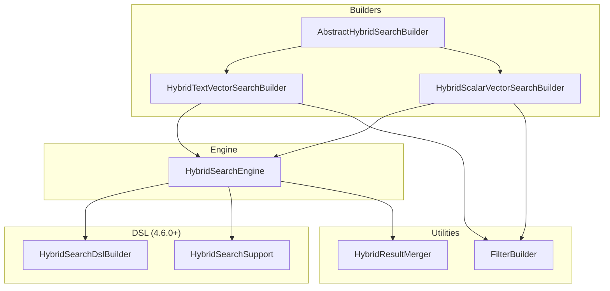
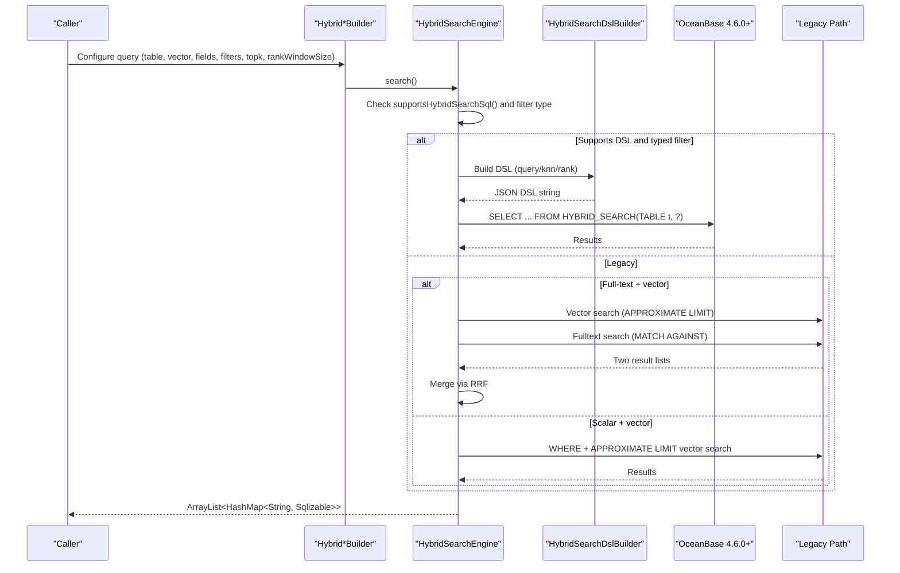
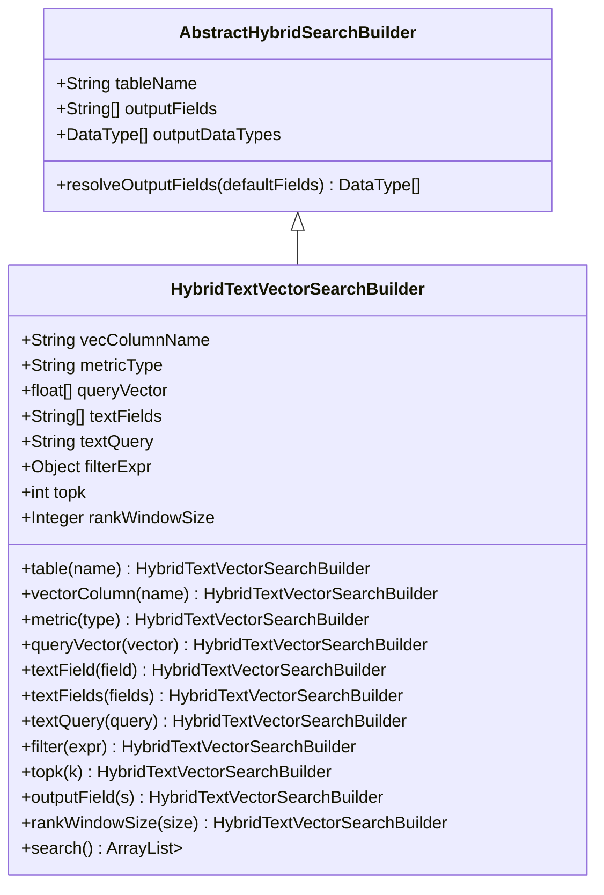
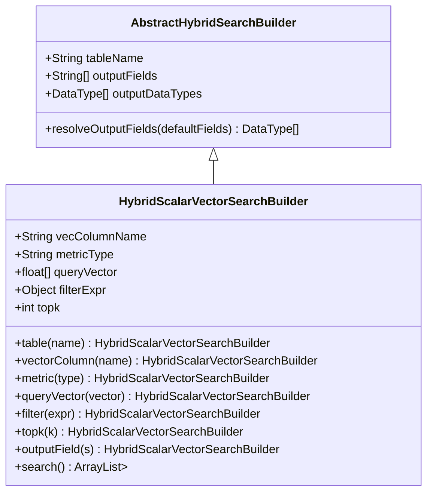
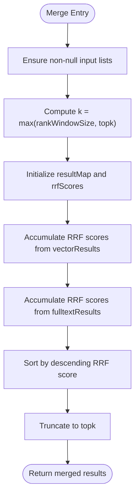
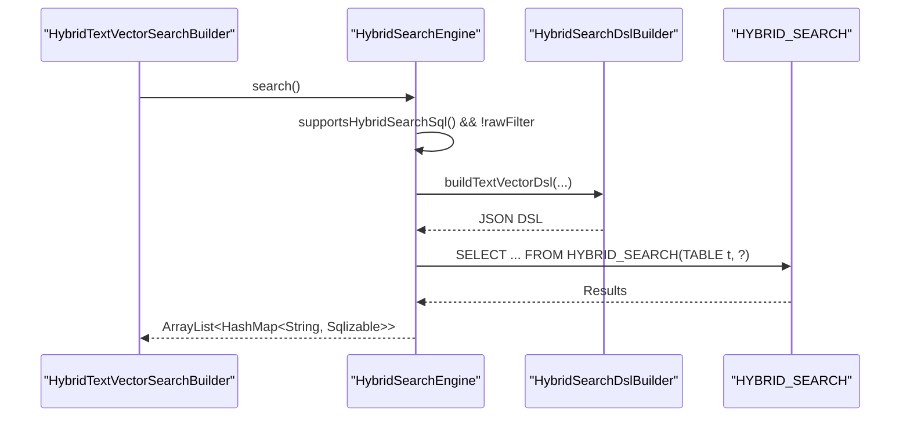
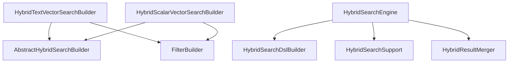

# Hybrid Search Operations

<cite>
**Referenced Files in This Document**
- [HybridTextVectorSearchBuilder.java](file://src/main/java/com/oceanbase/obvector4j/hybrid/HybridTextVectorSearchBuilder.java)
- [HybridScalarVectorSearchBuilder.java](file://src/main/java/com/oceanbase/obvector4j/hybrid/HybridScalarVectorSearchBuilder.java)
- [AbstractHybridSearchBuilder.java](file://src/main/java/com/oceanbase/obvector4j/hybrid/AbstractHybridSearchBuilder.java)
- [HybridResultMerger.java](file://src/main/java/com/oceanbase/obvector4j/hybrid/HybridResultMerger.java)
- [HybridSearchEngine.java](file://src/main/java/com/oceanbase/obvector4j/hybrid/HybridSearchEngine.java)
- [FilterBuilder.java](file://src/main/java/com/oceanbase/obvector4j/filter/FilterBuilder.java)
- [HybridSearchDslBuilder.java](file://src/main/java/com/oceanbase/obvector4j/hybrid/core/HybridSearchDslBuilder.java)
- [HybridSearchSupport.java](file://src/main/java/com/oceanbase/obvector4j/hybrid/core/HybridSearchSupport.java)
- [03-hybrid-search.md](file://docs/en/03-hybrid-search.md)
- [05-hybrid-search-dsl.md](file://docs/en/05-hybrid-search-dsl.md)
</cite>

## Table of Contents
1. [Introduction](#introduction)
2. [Project Structure](#project-structure)
3. [Core Components](#core-components)
4. [Architecture Overview](#architecture-overview)
5. [Detailed Component Analysis](#detailed-component-analysis)
6. [Dependency Analysis](#dependency-analysis)
7. [Performance Considerations](#performance-considerations)
8. [Troubleshooting Guide](#troubleshooting-guide)
9. [Conclusion](#conclusion)
10. [Appendices](#appendices)

## Introduction
This document explains hybrid search capabilities provided by the SDK, focusing on:
- Full-text + vector hybrid search via textVectorSearch()
- Scalar + vector hybrid search via scalarVectorSearch()
- Query composition with text fields, query strings, and filter expressions
- Result ranking algorithms and fusion strategies (RRF and weighted sum)
- Performance tuning parameters such as rank_window_size
- Practical examples for building complex queries, optimizing performance, and processing combined results
- Version compatibility, fallback mechanisms, and debugging techniques

The SDK automatically selects the best execution path based on the connected OceanBase version:
- 4.6.0+: native HYBRID_SEARCH SQL with JSON DSL
- Legacy (< 4.6.0): dual-query with client-side RRF merging or WHERE + APPROXIMATE LIMIT vector search

## Project Structure
The hybrid search feature is implemented across builder classes, a central engine, and optional DSL builders for 4.6.0+. The key components are:
- Builders: fluent APIs to configure queries
- Engine: routes to native DSL or legacy paths
- DSL Builder: constructs JSON DSL for 4.6.0+
- Support utilities: version gating, result merging, output field validation

**Diagram sources**
- [HybridTextVectorSearchBuilder.java](file://src/main/java/com/oceanbase/obvector4j/hybrid/HybridTextVectorSearchBuilder.java)
- [HybridScalarVectorSearchBuilder.java](file://src/main/java/com/oceanbase/obvector4j/hybrid/HybridScalarVectorSearchBuilder.java)
- [AbstractHybridSearchBuilder.java](file://src/main/java/com/oceanbase/obvector4j/hybrid/AbstractHybridSearchBuilder.java)
- [HybridSearchEngine.java](file://src/main/java/com/oceanbase/obvector4j/hybrid/HybridSearchEngine.java)
- [HybridSearchDslBuilder.java](file://src/main/java/com/oceanbase/obvector4j/hybrid/core/HybridSearchDslBuilder.java)
- [HybridSearchSupport.java](file://src/main/java/com/oceanbase/obvector4j/hybrid/core/HybridSearchSupport.java)
- [HybridResultMerger.java](file://src/main/java/com/oceanbase/obvector4j/hybrid/HybridResultMerger.java)
- [FilterBuilder.java](file://src/main/java/com/oceanbase/obvector4j/filter/FilterBuilder.java)

**Section sources**
- [HybridTextVectorSearchBuilder.java](file://src/main/java/com/oceanbase/obvector4j/hybrid/HybridTextVectorSearchBuilder.java)
- [HybridScalarVectorSearchBuilder.java](file://src/main/java/com/oceanbase/obvector4j/hybrid/HybridScalarVectorSearchBuilder.java)
- [AbstractHybridSearchBuilder.java](file://src/main/java/com/oceanbase/obvector4j/hybrid/AbstractHybridSearchBuilder.java)
- [HybridSearchEngine.java](file://src/main/java/com/oceanbase/obvector4j/hybrid/HybridSearchEngine.java)
- [HybridSearchDslBuilder.java](file://src/main/java/com/oceanbase/obvector4j/hybrid/core/HybridSearchDslBuilder.java)
- [HybridSearchSupport.java](file://src/main/java/com/oceanbase/obvector4j/hybrid/core/HybridSearchSupport.java)
- [HybridResultMerger.java](file://src/main/java/com/oceanbase/obvector4j/hybrid/HybridResultMerger.java)
- [FilterBuilder.java](file://src/main/java/com/oceanbase/obvector4j/filter/FilterBuilder.java)

## Core Components
- HybridTextVectorSearchBuilder: Configures full-text + vector hybrid search, including text fields, text query, metric, filters, topk, output fields, and rank window size.
- HybridScalarVectorSearchBuilder: Configures scalar + vector hybrid search, including vector column, metric, filters, topk, and output fields.
- AbstractHybridSearchBuilder: Shared utilities for output field resolution and type inference.
- HybridSearchEngine: Central orchestrator that chooses between native HYBRID_SEARCH SQL (4.6.0+) and legacy paths; executes queries and merges results when needed.
- HybridSearchDslBuilder: Builds JSON DSL for 4.6.0+ HYBRID_SEARCH queries.
- HybridSearchSupport: Enforces minimum version requirement for DSL usage.
- HybridResultMerger: Implements Reciprocal Rank Fusion (RRF) for legacy full-text + vector merging.
- FilterBuilder: Fluent API to construct typed filter expressions used in both hybrid modes.

Key behaviors:
- Version-aware routing: If the server supports HYBRID_SEARCH SQL and filters are not raw strings, use DSL; otherwise fall back to legacy logic.
- Output field handling: Auto-infer types if not explicitly provided; validate non-empty fields.
- Ranking and fusion: Native RRF or weighted_sum via DSL; legacy mode uses client-side RRF.

**Section sources**
- [HybridTextVectorSearchBuilder.java](file://src/main/java/com/oceanbase/obvector4j/hybrid/HybridTextVectorSearchBuilder.java)
- [HybridScalarVectorSearchBuilder.java](file://src/main/java/com/oceanbase/obvector4j/hybrid/HybridScalarVectorSearchBuilder.java)
- [AbstractHybridSearchBuilder.java](file://src/main/java/com/oceanbase/obvector4j/hybrid/AbstractHybridSearchBuilder.java)
- [HybridSearchEngine.java](file://src/main/java/com/oceanbase/obvector4j/hybrid/HybridSearchEngine.java)
- [HybridSearchDslBuilder.java](file://src/main/java/com/oceanbase/obvector4j/hybrid/core/HybridSearchDslBuilder.java)
- [HybridSearchSupport.java](file://src/main/java/com/oceanbase/obvector4j/hybrid/core/HybridSearchSupport.java)
- [HybridResultMerger.java](file://src/main/java/com/oceanbase/obvector4j/hybrid/HybridResultMerger.java)
- [FilterBuilder.java](file://src/main/java/com/oceanbase/obvector4j/filter/FilterBuilder.java)

## Architecture Overview
The system provides two primary entry points through the ObVecClient:
- textVectorSearch(): Full-text + vector hybrid search
- scalarVectorSearch(): Scalar + vector hybrid search

Routing logic:
- If server supports HYBRID_SEARCH SQL (≥ 4.6.0) and filters are typed (not raw strings), build DSL and execute via HYBRID_SEARCH(TABLE ..., 'dsl_json').
- Otherwise, use legacy paths:
  - Full-text + vector: dual queries (fulltext and vector) merged with client-side RRF
  - Scalar + vector: WHERE clause + APPROXIMATE LIMIT vector search

**Diagram sources**
- [HybridSearchEngine.java](file://src/main/java/com/oceanbase/obvector4j/hybrid/HybridSearchEngine.java)
- [HybridSearchDslBuilder.java](file://src/main/java/com/oceanbase/obvector4j/hybrid/core/HybridSearchDslBuilder.java)
- [HybridResultMerger.java](file://src/main/java/com/oceanbase/obvector4j/hybrid/HybridResultMerger.java)

**Section sources**
- [HybridSearchEngine.java](file://src/main/java/com/oceanbase/obvector4j/hybrid/HybridSearchEngine.java)
- [03-hybrid-search.md](file://docs/en/03-hybrid-search.md)

## Detailed Component Analysis

### Full-Text + Vector Hybrid Search (textVectorSearch)
Purpose: Combine keyword-based full-text search with semantic vector similarity using RRF fusion.

Configuration options:
- table(tableName)
- vectorColumn(vecColumnName)
- metric(metricType)
- queryVector(float[])
- textField(textField) / textFields(String...)
- textQuery(String)
- filter(Filter or String)
- topk(int)
- outputField(s) with optional DataType[]
- rankWindowSize(Integer)

Behavior:
- On 4.6.0+ with typed filters: builds DSL with query (match/multi_match), knn, and rrf; executes via HYBRID_SEARCH SQL.
- Legacy: runs separate fulltext and vector queries, then merges using RRF with rank_window_size control.

Ranking and fusion:
- Native RRF via DSL with configurable rank_window_size and constant.
- Legacy RRF: score = sum(1/(k + rank)) per row, where k is rank_window_size or defaults to topk.

Output fields:
- Auto-inferred types if not specified; validated to be non-empty.

Example usage patterns:
- Basic full-text + vector search
- With scalar filters applied to both text and vector branches
- Specifying output fields and data types
- Tuning rank_window_size for broader candidate pool before fusion

**Section sources**
- [HybridTextVectorSearchBuilder.java](file://src/main/java/com/oceanbase/obvector4j/hybrid/HybridTextVectorSearchBuilder.java)
- [HybridSearchEngine.java](file://src/main/java/com/oceanbase/obvector4j/hybrid/HybridSearchEngine.java)
- [HybridSearchDslBuilder.java](file://src/main/java/com/oceanbase/obvector4j/hybrid/core/HybridSearchDslBuilder.java)
- [HybridResultMerger.java](file://src/main/java/com/oceanbase/obvector4j/hybrid/HybridResultMerger.java)
- [03-hybrid-search.md](file://docs/en/03-hybrid-search.md)

#### Class Diagram: Text Vector Search Builder

**Diagram sources**
- [AbstractHybridSearchBuilder.java](file://src/main/java/com/oceanbase/obvector4j/hybrid/AbstractHybridSearchBuilder.java)
- [HybridTextVectorSearchBuilder.java](file://src/main/java/com/oceanbase/obvector4j/hybrid/HybridTextVectorSearchBuilder.java)

### Scalar + Vector Hybrid Search (scalarVectorSearch)
Purpose: Apply structured scalar filters alongside vector similarity search.

Configuration options:
- table(tableName)
- vectorColumn(vecColumnName)
- metric(metricType)
- queryVector(float[])
- filter(Filter or String)
- topk(int)
- outputField(s) with optional DataType[]

Behavior:
- On 4.6.0+ with typed filters: builds DSL with knn and filter; executes via HYBRID_SEARCH SQL.
- Legacy: applies WHERE clause from filter and performs vector search with APPROXIMATE LIMIT.

Output fields:
- Must be set; auto-inferred types if not provided.

Example usage patterns:
- Range queries on numeric fields
- Equality and IN conditions
- Combining multiple filters with AND/OR

**Section sources**
- [HybridScalarVectorSearchBuilder.java](file://src/main/java/com/oceanbase/obvector4j/hybrid/HybridScalarVectorSearchBuilder.java)
- [HybridSearchEngine.java](file://src/main/java/com/oceanbase/obvector4j/hybrid/HybridSearchEngine.java)
- [HybridSearchDslBuilder.java](file://src/main/java/com/oceanbase/obvector4j/hybrid/core/HybridSearchDslBuilder.java)
- [03-hybrid-search.md](file://docs/en/03-hybrid-search.md)

#### Class Diagram: Scalar Vector Search Builder

**Diagram sources**
- [AbstractHybridSearchBuilder.java](file://src/main/java/com/oceanbase/obvector4j/hybrid/AbstractHybridSearchBuilder.java)
- [HybridScalarVectorSearchBuilder.java](file://src/main/java/com/oceanbase/obvector4j/hybrid/HybridScalarVectorSearchBuilder.java)

### Result Merging and Ranking Algorithms
Reciprocal Rank Fusion (RRF):
- Used in legacy full-text + vector mode to combine independent rankings into a unified order.
- Score formula: sum over result lists of 1/(k + rank), where k is rank_window_size or default topk.
- Rows are deduplicated by first output field value; final list truncated to topk.

Native fusion (4.6.0+):
- RRF configured via DSL with rank_window_size and rank_constant.
- Weighted sum fusion available with normalizer options (e.g., minmax).

**Diagram sources**
- [HybridResultMerger.java](file://src/main/java/com/oceanbase/obvector4j/hybrid/HybridResultMerger.java)

**Section sources**
- [HybridResultMerger.java](file://src/main/java/com/oceanbase/obvector4j/hybrid/HybridResultMerger.java)
- [HybridSearchEngine.java](file://src/main/java/com/oceanbase/obvector4j/hybrid/HybridSearchEngine.java)
- [05-hybrid-search-dsl.md](file://docs/en/05-hybrid-search-dsl.md)

### DSL Construction for 4.6.0+
The DSL builder creates JSON documents for HYBRID_SEARCH:
- Scalar + vector: knn with filter and size
- Full-text + vector: query (match/multi_match), knn with filter, rrf, size

Default constants:
- RRF rank constant: 60
- Default rank_window_size: topk (or explicit rankWindowSize)

**Diagram sources**
- [HybridSearchEngine.java](file://src/main/java/com/oceanbase/obvector4j/hybrid/HybridSearchEngine.java)
- [HybridSearchDslBuilder.java](file://src/main/java/com/oceanbase/obvector4j/hybrid/core/HybridSearchDslBuilder.java)

**Section sources**
- [HybridSearchDslBuilder.java](file://src/main/java/com/oceanbase/obvector4j/hybrid/core/HybridSearchDslBuilder.java)
- [05-hybrid-search-dsl.md](file://docs/en/05-hybrid-search-dsl.md)

## Dependency Analysis
Key dependencies and relationships:
- Builders depend on AbstractHybridSearchBuilder for shared output field handling.
- HybridSearchEngine depends on:
  - HybridSearchDslBuilder for DSL construction
  - HybridSearchSupport for version gating
  - HybridResultMerger for legacy RRF merging
  - FilterBuilder for typed filters
- FilterBuilder composes Filter objects used in both hybrid modes.

**Diagram sources**
- [HybridTextVectorSearchBuilder.java](file://src/main/java/com/oceanbase/obvector4j/hybrid/HybridTextVectorSearchBuilder.java)
- [HybridScalarVectorSearchBuilder.java](file://src/main/java/com/oceanbase/obvector4j/hybrid/HybridScalarVectorSearchBuilder.java)
- [AbstractHybridSearchBuilder.java](file://src/main/java/com/oceanbase/obvector4j/hybrid/AbstractHybridSearchBuilder.java)
- [HybridSearchEngine.java](file://src/main/java/com/oceanbase/obvector4j/hybrid/HybridSearchEngine.java)
- [HybridSearchDslBuilder.java](file://src/main/java/com/oceanbase/obvector4j/hybrid/core/HybridSearchDslBuilder.java)
- [HybridSearchSupport.java](file://src/main/java/com/oceanbase/obvector4j/hybrid/core/HybridSearchSupport.java)
- [HybridResultMerger.java](file://src/main/java/com/oceanbase/obvector4j/hybrid/HybridResultMerger.java)
- [FilterBuilder.java](file://src/main/java/com/oceanbase/obvector4j/filter/FilterBuilder.java)

**Section sources**
- [HybridSearchEngine.java](file://src/main/java/com/oceanbase/obvector4j/hybrid/HybridSearchEngine.java)
- [HybridSearchDslBuilder.java](file://src/main/java/com/oceanbase/obvector4j/hybrid/core/HybridSearchDslBuilder.java)
- [HybridSearchSupport.java](file://src/main/java/com/oceanbase/obvector4j/hybrid/core/HybridSearchSupport.java)
- [HybridResultMerger.java](file://src/main/java/com/oceanbase/obvector4j/hybrid/HybridResultMerger.java)
- [FilterBuilder.java](file://src/main/java/com/oceanbase/obvector4j/filter/FilterBuilder.java)

## Performance Considerations
- Metric selection: Choose appropriate distance metrics (cosine, l2, ip) based on embedding characteristics.
- TopK sizing: Larger topk increases recall but may reduce latency; balance with application needs.
- Rank window size: For RRF, rank_window_size should be >= topk to improve fusion quality; larger windows consider more candidates.
- Indexing: Ensure vector indexes exist on vector columns and full-text indexes on text fields.
- Output fields: Specify only necessary fields to reduce payload size and improve throughput.
- Filter efficiency: Use indexed scalar fields in filters; avoid overly complex predicates.
- Native vs legacy: Prefer 4.6.0+ native HYBRID_SEARCH for better optimization and fused scoring.

[No sources needed since this section provides general guidance]

## Troubleshooting Guide
Common issues and diagnostics:
- Version mismatch: HYBRID_SEARCH DSL requires OceanBase ≥ 4.6.0; below this, DSL calls will throw an unsupported operation exception.
- Missing indexes: Ensure vector and full-text indexes are created and built before querying.
- Empty output fields: Output fields must be non-empty; auto-inference validates and infers types.
- Raw filter strings: Using raw string filters bypasses DSL path; prefer typed Filter objects for optimal behavior.
- Fulltext failures: In legacy mode, fulltext search errors return empty results with warnings; verify full-text index configuration.

Debugging steps:
- Inspect DSL JSON using customSearch().buildDsl() to validate structure.
- Verify server version with supportsHybridSearchSql().
- Review error messages and logs for missing indexes or invalid configurations.

**Section sources**
- [HybridSearchSupport.java](file://src/main/java/com/oceanbase/obvector4j/hybrid/core/HybridSearchSupport.java)
- [HybridSearchEngine.java](file://src/main/java/com/oceanbase/obvector4j/hybrid/HybridSearchEngine.java)
- [03-hybrid-search.md](file://docs/en/03-hybrid-search.md)
- [05-hybrid-search-dsl.md](file://docs/en/05-hybrid-search-dsl.md)

## Conclusion
The SDK provides robust hybrid search capabilities combining full-text and vector searches, as well as scalar and vector searches. It intelligently routes queries to native HYBRID_SEARCH SQL on 4.6.0+ or falls back to legacy paths with client-side RRF. Users can tune performance via topk and rank_window_size, choose appropriate metrics, and leverage typed filters for efficient execution. Proper indexing and careful query design ensure high-quality, relevant results.

[No sources needed since this section summarizes without analyzing specific files]

## Appendices

### Practical Examples

- Building complex hybrid queries:
  - Full-text + vector with multi-field match and scalar filters
  - Scalar + vector with range queries and boolean combinations
- Optimizing search performance:
  - Select suitable metrics and indices
  - Adjust topk and rank_window_size
  - Limit output fields
- Processing combined results:
  - Iterate over ArrayList<HashMap<String, Sqlizable>>
  - Convert Sqlizable values to application types

For detailed examples and DSL syntax, refer to the documentation links below.

**Section sources**
- [03-hybrid-search.md](file://docs/en/03-hybrid-search.md)
- [05-hybrid-search-dsl.md](file://docs/en/05-hybrid-search-dsl.md)