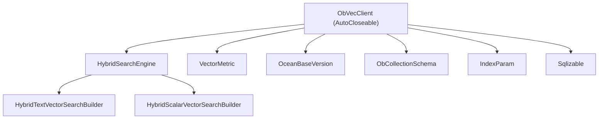
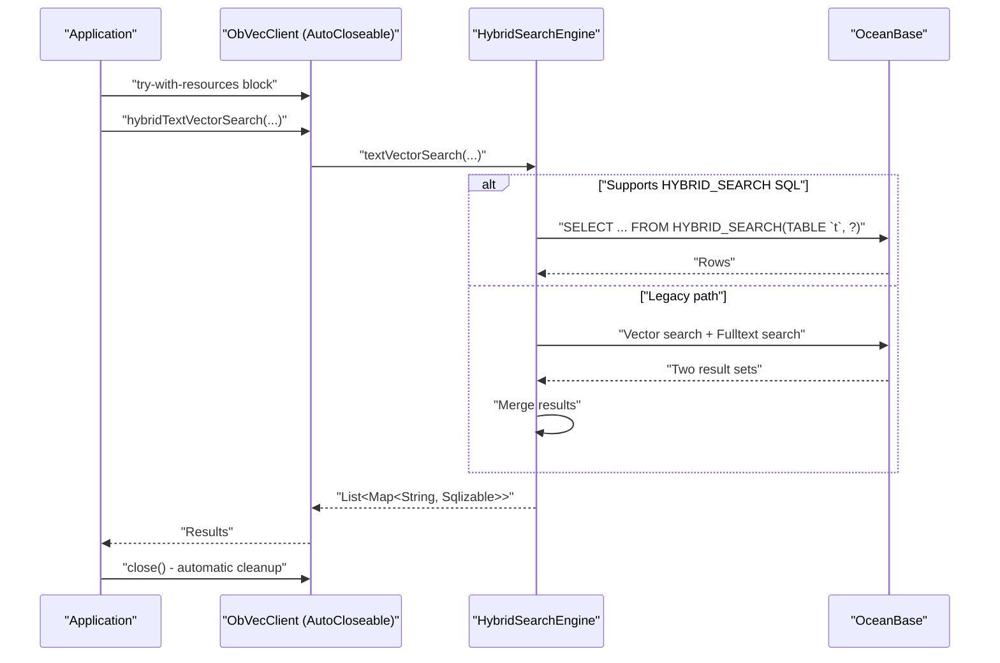
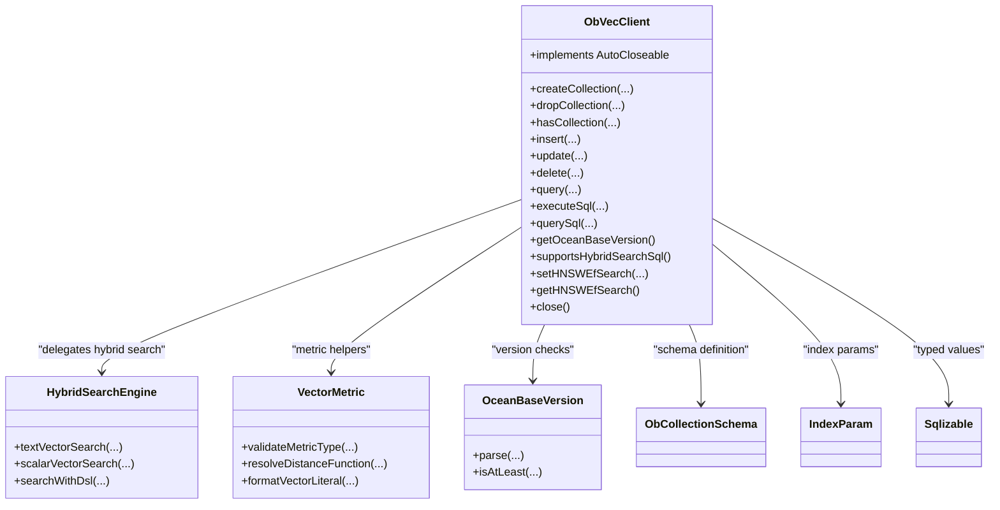

# ObVecClient - Primary Client Interface

<cite>
**Referenced Files in This Document**
- [ObVecClient.java](file://src/main/java/com/oceanbase/obvector4j/ObVecClient.java)
- [HybridSearchEngine.java](file://src/main/java/com/oceanbase/obvector4j/hybrid/HybridSearchEngine.java)
- [HybridTextVectorSearchBuilder.java](file://src/main/java/com/oceanbase/obvector4j/hybrid/HybridTextVectorSearchBuilder.java)
- [HybridScalarVectorSearchBuilder.java](file://src/main/java/com/oceanbase/obvector4j/hybrid/HybridScalarVectorSearchBuilder.java)
- [IndexParam.java](file://src/main/java/com/oceanbase/obvector4j/schema/IndexParam.java)
- [ObCollectionSchema.java](file://src/main/java/com/oceanbase/obvector4j/schema/ObCollectionSchema.java)
- [Sqlizable.java](file://src/main/java/com/oceanbase/obvector4j/model/Sqlizable.java)
- [VectorMetric.java](file://src/main/java/com/oceanbase/obvector4j/util/VectorMetric.java)
- [OceanBaseVersion.java](file://src/main/java/com/oceanbase/obvector4j/version/OceanBaseVersion.java)
- [README.md](file://README.md)
- [VecClientTest.java](file://src/test/java/com/oceanbase/obvector4j/integration/container/VecClientTest.java)
</cite>

## Update Summary
**Changes Made**
- Added comprehensive documentation for the new `update()` method in the data operations section
- Enhanced data manipulation operations section to include bulk update capabilities
- Updated practical examples to demonstrate update workflow alongside insert, delete, and query operations
- Added performance considerations for bulk update operations with JDBC batch processing

## Table of Contents
1. Introduction
2. Project Structure
3. Core Components
4. Architecture Overview
5. Detailed Component Analysis
6. Dependency Analysis
7. Performance Considerations
8. Resource Management Best Practices
9. Troubleshooting Guide
10. Conclusion

## Introduction
ObVecClient is the primary entry point for all OceanBase vector operations in this SDK. It provides:
- Connection management to an OceanBase MySQL-mode database via JDBC
- Collection (table) lifecycle methods for vector tables
- Data manipulation APIs for batch insert, **bulk update**, bulk delete, and vector similarity search
- Hybrid search capabilities combining full-text or scalar filters with vector search
- Direct SQL execution helpers for DDL/DML and SELECT queries
- Version detection and feature gating for HYBRID_SEARCH SQL support
- HNSW index configuration through ef_search settings
- **AutoCloseable interface implementation for proper resource cleanup and try-with-resources usage**

This document focuses on the ObVecClient API surface, its usage patterns, error handling, performance considerations, and resource management best practices.

## Project Structure
The client resides at the root of the main package and delegates hybrid search logic to a dedicated engine. Supporting classes include schema definitions, model types, utility functions, and version detection.



**Diagram sources**
- [ObVecClient.java](file://src/main/java/com/oceanbase/obvector4j/ObVecClient.java)
- [HybridSearchEngine.java](file://src/main/java/com/oceanbase/obvector4j/hybrid/HybridSearchEngine.java)
- [HybridTextVectorSearchBuilder.java](file://src/main/java/com/oceanbase/obvector4j/hybrid/HybridTextVectorSearchBuilder.java)
- [HybridScalarVectorSearchBuilder.java](file://src/main/java/com/oceanbase/obvector4j/hybrid/HybridScalarVectorSearchBuilder.java)
- [VectorMetric.java](file://src/main/java/com/oceanbase/obvector4j/util/VectorMetric.java)
- [OceanBaseVersion.java](file://src/main/java/com/oceanbase/obvector4j/version/OceanBaseVersion.java)
- [ObCollectionSchema.java](file://src/main/java/com/oceanbase/obvector4j/schema/ObCollectionSchema.java)
- [IndexParam.java](file://src/main/java/com/oceanbase/obvector4j/schema/IndexParam.java)
- [Sqlizable.java](file://src/main/java/com/oceanbase/obvector4j/model/Sqlizable.java)

**Section sources**
- [README.md](file://README.md)
- [ObVecClient.java](file://src/main/java/com/oceanbase/obvector4j/ObVecClient.java)

## Core Components
- ObVecClient: Main client providing connection, collection CRUD, data operations including **bulk update**, hybrid search, SQL helpers, version checks, HNSW ef_search control, and **AutoCloseable resource management**.
- HybridSearchEngine: Executes hybrid search using either native HYBRID_SEARCH SQL (4.6.0+) or legacy fallback paths.
- Builders: Fluent builders for text-vector and scalar-vector hybrid searches.
- Schema and Models: ObCollectionSchema and IndexParam define table/index structures; Sqlizable represents typed values bound to JDBC.
- Utilities: VectorMetric maps metric names to distance functions and formats vector literals; OceanBaseVersion parses server versions for feature gates.

Key responsibilities:
- **Resource lifecycle**: constructor establishes JDBC connection; **AutoCloseable.close() method enables try-with-resources pattern**; internal Statement/ResultSet objects are closed per method via try-with-resources blocks.
- Collection management: createCollection(), dropCollection(), hasCollection()
- Data manipulation: insert() with **enhanced JDBC batch processing**, **update() for bulk updates**, delete(), query()
- Hybrid search: hybridTextVectorSearch(), hybridScalarVectorSearch(), plus fluent builders
- SQL execution: executeSql(), querySql()
- Version and features: getOceanBaseVersion(), supportsHybridSearchSql()
- HNSW tuning: setHNSWEfSearch(), getHNSWEfSearch()

**Section sources**
- [ObVecClient.java](file://src/main/java/com/oceanbase/obvector4j/ObVecClient.java)
- [HybridSearchEngine.java](file://src/main/java/com/oceanbase/obvector4j/hybrid/HybridSearchEngine.java)
- [HybridTextVectorSearchBuilder.java](file://src/main/java/com/oceanbase/obvector4j/hybrid/HybridTextVectorSearchBuilder.java)
- [HybridScalarVectorSearchBuilder.java](file://src/main/java/com/oceanbase/obvector4j/hybrid/HybridScalarVectorSearchBuilder.java)
- [ObCollectionSchema.java](file://src/main/java/com/oceanbase/obvector4j/schema/ObCollectionSchema.java)
- [IndexParam.java](file://src/main/java/com/oceanbase/obvector4j/schema/IndexParam.java)
- [Sqlizable.java](file://src/main/java/com/oceanbase/obvector4j/model/Sqlizable.java)
- [VectorMetric.java](file://src/main/java/com/oceanbase/obvector4j/util/VectorMetric.java)
- [OceanBaseVersion.java](file://src/main/java/com/oceanbase/obvector4j/version/OceanBaseVersion.java)

## Architecture Overview
ObVecClient encapsulates a JDBC Connection and delegates complex operations to specialized components. For hybrid search, it uses HybridSearchEngine which chooses between native HYBRID_SEARCH SQL (when supported) and legacy multi-step search with result merging.



**Diagram sources**
- [ObVecClient.java](file://src/main/java/com/oceanbase/obvector4j/ObVecClient.java)
- [HybridSearchEngine.java](file://src/main/java/com/oceanbase/obvector4j/hybrid/HybridSearchEngine.java)

## Detailed Component Analysis

### Connection Management and Resource Cleanup
- Constructor: Establishes a JDBC connection using uri, user, password. Throws Throwable if connection fails.
- **AutoCloseable Implementation**: Implements AutoCloseable interface with close() method for proper resource cleanup.
- **Try-with-resources Support**: Enables modern Java resource management patterns with automatic cleanup.
- Internal resource management: Methods use try-with-resources blocks to close Statement/ResultSet objects automatically.
- Connection lifecycle: The underlying Connection is managed by the client instance and closed when close() is called.

**Updated** Added AutoCloseable interface implementation and try-with-resources support for proper resource management.

Usage examples:
```java
// Modern approach with try-with-resources
try (ObVecClient client = new ObVecClient(uri, user, password)) {
    // Use client for all operations
    client.createCollection("my_table", schema);
    client.insert("my_table", columns, rows);
    // Automatic cleanup when block exits
} catch (SQLException e) {
    // Handle exception
}

// Traditional approach with explicit close
ObVecClient client = null;
try {
    client = new ObVecClient(uri, user, password);
    // Use client for all operations
} finally {
    if (client != null) {
        client.close();
    }
}
```

Best practice: Prefer try-with-resources pattern for automatic resource cleanup and better exception safety.

**Section sources**
- [ObVecClient.java:32-54](file://src/main/java/com/oceanbase/obvector4j/ObVecClient.java#L32-L54)

### Collection Management
- createCollection(table_name, collection): Creates a table based on ObCollectionSchema. Uses visitor pattern to generate column definitions and constraints.
- dropCollection(table_name): Drops a table if it exists.
- hasCollection(table_name): Checks existence via DatabaseMetaData.

Parameters:
- table_name: String
- collection: ObCollectionSchema containing fields and optional index parameters

Notes:
- Use IndexParam to configure HNSW index parameters such as m, ef_construction, ef_search, lib, and metric type.

Example references:
- [VecClientTest.java](file://src/test/java/com/oceanbase/obvector4j/integration/container/VecClientTest.java)

**Section sources**
- [ObVecClient.java](file://src/main/java/com/oceanbase/obvector4j/ObVecClient.java)
- [ObCollectionSchema.java](file://src/main/java/com/oceanbase/obvector4j/schema/ObCollectionSchema.java)
- [IndexParam.java](file://src/main/java/com/oceanbase/obvector4j/schema/IndexParam.java)
- [VecClientTest.java](file://src/test/java/com/oceanbase/obvector4j/integration/container/VecClientTest.java)

### Data Manipulation Operations
- insert(table_name, column_names, rows): **Enhanced with JDBC batch processing** for improved performance. Uses PreparedStatement with autocommit disabled during operation. Rows are instances of Sqlizable[]. Validates column count and rolls back on failure. **Uses addBatch() and executeBatch() for optimal throughput**.
- **update(table_name, column_names, values, primary_key_name, primary_keys)**: **New bulk update method** that efficiently updates multiple rows by primary key. Uses JDBC batch processing with PreparedStatement for optimal performance. Requires matching sizes between values and primary_keys arrays. Generates UPDATE statements with SET clauses for specified columns and WHERE conditions for primary keys.
- delete(table_name, primary_key_name, primary_keys): Bulk deletion by IN clause over primary keys.
- query(table_name, vec_col_name, metric_type, qv, topk, output_fields, output_datatypes, where_expr): Vector similarity search using approximate nearest neighbor with ORDER BY distance function and LIMIT. Supports optional WHERE expression.

Parameters:
- table_name: String
- vec_col_name: String
- metric_type: String ("l2", "cosine", "ip"/"inner_product")
- qv: float[] query vector
- topk: int
- output_fields: String[]
- output_datatypes: DataType[]
- where_expr: String (optional)
- **primary_key_name**: String (for update method)
- **values**: ArrayList<Sqlizable[]> (for update method)

**Updated** Added comprehensive bulk update functionality with the new update() method that provides efficient batch updates without requiring manual SQL construction.

Notes:
- Metric validation and literal formatting are handled by VectorMetric.
- Results are mapped into List<Map<String, Sqlizable>> according to output_datatypes.
- **Batch processing significantly improves insert and update performance for large datasets**.
- **Update method validates parameter sizes and throws IllegalArgumentException if values.size() != primary_keys.size()**.

Example usage:
```java
// Bulk update example
ArrayList<Sqlizable[]> updateValues = new ArrayList<>();
updateValues.add(new Sqlizable[]{new SqlText("Updated Name 1"), new SqlInteger(100)});
updateValues.add(new Sqlizable[]{new SqlText("Updated Name 2"), new SqlInteger(200)});

ArrayList<Sqlizable> primaryKeys = new ArrayList<>();
primaryKeys.add(new SqlInteger(1));
primaryKeys.add(new SqlInteger(2));

client.update("products", 
    new String[]{"name", "price"}, 
    updateValues, 
    "id", 
    primaryKeys);
```

**Section sources**
- [ObVecClient.java:165-204](file://src/main/java/com/oceanbase/obvector4j/ObVecClient.java#L165-L204)
- [ObVecClient.java:232-278](file://src/main/java/com/oceanbase/obvector4j/ObVecClient.java#L232-L278)
- [VectorMetric.java](file://src/main/java/com/oceanbase/obvector4j/util/VectorMetric.java)
- [Sqlizable.java](file://src/main/java/com/oceanbase/obvector4j/model/Sqlizable.java)
- [VecClientTest.java](file://src/test/java/com/oceanbase/obvector4j/integration/container/VecClientTest.java)

### Hybrid Search Capabilities
- hybridTextVectorSearch(...): Combines full-text search with vector similarity. Accepts filter expressions (Filter object or raw SQL string). On supported versions, builds HYBRID_SEARCH DSL and executes via native SQL; otherwise falls back to separate vector and fulltext queries and merges results.
- hybridScalarVectorSearch(...): Combines scalar filters with vector similarity. Similar version-aware behavior.

Builders:
- textVectorSearch(): Returns HybridTextVectorSearchBuilder for fluent construction.
- scalarVectorSearch(): Returns HybridScalarVectorSearchBuilder for fluent construction.

Filter expressions:
- Filter objects built via FilterBuilder provide type-safe conditions.
- Raw SQL strings can be passed when needed.

Result processing:
- Returns List<Map<String, Sqlizable>> with columns specified by outputFields and typed by outputDataTypes.

Example references:
- [README.md](file://README.md)
- [HybridTextVectorSearchBuilder.java](file://src/main/java/com/oceanbase/obvector4j/hybrid/HybridTextVectorSearchBuilder.java)
- [HybridScalarVectorSearchBuilder.java](file://src/main/java/com/oceanbase/obvector4j/hybrid/HybridScalarVectorSearchBuilder.java)
- [HybridSearchEngine.java](file://src/main/java/com/oceanbase/obvector4j/hybrid/HybridSearchEngine.java)

**Section sources**
- [ObVecClient.java](file://src/main/java/com/oceanbase/obvector4j/ObVecClient.java)
- [HybridSearchEngine.java](file://src/main/java/com/oceanbase/obvector4j/hybrid/HybridSearchEngine.java)
- [HybridTextVectorSearchBuilder.java](file://src/main/java/com/oceanbase/obvector4j/hybrid/HybridTextVectorSearchBuilder.java)
- [HybridScalarVectorSearchBuilder.java](file://src/main/java/com/oceanbase/obvector4j/hybrid/HybridScalarVectorSearchBuilder.java)
- [README.md](file://README.md)

### SQL Execution Methods
- executeSql(sql): Executes arbitrary SQL (DDL/DML). Validates non-empty input.
- querySql(sql): Executes SELECT and maps rows to List<Map<String, Sqlizable>>. Infers column types from JDBC metadata.

Notes:
- Prefer querySql for SELECT statements; use executeSql for other operations.
- Both methods validate inputs and handle resources safely with try-with-resources blocks.

**Section sources**
- [ObVecClient.java](file://src/main/java/com/oceanbase/obvector4j/ObVecClient.java)

### Version Detection and Feature Gates
- getOceanBaseVersion(): Detects server version using OB_VERSION() with fallback to VERSION(). Caches result after first call.
- supportsHybridSearchSql(): Returns true if connected cluster supports HYBRID_SEARCH SQL (minimum version defined internally).

Notes:
- Used by HybridSearchEngine to choose optimal execution path.

**Section sources**
- [ObVecClient.java](file://src/main/java/com/oceanbase/obvector4j/ObVecClient.java)
- [OceanBaseVersion.java](file://src/main/java/com/oceanbase/obvector4j/version/OceanBaseVersion.java)

### HNSW Index Configuration
- setHNSWEfSearch(val): Sets session variable ob_hnsw_ef_search to tune recall vs latency for HNSW ANN queries.
- getHNSWEfSearch(): Retrieves current value of ob_hnsw_ef_search.

Notes:
- Changes apply to the current session/connection.
- Useful for performance tuning; higher values increase accuracy at the cost of speed.

Example references:
- [VecClientTest.java](file://src/test/java/com/oceanbase/obvector4j/integration/container/VecClientTest.java)

**Section sources**
- [ObVecClient.java](file://src/main/java/com/oceanbase/obvector4j/ObVecClient.java)
- [VecClientTest.java](file://src/test/java/com/oceanbase/obvector4j/integration/container/VecClientTest.java)

### Practical Examples and Workflows
- Basic vector CRUD: Create collection, insert vectors, **update records**, query by similarity, delete by primary key, drop collection.
- **Bulk update workflow**: Prepare update values array with new field values, prepare corresponding primary keys array, then call update() method for efficient batch processing.
- Hybrid search: Use builder APIs to combine filters with vector search; specify output fields and types.
- Custom SQL: Use executeSql/querySql for ad-hoc operations.
- **Resource management**: Use try-with-resources for automatic cleanup.

References:
- [README.md](file://README.md)
- [VecClientTest.java](file://src/test/java/com/oceanbase/obvector4j/integration/container/VecClientTest.java)

**Section sources**
- [README.md](file://README.md)
- [VecClientTest.java](file://src/test/java/com/oceanbase/obvector4j/integration/container/VecClientTest.java)

## Dependency Analysis
ObVecClient depends on:
- JDBC driver for connection and statement execution
- HybridSearchEngine for advanced search orchestration
- VectorMetric for metric validation and literal formatting
- OceanBaseVersion for feature gating
- Schema and Model classes for table/index definitions and typed values



**Diagram sources**
- [ObVecClient.java](file://src/main/java/com/oceanbase/obvector4j/ObVecClient.java)
- [HybridSearchEngine.java](file://src/main/java/com/oceanbase/obvector4j/hybrid/HybridSearchEngine.java)
- [VectorMetric.java](file://src/main/java/com/oceanbase/obvector4j/util/VectorMetric.java)
- [OceanBaseVersion.java](file://src/main/java/com/oceanbase/obvector4j/version/OceanBaseVersion.java)
- [ObCollectionSchema.java](file://src/main/java/com/oceanbase/obvector4j/schema/ObCollectionSchema.java)
- [IndexParam.java](file://src/main/java/com/oceanbase/obvector4j/schema/IndexParam.java)
- [Sqlizable.java](file://src/main/java/com/oceanbase/obvector4j/model/Sqlizable.java)

**Section sources**
- [ObVecClient.java](file://src/main/java/com/oceanbase/obvector4j/ObVecClient.java)
- [HybridSearchEngine.java](file://src/main/java/com/oceanbase/obvector4j/hybrid/HybridSearchEngine.java)
- [VectorMetric.java](file://src/main/java/com/oceanbase/obvector4j/util/VectorMetric.java)
- [OceanBaseVersion.java](file://src/main/java/com/oceanbase/obvector4j/version/OceanBaseVersion.java)
- [ObCollectionSchema.java](file://src/main/java/com/oceanbase/obvector4j/schema/ObCollectionSchema.java)
- [IndexParam.java](file://src/main/java/com/oceanbase/obvector4j/schema/IndexParam.java)
- [Sqlizable.java](file://src/main/java/com/oceanbase/obvector4j/model/Sqlizable.java)

## Performance Considerations
- HNSW ef_search: Increase for better recall at the cost of latency; adjust per workload using setHNSWEfSearch/getHNSWEfSearch.
- Metric selection: Choose appropriate metric (l2, cosine, ip) based on embedding characteristics.
- Output fields: Minimize projected columns to reduce network overhead.
- **Enhanced batch inserts**: Use insert() with multiple rows to leverage **JDBC batch processing with addBatch() and executeBatch()** for optimal throughput.
- **Efficient bulk updates**: Use update() method for batch updates instead of individual UPDATE statements; leverages JDBC batch processing for significant performance improvements.
- Approximate search: query() uses APPROXIMATE LIMIT for efficient ANN retrieval; ensure indexes exist for large datasets.
- Version-aware execution: Native HYBRID_SEARCH SQL (4.6.0+) is more efficient than legacy fallback.
- **Resource management**: Use try-with-resources to prevent connection leaks and improve overall application performance.

## Resource Management Best Practices
**New Section**

### AutoCloseable Interface Usage
ObVecClient now implements AutoCloseable interface, enabling modern Java resource management patterns:

```java
// Recommended: try-with-resources pattern
try (ObVecClient client = new ObVecClient(uri, user, password)) {
    // All operations within this block
    client.createCollection("products", schema);
    client.insert("products", columns, rows);
    client.update("products", updateColumns, updateValues, "id", primaryKeys);
    ArrayList<HashMap<String, Sqlizable>> results = client.query(
        "products", "embedding", "l2", queryVector, 10,
        new String[]{"id", "name"}, 
        new DataType[]{DataType.INT32, DataType.VARCHAR}, null);
    // Automatic cleanup when block exits
} catch (SQLException e) {
    // Handle exceptions
}
```

### Benefits of AutoCloseable Implementation
- **Automatic resource cleanup**: JDBC connections are properly closed when the try-with-resources block exits
- **Exception safety**: Resources are cleaned up even if exceptions occur
- **Cleaner code**: Eliminates boilerplate finally blocks
- **Better memory management**: Prevents connection leaks in long-running applications

### Manual Resource Management
For cases where try-with-resources cannot be used:

```java
ObVecClient client = null;
try {
    client = new ObVecClient(uri, user, password);
    // Use client for operations
} finally {
    if (client != null) {
        try {
            client.close();
        } catch (SQLException e) {
            // Log but don't throw from finally block
            logger.error("Error closing client", e);
        }
    }
}
```

### Connection Pooling Integration
When using connection pooling libraries (HikariCP, Apache DBCP), consider:

```java
// With connection pooling
DataSource dataSource = getDataSource();
try (Connection conn = dataSource.getConnection()) {
    try (ObVecClient client = new ObVecClient(conn)) {
        // Use client - connection will be returned to pool
    }
}
```

**Section sources**
- [ObVecClient.java:32-54](file://src/main/java/com/oceanbase/obvector4j/ObVecClient.java#L32-L54)

## Troubleshooting Guide
Common issues and remedies:
- Connection failures: Verify JDBC URI, credentials, and network access.
- **Resource leaks**: Ensure ObVecClient instances are properly closed using try-with-resources or explicit close() calls.
- Unsupported metric: Ensure metric_type is one of l2, cosine, ip/inner_product.
- Column mismatch: In insert(), ensure row length matches column_names length.
- **Parameter size mismatch**: In update(), ensure values.size() equals primary_keys.size() or IllegalArgumentException will be thrown.
- Empty SQL: executeSql/querySql require non-empty SQL strings.
- Version incompatibility: If HYBRID_SEARCH SQL is unavailable, the engine falls back to legacy paths; verify server version.

Error handling patterns:
- Exceptions propagate as Throwable; inspect stack traces and messages.
- Transactions: insert() and update() disable autocommit during batch and rollback on errors.
- **Resource cleanup**: Always use try-with-resources to ensure proper cleanup even when exceptions occur.

**Section sources**
- [ObVecClient.java](file://src/main/java/com/oceanbase/obvector4j/ObVecClient.java)
- [VectorMetric.java](file://src/main/java/com/oceanbase/obvector4j/util/VectorMetric.java)

## Conclusion
ObVecClient offers a comprehensive interface for working with OceanBase vector capabilities, including collection management, data operations with **bulk update support**, hybrid search, direct SQL execution, version detection, and HNSW tuning. **With the addition of the new update() method for efficient bulk updates, AutoCloseable interface implementation, and enhanced batch processing capabilities**, developers can implement robust vector workflows with clear error handling, proper resource management, and optimized performance controls. The try-with-resources pattern ensures reliable resource cleanup, while JDBC batch processing significantly improves insert and update throughput for large datasets.