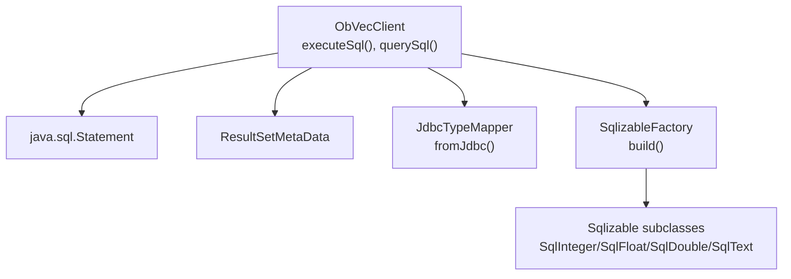
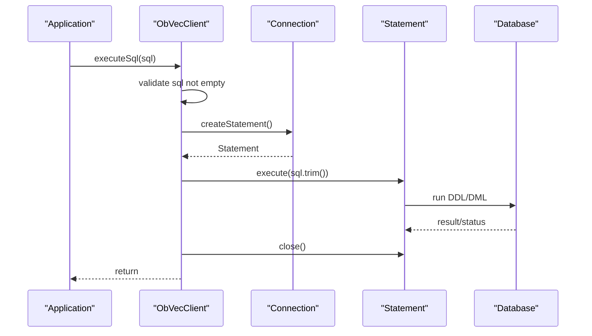
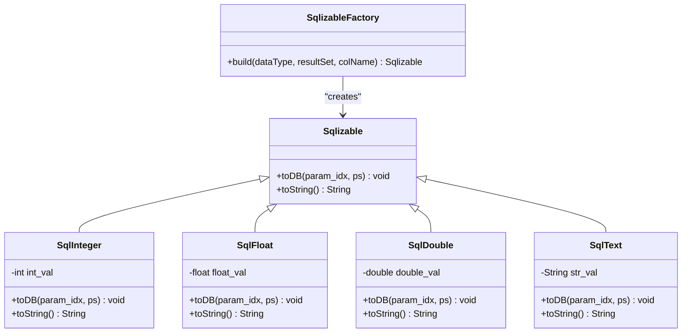
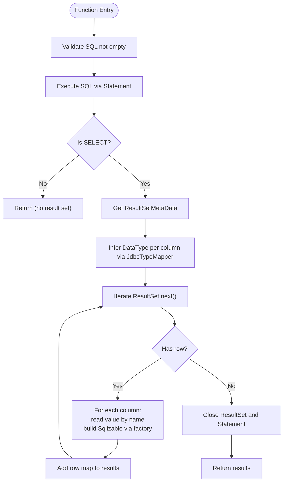
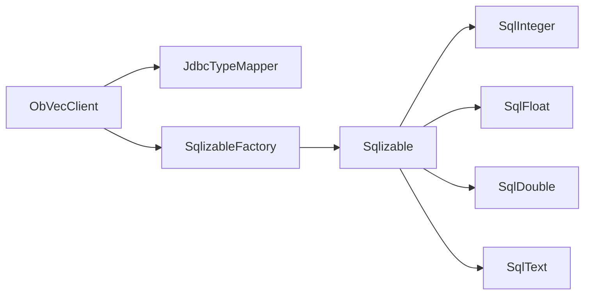

# SQL Execution

<cite>
**Referenced Files in This Document**
- [ObVecClient.java](file://src/main/java/com/oceanbase/obvector4j/ObVecClient.java)
- [Sqlizable.java](file://src/main/java/com/oceanbase/obvector4j/model/Sqlizable.java)
- [SqlizableFactory.java](file://src/main/java/com/oceanbase/obvector4j/model/SqlizableFactory.java)
- [JdbcTypeMapper.java](file://src/main/java/com/oceanbase/obvector4j/util/JdbcTypeMapper.java)
- [SqlInteger.java](file://src/main/java/com/oceanbase/obvector4j/model/SqlInteger.java)
- [SqlFloat.java](file://src/main/java/com/oceanbase/obvector4j/model/SqlFloat.java)
- [SqlDouble.java](file://src/main/java/com/oceanbase/obvector4j/model/SqlDouble.java)
- [SqlText.java](file://src/main/java/com/oceanbase/obvector4j/model/SqlText.java)
- [HybridSearchRemoteIT.java](file://src/test/java/com/oceanbase/obvector4j/integration/remote/HybridSearchRemoteIT.java)
</cite>

## Table of Contents
1. [Introduction](#introduction)
2. [Project Structure](#project-structure)
3. [Core Components](#core-components)
4. [Architecture Overview](#architecture-overview)
5. [Detailed Component Analysis](#detailed-component-analysis)
6. [Dependency Analysis](#dependency-analysis)
7. [Performance Considerations](#performance-considerations)
8. [Troubleshooting Guide](#troubleshooting-guide)
9. [Conclusion](#conclusion)
10. [Appendices](#appendices)

## Introduction
This document explains direct SQL execution methods executeSql() and querySql() provided by the client, focusing on:
- Arbitrary SQL statement execution for DDL/DML operations via executeSql()
- SELECT query execution with automatic type mapping via querySql()
- ResultSet processing and column metadata handling
- Sqlizable type conversion pipeline
- Security considerations (SQL injection prevention), parameter binding patterns, and performance implications
- Practical examples, error handling, transaction management, and best practices for raw SQL workflows

## Project Structure
The SQL execution capabilities are implemented in the main client class and supported by model and utility classes that handle type mapping and JDBC interactions.



**Diagram sources**
- [ObVecClient.java:509-557](file://src/main/java/com/oceanbase/obvector4j/ObVecClient.java#L509-L557)
- [JdbcTypeMapper.java:14-66](file://src/main/java/com/oceanbase/obvector4j/util/JdbcTypeMapper.java#L14-L66)
- [SqlizableFactory.java:8-38](file://src/main/java/com/oceanbase/obvector4j/model/SqlizableFactory.java#L8-L38)

**Section sources**
- [ObVecClient.java:509-557](file://src/main/java/com/oceanbase/obvector4j/ObVecClient.java#L509-L557)
- [JdbcTypeMapper.java:14-66](file://src/main/java/com/oceanbase/obvector4j/util/JdbcTypeMapper.java#L14-L66)
- [SqlizableFactory.java:8-38](file://src/main/java/com/oceanbase/obvector4j/model/SqlizableFactory.java#L8-L38)

## Core Components
- ObVecClient.executeSql(String): Executes arbitrary non-SELECT SQL statements (DDL/DML). It validates input, creates a Statement, executes the SQL, and closes resources safely.
- ObVecClient.querySql(String): Executes a SELECT statement, infers column types from JDBC metadata, maps each row to a map of column names to Sqlizable values, and returns a list of rows.
- JdbcTypeMapper.fromJdbc(int, String): Maps JDBC column type and type name to SDK DataType used by the factory.
- SqlizableFactory.build(DataType, ResultSet, String): Builds typed Sqlizable instances based on DataType and reads values from ResultSet using column names.
- Sqlizable subclasses: Provide safe parameter binding via PreparedStatement setters and string representations.

Key behaviors:
- Input validation rejects empty or null SQL strings.
- Resource management uses try-with-resources to ensure Statement and ResultSet are closed.
- Column metadata is read once per query to determine labels and types.
- Type inference relies on both JDBC type codes and database-specific type names.

**Section sources**
- [ObVecClient.java:509-557](file://src/main/java/com/oceanbase/obvector4j/ObVecClient.java#L509-L557)
- [JdbcTypeMapper.java:14-66](file://src/main/java/com/oceanbase/obvector4j/util/JdbcTypeMapper.java#L14-L66)
- [SqlizableFactory.java:8-38](file://src/main/java/com/oceanbase/obvector4j/model/SqlizableFactory.java#L8-L38)
- [Sqlizable.java:6-9](file://src/main/java/com/oceanbase/obvector4j/model/Sqlizable.java#L6-L9)
- [SqlInteger.java:6-22](file://src/main/java/com/oceanbase/obvector4j/model/SqlInteger.java#L6-L22)
- [SqlFloat.java:6-22](file://src/main/java/com/oceanbase/obvector4j/model/SqlFloat.java#L6-L22)
- [SqlDouble.java:6-23](file://src/main/java/com/oceanbase/obvector4j/model/SqlDouble.java#L6-L23)
- [SqlText.java:6-22](file://src/main/java/com/oceanbase/obvector4j/model/SqlText.java#L6-L22)

## Architecture Overview
The following sequence diagrams illustrate the runtime flows for executeSql() and querySql().



**Diagram sources**
- [ObVecClient.java:509-522](file://src/main/java/com/oceanbase/obvector4j/ObVecClient.java#L509-L522)

```mermaid
sequenceDiagram
participant App as "Application"
participant Client as "ObVecClient"
participant Conn as "Connection"
participant Stmt as "Statement"
participant RS as "ResultSet"
participant Meta as "ResultSetMetaData"
participant Mapper as "JdbcTypeMapper"
participant Factory as "SqlizableFactory"
participant DB as "Database"
App->>Client : querySql(sql)
Client->>Client : validate sql not empty
Client->>Conn : createStatement()
Conn-->>Client : Statement
Client->>Stmt : executeQuery(sql.trim())
Stmt->>DB : run SELECT
DB-->>Stmt : ResultSet
Client->>RS : getMetaData()
RS-->>Client : ResultSetMetaData
loop columns
Client->>Meta : getColumnLabel(i+1)
Client->>Meta : getColumnType(i+1)
Client->>Meta : getColumnTypeName(i+1)
Client->>Mapper : fromJdbc(typeCode, typeName)
Mapper-->>Client : DataType
end
loop rows
Client->>RS : next()
alt has row
loop columns
Client->>Factory : build(DataType, rs, columnName)
Factory-->>Client : Sqlizable
Client->>Client : put into row map
end
Client->>Client : add row to results
else no more rows
break
end
end
Client->>RS : close()
Client->>Stmt : close()
Client-->>App : List<Map<String, Sqlizable>>
```

**Diagram sources**
- [ObVecClient.java:527-557](file://src/main/java/com/oceanbase/obvector4j/ObVecClient.java#L527-L557)
- [JdbcTypeMapper.java:14-66](file://src/main/java/com/oceanbase/obvector4j/util/JdbcTypeMapper.java#L14-L66)
- [SqlizableFactory.java:8-38](file://src/main/java/com/oceanbase/obvector4j/model/SqlizableFactory.java#L8-L38)

## Detailed Component Analysis

### executeSql(String)
Purpose:
- Execute arbitrary SQL statements suitable for DDL/DML (e.g., CREATE TABLE, ALTER TABLE, INSERT, UPDATE, DELETE).
- Not intended for SELECT queries; use querySql() instead.

Behavior:
- Validates that the SQL string is not null or blank.
- Creates a Statement and executes the trimmed SQL.
- Ensures Statement is closed via try-with-resources.
- Propagates SQLException wrapped as Throwable.

Security:
- Accepts raw SQL; no internal escaping or parameterization.
- Caller must sanitize inputs and avoid string concatenation to prevent SQL injection.

Error Handling:
- Throws Throwable on any SQL execution failure.
- No automatic transaction control; behavior depends on connection autocommit state.

Best Practices:
- Use for one-off schema changes or administrative tasks.
- For repeated DML, prefer batched PreparedStatement usage outside this method.

**Section sources**
- [ObVecClient.java:509-522](file://src/main/java/com/oceanbase/obvector4j/ObVecClient.java#L509-L522)

### querySql(String)
Purpose:
- Execute SELECT statements and map results to strongly-typed Sqlizable objects.
- Automatically infers column types from JDBC metadata when not explicitly provided.

Processing Flow:
- Validates input SQL.
- Executes query and obtains ResultSet and ResultSetMetaData.
- Iterates columns to collect labels and infer DataType via JdbcTypeMapper.
- For each row, builds Sqlizable instances via SqlizableFactory using column names.
- Returns a list of maps where keys are column labels and values are Sqlizable instances.

Column Metadata Handling:
- Uses getColumnLabel(i+1) for stable naming (supports aliases).
- Infers DataType using both JDBC type code and database-specific type name.

Type Mapping:
- JdbcTypeMapper maps common numeric, floating-point, decimal, boolean, text, JSON, and vector-like types to SDK DataType.
- SqlizableFactory constructs appropriate Sqlizable subclass based on DataType and reads values from ResultSet by column name.

Return Model:
- ArrayList<HashMap<String, Sqlizable>> representing rows.
- Each Sqlizable supports toString() and can be bound back to PreparedStatement via toDB() if needed.

Error Handling:
- Throws Throwable on any SQL execution or metadata access failure.
- Resources are closed automatically via try-with-resources.

Usage Example Reference:
- See integration test usage of querySql() for practical patterns.

**Section sources**
- [ObVecClient.java:527-557](file://src/main/java/com/oceanbase/obvector4j/ObVecClient.java#L527-L557)
- [JdbcTypeMapper.java:14-66](file://src/main/java/com/oceanbase/obvector4j/util/JdbcTypeMapper.java#L14-L66)
- [SqlizableFactory.java:8-38](file://src/main/java/com/oceanbase/obvector4j/model/SqlizableFactory.java#L8-L38)
- [HybridSearchRemoteIT.java:212](file://src/test/java/com/oceanbase/obvector4j/integration/remote/HybridSearchRemoteIT.java#L212)

### Sqlizable Type Conversion Pipeline
Overview:
- Sqlizable is an abstract base providing toDB(int, PreparedStatement) and toString().
- Concrete implementations include integer, float, double, and text variants.
- SqlizableFactory selects the correct implementation based on DataType and reads values from ResultSet using column names.

Class Relationships:


**Diagram sources**
- [Sqlizable.java:6-9](file://src/main/java/com/oceanbase/obvector4j/model/Sqlizable.java#L6-L9)
- [SqlInteger.java:6-22](file://src/main/java/com/oceanbase/obvector4j/model/SqlInteger.java#L6-L22)
- [SqlFloat.java:6-22](file://src/main/java/com/oceanbase/obvector4j/model/SqlFloat.java#L6-L22)
- [SqlDouble.java:6-23](file://src/main/java/com/oceanbase/obvector4j/model/SqlDouble.java#L6-L23)
- [SqlText.java:6-22](file://src/main/java/com/oceanbase/obvector4j/model/SqlText.java#L6-L22)
- [SqlizableFactory.java:8-38](file://src/main/java/com/oceanbase/obvector4j/model/SqlizableFactory.java#L8-L38)

**Section sources**
- [Sqlizable.java:6-9](file://src/main/java/com/oceanbase/obvector4j/model/Sqlizable.java#L6-L9)
- [SqlizableFactory.java:8-38](file://src/main/java/com/oceanbase/obvector4j/model/SqlizableFactory.java#L8-L38)
- [SqlInteger.java:6-22](file://src/main/java/com/oceanbase/obvector4j/model/SqlInteger.java#L6-L22)
- [SqlFloat.java:6-22](file://src/main/java/com/oceanbase/obvector4j/model/SqlFloat.java#L6-L22)
- [SqlDouble.java:6-23](file://src/main/java/com/oceanbase/obvector4j/model/SqlDouble.java#L6-L23)
- [SqlText.java:6-22](file://src/main/java/com/oceanbase/obvector4j/model/SqlText.java#L6-L22)

### Data Flow and Processing Logic


**Diagram sources**
- [ObVecClient.java:527-557](file://src/main/java/com/oceanbase/obvector4j/ObVecClient.java#L527-L557)
- [JdbcTypeMapper.java:14-66](file://src/main/java/com/oceanbase/obvector4j/util/JdbcTypeMapper.java#L14-L66)
- [SqlizableFactory.java:8-38](file://src/main/java/com/oceanbase/obvector4j/model/SqlizableFactory.java#L8-L38)

## Dependency Analysis
- ObVecClient depends on:
  - java.sql.Connection, Statement, ResultSet, ResultSetMetaData for execution and metadata access.
  - JdbcTypeMapper for converting JDBC types to SDK DataType.
  - SqlizableFactory for constructing typed Sqlizable instances.
  - Sqlizable subclasses for consistent parameter binding and string representation.

Coupling and Cohesion:
- Low coupling between execution logic and type mapping; clear separation via mapper and factory.
- High cohesion within type mapping components.

External Dependencies:
- JDBC driver provides Connection and metadata.
- Database-specific type names influence mapping decisions.

Potential Circular Dependencies:
- None observed among analyzed components.

Integration Points:
- Existing SQL workflows can integrate by calling executeSql() for DDL/DML and querySql() for SELECTs.
- Returned Sqlizable values can be reused to bind parameters in subsequent PreparedStatements.



**Diagram sources**
- [ObVecClient.java:509-557](file://src/main/java/com/oceanbase/obvector4j/ObVecClient.java#L509-L557)
- [JdbcTypeMapper.java:14-66](file://src/main/java/com/oceanbase/obvector4j/util/JdbcTypeMapper.java#L14-L66)
- [SqlizableFactory.java:8-38](file://src/main/java/com/oceanbase/obvector4j/model/SqlizableFactory.java#L8-L38)
- [Sqlizable.java:6-9](file://src/main/java/com/oceanbase/obvector4j/model/Sqlizable.java#L6-L9)
- [SqlInteger.java:6-22](file://src/main/java/com/oceanbase/obvector4j/model/SqlInteger.java#L6-L22)
- [SqlFloat.java:6-22](file://src/main/java/com/oceanbase/obvector4j/model/SqlFloat.java#L6-L22)
- [SqlDouble.java:6-23](file://src/main/java/com/oceanbase/obvector4j/model/SqlDouble.java#L6-L23)
- [SqlText.java:6-22](file://src/main/java/com/oceanbase/obvector4j/model/SqlText.java#L6-L22)

**Section sources**
- [ObVecClient.java:509-557](file://src/main/java/com/oceanbase/obvector4j/ObVecClient.java#L509-L557)
- [JdbcTypeMapper.java:14-66](file://src/main/java/com/oceanbase/obvector4j/util/JdbcTypeMapper.java#L14-L66)
- [SqlizableFactory.java:8-38](file://src/main/java/com/oceanbase/obvector4j/model/SqlizableFactory.java#L8-L38)

## Performance Considerations
- executeSql():
  - Creates a new Statement per call; suitable for occasional DDL/DML.
  - Avoid large batches here; use batched PreparedStatement for high-throughput DML.
- querySql():
  - Reads ResultSetMetaData once and infers types per column; overhead is minimal compared to network I/O.
  - For large result sets, consider pagination or limiting rows at the SQL level.
  - Using column labels ensures alias support but adds minor overhead; acceptable for most workloads.
- Type mapping:
  - JdbcTypeMapper and SqlizableFactory are lightweight; cost is dominated by JDBC calls.
- Parameter binding:
  - Prefer PreparedStatement with ? placeholders for repeated executions to leverage server-side preparation and reduce parsing overhead.

[No sources needed since this section provides general guidance]

## Troubleshooting Guide
Common issues and resolutions:
- Empty or null SQL:
  - Both methods throw IllegalArgumentException for empty or null input. Ensure callers validate user-provided SQL.
- SQL Injection risks:
  - executeSql() accepts raw SQL; never concatenate untrusted inputs directly into SQL strings.
  - Use parameterized queries via PreparedStatement for dynamic values.
- Unexpected column types:
  - If inferred DataType does not match expectations, inspect database type names and adjust mappings in JdbcTypeMapper accordingly.
- Missing columns or aliases:
  - querySql() uses column labels; ensure SELECT lists provide explicit aliases when necessary.
- Transaction boundaries:
  - These methods do not manage transactions. Wrap multiple statements in explicit transactions using Connection.setAutoCommit(false), commit(), and rollback() as needed.

Error propagation:
- Methods throw Throwable wrapping underlying SQLException; catch and log appropriately in application code.

**Section sources**
- [ObVecClient.java:509-557](file://src/main/java/com/oceanbase/obvector4j/ObVecClient.java#L509-L557)

## Conclusion
executeSql() and querySql() provide straightforward entry points for raw SQL operations:
- executeSql() for DDL/DML without result sets
- querySql() for SELECT with automatic type mapping and Sqlizable results

Adopting these methods alongside PreparedStatement-based parameter binding, careful input validation, and explicit transaction management enables robust integration with existing SQL workflows while maintaining security and performance.

[No sources needed since this section summarizes without analyzing specific files]

## Appendices

### Practical Examples and Integration Patterns
- Executing custom DDL/DML:
  - Use executeSql() for schema changes or administrative commands.
  - Always validate and sanitize inputs; avoid string concatenation.
- Handling result sets:
  - Use querySql() to retrieve rows as List<Map<String, Sqlizable>>.
  - Iterate over rows and access Sqlizable values via toString() or toDB() for further binding.
- Integrating with existing workflows:
  - Combine executeSql() for setup and querySql() for data retrieval.
  - For complex multi-step operations, manage transactions explicitly around your own PreparedStatement usage.

Reference usage:
- See integration tests demonstrating querySql() usage.

**Section sources**
- [HybridSearchRemoteIT.java:212](file://src/test/java/com/oceanbase/obvector4j/integration/remote/HybridSearchRemoteIT.java#L212)