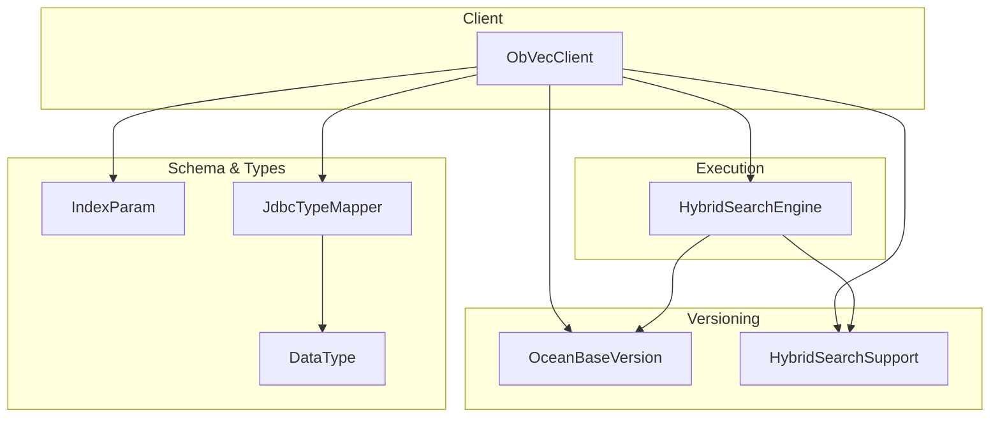
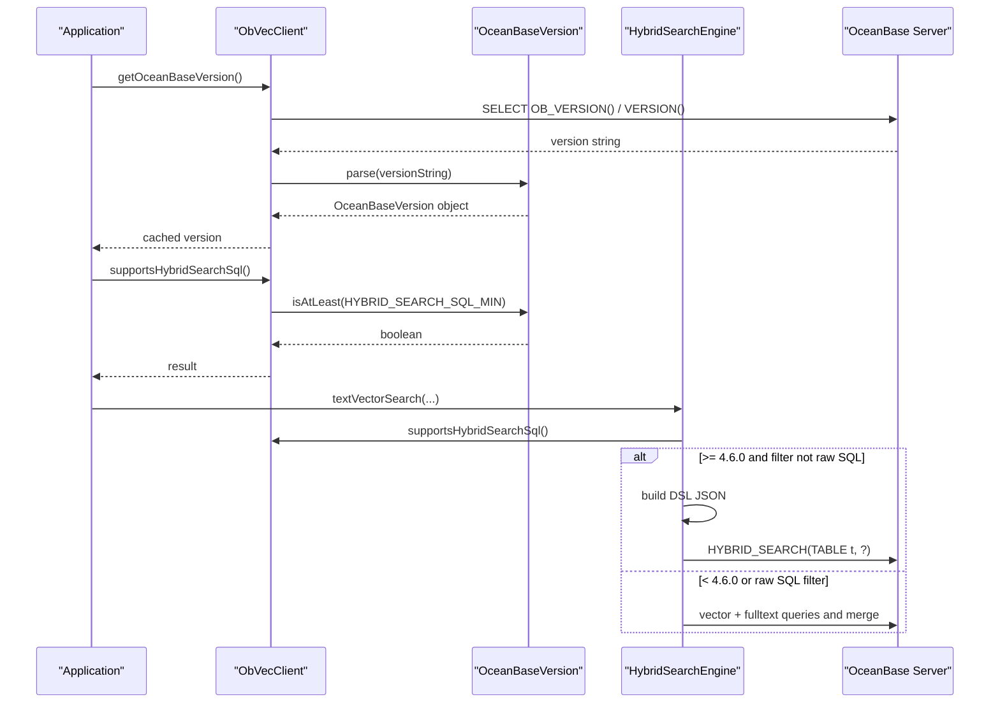
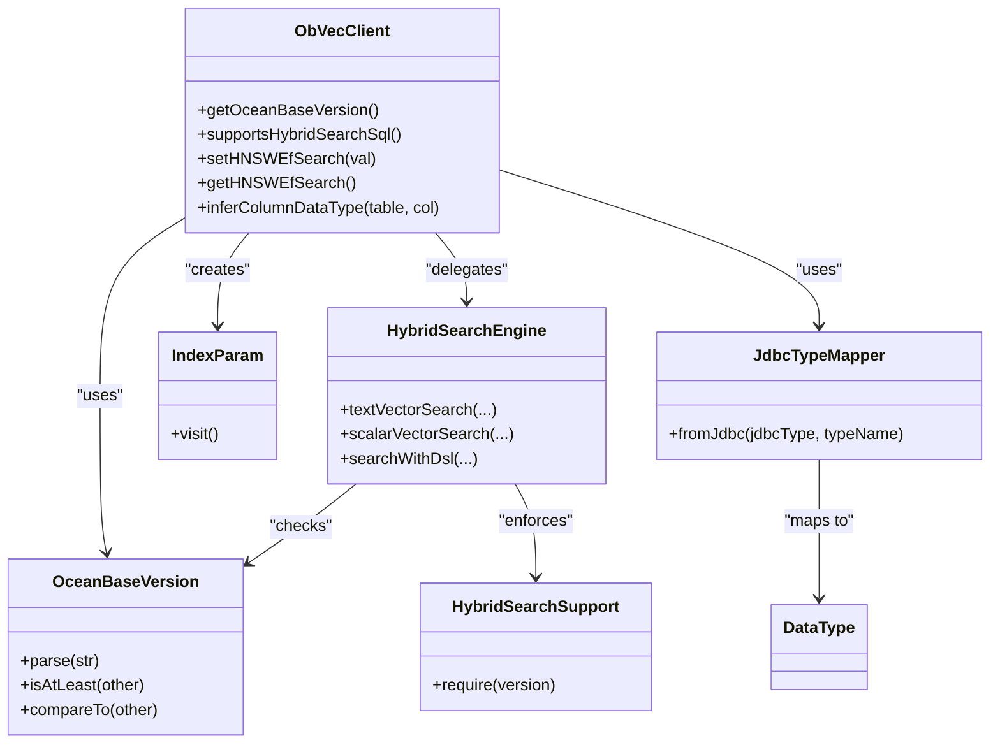

# Utility Methods

<cite>
**Referenced Files in This Document**
- [ObVecClient.java](file://src/main/java/com/oceanbase/obvector4j/ObVecClient.java)
- [OceanBaseVersion.java](file://src/main/java/com/oceanbase/obvector4j/version/OceanBaseVersion.java)
- [HybridSearchEngine.java](file://src/main/java/com/oceanbase/obvector4j/hybrid/HybridSearchEngine.java)
- [HybridSearchSupport.java](file://src/main/java/com/oceanbase/obvector4j/hybrid/core/HybridSearchSupport.java)
- [IndexParam.java](file://src/main/java/com/oceanbase/obvector4j/schema/IndexParam.java)
- [JdbcTypeMapper.java](file://src/main/java/com/oceanbase/obvector4j/util/JdbcTypeMapper.java)
- [DataType.java](file://src/main/java/com/oceanbase/obvector4j/schema/DataType.java)
</cite>

## Table of Contents
1. [Introduction](#introduction)
2. [Project Structure](#project-structure)
3. [Core Components](#core-components)
4. [Architecture Overview](#architecture-overview)
5. [Detailed Component Analysis](#detailed-component-analysis)
6. [Dependency Analysis](#dependency-analysis)
7. [Performance Considerations](#performance-considerations)
8. [Troubleshooting Guide](#troubleshooting-guide)
9. [Conclusion](#conclusion)
10. [Appendices](#appendices)

## Introduction
This document focuses on the utility and helper methods that enable version-aware programming, feature compatibility checks, HNSW index performance tuning, and data type inference for OceanBase integration. It explains how the SDK detects the connected OceanBase server version, gates features like HYBRID_SEARCH SQL by version, configures HNSW search parameters at runtime, and infers column types from JDBC metadata. Practical workflows and migration strategies across versions are included to help you write robust, backward-compatible code.

## Project Structure
The relevant utilities are implemented across a small set of focused classes:
- Version detection and comparison: OceanBaseVersion
- Feature gating and DSL support: HybridSearchSupport
- Engine orchestration with version-aware routing: HybridSearchEngine
- Client-facing APIs for version, feature checks, HNSW tuning, and type inference: ObVecClient
- Index parameter model for HNSW: IndexParam
- Type mapping helpers and core type enum: JdbcTypeMapper, DataType

**Diagram sources**
- [ObVecClient.java:32-62](file://src/main/java/com/oceanbase/obvector4j/ObVecClient.java#L32-L62)
- [OceanBaseVersion.java:9-85](file://src/main/java/com/oceanbase/obvector4j/version/OceanBaseVersion.java#L9-L85)
- [HybridSearchSupport.java:8-25](file://src/main/java/com/oceanbase/obvector4j/hybrid/core/HybridSearchSupport.java#L8-L25)
- [HybridSearchEngine.java:23-37](file://src/main/java/com/oceanbase/obvector4j/hybrid/HybridSearchEngine.java#L23-L37)
- [IndexParam.java:3-64](file://src/main/java/com/oceanbase/obvector4j/schema/IndexParam.java#L3-L64)
- [JdbcTypeMapper.java:9-67](file://src/main/java/com/oceanbase/obvector4j/util/JdbcTypeMapper.java#L9-L67)
- [DataType.java:3-35](file://src/main/java/com/oceanbase/obvector4j/schema/DataType.java#L3-L35)

**Section sources**
- [ObVecClient.java:32-62](file://src/main/java/com/oceanbase/obvector4j/ObVecClient.java#L32-L62)
- [OceanBaseVersion.java:9-85](file://src/main/java/com/oceanbase/obvector4j/version/OceanBaseVersion.java#L9-L85)
- [HybridSearchSupport.java:8-25](file://src/main/java/com/oceanbase/obvector4j/hybrid/core/HybridSearchSupport.java#L8-L25)
- [HybridSearchEngine.java:23-37](file://src/main/java/com/oceanbase/obvector4j/hybrid/HybridSearchEngine.java#L23-L37)
- [IndexParam.java:3-64](file://src/main/java/com/oceanbase/obvector4j/schema/IndexParam.java#L3-L64)
- [JdbcTypeMapper.java:9-67](file://src/main/java/com/oceanbase/obvector4j/util/JdbcTypeMapper.java#L9-L67)
- [DataType.java:3-35](file://src/main/java/com/oceanbase/obvector4j/schema/DataType.java#L3-L35)

## Core Components
- Version detection and parsing: getOceanBaseVersion() returns a cached OceanBaseVersion parsed from server-reported strings.
- Feature availability: supportsHybridSearchSql() checks if the server is at or above the minimum version required for HYBRID_SEARCH SQL.
- HNSW tuning: setHNSWEfSearch()/getHNSWEfSearch() adjust and read the ef_search variable at runtime.
- Data type inference: inferColumnDataType() inspects JDBC metadata to map server types to SDK DataType.

These utilities underpin version-aware programming, enabling safe fallbacks and optimal paths depending on the connected OceanBase version.

**Section sources**
- [ObVecClient.java:377-413](file://src/main/java/com/oceanbase/obvector4j/ObVecClient.java#L377-L413)
- [ObVecClient.java:64-114](file://src/main/java/com/oceanbase/obvector4j/ObVecClient.java#L64-L114)
- [ObVecClient.java:458-507](file://src/main/java/com/oceanbase/obvector4j/ObVecClient.java#L458-L507)
- [OceanBaseVersion.java:33-52](file://src/main/java/com/oceanbase/obvector4j/version/OceanBaseVersion.java#L33-L52)
- [HybridSearchSupport.java:16-24](file://src/main/java/com/oceanbase/obvector4j/hybrid/core/HybridSearchSupport.java#L16-L24)

## Architecture Overview
The client orchestrates version detection, feature checks, and execution path selection. The engine uses the version information to choose between native HYBRID_SEARCH SQL (4.6.0+) and legacy compatibility paths.

**Diagram sources**
- [ObVecClient.java:377-413](file://src/main/java/com/oceanbase/obvector4j/ObVecClient.java#L377-L413)
- [OceanBaseVersion.java:33-52](file://src/main/java/com/oceanbase/obvector4j/version/OceanBaseVersion.java#L33-L52)
- [HybridSearchEngine.java:39-72](file://src/main/java/com/oceanbase/obvector4j/hybrid/HybridSearchEngine.java#L39-L72)

## Detailed Component Analysis

### Version Detection: getOceanBaseVersion()
- Purpose: Detect and cache the connected OceanBase server version.
- Behavior:
  - First attempts to query OB_VERSION(). If unavailable or empty, falls back to VERSION().
  - Parses the returned string into an OceanBaseVersion using a parser that prefers the OceanBase-specific segment when present.
  - Caches the result for subsequent calls.
- Error handling: Throws a descriptive exception if neither function yields a usable version string.

Practical usage:
- Use this method once at startup to decide which API paths to enable.
- Combine with supportsHybridSearchSql() to gate HYBRID_SEARCH SQL usage.

**Section sources**
- [ObVecClient.java:377-406](file://src/main/java/com/oceanbase/obvector4j/ObVecClient.java#L377-L406)
- [OceanBaseVersion.java:33-52](file://src/main/java/com/oceanbase/obvector4j/version/OceanBaseVersion.java#L33-L52)

### Feature Compatibility: supportsHybridSearchSql()
- Purpose: Determine whether the connected server supports HYBRID_SEARCH SQL (minimum version 4.6.0).
- Implementation: Delegates to the cached OceanBaseVersion and compares against a constant threshold.
- Integration: Used by HybridSearchEngine to select the native DSL path versus legacy compatibility path.

Backward compatibility:
- When unsupported, the engine composes separate vector and full-text queries and merges results.

**Section sources**
- [ObVecClient.java:411-413](file://src/main/java/com/oceanbase/obvector4j/ObVecClient.java#L411-L413)
- [HybridSearchEngine.java:58-72](file://src/main/java/com/oceanbase/obvector4j/hybrid/HybridSearchEngine.java#L58-L72)

### HNSW Index Configuration: setHNSWEfSearch/getHNSWEfSearch()
- Purpose: Tune HNSW search-time recall/latency via the ef_search variable.
- Behavior:
  - setHNSWEfSearch(val): Executes a session-level SET command to update ef_search.
  - getHNSWEfSearch(): Reads the current value via SHOW VARIABLES LIKE 'ob_hnsw_ef_search'.
- Impact: Higher ef_search increases recall at the cost of latency; lower values reduce latency but may miss close neighbors.

Best practices:
- Adjust per workload characteristics (recall vs. latency trade-off).
- Validate the setting after change and monitor query performance.

**Section sources**
- [ObVecClient.java:64-114](file://src/main/java/com/oceanbase/obvector4j/ObVecClient.java#L64-L114)

### Data Type Inference: inferColumnDataType()
- Purpose: Infer the SDK DataType for a given table/column using JDBC metadata.
- Behavior:
  - Queries DatabaseMetaData.getColumns() to obtain TYPE_NAME.
  - Maps common type names to DataType (e.g., VECTOR/FLOAT_VECTOR -> FLOAT_VECTOR, TINYINT -> BOOL, INT/BIGINT/FLOAT/DOUBLE/VARCHAR/TEXT/JSON).
  - Falls back to STRING when metadata is missing or unknown.
- Usage:
  - Used by hybrid search builders and query helpers to correctly bind and decode result columns.
  - Complements JdbcTypeMapper.fromJdbc(), which provides a similar mapping based on JDBC type codes and type names.

Notes:
- For consistent behavior across different drivers, prefer explicit outputDataTypes when possible.
- When building dynamic schemas or introspecting tables, use this method to avoid manual mappings.

**Section sources**
- [ObVecClient.java:458-507](file://src/main/java/com/oceanbase/obvector4j/ObVecClient.java#L458-L507)
- [JdbcTypeMapper.java:14-66](file://src/main/java/com/oceanbase/obvector4j/util/JdbcTypeMapper.java#L14-L66)
- [DataType.java:3-35](file://src/main/java/com/oceanbase/obvector4j/schema/DataType.java#L3-L35)

### HNSW Index Parameters: IndexParam
- Purpose: Model HNSW index creation parameters including m, ef_construction, ef_search, lib, and distance metric.
- Key fields:
  - m: Number of connections per node in the graph.
  - ef_construction: Controls index construction quality and memory usage.
  - ef_search: Search-time parameter controlling recall/latency trade-off.
  - lib: Underlying library used for vector indexing.
  - metric_type: Distance metric such as l2 or inner_product.
- Generation: visit() renders the WITH(...) clause for CREATE VECTOR INDEX statements.

Tuning guidance:
- Increase ef_construction for denser graphs and better recall at index build time.
- Adjust ef_search at runtime via setHNSWEfSearch() for query-time tuning.

**Section sources**
- [IndexParam.java:3-64](file://src/main/java/com/oceanbase/obvector4j/schema/IndexParam.java#L3-L64)

### Version Parsing and Comparison: OceanBaseVersion
- Parsing:
  - Prefers an OceanBase-specific pattern over generic MySQL-style versions.
  - Extracts major.minor.patch components and constructs a comparable version object.
- Comparison:
  - Implements Comparable to support isAtLeast(other) and compareTo semantics.
- Constants:
  - HYBRID_SEARCH_SQL_MIN defines the minimum supported version for HYBRID_SEARCH SQL.

Usage patterns:
- Gate new features behind version checks.
- Provide informative error messages when features are unavailable.

**Section sources**
- [OceanBaseVersion.java:9-85](file://src/main/java/com/oceanbase/obvector4j/version/OceanBaseVersion.java#L9-L85)

### Feature Gate: HybridSearchSupport
- Purpose: Enforce minimum version requirements for HYBRID_SEARCH DSL usage.
- Behavior:
  - require(version) throws an exception if the provided version is below the minimum threshold.
- Integration:
  - Called before executing DSL-based searches to fail fast with clear diagnostics.

**Section sources**
- [HybridSearchSupport.java:8-25](file://src/main/java/com/oceanbase/obvector4j/hybrid/core/HybridSearchSupport.java#L8-L25)

## Dependency Analysis
The following diagram shows key dependencies among the utility components.

**Diagram sources**
- [ObVecClient.java:32-62](file://src/main/java/com/oceanbase/obvector4j/ObVecClient.java#L32-L62)
- [OceanBaseVersion.java:9-85](file://src/main/java/com/oceanbase/obvector4j/version/OceanBaseVersion.java#L9-L85)
- [HybridSearchEngine.java:23-37](file://src/main/java/com/oceanbase/obvector4j/hybrid/HybridSearchEngine.java#L23-L37)
- [HybridSearchSupport.java:8-25](file://src/main/java/com/oceanbase/obvector4j/hybrid/core/HybridSearchSupport.java#L8-L25)
- [IndexParam.java:3-64](file://src/main/java/com/oceanbase/obvector4j/schema/IndexParam.java#L3-L64)
- [JdbcTypeMapper.java:9-67](file://src/main/java/com/oceanbase/obvector4j/util/JdbcTypeMapper.java#L9-L67)
- [DataType.java:3-35](file://src/main/java/com/oceanbase/obvector4j/schema/DataType.java#L3-L35)

**Section sources**
- [ObVecClient.java:32-62](file://src/main/java/com/oceanbase/obvector4j/ObVecClient.java#L32-L62)
- [HybridSearchEngine.java:23-37](file://src/main/java/com/oceanbase/obvector4j/hybrid/HybridSearchEngine.java#L23-L37)

## Performance Considerations
- HNSW ef_search:
  - Increasing ef_search improves recall but increases CPU and latency.
  - Decrease ef_search for low-latency scenarios where approximate results are acceptable.
- Index construction:
  - Larger ef_construction can improve recall at the cost of longer build times and more memory.
- Query path selection:
  - On servers >= 4.6.0, HYBRID_SEARCH SQL leverages native optimizations; on older versions, the SDK composes and merges multiple queries, which may be slower.
- Type inference overhead:
  - inferColumnDataType() performs metadata lookups; cache inferred types when repeatedly querying the same schema.

[No sources needed since this section provides general guidance]

## Troubleshooting Guide
- Version detection failures:
  - If both OB_VERSION() and VERSION() return unusable values, the client throws an exception indicating it cannot detect the version. Ensure connectivity and permissions to execute these functions.
- HYBRID_SEARCH SQL not available:
  - If the server is below 4.6.0, calling DSL entry points will throw an exception indicating the minimum version requirement. Fall back to legacy paths or upgrade the cluster.
- HNSW variable errors:
  - If setting or reading ob_hnsw_ef_search fails, verify server configuration and privileges. Some environments may restrict session variables.
- Type inference mismatches:
  - If inferred types do not match expectations, explicitly provide outputDataTypes to ensure correct binding and decoding.

**Section sources**
- [ObVecClient.java:377-406](file://src/main/java/com/oceanbase/obvector4j/ObVecClient.java#L377-L406)
- [HybridSearchSupport.java:16-24](file://src/main/java/com/oceanbase/obvector4j/hybrid/core/HybridSearchSupport.java#L16-L24)
- [ObVecClient.java:64-114](file://src/main/java/com/oceanbase/obvector4j/ObVecClient.java#L64-L114)

## Conclusion
The utility methods documented here provide a robust foundation for writing version-aware, high-performance applications on OceanBase. By leveraging getOceanBaseVersion() and supportsHybridSearchSql(), you can safely adopt new features while maintaining backward compatibility. Runtime HNSW tuning through setHNSWEfSearch()/getHNSWEfSearch() enables fine-grained control over recall and latency. Finally, inferColumnDataType() simplifies schema introspection and ensures correct type handling across heterogeneous environments.

[No sources needed since this section summarizes without analyzing specific files]

## Appendices

### Practical Examples

- Version-aware programming:
  - Retrieve the version once at startup and store it.
  - Use supportsHybridSearchSql() to conditionally enable HYBRID_SEARCH DSL features.
  - Example references:
    - [ObVecClient.java:377-413](file://src/main/java/com/oceanbase/obvector4j/ObVecClient.java#L377-L413)

- Performance tuning workflow:
  - Read current ef_search with getHNSWEfSearch().
  - Set a higher value with setHNSWEfSearch() to improve recall.
  - Re-run queries and measure latency/recall trade-offs.
  - Example references:
    - [ObVecClient.java:64-114](file://src/main/java/com/oceanbase/obvector4j/ObVecClient.java#L64-L114)

- Schema introspection:
  - Call inferColumnDataType(table, column) to determine the SDK DataType for a column.
  - Use the inferred type to construct outputDataTypes for queries.
  - Example references:
    - [ObVecClient.java:458-507](file://src/main/java/com/oceanbase/obvector4j/ObVecClient.java#L458-L507)

### Backward Compatibility and Migration Strategies
- Pre-4.6.0 clusters:
  - Rely on legacy hybrid search paths composed by the engine.
  - Avoid DSL-only features; validate filters and outputs carefully.
- 4.6.0+ clusters:
  - Prefer HYBRID_SEARCH SQL for better performance and richer expressions.
  - Use HybridSearchSupport.require() to enforce version constraints early.
- Migration steps:
  - Add runtime checks around new features.
  - Introduce configuration flags to toggle between paths during rollout.
  - Monitor performance and correctness metrics post-migration.

**Section sources**
- [HybridSearchEngine.java:58-72](file://src/main/java/com/oceanbase/obvector4j/hybrid/HybridSearchEngine.java#L58-L72)
- [HybridSearchSupport.java:16-24](file://src/main/java/com/oceanbase/obvector4j/hybrid/core/HybridSearchSupport.java#L16-L24)