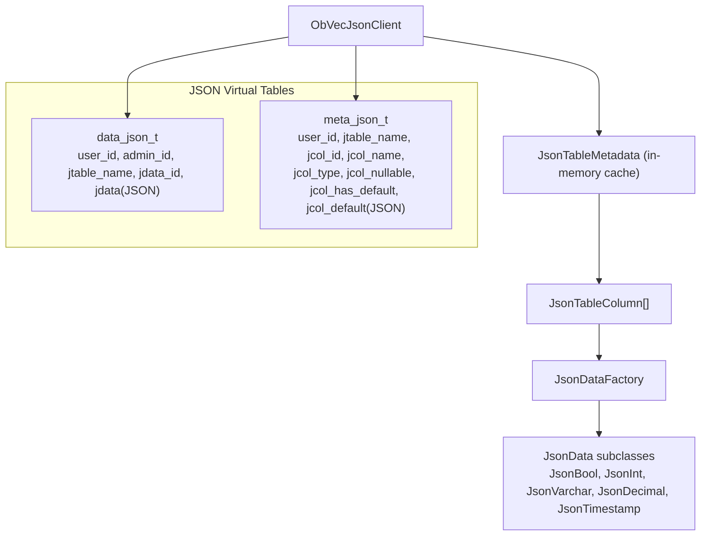
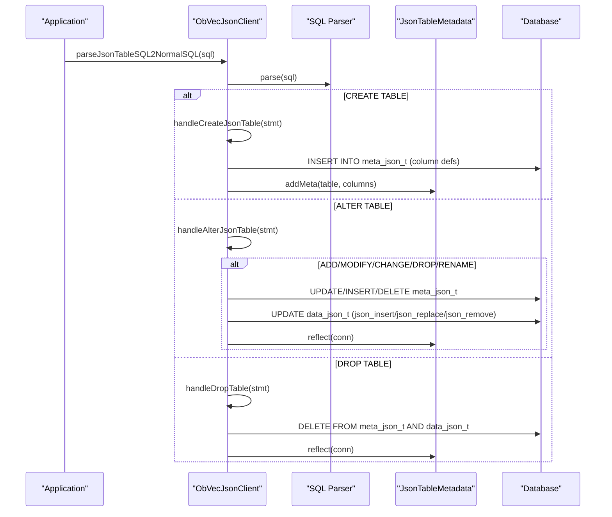
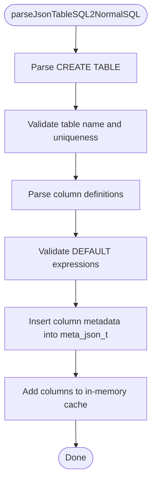
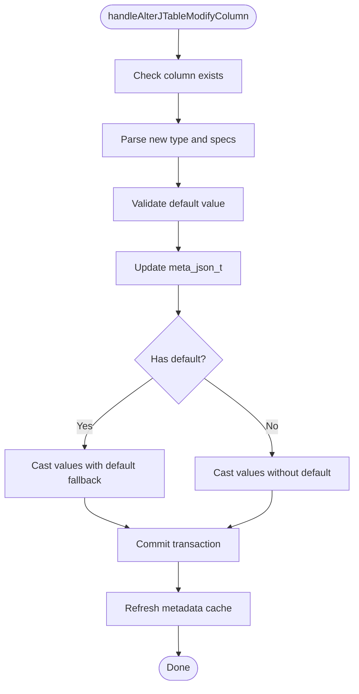
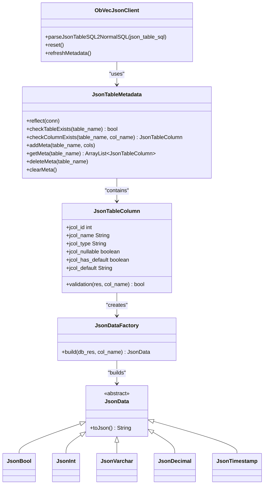
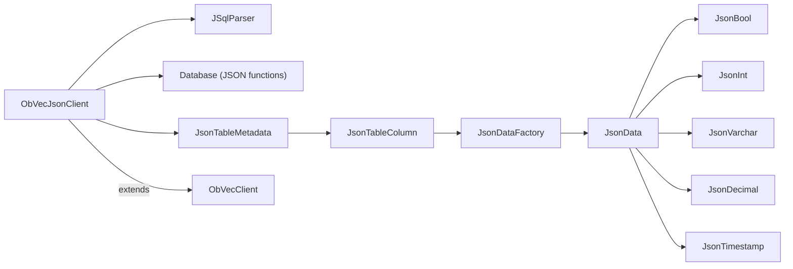

# ObVecJsonClient - JSON Virtual Table Operations

<cite>
**Referenced Files in This Document**
- [ObVecJsonClient.java](file://src/main/java/com/oceanbase/obvector4j/ObVecJsonClient.java)
- [ObVecClient.java](file://src/main/java/com/oceanbase/obvector4j/ObVecClient.java)
- [JsonTableMetadata.java](file://src/main/java/com/oceanbase/obvector4j/json_table/JsonTableMetadata.java)
- [JsonTableColumn.java](file://src/main/java/com/oceanbase/obvector4j/json_table/JsonTableColumn.java)
- [JsonDataFactory.java](file://src/main/java/com/oceanbase/obvector4j/json_table/JsonDataFactory.java)
- [JsonData.java](file://src/main/java/com/oceanbase/obvector4j/json_table/JsonData.java)
- [JsonDataType.java](file://src/main/java/com/oceanbase/obvector4j/json_table/JsonDataType.java)
- [JsonBool.java](file://src/main/java/com/oceanbase/obvector4j/json_table/JsonBool.java)
- [JsonInt.java](file://src/main/java/com/oceanbase/obvector4j/json_table/JsonInt.java)
- [JsonVarchar.java](file://src/main/java/com/oceanbase/obvector4j/json_table/JsonVarchar.java)
- [JsonDecimal.java](file://src/main/java/com/oceanbase/obvector4j/json_table/JsonDecimal.java)
- [JsonTimestamp.java](file://src/main/java/com/oceanbase/obvector4j/json_table/JsonTimestamp.java)
</cite>

## Table of Contents
1. [Introduction](#introduction)
2. [Project Structure](#project-structure)
3. [Core Components](#core-components)
4. [Architecture Overview](#architecture-overview)
5. [Detailed Component Analysis](#detailed-component-analysis)
6. [Dependency Analysis](#dependency-analysis)
7. [Performance Considerations](#performance-considerations)
8. [Troubleshooting Guide](#troubleshooting-guide)
9. [Conclusion](#conclusion)

## Introduction
This document provides detailed API documentation for the ObVecJsonClient class, which extends basic vector client operations to support JSON virtual tables. It focuses on dynamic schema evolution (CREATE TABLE, ALTER TABLE, DROP TABLE), JSON data manipulation via SQL-like statements, and metadata management for inspecting table structures and column definitions. The client integrates with JsonTableMetadata and JsonTableColumn to provide schema introspection and type-safe handling of JSON values.

## Project Structure
The JSON virtual table feature is implemented primarily in ObVecJsonClient, backed by two internal tables:
- data_json_t: stores user-scoped JSON documents
- meta_json_t: stores per-table column metadata (name, type, nullability, default value)

**Diagram sources**
- [ObVecJsonClient.java:30-90](file://src/main/java/com/oceanbase/obvector4j/ObVecJsonClient.java#L30-L90)
- [JsonTableMetadata.java:13-30](file://src/main/java/com/oceanbase/obvector4j/json_table/JsonTableMetadata.java#L13-L30)
- [JsonTableColumn.java:7-16](file://src/main/java/com/oceanbase/obvector4j/json_table/JsonTableColumn.java#L7-L16)
- [JsonDataFactory.java:5-24](file://src/main/java/com/oceanbase/obvector4j/json_table/JsonDataFactory.java#L5-L24)
- [JsonBool.java:4-10](file://src/main/java/com/oceanbase/obvector4j/json_table/JsonBool.java#L4-L10)
- [JsonInt.java:3-9](file://src/main/java/com/oceanbase/obvector4j/json_table/JsonInt.java#L3-L9)
- [JsonVarchar.java:3-9](file://src/main/java/com/oceanbase/obvector4j/json_table/JsonVarchar.java#L3-L9)
- [JsonDecimal.java:6-11](file://src/main/java/com/oceanbase/obvector4j/json_table/JsonDecimal.java#L6-L11)
- [JsonTimestamp.java:5-11](file://src/main/java/com/oceanbase/obvector4j/json_table/JsonTimestamp.java#L5-L11)

**Section sources**
- [ObVecJsonClient.java:30-90](file://src/main/java/com/oceanbase/obvector4j/ObVecJsonClient.java#L30-L90)

## Core Components
- ObVecJsonClient: Entry point for JSON virtual table operations. Parses CREATE/ALTER/DROP statements and manages metadata/data tables.
- JsonTableMetadata: In-memory cache of table/column metadata; reflects from meta_json_t when needed.
- JsonTableColumn: Represents a column definition including type, nullability, and default value; builds typed JsonData instances.
- JsonDataFactory + JsonData types: Type-specific builders and serializers for JSON values (bool, int, varchar, decimal, timestamp).

Key responsibilities:
- Dynamic schema evolution: CREATE TABLE, ALTER TABLE (ADD/MODIFY/CHANGE/DROP/RENAME), DROP TABLE
- Metadata reflection and caching
- Default value validation and application
- JSON path-based updates using database JSON functions

**Section sources**
- [ObVecJsonClient.java:124-260](file://src/main/java/com/oceanbase/obvector4j/ObVecJsonClient.java#L124-L260)
- [ObVecJsonClient.java:301-425](file://src/main/java/com/oceanbase/obvector4j/ObVecJsonClient.java#L301-L425)
- [ObVecJsonClient.java:494-580](file://src/main/java/com/oceanbase/obvector4j/ObVecJsonClient.java#L494-L580)
- [ObVecJsonClient.java:582-671](file://src/main/java/com/oceanbase/obvector4j/ObVecJsonClient.java#L582-L671)
- [ObVecJsonClient.java:672-708](file://src/main/java/com/oceanbase/obvector4j/ObVecJsonClient.java#L672-L708)
- [ObVecJsonClient.java:758-812](file://src/main/java/com/oceanbase/obvector4j/ObVecJsonClient.java#L758-L812)
- [JsonTableMetadata.java:32-98](file://src/main/java/com/oceanbase/obvector4j/json_table/JsonTableMetadata.java#L32-L98)
- [JsonTableColumn.java:60-79](file://src/main/java/com/oceanbase/obvector4j/json_table/JsonTableColumn.java#L60-L79)
- [JsonDataFactory.java:26-89](file://src/main/java/com/oceanbase/obvector4j/json_table/JsonDataFactory.java#L26-L89)

## Architecture Overview
ObVecJsonClient intercepts JSON table DDL statements, validates them against constraints, persists metadata into meta_json_t, and applies structural changes to data_json_t using JSON functions. JsonTableMetadata maintains an in-memory cache of schemas for fast lookups and validations.

**Diagram sources**
- [ObVecJsonClient.java:814-826](file://src/main/java/com/oceanbase/obvector4j/ObVecJsonClient.java#L814-L826)
- [ObVecJsonClient.java:124-260](file://src/main/java/com/oceanbase/obvector4j/ObVecJsonClient.java#L124-L260)
- [ObVecJsonClient.java:715-756](file://src/main/java/com/oceanbase/obvector4j/ObVecJsonClient.java#L715-L756)
- [ObVecJsonClient.java:758-812](file://src/main/java/com/oceanbase/obvector4j/ObVecJsonClient.java#L758-L812)
- [JsonTableMetadata.java:32-98](file://src/main/java/com/oceanbase/obvector4j/json_table/JsonTableMetadata.java#L32-L98)

## Detailed Component Analysis

### ObVecJsonClient API Surface
- Constructor: Initializes connection, sets logging level, creates internal tables if not skipped, and reflects metadata.
- reset(): Truncates both internal tables and clears in-memory metadata.
- refreshMetadata(): Re-reads meta_json_t into memory.
- parseJsonTableSQL2NormalSQL(String): Main entry point to process JSON table DDL.

Supported DDL operations:
- CREATE TABLE: Validates uniqueness, parses column definitions, validates defaults, inserts metadata, and caches schema.
- ALTER TABLE:
  - ADD COLUMN: Adds new column with optional default; inserts into meta_json_t and updates existing rows.
  - MODIFY COLUMN: Changes type/nullability/default; casts existing values and updates metadata.
  - CHANGE COLUMN: Renames column and/or changes type; renames key in JSON and casts values.
  - DROP COLUMN: Removes column from metadata and removes key from all JSON documents.
  - RENAME TABLE: Updates table name in metadata.
- DROP TABLE: Deletes metadata and data rows for the table; supports IF EXISTS semantics.

Type mapping helpers:
- getJsonValueReturningType(String): Maps logical column types to JSON RETURNING types used in casting.

Error handling:
- All DDL operations use transactions with rollback on failure and consistent metadata refresh afterward.

**Section sources**
- [ObVecJsonClient.java:37-90](file://src/main/java/com/oceanbase/obvector4j/ObVecJsonClient.java#L37-L90)
- [ObVecJsonClient.java:92-115](file://src/main/java/com/oceanbase/obvector4j/ObVecJsonClient.java#L92-L115)
- [ObVecJsonClient.java:814-826](file://src/main/java/com/oceanbase/obvector4j/ObVecJsonClient.java#L814-L826)
- [ObVecJsonClient.java:124-260](file://src/main/java/com/oceanbase/obvector4j/ObVecJsonClient.java#L124-L260)
- [ObVecJsonClient.java:262-299](file://src/main/java/com/oceanbase/obvector4j/ObVecJsonClient.java#L262-L299)
- [ObVecJsonClient.java:301-425](file://src/main/java/com/oceanbase/obvector4j/ObVecJsonClient.java#L301-L425)
- [ObVecJsonClient.java:494-580](file://src/main/java/com/oceanbase/obvector4j/ObVecJsonClient.java#L494-L580)
- [ObVecJsonClient.java:582-671](file://src/main/java/com/oceanbase/obvector4j/ObVecJsonClient.java#L582-L671)
- [ObVecJsonClient.java:672-708](file://src/main/java/com/oceanbase/obvector4j/ObVecJsonClient.java#L672-L708)
- [ObVecJsonClient.java:715-756](file://src/main/java/com/oceanbase/obvector4j/ObVecJsonClient.java#L715-L756)
- [ObVecJsonClient.java:758-812](file://src/main/java/com/oceanbase/obvector4j/ObVecJsonClient.java#L758-L812)

#### CREATE TABLE Flow

**Diagram sources**
- [ObVecJsonClient.java:814-826](file://src/main/java/com/oceanbase/obvector4j/ObVecJsonClient.java#L814-L826)
- [ObVecJsonClient.java:124-260](file://src/main/java/com/oceanbase/obvector4j/ObVecJsonClient.java#L124-L260)

#### ALTER TABLE Modify Column Flow

**Diagram sources**
- [ObVecJsonClient.java:494-580](file://src/main/java/com/oceanbase/obvector4j/ObVecJsonClient.java#L494-L580)
- [ObVecJsonClient.java:715-756](file://src/main/java/com/oceanbase/obvector4j/ObVecJsonClient.java#L715-L756)

### Metadata Management and Schema Introspection
- JsonTableMetadata.reflect(Connection): Loads all columns for the current user into an in-memory map keyed by table name.
- JsonTableMetadata.checkTableExists / checkColumnExists: Fast in-memory checks.
- JsonTableMetadata.addMeta / getMeta / deleteMeta / clearMeta: Manage cache state after DDL operations.

Integration points:
- ObVecJsonClient uses JsonTableMetadata to validate existence and to compute next column IDs.
- After each DDL change, metadata is refreshed to keep the cache consistent.

**Section sources**
- [JsonTableMetadata.java:32-98](file://src/main/java/com/oceanbase/obvector4j/json_table/JsonTableMetadata.java#L32-L98)
- [JsonTableMetadata.java:100-131](file://src/main/java/com/oceanbase/obvector4j/json_table/JsonTableMetadata.java#L100-L131)
- [ObVecJsonClient.java:135-137](file://src/main/java/com/oceanbase/obvector4j/ObVecJsonClient.java#L135-L137)
- [ObVecJsonClient.java:598-607](file://src/main/java/com/oceanbase/obvector4j/ObVecJsonClient.java#L598-L607)
- [ObVecJsonClient.java:750-756](file://src/main/java/com/oceanbase/obvector4j/ObVecJsonClient.java#L750-L756)

### JSON Data Types and Serialization
- JsonData: Abstract base with toJson() for serialization.
- JsonDataFactory: Builds typed JsonData instances based on column type and JDBC ResultSet.
- Supported types:
  - JsonBool: Boolean serialized as 1/0 or null.
  - JsonInt: Integer serialized as number or null.
  - JsonVarchar: String with length validation; serialized quoted.
  - JsonDecimal: BigDecimal with precision/scale validation; serialized as plain string.
  - JsonTimestamp: Timestamp serialized quoted.

These types are used to validate and serialize default values during schema creation/modification.

**Section sources**
- [JsonData.java:3-6](file://src/main/java/com/oceanbase/obvector4j/json_table/JsonData.java#L3-L6)
- [JsonDataFactory.java:26-89](file://src/main/java/com/oceanbase/obvector4j/json_table/JsonDataFactory.java#L26-L89)
- [JsonBool.java:4-26](file://src/main/java/com/oceanbase/obvector4j/json_table/JsonBool.java#L4-L26)
- [JsonInt.java:3-22](file://src/main/java/com/oceanbase/obvector4j/json_table/JsonInt.java#L3-L22)
- [JsonVarchar.java:3-28](file://src/main/java/com/oceanbase/obvector4j/json_table/JsonVarchar.java#L3-L28)
- [JsonDecimal.java:6-45](file://src/main/java/com/oceanbase/obvector4j/json_table/JsonDecimal.java#L6-L45)
- [JsonTimestamp.java:5-25](file://src/main/java/com/oceanbase/obvector4j/json_table/JsonTimestamp.java#L5-L25)

### Class Relationships

**Diagram sources**
- [ObVecJsonClient.java:814-826](file://src/main/java/com/oceanbase/obvector4j/ObVecJsonClient.java#L814-L826)
- [JsonTableMetadata.java:13-30](file://src/main/java/com/oceanbase/obvector4j/json_table/JsonTableMetadata.java#L13-L30)
- [JsonTableColumn.java:7-16](file://src/main/java/com/oceanbase/obvector4j/json_table/JsonTableColumn.java#L7-L16)
- [JsonDataFactory.java:5-24](file://src/main/java/com/oceanbase/obvector4j/json_table/JsonDataFactory.java#L5-L24)
- [JsonData.java:3-6](file://src/main/java/com/oceanbase/obvector4j/json_table/JsonData.java#L3-L6)
- [JsonBool.java:4-10](file://src/main/java/com/oceanbase/obvector4j/json_table/JsonBool.java#L4-L10)
- [JsonInt.java:3-9](file://src/main/java/com/oceanbase/obvector4j/json_table/JsonInt.java#L3-L9)
- [JsonVarchar.java:3-9](file://src/main/java/com/oceanbase/obvector4j/json_table/JsonVarchar.java#L3-L9)
- [JsonDecimal.java:6-11](file://src/main/java/com/oceanbase/obvector4j/json_table/JsonDecimal.java#L6-L11)
- [JsonTimestamp.java:5-11](file://src/main/java/com/oceanbase/obvector4j/json_table/JsonTimestamp.java#L5-L11)

## Dependency Analysis
- ObVecJsonClient depends on:
  - JSqlParser for parsing DDL statements
  - Database JSON functions for runtime schema evolution
  - JsonTableMetadata for schema caching and validation
  - JsonTableColumn and JsonData* for type validation and serialization
- ObVecClient provides base connectivity and generic SQL utilities used indirectly by ObVecJsonClient through its parent class.

**Diagram sources**
- [ObVecJsonClient.java:18-26](file://src/main/java/com/oceanbase/obvector4j/ObVecJsonClient.java#L18-L26)
- [ObVecJsonClient.java:30-40](file://src/main/java/com/oceanbase/obvector4j/ObVecJsonClient.java#L30-L40)
- [JsonTableMetadata.java:32-98](file://src/main/java/com/oceanbase/obvector4j/json_table/JsonTableMetadata.java#L32-L98)
- [JsonTableColumn.java:60-79](file://src/main/java/com/oceanbase/obvector4j/json_table/JsonTableColumn.java#L60-L79)
- [JsonDataFactory.java:26-89](file://src/main/java/com/oceanbase/obvector4j/json_table/JsonDataFactory.java#L26-L89)
- [ObVecClient.java:32-45](file://src/main/java/com/oceanbase/obvector4j/ObVecClient.java#L32-L45)

**Section sources**
- [ObVecJsonClient.java:18-26](file://src/main/java/com/oceanbase/obvector4j/ObVecJsonClient.java#L18-L26)
- [ObVecClient.java:32-45](file://src/main/java/com/oceanbase/obvector4j/ObVecClient.java#L32-L45)

## Performance Considerations
- Transactional DDL: All schema changes are wrapped in transactions to ensure consistency and allow rollback on errors.
- Batched metadata updates: Column metadata is inserted in a single prepared statement loop to reduce round trips.
- In-memory schema cache: JsonTableMetadata avoids repeated metadata queries for common operations like existence checks.
- JSON function usage:
  - json_insert/json_replace/json_remove operate at row-level; large datasets may incur significant I/O.
  - Prefer targeted updates (e.g., specific paths) and avoid unnecessary full-table scans where possible.
- Type casting overhead: MODIFY/CHANGE operations cast existing values; consider batching or off-peak execution for large tables.
- Indexing strategy: While this client focuses on JSON virtual tables, consider adding appropriate indexes on frequently filtered scalar fields stored within JSON if supported by your deployment.

[No sources needed since this section provides general guidance]

## Troubleshooting Guide
Common issues and resolutions:
- Invalid or unsupported column specifiers: Ensure only DEFAULT and NOT NULL are used in column definitions.
- Duplicate table names: CREATE TABLE fails if the table already exists; rename or drop first.
- Missing column definitions: CREATE TABLE must include explicit column definitions.
- Unsupported column types: Only TINYINT, INT, VARCHAR, DECIMAL, TIMESTAMP are supported; others will throw exceptions.
- Default value validation failures: Defaults must evaluate to valid values for the declared type; verify expressions before creating/modifying columns.
- Column does not exist: ALTER operations require the target column to be present in metadata.
- Multiple column data types in ALTER: Not supported; specify a single column type per operation.

Operational tips:
- Use refreshMetadata() after external changes to meta_json_t to synchronize the in-memory cache.
- Use reset() to clear all data and metadata for testing or re-initialization.

**Section sources**
- [ObVecJsonClient.java:124-260](file://src/main/java/com/oceanbase/obvector4j/ObVecJsonClient.java#L124-L260)
- [ObVecJsonClient.java:301-425](file://src/main/java/com/oceanbase/obvector4j/ObVecJsonClient.java#L301-L425)
- [ObVecJsonClient.java:494-580](file://src/main/java/com/oceanbase/obvector4j/ObVecJsonClient.java#L494-L580)
- [ObVecJsonClient.java:582-671](file://src/main/java/com/oceanbase/obvector4j/ObVecJsonClient.java#L582-L671)
- [ObVecJsonClient.java:92-115](file://src/main/java/com/oceanbase/obvector4j/ObVecJsonClient.java#L92-L115)
- [ObVecJsonClient.java:113-115](file://src/main/java/com/oceanbase/obvector4j/ObVecJsonClient.java#L113-L115)

## Conclusion
ObVecJsonClient enables flexible, schema-on-write JSON virtual tables with robust DDL support and strong type safety for column definitions. By combining SQL parsing, metadata caching, and database JSON functions, it allows dynamic evolution of table structures while maintaining consistency. For large datasets, plan schema changes carefully and leverage transactions and caching to optimize performance.

[No sources needed since this section summarizes without analyzing specific files]