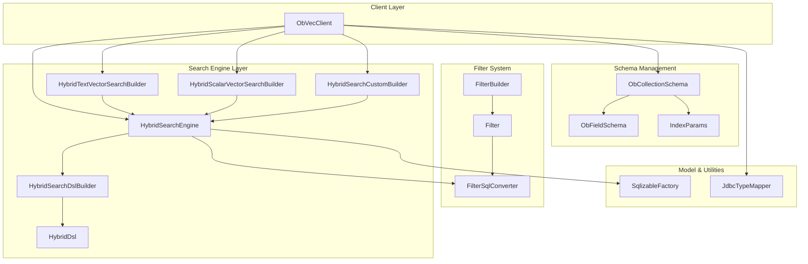
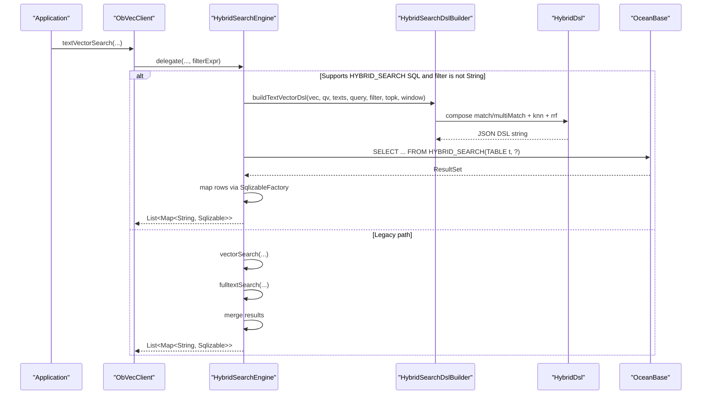
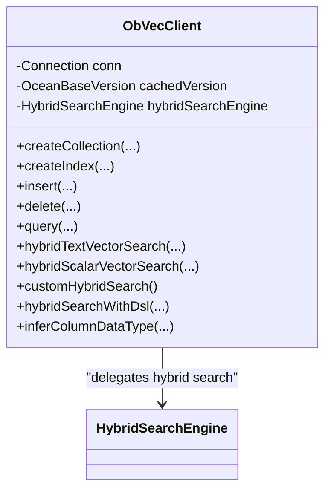
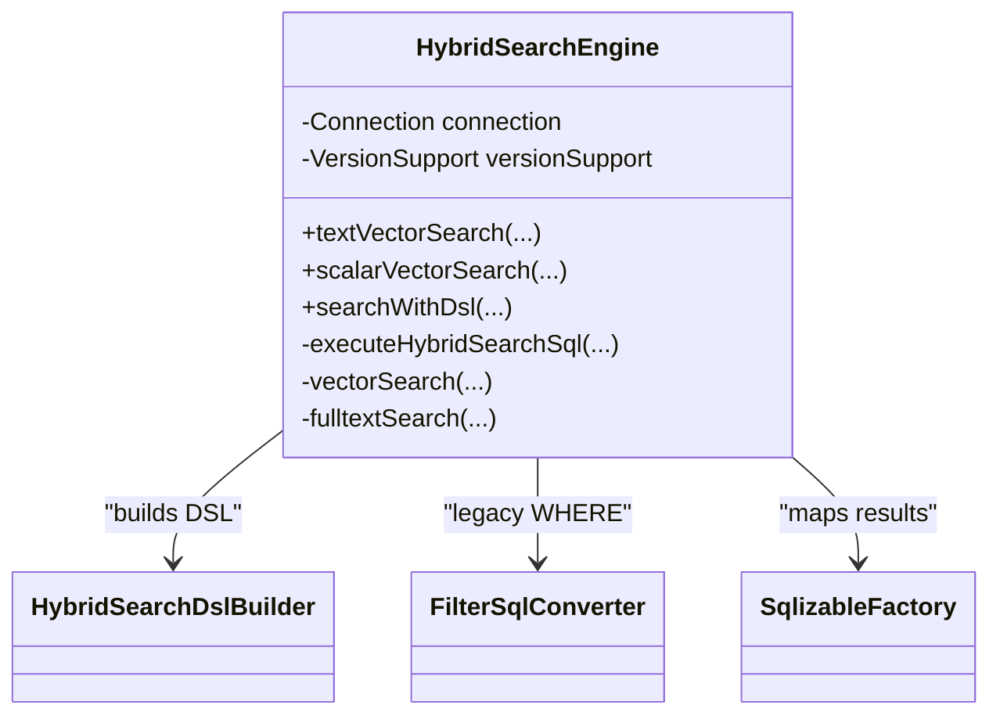
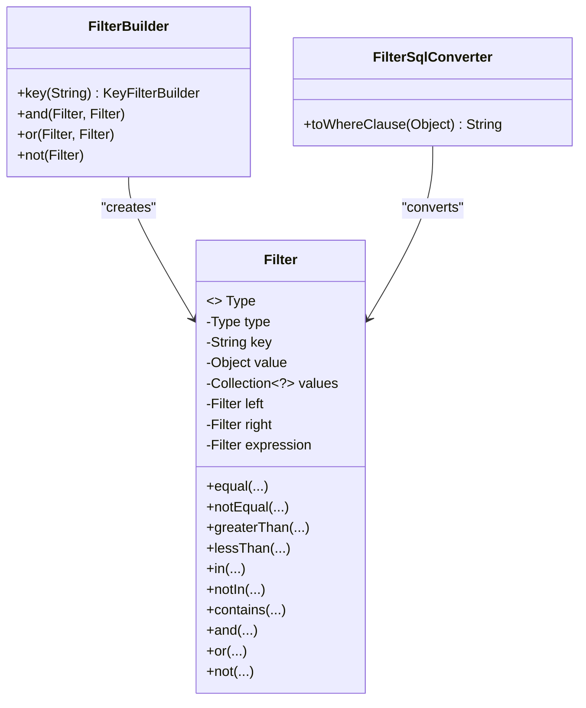
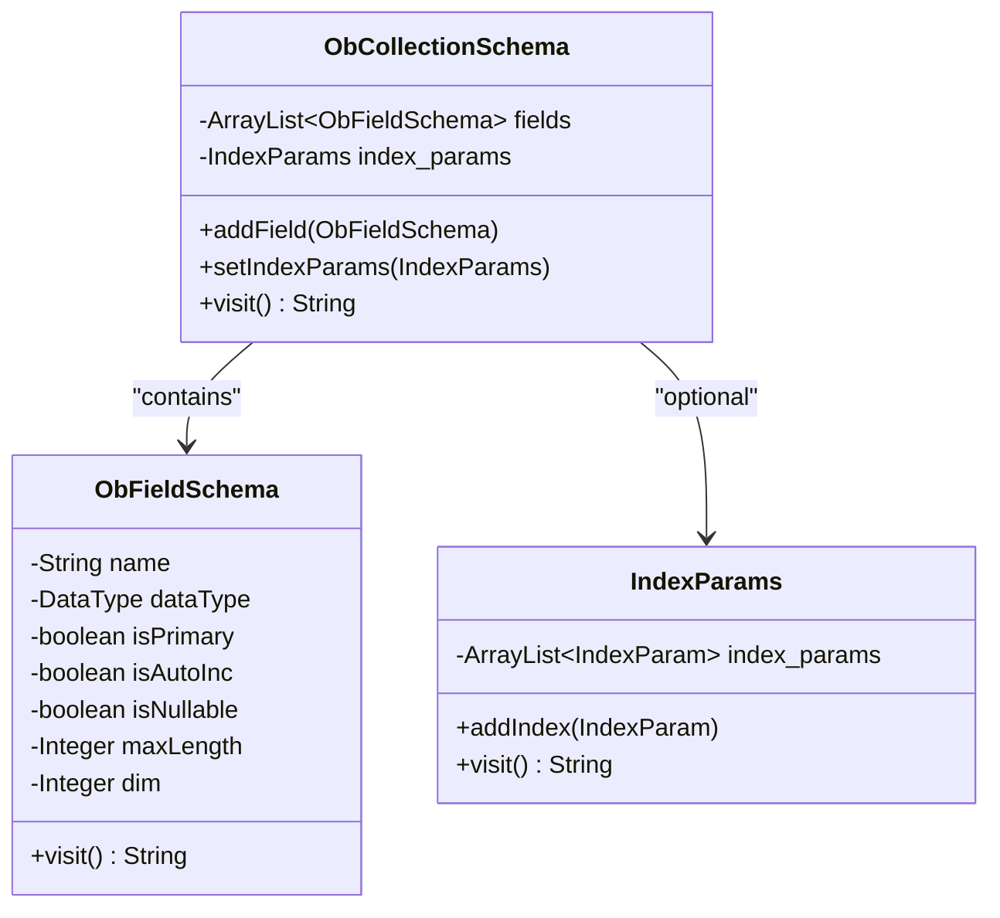
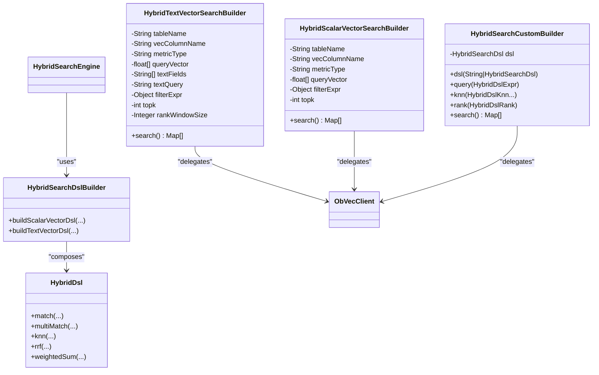
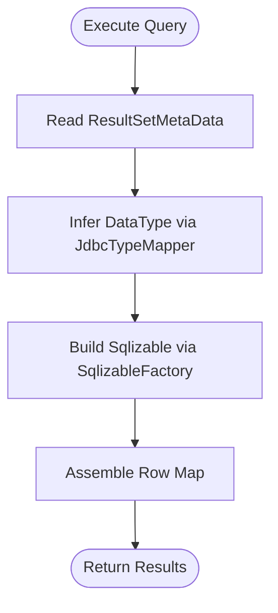
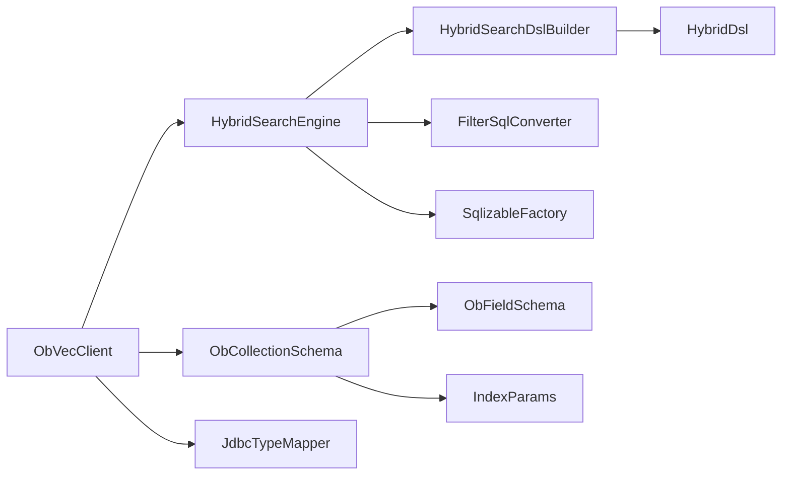

# Component Architecture and Interactions

<cite>
**Referenced Files in This Document**
- [ObVecClient.java](file://src/main/java/com/oceanbase/obvector4j/ObVecClient.java)
- [HybridSearchEngine.java](file://src/main/java/com/oceanbase/obvector4j/hybrid/HybridSearchEngine.java)
- [FilterBuilder.java](file://src/main/java/com/oceanbase/obvector4j/filter/FilterBuilder.java)
- [Filter.java](file://src/main/java/com/oceanbase/obvector4j/filter/Filter.java)
- [FilterSqlConverter.java](file://src/main/java/com/oceanbase/obvector4j/filter/FilterSqlConverter.java)
- [HybridTextVectorSearchBuilder.java](file://src/main/java/com/oceanbase/obvector4j/hybrid/HybridTextVectorSearchBuilder.java)
- [HybridScalarVectorSearchBuilder.java](file://src/main/java/com/oceanbase/obvector4j/hybrid/HybridScalarVectorSearchBuilder.java)
- [HybridSearchCustomBuilder.java](file://src/main/java/com/oceanbase/obvector4j/hybrid/core/HybridSearchCustomBuilder.java)
- [HybridSearchDslBuilder.java](file://src/main/java/com/oceanbase/obvector4j/hybrid/core/HybridSearchDslBuilder.java)
- [HybridDsl.java](file://src/main/java/com/oceanbase/obvector4j/hybrid/core/dsl/HybridDsl.java)
- [ObCollectionSchema.java](file://src/main/java/com/oceanbase/obvector4j/schema/ObCollectionSchema.java)
- [ObFieldSchema.java](file://src/main/java/com/oceanbase/obvector4j/schema/ObFieldSchema.java)
- [IndexParams.java](file://src/main/java/com/oceanbase/obvector4j/schema/IndexParams.java)
- [SqlizableFactory.java](file://src/main/java/com/oceanbase/obvector4j/model/SqlizableFactory.java)
- [JdbcTypeMapper.java](file://src/main/java/com/oceanbase/obvector4j/util/JdbcTypeMapper.java)
</cite>

## Table of Contents
1. Introduction
2. Project Structure
3. Core Components
4. Architecture Overview
5. Detailed Component Analysis
6. Dependency Analysis
7. Performance Considerations
8. Troubleshooting Guide
9. Conclusion

## Introduction
This document explains the component architecture and interaction patterns of OceanBase Vector4J. It focuses on the layered design: client layer (ObVecClient), search engine layer (HybridSearchEngine), filter system (FilterBuilder, Filter, FilterSqlConverter), and schema management components. It also documents how high-level API calls are transformed into database operations, including factory, builder, and strategy patterns used across the codebase. Extension points and customization opportunities for advanced users are highlighted.

## Project Structure
The project is organized by feature and layer:
- Client entry point and orchestration: ObVecClient
- Hybrid search execution and routing: HybridSearchEngine and builders
- Filter DSL and SQL conversion: Filter, FilterBuilder, FilterSqlConverter
- Schema modeling and DDL generation: ObCollectionSchema, ObFieldSchema, IndexParams
- Result mapping and type inference: SqlizableFactory, JdbcTypeMapper
- DSL construction for HYBRID_SEARCH (4.6.0+): HybridDsl, HybridSearchDslBuilder, HybridSearchCustomBuilder

**Diagram sources**
- [ObVecClient.java](file://src/main/java/com/oceanbase/obvector4j/ObVecClient.java)
- [HybridSearchEngine.java](file://src/main/java/com/oceanbase/obvector4j/hybrid/HybridSearchEngine.java)
- [HybridTextVectorSearchBuilder.java](file://src/main/java/com/oceanbase/obvector4j/hybrid/HybridTextVectorSearchBuilder.java)
- [HybridScalarVectorSearchBuilder.java](file://src/main/java/com/oceanbase/obvector4j/hybrid/HybridScalarVectorSearchBuilder.java)
- [HybridSearchCustomBuilder.java](file://src/main/java/com/oceanbase/obvector4j/hybrid/core/HybridSearchCustomBuilder.java)
- [HybridSearchDslBuilder.java](file://src/main/java/com/oceanbase/obvector4j/hybrid/core/HybridSearchDslBuilder.java)
- [HybridDsl.java](file://src/main/java/com/oceanbase/obvector4j/hybrid/core/dsl/HybridDsl.java)
- [Filter.java](file://src/main/java/com/oceanbase/obvector4j/filter/Filter.java)
- [FilterBuilder.java](file://src/main/java/com/oceanbase/obvector4j/filter/FilterBuilder.java)
- [FilterSqlConverter.java](file://src/main/java/com/oceanbase/obvector4j/filter/FilterSqlConverter.java)
- [ObCollectionSchema.java](file://src/main/java/com/oceanbase/obvector4j/schema/ObCollectionSchema.java)
- [ObFieldSchema.java](file://src/main/java/com/oceanbase/obvector4j/schema/ObFieldSchema.java)
- [IndexParams.java](file://src/main/java/com/oceanbase/obvector4j/schema/IndexParams.java)
- [SqlizableFactory.java](file://src/main/java/com/oceanbase/obvector4j/model/SqlizableFactory.java)
- [JdbcTypeMapper.java](file://src/main/java/com/oceanbase/obvector4j/util/JdbcTypeMapper.java)

**Section sources**
- [ObVecClient.java](file://src/main/java/com/oceanbase/obvector4j/ObVecClient.java)
- [HybridSearchEngine.java](file://src/main/java/com/oceanbase/obvector4j/hybrid/HybridSearchEngine.java)
- [FilterBuilder.java](file://src/main/java/com/oceanbase/obvector4j/filter/FilterBuilder.java)
- [Filter.java](file://src/main/java/com/oceanbase/obvector4j/filter/Filter.java)
- [FilterSqlConverter.java](file://src/main/java/com/oceanbase/obvector4j/filter/FilterSqlConverter.java)
- [HybridTextVectorSearchBuilder.java](file://src/main/java/com/oceanbase/obvector4j/hybrid/HybridTextVectorSearchBuilder.java)
- [HybridScalarVectorSearchBuilder.java](file://src/main/java/com/oceanbase/obvector4j/hybrid/HybridScalarVectorSearchBuilder.java)
- [HybridSearchCustomBuilder.java](file://src/main/java/com/oceanbase/obvector4j/hybrid/core/HybridSearchCustomBuilder.java)
- [HybridSearchDslBuilder.java](file://src/main/java/com/oceanbase/obvector4j/hybrid/core/HybridSearchDslBuilder.java)
- [HybridDsl.java](file://src/main/java/com/oceanbase/obvector4j/hybrid/core/dsl/HybridDsl.java)
- [ObCollectionSchema.java](file://src/main/java/com/oceanbase/obvector4j/schema/ObCollectionSchema.java)
- [ObFieldSchema.java](file://src/main/java/com/oceanbase/obvector4j/schema/ObFieldSchema.java)
- [IndexParams.java](file://src/main/java/com/oceanbase/obvector4j/schema/IndexParams.java)
- [SqlizableFactory.java](file://src/main/java/com/oceanbase/obvector4j/model/SqlizableFactory.java)
- [JdbcTypeMapper.java](file://src/main/java/com/oceanbase/obvector4j/util/JdbcTypeMapper.java)

## Core Components
- ObVecClient: Entry point that manages JDBC connection, version detection, collection/index lifecycle, basic CRUD, vector search, hybrid search delegation, and raw SQL helpers.
- HybridSearchEngine: Strategy router that chooses between HYBRID_SEARCH SQL (4.6.0+) or legacy paths; builds DSL when available; executes queries and maps results.
- Filter system: Filter (AST), FilterBuilder (fluent builder), FilterSqlConverter (to WHERE clause).
- Schema management: ObCollectionSchema, ObFieldSchema, IndexParams generate DDL via visit() methods.
- Builders: HybridTextVectorSearchBuilder, HybridScalarVectorSearchBuilder, HybridSearchCustomBuilder provide fluent APIs to construct searches.
- DSL: HybridDsl and HybridSearchDslBuilder build JSON DSL for HYBRID_SEARCH.
- Model and utilities: SqlizableFactory maps ResultSet columns to typed wrappers; JdbcTypeMapper infers DataType from JDBC metadata.

**Section sources**
- [ObVecClient.java](file://src/main/java/com/oceanbase/obvector4j/ObVecClient.java)
- [HybridSearchEngine.java](file://src/main/java/com/oceanbase/obvector4j/hybrid/HybridSearchEngine.java)
- [Filter.java](file://src/main/java/com/oceanbase/obvector4j/filter/Filter.java)
- [FilterBuilder.java](file://src/main/java/com/oceanbase/obvector4j/filter/FilterBuilder.java)
- [FilterSqlConverter.java](file://src/main/java/com/oceanbase/obvector4j/filter/FilterSqlConverter.java)
- [ObCollectionSchema.java](file://src/main/java/com/oceanbase/obvector4j/schema/ObCollectionSchema.java)
- [ObFieldSchema.java](file://src/main/java/com/oceanbase/obvector4j/schema/ObFieldSchema.java)
- [IndexParams.java](file://src/main/java/com/oceanbase/obvector4j/schema/IndexParams.java)
- [HybridTextVectorSearchBuilder.java](file://src/main/java/com/oceanbase/obvector4j/hybrid/HybridTextVectorSearchBuilder.java)
- [HybridScalarVectorSearchBuilder.java](file://src/main/java/com/oceanbase/obvector4j/hybrid/HybridScalarVectorSearchBuilder.java)
- [HybridSearchCustomBuilder.java](file://src/main/java/com/oceanbase/obvector4j/hybrid/core/HybridSearchCustomBuilder.java)
- [HybridSearchDslBuilder.java](file://src/main/java/com/oceanbase/obvector4j/hybrid/core/HybridSearchDslBuilder.java)
- [HybridDsl.java](file://src/main/java/com/oceanbase/obvector4j/hybrid/core/dsl/HybridDsl.java)
- [SqlizableFactory.java](file://src/main/java/com/oceanbase/obvector4j/model/SqlizableFactory.java)
- [JdbcTypeMapper.java](file://src/main/java/com/oceanbase/obvector4j/util/JdbcTypeMapper.java)

## Architecture Overview
High-level flow:
- Application calls ObVecClient methods (e.g., textVectorSearch, scalarVectorSearch, customHybridSearch).
- ObVecClient delegates to HybridSearchEngine with validated parameters.
- HybridSearchEngine decides execution path:
  - If OceanBase supports HYBRID_SEARCH SQL and filters are not raw strings, it builds a DSL using HybridSearchDslBuilder and HybridDsl, then executes via prepared statement.
  - Otherwise, it falls back to legacy SQL paths (vector + optional fulltext) and merges results.
- Results are mapped to Sqlizable objects via SqlizableFactory based on DataType inferred from output fields or JDBC metadata.

**Diagram sources**
- [ObVecClient.java](file://src/main/java/com/oceanbase/obvector4j/ObVecClient.java)
- [HybridSearchEngine.java](file://src/main/java/com/oceanbase/obvector4j/hybrid/HybridSearchEngine.java)
- [HybridSearchDslBuilder.java](file://src/main/java/com/oceanbase/obvector4j/hybrid/core/HybridSearchDslBuilder.java)
- [HybridDsl.java](file://src/main/java/com/oceanbase/obvector4j/hybrid/core/dsl/HybridDsl.java)
- [SqlizableFactory.java](file://src/main/java/com/oceanbase/obvector4j/model/SqlizableFactory.java)

## Detailed Component Analysis

### Client Layer: ObVecClient
Responsibilities:
- Connection lifecycle and version detection (caches OceanBaseVersion).
- Collection and index management (DDL via schema visitation).
- Basic vector search and hybrid search delegation.
- Raw SQL helpers and result mapping.

Key interactions:
- Creates HybridSearchEngine lazily with a VersionSupport adapter.
- Infers column types via JDBC metadata for dynamic output mapping.
- Provides fluent entry points for hybrid search builders and DSL.

**Diagram sources**
- [ObVecClient.java](file://src/main/java/com/oceanbase/obvector4j/ObVecClient.java)
- [HybridSearchEngine.java](file://src/main/java/com/oceanbase/obvector4j/hybrid/HybridSearchEngine.java)

**Section sources**
- [ObVecClient.java](file://src/main/java/com/oceanbase/obvector4j/ObVecClient.java)

### Search Engine Layer: HybridSearchEngine
Responsibilities:
- Strategy selection between HYBRID_SEARCH SQL (4.6.0+) and legacy SQL.
- DSL composition for supported versions.
- Execution of vector and fulltext queries and merging results.
- Output field validation and result mapping.

Patterns:
- Strategy pattern: choose execution path based on version support and filter type.
- Factory pattern: SqlizableFactory constructs typed row values.
- Builder pattern: HybridSearchDslBuilder composes DSL.

**Diagram sources**
- [HybridSearchEngine.java](file://src/main/java/com/oceanbase/obvector4j/hybrid/HybridSearchEngine.java)
- [HybridSearchDslBuilder.java](file://src/main/java/com/oceanbase/obvector4j/hybrid/core/HybridSearchDslBuilder.java)
- [FilterSqlConverter.java](file://src/main/java/com/oceanbase/obvector4j/filter/FilterSqlConverter.java)
- [SqlizableFactory.java](file://src/main/java/com/oceanbase/obvector4j/model/SqlizableFactory.java)

**Section sources**
- [HybridSearchEngine.java](file://src/main/java/com/oceanbase/obvector4j/hybrid/HybridSearchEngine.java)

### Filter System: FilterBuilder, Filter, FilterSqlConverter
Responsibilities:
- Filter: AST representing comparison and logical expressions.
- FilterBuilder: Fluent API to construct Filter instances.
- FilterSqlConverter: Converts Filter or raw String to SQL WHERE clause.

Patterns:
- Builder pattern: FilterBuilder provides fluent construction.
- Visitor-like traversal: FilterSqlConverter recursively converts nodes to SQL fragments.

**Diagram sources**
- [Filter.java](file://src/main/java/com/oceanbase/obvector4j/filter/Filter.java)
- [FilterBuilder.java](file://src/main/java/com/oceanbase/obvector4j/filter/FilterBuilder.java)
- [FilterSqlConverter.java](file://src/main/java/com/oceanbase/obvector4j/filter/FilterSqlConverter.java)

**Section sources**
- [Filter.java](file://src/main/java/com/oceanbase/obvector4j/filter/Filter.java)
- [FilterBuilder.java](file://src/main/java/com/oceanbase/obvector4j/filter/FilterBuilder.java)
- [FilterSqlConverter.java](file://src/main/java/com/oceanbase/obvector4j/filter/FilterSqlConverter.java)

### Schema Management: ObCollectionSchema, ObFieldSchema, IndexParams
Responsibilities:
- Define table structure and indexes.
- Generate DDL via visit() methods.

Patterns:
- Template method via Visitable.visit(): each schema object contributes its fragment.

**Diagram sources**
- [ObCollectionSchema.java](file://src/main/java/com/oceanbase/obvector4j/schema/ObCollectionSchema.java)
- [ObFieldSchema.java](file://src/main/java/com/oceanbase/obvector4j/schema/ObFieldSchema.java)
- [IndexParams.java](file://src/main/java/com/oceanbase/obvector4j/schema/IndexParams.java)

**Section sources**
- [ObCollectionSchema.java](file://src/main/java/com/oceanbase/obvector4j/schema/ObCollectionSchema.java)
- [ObFieldSchema.java](file://src/main/java/com/oceanbase/obvector4j/schema/ObFieldSchema.java)
- [IndexParams.java](file://src/main/java/com/oceanbase/obvector4j/schema/IndexParams.java)

### Builders and DSL: HybridTextVectorSearchBuilder, HybridScalarVectorSearchBuilder, HybridSearchCustomBuilder, HybridDsl, HybridSearchDslBuilder
Responsibilities:
- Builders encapsulate configuration and validation before delegating to ObVecClient/HybridSearchEngine.
- DSL components build structured JSON for HYBRID_SEARCH.

Patterns:
- Builder pattern: fluent configuration and validation.
- Strategy pattern: DSL vs legacy SQL selection inside HybridSearchEngine.

**Diagram sources**
- [HybridTextVectorSearchBuilder.java](file://src/main/java/com/oceanbase/obvector4j/hybrid/HybridTextVectorSearchBuilder.java)
- [HybridScalarVectorSearchBuilder.java](file://src/main/java/com/oceanbase/obvector4j/hybrid/HybridScalarVectorSearchBuilder.java)
- [HybridSearchCustomBuilder.java](file://src/main/java/com/oceanbase/obvector4j/hybrid/core/HybridSearchCustomBuilder.java)
- [HybridSearchDslBuilder.java](file://src/main/java/com/oceanbase/obvector4j/hybrid/core/HybridSearchDslBuilder.java)
- [HybridDsl.java](file://src/main/java/com/oceanbase/obvector4j/hybrid/core/dsl/HybridDsl.java)
- [ObVecClient.java](file://src/main/java/com/oceanbase/obvector4j/ObVecClient.java)
- [HybridSearchEngine.java](file://src/main/java/com/oceanbase/obvector4j/hybrid/HybridSearchEngine.java)

**Section sources**
- [HybridTextVectorSearchBuilder.java](file://src/main/java/com/oceanbase/obvector4j/hybrid/HybridTextVectorSearchBuilder.java)
- [HybridScalarVectorSearchBuilder.java](file://src/main/java/com/oceanbase/obvector4j/hybrid/HybridScalarVectorSearchBuilder.java)
- [HybridSearchCustomBuilder.java](file://src/main/java/com/oceanbase/obvector4j/hybrid/core/HybridSearchCustomBuilder.java)
- [HybridSearchDslBuilder.java](file://src/main/java/com/oceanbase/obvector4j/hybrid/core/HybridSearchDslBuilder.java)
- [HybridDsl.java](file://src/main/java/com/oceanbase/obvector4j/hybrid/core/dsl/HybridDsl.java)

### Data Flow and Mapping: SqlizableFactory and JdbcTypeMapper
Responsibilities:
- SqlizableFactory maps ResultSet columns to typed wrappers based on DataType.
- JdbcTypeMapper infers DataType from JDBC metadata for dynamic queries.

**Diagram sources**
- [SqlizableFactory.java](file://src/main/java/com/oceanbase/obvector4j/model/SqlizableFactory.java)
- [JdbcTypeMapper.java](file://src/main/java/com/oceanbase/obvector4j/util/JdbcTypeMapper.java)

**Section sources**
- [SqlizableFactory.java](file://src/main/java/com/oceanbase/obvector4j/model/SqlizableFactory.java)
- [JdbcTypeMapper.java](file://src/main/java/com/oceanbase/obvector4j/util/JdbcTypeMapper.java)

## Dependency Analysis
Component coupling and cohesion:
- ObVecClient depends on HybridSearchEngine and schema classes for DDL; low coupling to SQL details.
- HybridSearchEngine depends on DSL builders and converters; cohesive around execution strategy.
- Filter system is self-contained and reusable across layers.
- Schema classes are independent and composable via visit().
- Result mapping is isolated behind factories and mappers.

**Diagram sources**
- [ObVecClient.java](file://src/main/java/com/oceanbase/obvector4j/ObVecClient.java)
- [HybridSearchEngine.java](file://src/main/java/com/oceanbase/obvector4j/hybrid/HybridSearchEngine.java)
- [HybridSearchDslBuilder.java](file://src/main/java/com/oceanbase/obvector4j/hybrid/core/HybridSearchDslBuilder.java)
- [HybridDsl.java](file://src/main/java/com/oceanbase/obvector4j/hybrid/core/dsl/HybridDsl.java)
- [FilterSqlConverter.java](file://src/main/java/com/oceanbase/obvector4j/filter/FilterSqlConverter.java)
- [ObCollectionSchema.java](file://src/main/java/com/oceanbase/obvector4j/schema/ObCollectionSchema.java)
- [ObFieldSchema.java](file://src/main/java/com/oceanbase/obvector4j/schema/ObFieldSchema.java)
- [IndexParams.java](file://src/main/java/com/oceanbase/obvector4j/schema/IndexParams.java)
- [SqlizableFactory.java](file://src/main/java/com/oceanbase/obvector4j/model/SqlizableFactory.java)
- [JdbcTypeMapper.java](file://src/main/java/com/oceanbase/obvector4j/util/JdbcTypeMapper.java)

**Section sources**
- [ObVecClient.java](file://src/main/java/com/oceanbase/obvector4j/ObVecClient.java)
- [HybridSearchEngine.java](file://src/main/java/com/oceanbase/obvector4j/hybrid/HybridSearchEngine.java)
- [HybridSearchDslBuilder.java](file://src/main/java/com/oceanbase/obvector4j/hybrid/core/HybridSearchDslBuilder.java)
- [HybridDsl.java](file://src/main/java/com/oceanbase/obvector4j/hybrid/core/dsl/HybridDsl.java)
- [FilterSqlConverter.java](file://src/main/java/com/oceanbase/obvector4j/filter/FilterSqlConverter.java)
- [ObCollectionSchema.java](file://src/main/java/com/oceanbase/obvector4j/schema/ObCollectionSchema.java)
- [ObFieldSchema.java](file://src/main/java/com/oceanbase/obvector4j/schema/ObFieldSchema.java)
- [IndexParams.java](file://src/main/java/com/oceanbase/obvector4j/schema/IndexParams.java)
- [SqlizableFactory.java](file://src/main/java/com/oceanbase/obvector4j/model/SqlizableFactory.java)
- [JdbcTypeMapper.java](file://src/main/java/com/oceanbase/obvector4j/util/JdbcTypeMapper.java)

## Performance Considerations
- Prefer HYBRID_SEARCH SQL path when supported to leverage server-side ranking and reduced data transfer.
- Use appropriate rank window size for text+vector hybrid search to balance recall and latency.
- Validate output fields and data types early to avoid runtime mapping errors.
- Reuse connections and statements where possible; batch inserts use transactions to improve throughput.

[No sources needed since this section provides general guidance]

## Troubleshooting Guide
Common issues and resolutions:
- Unsupported HYBRID_SEARCH SQL: Ensure OceanBase version meets minimum requirement; fall-back logic is automatic but explicit checks can be performed.
- Invalid filter expression: Only String or Filter objects are accepted; ensure correct usage of FilterBuilder.
- Column type mismatch: Provide explicit DataType for output fields or rely on JdbcTypeMapper inference; verify table metadata.
- Fulltext search failures: The engine returns empty results gracefully; confirm full-text index existence and query syntax.

**Section sources**
- [HybridSearchEngine.java](file://src/main/java/com/oceanbase/obvector4j/hybrid/HybridSearchEngine.java)
- [FilterSqlConverter.java](file://src/main/java/com/oceanbase/obvector4j/filter/FilterSqlConverter.java)
- [ObVecClient.java](file://src/main/java/com/oceanbase/obvector4j/ObVecClient.java)

## Conclusion
OceanBase Vector4J employs a layered architecture with clear separation of concerns: client orchestration, search engine strategy, filter DSL, schema modeling, and result mapping. Builder and factory patterns simplify complex configurations, while strategy selection ensures compatibility across OceanBase versions. Advanced users can extend behavior through custom DSL construction, filter definitions, and schema customization.

[No sources needed since this section summarizes without analyzing specific files]