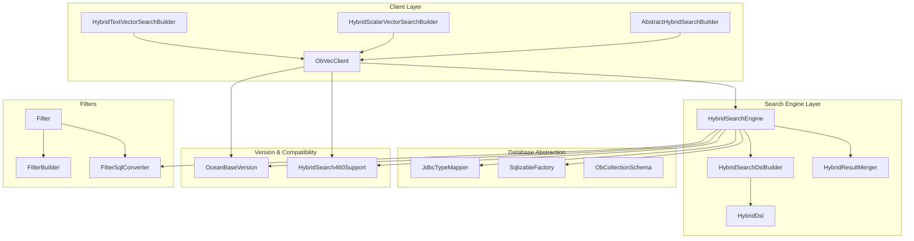
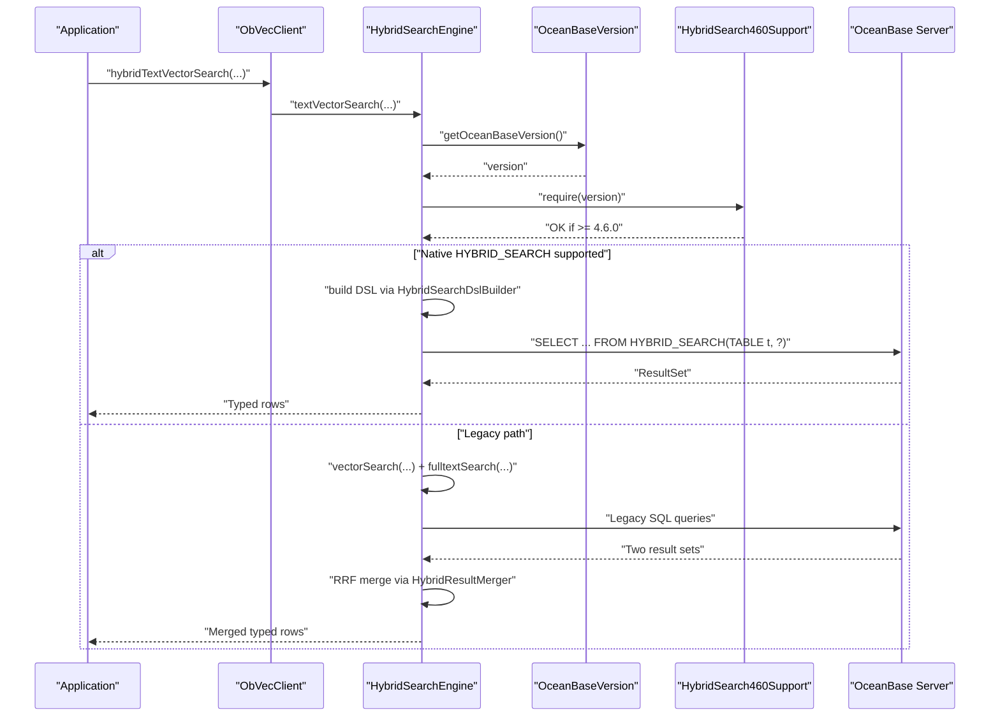
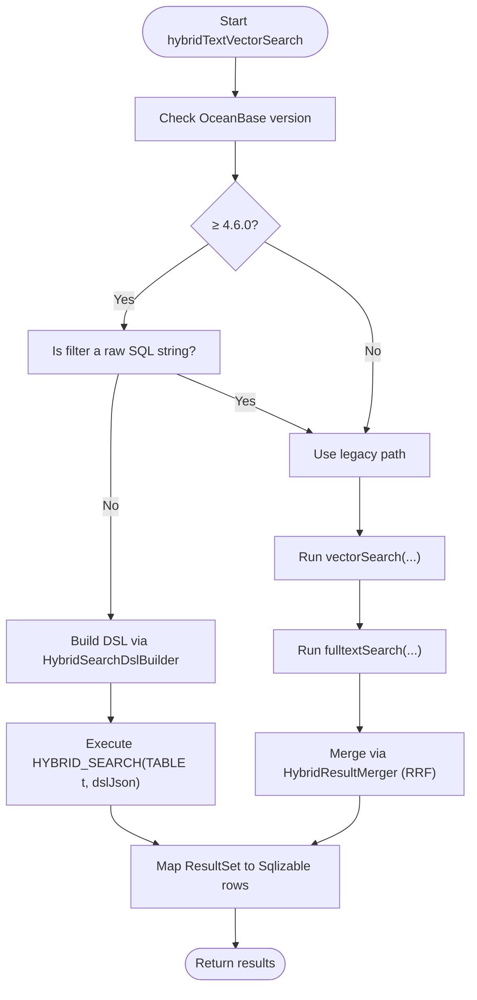
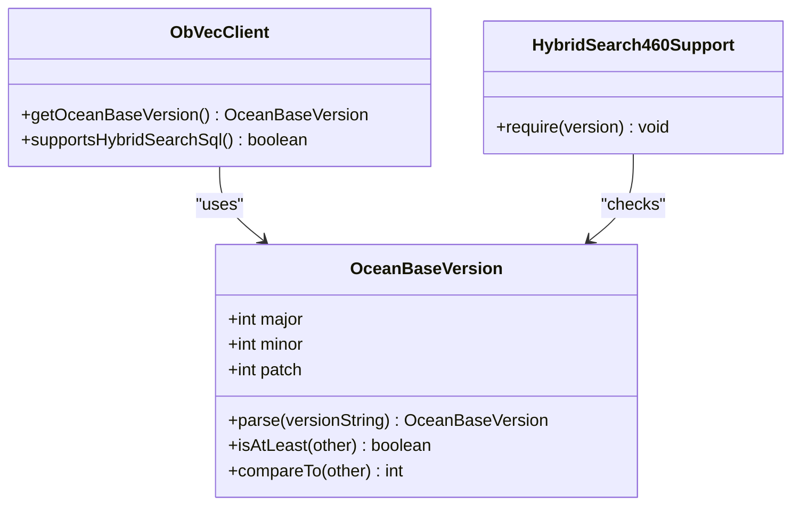
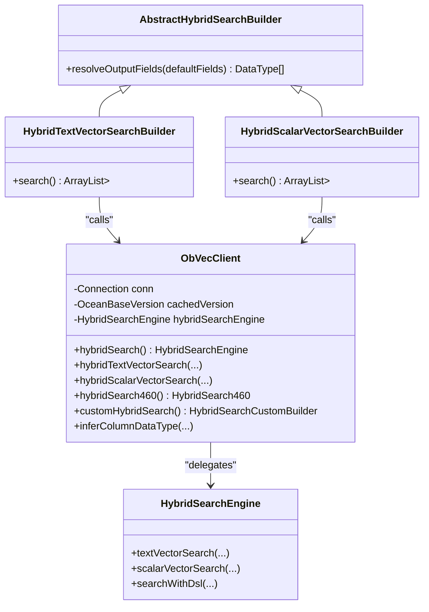
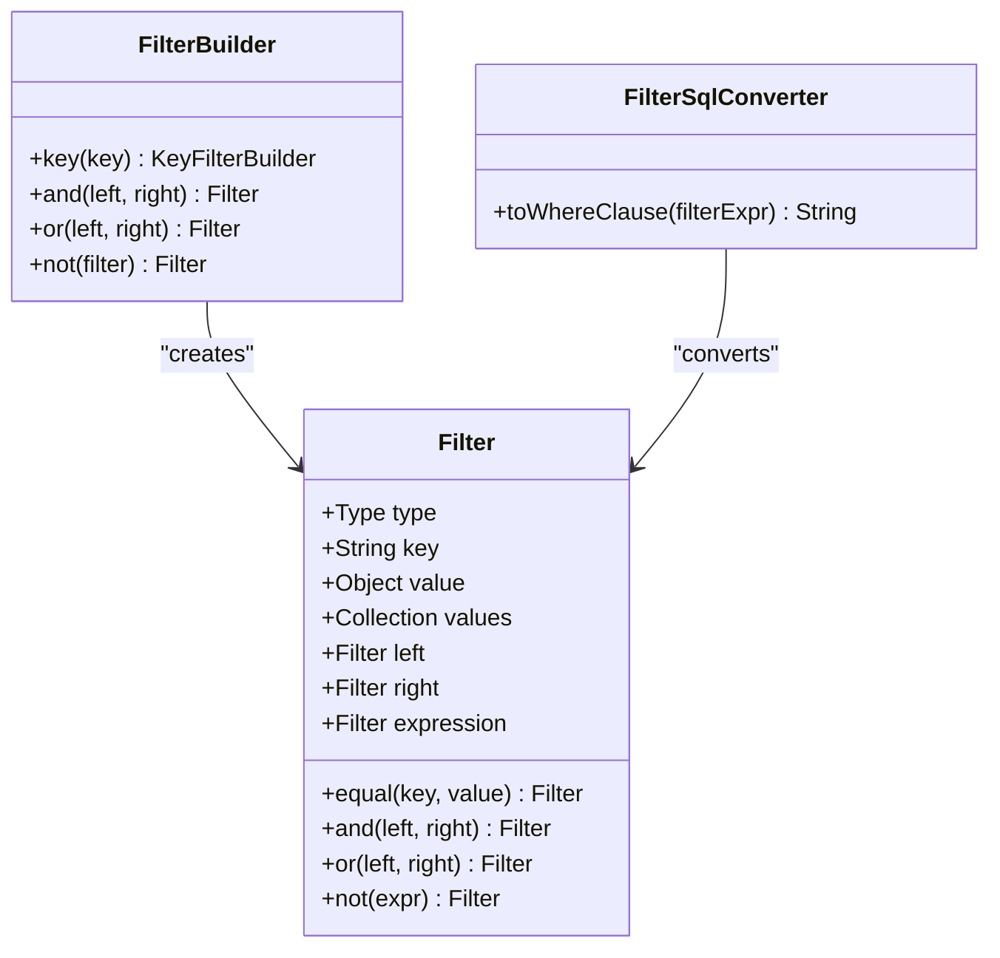
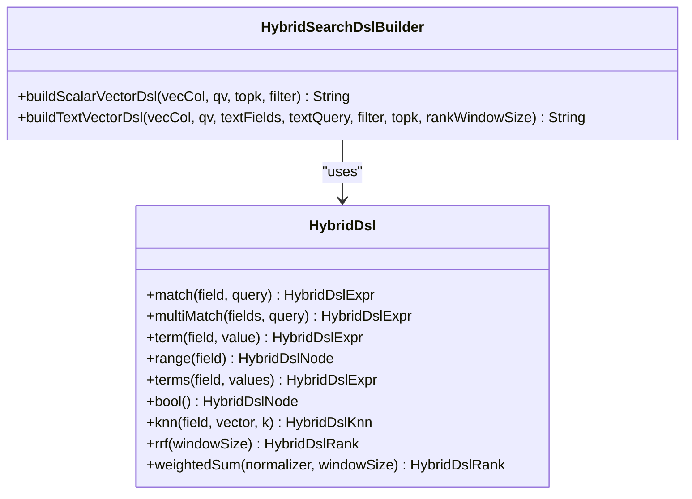
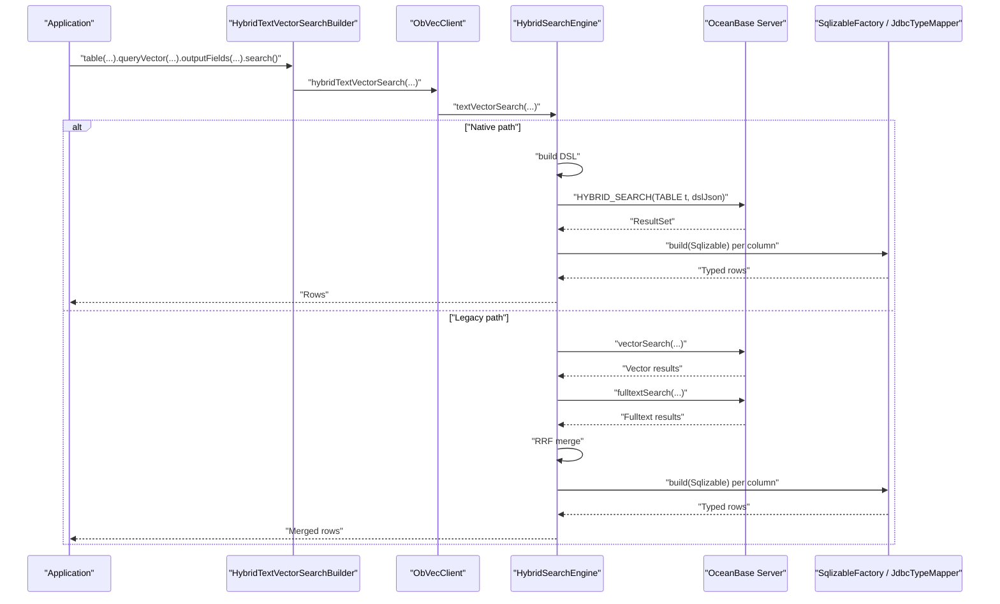
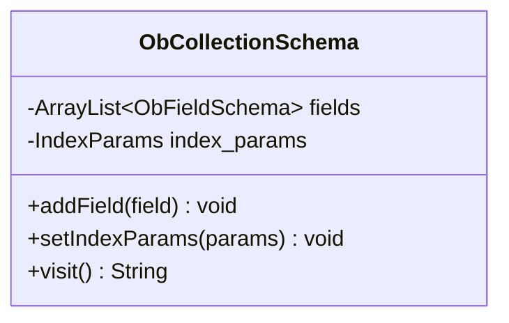
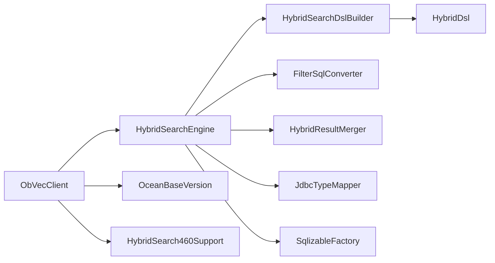

# Core Concepts and Architecture

<cite>
**Referenced Files in This Document**
- [ObVecClient.java](file://src/main/java/com/oceanbase/obvector4j/ObVecClient.java)
- [HybridSearchEngine.java](file://src/main/java/com/oceanbase/obvector4j/hybrid/HybridSearchEngine.java)
- [OceanBaseVersion.java](file://src/main/java/com/oceanbase/obvector4j/version/OceanBaseVersion.java)
- [HybridSearch460Support.java](file://src/main/java/com/oceanbase/obvector4j/hybrid/v460/HybridSearch460Support.java)
- [HybridSearchDslBuilder.java](file://src/main/java/com/oceanbase/obvector4j/hybrid/v460/HybridSearchDslBuilder.java)
- [HybridDsl.java](file://src/main/java/com/oceanbase/obvector4j/hybrid/v460/dsl/HybridDsl.java)
- [Filter.java](file://src/main/java/com/oceanbase/obvector4j/filter/Filter.java)
- [FilterBuilder.java](file://src/main/java/com/oceanbase/obvector4j/filter/FilterBuilder.java)
- [FilterSqlConverter.java](file://src/main/java/com/oceanbase/obvector4j/filter/FilterSqlConverter.java)
- [AbstractHybridSearchBuilder.java](file://src/main/java/com/oceanbase/obvector4j/hybrid/AbstractHybridSearchBuilder.java)
- [HybridTextVectorSearchBuilder.java](file://src/main/java/com/oceanbase/obvector4j/hybrid/HybridTextVectorSearchBuilder.java)
- [HybridScalarVectorSearchBuilder.java](file://src/main/java/com/oceanbase/obvector4j/hybrid/HybridScalarVectorSearchBuilder.java)
- [HybridResultMerger.java](file://src/main/java/com/oceanbase/obvector4j/hybrid/HybridResultMerger.java)
- [SqlizableFactory.java](file://src/main/java/com/oceanbase/obvector4j/model/SqlizableFactory.java)
- [JdbcTypeMapper.java](file://src/main/java/com/oceanbase/obvector4j/util/JdbcTypeMapper.java)
- [ObCollectionSchema.java](file://src/main/java/com/oceanbase/obvector4j/schema/ObCollectionSchema.java)
</cite>

## Table of Contents
1. [Introduction](#introduction)
2. [Project Structure](#project-structure)
3. [Core Components](#core-components)
4. [Architecture Overview](#architecture-overview)
5. [Detailed Component Analysis](#detailed-component-analysis)
6. [Dependency Analysis](#dependency-analysis)
7. [Performance Considerations](#performance-considerations)
8. [Troubleshooting Guide](#troubleshooting-guide)
9. [Conclusion](#conclusion)

## Introduction
This document explains the core concepts and system design of OceanBase Vector4J, focusing on its layered architecture (client layer, search engine layer, database abstraction), intelligent query routing between native HYBRID_SEARCH SQL (OceanBase ≥ 4.6.0) and legacy approaches, version detection and compatibility, graceful degradation strategies, and end-to-end data flow from high-level APIs to optimized SQL generation and result processing.

## Project Structure
The codebase is organized by feature and responsibility:
- Client layer: ObVecClient orchestrates connections, schema operations, and delegates hybrid search to the search engine layer.
- Search engine layer: HybridSearchEngine selects execution paths (native HYBRID_SEARCH vs legacy), builds DSL or SQL, and executes queries.
- Database abstraction: JDBC-based utilities for type mapping, result conversion, and metadata inference.
- Versioning and compatibility: OceanBaseVersion and support gates ensure correct behavior across versions.
- Filter and DSL: Filter model and builders convert filters to SQL WHERE clauses; DSL builders generate JSON payloads for HYBRID_SEARCH.

**Diagram sources**
- [ObVecClient.java](file://src/main/java/com/oceanbase/obvector4j/ObVecClient.java)
- [HybridSearchEngine.java](file://src/main/java/com/oceanbase/obvector4j/hybrid/HybridSearchEngine.java)
- [HybridSearchDslBuilder.java](file://src/main/java/com/oceanbase/obvector4j/hybrid/v460/HybridSearchDslBuilder.java)
- [HybridDsl.java](file://src/main/java/com/oceanbase/obvector4j/hybrid/v460/dsl/HybridDsl.java)
- [HybridResultMerger.java](file://src/main/java/com/oceanbase/obvector4j/hybrid/HybridResultMerger.java)
- [JdbcTypeMapper.java](file://src/main/java/com/oceanbase/obvector4j/util/JdbcTypeMapper.java)
- [SqlizableFactory.java](file://src/main/java/com/oceanbase/obvector4j/model/SqlizableFactory.java)
- [ObCollectionSchema.java](file://src/main/java/com/oceanbase/obvector4j/schema/ObCollectionSchema.java)
- [OceanBaseVersion.java](file://src/main/java/com/oceanbase/obvector4j/version/OceanBaseVersion.java)
- [HybridSearch460Support.java](file://src/main/java/com/oceanbase/obvector4j/hybrid/v460/HybridSearch460Support.java)
- [Filter.java](file://src/main/java/com/oceanbase/obvector4j/filter/Filter.java)
- [FilterBuilder.java](file://src/main/java/com/oceanbase/obvector4j/filter/FilterBuilder.java)
- [FilterSqlConverter.java](file://src/main/java/com/oceanbase/obvector4j/filter/FilterSqlConverter.java)
- [AbstractHybridSearchBuilder.java](file://src/main/java/com/oceanbase/obvector4j/hybrid/AbstractHybridSearchBuilder.java)
- [HybridTextVectorSearchBuilder.java](file://src/main/java/com/oceanbase/obvector4j/hybrid/HybridTextVectorSearchBuilder.java)
- [HybridScalarVectorSearchBuilder.java](file://src/main/java/com/oceanbase/obvector4j/hybrid/HybridScalarVectorSearchBuilder.java)

**Section sources**
- [ObVecClient.java](file://src/main/java/com/oceanbase/obvector4j/ObVecClient.java)
- [HybridSearchEngine.java](file://src/main/java/com/oceanbase/obvector4j/hybrid/HybridSearchEngine.java)
- [HybridSearchDslBuilder.java](file://src/main/java/com/oceanbase/obvector4j/hybrid/v460/HybridSearchDslBuilder.java)
- [HybridDsl.java](file://src/main/java/com/oceanbase/obvector4j/hybrid/v460/dsl/HybridDsl.java)
- [HybridResultMerger.java](file://src/main/java/com/oceanbase/obvector4j/hybrid/HybridResultMerger.java)
- [JdbcTypeMapper.java](file://src/main/java/com/oceanbase/obvector4j/util/JdbcTypeMapper.java)
- [SqlizableFactory.java](file://src/main/java/com/oceanbase/obvector4j/model/SqlizableFactory.java)
- [ObCollectionSchema.java](file://src/main/java/com/oceanbase/obvector4j/schema/ObCollectionSchema.java)
- [OceanBaseVersion.java](file://src/main/java/com/oceanbase/obvector4j/version/OceanBaseVersion.java)
- [HybridSearch460Support.java](file://src/main/java/com/oceanbase/obvector4j/hybrid/v460/HybridSearch460Support.java)
- [Filter.java](file://src/main/java/com/oceanbase/obvector4j/filter/Filter.java)
- [FilterBuilder.java](file://src/main/java/com/oceanbase/obvector4j/filter/FilterBuilder.java)
- [FilterSqlConverter.java](file://src/main/java/com/oceanbase/obvector4j/filter/FilterSqlConverter.java)
- [AbstractHybridSearchBuilder.java](file://src/main/java/com/oceanbase/obvector4j/hybrid/AbstractHybridSearchBuilder.java)
- [HybridTextVectorSearchBuilder.java](file://src/main/java/com/oceanbase/obvector4j/hybrid/HybridTextVectorSearchBuilder.java)
- [HybridScalarVectorSearchBuilder.java](file://src/main/java/com/oceanbase/obvector4j/hybrid/HybridScalarVectorSearchBuilder.java)

## Core Components
- ObVecClient: Entry point for connection management, schema operations, and hybrid search orchestration. It detects OceanBase version, supports HYBRID_SEARCH capability checks, and delegates to HybridSearchEngine.
- HybridSearchEngine: Intelligent router that chooses between native HYBRID_SEARCH SQL (4.6.0+) and legacy fallbacks. Builds DSL or legacy SQL, executes queries, and maps results.
- Versioning: OceanBaseVersion parses server version strings and provides comparison utilities. HybridSearch460Support enforces minimum version requirements for DSL features.
- Filters: Filter and FilterBuilder provide a fluent API to construct filter expressions. FilterSqlConverter translates filters into SQL WHERE clauses for legacy paths.
- DSL Builders: HybridSearchDslBuilder and HybridDsl generate JSON payloads for HYBRID_SEARCH, including text match, multi-match, KNN, RRF, and weighted sum ranking.
- Result Processing: SqlizableFactory and JdbcTypeMapper map JDBC types to SDK types and build typed row objects.
- Schema Management: ObCollectionSchema generates table definitions with primary keys and index parameters.

**Section sources**
- [ObVecClient.java](file://src/main/java/com/oceanbase/obvector4j/ObVecClient.java)
- [HybridSearchEngine.java](file://src/main/java/com/oceanbase/obvector4j/hybrid/HybridSearchEngine.java)
- [OceanBaseVersion.java](file://src/main/java/com/oceanbase/obvector4j/version/OceanBaseVersion.java)
- [HybridSearch460Support.java](file://src/main/java/com/oceanbase/obvector4j/hybrid/v460/HybridSearch460Support.java)
- [Filter.java](file://src/main/java/com/oceanbase/obvector4j/filter/Filter.java)
- [FilterBuilder.java](file://src/main/java/com/oceanbase/obvector4j/filter/FilterBuilder.java)
- [FilterSqlConverter.java](file://src/main/java/com/oceanbase/obvector4j/filter/FilterSqlConverter.java)
- [HybridSearchDslBuilder.java](file://src/main/java/com/oceanbase/obvector4j/hybrid/v460/HybridSearchDslBuilder.java)
- [HybridDsl.java](file://src/main/java/com/oceanbase/obvector4j/hybrid/v460/dsl/HybridDsl.java)
- [SqlizableFactory.java](file://src/main/java/com/oceanbase/obvector4j/model/SqlizableFactory.java)
- [JdbcTypeMapper.java](file://src/main/java/com/oceanbase/obvector4j/util/JdbcTypeMapper.java)
- [ObCollectionSchema.java](file://src/main/java/com/oceanbase/obvector4j/schema/ObCollectionSchema.java)

## Architecture Overview
The system follows a layered architecture:
- Client Layer: High-level APIs (builders and direct methods) accept user inputs and validate parameters.
- Search Engine Layer: Routes queries based on version and feature availability, constructs DSL or legacy SQL, and executes them.
- Database Abstraction: Handles JDBC interactions, type mapping, and result conversion.

**Diagram sources**
- [ObVecClient.java](file://src/main/java/com/oceanbase/obvector4j/ObVecClient.java)
- [HybridSearchEngine.java](file://src/main/java/com/oceanbase/obvector4j/hybrid/HybridSearchEngine.java)
- [OceanBaseVersion.java](file://src/main/java/com/oceanbase/obvector4j/version/OceanBaseVersion.java)
- [HybridSearch460Support.java](file://src/main/java/com/oceanbase/obvector4j/hybrid/v460/HybridSearch460Support.java)
- [HybridSearchDslBuilder.java](file://src/main/java/com/oceanbase/obvector4j/hybrid/v460/HybridSearchDslBuilder.java)
- [HybridResultMerger.java](file://src/main/java/com/oceanbase/obvector4j/hybrid/HybridResultMerger.java)

## Detailed Component Analysis

### Intelligent Query Routing System
- Decision logic:
  - If OceanBase version ≥ 4.6.0 and filter expression is not a raw SQL string, use native HYBRID_SEARCH SQL with DSL.
  - Otherwise, fall back to legacy approach: vector search plus optional full-text search, then merge results using RRF.
- Graceful degradation:
  - Full-text search failures are handled gracefully by returning empty results while still providing vector results.
  - Output field validation ensures consistent column projection and type mapping.

**Diagram sources**
- [HybridSearchEngine.java](file://src/main/java/com/oceanbase/obvector4j/hybrid/HybridSearchEngine.java)
- [HybridSearchDslBuilder.java](file://src/main/java/com/oceanbase/obvector4j/hybrid/v460/HybridSearchDslBuilder.java)
- [HybridResultMerger.java](file://src/main/java/com/oceanbase/obvector4j/hybrid/HybridResultMerger.java)

**Section sources**
- [HybridSearchEngine.java](file://src/main/java/com/oceanbase/obvector4j/hybrid/HybridSearchEngine.java)
- [HybridSearchDslBuilder.java](file://src/main/java/com/oceanbase/obvector4j/hybrid/v460/HybridSearchDslBuilder.java)
- [HybridResultMerger.java](file://src/main/java/com/oceanbase/obvector4j/hybrid/HybridResultMerger.java)

### Version Detection Mechanism and Feature Compatibility Matrix
- Version detection:
  - ObVecClient.getOceanBaseVersion attempts OB_VERSION() first, falls back to VERSION(), parses the string via OceanBaseVersion.parse, and caches the result.
- Minimum version constant:
  - OceanBaseVersion.HYBRID_SEARCH_SQL_MIN defines the threshold for HYBRID_SEARCH SQL support (4.6.0).
- Support gate:
  - HybridSearch460Support.require throws an exception if the current version is below the required threshold.

**Diagram sources**
- [OceanBaseVersion.java](file://src/main/java/com/oceanbase/obvector4j/version/OceanBaseVersion.java)
- [HybridSearch460Support.java](file://src/main/java/com/oceanbase/obvector4j/hybrid/v460/HybridSearch460Support.java)
- [ObVecClient.java](file://src/main/java/com/oceanbase/obvector4j/ObVecClient.java)

**Section sources**
- [ObVecClient.java](file://src/main/java/com/oceanbase/obvector4j/ObVecClient.java)
- [OceanBaseVersion.java](file://src/main/java/com/oceanbase/obvector4j/version/OceanBaseVersion.java)
- [HybridSearch460Support.java](file://src/main/java/com/oceanbase/obvector4j/hybrid/v460/HybridSearch460Support.java)

### ObVecClient Orchestration and Builder Interaction
- ObVecClient initializes HybridSearchEngine with a VersionSupport callback that delegates to client methods for version and capability checks.
- Fluent builders (HybridTextVectorSearchBuilder, HybridScalarVectorSearchBuilder) extend AbstractHybridSearchBuilder to resolve output fields and delegate to client methods.
- The client exposes both direct methods and builder APIs for hybrid searches, as well as a 4.6.0+ DSL entry point.

**Diagram sources**
- [ObVecClient.java](file://src/main/java/com/oceanbase/obvector4j/ObVecClient.java)
- [HybridSearchEngine.java](file://src/main/java/com/oceanbase/obvector4j/hybrid/HybridSearchEngine.java)
- [AbstractHybridSearchBuilder.java](file://src/main/java/com/oceanbase/obvector4j/hybrid/AbstractHybridSearchBuilder.java)
- [HybridTextVectorSearchBuilder.java](file://src/main/java/com/oceanbase/obvector4j/hybrid/HybridTextVectorSearchBuilder.java)
- [HybridScalarVectorSearchBuilder.java](file://src/main/java/com/oceanbase/obvector4j/hybrid/HybridScalarVectorSearchBuilder.java)

**Section sources**
- [ObVecClient.java](file://src/main/java/com/oceanbase/obvector4j/ObVecClient.java)
- [HybridSearchEngine.java](file://src/main/java/com/oceanbase/obvector4j/hybrid/HybridSearchEngine.java)
- [AbstractHybridSearchBuilder.java](file://src/main/java/com/oceanbase/obvector4j/hybrid/AbstractHybridSearchBuilder.java)
- [HybridTextVectorSearchBuilder.java](file://src/main/java/com/oceanbase/obvector4j/hybrid/HybridTextVectorSearchBuilder.java)
- [HybridScalarVectorSearchBuilder.java](file://src/main/java/com/oceanbase/obvector4j/hybrid/HybridScalarVectorSearchBuilder.java)

### Filter Builders and SQL Conversion
- Filter model supports comparison, logical, and containment operations.
- FilterBuilder provides a fluent API to construct complex filters.
- For legacy paths, FilterSqlConverter converts Filter objects into SQL WHERE clauses with proper escaping and formatting.

**Diagram sources**
- [Filter.java](file://src/main/java/com/oceanbase/obvector4j/filter/Filter.java)
- [FilterBuilder.java](file://src/main/java/com/oceanbase/obvector4j/filter/FilterBuilder.java)
- [FilterSqlConverter.java](file://src/main/java/com/oceanbase/obvector4j/filter/FilterSqlConverter.java)

**Section sources**
- [Filter.java](file://src/main/java/com/oceanbase/obvector4j/filter/Filter.java)
- [FilterBuilder.java](file://src/main/java/com/oceanbase/obvector4j/filter/FilterBuilder.java)
- [FilterSqlConverter.java](file://src/main/java/com/oceanbase/obvector4j/filter/FilterSqlConverter.java)

### DSL Construction for Native HYBRID_SEARCH
- HybridSearchDslBuilder composes DSL JSON for scalar-vector and text-vector scenarios, integrating filters and ranking strategies (RRF, weighted_sum).
- HybridDsl provides typed helpers for match, multi_match, term, range, terms, bool, knn, rrf, and weighted_sum, enabling expressive query construction.

**Diagram sources**
- [HybridSearchDslBuilder.java](file://src/main/java/com/oceanbase/obvector4j/hybrid/v460/HybridSearchDslBuilder.java)
- [HybridDsl.java](file://src/main/java/com/oceanbase/obvector4j/hybrid/v460/dsl/HybridDsl.java)

**Section sources**
- [HybridSearchDslBuilder.java](file://src/main/java/com/oceanbase/obvector4j/hybrid/v460/HybridSearchDslBuilder.java)
- [HybridDsl.java](file://src/main/java/com/oceanbase/obvector4j/hybrid/v460/dsl/HybridDsl.java)

### Data Flow: From High-Level API Calls to Optimized SQL Generation and Result Processing
- Sequence overview:
  - Application calls builder.search() or ObVecClient.hybrid* methods.
  - ObVecClient delegates to HybridSearchEngine.
  - HybridSearchEngine decides execution path based on version and filter type.
  - For native path: DSL is built and executed via HYBRID_SEARCH(TABLE t, dslJson).
  - For legacy path: vector and full-text queries are executed separately and merged via RRF.
  - Results are mapped to typed Sqlizable objects using SqlizableFactory and JdbcTypeMapper.

**Diagram sources**
- [HybridTextVectorSearchBuilder.java](file://src/main/java/com/oceanbase/obvector4j/hybrid/HybridTextVectorSearchBuilder.java)
- [ObVecClient.java](file://src/main/java/com/oceanbase/obvector4j/ObVecClient.java)
- [HybridSearchEngine.java](file://src/main/java/com/oceanbase/obvector4j/hybrid/HybridSearchEngine.java)
- [HybridResultMerger.java](file://src/main/java/com/oceanbase/obvector4j/hybrid/HybridResultMerger.java)
- [SqlizableFactory.java](file://src/main/java/com/oceanbase/obvector4j/model/SqlizableFactory.java)
- [JdbcTypeMapper.java](file://src/main/java/com/oceanbase/obvector4j/util/JdbcTypeMapper.java)

**Section sources**
- [HybridTextVectorSearchBuilder.java](file://src/main/java/com/oceanbase/obvector4j/hybrid/HybridTextVectorSearchBuilder.java)
- [ObVecClient.java](file://src/main/java/com/oceanbase/obvector4j/ObVecClient.java)
- [HybridSearchEngine.java](file://src/main/java/com/oceanbase/obvector4j/hybrid/HybridSearchEngine.java)
- [HybridResultMerger.java](file://src/main/java/com/oceanbase/obvector4j/hybrid/HybridResultMerger.java)
- [SqlizableFactory.java](file://src/main/java/com/oceanbase/obvector4j/model/SqlizableFactory.java)
- [JdbcTypeMapper.java](file://src/main/java/com/oceanbase/obvector4j/util/JdbcTypeMapper.java)

### Schema Management
- ObCollectionSchema aggregates field definitions and index parameters, generating a CREATE TABLE statement fragment via visit().
- Primary keys are automatically included when fields are marked as primary.

**Diagram sources**
- [ObCollectionSchema.java](file://src/main/java/com/oceanbase/obvector4j/schema/ObCollectionSchema.java)

**Section sources**
- [ObCollectionSchema.java](file://src/main/java/com/oceanbase/obvector4j/schema/ObCollectionSchema.java)

## Dependency Analysis
Key dependencies and relationships:
- ObVecClient depends on HybridSearchEngine, OceanBaseVersion, and JDBC utilities.
- HybridSearchEngine depends on DSL builders, filter converters, and result merger.
- Version gating uses OceanBaseVersion constants and support checks.
- Type mapping relies on JdbcTypeMapper and SqlizableFactory.

**Diagram sources**
- [ObVecClient.java](file://src/main/java/com/oceanbase/obvector4j/ObVecClient.java)
- [HybridSearchEngine.java](file://src/main/java/com/oceanbase/obvector4j/hybrid/HybridSearchEngine.java)
- [HybridSearchDslBuilder.java](file://src/main/java/com/oceanbase/obvector4j/hybrid/v460/HybridSearchDslBuilder.java)
- [HybridDsl.java](file://src/main/java/com/oceanbase/obvector4j/hybrid/v460/dsl/HybridDsl.java)
- [FilterSqlConverter.java](file://src/main/java/com/oceanbase/obvector4j/filter/FilterSqlConverter.java)
- [HybridResultMerger.java](file://src/main/java/com/oceanbase/obvector4j/hybrid/HybridResultMerger.java)
- [JdbcTypeMapper.java](file://src/main/java/com/oceanbase/obvector4j/util/JdbcTypeMapper.java)
- [SqlizableFactory.java](file://src/main/java/com/oceanbase/obvector4j/model/SqlizableFactory.java)
- [OceanBaseVersion.java](file://src/main/java/com/oceanbase/obvector4j/version/OceanBaseVersion.java)
- [HybridSearch460Support.java](file://src/main/java/com/oceanbase/obvector4j/hybrid/v460/HybridSearch460Support.java)

**Section sources**
- [ObVecClient.java](file://src/main/java/com/oceanbase/obvector4j/ObVecClient.java)
- [HybridSearchEngine.java](file://src/main/java/com/oceanbase/obvector4j/hybrid/HybridSearchEngine.java)
- [HybridSearchDslBuilder.java](file://src/main/java/com/oceanbase/obvector4j/hybrid/v460/HybridSearchDslBuilder.java)
- [HybridDsl.java](file://src/main/java/com/oceanbase/obvector4j/hybrid/v460/dsl/HybridDsl.java)
- [FilterSqlConverter.java](file://src/main/java/com/oceanbase/obvector4j/filter/FilterSqlConverter.java)
- [HybridResultMerger.java](file://src/main/java/com/oceanbase/obvector4j/hybrid/HybridResultMerger.java)
- [JdbcTypeMapper.java](file://src/main/java/com/oceanbase/obvector4j/util/JdbcTypeMapper.java)
- [SqlizableFactory.java](file://src/main/java/com/oceanbase/obvector4j/model/SqlizableFactory.java)
- [OceanBaseVersion.java](file://src/main/java/com/oceanbase/obvector4j/version/OceanBaseVersion.java)
- [HybridSearch460Support.java](file://src/main/java/com/oceanbase/obvector4j/hybrid/v460/HybridSearch460Support.java)

## Performance Considerations
- Prefer native HYBRID_SEARCH SQL on OceanBase ≥ 4.6.0 for better performance due to server-side optimization and unified ranking.
- Use appropriate rank window size to balance recall and latency in text-vector hybrid searches.
- Minimize output fields to reduce network overhead and improve result mapping speed.
- Leverage prepared statements and parameter binding to avoid repeated parsing and optimize execution plans.

## Troubleshooting Guide
- Version detection failures:
  - Ensure OB_VERSION() is available; otherwise, the client falls back to VERSION(). If both fail, a SQLException is thrown indicating inability to detect version.
- Unsupported HYBRID_SEARCH DSL:
  - HybridSearch460Support.require will throw UnsupportedOperationException if the connected cluster is below 4.6.0. Upgrade or use legacy paths.
- Full-text search errors:
  - Legacy fulltextSearch catches exceptions and returns empty results to allow vector results to proceed. Inspect logs for warnings and verify full-text indexes exist.
- Output field mismatches:
  - Validate that output fields count matches provided data types; otherwise, IllegalArgumentException is raised. Use inferColumnDataType to auto-resolve types.

**Section sources**
- [ObVecClient.java](file://src/main/java/com/oceanbase/obvector4j/ObVecClient.java)
- [HybridSearch460Support.java](file://src/main/java/com/oceanbase/obvector4j/hybrid/v460/HybridSearch460Support.java)
- [HybridSearchEngine.java](file://src/main/java/com/oceanbase/obvector4j/hybrid/HybridSearchEngine.java)

## Conclusion
OceanBase Vector4J provides a robust, layered architecture that abstracts database specifics while offering flexible, high-performance hybrid search capabilities. Its intelligent routing leverages native HYBRID_SEARCH SQL where available and gracefully degrades to legacy approaches. Strong version detection, comprehensive filter support, and typed result processing make it suitable for diverse deployment environments and evolving OceanBase capabilities.