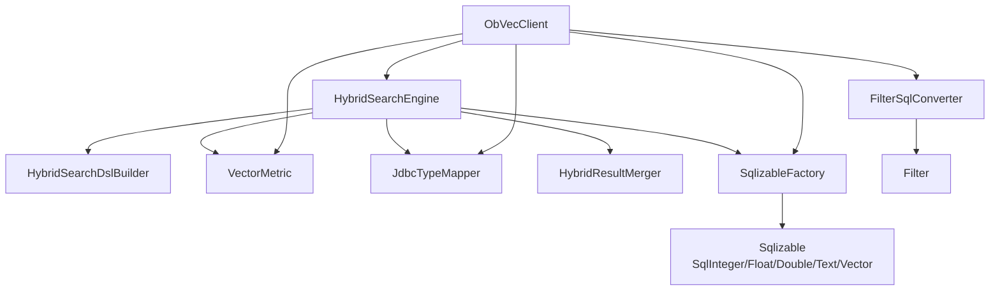
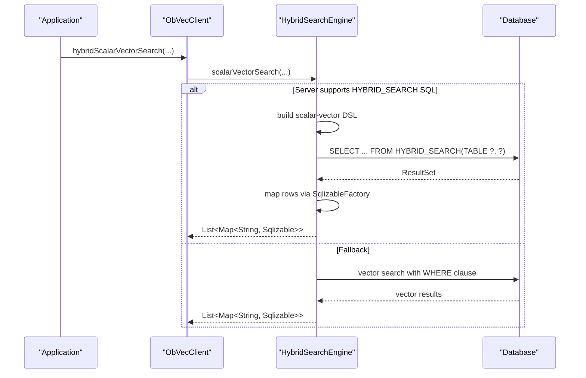
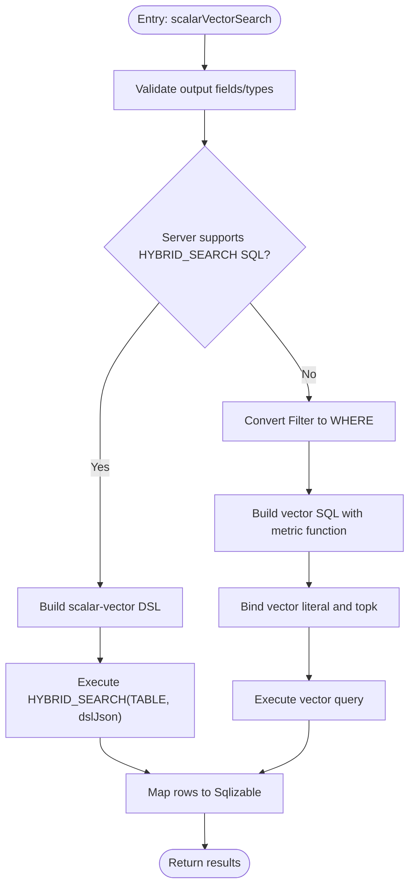
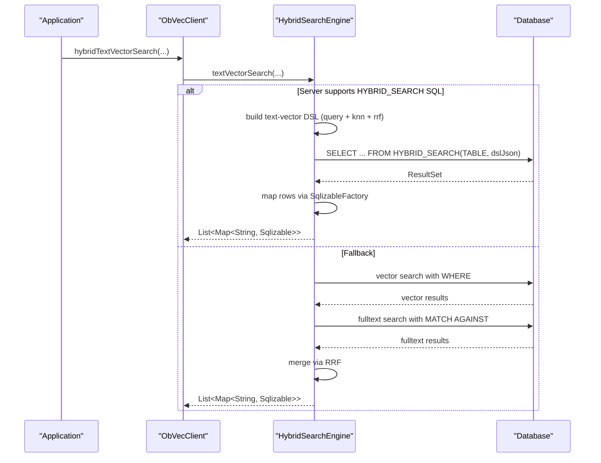
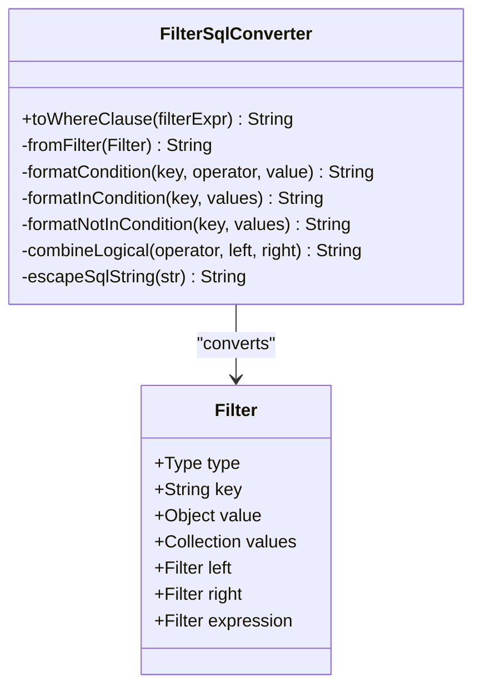
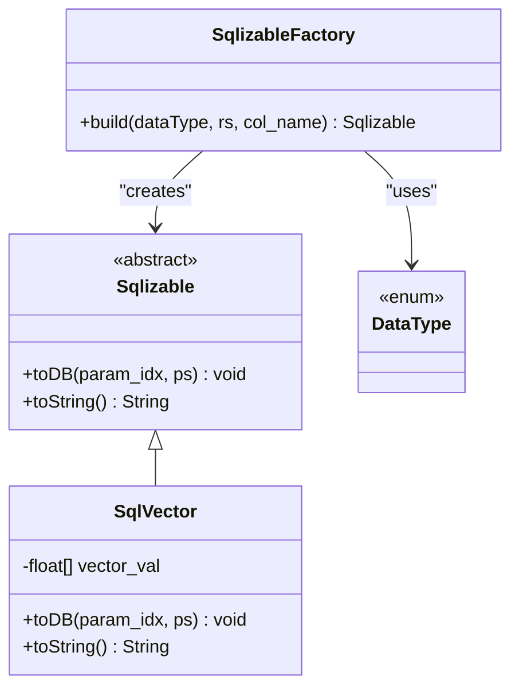
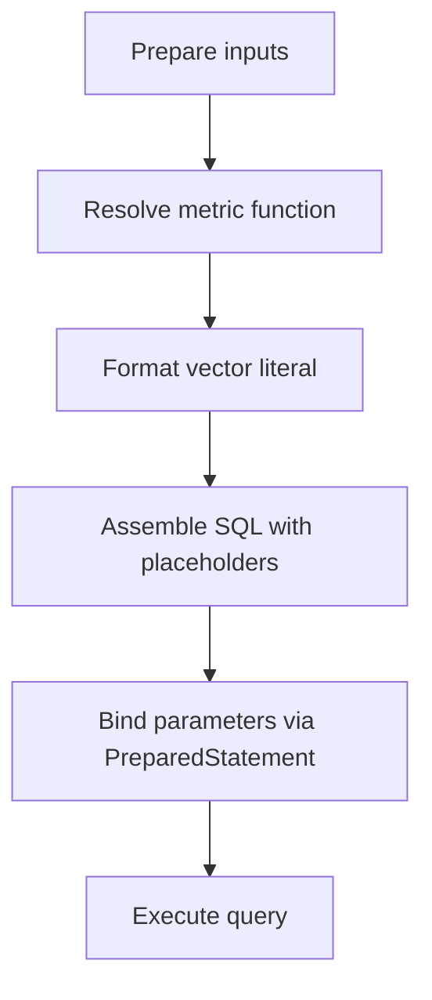
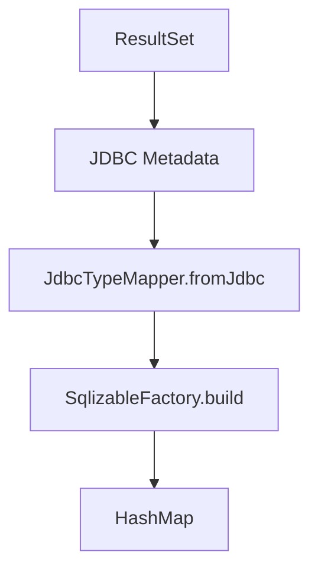
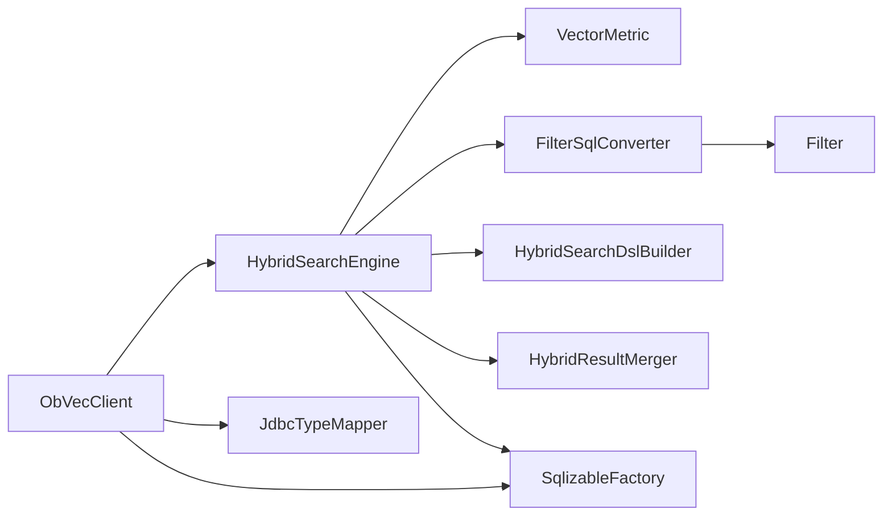

# Data Flow and Query Processing Pipeline

<cite>
**Referenced Files in This Document**
- [ObVecClient.java](file://src/main/java/com/oceanbase/obvector4j/ObVecClient.java)
- [HybridSearchEngine.java](file://src/main/java/com/oceanbase/obvector4j/hybrid/HybridSearchEngine.java)
- [Filter.java](file://src/main/java/com/oceanbase/obvector4j/filter/Filter.java)
- [FilterSqlConverter.java](file://src/main/java/com/oceanbase/obvector4j/filter/FilterSqlConverter.java)
- [Sqlizable.java](file://src/main/java/com/oceanbase/obvector4j/model/Sqlizable.java)
- [SqlizableFactory.java](file://src/main/java/com/oceanbase/obvector4j/model/SqlizableFactory.java)
- [SqlVector.java](file://src/main/java/com/oceanbase/obvector4j/model/SqlVector.java)
- [JdbcTypeMapper.java](file://src/main/java/com/oceanbase/obvector4j/util/JdbcTypeMapper.java)
- [VectorMetric.java](file://src/main/java/com/oceanbase/obvector4j/util/VectorMetric.java)
- [HybridResultMerger.java](file://src/main/java/com/oceanbase/obvector4j/hybrid/HybridResultMerger.java)
- [AbstractHybridSearchBuilder.java](file://src/main/java/com/oceanbase/obvector4j/hybrid/AbstractHybridSearchBuilder.java)
- [HybridSearchDslBuilder.java](file://src/main/java/com/oceanbase/obvector4j/hybrid/core/HybridSearchDslBuilder.java)
</cite>

## Table of Contents
1. [Introduction](#introduction)
2. [Project Structure](#project-structure)
3. [Core Components](#core-components)
4. [Architecture Overview](#architecture-overview)
5. [Detailed Component Analysis](#detailed-component-analysis)
6. [Dependency Analysis](#dependency-analysis)
7. [Performance Considerations](#performance-considerations)
8. [Troubleshooting Guide](#troubleshooting-guide)
9. [Conclusion](#conclusion)

## Introduction
This document explains the end-to-end data flow pipeline from high-level API calls to database execution and result mapping. It covers query construction, parameter binding, SQL generation, database execution, and result mapping for vector, full-text, and hybrid search operations. It also details how Sqlizable objects are created and managed, how Filter expressions are converted to SQL WHERE clauses, and how results are mapped back to typed Java objects. Step-by-step examples illustrate different operation types, and error handling, logging, and debugging approaches are discussed.

## Project Structure
The pipeline spans a small set of focused components:
- Client entry points that accept user parameters and orchestrate queries
- Hybrid search engine that chooses between native HYBRID_SEARCH SQL (4.6.0+) or legacy fallback paths
- Filter expression model and SQL converter
- Type system for safe parameter binding and result mapping
- Utilities for metric resolution and JDBC type inference

**Diagram sources**
- [ObVecClient.java](file://src/main/java/com/oceanbase/obvector4j/ObVecClient.java)
- [HybridSearchEngine.java](file://src/main/java/com/oceanbase/obvector4j/hybrid/HybridSearchEngine.java)
- [HybridSearchDslBuilder.java](file://src/main/java/com/oceanbase/obvector4j/hybrid/core/HybridSearchDslBuilder.java)
- [Filter.java](file://src/main/java/com/oceanbase/obvector4j/filter/Filter.java)
- [FilterSqlConverter.java](file://src/main/java/com/oceanbase/obvector4j/filter/FilterSqlConverter.java)
- [SqlizableFactory.java](file://src/main/java/com/oceanbase/obvector4j/model/SqlizableFactory.java)
- [Sqlizable.java](file://src/main/java/com/oceanbase/obvector4j/model/Sqlizable.java)
- [SqlVector.java](file://src/main/java/com/oceanbase/obvector4j/model/SqlVector.java)
- [JdbcTypeMapper.java](file://src/main/java/com/oceanbase/obvector4j/util/JdbcTypeMapper.java)
- [VectorMetric.java](file://src/main/java/com/oceanbase/obvector4j/util/VectorMetric.java)
- [HybridResultMerger.java](file://src/main/java/com/oceanbase/obvector4j/hybrid/HybridResultMerger.java)

**Section sources**
- [ObVecClient.java](file://src/main/java/com/oceanbase/obvector4j/ObVecClient.java)
- [HybridSearchEngine.java](file://src/main/java/com/oceanbase/obvector4j/hybrid/HybridSearchEngine.java)

## Core Components
- ObVecClient: High-level client providing scalar/vector, text/vector, and hybrid search APIs; manages connection, version detection, and delegates to HybridSearchEngine when appropriate.
- HybridSearchEngine: Orchestrates query building and execution; selects native HYBRID_SEARCH SQL path (4.6.0+) or legacy fallback; merges results using RRF when needed.
- Filter and FilterSqlConverter: Define filter expressions and convert them into SQL WHERE fragments.
- Sqlizable and SqlizableFactory: Provide typed parameter binding and result mapping across numeric, string, JSON, and vector types.
- VectorMetric: Resolves distance functions and formats vector literals for SQL.
- JdbcTypeMapper: Maps JDBC metadata to SDK DataType for automatic result mapping.
- HybridResultMerger: Implements Reciprocal Rank Fusion for legacy hybrid search.
- AbstractHybridSearchBuilder: Shared builder utilities for output field resolution and type inference.

**Section sources**
- [ObVecClient.java](file://src/main/java/com/oceanbase/obvector4j/ObVecClient.java)
- [HybridSearchEngine.java](file://src/main/java/com/oceanbase/obvector4j/hybrid/HybridSearchEngine.java)
- [Filter.java](file://src/main/java/com/oceanbase/obvector4j/filter/Filter.java)
- [FilterSqlConverter.java](file://src/main/java/com/oceanbase/obvector4j/filter/FilterSqlConverter.java)
- [Sqlizable.java](file://src/main/java/com/oceanbase/obvector4j/model/Sqlizable.java)
- [SqlizableFactory.java](file://src/main/java/com/oceanbase/obvector4j/model/SqlizableFactory.java)
- [SqlVector.java](file://src/main/java/com/oceanbase/obvector4j/model/SqlVector.java)
- [JdbcTypeMapper.java](file://src/main/java/com/oceanbase/obvector4j/util/JdbcTypeMapper.java)
- [VectorMetric.java](file://src/main/java/com/oceanbase/obvector4j/util/VectorMetric.java)
- [HybridResultMerger.java](file://src/main/java/com/oceanbase/obvector4j/hybrid/HybridResultMerger.java)
- [AbstractHybridSearchBuilder.java](file://src/main/java/com/oceanbase/obvector4j/hybrid/AbstractHybridSearchBuilder.java)

## Architecture Overview
The pipeline has two primary execution paths depending on server capability:
- Native HYBRID_SEARCH SQL path (OceanBase 4.6.0+): Builds a DSL JSON payload and executes a single HYBRID_SEARCH call with parameterized input.
- Legacy fallback path: Executes separate vector and full-text queries, then merges results using RRF.

**Diagram sources**
- [ObVecClient.java](file://src/main/java/com/oceanbase/obvector4j/ObVecClient.java)
- [HybridSearchEngine.java](file://src/main/java/com/oceanbase/obvector4j/hybrid/HybridSearchEngine.java)

## Detailed Component Analysis

### Scalar + Vector Search Pipeline
- Input validation and output field/type resolution occur in builders and validators.
- If supported, a scalar-vector DSL is built and executed via HYBRID_SEARCH.
- Otherwise, a direct vector search SQL is constructed with metric function and ORDER BY, applying optional WHERE clause.

**Diagram sources**
- [HybridSearchEngine.java](file://src/main/java/com/oceanbase/obvector4j/hybrid/HybridSearchEngine.java)
- [FilterSqlConverter.java](file://src/main/java/com/oceanbase/obvector4j/filter/FilterSqlConverter.java)
- [VectorMetric.java](file://src/main/java/com/oceanbase/obvector4j/util/VectorMetric.java)
- [SqlizableFactory.java](file://src/main/java/com/oceanbase/obvector4j/model/SqlizableFactory.java)

**Section sources**
- [HybridSearchEngine.java](file://src/main/java/com/oceanbase/obvector4j/hybrid/HybridSearchEngine.java)
- [FilterSqlConverter.java](file://src/main/java/com/oceanbase/obvector4j/filter/FilterSqlConverter.java)
- [VectorMetric.java](file://src/main/java/com/oceanbase/obvector4j/util/VectorMetric.java)
- [SqlizableFactory.java](file://src/main/java/com/oceanbase/obvector4j/model/SqlizableFactory.java)

### Text + Vector Hybrid Search Pipeline
- When supported, builds a DSL combining text match and KNN with RRF ranking.
- On fallback, runs separate full-text and vector searches, then merges results by RRF.

**Diagram sources**
- [ObVecClient.java](file://src/main/java/com/oceanbase/obvector4j/ObVecClient.java)
- [HybridSearchEngine.java](file://src/main/java/com/oceanbase/obvector4j/hybrid/HybridSearchEngine.java)
- [HybridResultMerger.java](file://src/main/java/com/oceanbase/obvector4j/hybrid/HybridResultMerger.java)

**Section sources**
- [ObVecClient.java](file://src/main/java/com/oceanbase/obvector4j/ObVecClient.java)
- [HybridSearchEngine.java](file://src/main/java/com/oceanbase/obvector4j/hybrid/HybridSearchEngine.java)
- [HybridResultMerger.java](file://src/main/java/com/oceanbase/obvector4j/hybrid/HybridResultMerger.java)

### Filter Expression to SQL WHERE Clause
- Filter objects represent comparison, IN/NOT_IN, CONTAINS, and logical AND/OR/NOT combinations.
- FilterSqlConverter recursively converts these into SQL fragments, escaping strings and quoting identifiers.

**Diagram sources**
- [Filter.java](file://src/main/java/com/oceanbase/obvector4j/filter/Filter.java)
- [FilterSqlConverter.java](file://src/main/java/com/oceanbase/obvector4j/filter/FilterSqlConverter.java)

**Section sources**
- [Filter.java](file://src/main/java/com/oceanbase/obvector4j/filter/Filter.java)
- [FilterSqlConverter.java](file://src/main/java/com/oceanbase/obvector4j/filter/FilterSqlConverter.java)

### Sqlizable Objects: Creation, Binding, and Mapping
- Sqlizable abstracts typed values for both writing to PreparedStatement and reading from ResultSet.
- SqlizableFactory constructs concrete Sqlizable instances based on DataType inferred from JDBC metadata or explicit schema.
- SqlVector provides vector literal formatting for parameter binding.

**Diagram sources**
- [Sqlizable.java](file://src/main/java/com/oceanbase/obvector4j/model/Sqlizable.java)
- [SqlVector.java](file://src/main/java/com/oceanbase/obvector4j/model/SqlVector.java)
- [SqlizableFactory.java](file://src/main/java/com/oceanbase/obvector4j/model/SqlizableFactory.java)
- [DataType.java](file://src/main/java/com/oceanbase/obvector4j/schema/DataType.java)

**Section sources**
- [Sqlizable.java](file://src/main/java/com/oceanbase/obvector4j/model/Sqlizable.java)
- [SqlizableFactory.java](file://src/main/java/com/oceanbase/obvector4j/model/SqlizableFactory.java)
- [SqlVector.java](file://src/main/java/com/oceanbase/obvector4j/model/SqlVector.java)

### Parameter Binding and SQL Generation
- VectorMetric resolves distance functions and formats vector literals for SQL.
- HybridSearchEngine composes SQL statements with placeholders and binds parameters via PreparedStatement.
- For HYBRID_SEARCH SQL, the DSL JSON is bound as a single parameter.

**Diagram sources**
- [VectorMetric.java](file://src/main/java/com/oceanbase/obvector4j/util/VectorMetric.java)
- [HybridSearchEngine.java](file://src/main/java/com/oceanbase/obvector4j/hybrid/HybridSearchEngine.java)

**Section sources**
- [VectorMetric.java](file://src/main/java/com/oceanbase/obvector4j/util/VectorMetric.java)
- [HybridSearchEngine.java](file://src/main/java/com/oceanbase/obvector4j/hybrid/HybridSearchEngine.java)

### Result Mapping to Typed Objects
- After executing queries, each column is read from ResultSet and wrapped into a Sqlizable instance using SqlizableFactory.
- Column types are inferred from JDBC metadata via JdbcTypeMapper when not explicitly provided.

**Diagram sources**
- [JdbcTypeMapper.java](file://src/main/java/com/oceanbase/obvector4j/util/JdbcTypeMapper.java)
- [SqlizableFactory.java](file://src/main/java/com/oceanbase/obvector4j/model/SqlizableFactory.java)

**Section sources**
- [JdbcTypeMapper.java](file://src/main/java/com/oceanbase/obvector4j/util/JdbcTypeMapper.java)
- [SqlizableFactory.java](file://src/main/java/com/oceanbase/obvector4j/model/SqlizableFactory.java)

### Example: Step-by-step processing for different operations

- Scalar + Vector (native path)
  - ObVecClient delegates to HybridSearchEngine.scalarVectorSearch
  - Engine builds scalar-vector DSL and executes HYBRID_SEARCH with parameterized JSON
  - Results mapped via SqlizableFactory

- Scalar + Vector (fallback path)
  - Engine converts Filter to WHERE clause
  - Constructs vector SQL with metric function and LIMIT
  - Binds vector literal and topk, executes, maps results

- Text + Vector (native path)
  - Engine builds DSL with query, knn, and rrf
  - Executes HYBRID_SEARCH with parameterized JSON
  - Maps results

- Text + Vector (fallback path)
  - Runs vector search and fulltext search separately
  - Merges results using RRF
  - Maps results

**Section sources**
- [ObVecClient.java](file://src/main/java/com/oceanbase/obvector4j/ObVecClient.java)
- [HybridSearchEngine.java](file://src/main/java/com/oceanbase/obvector4j/hybrid/HybridSearchEngine.java)
- [HybridResultMerger.java](file://src/main/java/com/oceanbase/obvector4j/hybrid/HybridResultMerger.java)

## Dependency Analysis
Key dependencies and relationships:
- ObVecClient depends on HybridSearchEngine for advanced search flows and uses SqlizableFactory and JdbcTypeMapper for basic queries.
- HybridSearchEngine depends on VectorMetric, FilterSqlConverter, HybridSearchDslBuilder, and HybridResultMerger.
- FilterSqlConverter depends on Filter model.
- SqlizableFactory depends on DataType and creates typed Sqlizable instances.

**Diagram sources**
- [ObVecClient.java](file://src/main/java/com/oceanbase/obvector4j/ObVecClient.java)
- [HybridSearchEngine.java](file://src/main/java/com/oceanbase/obvector4j/hybrid/HybridSearchEngine.java)
- [FilterSqlConverter.java](file://src/main/java/com/oceanbase/obvector4j/filter/FilterSqlConverter.java)
- [Filter.java](file://src/main/java/com/oceanbase/obvector4j/filter/Filter.java)
- [SqlizableFactory.java](file://src/main/java/com/oceanbase/obvector4j/model/SqlizableFactory.java)
- [JdbcTypeMapper.java](file://src/main/java/com/oceanbase/obvector4j/util/JdbcTypeMapper.java)
- [VectorMetric.java](file://src/main/java/com/oceanbase/obvector4j/util/VectorMetric.java)
- [HybridResultMerger.java](file://src/main/java/com/oceanbase/obvector4j/hybrid/HybridResultMerger.java)
- [HybridSearchDslBuilder.java](file://src/main/java/com/oceanbase/obvector4j/hybrid/core/HybridSearchDslBuilder.java)

**Section sources**
- [ObVecClient.java](file://src/main/java/com/oceanbase/obvector4j/ObVecClient.java)
- [HybridSearchEngine.java](file://src/main/java/com/oceanbase/obvector4j/hybrid/HybridSearchEngine.java)

## Performance Considerations
- Prefer native HYBRID_SEARCH SQL path when available to reduce round-trips and leverage server-side ranking.
- Use rank window size appropriately for RRF to balance recall and performance.
- Avoid unnecessary projection columns to minimize network overhead.
- Reuse connections and statements where possible; ensure autocommit settings are correct for batch operations.

[No sources needed since this section provides general guidance]

## Troubleshooting Guide
- Error handling patterns:
  - SQLException propagation and rollback in transactional operations
  - Validation errors for empty SQL, mismatched output fields/types, unsupported metrics
  - Graceful degradation for fulltext search failures in fallback mode
- Logging and debugging:
  - Print stack traces on exceptions for quick identification
  - Warning messages for non-fatal issues like fulltext search failure
  - Version detection logic helps determine which code path is used

**Section sources**
- [ObVecClient.java](file://src/main/java/com/oceanbase/obvector4j/ObVecClient.java)
- [HybridSearchEngine.java](file://src/main/java/com/oceanbase/obvector4j/hybrid/HybridSearchEngine.java)

## Conclusion
The pipeline cleanly separates concerns: client orchestration, query planning, SQL generation, parameter binding, execution, and result mapping. The dual-path design ensures compatibility across versions while maximizing performance through native HYBRID_SEARCH support when available. The typed Sqlizable system and robust Filter conversion provide safety and flexibility throughout the process.