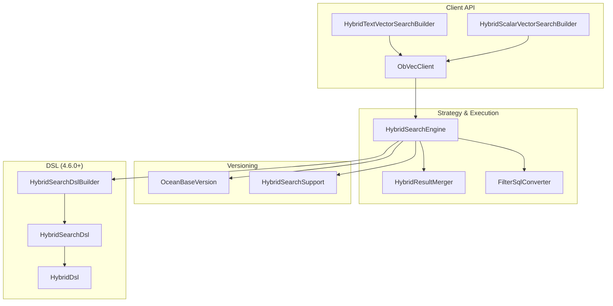
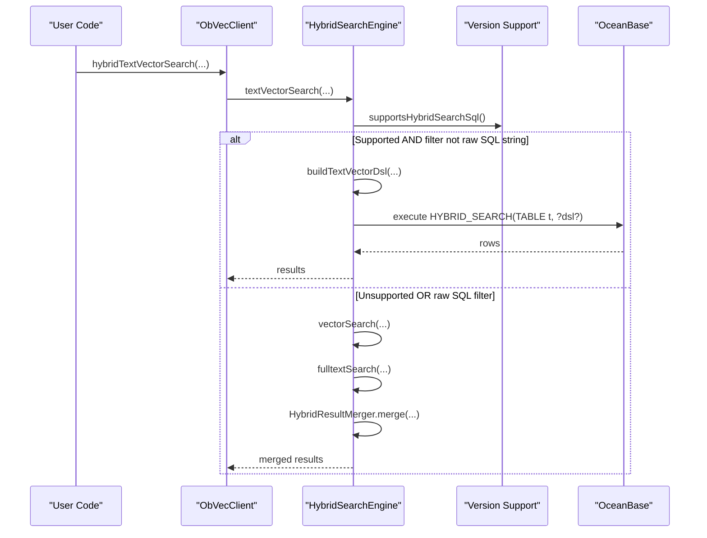
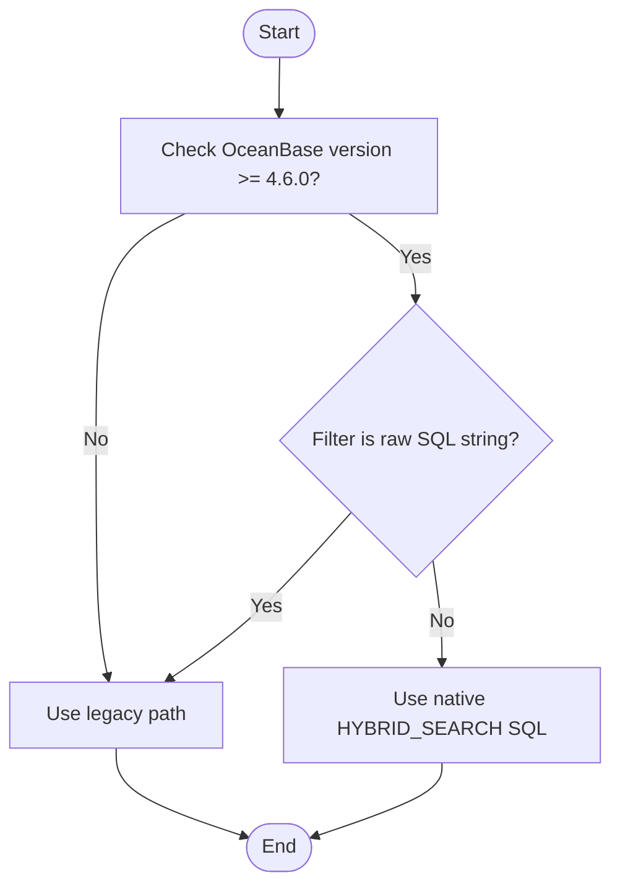
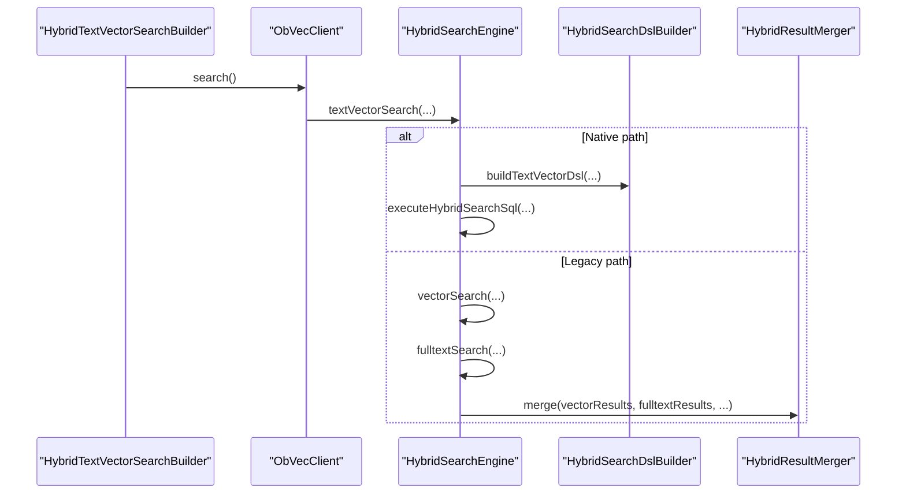
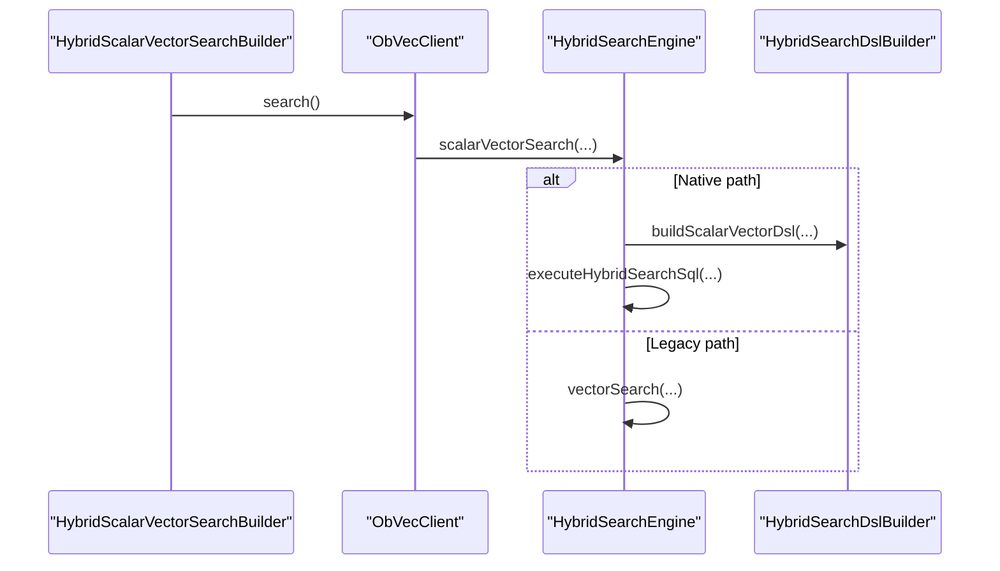
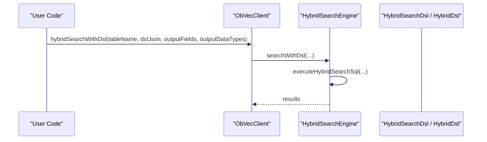
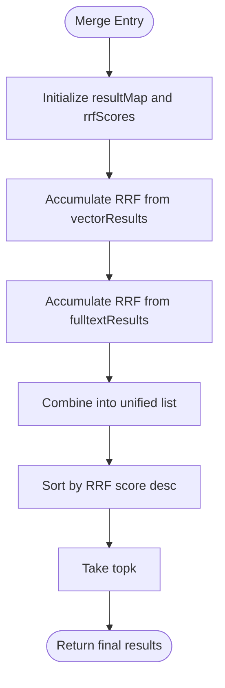
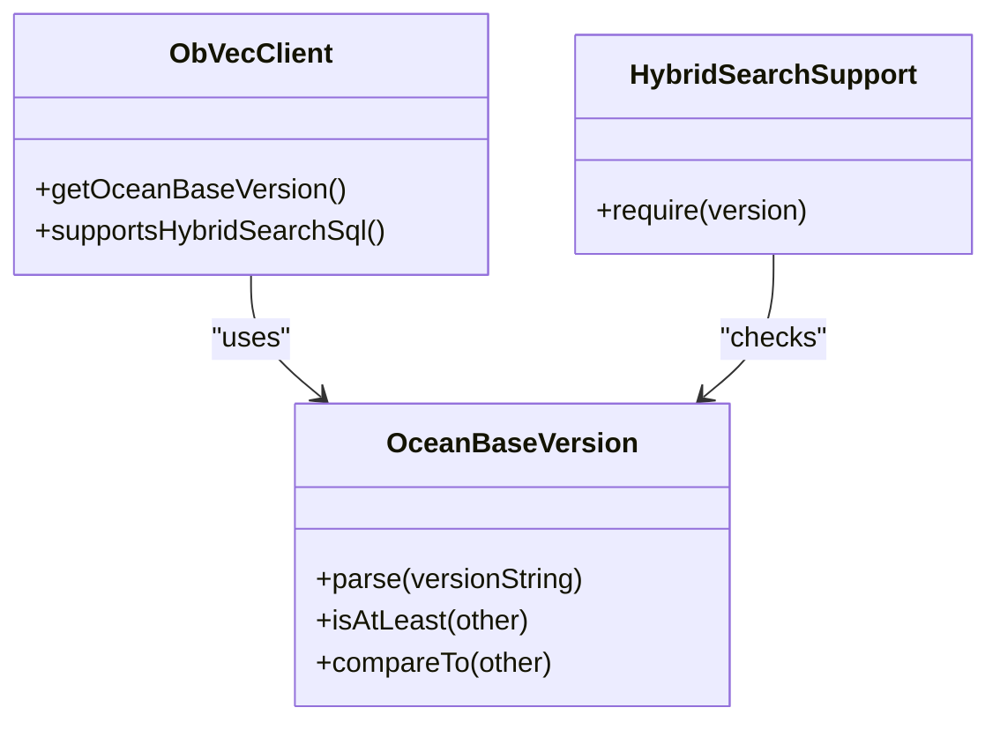
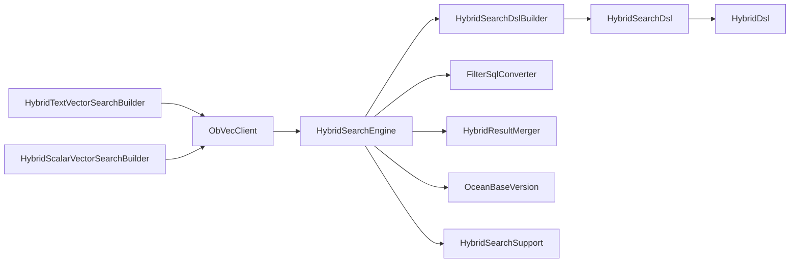

# Intelligent Search Strategy Selection

<cite>
**Referenced Files in This Document**
- [ObVecClient.java](file://src/main/java/com/oceanbase/obvector4j/ObVecClient.java)
- [HybridSearchEngine.java](file://src/main/java/com/oceanbase/obvector4j/hybrid/HybridSearchEngine.java)
- [HybridTextVectorSearchBuilder.java](file://src/main/java/com/oceanbase/obvector4j/hybrid/HybridTextVectorSearchBuilder.java)
- [HybridScalarVectorSearchBuilder.java](file://src/main/java/com/oceanbase/obvector4j/hybrid/HybridScalarVectorSearchBuilder.java)
- [HybridResultMerger.java](file://src/main/java/com/oceanbase/obvector4j/hybrid/HybridResultMerger.java)
- [FilterSqlConverter.java](file://src/main/java/com/oceanbase/obvector4j/filter/FilterSqlConverter.java)
- [OceanBaseVersion.java](file://src/main/java/com/oceanbase/obvector4j/version/OceanBaseVersion.java)
- [HybridSearchSupport.java](file://src/main/java/com/oceanbase/obvector4j/hybrid/core/HybridSearchSupport.java)
- [HybridSearchDslBuilder.java](file://src/main/java/com/oceanbase/obvector4j/hybrid/core/HybridSearchDslBuilder.java)
- [HybridSearchDsl.java](file://src/main/java/com/oceanbase/obvector4j/hybrid/core/HybridSearchDsl.java)
- [HybridDsl.java](file://src/main/java/com/oceanbase/obvector4j/hybrid/core/dsl/HybridDsl.java)
</cite>

## Table of Contents
1. [Introduction](#introduction)
2. [Project Structure](#project-structure)
3. [Core Components](#core-components)
4. [Architecture Overview](#architecture-overview)
5. [Detailed Component Analysis](#detailed-component-analysis)
6. [Dependency Analysis](#dependency-analysis)
7. [Performance Considerations](#performance-considerations)
8. [Troubleshooting Guide](#troubleshooting-guide)
9. [Conclusion](#conclusion)

## Introduction
This document explains the intelligent search strategy selection system implemented by HybridSearchEngine. It details how the engine automatically chooses between:
- Native HYBRID_SEARCH SQL (available on OceanBase ≥ 4.6.0), and
- Legacy fallback approaches that combine vector and full-text searches with client-side merging.

The decision logic is driven by version compatibility and query characteristics, particularly filter expression type and presence of text-vector components. The document also covers performance implications, routing for different query types (text-vector, scalar-vector, DSL-based), and optimization guidance.

## Project Structure
At a high level, the hybrid search feature spans several layers:
- Client entry points and builders for user-facing APIs
- Version detection and capability gating
- Engine-level strategy selection and execution
- DSL construction for native HYBRID_SEARCH
- Legacy result merging utilities

**Diagram sources**
- [ObVecClient.java](file://src/main/java/com/oceanbase/obvector4j/ObVecClient.java)
- [HybridSearchEngine.java](file://src/main/java/com/oceanbase/obvector4j/hybrid/HybridSearchEngine.java)
- [HybridResultMerger.java](file://src/main/java/com/oceanbase/obvector4j/hybrid/HybridResultMerger.java)
- [FilterSqlConverter.java](file://src/main/java/com/oceanbase/obvector4j/filter/FilterSqlConverter.java)
- [OceanBaseVersion.java](file://src/main/java/com/oceanbase/obvector4j/version/OceanBaseVersion.java)
- [HybridSearchSupport.java](file://src/main/java/com/oceanbase/obvector4j/hybrid/core/HybridSearchSupport.java)
- [HybridSearchDslBuilder.java](file://src/main/java/com/oceanbase/obvector4j/hybrid/core/HybridSearchDslBuilder.java)
- [HybridSearchDsl.java](file://src/main/java/com/oceanbase/obvector4j/hybrid/core/HybridSearchDsl.java)
- [HybridDsl.java](file://src/main/java/com/oceanbase/obvector4j/hybrid/core/dsl/HybridDsl.java)

**Section sources**
- [ObVecClient.java](file://src/main/java/com/oceanbase/obvector4j/ObVecClient.java)
- [HybridSearchEngine.java](file://src/main/java/com/oceanbase/obvector4j/hybrid/HybridSearchEngine.java)

## Core Components
- ObVecClient: Entry point for all operations; provides version detection, capability checks, and delegates to HybridSearchEngine for hybrid queries.
- HybridSearchEngine: Implements the core decision tree and execution paths for both native HYBRID_SEARCH SQL and legacy fallbacks.
- Builders: Provide fluent APIs for text-vector and scalar-vector hybrid searches.
- HybridSearchDslBuilder and DSL classes: Construct JSON DSL for native HYBRID_SEARCH when supported.
- FilterSqlConverter: Converts Filter objects or raw strings into WHERE clauses for legacy paths.
- HybridResultMerger: Applies Reciprocal Rank Fusion (RRF) to merge results from vector and full-text searches in legacy mode.
- Versioning: OceanBaseVersion and HybridSearchSupport enforce minimum version requirements for HYBRID_SEARCH features.

Key responsibilities:
- Version detection and capability gating
- Strategy selection based on version and query complexity
- Building native DSL vs. composing legacy SQL
- Executing queries and mapping results to typed Sqlizable values

**Section sources**
- [ObVecClient.java](file://src/main/java/com/oceanbase/obvector4j/ObVecClient.java)
- [HybridSearchEngine.java](file://src/main/java/com/oceanbase/obvector4j/hybrid/HybridSearchEngine.java)
- [HybridTextVectorSearchBuilder.java](file://src/main/java/com/oceanbase/obvector4j/hybrid/HybridTextVectorSearchBuilder.java)
- [HybridScalarVectorSearchBuilder.java](file://src/main/java/com/oceanbase/obvector4j/hybrid/HybridScalarVectorSearchBuilder.java)
- [HybridResultMerger.java](file://src/main/java/com/oceanbase/obvector4j/hybrid/HybridResultMerger.java)
- [FilterSqlConverter.java](file://src/main/java/com/oceanbase/obvector4j/filter/FilterSqlConverter.java)
- [OceanBaseVersion.java](file://src/main/java/com/oceanbase/obvector4j/version/OceanBaseVersion.java)
- [HybridSearchSupport.java](file://src/main/java/com/oceanbase/obvector4j/hybrid/core/HybridSearchSupport.java)
- [HybridSearchDslBuilder.java](file://src/main/java/com/oceanbase/obvector4j/hybrid/core/HybridSearchDslBuilder.java)
- [HybridSearchDsl.java](file://src/main/java/com/oceanbase/obvector4j/hybrid/core/HybridSearchDsl.java)
- [HybridDsl.java](file://src/main/java/com/oceanbase/obvector4j/hybrid/core/dsl/HybridDsl.java)

## Architecture Overview
The architecture separates concerns across client, engine, versioning, and DSL layers. The engine uses a simple but effective decision tree to choose the optimal path.

**Diagram sources**
- [ObVecClient.java](file://src/main/java/com/oceanbase/obvector4j/ObVecClient.java)
- [HybridSearchEngine.java](file://src/main/java/com/oceanbase/obvector4j/hybrid/HybridSearchEngine.java)
- [HybridSearchDslBuilder.java](file://src/main/java/com/oceanbase/obvector4j/hybrid/core/HybridSearchDslBuilder.java)
- [HybridResultMerger.java](file://src/main/java/com/oceanbase/obvector4j/hybrid/HybridResultMerger.java)

## Detailed Component Analysis

### Decision Tree Logic
The engine’s decision logic is straightforward and deterministic:
- For text-vector search:
  - If the server supports HYBRID_SEARCH SQL and the filter is not a raw SQL string, use native HYBRID_SEARCH with a built DSL.
  - Otherwise, fall back to legacy approach: run vector search and full-text search separately, then merge using RRF.
- For scalar-vector search:
  - If the server supports HYBRID_SEARCH SQL and the filter is not a raw SQL string, use native HYBRID_SEARCH with a built DSL.
  - Otherwise, fall back to a single vector search with WHERE clause.

**Diagram sources**
- [HybridSearchEngine.java](file://src/main/java/com/oceanbase/obvector4j/hybrid/HybridSearchEngine.java)
- [OceanBaseVersion.java](file://src/main/java/com/oceanbase/obvector4j/version/OceanBaseVersion.java)

**Section sources**
- [HybridSearchEngine.java](file://src/main/java/com/oceanbase/obvector4j/hybrid/HybridSearchEngine.java)
- [OceanBaseVersion.java](file://src/main/java/com/oceanbase/obvector4j/version/OceanBaseVersion.java)

### Text-Vector Search Routing
- Native path:
  - Builds a DSL combining match/multi_match, knn, and rrf ranking.
  - Executes via HYBRID_SEARCH(TABLE t, ?json?).
- Legacy path:
  - Runs vector search with distance/score computation and approximate limit.
  - Runs full-text search with MATCH AGAINST and score.
  - Merges results using RRF with configurable rank window size.

**Diagram sources**
- [HybridTextVectorSearchBuilder.java](file://src/main/java/com/oceanbase/obvector4j/hybrid/HybridTextVectorSearchBuilder.java)
- [ObVecClient.java](file://src/main/java/com/oceanbase/obvector4j/ObVecClient.java)
- [HybridSearchEngine.java](file://src/main/java/com/oceanbase/obvector4j/hybrid/HybridSearchEngine.java)
- [HybridSearchDslBuilder.java](file://src/main/java/com/oceanbase/obvector4j/hybrid/core/HybridSearchDslBuilder.java)
- [HybridResultMerger.java](file://src/main/java/com/oceanbase/obvector4j/hybrid/HybridResultMerger.java)

**Section sources**
- [HybridTextVectorSearchBuilder.java](file://src/main/java/com/oceanbase/obvector4j/hybrid/HybridTextVectorSearchBuilder.java)
- [HybridSearchEngine.java](file://src/main/java/com/oceanbase/obvector4j/hybrid/HybridSearchEngine.java)
- [HybridSearchDslBuilder.java](file://src/main/java/com/oceanbase/obvector4j/hybrid/core/HybridSearchDslBuilder.java)
- [HybridResultMerger.java](file://src/main/java/com/oceanbase/obvector4j/hybrid/HybridResultMerger.java)

### Scalar-Vector Search Routing
- Native path:
  - Builds a DSL with knn only and executes via HYBRID_SEARCH.
- Legacy path:
  - Executes a direct vector search with WHERE clause and approximate limit.

**Diagram sources**
- [HybridScalarVectorSearchBuilder.java](file://src/main/java/com/oceanbase/obvector4j/hybrid/HybridScalarVectorSearchBuilder.java)
- [ObVecClient.java](file://src/main/java/com/oceanbase/obvector4j/ObVecClient.java)
- [HybridSearchEngine.java](file://src/main/java/com/oceanbase/obvector4j/hybrid/HybridSearchEngine.java)
- [HybridSearchDslBuilder.java](file://src/main/java/com/oceanbase/obvector4j/hybrid/core/HybridSearchDslBuilder.java)

**Section sources**
- [HybridScalarVectorSearchBuilder.java](file://src/main/java/com/oceanbase/obvector4j/hybrid/HybridScalarVectorSearchBuilder.java)
- [HybridSearchEngine.java](file://src/main/java/com/oceanbase/obvector4j/hybrid/HybridSearchEngine.java)
- [HybridSearchDslBuilder.java](file://src/main/java/com/oceanbase/obvector4j/hybrid/core/HybridSearchDslBuilder.java)

### DSL-Based Query Routing
- Users can construct custom DSL documents using HybridSearchDsl and HybridDsl helpers.
- ObVecClient.hybridSearchWithDsl enforces version requirement and delegates to HybridSearchEngine.searchWithDsl.
- HybridSearchEngine.executeHybridSearchSql runs HYBRID_SEARCH(TABLE t, ?json?) and maps results.

**Diagram sources**
- [ObVecClient.java](file://src/main/java/com/oceanbase/obvector4j/ObVecClient.java)
- [HybridSearchEngine.java](file://src/main/java/com/oceanbase/obvector4j/hybrid/HybridSearchEngine.java)
- [HybridSearchDsl.java](file://src/main/java/com/oceanbase/obvector4j/hybrid/core/HybridSearchDsl.java)
- [HybridDsl.java](file://src/main/java/com/oceanbase/obvector4j/hybrid/core/dsl/HybridDsl.java)

**Section sources**
- [ObVecClient.java](file://src/main/java/com/oceanbase/obvector4j/ObVecClient.java)
- [HybridSearchEngine.java](file://src/main/java/com/oceanbase/obvector4j/hybrid/HybridSearchEngine.java)
- [HybridSearchDsl.java](file://src/main/java/com/oceanbase/obvector4j/hybrid/core/HybridSearchDsl.java)
- [HybridDsl.java](file://src/main/java/com/oceanbase/obvector4j/hybrid/core/dsl/HybridDsl.java)

### Legacy Result Merging (RRF)
- HybridResultMerger implements Reciprocal Rank Fusion to combine vector and full-text results.
- Uses a rank window size k (default topk if not specified) to compute scores: sum of 1/(k + rank).
- Sorts combined results by descending RRF score and returns topk.

**Diagram sources**
- [HybridResultMerger.java](file://src/main/java/com/oceanbase/obvector4j/hybrid/HybridResultMerger.java)

**Section sources**
- [HybridResultMerger.java](file://src/main/java/com/oceanbase/obvector4j/hybrid/HybridResultMerger.java)

### Version Detection and Capability Gating
- OceanBaseVersion parses version strings and compares semantic versions.
- ObVecClient.getOceanBaseVersion caches the detected version.
- supportsHybridSearchSql checks if version ≥ 4.6.0.
- HybridSearchSupport.require throws if version < 4.6.0 for DSL-only APIs.

**Diagram sources**
- [OceanBaseVersion.java](file://src/main/java/com/oceanbase/obvector4j/version/OceanBaseVersion.java)
- [ObVecClient.java](file://src/main/java/com/oceanbase/obvector4j/ObVecClient.java)
- [HybridSearchSupport.java](file://src/main/java/com/oceanbase/obvector4j/hybrid/core/HybridSearchSupport.java)

**Section sources**
- [OceanBaseVersion.java](file://src/main/java/com/oceanbase/obvector4j/version/OceanBaseVersion.java)
- [ObVecClient.java](file://src/main/java/com/oceanbase/obvector4j/ObVecClient.java)
- [HybridSearchSupport.java](file://src/main/java/com/oceanbase/obvector4j/hybrid/core/HybridSearchSupport.java)

## Dependency Analysis
The following diagram shows key dependencies among components involved in strategy selection and execution.

**Diagram sources**
- [ObVecClient.java](file://src/main/java/com/oceanbase/obvector4j/ObVecClient.java)
- [HybridSearchEngine.java](file://src/main/java/com/oceanbase/obvector4j/hybrid/HybridSearchEngine.java)
- [HybridTextVectorSearchBuilder.java](file://src/main/java/com/oceanbase/obvector4j/hybrid/HybridTextVectorSearchBuilder.java)
- [HybridScalarVectorSearchBuilder.java](file://src/main/java/com/oceanbase/obvector4j/hybrid/HybridScalarVectorSearchBuilder.java)
- [HybridSearchDslBuilder.java](file://src/main/java/com/oceanbase/obvector4j/hybrid/core/HybridSearchDslBuilder.java)
- [HybridSearchDsl.java](file://src/main/java/com/oceanbase/obvector4j/hybrid/core/HybridSearchDsl.java)
- [HybridDsl.java](file://src/main/java/com/oceanbase/obvector4j/hybrid/core/dsl/HybridDsl.java)
- [FilterSqlConverter.java](file://src/main/java/com/oceanbase/obvector4j/filter/FilterSqlConverter.java)
- [HybridResultMerger.java](file://src/main/java/com/oceanbase/obvector4j/hybrid/HybridResultMerger.java)
- [OceanBaseVersion.java](file://src/main/java/com/oceanbase/obvector4j/version/OceanBaseVersion.java)
- [HybridSearchSupport.java](file://src/main/java/com/oceanbase/obvector4j/hybrid/core/HybridSearchSupport.java)

**Section sources**
- [ObVecClient.java](file://src/main/java/com/oceanbase/obvector4j/ObVecClient.java)
- [HybridSearchEngine.java](file://src/main/java/com/oceanbase/obvector4j/hybrid/HybridSearchEngine.java)

## Performance Considerations
- Prefer native HYBRID_SEARCH SQL when available:
  - Single database round-trip with server-side ranking (e.g., RRF) reduces network overhead and leverages optimized execution plans.
  - Avoids client-side merging and sorting.
- Legacy fallback considerations:
  - Two separate queries (vector and full-text) plus client-side RRF increase latency and memory usage.
  - Use rankWindowSize to control candidate set sizes for better recall at the cost of higher processing.
- Vector metric handling:
  - Distance functions are resolved per metric type; ensure appropriate index configuration for cosine/l2/ip.
- Approximate limits:
  - Legacy vector search uses APPROXIMATE LIMIT; tune hnsw_ef_search for trade-offs between speed and accuracy.
- Output field typing:
  - Correct DataType inference avoids conversion overhead and errors during result mapping.

[No sources needed since this section provides general guidance]

## Troubleshooting Guide
- Unsupported version for DSL-only APIs:
  - HybridSearchSupport.require will throw if OceanBase version < 4.6.0. Ensure cluster upgrade or use legacy paths.
- Raw SQL filters bypass native path:
  - Passing a raw SQL string as filter forces legacy fallback. Convert to Filter objects where possible to enable native HYBRID_SEARCH.
- Fulltext search failures:
  - Legacy fulltextSearch catches exceptions and returns empty results with a warning. Verify full-text indexes exist and queries are valid.
- Output fields mismatch:
  - AbstractHybridSearchBuilder validates output fields and data types; mismatches raise IllegalArgumentException. Ensure consistent field lists and types.
- Version detection issues:
  - getOceanBaseVersion tries OB_VERSION() then VERSION(); if both fail, it throws an exception. Check connectivity and permissions.

**Section sources**
- [HybridSearchSupport.java](file://src/main/java/com/oceanbase/obvector4j/hybrid/core/HybridSearchSupport.java)
- [HybridSearchEngine.java](file://src/main/java/com/oceanbase/obvector4j/hybrid/HybridSearchEngine.java)
- [AbstractHybridSearchBuilder.java](file://src/main/java/com/oceanbase/obvector4j/hybrid/AbstractHybridSearchBuilder.java)
- [ObVecClient.java](file://src/main/java/com/oceanbase/obvector4j/ObVecClient.java)

## Conclusion
HybridSearchEngine provides a robust, version-aware strategy selection mechanism:
- On OceanBase ≥ 4.6.0 with non-raw filters, it uses native HYBRID_SEARCH SQL for optimal performance.
- On older versions or with raw SQL filters, it falls back to legacy vector and full-text searches with client-side RRF merging.
Users should prefer Filter objects over raw SQL strings to maximize the chance of using the native path, and tune rankWindowSize and hnsw_ef_search for performance tuning.

[No sources needed since this section summarizes without analyzing specific files]