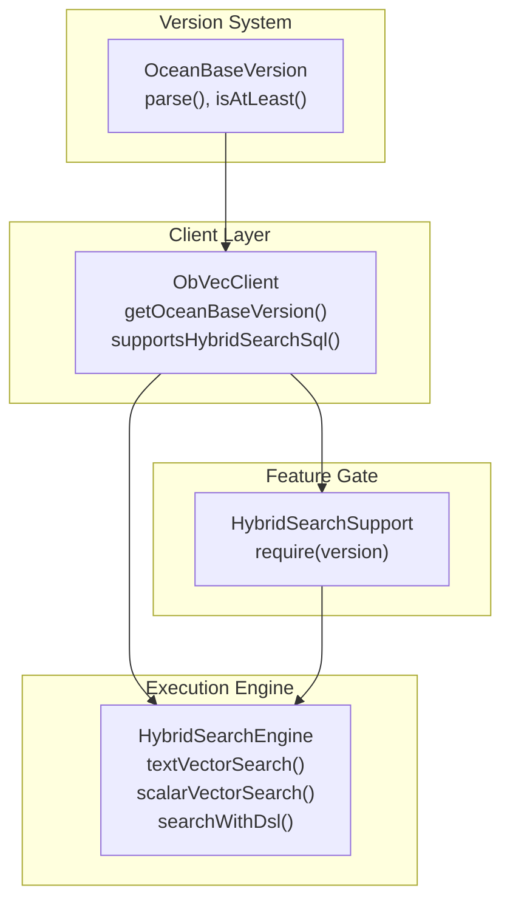
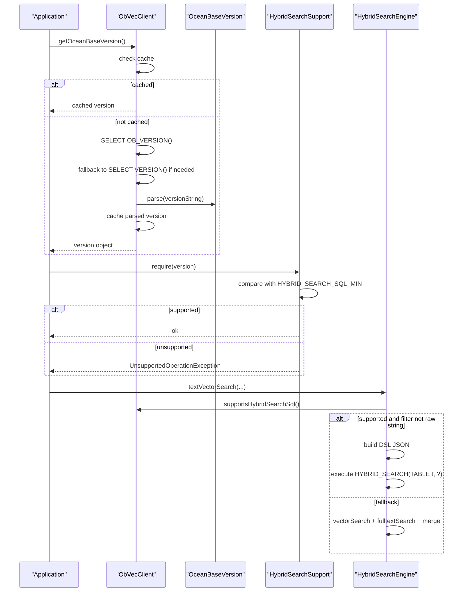
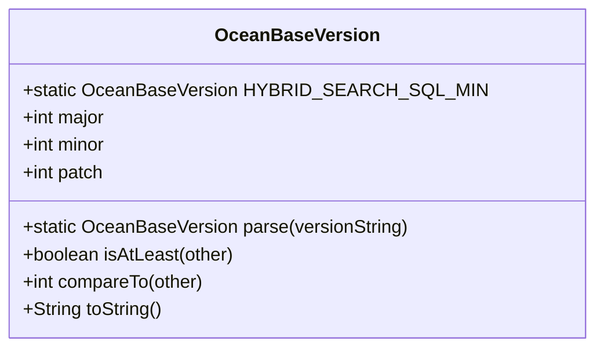
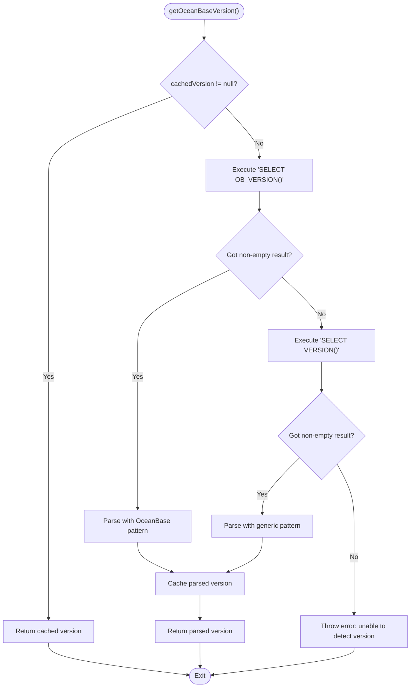
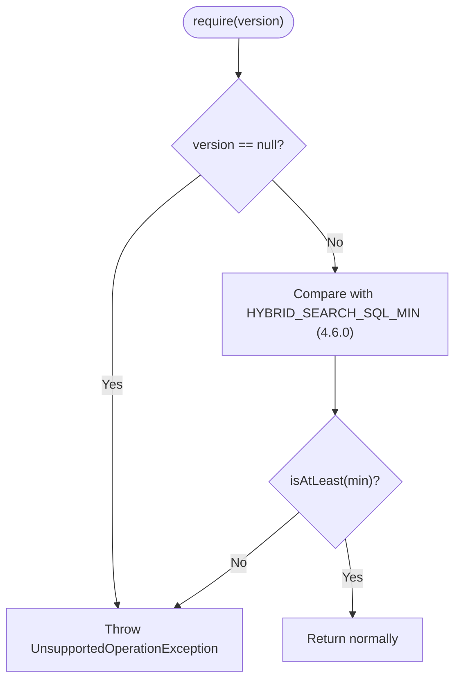
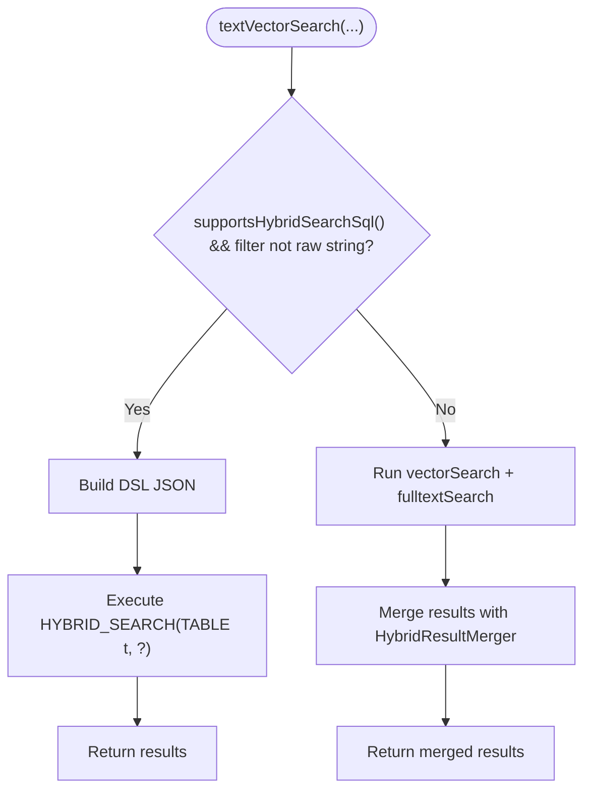
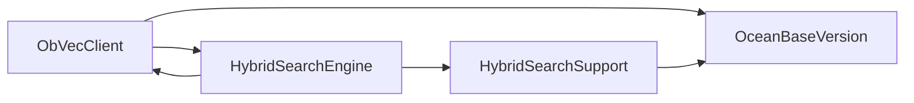

# Version Compatibility and Feature Detection

<cite>
**Referenced Files in This Document**
- [OceanBaseVersion.java](file://src/main/java/com/oceanbase/obvector4j/version/OceanBaseVersion.java)
- [ObVecClient.java](file://src/main/java/com/oceanbase/obvector4j/ObVecClient.java)
- [HybridSearchEngine.java](file://src/main/java/com/oceanbase/obvector4j/hybrid/HybridSearchEngine.java)
- [HybridSearchSupport.java](file://src/main/java/com/oceanbase/obvector4j/hybrid/core/HybridSearchSupport.java)
- [pom.xml](file://pom.xml)
- [README.md](file://README.md)
</cite>

## Update Summary
**Changes Made**
- Updated version baseline information to reflect current 1.0.0 release
- Enhanced documentation clarity around OceanBase server version requirements
- Improved troubleshooting guidance for version-related issues
- Added comprehensive examples of version detection and feature gating patterns

## Table of Contents
1. [Introduction](#introduction)
2. [Project Structure](#project-structure)
3. [Core Components](#core-components)
4. [Architecture Overview](#architecture-overview)
5. [Detailed Component Analysis](#detailed-component-analysis)
6. [Dependency Analysis](#dependency-analysis)
7. [Performance Considerations](#performance-considerations)
8. [Troubleshooting Guide](#troubleshooting-guide)
9. [Migration Guide](#migration-guide)
10. [Conclusion](#conclusion)

## Introduction
This document explains OceanBase Vector4J's version compatibility system, focusing on how the library detects the connected OceanBase server version and enables or disables features accordingly. It details the OceanBaseVersion class architecture, runtime detection mechanisms, feature availability checks, and graceful degradation strategies when advanced features like HYBRID_SEARCH SQL are unavailable. You will also find examples of version-specific code paths, compatibility checking patterns, migration considerations, and troubleshooting guidance for common version-related issues.

The current release (version 1.0.0) requires OceanBase server version 4.6.0 or later for full HYBRID_SEARCH DSL functionality, while maintaining backward compatibility through legacy execution paths for older versions.

## Project Structure
The version compatibility system centers around a small set of focused components:
- Version parsing and comparison utilities
- Client-side version detection and caching
- Feature gates for advanced capabilities (e.g., HYBRID_SEARCH DSL)
- Engine-level routing between modern and legacy execution paths



**Diagram sources**
- [OceanBaseVersion.java:25-101](file://src/main/java/com/oceanbase/obvector4j/version/OceanBaseVersion.java#L25-L101)
- [ObVecClient.java:348-383](file://src/main/java/com/oceanbase/obvector4j/ObVecClient.java#L348-L383)
- [HybridSearchSupport.java:24-41](file://src/main/java/com/oceanbase/obvector4j/hybrid/core/HybridSearchSupport.java#L24-L41)
- [HybridSearchEngine.java:39-128](file://src/main/java/com/oceanbase/obvector4j/hybrid/HybridSearchEngine.java#L39-L128)

**Section sources**
- [OceanBaseVersion.java:25-101](file://src/main/java/com/oceanbase/obvector4j/version/OceanBaseVersion.java#L25-L101)
- [ObVecClient.java:348-383](file://src/main/java/com/oceanbase/obvector4j/ObVecClient.java#L348-L383)
- [HybridSearchEngine.java:39-128](file://src/main/java/com/oceanbase/obvector4j/hybrid/HybridSearchEngine.java#L39-L128)
- [HybridSearchSupport.java:24-41](file://src/main/java/com/oceanbase/obvector4j/hybrid/core/HybridSearchSupport.java#L24-L41)

## Core Components
- **OceanBaseVersion**: Semantic version representation with parsing from both OceanBase-specific and MySQL-compatible version strings, plus comparison helpers used to gate features.
- **ObVecClient**: Runtime client that detects the connected server version once and caches it; exposes convenience checks such as supportsHybridSearchSql().
- **HybridSearchSupport**: Centralized feature gate that enforces minimum version requirements for HYBRID_SEARCH DSL APIs.
- **HybridSearchEngine**: Orchestrates execution by selecting either the modern HYBRID_SEARCH SQL path or fallback logic based on detected version support.

Key responsibilities:
- Parse and compare versions consistently across the library.
- Detect server version at connection time and cache for performance.
- Enforce feature availability before invoking advanced APIs.
- Provide graceful fallbacks when advanced features are not available.

**Section sources**
- [OceanBaseVersion.java:25-101](file://src/main/java/com/oceanbase/obvector4j/version/OceanBaseVersion.java#L25-L101)
- [ObVecClient.java:348-383](file://src/main/java/com/oceanbase/obvector4j/ObVecClient.java#L348-L383)
- [HybridSearchSupport.java:24-41](file://src/main/java/com/oceanbase/obvector4j/hybrid/core/HybridSearchSupport.java#L24-L41)
- [HybridSearchEngine.java:39-128](file://src/main/java/com/oceanbase/obvector4j/hybrid/HybridSearchEngine.java#L39-L128)

## Architecture Overview
The compatibility system follows a layered approach:
- **Version layer**: Parses and compares semantic versions.
- **Client layer**: Detects and caches the server version; provides capability checks.
- **Gate layer**: Validates minimum version requirements for specific features.
- **Engine layer**: Chooses optimal execution path (modern vs legacy).



**Diagram sources**
- [ObVecClient.java:348-376](file://src/main/java/com/oceanbase/obvector4j/ObVecClient.java#L348-L376)
- [OceanBaseVersion.java:49-68](file://src/main/java/com/oceanbase/obvector4j/version/OceanBaseVersion.java#L49-L68)
- [HybridSearchSupport.java:32-40](file://src/main/java/com/oceanbase/obvector4j/hybrid/core/HybridSearchSupport.java#L32-L40)
- [HybridSearchEngine.java:55-88](file://src/main/java/com/oceanbase/obvector4j/hybrid/HybridSearchEngine.java#L55-L88)

## Detailed Component Analysis

### OceanBaseVersion Class
- **Purpose**: Represent and compare semantic versions; parse both OceanBase-specific and generic version strings.
- **Key behaviors**:
  - Parsing prefers an OceanBase-specific pattern when present; otherwise falls back to a generic pattern.
  - Comparison uses major, minor, patch ordering.
  - Provides a convenience method to check "at least" against another version.
  - Defines minimum version constant `HYBRID_SEARCH_SQL_MIN = new OceanBaseVersion(4, 6, 0)` for feature gating.
- **Complexity**:
  - Parsing: O(n) over input string length due to regex matching.
  - Comparison: O(1).
- **Error handling**:
  - Throws IllegalArgumentException for empty or unparseable version strings.



**Diagram sources**
- [OceanBaseVersion.java:25-101](file://src/main/java/com/oceanbase/obvector4j/version/OceanBaseVersion.java#L25-L101)

**Section sources**
- [OceanBaseVersion.java:25-101](file://src/main/java/com/oceanbase/obvector4j/version/OceanBaseVersion.java#L25-L101)

### Version Detection in ObVecClient
- **Purpose**: Discover the connected server version once and reuse it.
- **Mechanism**:
  - Attempts to call a server function that returns an OceanBase-specific version string using `SELECT OB_VERSION()`.
  - Falls back to a standard version function (`SELECT VERSION()`) if the first attempt fails or returns empty.
  - Parses the string into an OceanBaseVersion instance and caches it for subsequent calls.
- **Capability checks**:
  - Exposes a boolean helper `supportsHybridSearchSql()` indicating whether HYBRID_SEARCH SQL is supported based on the parsed version being at least 4.6.0.



**Diagram sources**
- [ObVecClient.java:348-376](file://src/main/java/com/oceanbase/obvector4j/ObVecClient.java#L348-L376)

**Section sources**
- [ObVecClient.java:348-383](file://src/main/java/com/oceanbase/obvector4j/ObVecClient.java#L348-L383)

### Feature Gate: HybridSearchSupport
- **Purpose**: Enforce minimum version requirement for HYBRID_SEARCH DSL APIs.
- **Behavior**:
  - If the provided version is null or below the required threshold (4.6.0), throws an UnsupportedOperationException describing the requirement and current version.
  - Uses the centralized `OceanBaseVersion.HYBRID_SEARCH_SQL_MIN` constant for consistency.
- **Usage**:
  - Called before constructing or executing DSL-based hybrid search operations via `client.hybridSearch()` or `client.customHybridSearch()`.



**Diagram sources**
- [HybridSearchSupport.java:32-40](file://src/main/java/com/oceanbase/obvector4j/hybrid/core/HybridSearchSupport.java#L32-L40)
- [OceanBaseVersion.java:27-28](file://src/main/java/com/oceanbase/obvector4j/version/OceanBaseVersion.java#L27-L28)

**Section sources**
- [HybridSearchSupport.java:24-41](file://src/main/java/com/oceanbase/obvector4j/hybrid/core/HybridSearchSupport.java#L24-L41)

### Execution Routing: HybridSearchEngine
- **Purpose**: Choose between modern HYBRID_SEARCH SQL and legacy fallbacks.
- **Decision logic**:
  - For text+vector and scalar+vector searches, if the server supports HYBRID_SEARCH SQL and filters are not supplied as raw strings, builds a DSL JSON and executes via `HYBRID_SEARCH(TABLE ... , ?)`.
  - Otherwise, performs separate vector and full-text queries and merges results using `HybridResultMerger`.
- **Graceful degradation**:
  - When HYBRID_SEARCH SQL is unavailable or filters are passed as raw strings, the engine falls back to composing two queries and merging their results.
  - Maintains consistent API behavior regardless of server version.



**Diagram sources**
- [HybridSearchEngine.java:55-88](file://src/main/java/com/oceanbase/obvector4j/hybrid/HybridSearchEngine.java#L55-L88)

**Section sources**
- [HybridSearchEngine.java:39-128](file://src/main/java/com/oceanbase/obvector4j/hybrid/HybridSearchEngine.java#L39-L128)

## Dependency Analysis
The following diagram shows key dependencies among the core compatibility components:



**Diagram sources**
- [ObVecClient.java:348-383](file://src/main/java/com/oceanbase/obvector4j/ObVecClient.java#L348-L383)
- [HybridSearchEngine.java:39-128](file://src/main/java/com/oceanbase/obvector4j/hybrid/HybridSearchEngine.java#L39-L128)
- [HybridSearchSupport.java:24-41](file://src/main/java/com/oceanbase/obvector4j/hybrid/core/HybridSearchSupport.java#L24-L41)
- [OceanBaseVersion.java:25-101](file://src/main/java/com/oceanbase/obvector4j/version/OceanBaseVersion.java#L25-L101)

**Section sources**
- [ObVecClient.java:348-383](file://src/main/java/com/oceanbase/obvector4j/ObVecClient.java#L348-L383)
- [HybridSearchEngine.java:39-128](file://src/main/java/com/oceanbase/obvector4j/hybrid/HybridSearchEngine.java#L39-L128)
- [HybridSearchSupport.java:24-41](file://src/main/java/com/oceanbase/obvector4j/hybrid/core/HybridSearchSupport.java#L24-L41)
- [OceanBaseVersion.java:25-101](file://src/main/java/com/oceanbase/obvector4j/version/OceanBaseVersion.java#L25-L101)

## Performance Considerations
- **Version detection is performed once per client instance and cached**, minimizing repeated metadata queries.
- **Using HYBRID_SEARCH SQL reduces round-trips** and simplifies ranking/merging logic compared to composing multiple queries.
- **When falling back to legacy paths**, be mindful of additional query overhead and potential differences in ranking behavior.
- **Feature gating happens at runtime** with minimal overhead after initial version detection.

## Troubleshooting Guide
Common issues and resolutions:

### Unable to detect OceanBase version
- **Cause**: JDBC driver cannot connect successfully or version-detection functions are unavailable.
- **Resolution**: 
  - Ensure the JDBC driver can connect successfully and that at least one of the version-detection functions is available.
  - Verify network connectivity and credentials.
  - Check that the server responds to `SELECT OB_VERSION()` or `SELECT VERSION()`.

### HYBRID_SEARCH DSL not supported
- **Cause**: Server is below the required minimum version (4.6.0).
- **Resolution**: 
  - Upgrade the OceanBase cluster to version 4.6.0 or later.
  - Use legacy search paths that automatically fall back when advanced features are unavailable.
  - Check `client.supportsHybridSearchSql()` before attempting DSL operations.

### Unexpected exceptions when calling DSL entry points
- **Cause**: Version check fails before invoking DSL methods.
- **Resolution**: 
  - Confirm that the version check passes before invoking DSL methods.
  - Review error messages indicating the current server version and required minimum.
  - Use try-catch blocks to handle `UnsupportedOperationException` gracefully.

### Version parsing errors
- **Cause**: Unrecognized version string format from server.
- **Resolution**: 
  - Verify server version output format matches expected patterns.
  - Check for custom server configurations that might alter version string format.
  - Report issues with actual version string output for investigation.

Operational tips:
- Use the client's capability check `supportsHybridSearchSql()` to branch logic at runtime.
- Prefer building DSL programmatically rather than passing raw strings when possible to leverage optimized execution paths.
- Implement proper error handling for version-related exceptions in production code.

**Section sources**
- [ObVecClient.java:348-383](file://src/main/java/com/oceanbase/obvector4j/ObVecClient.java#L348-L383)
- [HybridSearchSupport.java:32-40](file://src/main/java/com/oceanbase/obvector4j/hybrid/core/HybridSearchSupport.java#L32-L40)

## Migration Guide

### Upgrading from Legacy Versions
When migrating applications to use OceanBase Vector4J 1.0.0:

#### Automatic Compatibility
- The library automatically detects server capabilities and uses appropriate execution paths.
- No code changes required for basic vector search operations.
- Legacy fallback paths ensure continued operation with older OceanBase versions (< 4.6.0).

#### Enabling Advanced Features
To take advantage of HYBRID_SEARCH DSL features:

1. **Ensure server compatibility**:
   ```java
   ObVecClient client = new ObVecClient(uri, user, password);
   if (client.supportsHybridSearchSql()) {
       // Use advanced DSL features
       client.hybridSearch().customSearch()...
   } else {
       // Fall back to legacy methods
       client.hybridTextVectorSearch(...);
   }
   ```

2. **Handle version-specific behavior**:
   ```java
   try {
       // Attempt DSL-based search
       ArrayList<HashMap<String, Sqlizable>> results = client.hybridSearch()
           .customSearch()
           .table("documents")
           .query(HybridDsl.match("content", "keyword"))
           .knn(HybridDsl.knn("embedding", queryVector, 10))
           .rank(HybridDsl.rrf(10, 60))
           .size(10)
           .outputFields("id", "title")
           .search();
   } catch (UnsupportedOperationException e) {
       // Handle version incompatibility
       logger.warn("HYBRID_SEARCH DSL not supported, using legacy path");
       // Execute legacy search instead
   }
   ```

#### Version-Specific Code Patterns
```java
// Pattern 1: Capability-based branching
if (client.supportsHybridSearchSql()) {
    // Use optimized HYBRID_SEARCH SQL path
    return client.hybridSearch().customSearch()...;
} else {
    // Use legacy fallback path
    return client.hybridTextVectorSearch(...);
}

// Pattern 2: Graceful degradation
try {
    return client.hybridSearch().customSearch()...;
} catch (UnsupportedOperationException e) {
    logger.info("Falling back to legacy search: {}", e.getMessage());
    return client.hybridTextVectorSearch(...);
}

// Pattern 3: Version inspection
OceanBaseVersion version = client.getOceanBaseVersion();
System.out.println("Connected to OceanBase " + version);
if (version.isAtLeast(OceanBaseVersion.HYBRID_SEARCH_SQL_MIN)) {
    // Enable advanced features
}
```

### Best Practices for Multi-Version Support
1. **Always check capabilities before using advanced features**
2. **Implement proper error handling for version incompatibilities**
3. **Log version information for debugging and monitoring**
4. **Test against multiple OceanBase versions during development**
5. **Use feature flags for gradual rollout of advanced functionality**

## Conclusion
OceanBase Vector4J implements a robust, layered compatibility system that ensures seamless operation across different OceanBase server versions:

- **Precise version parsing and comparison** underpin all feature gating decisions.
- **Efficient client-side detection and caching** of server version minimizes performance impact.
- **Centralized feature gates** enforce minimum version requirements consistently.
- **Automatic execution path selection** provides optimal performance when available.
- **Graceful degradation** ensures continued functionality even with older servers.

The current 1.0.0 release maintains full backward compatibility while providing access to advanced HYBRID_SEARCH DSL features for OceanBase 4.6.0+ deployments. Applications can safely upgrade without breaking changes, while gradually adopting new capabilities as server infrastructure evolves.

By leveraging these mechanisms, applications remain compatible across OceanBase versions while taking full advantage of newer capabilities when available, ensuring long-term maintainability and performance optimization.