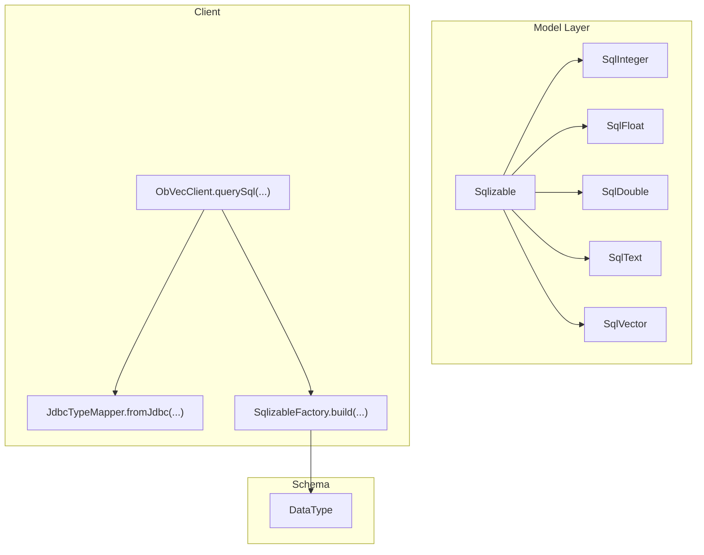
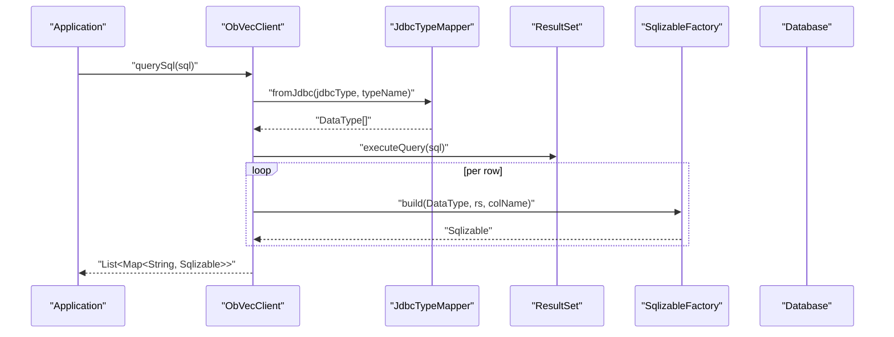
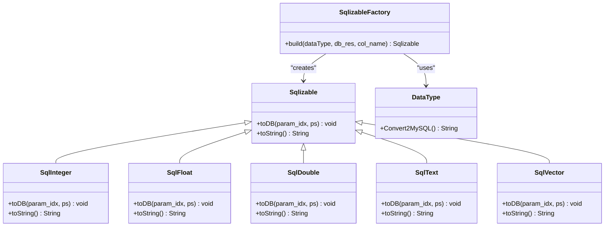
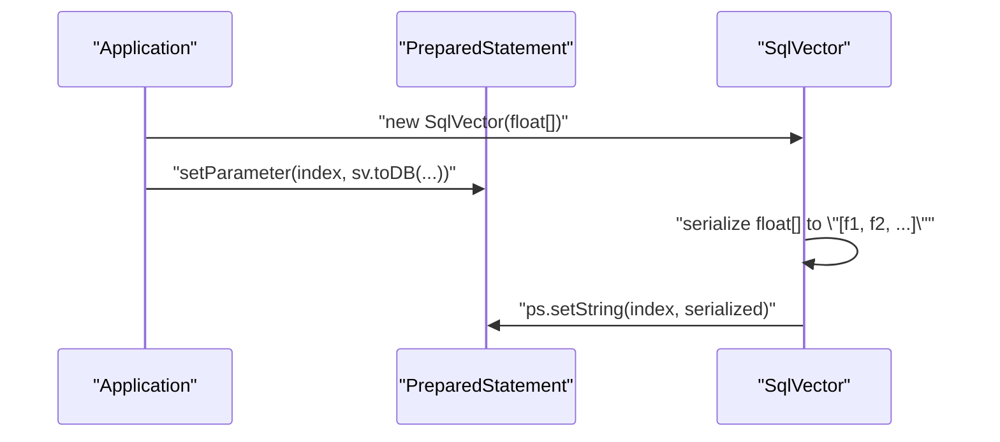
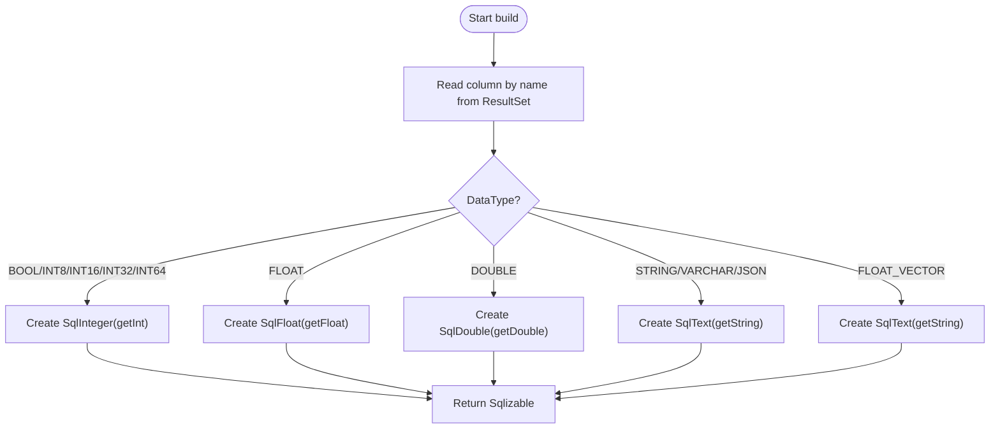
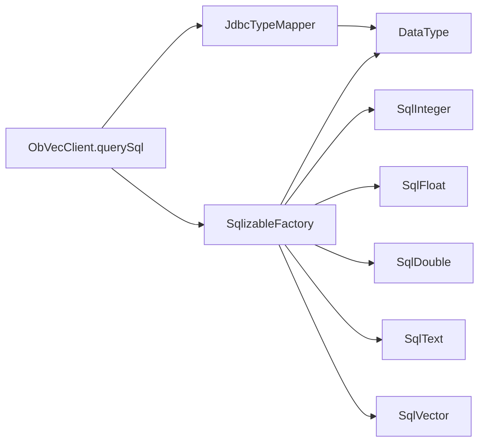

# Data Models and Type System

<cite>
**Referenced Files in This Document**
- [Sqlizable.java](file://src/main/java/com/oceanbase/obvector4j/model/Sqlizable.java)
- [SqlizableFactory.java](file://src/main/java/com/oceanbase/obvector4j/model/SqlizableFactory.java)
- [SqlVector.java](file://src/main/java/com/oceanbase/obvector4j/model/SqlVector.java)
- [SqlInteger.java](file://src/main/java/com/oceanbase/obvector4j/model/SqlInteger.java)
- [SqlDouble.java](file://src/main/java/com/oceanbase/obvector4j/model/SqlDouble.java)
- [SqlFloat.java](file://src/main/java/com/oceanbase/obvector4j/model/SqlFloat.java)
- [SqlText.java](file://src/main/java/com/oceanbase/obvector4j/model/SqlText.java)
- [DataType.java](file://src/main/java/com/oceanbase/obvector4j/schema/DataType.java)
- [ObVecClient.java](file://src/main/java/com/oceanbase/obvector4j/ObVecClient.java)
</cite>

## Table of Contents
1. [Introduction](#introduction)
2. [Project Structure](#project-structure)
3. [Core Components](#core-components)
4. [Architecture Overview](#architecture-overview)
5. [Detailed Component Analysis](#detailed-component-analysis)
6. [Dependency Analysis](#dependency-analysis)
7. [Performance Considerations](#performance-considerations)
8. [Troubleshooting Guide](#troubleshooting-guide)
9. [Conclusion](#conclusion)
10. [Appendices](#appendices)

## Introduction
This document explains the type system and data model hierarchy used to represent database values, generate SQL parameters, and perform type conversion during query execution. The foundation is a small set of types that implement a common interface for writing values into JDBC PreparedStatements and converting them back from ResultSet columns. It also covers built-in implementations for numeric types, text, and embedding vectors, as well as guidance for extending the system with custom types.

## Project Structure
The type system resides under the model package and integrates with schema definitions and client-side query execution:
- Model layer: Sqlizable and its concrete implementations (SqlInteger, SqlFloat, SqlDouble, SqlText, SqlVector).
- Factory: SqlizableFactory maps DataType to appropriate Sqlizable instances when reading results.
- Schema: DataType enumerates supported logical types and their MySQL mapping.
- Client: ObVecClient orchestrates query execution and uses JdbcTypeMapper and SqlizableFactory to convert JDBC results into typed wrappers.

**Diagram sources**
- [Sqlizable.java:1-10](file://src/main/java/com/oceanbase/obvector4j/model/Sqlizable.java#L1-L10)
- [SqlInteger.java:1-23](file://src/main/java/com/oceanbase/obvector4j/model/SqlInteger.java#L1-L23)
- [SqlFloat.java:1-23](file://src/main/java/com/oceanbase/obvector4j/model/SqlFloat.java#L1-L23)
- [SqlDouble.java:1-24](file://src/main/java/com/oceanbase/obvector4j/model/SqlDouble.java#L1-L24)
- [SqlText.java:1-23](file://src/main/java/com/oceanbase/obvector4j/model/SqlText.java#L1-L23)
- [SqlVector.java:1-33](file://src/main/java/com/oceanbase/obvector4j/model/SqlVector.java#L1-L33)
- [DataType.java:1-36](file://src/main/java/com/oceanbase/obvector4j/schema/DataType.java#L1-L36)
- [ObVecClient.java:528-557](file://src/main/java/com/oceanbase/obvector4j/ObVecClient.java#L528-L557)

**Section sources**
- [Sqlizable.java:1-10](file://src/main/java/com/oceanbase/obvector4j/model/Sqlizable.java#L1-L10)
- [SqlizableFactory.java:1-40](file://src/main/java/com/oceanbase/obvector4j/model/SqlizableFactory.java#L1-L40)
- [SqlVector.java:1-33](file://src/main/java/com/oceanbase/obvector4j/model/SqlVector.java#L1-L33)
- [SqlInteger.java:1-23](file://src/main/java/com/oceanbase/obvector4j/model/SqlInteger.java#L1-L23)
- [SqlDouble.java:1-24](file://src/main/java/com/oceanbase/obvector4j/model/SqlDouble.java#L1-L24)
- [SqlFloat.java:1-23](file://src/main/java/com/oceanbase/obvector4j/model/SqlFloat.java#L1-L23)
- [SqlText.java:1-23](file://src/main/java/com/oceanbase/obvector4j/model/SqlText.java#L1-L23)
- [DataType.java:1-36](file://src/main/java/com/oceanbase/obvector4j/schema/DataType.java#L1-L36)
- [ObVecClient.java:528-557](file://src/main/java/com/oceanbase/obvector4j/ObVecClient.java#L528-L557)

## Core Components
- Sqlizable: Abstract base defining how a value is written to a PreparedStatement parameter and how it converts to a string representation.
- Concrete types:
  - SqlInteger: wraps int; writes via setInt.
  - SqlFloat: wraps float; writes via setFloat.
  - SqlDouble: wraps double; writes via setDouble.
  - SqlText: wraps String; writes via setString.
  - SqlVector: wraps float[]; serializes to a bracketed comma-separated list and writes via setString.
- SqlizableFactory: Builds an appropriate Sqlizable instance from a DataType and a ResultSet column.
- DataType: Logical type enumeration with a method to map to MySQL types.

Key responsibilities:
- Parameter binding: Each Sqlizable implementation sets the correct JDBC parameter type.
- Result conversion: SqlizableFactory reads the raw JDBC value based on DataType and returns a typed wrapper.
- SQL generation: For vectors, serialization occurs within toDB; other types rely on JDBC’s native formatting.

**Section sources**
- [Sqlizable.java:1-10](file://src/main/java/com/oceanbase/obvector4j/model/Sqlizable.java#L1-L10)
- [SqlInteger.java:1-23](file://src/main/java/com/oceanbase/obvector4j/model/SqlInteger.java#L1-L23)
- [SqlFloat.java:1-23](file://src/main/java/com/oceanbase/obvector4j/model/SqlFloat.java#L1-L23)
- [SqlDouble.java:1-24](file://src/main/java/com/oceanbase/obvector4j/model/SqlDouble.java#L1-L24)
- [SqlText.java:1-23](file://src/main/java/com/oceanbase/obvector4j/model/SqlText.java#L1-L23)
- [SqlVector.java:1-33](file://src/main/java/com/oceanbase/obvector4j/model/SqlVector.java#L1-L33)
- [SqlizableFactory.java:1-40](file://src/main/java/com/oceanbase/obvector4j/model/SqlizableFactory.java#L1-L40)
- [DataType.java:1-36](file://src/main/java/com/oceanbase/obvector4j/schema/DataType.java#L1-L36)

## Architecture Overview
The type system is designed around a simple contract:
- Write path: Application code constructs Sqlizable objects and passes them to prepared statements through a common interface.
- Read path: Query execution infers column types using JdbcTypeMapper, then SqlizableFactory builds typed wrappers from ResultSet values.

**Diagram sources**
- [ObVecClient.java:528-557](file://src/main/java/com/oceanbase/obvector4j/ObVecClient.java#L528-L557)
- [SqlizableFactory.java:1-40](file://src/main/java/com/oceanbase/obvector4j/model/SqlizableFactory.java#L1-L40)

## Detailed Component Analysis

### Sqlizable Interface
- Purpose: Define a uniform way to bind values to PreparedStatement parameters and produce a string representation.
- Methods:
  - toDB(param_idx, ps): Sets the JDBC parameter at the given index.
  - toString(): Returns a human-readable or SQL-friendly representation.

Design notes:
- Extensibility: New types only need to implement these two methods.
- No validation here; validation can be added in subclasses if needed.

**Section sources**
- [Sqlizable.java:1-10](file://src/main/java/com/oceanbase/obvector4j/model/Sqlizable.java#L1-L10)

### Built-in Implementations

#### SqlInteger
- Wraps int and binds via setInt.
- Suitable for all integer-like logical types (BOOL, INT8..INT64) when read via factory.

**Section sources**
- [SqlInteger.java:1-23](file://src/main/java/com/oceanbase/obvector4j/model/SqlInteger.java#L1-L23)

#### SqlFloat
- Wraps float and binds via setFloat.
- Used for FLOAT logical type.

**Section sources**
- [SqlFloat.java:1-23](file://src/main/java/com/oceanbase/obvector4j/model/SqlFloat.java#L1-L23)

#### SqlDouble
- Wraps double and binds via setDouble.
- Used for DOUBLE logical type.

**Section sources**
- [SqlDouble.java:1-24](file://src/main/java/com/oceanbase/obvector4j/model/SqlDouble.java#L1-L24)

#### SqlText
- Wraps String and binds via setString.
- Used for STRING, VARCHAR, JSON, and currently for FLOAT_VECTOR when reading results.

**Section sources**
- [SqlText.java:1-23](file://src/main/java/com/oceanbase/obvector4j/model/SqlText.java#L1-L23)

#### SqlVector
- Wraps float[] and serializes to a bracketed, comma-separated list before binding as a string.
- Used for writing vector values; reading returns a SqlText containing the serialized form unless extended.

Behavior details:
- toDB: Converts each float element to a string, joins with commas, wraps in brackets, and sets as a string parameter.
- toString: Produces the same bracketed format for debugging/logging.

**Section sources**
- [SqlVector.java:1-33](file://src/main/java/com/oceanbase/obvector4j/model/SqlVector.java#L1-L33)

### SqlizableFactory and Type Coercion
- Input: DataType enum, ResultSet, and column name.
- Output: A Sqlizable instance corresponding to the logical type.
- Mapping highlights:
  - Integer family (BOOL, INT8..INT64) -> SqlInteger via getInt.
  - FLOAT -> SqlFloat via getFloat.
  - DOUBLE -> SqlDouble via getDouble.
  - STRING/VARCHAR/JSON -> SqlText via getString.
  - FLOAT_VECTOR -> Currently SqlText via getString (serialization/deserialization not performed by factory).

Coercion behavior:
- All conversions are driven by DataType. If a column’s JDBC type does not match expectations, the resulting Sqlizable may not reflect the intended semantics (e.g., vector returned as text).

**Section sources**
- [SqlizableFactory.java:1-40](file://src/main/java/com/oceanbase/obvector4j/model/SqlizableFactory.java#L1-L40)
- [DataType.java:1-36](file://src/main/java/com/oceanbase/obvector4j/schema/DataType.java#L1-L36)

### Class Diagram

**Diagram sources**
- [Sqlizable.java:1-10](file://src/main/java/com/oceanbase/obvector4j/model/Sqlizable.java#L1-L10)
- [SqlInteger.java:1-23](file://src/main/java/com/oceanbase/obvector4j/model/SqlInteger.java#L1-L23)
- [SqlFloat.java:1-23](file://src/main/java/com/oceanbase/obvector4j/model/SqlFloat.java#L1-L23)
- [SqlDouble.java:1-24](file://src/main/java/com/oceanbase/obvector4j/model/SqlDouble.java#L1-L24)
- [SqlText.java:1-23](file://src/main/java/com/oceanbase/obvector4j/model/SqlText.java#L1-L23)
- [SqlVector.java:1-33](file://src/main/java/com/oceanbase/obvector4j/model/SqlVector.java#L1-L33)
- [SqlizableFactory.java:1-40](file://src/main/java/com/oceanbase/obvector4j/model/SqlizableFactory.java#L1-L40)
- [DataType.java:1-36](file://src/main/java/com/oceanbase/obvector4j/schema/DataType.java#L1-L36)

### Sequence Diagram: Writing Vectors

**Diagram sources**
- [SqlVector.java:1-33](file://src/main/java/com/oceanbase/obvector4j/model/SqlVector.java#L1-L33)

### Flowchart: Reading Results and Building Sqlizable

**Diagram sources**
- [SqlizableFactory.java:1-40](file://src/main/java/com/oceanbase/obvector4j/model/SqlizableFactory.java#L1-L40)

## Dependency Analysis
- SqlizableFactory depends on DataType to decide which Sqlizable subclass to instantiate.
- ObVecClient.querySql depends on JdbcTypeMapper to infer DataType from JDBC metadata, then delegates to SqlizableFactory for per-column wrapping.
- Vector handling is special: write path uses SqlVector serialization; read path currently returns SqlText, requiring application-level parsing if a float[] is desired.

**Diagram sources**
- [ObVecClient.java:528-557](file://src/main/java/com/oceanbase/obvector4j/ObVecClient.java#L528-L557)
- [SqlizableFactory.java:1-40](file://src/main/java/com/oceanbase/obvector4j/model/SqlizableFactory.java#L1-L40)
- [DataType.java:1-36](file://src/main/java/com/oceanbase/obvector4j/schema/DataType.java#L1-L36)

**Section sources**
- [ObVecClient.java:528-557](file://src/main/java/com/oceanbase/obvector4j/ObVecClient.java#L528-L557)
- [SqlizableFactory.java:1-40](file://src/main/java/com/oceanbase/obvector4j/model/SqlizableFactory.java#L1-L40)
- [DataType.java:1-36](file://src/main/java/com/oceanbase/obvector4j/schema/DataType.java#L1-L36)

## Performance Considerations
- Numeric types:
  - Prefer the most specific type for storage and computation to avoid unnecessary conversions. Use SqlInteger for integers, SqlFloat for single precision, and SqlDouble for double precision.
  - Note that BOOL and smaller integer types are mapped to SqlInteger on read; this avoids multiple integer wrappers but may lose exact width information.
- Text and JSON:
  - SqlText uses setString; large strings incur memory overhead. Consider schema design to limit text size where possible.
- Vectors:
  - Serialization cost: SqlVector converts each float to a string and joins them, which is O(d) in vector dimension d. For high-dimensional vectors, this can be significant.
  - Storage format: Vectors are stored as bracketed lists via setString. Ensure the target column supports the expected vector literal format.
  - Read path: Current factory returns SqlText for FLOAT_VECTOR. If you need float[], parse the text representation in your application, adding extra CPU and memory usage. Consider extending the factory to return a dedicated vector wrapper if frequent parsing is required.
- General:
  - Avoid unnecessary boxing/unboxing by choosing the right primitive-backed wrapper.
  - Batch operations benefit from minimizing object creation; reuse arrays where feasible.

[No sources needed since this section provides general guidance]

## Troubleshooting Guide
Common issues and remedies:
- Unexpected SqlText for vector columns:
  - Cause: SqlizableFactory maps FLOAT_VECTOR to SqlText on read.
  - Remedy: Parse the string to float[] yourself or extend the factory to provide a vector-specific wrapper.
- Precision loss:
  - Using SqlFloat for values that require double precision can cause rounding differences. Prefer SqlDouble for higher precision needs.
- Integer overflow:
  - All integer logical types are read as SqlInteger (int). Values outside int range will overflow. Choose appropriate schema types and validate inputs.
- Empty or null values:
  - Ensure your schema allows NULLs and handle nulls in application logic after reading.

**Section sources**
- [SqlizableFactory.java:1-40](file://src/main/java/com/oceanbase/obvector4j/model/SqlizableFactory.java#L1-L40)
- [SqlVector.java:1-33](file://src/main/java/com/oceanbase/obvector4j/model/SqlVector.java#L1-L33)

## Conclusion
The type system centers on a minimal, extensible interface for database values, with clear separation between write-time binding and read-time coercion. Built-in types cover common scenarios, while the factory pattern enables straightforward extension. For vector workloads, be mindful of serialization costs and current read behavior returning text. Careful selection of numeric types and awareness of integer width limitations will improve correctness and performance.

[No sources needed since this section summarizes without analyzing specific files]

## Appendices

### How to Create a Custom Data Type
Steps:
1. Subclass Sqlizable.
2. Implement toDB to set the JDBC parameter appropriately.
3. Implement toString for logging/debugging.
4. Extend SqlizableFactory.build to recognize a new DataType and construct your wrapper from ResultSet.
5. Optionally add a new entry to DataType and update Convert2MySQL if needed.

Example outline (paths only):
- [CustomSqlType.java](file://src/main/java/com/oceanbase/obvector4j/model/CustomSqlType.java)
- [SqlizableFactory.java:1-40](file://src/main/java/com/oceanbase/obvector4j/model/SqlizableFactory.java#L1-L40)
- [DataType.java:1-36](file://src/main/java/com/oceanbase/obvector4j/schema/DataType.java#L1-L36)

### Handling Type Coercion During Query Execution
- Column type inference: ObVecClient.querySql uses JdbcTypeMapper to derive DataType from JDBC metadata.
- Per-column wrapping: SqlizableFactory.build creates typed wrappers based on DataType.
- To customize coercion:
  - Adjust DataType mappings.
  - Modify SqlizableFactory.build to return different wrappers or perform additional parsing.

**Section sources**
- [ObVecClient.java:528-557](file://src/main/java/com/oceanbase/obvector4j/ObVecClient.java#L528-L557)
- [SqlizableFactory.java:1-40](file://src/main/java/com/oceanbase/obvector4j/model/SqlizableFactory.java#L1-L40)
- [DataType.java:1-36](file://src/main/java/com/oceanbase/obvector4j/schema/DataType.java#L1-L36)