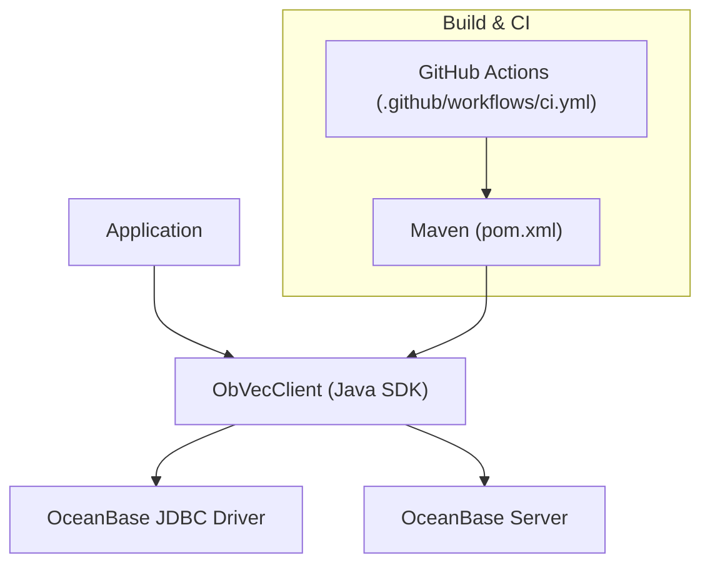
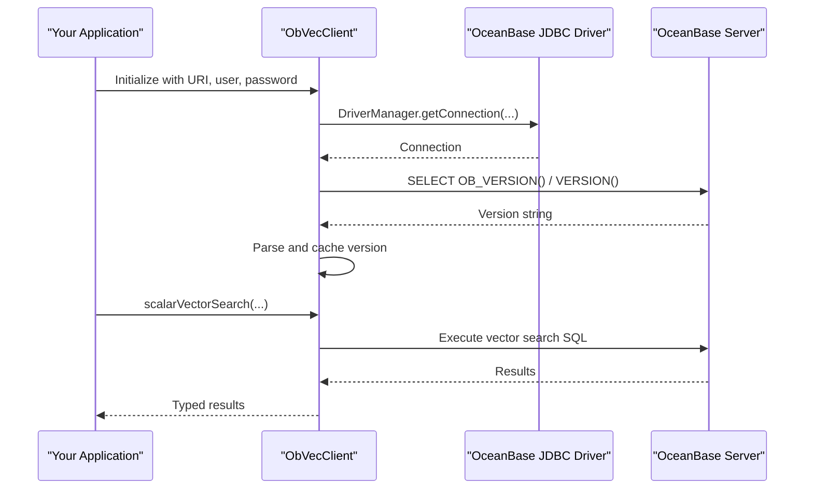
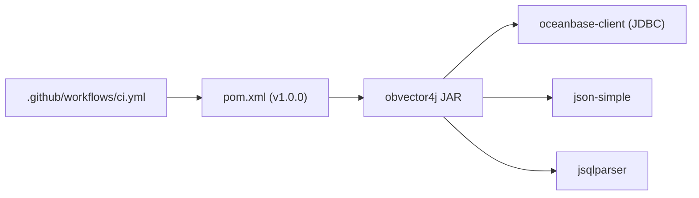

# Deployment and Configuration

<cite>
**Referenced Files in This Document**
- [pom.xml](file://pom.xml)
- [.github/workflows/ci.yml](file://.github/workflows/ci.yml)
- [README.md](file://README.md)
- [ObVecClient.java](file://src/main/java/com/oceanbase/obvector4j/ObVecClient.java)
- [OceanBaseVersion.java](file://src/main/java/com/oceanbase/obvector4j/version/OceanBaseVersion.java)
- [IndexParam.java](file://src/main/java/com/oceanbase/obvector4j/schema/IndexParam.java)
- [VectorMetric.java](file://src/main/java/com/oceanbase/obvector4j/util/VectorMetric.java)
- [OceanBaseContainerTestBase.java](file://src/test/java/com/oceanbase/obvector4j/support/OceanBaseContainerTestBase.java)
- [RemoteOceanBaseTestBase.java](file://src/test/java/com/oceanbase/obvector4j/support/RemoteOceanBaseTestBase.java)
- [Makefile](file://Makefile)
- [getting-started.md](file://docs/en/getting-started.md)
</cite>

## Update Summary
**Changes Made**
- Updated Maven build configuration references to version 1.0.0 throughout the documentation
- Updated dependency management section to reflect current stable release version
- Updated installation examples and version compatibility matrices
- Enhanced production deployment guidance for version 1.0.0 release

## Table of Contents
1. Introduction
2. Project Structure
3. Core Components
4. Architecture Overview
5. Detailed Component Analysis
6. Dependency Analysis
7. Performance Considerations
8. Troubleshooting Guide
9. Conclusion
10. Appendices

## Introduction
This document provides production-focused deployment and configuration guidance for OceanBase Vector4J applications. It covers Maven build configuration, dependency management, version compatibility matrices, connection handling, performance tuning parameters, monitoring integration points, CI/CD with GitHub Actions, environment variable management, containerization strategies, scaling considerations for high-throughput vector search workloads, and operational best practices for maintaining OceanBase Vector4J applications in production environments.

## Project Structure
The project is a Java 8 library packaged as a JAR. The main entry point for application code is the client class that manages connections to OceanBase and exposes vector and hybrid search APIs. Build and test automation are defined via Maven and GitHub Actions.



**Diagram sources**
- [pom.xml:1-254](file://pom.xml#L1-L254)
- [.github/workflows/ci.yml:1-58](file://.github/workflows/ci.yml#L1-L58)
- [ObVecClient.java:1-603](file://src/main/java/com/oceanbase/obvector4j/ObVecClient.java#L1-L603)

**Section sources**
- [pom.xml:1-254](file://pom.xml#L1-L254)
- [.github/workflows/ci.yml:1-58](file://.github/workflows/ci.yml#L1-L58)
- [README.md:1-119](file://README.md#L1-L119)

## Core Components
- ObVecClient: Primary client for connecting to OceanBase, managing connections, executing SQL, creating collections/indexes, performing vector and hybrid searches, and exposing runtime tuning variables.
- Version gating: OceanBaseVersion parses server versions and enforces feature availability (e.g., HYBRID_SEARCH SQL requires 4.6.0+).
- Index parameters: IndexParam configures HNSW index options such as m, ef_construction, ef_search, metric type, and library selection.
- Metrics utilities: VectorMetric validates and maps distance metrics to SQL functions.

Key responsibilities:
- Connection lifecycle and basic SQL execution
- Feature detection and capability checks
- Vector index creation and parameterization
- Hybrid search orchestration and DSL support (version-gated)

**Section sources**
- [ObVecClient.java:1-603](file://src/main/java/com/oceanbase/obvector4j/ObVecClient.java#L1-L603)
- [OceanBaseVersion.java:1-101](file://src/main/java/com/oceanbase/obvector4j/version/OceanBaseVersion.java#L1-L101)
- [IndexParam.java:1-65](file://src/main/java/com/oceanbase/obvector4j/schema/IndexParam.java#L1-L65)
- [VectorMetric.java:1-40](file://src/main/java/com/oceanbase/obvector4j/util/VectorMetric.java#L1-L40)

## Architecture Overview
At runtime, applications use ObVecClient to connect to OceanBase via the official JDBC driver. The client performs feature detection, constructs SQL or DSL queries, and executes them against the database. For hybrid search features requiring 4.6.0+, the client enforces minimum server versions before enabling those paths.



**Diagram sources**
- [ObVecClient.java:37-45](file://src/main/java/com/oceanbase/obvector4j/ObVecClient.java#L37-L45)
- [ObVecClient.java:377-406](file://src/main/java/com/oceanbase/obvector4j/ObVecClient.java#L377-L406)
- [ObVecClient.java:438-450](file://src/main/java/com/oceanbase/obvector4j/ObVecClient.java#L438-L450)

## Detailed Component Analysis

### Maven Build and Profiles
- **Project Version**: 1.0.0 (stable release)
- Java target: Java 8 source/target compatibility.
- Packaging: JAR artifact.
- Plugins:
  - maven-surefire-plugin: Default runs unit tests only; profiles enable integration and remote IT suites.
  - maven-compiler-plugin: Enforces Java 8 and encoding.
  - maven-javadoc-plugin and maven-source-plugin: Attach documentation and sources.
  - maven-checkstyle-plugin: Code style validation with checkstyle 9.3 (last Java 8 compatible version).
- Profiles:
  - integration: Runs unit + container-based integration tests.
  - remote-it: Runs remote cluster integration tests.
  - all-tests: Runs all tests.
- Distribution management: Sonatype Nexus staging URLs configured for releases/snapshots.

Operational notes:
- Use profiles to control test scope in CI vs local environments.
- Ensure JDK 8 toolchain is available in your build agents.
- Version 1.0.0 represents the first stable release suitable for production deployment.

**Updated** Added version 1.0.0 reference and enhanced plugin configuration details.

**Section sources**
- [pom.xml:5-7](file://pom.xml#L5-L7)
- [pom.xml:11-17](file://pom.xml#L11-L17)
- [pom.xml:101-186](file://pom.xml#L101-L186)
- [pom.xml:188-239](file://pom.xml#L188-L239)
- [pom.xml:241-253](file://pom.xml#L241-L253)

### Dependency Management and Version Compatibility
- **Current Release**: Version 1.0.0 (stable)
- Runtime dependencies:
  - oceanbase-client (JDBC driver): Required for connectivity.
  - json-simple: JSON processing.
  - jsqlparser: SQL parsing (downgraded to 4.7 due to Java 8 constraint).
- Test dependencies:
  - junit, testcontainers (including OceanBase container), slf4j-api/simple.

Compatibility matrix:
- Java runtime: 8 (source/target).
- OceanBase server:
  - HYBRID_SEARCH SQL interface requires 4.6.0+.
  - Client detects server version and gates features accordingly.

Recommendations:
- Pin exact versions in production builds using version 1.0.0.
- Validate JDBC driver compatibility with your OceanBase cluster version.
- Use Maven's dependency management to ensure consistent versions across environments.

**Updated** Updated to reflect version 1.0.0 as the current stable release and enhanced dependency management guidance.

**Section sources**
- [pom.xml:19-75](file://pom.xml#L19-L75)
- [README.md:5-6](file://README.md#L5-L6)
- [README.md:18-24](file://README.md#L18-L24)
- [getting-started.md:20-26](file://docs/en/getting-started.md#L20-L26)
- [OceanBaseVersion.java:11-12](file://src/main/java/com/oceanbase/obvector4j/version/OceanBaseVersion.java#L11-L12)
- [ObVecClient.java:411-413](file://src/main/java/com/oceanbase/obvector4j/ObVecClient.java#L411-L413)

### Connection Handling and Pooling
- Current implementation uses java.sql.DriverManager per client instance.
- No built-in connection pooling; each ObVecClient holds one Connection.

Production guidance:
- Wrap ObVecClient usage with an external connection pool (e.g., HikariCP) at the application layer if you need pooled connections.
- Manage client lifecycles carefully to avoid leaking connections.
- Configure JDBC URL, credentials, and any driver-level settings via environment variables or secrets managers.

Environment variables used by tests and examples:
- OCEANBASE_URI (preferred)
- OCEANBASE_HOST, OCEANBASE_PORT, OCEANBASE_USER, OCEANBASE_PASSWORD, OCEANBASE_DATABASE (fallback)

**Section sources**
- [ObVecClient.java:37-45](file://src/main/java/com/oceanbase/obvector4j/ObVecClient.java#L37-L45)
- [README.md:34-43](file://README.md#L34-L43)
- [RemoteOceanBaseTestBase.java:23-53](file://src/test/java/com/oceanbase/obvector4j/support/RemoteOceanBaseTestBase.java#L23-L53)
- [OceanBaseContainerTestBase.java:30-40](file://src/test/java/com/oceanbase/obvector4j/support/OceanBaseContainerTestBase.java#L30-L40)

### Performance Tuning Parameters
HNSW index parameters (via IndexParam):
- m: Number of connections per node in the graph.
- ef_construction: Controls index construction quality and memory usage.
- ef_search: Controls search accuracy vs latency trade-off.
- lib: Underlying vector library (default vsag).
- metric_type: Distance metric (e.g., l2, inner_product).

Runtime variable:
- ob_hnsw_ef_search: Can be set via ObVecClient.setHNSWEfSearch(...); read via getHNSWEfSearch().

Distance metrics mapping:
- ip -> negative_inner_product
- cosine -> cosine_distance
- l2 -> l2_distance

Guidance:
- Tune ef_search for latency/accuracy balance under load.
- Adjust m and ef_construction during index creation based on dataset size and update frequency.
- Choose metric_type aligned with embedding normalization strategy.

**Section sources**
- [IndexParam.java:6-10](file://src/main/java/com/oceanbase/obvector4j/schema/IndexParam.java#L6-L10)
- [IndexParam.java:59-63](file://src/main/java/com/oceanbase/obvector4j/schema/IndexParam.java#L59-L63)
- [ObVecClient.java:64-114](file://src/main/java/com/oceanbase/obvector4j/ObVecClient.java#L64-L114)
- [VectorMetric.java:11-27](file://src/main/java/com/oceanbase/obvector4j/util/VectorMetric.java#L11-L27)

### Monitoring Integration Points
- Logging:
  - Tests use SLF4J with simple binding for visibility.
  - ObVecJsonClient uses java.util.logging.Logger (separate from the primary vector client).
- Metrics:
  - No built-in metrics instrumentation; integrate application-level metrics around client calls (latency, throughput, errors).
- Observability:
  - Capture JDBC-level metrics using your chosen APM or metrics collector.
  - Log key operations (index creation, search queries) with correlation IDs.

**Section sources**
- [pom.xml:60-74](file://pom.xml#L60-L74)
- [ObVecJsonClient.java:37-41](file://src/main/java/com/oceanbase/obvector4j/ObVecJsonClient.java#L37-L41)

### CI/CD Pipeline (GitHub Actions)
- Triggers: push and pull_request on main/master/develop.
- Environment: Ubuntu runner with JDK 8 (Temurin).
- Jobs:
  - format: Code style checking with Checkstyle
  - test: Unit and integration testing with Testcontainers
  - build: Final JAR packaging
- Steps:
  - Checkout code
  - Setup JDK 8 with Maven cache
  - Run tests with Maven profile integration (uses Testcontainers to start OceanBase automatically)
  - Upload Surefire reports as artifacts
  - Build final artifact

Enhancements for production readiness:
- Add steps for building the JAR and publishing to a private repository.
- Add a release job gated on tags for version 1.0.0+ deployments.
- Integrate security scanning and dependency vulnerability checks.
- Cache Docker layers for faster Testcontainers startup.

**Updated** Enhanced CI/CD pipeline description to include the new format job and build job structure.

**Section sources**
- [.github/workflows/ci.yml:1-58](file://.github/workflows/ci.yml#L1-L58)
- [pom.xml:188-239](file://pom.xml#L188-L239)
- [Makefile:1-30](file://Makefile#L1-L30)

### Environment Variable Management for Credentials
Recommended variables:
- OCEANBASE_URI: Full JDBC URL (preferred)
- OCEANBASE_USER: Username
- OCEANBASE_PASSWORD: Password
- OCEANBASE_HOST, OCEANBASE_PORT, OCEANBASE_DATABASE: Alternative to OCEANBASE_URI

Best practices:
- Never hardcode credentials in code or configs committed to VCS.
- Use platform secret stores (e.g., Kubernetes Secrets, cloud secret managers).
- Validate presence of required variables at startup and fail fast with clear messages.

**Section sources**
- [README.md:34-43](file://README.md#L34-L43)
- [RemoteOceanBaseTestBase.java:23-53](file://src/test/java/com/oceanbase/obvector4j/support/RemoteOceanBaseTestBase.java#L23-L53)
- [OceanBaseContainerTestBase.java:30-40](file://src/test/java/com/oceanbase/obvector4j/support/OceanBaseContainerTestBase.java#L30-L40)

### Containerization Strategies
- Application container:
  - Base image: Official JDK 8 image.
  - Include application JAR and any runtime configs.
  - Inject credentials via environment variables or mounted secrets.
- Database side:
  - Use managed OceanBase services in production.
  - For local/dev, Testcontainers can spin up OceanBase CE automatically when no external URI is provided.

Example patterns:
- Single-process app container calling OceanBase over network.
- Sidecar or init containers for schema migrations and index creation prior to app startup.

**Section sources**
- [OceanBaseContainerTestBase.java:68-80](file://src/test/java/com/oceanbase/obvector4j/support/OceanBaseContainerTestBase.java#L68-L80)
- [README.md:27-30](file://README.md#L27-L30)

### Production Deployment Patterns
- Stateless service pattern:
  - Scale horizontally by running multiple instances behind a load balancer.
  - Each instance maintains its own connection(s) to OceanBase.
- Schema and index management:
  - Perform DDL/DML changes via migration scripts executed outside the hot path.
  - Use blue/green or rolling updates to minimize downtime.
- Feature gating:
  - Rely on version detection to enable/disable advanced features like HYBRID_SEARCH SQL.

**Section sources**
- [ObVecClient.java:377-406](file://src/main/java/com/oceanbase/obvector4j/ObVecClient.java#L377-L406)
- [ObVecClient.java:411-413](file://src/main/java/com/oceanbase/obvector4j/ObVecClient.java#L411-L413)

### Scaling Considerations for High-Throughput Vector Search
- Index tuning:
  - Increase ef_search for higher recall at the cost of latency.
  - Adjust m and ef_construction for large datasets and frequent updates.
- Query shaping:
  - Limit topk and output fields to reduce payload and processing time.
  - Use filters on indexed scalar columns to prune search space.
- Concurrency and resources:
  - Ensure adequate CPU/memory for vector operations.
  - Monitor OceanBase resource utilization and scale nodes/shards as needed.
- Network and I/O:
  - Co-locate application and database where possible to reduce latency.
  - Use connection pooling at the application layer to manage concurrency efficiently.

[No sources needed since this section provides general guidance]

## Dependency Analysis
High-level dependency relationships relevant to deployment:



**Diagram sources**
- [pom.xml:19-75](file://pom.xml#L19-L75)
- [.github/workflows/ci.yml:1-58](file://.github/workflows/ci.yml#L1-L58)

**Section sources**
- [pom.xml:19-75](file://pom.xml#L19-L75)
- [.github/workflows/ci.yml:1-58](file://.github/workflows/ci.yml#L1-L58)

## Performance Considerations
- Prefer explicit output fields and data types to reduce overhead.
- Use appropriate metric types for your embeddings (cosine for normalized vectors).
- Tune HNSW parameters (m, ef_construction, ef_search) based on workload characteristics.
- Set ob_hnsw_ef_search at session level when necessary to influence search behavior.
- Batch inserts and use transactions to improve ingestion throughput.

[No sources needed since this section provides general guidance]

## Troubleshooting Guide
Common issues and resolutions:
- Missing environment variables:
  - Ensure OCEANBASE_URI or component variables are set before starting the application.
- Remote integration tests skipped:
  - Enable with OCEANBASE_REMOTE_IT=1 and provide required connection variables.
- Testcontainers not starting:
  - Verify Docker availability and permissions; ensure OCEANBASE_URI is not set when relying on containers.
- Version incompatibility:
  - HYBRID_SEARCH SQL requires OceanBase 4.6.0+. Confirm server version and adjust feature usage accordingly.
- Build failures:
  - Ensure JDK 8 is installed and JAVA_HOME is properly configured.
  - Check Maven version compatibility with project requirements.

**Updated** Added troubleshooting guidance for build-related issues common in production deployments.

**Section sources**
- [RemoteOceanBaseTestBase.java:23-53](file://src/test/java/com/oceanbase/obvector4j/support/RemoteOceanBaseTestBase.java#L23-L53)
- [OceanBaseContainerTestBase.java:30-40](file://src/test/java/com/oceanbase/obvector4j/support/OceanBaseContainerTestBase.java#L30-L40)
- [README.md:92-112](file://README.md#L92-L112)
- [ObVecClient.java:411-413](file://src/main/java/com/oceanbase/obvector4j/ObVecClient.java#L411-L413)

## Conclusion
For production deployments of OceanBase Vector4J applications:
- Build with Maven using Java 8 and pinned dependency versions (current stable release: 1.0.0).
- Manage credentials via environment variables or secret managers.
- Use external connection pooling and monitor performance.
- Leverage GitHub Actions for automated testing and consider extending pipelines for packaging and release.
- Tune HNSW index parameters and query shapes for high-throughput vector search.
- Follow operational best practices for schema evolution, scaling, and observability.
- Utilize the comprehensive Makefile targets for consistent build and test processes.

**Updated** Enhanced conclusion to emphasize version 1.0.0 stability and Makefile usage.

[No sources needed since this section summarizes without analyzing specific files]

## Appendices

### Appendix A: Environment Variables Reference
- OCEANBASE_URI: Full JDBC URL (preferred)
- OCEANBASE_HOST: Hostname or IP of OceanBase
- OCEANBASE_PORT: Port number
- OCEANBASE_USER: Username
- OCEANBASE_PASSWORD: Password
- OCEANBASE_DATABASE: Database name
- OCEANBASE_REMOTE_IT: Enable remote integration tests (1 or true)

**Section sources**
- [README.md:100-112](file://README.md#L100-L112)
- [RemoteOceanBaseTestBase.java:23-53](file://src/test/java/com/oceanbase/obvector4j/support/RemoteOceanBaseTestBase.java#L23-L53)

### Appendix B: Version Compatibility Matrix
- **Current Release**: 1.0.0 (stable)
- Java runtime: 8
- OceanBase server:
  - Minimum for HYBRID_SEARCH SQL: 4.6.0
- Key libraries:
  - oceanbase-client: 2.4.1
  - jsqlparser: 4.7 (Java 8 compatible)
  - json-simple: 1.1.1
  - testcontainers: 1.19.8
  - slf4j: 1.7.36

**Updated** Updated version compatibility matrix to reflect version 1.0.0 as the current stable release and added additional library versions.

**Section sources**
- [pom.xml:5-7](file://pom.xml#L5-L7)
- [pom.xml:11-17](file://pom.xml#L11-L17)
- [pom.xml:19-75](file://pom.xml#L19-L75)
- [README.md:5-6](file://README.md#L5-L6)
- [README.md:18-24](file://README.md#L18-L24)
- [getting-started.md:20-26](file://docs/en/getting-started.md#L20-L26)
- [OceanBaseVersion.java:11-12](file://src/main/java/com/oceanbase/obvector4j/version/OceanBaseVersion.java#L11-L12)

### Appendix C: Maven Build Commands
Standard build commands for version 1.0.0:

```bash
# Clean build
mvn clean package

# Skip tests for production builds
mvn -B package -DskipTests=true -Dmaven.javadoc.skip=true

# Run unit tests only
mvn test

# Run integration tests
mvn test -Pintegration

# Run all tests
mvn test -Pall-tests

# Deploy to Sonatype
mvn deploy
```

**New Section** Added comprehensive Maven build command reference for production deployments.

**Section sources**
- [pom.xml:101-186](file://pom.xml#L101-L186)
- [pom.xml:188-239](file://pom.xml#L188-L239)
- [pom.xml:241-253](file://pom.xml#L241-L253)
- [Makefile:15-18](file://Makefile#L15-L18)