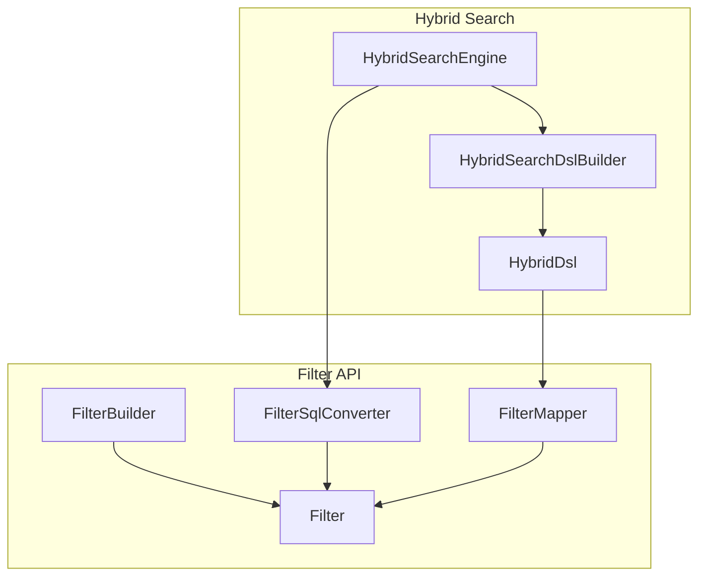
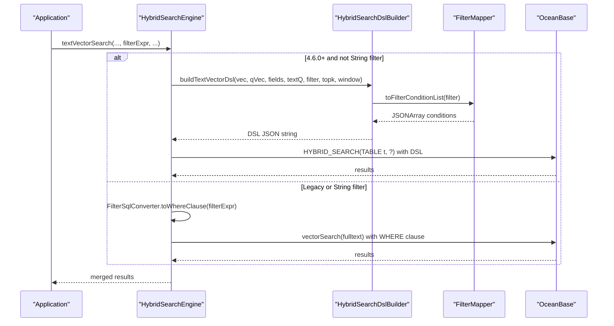
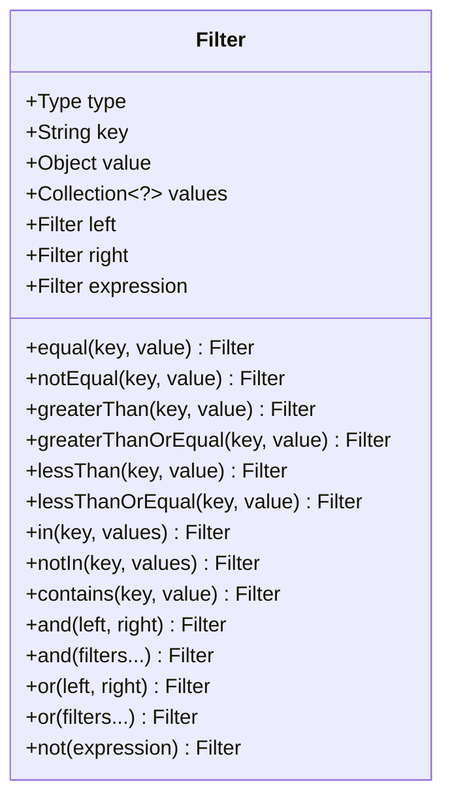
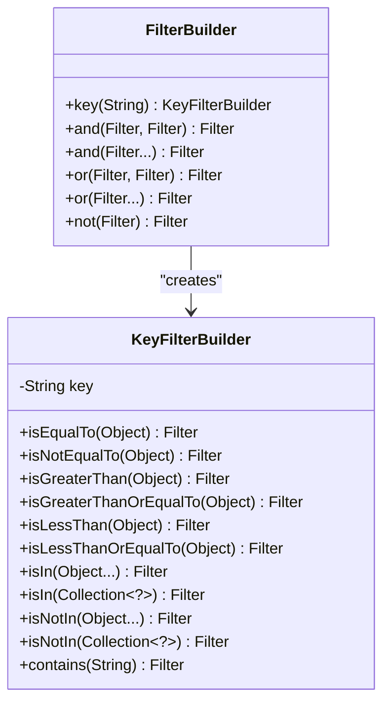
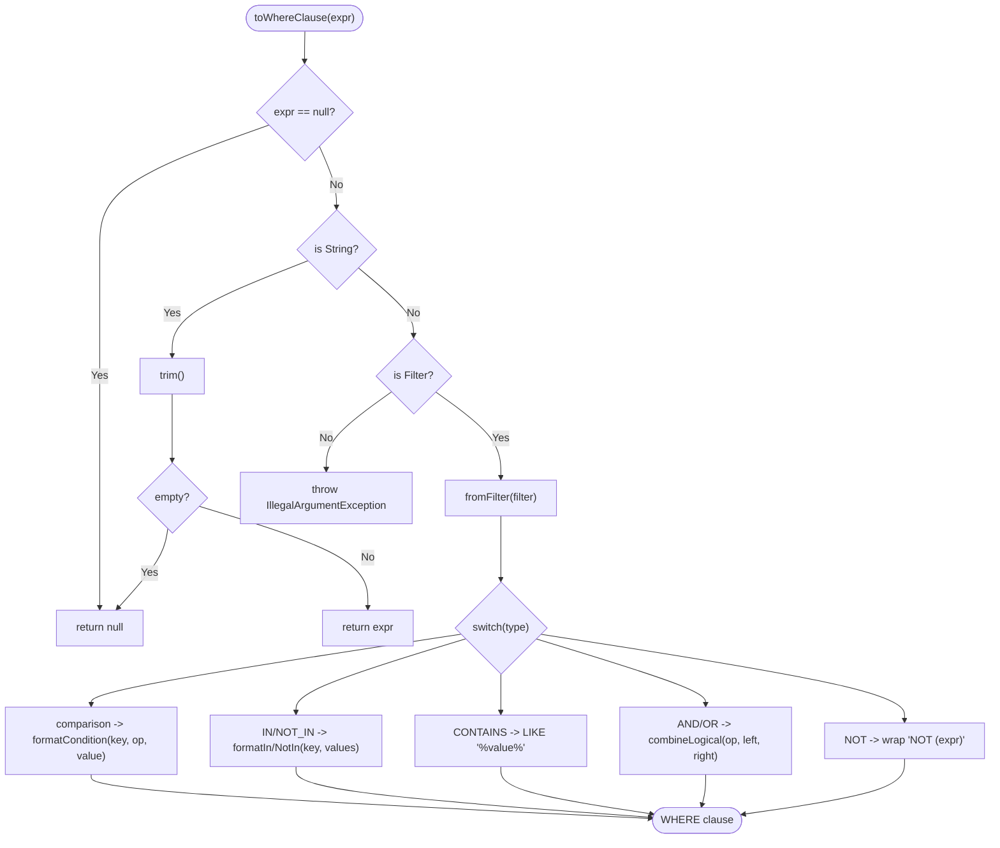
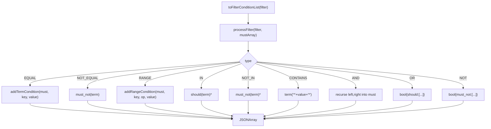
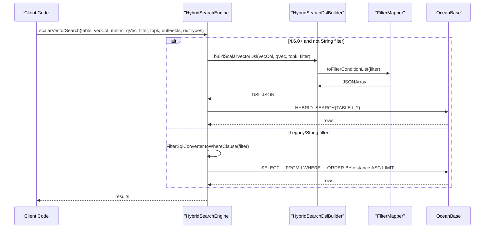
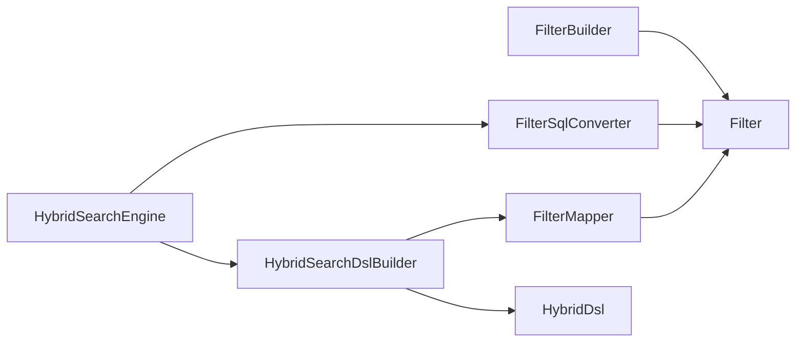

# Filter System and Query Building

<cite>
**Referenced Files in This Document**
- [Filter.java](file://src/main/java/com/oceanbase/obvector4j/filter/Filter.java)
- [FilterBuilder.java](file://src/main/java/com/oceanbase/obvector4j/filter/FilterBuilder.java)
- [FilterSqlConverter.java](file://src/main/java/com/oceanbase/obvector4j/filter/FilterSqlConverter.java)
- [FilterMapper.java](file://src/main/java/com/oceanbase/obvector4j/filter/FilterMapper.java)
- [HybridSearchEngine.java](file://src/main/java/com/oceanbase/obvector4j/hybrid/HybridSearchEngine.java)
- [HybridSearchDslBuilder.java](file://src/main/java/com/oceanbase/obvector4j/hybrid/v460/HybridSearchDslBuilder.java)
- [HybridDsl.java](file://src/main/java/com/oceanbase/obvector4j/hybrid/v460/dsl/HybridDsl.java)
- [04-filter.md](file://docs/en/04-filter.md)
</cite>

## Update Summary
**Changes Made**
- Updated Filter API section to document new varargs support for AND and OR operations
- Added examples showing how to combine multiple filters in single calls
- Enhanced logical composition examples with varargs usage patterns
- Updated API reference to include new overloaded methods
- Added validation requirements and left-associative behavior documentation

## Table of Contents
1. [Introduction](#introduction)
2. [Project Structure](#project-structure)
3. [Core Components](#core-components)
4. [Architecture Overview](#architecture-overview)
5. [Detailed Component Analysis](#detailed-component-analysis)
6. [Dependency Analysis](#dependency-analysis)
7. [Performance Considerations](#performance-considerations)
8. [Troubleshooting Guide](#troubleshooting-guide)
9. [Conclusion](#conclusion)
10. [Appendices](#appendices)

## Introduction
This document explains the filter building system and query construction API for scalar and hybrid search. It covers:
- The fluent FilterBuilder interface for constructing complex boolean logic expressions, comparison operations, and range queries
- The Filter tree structure representation
- Automatic SQL generation with proper escaping via FilterSqlConverter
- Performance optimization strategies
- Comprehensive examples of nested boolean conditions, string matching patterns, numeric comparisons, and null handling
- The role of FilterMapper in translating high-level filters to optimized JSON for OceanBase HYBRID_SEARCH (4.6.0+)
- Common filtering patterns for vector search scenarios and best practices for query performance

## Project Structure
The filter subsystem is implemented under the filter package and integrates with the hybrid search engine and DSL builders.



**Diagram sources**
- [FilterBuilder.java:1-167](file://src/main/java/com/oceanbase/obvector4j/filter/FilterBuilder.java#L1-L167)
- [Filter.java:1-230](file://src/main/java/com/oceanbase/obvector4j/filter/Filter.java#L1-L230)
- [FilterSqlConverter.java:1-119](file://src/main/java/com/oceanbase/obvector4j/filter/FilterSqlConverter.java#L1-L119)
- [FilterMapper.java:1-396](file://src/main/java/com/oceanbase/obvector4j/filter/FilterMapper.java#L1-L396)
- [HybridSearchEngine.java:1-200](file://src/main/java/com/oceanbase/obvector4j/hybrid/HybridSearchEngine.java#L1-L200)
- [HybridSearchDslBuilder.java:1-71](file://src/main/java/com/oceanbase/obvector4j/hybrid/v460/HybridSearchDslBuilder.java#L1-L71)
- [HybridDsl.java:1-200](file://src/main/java/com/oceanbase/obvector4j/hybrid/v460/dsl/HybridDsl.java#L1-L200)

**Section sources**
- [FilterBuilder.java:1-167](file://src/main/java/com/oceanbase/obvector4j/filter/FilterBuilder.java#L1-L167)
- [Filter.java:1-230](file://src/main/java/com/oceanbase/obvector4j/filter/Filter.java#L1-L230)
- [FilterSqlConverter.java:1-119](file://src/main/java/com/oceanbase/obvector4j/filter/FilterSqlConverter.java#L1-L119)
- [FilterMapper.java:1-396](file://src/main/java/com/oceanbase/obvector4j/filter/FilterMapper.java#L1-L396)
- [HybridSearchEngine.java:1-200](file://src/main/java/com/oceanbase/obvector4j/hybrid/HybridSearchEngine.java#L1-L200)
- [HybridSearchDslBuilder.java:1-71](file://src/main/java/com/oceanbase/obvector4j/hybrid/v460/HybridSearchDslBuilder.java#L1-L71)
- [HybridDsl.java:1-200](file://src/main/java/com/oceanbase/obvector4j/hybrid/v460/dsl/HybridDsl.java#L1-L200)

## Core Components
- Filter: Immutable expression tree representing comparison, IN/NOT_IN, CONTAINS, AND/OR/NOT nodes. Provides factory methods for each operation type including new varargs support for combining multiple filters.
- FilterBuilder: Fluent API entry point that builds Filter instances using a key-centric builder pattern and logical combinators with enhanced varargs support.
- FilterSqlConverter: Converts Filter objects or legacy string expressions into SQL WHERE clauses with safe escaping.
- FilterMapper: Translates Filter trees into OceanBase's JSON query format used by HYBRID_SEARCH (4.6.0+), including merging ranges and expanding IN/NOT_IN.
- HybridSearchEngine: Orchestrates execution paths—either via HYBRID_SEARCH DSL (4.6.0+) or legacy SQL—with automatic selection based on version and filter type.
- HybridSearchDslBuilder and HybridDsl: Build typed DSL structures and integrate filters into knn.filter and bool.filter contexts.

Key responsibilities:
- Type-safe expression construction (FilterBuilder + Filter)
- Safe SQL generation (FilterSqlConverter)
- Optimized JSON translation for HYBRID_SEARCH (FilterMapper)
- Version-aware routing between DSL and SQL paths (HybridSearchEngine)

**Section sources**
- [Filter.java:1-230](file://src/main/java/com/oceanbase/obvector4j/filter/Filter.java#L1-L230)
- [FilterBuilder.java:1-167](file://src/main/java/com/oceanbase/obvector4j/filter/FilterBuilder.java#L1-L167)
- [FilterSqlConverter.java:1-119](file://src/main/java/com/oceanbase/obvector4j/filter/FilterSqlConverter.java#L1-L119)
- [FilterMapper.java:1-396](file://src/main/java/com/oceanbase/obvector4j/filter/FilterMapper.java#L1-L396)
- [HybridSearchEngine.java:1-200](file://src/main/java/com/oceanbase/obvector4j/hybrid/HybridSearchEngine.java#L1-L200)
- [HybridSearchDslBuilder.java:1-71](file://src/main/java/com/oceanbase/obvector4j/hybrid/v460/HybridSearchDslBuilder.java#L1-L71)
- [HybridDsl.java:1-200](file://src/main/java/com/oceanbase/obvector4j/hybrid/v460/dsl/HybridDsl.java#L1-L200)

## Architecture Overview
The system supports two execution paths depending on database version and filter type:
- For 4.6.0+ and non-string filters: build a HYBRID_SEARCH DSL and execute via HYBRID_SEARCH(TABLE ... , ?). Filters are mapped to JSON using FilterMapper and integrated into knn.filter and bool.filter.
- Legacy path: convert filters to SQL WHERE clauses via FilterSqlConverter and run traditional vector/fulltext SQL.



**Diagram sources**
- [HybridSearchEngine.java:39-97](file://src/main/java/com/oceanbase/obvector4j/hybrid/HybridSearchEngine.java#L39-L97)
- [HybridSearchDslBuilder.java:29-48](file://src/main/java/com/oceanbase/obvector4j/hybrid/v460/HybridSearchDslBuilder.java#L29-L48)
- [FilterMapper.java:20-27](file://src/main/java/com/oceanbase/obvector4j/filter/FilterMapper.java#L20-L27)
- [FilterSqlConverter.java:14-26](file://src/main/java/com/oceanbase/obvector4j/filter/FilterSqlConverter.java#L14-L26)

## Detailed Component Analysis

### Filter Expression Tree
The Filter class models an immutable binary/unary tree:
- Leaf nodes: comparison operators (EQUAL, NOT_EQUAL, GREATER_THAN, GREATER_THAN_OR_EQUAL, LESS_THAN, LESS_THAN_OR_EQUAL), IN/NOT_IN, CONTAINS
- Internal nodes: AND, OR, NOT with left/right/expression children



**Updated** Added varargs support for and() and or() methods with left-associative behavior and validation requiring at least two filters.

**Diagram sources**
- [Filter.java:14-230](file://src/main/java/com/oceanbase/obvector4j/filter/Filter.java#L14-L230)

**Section sources**
- [Filter.java:14-230](file://src/main/java/com/oceanbase/obvector4j/filter/Filter.java#L14-L230)

### Fluent FilterBuilder Interface
FilterBuilder provides a fluent API with enhanced varargs support:
- Start with a key: FilterBuilder.key("field")
- Chain comparisons: isEqualTo, isNotEqualTo, isGreaterThan, isGreaterThanOrEqualTo, isLessThan, isLessThanOrEqualTo
- Multi-value: isIn, isNotIn
- Text matching: contains
- Logical composition: and, or, not with both binary and varargs support



**Updated** Added varargs support for and() and or() methods allowing combination of multiple filters in single calls.

**Diagram sources**
- [FilterBuilder.java:10-167](file://src/main/java/com/oceanbase/obvector4j/filter/FilterBuilder.java#L10-L167)

**Section sources**
- [FilterBuilder.java:10-167](file://src/main/java/com/oceanbase/obvector4j/filter/FilterBuilder.java#L10-L167)

### Enhanced Logical Operations with Varargs Support

**New Feature** The filter system now supports combining multiple filters in single calls through varargs methods.

#### Left-Associative Behavior
Both `Filter.and(Filter... filters)` and `Filter.or(Filter... filters)` implement left-associative evaluation:
- `Filter.and(a, b, c)` creates `((a AND b) AND c)`
- `Filter.or(a, b, c)` creates `((a OR b) OR c)`

#### Validation Requirements
- At least two filters must be provided
- Throws `IllegalArgumentException` if fewer than two filters are passed
- Validates that all filter parameters are non-null

#### Usage Examples

```java
// Combine three filters with AND
Filter complexFilter = FilterBuilder.and(
    FilterBuilder.key("category_id").isEqualTo(1),
    FilterBuilder.key("price").isGreaterThanOrEqualTo(100.0),
    FilterBuilder.key("status").isEqualTo("active")
);

// Combine multiple OR conditions
Filter categoryFilter = FilterBuilder.or(
    FilterBuilder.key("category_id").isEqualTo(1),
    FilterBuilder.key("category_id").isEqualTo(2),
    FilterBuilder.key("category_id").isEqualTo(3)
);

// Mix with existing binary operations
Filter mixedFilter = FilterBuilder.and(
    FilterBuilder.or(
        FilterBuilder.key("category_id").isEqualTo(1),
        FilterBuilder.key("category_id").isEqualTo(2)
    ),
    FilterBuilder.and(
        FilterBuilder.key("price").isGreaterThanOrEqualTo(100.0),
        FilterBuilder.key("price").isLessThanOrEqualTo(500.0)
    )
);
```

**Section sources**
- [Filter.java:156-194](file://src/main/java/com/oceanbase/obvector4j/filter/Filter.java#L156-L194)
- [FilterBuilder.java:33-62](file://src/main/java/com/oceanbase/obvector4j/filter/FilterBuilder.java#L33-L62)

### SQL Generation with FilterSqlConverter
FilterSqlConverter converts either a raw string or a Filter tree into a SQL WHERE clause:
- Handles all comparison types, IN/NOT_IN, CONTAINS (mapped to LIKE '%...%')
- Escapes single quotes and backslashes in string literals
- Wraps logical combinations with parentheses for safety



**Diagram sources**
- [FilterSqlConverter.java:14-119](file://src/main/java/com/oceanbase/obvector4j/filter/FilterSqlConverter.java#L14-L119)

**Section sources**
- [FilterSqlConverter.java:14-119](file://src/main/java/com/oceanbase/obvector4j/filter/FilterSqlConverter.java#L14-L119)

### JSON Mapping for HYBRID_SEARCH with FilterMapper
FilterMapper translates Filter trees into JSON suitable for HYBRID_SEARCH knn.filter and bool.filter:
- Equality maps to term
- Range operators map to range with gte/lte/gt/lt; multiple ranges on the same field are merged
- IN expands to should array; NOT_IN to must_not array
- AND flattens into must list; OR wraps in bool.should; NOT wraps in bool.must_not
- CONTAINS uses wildcard-like term semantics



**Diagram sources**
- [FilterMapper.java:20-396](file://src/main/java/com/oceanbase/obvector4j/filter/FilterMapper.java#L20-L396)

**Section sources**
- [FilterMapper.java:20-396](file://src/main/java/com/oceanbase/obvector4j/filter/FilterMapper.java#L20-L396)

### Integration with Hybrid Search Engines
HybridSearchEngine selects the optimal path:
- If 4.6.0+ and filter is not a raw string: use HybridSearchDslBuilder to produce DSL JSON, then execute via HYBRID_SEARCH(TABLE ... , ?)
- Otherwise: convert filter to WHERE clause via FilterSqlConverter and run legacy SQL paths



**Diagram sources**
- [HybridSearchEngine.java:74-97](file://src/main/java/com/oceanbase/obvector4j/hybrid/HybridSearchEngine.java#L74-L97)
- [HybridSearchDslBuilder.java:18-27](file://src/main/java/com/oceanbase/obvector4j/hybrid/v460/HybridSearchDslBuilder.java#L18-L27)
- [FilterMapper.java:20-27](file://src/main/java/com/oceanbase/obvector4j/filter/FilterMapper.java#L20-L27)
- [FilterSqlConverter.java:14-26](file://src/main/java/com/oceanbase/obvector4j/filter/FilterSqlConverter.java#L14-L26)

**Section sources**
- [HybridSearchEngine.java:74-97](file://src/main/java/com/oceanbase/obvector4j/hybrid/HybridSearchEngine.java#L74-L97)
- [HybridSearchDslBuilder.java:18-27](file://src/main/java/com/oceanbase/obvector4j/hybrid/v460/HybridSearchDslBuilder.java#L18-L27)
- [FilterMapper.java:20-27](file://src/main/java/com/oceanbase/obvector4j/filter/FilterMapper.java#L20-L27)
- [FilterSqlConverter.java:14-26](file://src/main/java/com/oceanbase/obvector4j/filter/FilterSqlConverter.java#L14-L26)

## Dependency Analysis
High-level dependencies among components:
- FilterBuilder depends on Filter factories
- FilterSqlConverter depends on Filter
- FilterMapper depends on Filter
- HybridSearchEngine depends on FilterSqlConverter and HybridSearchDslBuilder
- HybridSearchDslBuilder depends on HybridDsl and FilterMapper



**Diagram sources**
- [FilterBuilder.java:10-167](file://src/main/java/com/oceanbase/obvector4j/filter/FilterBuilder.java#L10-L167)
- [Filter.java:14-230](file://src/main/java/com/oceanbase/obvector4j/filter/Filter.java#L14-L230)
- [FilterSqlConverter.java:14-119](file://src/main/java/com/oceanbase/obvector4j/filter/FilterSqlConverter.java#L14-L119)
- [FilterMapper.java:20-396](file://src/main/java/com/oceanbase/obvector4j/filter/FilterMapper.java#L20-L396)
- [HybridSearchEngine.java:39-97](file://src/main/java/com/oceanbase/obvector4j/hybrid/HybridSearchEngine.java#L39-L97)
- [HybridSearchDslBuilder.java:18-48](file://src/main/java/com/oceanbase/obvector4j/hybrid/v460/HybridSearchDslBuilder.java#L18-L48)
- [HybridDsl.java:1-200](file://src/main/java/com/oceanbase/obvector4j/hybrid/v460/dsl/HybridDsl.java#L1-L200)

**Section sources**
- [FilterBuilder.java:10-167](file://src/main/java/com/oceanbase/obvector4j/filter/FilterBuilder.java#L10-L167)
- [Filter.java:14-230](file://src/main/java/com/oceanbase/obvector4j/filter/Filter.java#L14-L230)
- [FilterSqlConverter.java:14-119](file://src/main/java/com/oceanbase/obvector4j/filter/FilterSqlConverter.java#L14-L119)
- [FilterMapper.java:20-396](file://src/main/java/com/oceanbase/obvector4j/filter/FilterMapper.java#L20-L396)
- [HybridSearchEngine.java:39-97](file://src/main/java/com/oceanbase/obvector4j/hybrid/HybridSearchEngine.java#L39-L97)
- [HybridSearchDslBuilder.java:18-48](file://src/main/java/com/oceanbase/obvector4j/hybrid/v460/HybridSearchDslBuilder.java#L18-L48)
- [HybridDsl.java:1-200](file://src/main/java/com/oceanbase/obvector4j/hybrid/v460/dsl/HybridDsl.java#L1-L200)

## Performance Considerations
- Prefer HYBRID_SEARCH DSL path (4.6.0+) when possible: it leverages native JSON-based filtering and can be more efficient than ad-hoc SQL WHERE clauses.
- Use IN instead of multiple ORs: FilterMapper expands IN into should arrays which are optimized by the server.
- Merge range conditions: FilterMapper merges multiple range constraints on the same field into a single range object, reducing complexity.
- Avoid excessive nesting: deep boolean trees increase JSON size and parsing overhead. Keep nesting reasonable.
- Choose appropriate topk and rankWindowSize: larger windows improve recall but increase computation; tune per workload.
- Ensure type correctness: mismatched types may prevent index usage or cause conversions at runtime.
- **Varargs efficiency**: Using varargs methods reduces method call overhead compared to chaining multiple binary operations.

## Troubleshooting Guide
Common issues and resolutions:
- Invalid filter expression type: passing unsupported types to FilterSqlConverter throws an exception. Ensure you pass either a valid Filter or a well-formed string expression.
- Empty or null keys: Filter constructors and mappers validate keys; empty or null keys raise exceptions. Always provide non-empty field names.
- Null values in comparisons: Filter disallows null values except for NOT_EQUAL. Use explicit checks if your schema allows NULLs.
- String escaping: FilterSqlConverter escapes single quotes and backslashes. If you construct raw strings, ensure they are properly escaped.
- Unsupported filter types: Unknown Filter.Type values result in unsupported operation errors. Stick to documented operations.
- **Varargs validation errors**: When using varargs methods, ensure at least two filters are provided. Passing fewer than two filters will throw IllegalArgumentException.
- **Left-associative behavior**: Remember that varargs methods are left-associative. Complex expressions may need explicit grouping with parentheses for clarity.

**Section sources**
- [Filter.java:45-110](file://src/main/java/com/oceanbase/obvector4j/filter/Filter.java#L45-L110)
- [Filter.java:163-194](file://src/main/java/com/oceanbase/obvector4j/filter/Filter.java#L163-L194)
- [FilterSqlConverter.java:14-26](file://src/main/java/com/oceanbase/obvector4j/filter/FilterSqlConverter.java#L14-L26)
- [FilterMapper.java:224-237](file://src/main/java/com/oceanbase/obvector4j/filter/FilterMapper.java#L224-L237)

## Conclusion
The filter system offers a robust, type-safe way to express scalar filters for vector and hybrid search. FilterBuilder enables readable, composable expressions with enhanced varargs support for combining multiple filters efficiently. FilterSqlConverter ensures safe SQL generation; FilterMapper optimizes filters for HYBRID_SEARCH JSON. By following best practices—using IN over OR, merging ranges, avoiding deep nesting, leveraging the DSL path, and utilizing varargs methods for cleaner code—you can achieve clear APIs and strong query performance.

## Appendices

### Examples and Patterns
- Nested boolean conditions: Combine AND/OR/NOT to model complex business rules. See documentation examples for multi-condition combinations.
- String matching patterns: Use contains for substring matches; note that CONTAINS maps to LIKE '%...%' in SQL and wildcard-like terms in JSON.
- Numeric comparisons: Use greater-than/less-than variants to define ranges; multiple ranges on the same field are merged automatically.
- Null handling: Current implementation does not support explicit NULL checks; plan accordingly in application logic.
- **Varargs patterns**: Use varargs methods for combining multiple filters in single calls:
  ```java
  // Multiple AND conditions
  Filter filter = FilterBuilder.and(
      FilterBuilder.key("category_id").isEqualTo(1),
      FilterBuilder.key("price").isGreaterThanOrEqualTo(100.0),
      FilterBuilder.key("status").isEqualTo("active"),
      FilterBuilder.key("rating").isGreaterThanOrEqualTo(4.0)
  );
  
  // Multiple OR conditions
  Filter categoryFilter = FilterBuilder.or(
      FilterBuilder.key("category_id").isEqualTo(1),
      FilterBuilder.key("category_id").isEqualTo(2),
      FilterBuilder.key("category_id").isEqualTo(3)
  );
  ```

For comprehensive examples and migration guidance from string expressions to the Filter API, refer to the official documentation.

**Section sources**
- [04-filter.md:1-553](file://docs/en/04-filter.md#L1-L553)
- [Filter.java:156-194](file://src/main/java/com/oceanbase/obvector4j/filter/Filter.java#L156-L194)
- [FilterBuilder.java:33-62](file://src/main/java/com/oceanbase/obvector4j/filter/FilterBuilder.java#L33-L62)