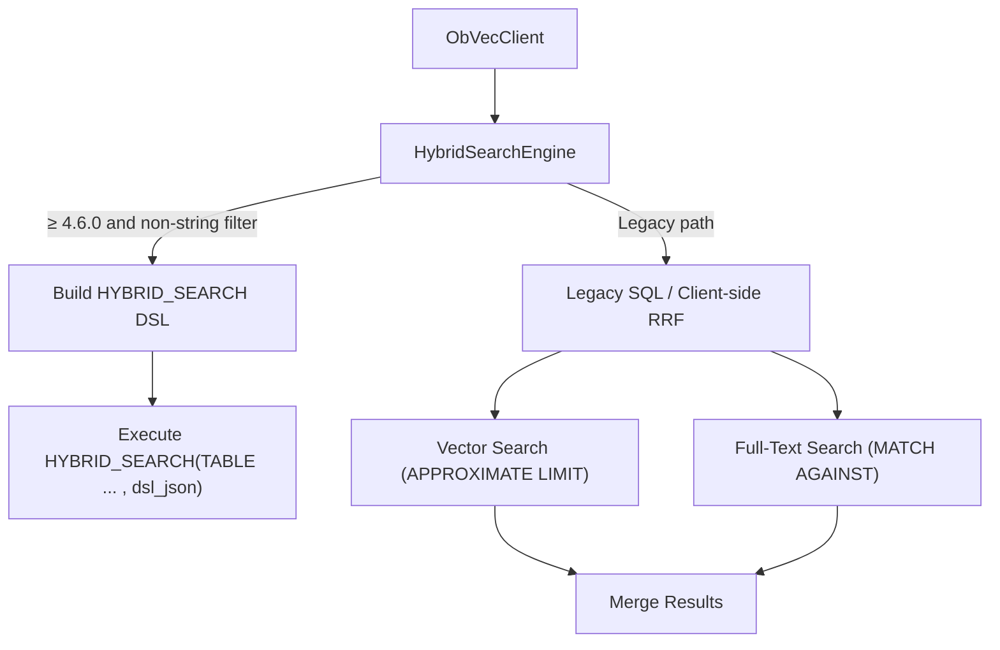
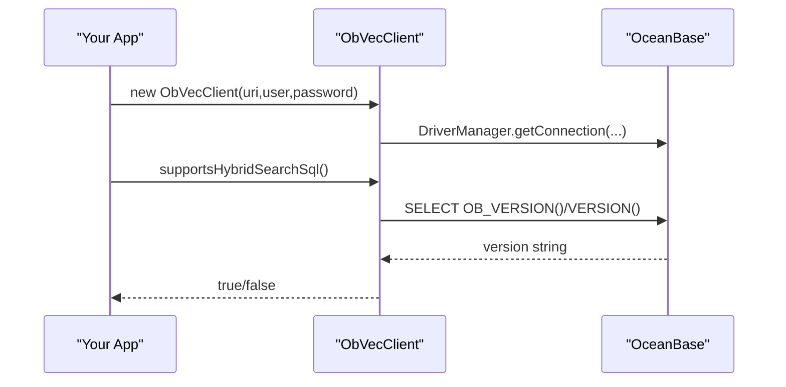
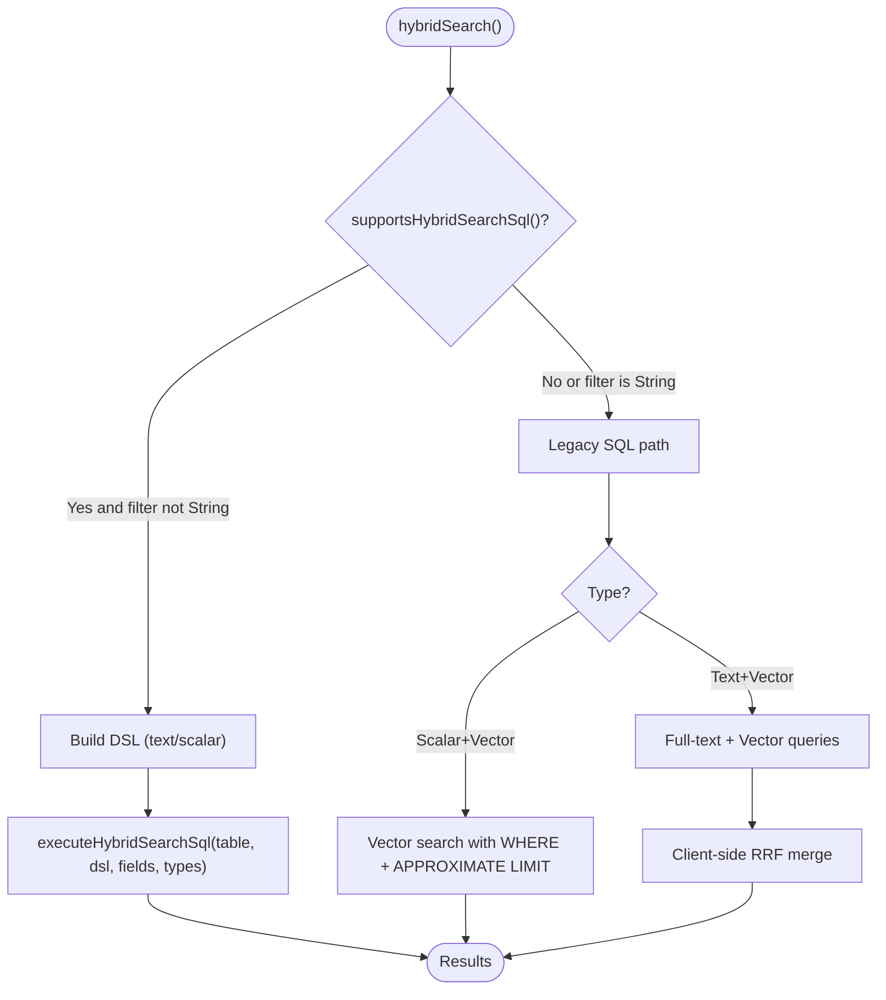
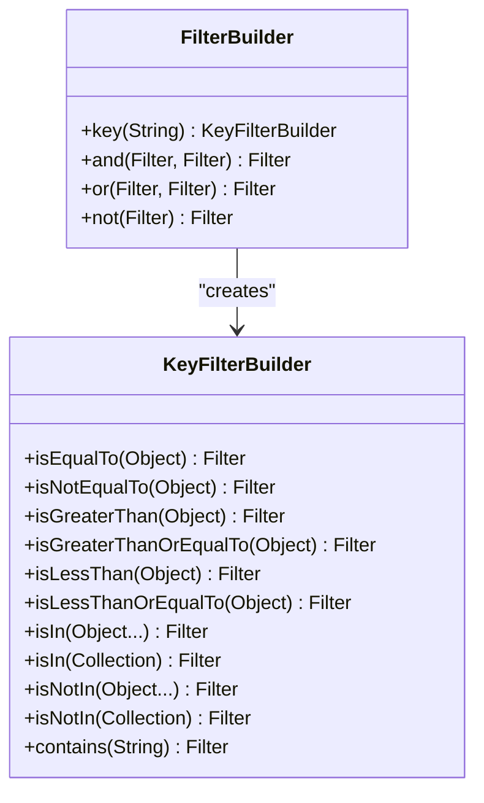
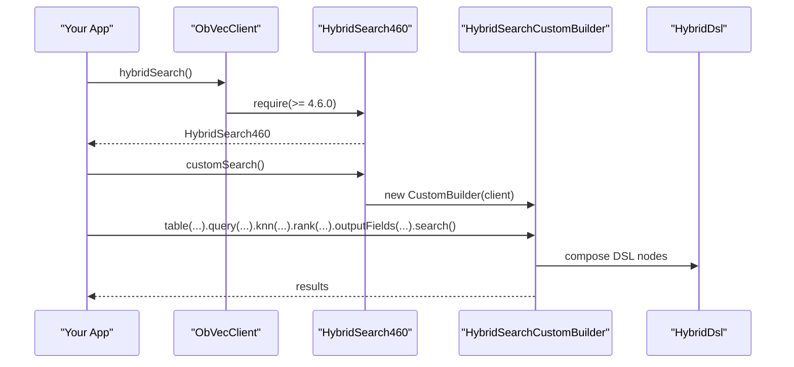
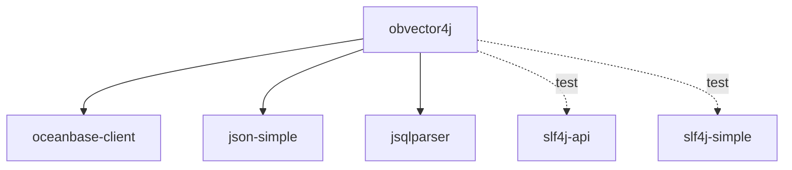

# Getting Started

<cite>
**Referenced Files in This Document**
- [README.md](file://README.md)
- [pom.xml](file://pom.xml)
- [docs/en/getting-started.md](file://docs/en/getting-started.md)
- [docs/zh/快速入门.md](file://docs/zh/快速入门.md)
- [ObVecClient.java](file://src/main/java/com/oceanbase/obvector4j/ObVecClient.java)
- [HybridSearchEngine.java](file://src/main/java/com/oceanbase/obvector4j/hybrid/HybridSearchEngine.java)
- [FilterBuilder.java](file://src/main/java/com/oceanbase/obvector4j/filter/FilterBuilder.java)
- [OceanBaseVersion.java](file://src/main/java/com/oceanbase/obvector4j/version/OceanBaseVersion.java)
- [HybridDsl.java](file://src/main/java/com/oceanbase/obvector4j/hybrid/core/dsl/HybridDsl.java)
- [VecClientTest.java](file://src/test/java/com/oceanbase/obvector4j/integration/container/VecClientTest.java)
- [OceanBaseTestSupport.java](file://src/test/java/com/oceanbase/obvector4j/support/OceanBaseTestSupport.java)
</cite>

## Update Summary
**Changes Made**
- Updated installation section to reflect current stable version 1.0.0 (rolled back from 1.0.7)
- Verified all Maven dependency examples reference version 1.0.0 consistently
- Confirmed documentation alignment with actual codebase version

## Table of Contents
1. [Introduction](#introduction)
2. [Prerequisites](#prerequisites)
3. [Installation](#installation)
4. [Connect and Configure](#connect-and-configure)
5. [Quick Examples](#quick-examples)
6. [Architecture Overview](#architecture-overview)
7. [Detailed Component Analysis](#detailed-component-analysis)
8. [Dependency Analysis](#dependency-analysis)
9. [Performance Considerations](#performance-considerations)
10. [Troubleshooting Guide](#troubleshooting-guide)
11. [Conclusion](#conclusion)

## Introduction
This guide helps you get started with OceanBase Vector4J Java SDK (obvector4j). You will learn how to install the SDK, connect to an OceanBase MySQL mode instance, and run quick examples for vector similarity search and hybrid search (scalar+vector and text+vector). It also covers version compatibility, security best practices for credentials, and troubleshooting tips for common setup issues.

## Prerequisites
- OceanBase cluster running in MySQL mode
- JDBC driver: oceanbase-client is required by the SDK
- Version compatibility:
  - Native HYBRID_SEARCH SQL requires OceanBase ≥ 4.6.0
  - The SDK automatically detects support and falls back to legacy paths when needed

Key references:
- Requirements and native hybrid search note are documented at the top-level README
- Version gating logic and minimum version constant are defined in the version utility
- Hybrid search overview and behavior differences across versions are explained in the hybrid search documentation

**Section sources**
- [README.md:5](file://README.md#L5)
- [pom.xml:27-31](file://pom.xml#L27-L31)
- [OceanBaseVersion.java:11-13](file://src/main/java/com/oceanbase/obvector4j/version/OceanBaseVersion.java#L11-L13)

## Installation
Add the obvector4j dependency to your Maven project using the group ID, artifact ID, and version provided in the repository. Alternatively, build from source using Maven.

**Updated** Current stable release is version 1.0.0 (rolled back from 1.0.7)

Steps:
- Add the dependency to your pom.xml
- Or clone the repository and run mvn install to build locally

```xml
<dependency>
  <groupId>com.oceanbase</groupId>
  <artifactId>obvector4j</artifactId>
  <version>1.0.0</version>
</dependency>
```

References:
- Dependency coordinates and version are shown in the root README and POM
- Build instructions are included in the root README

**Section sources**
- [README.md:18-24](file://README.md#L18-L24)
- [pom.xml:3-6](file://pom.xml#L3-L6)
- [docs/en/getting-started.md:20-26](file://docs/en/getting-started.md#L20-L26)

## Connect and Configure
Create a client instance by providing the JDBC URI, user, and password. For security, read these values from environment variables or a secrets manager; do not hardcode them in code.

Recommended environment variables:
- OCEANBASE_URI: jdbc:oceanbase://<host>:<port>/<database>
- OCEANBASE_USER: database user
- OCEANBASE_PASSWORD: database password

The ObVecClient constructor uses DriverManager to establish a connection.

Security best practices:
- Never commit credentials to source control
- Use environment variables or a secure secrets manager
- Restrict network access to the OceanBase cluster
- Use least-privilege database accounts for application use

**Section sources**
- [README.md:34-43](file://README.md#L34-L43)
- [ObVecClient.java:37-45](file://src/main/java/com/oceanbase/obvector4j/ObVecClient.java#L37-L45)

## Quick Examples
Below are concise examples demonstrating both scalar+vector and text+vector hybrid search patterns. These mirror the examples in the getting started docs and README.

Scalar + vector (with Filter):
- Use FilterBuilder to create conditions
- Call scalarVectorSearch() builder and execute

Text + vector (RRF):
- Use textVectorSearch() builder
- Provide text fields and query string
- Optionally set rankWindowSize for RRF

Custom HYBRID_SEARCH DSL (4.6.0+):
- Use hybridSearch().customSearch()
- Compose query, knn, and rank sections
- Execute via .search()

For full syntax and examples, see the getting started and hybrid search guides.

**Section sources**
- [README.md:47-74](file://README.md#L47-L74)
- [docs/en/getting-started.md:59-109](file://docs/en/getting-started.md#L59-L109)

## Architecture Overview
At runtime, the SDK chooses between two implementation paths based on the connected OceanBase version:
- If OceanBase ≥ 4.6.0 and the filter expression is not a raw SQL string, the SDK builds a HYBRID_SEARCH JSON DSL and executes it via the native SQL interface
- Otherwise, it falls back to legacy paths:
  - Scalar + vector: WHERE clause combined with APPROXIMATE LIMIT vector search
  - Text + vector: dual queries (full-text and vector) merged client-side using Reciprocal Rank Fusion (RRF)



**Diagram sources**
- [ObVecClient.java:47-62](file://src/main/java/com/oceanbase/obvector4j/ObVecClient.java#L47-L62)
- [HybridSearchEngine.java:39-97](file://src/main/java/com/oceanbase/obvector4j/hybrid/HybridSearchEngine.java#L39-L97)
- [HybridSearchEngine.java:114-143](file://src/main/java/com/oceanbase/obvector4j/hybrid/HybridSearchEngine.java#L114-L143)
- [HybridSearchEngine.java:145-198](file://src/main/java/com/oceanbase/obvector4j/hybrid/HybridSearchEngine.java#L145-L198)
- [HybridSearchEngine.java:213-279](file://src/main/java/com/oceanbase/obvector4j/hybrid/HybridSearchEngine.java#L213-L279)

## Detailed Component Analysis

### Connection and Version Detection
- ObVecClient establishes a JDBC connection and caches the detected OceanBase version
- supportsHybridSearchSql() checks if the cluster meets the minimum version for native HYBRID_SEARCH SQL
- hybridSearch460() returns a DSL entry point only when supported; otherwise, it throws



**Diagram sources**
- [ObVecClient.java:37-45](file://src/main/java/com/oceanbase/obvector4j/ObVecClient.java#L37-L45)
- [ObVecClient.java:377-413](file://src/main/java/com/oceanbase/obvector4j/ObVecClient.java#L377-L413)
- [OceanBaseVersion.java:33-52](file://src/main/java/com/oceanbase/obvector4j/version/OceanBaseVersion.java#L33-L52)

**Section sources**
- [ObVecClient.java:37-45](file://src/main/java/com/oceanbase/obvector4j/ObVecClient.java#L37-L45)
- [ObVecClient.java:377-413](file://src/main/java/com/oceanbase/obvector4j/ObVecClient.java#L377-L413)
- [OceanBaseVersion.java:11-13](file://src/main/java/com/oceanbase/obvector4j/version/OceanBaseVersion.java#L11-L13)

### Hybrid Search Engine
- Orchestrates execution path selection based on version and filter type
- Builds HYBRID_SEARCH DSL when supported and executes via prepared statement
- Falls back to legacy SQL for scalar+vector and text+vector merging



**Diagram sources**
- [HybridSearchEngine.java:39-97](file://src/main/java/com/oceanbase/obvector4j/hybrid/HybridSearchEngine.java#L39-L97)
- [HybridSearchEngine.java:114-143](file://src/main/java/com/oceanbase/obvector4j/hybrid/HybridSearchEngine.java#L114-L143)
- [HybridSearchEngine.java:145-198](file://src/main/java/com/oceanbase/obvector4j/hybrid/HybridSearchEngine.java#L145-L198)
- [HybridSearchEngine.java:213-279](file://src/main/java/com/oceanbase/obvector4j/hybrid/HybridSearchEngine.java#L213-L279)

**Section sources**
- [HybridSearchEngine.java:39-97](file://src/main/java/com/oceanbase/obvector4j/hybrid/HybridSearchEngine.java#L39-L97)
- [HybridSearchEngine.java:114-143](file://src/main/java/com/oceanbase/obvector4j/hybrid/HybridSearchEngine.java#L114-L143)

### Filter API
- Provides a fluent, type-safe way to construct scalar filters
- Supports equality, inequality, comparison, IN/NOT IN, contains, and logical AND/OR/NOT
- Filters can be used with both scalar+vector and text+vector searches



**Diagram sources**
- [FilterBuilder.java:10-146](file://src/main/java/com/oceanbase/obvector4j/filter/FilterBuilder.java#L10-L146)

**Section sources**
- [FilterBuilder.java:10-146](file://src/main/java/com/oceanbase/obvector4j/filter/FilterBuilder.java#L10-L146)

### HYBRID_SEARCH DSL (4.6.0+)
- Entry point via ObVecClient.hybridSearch()
- Fluent builder customSearch() composes query, knn, and rank sections
- HybridDsl provides helpers for match, multi_match, match_phrase, query_string, term/range/terms, JSON/array operations, bool, knn, and rank fusion



**Diagram sources**
- [ObVecClient.java:594-601](file://src/main/java/com/oceanbase/obvector4j/ObVecClient.java#L594-L601)
- [HybridDsl.java:175-200](file://src/main/java/com/oceanbase/obvector4j/hybrid/core/dsl/HybridDsl.java#L175-L200)

**Section sources**
- [ObVecClient.java:594-601](file://src/main/java/com/oceanbase/obvector4j/ObVecClient.java#L594-L601)
- [HybridDsl.java:175-200](file://src/main/java/com/oceanbase/obvector4j/hybrid/core/dsl/HybridDsl.java#L175-L200)

## Dependency Analysis
Core runtime dependencies:
- oceanbase-client: JDBC driver for OceanBase
- json-simple: JSON building for DSL
- jsqlparser: SQL parsing utilities
- slf4j-api and slf4j-simple: logging (test scope)



**Diagram sources**
- [pom.xml:27-74](file://pom.xml#L27-L74)

**Section sources**
- [pom.xml:27-74](file://pom.xml#L27-L74)

## Performance Considerations
- Choose appropriate metrics:
  - cosine for normalized vectors
  - l2 for general similarity
  - ip for inner product
- Ensure indexes exist:
  - Vector index on the vector column
  - Full-text index on text columns used in text+vector search
- Tune HNSW ef_search variable for recall vs latency trade-offs
- Select suitable topk and rankWindowSize for RRF-based merges

[No sources needed since this section provides general guidance]

## Troubleshooting Guide
Common issues and resolutions:
- Missing environment variables:
  - Ensure OCEANBASE_URI, OCEANBASE_USER, OCEANBASE_PASSWORD are set before starting your app
- Unsupported HYBRID_SEARCH SQL:
  - If OceanBase < 4.6.0, native DSL methods throw; use legacy builder APIs instead
- Index not ready:
  - After creating vector/full-text indexes, wait briefly before searching
- Incorrect metric or vector literal:
  - Validate metric type and ensure vector dimensions match schema
- Output field mismatch:
  - Ensure outputFields count matches expected data types or let the SDK infer types

Useful references:
- Environment variables and remote integration tests configuration
- Test support utilities for building JDBC URIs and reading env vars
- Integration test showing basic CRUD and HNSW settings

**Section sources**
- [README.md:100-112](file://README.md#L100-L112)
- [OceanBaseTestSupport.java:42-57](file://src/test/java/com/oceanbase/obvector4j/support/OceanBaseTestSupport.java#L42-L57)
- [VecClientTest.java:60-185](file://src/test/java/com/oceanbase/obvector4j/integration/container/VecClientTest.java#L60-L185)

## Conclusion
You now have the essentials to install, connect, and run vector similarity and hybrid search queries with OceanBase Vector4J Java SDK. For advanced usage, explore the DSL syntax and filter API references, and consult the architecture and hybrid search guides for deeper insights.

[No sources needed since this section summarizes without analyzing specific files]