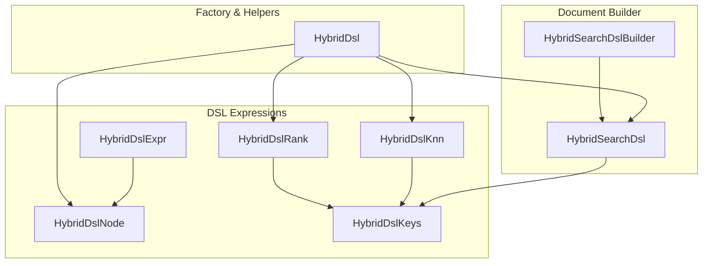
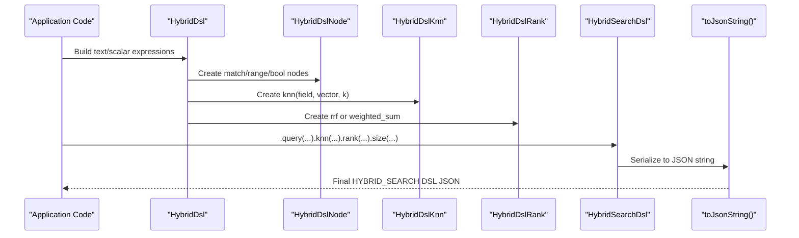
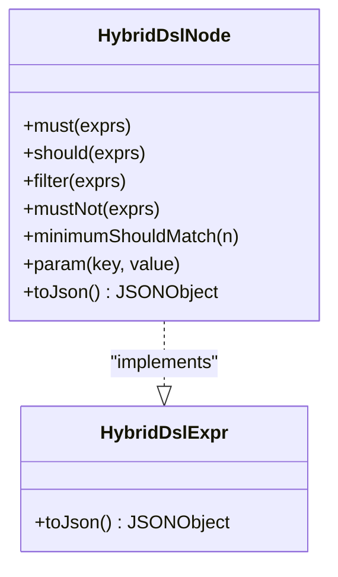
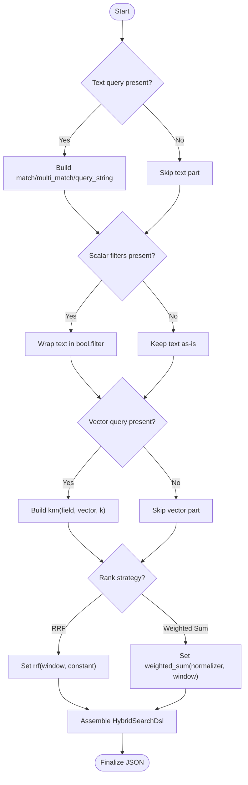
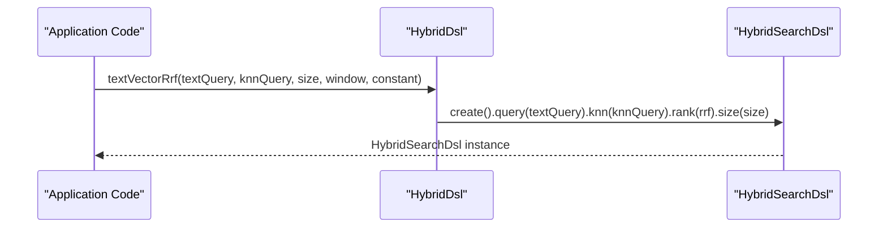
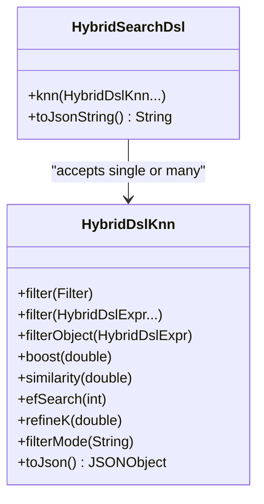
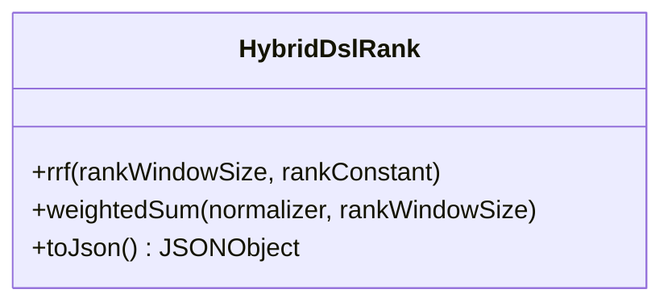
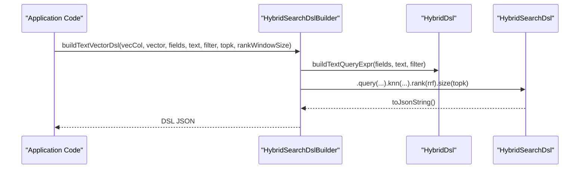
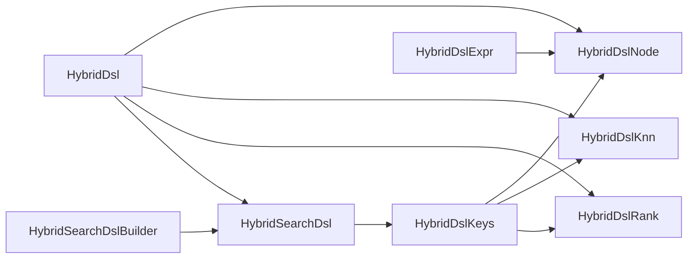

# Advanced Query Patterns and Composition

<cite>
**Referenced Files in This Document**
- [HybridDsl.java](file://src/main/java/com/oceanbase/obvector4j/hybrid/core/dsl/HybridDsl.java)
- [HybridDslExpr.java](file://src/main/java/com/oceanbase/obvector4j/hybrid/core/dsl/HybridDslExpr.java)
- [HybridDslNode.java](file://src/main/java/com/oceanbase/obvector4j/hybrid/core/dsl/HybridDslNode.java)
- [HybridDslKnn.java](file://src/main/java/com/oceanbase/obvector4j/hybrid/core/dsl/HybridDslKnn.java)
- [HybridDslRank.java](file://src/main/java/com/oceanbase/obvector4j/hybrid/core/dsl/HybridDslRank.java)
- [HybridDslKeys.java](file://src/main/java/com/oceanbase/obvector4j/hybrid/core/dsl/HybridDslKeys.java)
- [HybridSearchDsl.java](file://src/main/java/com/oceanbase/obvector4j/hybrid/core/HybridSearchDsl.java)
- [HybridSearchDslBuilder.java](file://src/main/java/com/oceanbase/obvector4j/hybrid/core/HybridSearchDslBuilder.java)
- [05-hybrid-search-dsl.md](file://docs/en/05-hybrid-search-dsl.md)
</cite>

## Table of Contents
1. Introduction
2. Project Structure
3. Core Components
4. Architecture Overview
5. Detailed Component Analysis
6. Dependency Analysis
7. Performance Considerations
8. Troubleshooting Guide
9. Conclusion

## Introduction
This document explains advanced query composition patterns and complex multi-modal search scenarios using the HYBRID_SEARCH DSL provided by the SDK. It focuses on:
- Building bool queries to combine multiple conditions
- Constructing nested query structures
- Dynamically composing queries at runtime based on parameters
- Using pre-built helpers for common hybrid search patterns (textVectorRrf, textVectorWeightedSum)
- Optimization techniques and debugging strategies for complex DSL expressions
- Production best practices and performance considerations

The guidance is grounded in the actual implementation classes and documentation included in the repository.

## Project Structure
The HYBRID_SEARCH DSL lives under the core package with a clear separation between expression building, top-level document assembly, and helper builders.

**Diagram sources**
- [HybridDslExpr.java:1-13](file://src/main/java/com/oceanbase/obvector4j/hybrid/core/dsl/HybridDslExpr.java#L1-L13)
- [HybridDslNode.java:1-267](file://src/main/java/com/oceanbase/obvector4j/hybrid/core/dsl/HybridDslNode.java#L1-L267)
- [HybridDslKnn.java:1-101](file://src/main/java/com/oceanbase/obvector4j/hybrid/core/dsl/HybridDslKnn.java#L1-L101)
- [HybridDslRank.java:1-48](file://src/main/java/com/oceanbase/obvector4j/hybrid/core/dsl/HybridDslRank.java#L1-L48)
- [HybridDslKeys.java:1-134](file://src/main/java/com/oceanbase/obvector4j/hybrid/core/dsl/HybridDslKeys.java#L1-L134)
- [HybridSearchDsl.java:1-254](file://src/main/java/com/oceanbase/obvector4j/hybrid/core/HybridSearchDsl.java#L1-L254)
- [HybridSearchDslBuilder.java:1-71](file://src/main/java/com/oceanbase/obvector4j/hybrid/core/HybridSearchDslBuilder.java#L1-L71)
- [HybridDsl.java:1-237](file://src/main/java/com/oceanbase/obvector4j/hybrid/core/dsl/HybridDsl.java#L1-L237)

**Section sources**
- [HybridDsl.java:1-237](file://src/main/java/com/oceanbase/obvector4j/hybrid/core/dsl/HybridDsl.java#L1-L237)
- [HybridSearchDsl.java:1-254](file://src/main/java/com/oceanbase/obvector4j/hybrid/core/HybridSearchDsl.java#L1-L254)
- [HybridSearchDslBuilder.java:1-71](file://src/main/java/com/oceanbase/obvector4j/hybrid/core/HybridSearchDslBuilder.java#L1-L71)
- [05-hybrid-search-dsl.md:1-447](file://docs/en/05-hybrid-search-dsl.md#L1-L447)

## Core Components
- HybridDslExpr: Interface representing any DSL expression that serializes to JSON.
- HybridDslNode: Universal node builder supporting match, multi_match, match_phrase, query_string, term, range, terms, json_* and array_* operators; also supports bool composition via must/should/filter/must_not and minimum_should_match.
- HybridDslKnn: Builds knn sections including filter, boost, similarity, and search_options (ef_search, refine_k, filter_mode).
- HybridDslRank: Builds rank fusion options (rrf or weighted_sum with normalizer and optional rank_window_size).
- HybridSearchDsl: Mutable top-level document builder that assembles query, knn, rank, from, size, min_score and can merge additional keys.
- HybridDsl: Factory methods for common expressions and convenience helpers like textVectorRrf and textVectorWeightedSum.
- HybridSearchDslBuilder: Higher-level builders for scalar-vector and text-vector searches, including automatic RRF setup and filter integration.

Key responsibilities:
- Expression construction and validation
- Top-level document assembly and serialization
- Predefined helpers for frequent hybrid patterns
- Integration with Filter objects into both query.filter and knn.filter

**Section sources**
- [HybridDslExpr.java:1-13](file://src/main/java/com/oceanbase/obvector4j/hybrid/core/dsl/HybridDslExpr.java#L1-L13)
- [HybridDslNode.java:1-267](file://src/main/java/com/oceanbase/obvector4j/hybrid/core/dsl/HybridDslNode.java#L1-L267)
- [HybridDslKnn.java:1-101](file://src/main/java/com/oceanbase/obvector4j/hybrid/core/dsl/HybridDslKnn.java#L1-L101)
- [HybridDslRank.java:1-48](file://src/main/java/com/oceanbase/obvector4j/hybrid/core/dsl/HybridDslRank.java#L1-L48)
- [HybridSearchDsl.java:1-254](file://src/main/java/com/oceanbase/obvector4j/hybrid/core/HybridSearchDsl.java#L1-L254)
- [HybridDsl.java:1-237](file://src/main/java/com/oceanbase/obvector4j/hybrid/core/dsl/HybridDsl.java#L1-L237)
- [HybridSearchDslBuilder.java:1-71](file://src/main/java/com/oceanbase/obvector4j/hybrid/core/HybridSearchDslBuilder.java#L1-L71)

## Architecture Overview
The system composes a HYBRID_SEARCH JSON document through typed builders and then serializes it for execution. The factory layer provides convenient shortcuts for common patterns.

**Diagram sources**
- [HybridDsl.java:1-237](file://src/main/java/com/oceanbase/obvector4j/hybrid/core/dsl/HybridDsl.java#L1-L237)
- [HybridDslNode.java:1-267](file://src/main/java/com/oceanbase/obvector4j/hybrid/core/dsl/HybridDslNode.java#L1-L267)
- [HybridDslKnn.java:1-101](file://src/main/java/com/oceanbase/obvector4j/hybrid/core/dsl/HybridDslKnn.java#L1-L101)
- [HybridDslRank.java:1-48](file://src/main/java/com/oceanbase/obvector4j/hybrid/core/dsl/HybridDslRank.java#L1-L48)
- [HybridSearchDsl.java:1-254](file://src/main/java/com/oceanbase/obvector4j/hybrid/core/HybridSearchDsl.java#L1-L254)

## Detailed Component Analysis

### Bool Query Construction and Nested Structures
Use HybridDslNode.bool() to compose must/should/filter/must_not clauses. Scalar/json/array predicates should be placed in filter clauses. You can set minimum_should_match when combining should with other clauses.

**Diagram sources**
- [HybridDslNode.java:133-181](file://src/main/java/com/oceanbase/obvector4j/hybrid/core/dsl/HybridDslNode.java#L133-L181)
- [HybridDslExpr.java:9-12](file://src/main/java/com/oceanbase/obvector4j/hybrid/core/dsl/HybridDslExpr.java#L9-L12)

Practical patterns:
- Combine full-text match with scalar filters inside a bool query.
- Nest multiple bool queries by passing them as children of must/should/filter.
- Use dotted paths for JSON fields within term/range/conditions.

**Section sources**
- [HybridDslNode.java:62-181](file://src/main/java/com/oceanbase/obvector4j/hybrid/core/dsl/HybridDslNode.java#L62-L181)
- [05-hybrid-search-dsl.md:196-246](file://docs/en/05-hybrid-search-dsl.md#L196-L246)

### Dynamic Query Building Based on Runtime Parameters
Build queries conditionally by assembling expressions only when parameters are present. Typical approach:
- Start with an empty bool root.
- Add must/should/filter clauses based on non-null inputs.
- For text-only or vector-only cases, skip irrelevant parts.
- Use HybridSearchDsl.merge to overlay additional keys if needed.

[No sources needed since this diagram shows conceptual workflow, not actual code structure]

### Pre-built Helper Methods: textVectorRrf and textVectorWeightedSum
Convenience factories encapsulate common hybrid patterns:
- textVectorRrf(textQuery, knnQuery, size, rankWindowSize, rankConstant)
- textVectorWeightedSum(textQuery, knnQuery, size, rankWindowSize)

These methods wire query, knn, rank, and size in one call.

**Diagram sources**
- [HybridDsl.java:175-200](file://src/main/java/com/oceanbase/obvector4j/hybrid/core/dsl/HybridDsl.java#L175-L200)
- [HybridSearchDsl.java:29-31](file://src/main/java/com/oceanbase/obvector4j/hybrid/core/HybridSearchDsl.java#L29-L31)

**Section sources**
- [HybridDsl.java:175-200](file://src/main/java/com/oceanbase/obvector4j/hybrid/core/dsl/HybridDsl.java#L175-L200)

### Multi-path Vector Search and Independent Filters
You can supply multiple knn entries to fuse results across different vector fields or embeddings. Each knn path can have its own filter and search options.

**Diagram sources**
- [HybridSearchDsl.java:84-98](file://src/main/java/com/oceanbase/obvector4j/hybrid/core/HybridSearchDsl.java#L84-L98)
- [HybridDslKnn.java:32-99](file://src/main/java/com/oceanbase/obvector4j/hybrid/core/dsl/HybridDslKnn.java#L32-L99)

**Section sources**
- [HybridSearchDsl.java:84-98](file://src/main/java/com/oceanbase/obvector4j/hybrid/core/HybridSearchDsl.java#L84-L98)
- [HybridDslKnn.java:32-99](file://src/main/java/com/oceanbase/obvector4j/hybrid/core/dsl/HybridDslKnn.java#L32-L99)
- [05-hybrid-search-dsl.md:283-291](file://docs/en/05-hybrid-search-dsl.md#L283-L291)

### Rank Fusion Strategies: RRF vs Weighted Sum
Choose rank fusion based on your scoring needs:
- RRF: parameterized by rank_window_size and rank_constant.
- Weighted sum: supports normalizer (none/minmax) and optional rank_window_size.

**Diagram sources**
- [HybridDslRank.java:15-46](file://src/main/java/com/oceanbase/obvector4j/hybrid/core/dsl/HybridDslRank.java#L15-L46)

**Section sources**
- [HybridDslRank.java:15-46](file://src/main/java/com/oceanbase/obvector4j/hybrid/core/dsl/HybridDslRank.java#L15-L46)
- [05-hybrid-search-dsl.md:295-328](file://docs/en/05-hybrid-search-dsl.md#L295-L328)

### High-level Builders for Common Scenarios
HybridSearchDslBuilder provides ready-to-use builders:
- buildScalarVectorDsl: knn-only with optional Filter.
- buildTextVectorDsl: text + knn with automatic RRF configuration and filter integration.

**Diagram sources**
- [HybridSearchDslBuilder.java:29-48](file://src/main/java/com/oceanbase/obvector4j/hybrid/core/HybridSearchDslBuilder.java#L29-L48)
- [HybridDsl.java:175-200](file://src/main/java/com/oceanbase/obvector4j/hybrid/core/dsl/HybridDsl.java#L175-L200)

**Section sources**
- [HybridSearchDslBuilder.java:18-71](file://src/main/java/com/oceanbase/obvector4j/hybrid/core/HybridSearchDslBuilder.java#L18-L71)

## Dependency Analysis
The following diagram maps key dependencies among DSL components.

**Diagram sources**
- [HybridDslKeys.java:1-134](file://src/main/java/com/oceanbase/obvector4j/hybrid/core/dsl/HybridDslKeys.java#L1-L134)
- [HybridDslNode.java:1-267](file://src/main/java/com/oceanbase/obvector4j/hybrid/core/dsl/HybridDslNode.java#L1-L267)
- [HybridDslKnn.java:1-101](file://src/main/java/com/oceanbase/obvector4j/hybrid/core/dsl/HybridDslKnn.java#L1-L101)
- [HybridDslRank.java:1-48](file://src/main/java/com/oceanbase/obvector4j/hybrid/core/dsl/HybridDslRank.java#L1-L48)
- [HybridDsl.java:1-237](file://src/main/java/com/oceanbase/obvector4j/hybrid/core/dsl/HybridDsl.java#L1-L237)
- [HybridSearchDsl.java:1-254](file://src/main/java/com/oceanbase/obvector4j/hybrid/core/HybridSearchDsl.java#L1-L254)
- [HybridSearchDslBuilder.java:1-71](file://src/main/java/com/oceanbase/obvector4j/hybrid/core/HybridSearchDslBuilder.java#L1-L71)

**Section sources**
- [HybridDslKeys.java:1-134](file://src/main/java/com/oceanbase/obvector4j/hybrid/core/dsl/HybridDslKeys.java#L1-L134)
- [HybridDsl.java:1-237](file://src/main/java/com/oceanbase/obvector4j/hybrid/core/dsl/HybridDsl.java#L1-L237)
- [HybridSearchDsl.java:1-254](file://src/main/java/com/oceanbase/obvector4j/hybrid/core/HybridSearchDsl.java#L1-L254)

## Performance Considerations
- Prefer placing scalar/json/array predicates in filter clauses to avoid unnecessary scoring overhead.
- Tune knn.search_options:
  - ef_search: increases recall at higher cost.
  - refine_k: adjusts post-filter refinement.
  - filter_mode: choose pre/post modes depending on selectivity and index characteristics.
- Choose rank fusion appropriately:
  - RRF is robust and simple; tune rank_window_size and rank_constant.
  - weighted_sum with minmax normalizer pairs well with min_score thresholds.
- Control result volume with size and min_score; note that min_score may return fewer rows than size.
- Avoid excessive nesting or overly large arrays in filters; keep expressions concise.
- When using multi-path knn, ensure each path has appropriate k and filters to balance recall and latency.

[No sources needed since this section provides general guidance]

## Troubleshooting Guide
Common issues and how to address them:
- Validation errors:
  - Empty or null inputs for required fields (e.g., query text, field names, vectors, k, rank_window_size).
  - Invalid JSON fragments passed to query/knn/rank setters.
  - Missing required clauses in bool or range expressions.
- Unexpected behavior:
  - Placing scalar conditions in must/should instead of filter.
  - Confusion between query.filter and knn.filter; declare both when necessary.
  - Not setting rank when combining query and knn leads to default fusion semantics.
- Debugging:
  - Inspect generated JSON before execution using the builder’s JSON output method.
  - Validate against documented constraints and examples.

Operational references:
- Input validation and error messages are enforced in expression builders and document assembler.
- Documentation includes debugging tips and example flows.

**Section sources**
- [HybridDslNode.java:242-266](file://src/main/java/com/oceanbase/obvector4j/hybrid/core/dsl/HybridDslNode.java#L242-L266)
- [HybridDslKnn.java:21-30](file://src/main/java/com/oceanbase/obvector4j/hybrid/core/dsl/HybridDslKnn.java#L21-L30)
- [HybridDslRank.java:15-42](file://src/main/java/com/oceanbase/obvector4j/hybrid/core/dsl/HybridDslRank.java#L15-L42)
- [HybridSearchDsl.java:36-42](file://src/main/java/com/oceanbase/obvector4j/hybrid/core/HybridSearchDsl.java#L36-L42)
- [HybridSearchDsl.java:229-238](file://src/main/java/com/oceanbase/obvector4j/hybrid/core/HybridSearchDsl.java#L229-L238)
- [05-hybrid-search-dsl.md:422-437](file://docs/en/05-hybrid-search-dsl.md#L422-L437)

## Conclusion
The HYBRID_SEARCH DSL in this SDK offers a powerful, type-safe way to compose complex multi-modal queries. By leveraging bool composition, nested structures, dynamic building, and pre-built helpers, you can implement sophisticated search experiences efficiently. Apply the recommended optimization and debugging practices to ensure reliable, high-performance production deployments.