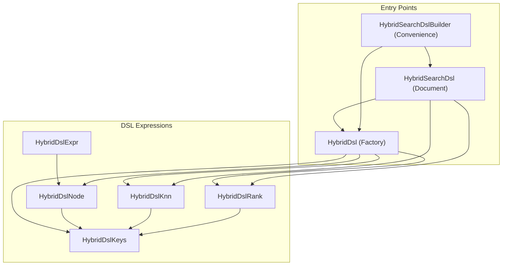
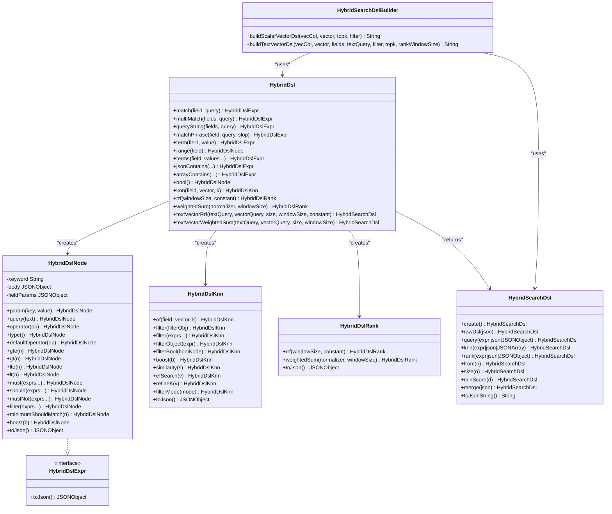
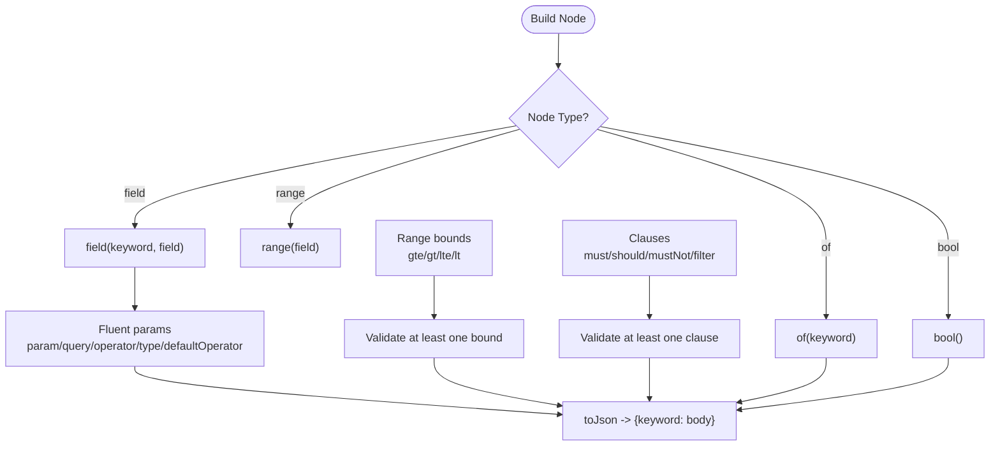
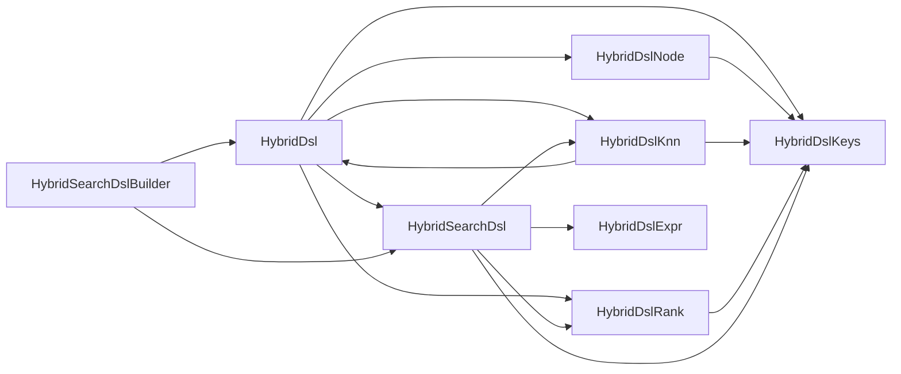

# DSL Entry Point and Builder Pattern

<cite>
**Referenced Files in This Document**
- [HybridDsl.java](file://src/main/java/com/oceanbase/obvector4j/hybrid/core/dsl/HybridDsl.java)
- [HybridDslNode.java](file://src/main/java/com/oceanbase/obvector4j/hybrid/core/dsl/HybridDslNode.java)
- [HybridDslExpr.java](file://src/main/java/com/oceanbase/obvector4j/hybrid/core/dsl/HybridDslExpr.java)
- [HybridDslKnn.java](file://src/main/java/com/oceanbase/obvector4j/hybrid/core/dsl/HybridDslKnn.java)
- [HybridDslRank.java](file://src/main/java/com/oceanbase/obvector4j/hybrid/core/dsl/HybridDslRank.java)
- [HybridDslKeys.java](file://src/main/java/com/oceanbase/obvector4j/hybrid/core/dsl/HybridDslKeys.java)
- [HybridSearchDsl.java](file://src/main/java/com/oceanbase/obvector4j/hybrid/core/HybridSearchDsl.java)
- [HybridSearchDslBuilder.java](file://src/main/java/com/oceanbase/obvector4j/hybrid/core/HybridSearchDslBuilder.java)
- [HybridDslTest.java](file://src/test/java/com/oceanbase/obvector4j/unit/HybridDslTest.java)
- [HybridSearchDslTest.java](file://src/test/java/com/oceanbase/obvector4j/unit/HybridSearchDslTest.java)
</cite>

## Table of Contents
1. Introduction
2. Project Structure
3. Core Components
4. Architecture Overview
5. Detailed Component Analysis
6. Dependency Analysis
7. Performance Considerations
8. Troubleshooting Guide
9. Conclusion

## Introduction
This document explains the HYBRID_SEARCH DSL entry point and builder pattern used to construct type-safe, composable query expressions for OceanBase 4.6.0+. It focuses on:
- HybridDsl as the main factory for fluent expression building
- The HybridDslNode tree representing the query AST
- Parameter binding and JSON serialization
- Practical examples using high-level convenience methods and low-level node construction
- How DSL expressions map to SQL generation via the top-level DSL document

## Project Structure
The DSL implementation is organized into a small set of focused classes:
- Factory and convenience API: HybridDsl
- Expression interface and AST node: HybridDslExpr, HybridDslNode
- Specialized builders for knn and rank sections: HybridDslKnn, HybridDslRank
- Fixed keyword constants: HybridDslKeys
- Top-level mutable DSL document: HybridSearchDsl
- Convenience builder for common patterns: HybridSearchDslBuilder

**Diagram sources**
- [HybridDsl.java:1-237](file://src/main/java/com/oceanbase/obvector4j/hybrid/core/dsl/HybridDsl.java#L1-L237)
- [HybridDslNode.java:1-267](file://src/main/java/com/oceanbase/obvector4j/hybrid/core/dsl/HybridDslNode.java#L1-L267)
- [HybridDslExpr.java:1-13](file://src/main/java/com/oceanbase/obvector4j/hybrid/core/dsl/HybridDslExpr.java#L1-L13)
- [HybridDslKnn.java:1-101](file://src/main/java/com/oceanbase/obvector4j/hybrid/core/dsl/HybridDslKnn.java#L1-L101)
- [HybridDslRank.java:1-48](file://src/main/java/com/oceanbase/obvector4j/hybrid/core/dsl/HybridDslRank.java#L1-L48)
- [HybridDslKeys.java:1-134](file://src/main/java/com/oceanbase/obvector4j/hybrid/core/dsl/HybridDslKeys.java#L1-L134)
- [HybridSearchDsl.java:1-254](file://src/main/java/com/oceanbase/obvector4j/hybrid/core/HybridSearchDsl.java#L1-L254)
- [HybridSearchDslBuilder.java:1-71](file://src/main/java/com/oceanbase/obvector4j/hybrid/core/HybridSearchDslBuilder.java#L1-L71)

**Section sources**
- [HybridDsl.java:1-237](file://src/main/java/com/oceanbase/obvector4j/hybrid/core/dsl/HybridDsl.java#L1-L237)
- [HybridDslNode.java:1-267](file://src/main/java/com/oceanbase/obvector4j/hybrid/core/dsl/HybridDslNode.java#L1-L267)
- [HybridDslExpr.java:1-13](file://src/main/java/com/oceanbase/obvector4j/hybrid/core/dsl/HybridDslExpr.java#L1-L13)
- [HybridDslKnn.java:1-101](file://src/main/java/com/oceanbase/obvector4j/hybrid/core/dsl/HybridDslKnn.java#L1-L101)
- [HybridDslRank.java:1-48](file://src/main/java/com/oceanbase/obvector4j/hybrid/core/dsl/HybridDslRank.java#L1-L48)
- [HybridDslKeys.java:1-134](file://src/main/java/com/oceanbase/obvector4j/hybrid/core/dsl/HybridDslKeys.java#L1-L134)
- [HybridSearchDsl.java:1-254](file://src/main/java/com/oceanbase/obvector4j/hybrid/core/HybridSearchDsl.java#L1-L254)
- [HybridSearchDslBuilder.java:1-71](file://src/main/java/com/oceanbase/obvector4j/hybrid/core/HybridSearchDslBuilder.java#L1-L71)

## Core Components
- HybridDsl: Static factory providing fluent helpers for full-text, scalar, JSON/array filters, bool composition, knn, and ranking. Also offers convenience methods that assemble a complete HybridSearchDsl document.
- HybridDslExpr: Interface defining toJson() for any DSL expression.
- HybridDslNode: Mutable AST node implementing HybridDslExpr with fluent setters for parameters, clauses, range bounds, and boolean composition.
- HybridDslKnn: Builder for the knn section including filter integration and search options.
- HybridDslRank: Builder for ranking strategies (RRF and weighted_sum).
- HybridDslKeys: Centralized constants for all JSON keys and enum-like values.
- HybridSearchDsl: Mutable top-level document builder supporting typed and raw JSON inputs, merging, and final JSON string emission.
- HybridSearchDslBuilder: Convenience static methods for common text+vector or scalar+vector patterns.

Key responsibilities:
- Type safety and validation at construction time
- Fluent method chaining for readability
- Consistent JSON structure aligned with the HYBRID_SEARCH specification
- Easy composition of complex queries from simple parts

**Section sources**
- [HybridDsl.java:1-237](file://src/main/java/com/oceanbase/obvector4j/hybrid/core/dsl/HybridDsl.java#L1-L237)
- [HybridDslNode.java:1-267](file://src/main/java/com/oceanbase/obvector4j/hybrid/core/dsl/HybridDslNode.java#L1-L267)
- [HybridDslExpr.java:1-13](file://src/main/java/com/oceanbase/obvector4j/hybrid/core/dsl/HybridDslExpr.java#L1-L13)
- [HybridDslKnn.java:1-101](file://src/main/java/com/oceanbase/obvector4j/hybrid/core/dsl/HybridDslKnn.java#L1-L101)
- [HybridDslRank.java:1-48](file://src/main/java/com/oceanbase/obvector4j/hybrid/core/dsl/HybridDslRank.java#L1-L48)
- [HybridDslKeys.java:1-134](file://src/main/java/com/oceanbase/obvector4j/hybrid/core/dsl/HybridDslKeys.java#L1-L134)
- [HybridSearchDsl.java:1-254](file://src/main/java/com/oceanbase/obvector4j/hybrid/core/HybridSearchDsl.java#L1-L254)
- [HybridSearchDslBuilder.java:1-71](file://src/main/java/com/oceanbase/obvector4j/hybrid/core/HybridSearchDslBuilder.java#L1-L71)

## Architecture Overview
The DSL follows a layered builder pattern:
- Expression layer: HybridDsl + HybridDslNode produce typed expressions (match, multi_match, bool, term, range, etc.)
- Section builders: HybridDslKnn and HybridDslRank build their respective sections
- Document layer: HybridSearchDsl composes query, knn, rank, pagination, and scoring into a final JSON document
- Convenience layer: HybridSearchDslBuilder provides ready-to-use templates for common scenarios

**Diagram sources**
- [HybridDsl.java:1-237](file://src/main/java/com/oceanbase/obvector4j/hybrid/core/dsl/HybridDsl.java#L1-L237)
- [HybridDslNode.java:1-267](file://src/main/java/com/oceanbase/obvector4j/hybrid/core/dsl/HybridDslNode.java#L1-L267)
- [HybridDslExpr.java:1-13](file://src/main/java/com/oceanbase/obvector4j/hybrid/core/dsl/HybridDslExpr.java#L1-L13)
- [HybridDslKnn.java:1-101](file://src/main/java/com/oceanbase/obvector4j/hybrid/core/dsl/HybridDslKnn.java#L1-L101)
- [HybridDslRank.java:1-48](file://src/main/java/com/oceanbase/obvector4j/hybrid/core/dsl/HybridDslRank.java#L1-L48)
- [HybridSearchDsl.java:1-254](file://src/main/java/com/oceanbase/obvector4j/hybrid/core/HybridSearchDsl.java#L1-L254)
- [HybridSearchDslBuilder.java:1-71](file://src/main/java/com/oceanbase/obvector4j/hybrid/core/HybridSearchDslBuilder.java#L1-L71)

## Detailed Component Analysis

### HybridDsl: Main Factory and Fluent API
- Purpose: Provide concise, type-safe factories for common query fragments and compose them into a full HybridSearchDsl document.
- Design principles:
  - Immutable input validation (e.g., non-empty fields, positive k)
  - Fluent returns enabling method chaining
  - High-level conveniences like textVectorRrf and textVectorWeightedSum
- Key capabilities:
  - Full-text: match, multi_match, query_string, match_phrase
  - Scalar: term, terms, range
  - JSON/array: json_contains, json_overlaps, json_member_of, array_contains, array_contains_all, array_overlaps
  - Boolean composition: bool().must/should/filter/mustNot
  - Vector: knn(...), with optional boost/similarity/search_options
  - Ranking: rrf(...), weighted_sum(...)
  - Document assembly: returns HybridSearchDsl for final serialization

Practical usage references:
- Simple text + vector + RRF example path: [HybridDslTest.java:14-29](file://src/test/java/com/oceanbase/obvector4j/unit/HybridDslTest.java#L14-L29)
- Bool with filter and range example path: [HybridDslTest.java:31-50](file://src/test/java/com/oceanbase/obvector4j/unit/HybridDslTest.java#L31-L50)
- Multi-match and multi-knn example path: [HybridDslTest.java:52-65](file://src/test/java/com/oceanbase/obvector4j/unit/HybridDslTest.java#L52-L65)
- Boost and weighted sum example path: [HybridDslTest.java:78-93](file://src/test/java/com/oceanbase/obvector4j/unit/HybridDslTest.java#L78-L93)
- JSON/array filters example path: [HybridDslTest.java:95-108](file://src/test/java/com/oceanbase/obvector4j/unit/HybridDslTest.java#L95-L108)
- KNN search options and RRF example path: [HybridDslTest.java:110-124](file://src/test/java/com/oceanbase/obvector4j/unit/HybridDslTest.java#L110-L124)
- Query string and bool boost example path: [HybridDslTest.java:126-140](file://src/test/java/com/oceanbase/obvector4j/unit/HybridDslTest.java#L126-L140)

**Section sources**
- [HybridDsl.java:1-237](file://src/main/java/com/oceanbase/obvector4j/hybrid/core/dsl/HybridDsl.java#L1-L237)
- [HybridDslTest.java:14-140](file://src/test/java/com/oceanbase/obvector4j/unit/HybridDslTest.java#L14-L140)

### HybridDslNode: AST Node and Parameter Binding
- Role: Represents a single DSL keyword node with an internal JSON body; implements HybridDslExpr for serialization.
- Construction patterns:
  - field(keyword, field, value): creates {"keyword":{field:value}}
  - field(keyword, field): opens a fluent parameter builder for {"keyword":{field:{...}}}
  - of(keyword): generic node for keywords without a direct field wrapper
  - bool(): starts a boolean query node
  - range(field): opens a range bound builder
- Fluent APIs:
  - param(key, value), query(text), operator(op), type(t), defaultOperator(op)
  - gte/gt/lte/lt for range bounds
  - must/should/mustNot/filter for boolean clauses
  - minimumShouldMatch(n), boost(b)
- Validation and errors:
  - Range requires at least one bound
  - Bool requires at least one clause
  - Field and keyword validations throw IllegalArgumentException

**Diagram sources**
- [HybridDslNode.java:38-181](file://src/main/java/com/oceanbase/obvector4j/hybrid/core/dsl/HybridDslNode.java#L38-L181)

**Section sources**
- [HybridDslNode.java:1-267](file://src/main/java/com/oceanbase/obvector4j/hybrid/core/dsl/HybridDslNode.java#L1-L267)

### HybridDslKnn: Vector Search Section Builder
- Purpose: Build the knn section with field, k, query_vector, optional filter, boost, similarity, and search_options (ef_search, refine_k, filter_mode).
- Integration points:
  - Accepts Filter objects or typed expressions for filtering
  - Supports both array-style filter list and object-style filter root
- Validation:
  - Non-empty field and vector
  - Positive k

Usage references:
- KNN search options and RRF example path: [HybridDslTest.java:110-124](file://src/test/java/com/oceanbase/obvector4j/unit/HybridDslTest.java#L110-L124)

**Section sources**
- [HybridDslKnn.java:1-101](file://src/main/java/com/oceanbase/obvector4j/hybrid/core/dsl/HybridDslKnn.java#L1-L101)
- [HybridDslTest.java:110-124](file://src/test/java/com/oceanbase/obvector4j/unit/HybridDslTest.java#L110-L124)

### HybridDslRank: Ranking Strategy Builder
- Strategies:
  - rrf(rank_window_size, rank_constant)
  - weighted_sum(normalizer, rank_window_size) where normalizer can be none or minmax
- Validation:
  - Positive rank_window_size for RRF
  - Non-empty normalizer for weighted_sum

Usage references:
- Weighted sum normalization example path: [HybridDslTest.java:78-93](file://src/test/java/com/oceanbase/obvector4j/unit/HybridDslTest.java#L78-L93)

**Section sources**
- [HybridDslRank.java:1-48](file://src/main/java/com/oceanbase/obvector4j/hybrid/core/dsl/HybridDslRank.java#L1-L48)
- [HybridDslTest.java:78-93](file://src/test/java/com/oceanbase/obvector4j/unit/HybridDslTest.java#L78-L93)

### HybridSearchDsl: Top-Level Document Builder
- Responsibilities:
  - Accept typed expressions or raw JSON for query, knn, rank
  - Support multi-path knn via arrays
  - Merge additional top-level keys from JSON
  - Enforce presence of at least query or knn
  - Emit final JSON string
- Patterns:
  - Typed: .query(HybridDslExpr), .knn(HybridDslKnn...), .rank(HybridDslRank)
  - Raw: .rawDsl(json), .merge(json)
  - Pagination/scoring: .from(), .size(), .minScore()

Usage references:
- Custom DSL from parts and merge example paths: [HybridSearchDslTest.java:75-100](file://src/test/java/com/oceanbase/obvector4j/unit/HybridSearchDslTest.java#L75-L100)
- Raw override example path: [HybridSearchDslTest.java:88-91](file://src/test/java/com/oceanbase/obvector4j/unit/HybridSearchDslTest.java#L88-L91)
- Requires query or knn enforcement path: [HybridSearchDslTest.java:102-109](file://src/test/java/com/oceanbase/obvector4j/unit/HybridSearchDslTest.java#L102-L109)

**Section sources**
- [HybridSearchDsl.java:1-254](file://src/main/java/com/oceanbase/obvector4j/hybrid/core/HybridSearchDsl.java#L1-L254)
- [HybridSearchDslTest.java:75-109](file://src/test/java/com/oceanbase/obvector4j/unit/HybridSearchDslTest.java#L75-L109)

### HybridSearchDslBuilder: Common Pattern Templates
- Provides prebuilt DSL strings for:
  - Scalar-vector search (knn only)
  - Text-vector search (full-text + knn + RRF)
- Internally uses HybridDsl and HybridSearchDsl to ensure consistency

Usage references:
- Scalar-vector DSL tests: [HybridSearchDslTest.java:36-53](file://src/test/java/com/oceanbase/obvector4j/unit/HybridSearchDslTest.java#L36-L53)
- Text-vector DSL tests: [HybridSearchDslTest.java:55-73](file://src/test/java/com/oceanbase/obvector4j/unit/HybridSearchDslTest.java#L55-L73)

**Section sources**
- [HybridSearchDslBuilder.java:1-71](file://src/main/java/com/oceanbase/obvector4j/hybrid/core/HybridSearchDslBuilder.java#L1-L71)
- [HybridSearchDslTest.java:36-73](file://src/test/java/com/oceanbase/obvector4j/unit/HybridSearchDslTest.java#L36-L73)

### Low-Level Node Construction Examples
- Compose multi_match directly from keywords:
  - Example path: [HybridDslTest.java:142-155](file://src/test/java/com/oceanbase/obvector4j/unit/HybridDslTest.java#L142-L155)

**Section sources**
- [HybridDslTest.java:142-155](file://src/test/java/com/oceanbase/obvector4j/unit/HybridDslTest.java#L142-L155)

## Dependency Analysis
- HybridDsl depends on:
  - HybridDslNode for expression creation
  - HybridDslKnn and HybridDslRank for section builders
  - HybridDslKeys for canonical JSON keys
  - HybridSearchDsl for assembling documents
- HybridDslNode depends on:
  - HybridDslKeys for key names
  - FilterMapper for integrating Filter objects into nodes
- HybridDslKnn depends on:
  - HybridDsl.formatVector for vector formatting
  - FilterMapper for filter integration
- HybridSearchDsl depends on:
  - HybridDslExpr, HybridDslKnn, HybridDslRank for typed inputs
  - HybridDslKeys for top-level keys
- HybridSearchDslBuilder depends on:
  - HybridDsl and HybridSearchDsl for composing templates

**Diagram sources**
- [HybridDsl.java:1-237](file://src/main/java/com/oceanbase/obvector4j/hybrid/core/dsl/HybridDsl.java#L1-L237)
- [HybridDslNode.java:1-267](file://src/main/java/com/oceanbase/obvector4j/hybrid/core/dsl/HybridDslNode.java#L1-L267)
- [HybridDslKnn.java:1-101](file://src/main/java/com/oceanbase/obvector4j/hybrid/core/dsl/HybridDslKnn.java#L1-L101)
- [HybridDslRank.java:1-48](file://src/main/java/com/oceanbase/obvector4j/hybrid/core/dsl/HybridDslRank.java#L1-L48)
- [HybridDslKeys.java:1-134](file://src/main/java/com/oceanbase/obvector4j/hybrid/core/dsl/HybridDslKeys.java#L1-L134)
- [HybridSearchDsl.java:1-254](file://src/main/java/com/oceanbase/obvector4j/hybrid/core/HybridSearchDsl.java#L1-L254)
- [HybridSearchDslBuilder.java:1-71](file://src/main/java/com/oceanbase/obvector4j/hybrid/core/HybridSearchDslBuilder.java#L1-L71)

**Section sources**
- [HybridDsl.java:1-237](file://src/main/java/com/oceanbase/obvector4j/hybrid/core/dsl/HybridDsl.java#L1-L237)
- [HybridDslNode.java:1-267](file://src/main/java/com/oceanbase/obvector4j/hybrid/core/dsl/HybridDslNode.java#L1-L267)
- [HybridDslKnn.java:1-101](file://src/main/java/com/oceanbase/obvector4j/hybrid/core/dsl/HybridDslKnn.java#L1-L101)
- [HybridDslRank.java:1-48](file://src/main/java/com/oceanbase/obvector4j/hybrid/core/dsl/HybridDslRank.java#L1-L48)
- [HybridDslKeys.java:1-134](file://src/main/java/com/oceanbase/obvector4j/hybrid/core/dsl/HybridDslKeys.java#L1-L134)
- [HybridSearchDsl.java:1-254](file://src/main/java/com/oceanbase/obvector4j/hybrid/core/HybridSearchDsl.java#L1-L254)
- [HybridSearchDslBuilder.java:1-71](file://src/main/java/com/oceanbase/obvector4j/hybrid/core/HybridSearchDslBuilder.java#L1-L71)

## Performance Considerations
- Prefer typed builders over raw JSON when possible to benefit from early validation and consistent key usage.
- Use appropriate rank_window_size for RRF and weighted_sum to balance recall and performance.
- For large vectors, consider ef_search and refine_k in search_options to tune approximate nearest neighbor behavior.
- Avoid unnecessary deep nesting of bool clauses; prefer combining filters at the knn level when applicable.

[No sources needed since this section provides general guidance]

## Troubleshooting Guide
Common issues and resolutions:
- Empty or invalid parameters:
  - Fields, keywords, and text must be non-empty; otherwise IllegalArgumentException is thrown during construction.
  - References: [HybridDslNode.java:242-265](file://src/main/java/com/oceanbase/obvector4j/hybrid/core/dsl/HybridDslNode.java#L242-L265)
- Range without bounds:
  - A range node must have at least one bound; otherwise IllegalStateException is thrown during toJson.
  - Reference: [HybridDslNode.java:172-174](file://src/main/java/com/oceanbase/obvector4j/hybrid/core/dsl/HybridDslNode.java#L172-L174)
- Bool without clauses:
  - A bool node must include at least one clause; otherwise IllegalStateException is thrown during toJson.
  - Reference: [HybridDslNode.java:175-177](file://src/main/java/com/oceanbase/obvector4j/hybrid/core/dsl/HybridDslNode.java#L175-L177)
- Missing query or knn in document:
  - HybridSearchDsl.toJsonString enforces at least one of query or knn; otherwise IllegalStateException is thrown.
  - Reference: [HybridSearchDsl.java:203-205](file://src/main/java/com/oceanbase/obvector4j/hybrid/core/HybridSearchDsl.java#L203-L205)
- Invalid JSON inputs:
  - Passing malformed JSON to rawDsl/query/knn/rank results in IllegalArgumentException wrapping parse errors.
  - Reference: [HybridSearchDsl.java:229-238](file://src/main/java/com/oceanbase/obvector4j/hybrid/core/HybridSearchDsl.java#L229-L238)

**Section sources**
- [HybridDslNode.java:172-177](file://src/main/java/com/oceanbase/obvector4j/hybrid/core/dsl/HybridDslNode.java#L172-L177)
- [HybridDslNode.java:242-265](file://src/main/java/com/oceanbase/obvector4j/hybrid/core/dsl/HybridDslNode.java#L242-L265)
- [HybridSearchDsl.java:203-238](file://src/main/java/com/oceanbase/obvector4j/hybrid/core/HybridSearchDsl.java#L203-L238)

## Conclusion
The HYBRID_SEARCH DSL provides a robust, type-safe builder pattern centered around HybridDsl as the primary factory. HybridDslNode serves as the core AST node enabling fluent composition of complex queries. Combined with specialized builders for knn and rank, and a top-level document builder, the system supports both high-level convenience methods and low-level node construction. All components validate inputs early and serialize consistently to JSON, which is then consumed by the HYBRID_SEARCH SQL interface.

[No sources needed since this section summarizes without analyzing specific files]