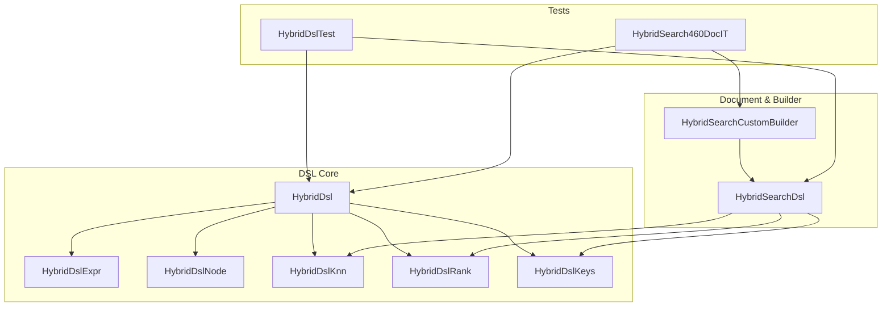
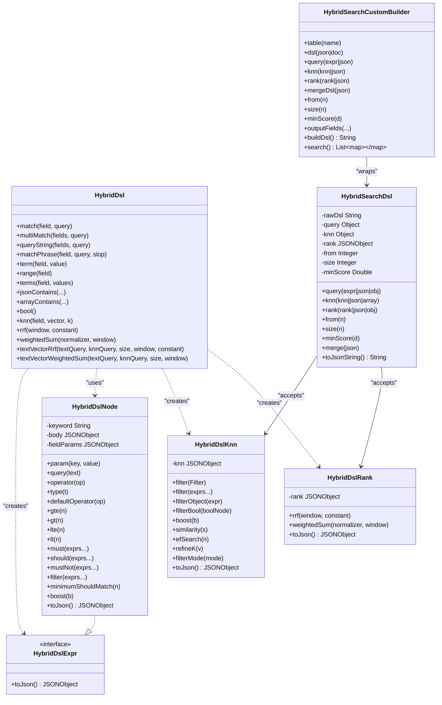
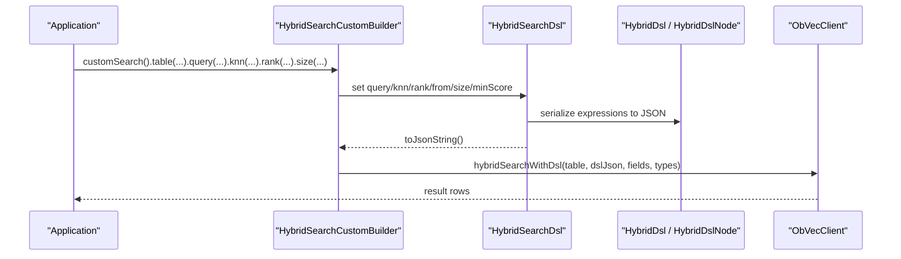
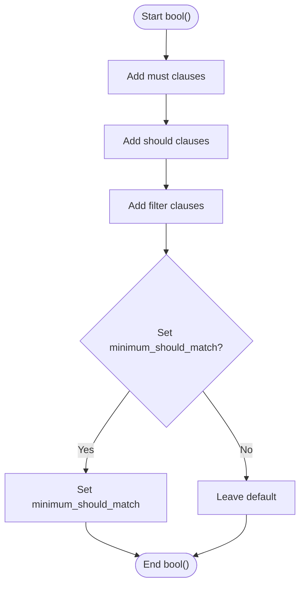
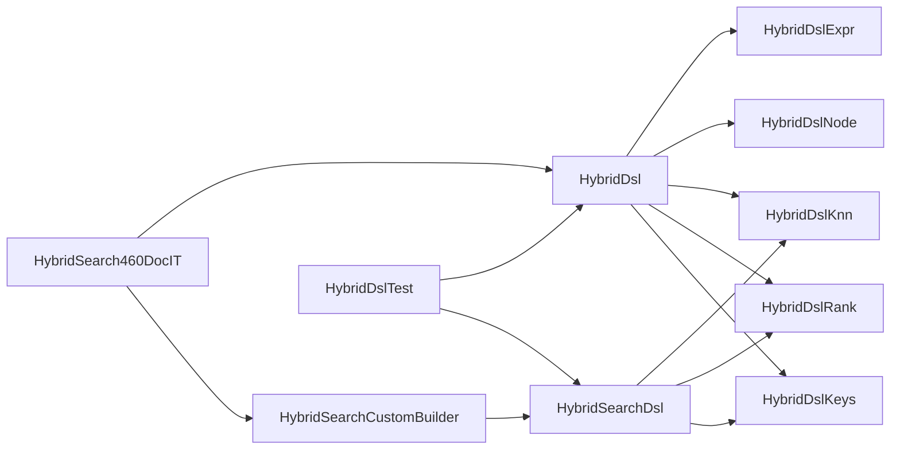

# HYBRID_SEARCH DSL Reference

<cite>
**Referenced Files in This Document**
- [HybridDsl.java](file://src/main/java/com/oceanbase/obvector4j/hybrid/v460/dsl/HybridDsl.java)
- [HybridDslNode.java](file://src/main/java/com/oceanbase/obvector4j/hybrid/v460/dsl/HybridDslNode.java)
- [HybridDslExpr.java](file://src/main/java/com/oceanbase/obvector4j/hybrid/v460/dsl/HybridDslExpr.java)
- [HybridDslKnn.java](file://src/main/java/com/oceanbase/obvector4j/hybrid/v460/dsl/HybridDslKnn.java)
- [HybridDslRank.java](file://src/main/java/com/oceanbase/obvector4j/hybrid/v460/dsl/HybridDslRank.java)
- [HybridDslKeys.java](file://src/main/java/com/oceanbase/obvector4j/hybrid/v460/dsl/HybridDslKeys.java)
- [HybridSearchDsl.java](file://src/main/java/com/oceanbase/obvector4j/hybrid/v460/HybridSearchDsl.java)
- [HybridSearchCustomBuilder.java](file://src/main/java/com/oceanbase/obvector4j/hybrid/v460/HybridSearchCustomBuilder.java)
- [HybridDslTest.java](file://src/test/java/com/oceanbase/obvector4j/unit/HybridDslTest.java)
- [HybridSearch460DocIT.java](file://src/test/java/com/oceanbase/obvector4j/integration/remote/HybridSearch460DocIT.java)
- [05-hybrid-search-dsl.md](file://docs/en/05-hybrid-search-dsl.md)
</cite>

## Table of Contents
1. [Introduction](#introduction)
2. [Project Structure](#project-structure)
3. [Core Components](#core-components)
4. [Architecture Overview](#architecture-overview)
5. [Detailed Component Analysis](#detailed-component-analysis)
6. [Dependency Analysis](#dependency-analysis)
7. [Performance Considerations](#performance-considerations)
8. [Troubleshooting Guide](#troubleshooting-guide)
9. [Conclusion](#conclusion)
10. [Appendices](#appendices)

## Introduction
This document is a comprehensive reference for the OceanBase 4.6.0+ HYBRID_SEARCH type-safe DSL builder pattern implemented in this repository. It explains how to construct full-text match expressions, KNN vector similarity queries, and ranking strategies (RRF and weighted_sum), and how they compose into complex multi-modal search queries. It also documents the HybridDslNode tree structure, expression composition patterns, advanced query techniques, and performance considerations for large-scale searches.

## Project Structure
The HYBRID_SEARCH DSL implementation resides under the v460 package and consists of:
- Entry point and factory methods for building expressions
- A generic node-based tree representation for composing expressions
- Dedicated builders for knn and rank sections
- A top-level mutable DSL document builder
- Integration with the client via a fluent custom builder

**Diagram sources**
- [HybridDsl.java:1-237](file://src/main/java/com/oceanbase/obvector4j/hybrid/v460/dsl/HybridDsl.java#L1-L237)
- [HybridDslNode.java:1-267](file://src/main/java/com/oceanbase/obvector4j/hybrid/v460/dsl/HybridDslNode.java#L1-L267)
- [HybridDslKnn.java:1-101](file://src/main/java/com/oceanbase/obvector4j/hybrid/v460/dsl/HybridDslKnn.java#L1-L101)
- [HybridDslRank.java:1-48](file://src/main/java/com/oceanbase/obvector4j/hybrid/v460/dsl/HybridDslRank.java#L1-L48)
- [HybridDslKeys.java:1-134](file://src/main/java/com/oceanbase/obvector4j/hybrid/v460/dsl/HybridDslKeys.java#L1-L134)
- [HybridSearchDsl.java:1-254](file://src/main/java/com/oceanbase/obvector4j/hybrid/v460/HybridSearchDsl.java#L1-L254)
- [HybridSearchCustomBuilder.java:1-164](file://src/main/java/com/oceanbase/obvector4j/hybrid/v460/HybridSearchCustomBuilder.java#L1-L164)
- [HybridDslTest.java:1-157](file://src/test/java/com/oceanbase/obvector4j/unit/HybridDslTest.java#L1-L157)
- [HybridSearch460DocIT.java:1-351](file://src/test/java/com/oceanbase/obvector4j/integration/remote/HybridSearch460DocIT.java#L1-L351)

**Section sources**
- [HybridDsl.java:1-237](file://src/main/java/com/oceanbase/obvector4j/hybrid/v460/dsl/HybridDsl.java#L1-L237)
- [HybridSearchDsl.java:1-254](file://src/main/java/com/oceanbase/obvector4j/hybrid/v460/HybridSearchDsl.java#L1-L254)
- [HybridSearchCustomBuilder.java:1-164](file://src/main/java/com/oceanbase/obvector4j/hybrid/v460/HybridSearchCustomBuilder.java#L1-L164)

## Core Components
- HybridDsl: Factory entry point providing typed helpers for match, multi_match, match_phrase, query_string, term, range, terms, JSON/array predicates, bool, knn, rrf, weighted_sum, and convenience text+vector+rank builders.
- HybridDslExpr: Interface representing any DSL expression that serializes to JSON.
- HybridDslNode: Generic keyword node implementing HybridDslExpr; supports field-param style nodes, bool clauses, range bounds, and arbitrary param injection.
- HybridDslKnn: Builder for the knn section including filter, boost, similarity, and search_options (ef_search, refine_k, filter_mode).
- HybridDslRank: Builder for rank fusion (rrf and weighted_sum).
- HybridDslKeys: Centralized constants for all JSON keys and enum-like values used by the DSL.
- HybridSearchDsl: Mutable top-level document builder aggregating query, knn, rank, from, size, min_score, and merge capabilities.
- HybridSearchCustomBuilder: Fluent builder wrapping HybridSearchDsl for execution through the client.

Key responsibilities:
- Type safety and validation at build time
- Consistent JSON generation aligned with OceanBase 4.6.0+ spec
- Support for single and multi-path knn
- Composition of full-text, scalar, JSON, array filters within bool contexts
- Ranking via RRF or weighted_sum with optional normalization

**Section sources**
- [HybridDsl.java:1-237](file://src/main/java/com/oceanbase/obvector4j/hybrid/v460/dsl/HybridDsl.java#L1-L237)
- [HybridDslExpr.java:1-13](file://src/main/java/com/oceanbase/obvector4j/hybrid/v460/dsl/HybridDslExpr.java#L1-L13)
- [HybridDslNode.java:1-267](file://src/main/java/com/oceanbase/obvector4j/hybrid/v460/dsl/HybridDslNode.java#L1-L267)
- [HybridDslKnn.java:1-101](file://src/main/java/com/oceanbase/obvector4j/hybrid/v460/dsl/HybridDslKnn.java#L1-L101)
- [HybridDslRank.java:1-48](file://src/main/java/com/oceanbase/obvector4j/hybrid/v460/dsl/HybridDslRank.java#L1-L48)
- [HybridDslKeys.java:1-134](file://src/main/java/com/oceanbase/obvector4j/hybrid/v460/dsl/HybridDslKeys.java#L1-L134)
- [HybridSearchDsl.java:1-254](file://src/main/java/com/oceanbase/obvector4j/hybrid/v460/HybridSearchDsl.java#L1-L254)
- [HybridSearchCustomBuilder.java:1-164](file://src/main/java/com/oceanbase/obvector4j/hybrid/v460/HybridSearchCustomBuilder.java#L1-L164)

## Architecture Overview
The DSL follows a builder + node-tree architecture:
- Expressions are constructed as typed objects (match, bool, knn, rank)
- Each expression serializes to a JSON object conforming to the HYBRID_SEARCH schema
- The top-level document aggregates these sections and renders final JSON for execution

**Diagram sources**
- [HybridDsl.java:1-237](file://src/main/java/com/oceanbase/obvector4j/hybrid/v460/dsl/HybridDsl.java#L1-L237)
- [HybridDslNode.java:1-267](file://src/main/java/com/oceanbase/obvector4j/hybrid/v460/dsl/HybridDslNode.java#L1-L267)
- [HybridDslKnn.java:1-101](file://src/main/java/com/oceanbase/obvector4j/hybrid/v460/dsl/HybridDslKnn.java#L1-L101)
- [HybridDslRank.java:1-48](file://src/main/java/com/oceanbase/obvector4j/hybrid/v460/dsl/HybridDslRank.java#L1-L48)
- [HybridSearchDsl.java:1-254](file://src/main/java/com/oceanbase/obvector4j/hybrid/v460/HybridSearchDsl.java#L1-L254)
- [HybridSearchCustomBuilder.java:1-164](file://src/main/java/com/oceanbase/obvector4j/hybrid/v460/HybridSearchCustomBuilder.java#L1-L164)

## Detailed Component Analysis

### HybridDsl: Expression Factories and Convenience Builders
Responsibilities:
- Provide static factories for full-text expressions (match, multi_match, match_phrase, query_string)
- Provide scalar predicates (term, range, terms)
- Provide JSON and array predicates (json_contains, json_overlaps, json_member_of, array_contains, array_contains_all, array_overlaps)
- Provide bool composition helper
- Provide knn and rank builders
- Provide convenience shortcuts for common hybrid patterns (text+vector+RRF, text+vector+weighted_sum)

Validation and constraints:
- Text parameters must be non-empty
- Field arrays must be non-empty
- Vector and k validations occur in knn builder

Convenience methods:
- textVectorRrf: builds query + knn + rrf + size
- textVectorWeightedSum: builds query + knn + weighted_sum(minmax) + size

**Section sources**
- [HybridDsl.java:1-237](file://src/main/java/com/oceanbase/obvector4j/hybrid/v460/dsl/HybridDsl.java#L1-L237)

### HybridDslNode: Tree Node and Bool/Ranged Range Builder
Responsibilities:
- Represent any keyword-based expression as a JSON object
- Support field-param style nodes (e.g., match with nested params)
- Build bool clauses (must, should, must_not, filter)
- Build range bounds (gte, gt, lte, lt)
- Inject arbitrary params (param, query, operator, type, default_operator)
- Validate required structures before serialization (e.g., range requires bounds; bool requires at least one clause)

Composition patterns:
- Use field(keyword, field) then chain .param/.query/.boost
- Use bool().must(...).filter(...) to combine scoring and filtering
- Use minimumShouldMatch to control should semantics

**Section sources**
- [HybridDslNode.java:1-267](file://src/main/java/com/oceanbase/obvector4j/hybrid/v460/dsl/HybridDslNode.java#L1-L267)

### HybridDslKnn: Vector Similarity Section Builder
Responsibilities:
- Construct knn section with field, k, query_vector
- Add pre/post filters via Filter objects or typed expressions
- Set boost, similarity, and search_options (ef_search, refine_k, filter_mode)
- Serialize to JSON object suitable for top-level knn key

Filter modes:
- Supports predefined filter modes (pre, pre-knn, pre-brute, post, post-index-merge)

**Section sources**
- [HybridDslKnn.java:1-101](file://src/main/java/com/oceanbase/obvector4j/hybrid/v460/dsl/HybridDslKnn.java#L1-L101)

### HybridDslRank: Ranking Fusion Builder
Responsibilities:
- Build RRF with rank_window_size and rank_constant
- Build weighted_sum with normalizer (none/minmax) and optional rank_window_size
- Serialize to JSON object suitable for top-level rank key

Normalization:
- minmax pairs well with min_score to constrain fused scores

**Section sources**
- [HybridDslRank.java:1-48](file://src/main/java/com/oceanbase/obvector4j/hybrid/v460/dsl/HybridDslRank.java#L1-L48)

### HybridDslKeys: Keyword Constants and Enum-like Values
Responsibilities:
- Centralize all JSON keys used across the DSL
- Provide enum-like classes for Operator, MultiMatchType, FilterMode, Normalizer

Usage:
- Ensures consistent spelling and reduces typos
- Used throughout builders and tests

**Section sources**
- [HybridDslKeys.java:1-134](file://src/main/java/com/oceanbase/obvector4j/hybrid/v460/dsl/HybridDslKeys.java#L1-L134)

### HybridSearchDsl: Top-Level Document Builder
Responsibilities:
- Accept raw DSL string or typed sections (query, knn, rank)
- Support multi-path knn via varargs or JSONArray
- Merge additional top-level keys from JSON
- Validate presence of at least one of query or knn
- Render final JSON string

Top-level fields:
- query, knn, rank, from, size, min_score

**Section sources**
- [HybridSearchDsl.java:1-254](file://src/main/java/com/oceanbase/obvector4j/hybrid/v460/HybridSearchDsl.java#L1-L254)

### HybridSearchCustomBuilder: Execution-Oriented Fluent API
Responsibilities:
- Wrap HybridSearchDsl with table name, output fields, and execution
- Provide escape hatches for raw DSL fragments per section
- Build and execute HYBRID_SEARCH queries against OceanBase 4.6.0+

**Section sources**
- [HybridSearchCustomBuilder.java:1-164](file://src/main/java/com/oceanbase/obvector4j/hybrid/v460/HybridSearchCustomBuilder.java#L1-L164)

### Query Expression Patterns and Examples

#### Full-text Match Expressions
- Single-field match with simple text
- Multi-field match with weights and operators
- Phrase matching with slop
- Query-string syntax over multiple fields

Typical usage paths:
- HybridDsl.match(field, query)
- HybridDsl.multiMatch(fields, query)
- HybridDsl.matchPhrase(field, query, slop)
- HybridDsl.queryString(fields, query)

**Section sources**
- [HybridDsl.java:31-86](file://src/main/java/com/oceanbase/obvector4j/hybrid/v460/dsl/HybridDsl.java#L31-L86)
- [HybridDslNode.java:86-115](file://src/main/java/com/oceanbase/obvector4j/hybrid/v460/dsl/HybridDslNode.java#L86-L115)
- [HybridDslTest.java:14-29](file://src/test/java/com/oceanbase/obvector4j/unit/HybridDslTest.java#L14-L29)
- [HybridSearch460DocIT.java:104-140](file://src/test/java/com/oceanbase/obvector4j/integration/remote/HybridSearch460DocIT.java#L104-L140)

#### Scalar Filtering
- term, range, terms
- Best practice: place in bool.filter or knn.filter

Typical usage paths:
- HybridDsl.term(field, value)
- HybridDsl.range(field).gte(...).lte(...)
- HybridDsl.terms(field, values...)

**Section sources**
- [HybridDsl.java:88-104](file://src/main/java/com/oceanbase/obvector4j/hybrid/v460/dsl/HybridDsl.java#L88-L104)
- [HybridDslNode.java:117-131](file://src/main/java/com/oceanbase/obvector4j/hybrid/v460/dsl/HybridDslNode.java#L117-L131)
- [HybridDslTest.java:31-50](file://src/test/java/com/oceanbase/obvector4j/unit/HybridDslTest.java#L31-L50)
- [HybridSearch460DocIT.java:88-140](file://src/test/java/com/oceanbase/obvector4j/integration/remote/HybridSearch460DocIT.java#L88-L140)

#### JSON and Array Predicates
- json_contains, json_overlaps, json_member_of
- array_contains, array_contains_all, array_overlaps

Typical usage paths:
- HybridDsl.jsonContains(field, candidate, path)
- HybridDsl.arrayContains(field, value)
- HybridDsl.arrayOverlaps(field, values...)

**Section sources**
- [HybridDsl.java:106-144](file://src/main/java/com/oceanbase/obvector4j/hybrid/v460/dsl/HybridDsl.java#L106-L144)
- [HybridDslTest.java:95-108](file://src/test/java/com/oceanbase/obvector4j/unit/HybridDslTest.java#L95-L108)
- [HybridSearch460DocIT.java:269-297](file://src/test/java/com/oceanbase/obvector4j/integration/remote/HybridSearch460DocIT.java#L269-L297)

#### Boolean Composition
- must, should, must_not, filter
- minimum_should_match behavior depends on presence of must/filter

Typical usage paths:
- HybridDsl.bool().must(...).filter(...)
- HybridDsl.bool().should(...).filter(...).minimumShouldMatch(1)

**Section sources**
- [HybridDslNode.java:133-168](file://src/main/java/com/oceanbase/obvector4j/hybrid/v460/dsl/HybridDslNode.java#L133-L168)
- [HybridDslTest.java:126-140](file://src/test/java/com/oceanbase/obvector4j/unit/HybridDslTest.java#L126-L140)
- [HybridSearch460DocIT.java:230-267](file://src/test/java/com/oceanbase/obvector4j/integration/remote/HybridSearch460DocIT.java#L230-L267)

#### KNN Operations
- Single and multi-path knn
- Filters scoped per knn path
- Boost, similarity, ef_search, refine_k, filter_mode

Typical usage paths:
- HybridDsl.knn(field, vector, k)
- .filter(HybridDsl.range(...))
- .boost(...)
- .efSearch(...)
- .refineK(...)
- .filterMode(...)

**Section sources**
- [HybridDslKnn.java:15-99](file://src/main/java/com/oceanbase/obvector4j/hybrid/v460/dsl/HybridDslKnn.java#L15-L99)
- [HybridDslTest.java:110-124](file://src/test/java/com/oceanbase/obvector4j/unit/HybridDslTest.java#L110-L124)
- [HybridSearch460DocIT.java:74-102](file://src/test/java/com/oceanbase/obvector4j/integration/remote/HybridSearch460DocIT.java#L74-L102)

#### Ranking Functions
- RRF with rank_window_size and rank_constant
- weighted_sum with normalizer (none/minmax) and optional rank_window_size
- WRRF via boosting query/knn when using RRF

Typical usage paths:
- HybridDsl.rrf(window, constant)
- HybridDsl.weightedSum(normalizer, window)
- HybridDsl.textVectorRrf(textQuery, knnQuery, size, window, constant)
- HybridDsl.textVectorWeightedSum(textQuery, knnQuery, size, window)

**Section sources**
- [HybridDslRank.java:15-42](file://src/main/java/com/oceanbase/obvector4j/hybrid/v460/dsl/HybridDslRank.java#L15-L42)
- [HybridDsl.java:159-200](file://src/main/java/com/oceanbase/obvector4j/hybrid/v460/dsl/HybridDsl.java#L159-L200)
- [HybridDslTest.java:78-93](file://src/test/java/com/oceanbase/obvector4j/unit/HybridDslTest.java#L78-L93)
- [HybridSearch460DocIT.java:183-228](file://src/test/java/com/oceanbase/obvector4j/integration/remote/HybridSearch460DocIT.java#L183-L228)

### Advanced Query Patterns

#### Complex Multi-Modal Queries
Patterns combining text matching, vector similarity, and scalar filtering:
- Full-text match inside bool.must with scalar filters in bool.filter
- KNN with independent filter conditions
- Multi-path knn for multiple vector columns
- RRF or weighted_sum fusion with boosts for weighting

Example references:
- Text + filter + knn (default WEIGHT_SUM)
- Text + vector + RRF
- WRRF with boost on query and knn
- Weighted sum with minmax normalization and min_score

**Section sources**
- [HybridSearch460DocIT.java:142-228](file://src/test/java/com/oceanbase/obvector4j/integration/remote/HybridSearch460DocIT.java#L142-L228)
- [HybridDslTest.java:52-76](file://src/test/java/com/oceanbase/obvector4j/unit/HybridDslTest.java#L52-L76)

#### Composing From Keywords Directly
For advanced scenarios, use HybridDslNode.of to create arbitrary keyword nodes and inject parameters directly.

**Section sources**
- [HybridDslNode.java:56-65](file://src/main/java/com/oceanbase/obvector4j/hybrid/v460/dsl/HybridDslNode.java#L56-L65)
- [HybridDslTest.java:142-155](file://src/test/java/com/oceanbase/obvector4j/unit/HybridDslTest.java#L142-L155)

### Sequence Diagram: Typical Hybrid Search Flow

**Diagram sources**
- [HybridSearchCustomBuilder.java:147-162](file://src/main/java/com/oceanbase/obvector4j/hybrid/v460/HybridSearchCustomBuilder.java#L147-L162)
- [HybridSearchDsl.java:199-227](file://src/main/java/com/oceanbase/obvector4j/hybrid/v460/HybridSearchDsl.java#L199-L227)
- [HybridDsl.java:175-200](file://src/main/java/com/oceanbase/obvector4j/hybrid/v460/dsl/HybridDsl.java#L175-L200)

### Flowchart: Bool Clause Construction

**Diagram sources**
- [HybridDslNode.java:133-168](file://src/main/java/com/oceanbase/obvector4j/hybrid/v460/dsl/HybridDslNode.java#L133-L168)

## Dependency Analysis

**Diagram sources**
- [HybridDsl.java:1-237](file://src/main/java/com/oceanbase/obvector4j/hybrid/v460/dsl/HybridDsl.java#L1-L237)
- [HybridSearchDsl.java:1-254](file://src/main/java/com/oceanbase/obvector4j/hybrid/v460/HybridSearchDsl.java#L1-L254)
- [HybridSearchCustomBuilder.java:1-164](file://src/main/java/com/oceanbase/obvector4j/hybrid/v460/HybridSearchCustomBuilder.java#L1-L164)
- [HybridDslTest.java:1-157](file://src/test/java/com/oceanbase/obvector4j/unit/HybridDslTest.java#L1-L157)
- [HybridSearch460DocIT.java:1-351](file://src/test/java/com/oceanbase/obvector4j/integration/remote/HybridSearch460DocIT.java#L1-L351)

Observations:
- Low coupling between expression builders and document builder
- Centralized constants reduce cross-module drift
- Tests validate both unit-level expression correctness and integration-level behavior

**Section sources**
- [HybridDsl.java:1-237](file://src/main/java/com/oceanbase/obvector4j/hybrid/v460/dsl/HybridDsl.java#L1-L237)
- [HybridSearchDsl.java:1-254](file://src/main/java/com/oceanbase/obvector4j/hybrid/v460/HybridSearchDsl.java#L1-L254)
- [HybridSearchCustomBuilder.java:1-164](file://src/main/java/com/oceanbase/obvector4j/hybrid/v460/HybridSearchCustomBuilder.java#L1-L164)

## Performance Considerations
- Prefer placing scalar/json/array predicates in filter clauses to avoid unnecessary scoring overhead
- Use knn.filter for pre-filtering candidates before vector search
- Tune ef_search and refine_k for accuracy vs latency trade-offs in approximate nearest neighbor search
- Choose appropriate rank_window_size and rank_constant for RRF to balance recall and precision
- When using weighted_sum with minmax normalization, pair with min_score to prune low-quality results
- Avoid excessive should clauses without minimum_should_match to prevent unintended broad matches
- Keep total number of knn paths within supported limits (single or multi-path up to documented constraints)

[No sources needed since this section provides general guidance]

## Troubleshooting Guide
Common issues and resolutions:
- Empty or null query/knn: Ensure at least one is provided before rendering JSON
- Invalid JSON strings: Validate JSON inputs passed to query/knn/rank/rawDsl
- Missing range bounds: Use range(field).gte/lte/gt/lt to add bounds
- Empty bool: Ensure at least one positive clause exists
- Non-positive k or invalid vectors: Validate vector length and k > 0
- Incorrect filter placement: Place scalar/json/array predicates in filter, not must/should

Relevant validations:
- HybridSearchDsl enforces presence of query or knn and validates numeric fields
- HybridDslNode enforces non-empty keywords, fields, and required clauses
- HybridDslKnn validates vector and k, and constructs search_options safely

**Section sources**
- [HybridSearchDsl.java:199-227](file://src/main/java/com/oceanbase/obvector4j/hybrid/v460/HybridSearchDsl.java#L199-L227)
- [HybridDslNode.java:171-181](file://src/main/java/com/oceanbase/obvector4j/hybrid/v460/dsl/HybridDslNode.java#L171-L181)
- [HybridDslKnn.java:21-30](file://src/main/java/com/oceanbase/obvector4j/hybrid/v460/dsl/HybridDslKnn.java#L21-L30)

## Conclusion
The HYBRID_SEARCH DSL in this repository offers a robust, type-safe builder pattern for constructing complex multi-modal queries combining full-text search, vector similarity, and scalar filtering. With dedicated builders for knn and rank, centralized constants, and a flexible node-based expression tree, it enables precise control over query semantics and ranking strategies such as RRF and weighted_sum. The included tests demonstrate practical usage patterns and validate alignment with the OceanBase 4.6.0+ specification.

[No sources needed since this section summarizes without analyzing specific files]

## Appendices

### Quick Reference: Top-Level Fields
- query: full-text/scalar/bool expression
- knn: vector similarity (object or array)
- rank: RRF or weighted_sum
- from: offset
- size: result count
- min_score: threshold for __score

**Section sources**
- [HybridSearchDsl.java:199-227](file://src/main/java/com/oceanbase/obvector4j/hybrid/v460/HybridSearchDsl.java#L199-L227)
- [05-hybrid-search-dsl.md:113-123](file://docs/en/05-hybrid-search-dsl.md#L113-L123)

### Example References
- Unit tests demonstrating match+knn+rrf, bool with filter and range, multi-match, json/array filters, knn search options
- Integration tests covering knn-only, knn+range, full-text+bool+filter, multi-path knn, text+vector+RRF, WRRF with boosts, weighted_sum+minmax+min_score, bool should+filter semantics, array_contains, and JSON term via dotted field

**Section sources**
- [HybridDslTest.java:14-155](file://src/test/java/com/oceanbase/obvector4j/unit/HybridDslTest.java#L14-L155)
- [HybridSearch460DocIT.java:74-297](file://src/test/java/com/oceanbase/obvector4j/integration/remote/HybridSearch460DocIT.java#L74-L297)
- [05-hybrid-search-dsl.md:384-418](file://docs/en/05-hybrid-search-dsl.md#L384-L418)