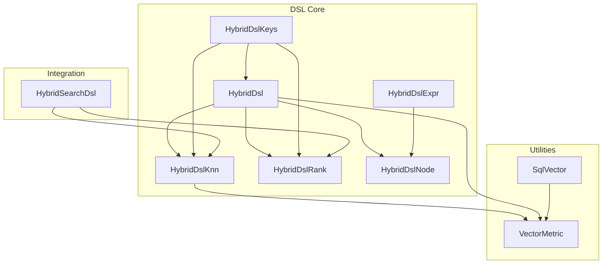
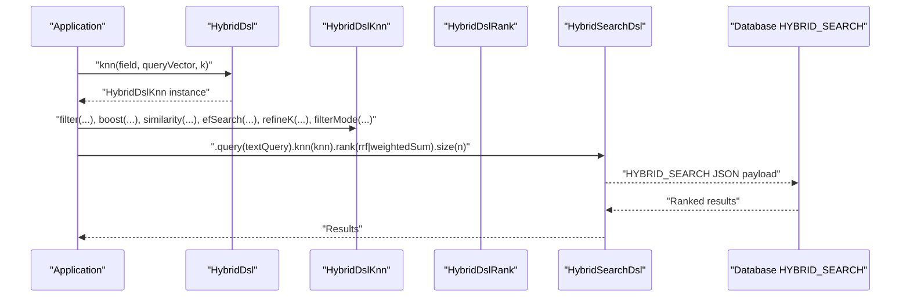
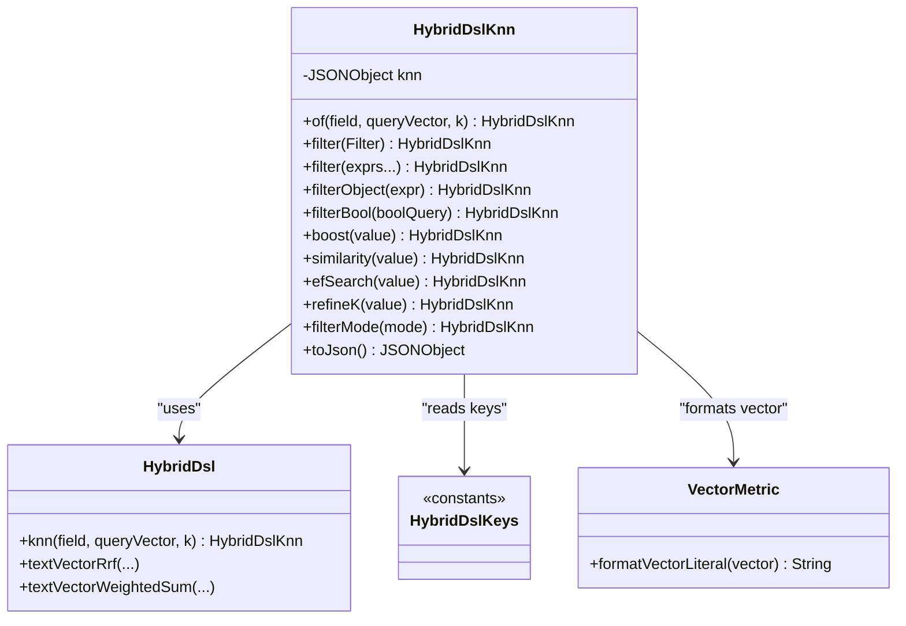
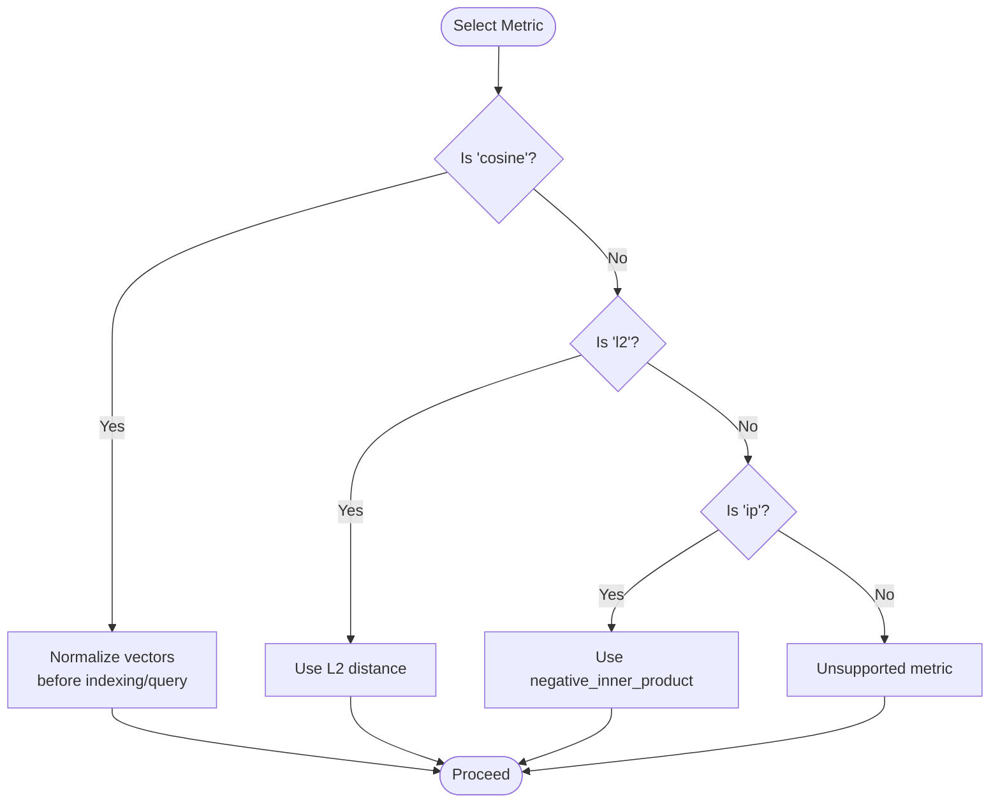
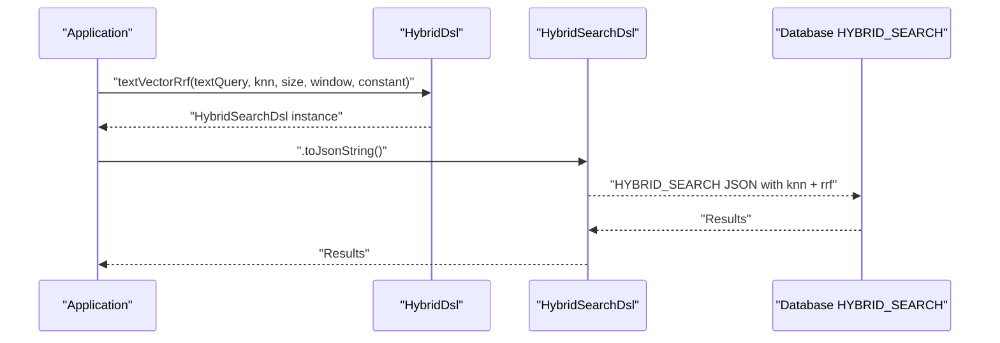
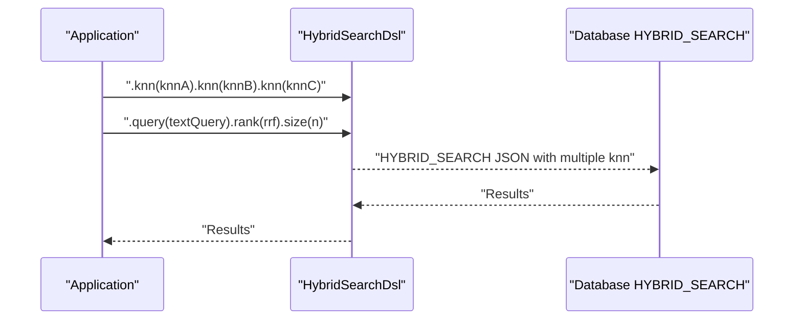
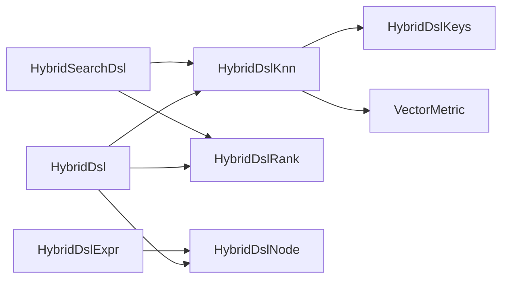

# KNN Vector Operations

<cite>
**Referenced Files in This Document**
- [HybridDslKnn.java](file://src/main/java/com/oceanbase/obvector4j/hybrid/core/dsl/HybridDslKnn.java)
- [HybridDsl.java](file://src/main/java/com/oceanbase/obvector4j/hybrid/core/dsl/HybridDsl.java)
- [HybridDslNode.java](file://src/main/java/com/oceanbase/obvector4j/hybrid/core/dsl/HybridDslNode.java)
- [HybridDslExpr.java](file://src/main/java/com/oceanbase/obvector4j/hybrid/core/dsl/HybridDslExpr.java)
- [HybridDslKeys.java](file://src/main/java/com/oceanbase/obvector4j/hybrid/core/dsl/HybridDslKeys.java)
- [HybridDslRank.java](file://src/main/java/com/oceanbase/obvector4j/hybrid/core/dsl/HybridDslRank.java)
- [VectorMetric.java](file://src/main/java/com/oceanbase/obvector4j/util/VectorMetric.java)
- [SqlVector.java](file://src/main/java/com/oceanbase/obvector4j/model/SqlVector.java)
- [HybridSearchDsl.java](file://src/main/java/com/oceanbase/obvector4j/hybrid/core/HybridSearchDsl.java)
</cite>

## Table of Contents
1. [Introduction](#introduction)
2. [Project Structure](#project-structure)
3. [Core Components](#core-components)
4. [Architecture Overview](#architecture-overview)
5. [Detailed Component Analysis](#detailed-component-analysis)
6. [Dependency Analysis](#dependency-analysis)
7. [Performance Considerations](#performance-considerations)
8. [Troubleshooting Guide](#troubleshooting-guide)
9. [Conclusion](#conclusion)
10. [Appendices](#appendices)

## Introduction
This document explains how to perform K-Nearest Neighbors (KNN) vector similarity search using the HYBRID_SEARCH DSL provided by the project. It focuses on constructing vector similarity queries with HybridDslKnn, including field specification, query vector formatting, k-value configuration, and integration with text search results. It also covers supported distance metrics, normalization requirements, performance tuning parameters, batch vector operations, and common issues such as dimensionality mismatches and index optimization.

## Project Structure
The KNN functionality is implemented under the hybrid core DSL package and integrates with ranking strategies and helper utilities for metric resolution and vector serialization.

**Diagram sources**
- [HybridDsl.java:154-200](file://src/main/java/com/oceanbase/obvector4j/hybrid/core/dsl/HybridDsl.java#L154-L200)
- [HybridDslKnn.java:11-100](file://src/main/java/com/oceanbase/obvector4j/hybrid/core/dsl/HybridDslKnn.java#L11-L100)
- [HybridDslRank.java:1-48](file://src/main/java/com/oceanbase/obvector4j/hybrid/core/dsl/HybridDslRank.java#L1-L48)
- [HybridDslNode.java:24-181](file://src/main/java/com/oceanbase/obvector4j/hybrid/core/dsl/HybridDslNode.java#L24-L181)
- [HybridDslExpr.java:9-12](file://src/main/java/com/oceanbase/obvector4j/hybrid/core/dsl/HybridDslExpr.java#L9-L12)
- [HybridDslKeys.java:78-133](file://src/main/java/com/oceanbase/obvector4j/hybrid/core/dsl/HybridDslKeys.java#L78-L133)
- [VectorMetric.java:11-39](file://src/main/java/com/oceanbase/obvector4j/util/VectorMetric.java#L11-L39)
- [SqlVector.java:15-31](file://src/main/java/com/oceanbase/obvector4j/model/SqlVector.java#L15-L31)
- [HybridSearchDsl.java:68-91](file://src/main/java/com/oceanbase/obvector4j/hybrid/core/HybridSearchDsl.java#L68-L91)

**Section sources**
- [HybridDsl.java:154-200](file://src/main/java/com/oceanbase/obvector4j/hybrid/core/dsl/HybridDsl.java#L154-L200)
- [HybridDslKnn.java:11-100](file://src/main/java/com/oceanbase/obvector4j/hybrid/core/dsl/HybridDslKnn.java#L11-L100)
- [HybridDslRank.java:1-48](file://src/main/java/com/oceanbase/obvector4j/hybrid/core/dsl/HybridDslRank.java#L1-L48)
- [HybridDslNode.java:24-181](file://src/main/java/com/oceanbase/obvector4j/hybrid/core/dsl/HybridDslNode.java#L24-L181)
- [HybridDslExpr.java:9-12](file://src/main/java/com/oceanbase/obvector4j/hybrid/core/dsl/HybridDslExpr.java#L9-L12)
- [HybridDslKeys.java:78-133](file://src/main/java/com/oceanbase/obvector4j/hybrid/core/dsl/HybridDslKeys.java#L78-L133)
- [VectorMetric.java:11-39](file://src/main/java/com/oceanbase/obvector4j/util/VectorMetric.java#L11-L39)
- [SqlVector.java:15-31](file://src/main/java/com/oceanbase/obvector4j/model/SqlVector.java#L15-L31)
- [HybridSearchDsl.java:68-91](file://src/main/java/com/oceanbase/obvector4j/hybrid/core/HybridSearchDsl.java#L68-L91)

## Core Components
- HybridDslKnn: Builds the knn section of the HYBRID_SEARCH DSL, including field, query vector, k, filters, boost/similarity thresholds, and search options like ef_search, refine_k, and filter_mode.
- HybridDsl: Provides fluent helpers to create match/text queries, compose knn via a convenience method, and assemble full hybrid searches with rank strategies.
- HybridDslRank: Encapsulates ranking strategies (RRF and weighted_sum) used to combine text and vector scores.
- HybridDslNode / HybridDslExpr: Generic node and expression types for building arbitrary DSL expressions.
- HybridDslKeys: Centralizes all DSL keyword constants, including knn-related keys and enum-like values for filter modes and normalizers.
- VectorMetric: Utility to resolve SQL distance functions from metric names and format float arrays into vector literals.
- SqlVector: JDBC-friendly vector type that serializes float[] into a string representation suitable for prepared statements.
- HybridSearchDsl: Top-level builder that accepts knn expressions (single or multiple) and composes them with text queries and ranking.

Key responsibilities:
- Validate inputs (field name, non-empty vector, positive k).
- Serialize vectors into the expected literal format.
- Attach optional filters and search options to knn.
- Integrate knn with text queries and ranking strategies.

**Section sources**
- [HybridDslKnn.java:15-100](file://src/main/java/com/oceanbase/obvector4j/hybrid/core/dsl/HybridDslKnn.java#L15-L100)
- [HybridDsl.java:154-200](file://src/main/java/com/oceanbase/obvector4j/hybrid/core/dsl/HybridDsl.java#L154-L200)
- [HybridDslRank.java:15-42](file://src/main/java/com/oceanbase/obvector4j/hybrid/core/dsl/HybridDslRank.java#L15-L42)
- [HybridDslNode.java:24-181](file://src/main/java/com/oceanbase/obvector4j/hybrid/core/dsl/HybridDslNode.java#L24-L181)
- [HybridDslExpr.java:9-12](file://src/main/java/com/oceanbase/obvector4j/hybrid/core/dsl/HybridDslExpr.java#L9-L12)
- [HybridDslKeys.java:78-133](file://src/main/java/com/oceanbase/obvector4j/hybrid/core/dsl/HybridDslKeys.java#L78-L133)
- [VectorMetric.java:11-39](file://src/main/java/com/oceanbase/obvector4j/util/VectorMetric.java#L11-L39)
- [SqlVector.java:15-31](file://src/main/java/com/oceanbase/obvector4j/model/SqlVector.java#L15-L31)
- [HybridSearchDsl.java:68-91](file://src/main/java/com/oceanbase/obvector4j/hybrid/core/HybridSearchDsl.java#L68-L91)

## Architecture Overview
The KNN workflow constructs a knn expression, optionally attaches filters and search options, and then composes it with text queries and ranking strategies. The resulting JSON is consumed by the database’s HYBRID_SEARCH engine.

**Diagram sources**
- [HybridDsl.java:154-200](file://src/main/java/com/oceanbase/obvector4j/hybrid/core/dsl/HybridDsl.java#L154-L200)
- [HybridDslKnn.java:15-100](file://src/main/java/com/oceanbase/obvector4j/hybrid/core/dsl/HybridDslKnn.java#L15-L100)
- [HybridDslRank.java:15-42](file://src/main/java/com/oceanbase/obvector4j/hybrid/core/dsl/HybridDslRank.java#L15-L42)
- [HybridSearchDsl.java:68-91](file://src/main/java/com/oceanbase/obvector4j/hybrid/core/HybridSearchDsl.java#L68-L91)

## Detailed Component Analysis

### HybridDslKnn: Building KNN Expressions
Responsibilities:
- Accepts field name, float[] query vector, and integer k.
- Validates inputs and formats the vector into a literal string.
- Supports attaching filters (Filter objects, expression arrays, bool wrappers).
- Allows boosting and similarity thresholding.
- Configures search options: ef_search, refine_k, and filter_mode.

Input validation:
- Field must be non-empty.
- Query vector must be non-null and non-empty.
- k must be greater than zero.

Vector formatting:
- Uses a utility to serialize float[] into a bracketed list literal.

Filters:
- Filter object conversion to condition array.
- Expression array aggregation.
- Bool wrapper support for pre-filter patterns.

Search options:
- ef_search: controls approximate search accuracy vs. speed.
- refine_k: refines top-k candidates.
- filter_mode: controls when filtering is applied relative to index scan.

**Diagram sources**
- [HybridDslKnn.java:15-100](file://src/main/java/com/oceanbase/obvector4j/hybrid/core/dsl/HybridDslKnn.java#L15-L100)
- [HybridDsl.java:154-200](file://src/main/java/com/oceanbase/obvector4j/hybrid/core/dsl/HybridDsl.java#L154-L200)
- [HybridDslKeys.java:78-133](file://src/main/java/com/oceanbase/obvector4j/hybrid/core/dsl/HybridDslKeys.java#L78-L133)
- [VectorMetric.java:29-39](file://src/main/java/com/oceanbase/obvector4j/util/VectorMetric.java#L29-L39)

**Section sources**
- [HybridDslKnn.java:15-100](file://src/main/java/com/oceanbase/obvector4j/hybrid/core/dsl/HybridDslKnn.java#L15-L100)
- [HybridDsl.java:154-200](file://src/main/java/com/oceanbase/obvector4j/hybrid/core/dsl/HybridDsl.java#L154-L200)
- [HybridDslKeys.java:78-133](file://src/main/java/com/oceanbase/obvector4j/hybrid/core/dsl/HybridDslKeys.java#L78-L133)
- [VectorMetric.java:29-39](file://src/main/java/com/oceanbase/obvector4j/util/VectorMetric.java#L29-L39)

### Distance Metrics and Normalization
Supported metrics:
- Cosine distance
- L2 distance
- Inner product (mapped to negative inner product for minimization)

Resolution:
- Metric names are resolved to SQL function names via a utility.

Normalization requirements:
- For cosine similarity, ensure vectors are normalized before indexing and querying.
- When using weighted_sum ranking, consider minmax normalization to balance score scales across modalities.

**Diagram sources**
- [VectorMetric.java:11-27](file://src/main/java/com/oceanbase/obvector4j/util/VectorMetric.java#L11-L27)
- [HybridDslKeys.java:126-132](file://src/main/java/com/oceanbase/obvector4j/hybrid/core/dsl/HybridDslKeys.java#L126-L132)

**Section sources**
- [VectorMetric.java:11-27](file://src/main/java/com/oceanbase/obvector4j/util/VectorMetric.java#L11-L27)
- [HybridDslKeys.java:126-132](file://src/main/java/com/oceanbase/obvector4j/hybrid/core/dsl/HybridDslKeys.java#L126-L132)

### Integration with Text Search and Ranking
Text-vector hybrid search can be composed using:
- RRF (Reciprocal Rank Fusion)
- Weighted sum with optional minmax normalization

Convenience methods exist to build these combinations quickly.

**Diagram sources**
- [HybridDsl.java:175-200](file://src/main/java/com/oceanbase/obvector4j/hybrid/core/dsl/HybridDsl.java#L175-L200)
- [HybridDslRank.java:15-42](file://src/main/java/com/oceanbase/obvector4j/hybrid/core/dsl/HybridDslRank.java#L15-L42)
- [HybridSearchDsl.java:68-91](file://src/main/java/com/oceanbase/obvector4j/hybrid/core/HybridSearchDsl.java#L68-L91)

**Section sources**
- [HybridDsl.java:175-200](file://src/main/java/com/oceanbase/obvector4j/hybrid/core/dsl/HybridDsl.java#L175-L200)
- [HybridDslRank.java:15-42](file://src/main/java/com/oceanbase/obvector4j/hybrid/core/dsl/HybridDslRank.java#L15-L42)
- [HybridSearchDsl.java:68-91](file://src/main/java/com/oceanbase/obvector4j/hybrid/core/HybridSearchDsl.java#L68-L91)

### Batch Vector Operations
Multiple knn expressions can be attached to a single HybridSearchDsl request, enabling multi-path vector search within one call.

**Diagram sources**
- [HybridSearchDsl.java:68-91](file://src/main/java/com/oceanbase/obvector4j/hybrid/core/HybridSearchDsl.java#L68-L91)

**Section sources**
- [HybridSearchDsl.java:68-91](file://src/main/java/com/oceanbase/obvector4j/hybrid/core/HybridSearchDsl.java#L68-L91)

## Dependency Analysis
The following diagram shows key dependencies among DSL components and utilities involved in KNN construction and execution.

**Diagram sources**
- [HybridDslKnn.java:15-100](file://src/main/java/com/oceanbase/obvector4j/hybrid/core/dsl/HybridDslKnn.java#L15-L100)
- [HybridDsl.java:154-200](file://src/main/java/com/oceanbase/obvector4j/hybrid/core/dsl/HybridDsl.java#L154-L200)
- [HybridDslRank.java:15-42](file://src/main/java/com/oceanbase/obvector4j/hybrid/core/dsl/HybridDslRank.java#L15-L42)
- [HybridDslNode.java:24-181](file://src/main/java/com/oceanbase/obvector4j/hybrid/core/dsl/HybridDslNode.java#L24-L181)
- [HybridDslExpr.java:9-12](file://src/main/java/com/oceanbase/obvector4j/hybrid/core/dsl/HybridDslExpr.java#L9-L12)
- [HybridDslKeys.java:78-133](file://src/main/java/com/oceanbase/obvector4j/hybrid/core/dsl/HybridDslKeys.java#L78-L133)
- [VectorMetric.java:11-39](file://src/main/java/com/oceanbase/obvector4j/util/VectorMetric.java#L11-L39)
- [HybridSearchDsl.java:68-91](file://src/main/java/com/oceanbase/obvector4j/hybrid/core/HybridSearchDsl.java#L68-L91)

**Section sources**
- [HybridDslKnn.java:15-100](file://src/main/java/com/oceanbase/obvector4j/hybrid/core/dsl/HybridDslKnn.java#L15-L100)
- [HybridDsl.java:154-200](file://src/main/java/com/oceanbase/obvector4j/hybrid/core/dsl/HybridDsl.java#L154-L200)
- [HybridDslRank.java:15-42](file://src/main/java/com/oceanbase/obvector4j/hybrid/core/dsl/HybridDslRank.java#L15-L42)
- [HybridDslNode.java:24-181](file://src/main/java/com/oceanbase/obvector4j/hybrid/core/dsl/HybridDslNode.java#L24-L181)
- [HybridDslExpr.java:9-12](file://src/main/java/com/oceanbase/obvector4j/hybrid/core/dsl/HybridDslExpr.java#L9-L12)
- [HybridDslKeys.java:78-133](file://src/main/java/com/oceanbase/obvector4j/hybrid/core/dsl/HybridDslKeys.java#L78-L133)
- [VectorMetric.java:11-39](file://src/main/java/com/oceanbase/obvector4j/util/VectorMetric.java#L11-L39)
- [HybridSearchDsl.java:68-91](file://src/main/java/com/oceanbase/obvector4j/hybrid/core/HybridSearchDsl.java#L68-L91)

## Performance Considerations
- ef_search: Increase for higher recall at the cost of latency; tune per workload.
- refine_k: Adjust to improve precision by refining candidate sets.
- filter_mode: Choose between pre-index and post-index filtering based on selectivity and data distribution.
- Vector normalization: Required for cosine-based metrics; ensures accurate similarity computation.
- Index optimization: Ensure appropriate vector index parameters are configured at schema/index level for your dataset size and dimensionality.

[No sources needed since this section provides general guidance]

## Troubleshooting Guide
Common issues and resolutions:
- Empty or null query vector: The builder validates and throws an error if the vector is empty or null. Provide a valid float[] with correct dimensionality.
- Non-positive k: k must be greater than zero; adjust accordingly.
- Unsupported metric: Only cosine, l2, and ip are supported; verify metric names.
- Dimensionality mismatch: Ensure query vector length matches indexed vector dimensions.
- Data type consistency: Use float[] for vectors; SqlVector serializes float arrays for JDBC usage.

Validation points:
- Field name validation
- Query vector emptiness check
- k > 0 enforcement
- Metric name validation and mapping

**Section sources**
- [HybridDslKnn.java:21-29](file://src/main/java/com/oceanbase/obvector4j/hybrid/core/dsl/HybridDslKnn.java#L21-L29)
- [VectorMetric.java:11-27](file://src/main/java/com/oceanbase/obvector4j/util/VectorMetric.java#L11-L27)
- [SqlVector.java:15-31](file://src/main/java/com/oceanbase/obvector4j/model/SqlVector.java#L15-L31)

## Conclusion
The DSL provides a robust, fluent API to construct KNN vector similarity queries, integrate them with text search, and control ranking and performance through well-defined options. By adhering to input validations, metric normalization requirements, and tuning search options, you can achieve accurate and efficient hybrid search results.

[No sources needed since this section summarizes without analyzing specific files]

## Appendices

### Practical Examples (by reference)
- Single vector similarity search with k and filters:
  - See [HybridDsl.knn:154-157](file://src/main/java/com/oceanbase/obvector4j/hybrid/core/dsl/HybridDsl.java#L154-L157) and [HybridDslKnn.of:21-29](file://src/main/java/com/oceanbase/obvector4j/hybrid/core/dsl/HybridDslKnn.java#L21-L29)
- Text + vector with RRF:
  - See [HybridDsl.textVectorRrf:175-187](file://src/main/java/com/oceanbase/obvector4j/hybrid/core/dsl/HybridDsl.java#L175-L187)
- Text + vector with weighted_sum (minmax):
  - See [HybridDsl.textVectorWeightedSum:189-200](file://src/main/java/com/oceanbase/obvector4j/hybrid/core/dsl/HybridDsl.java#L189-L200)
- Multiple knn paths in one request:
  - See [HybridSearchDsl.knn(varargs):83-91](file://src/main/java/com/oceanbase/obvector4j/hybrid/core/HybridSearchDsl.java#L83-L91)

**Section sources**
- [HybridDsl.java:154-200](file://src/main/java/com/oceanbase/obvector4j/hybrid/core/dsl/HybridDsl.java#L154-L200)
- [HybridDslKnn.java:21-29](file://src/main/java/com/oceanbase/obvector4j/hybrid/core/dsl/HybridDslKnn.java#L21-L29)
- [HybridSearchDsl.java:83-91](file://src/main/java/com/oceanbase/obvector4j/hybrid/core/HybridSearchDsl.java#L83-L91)