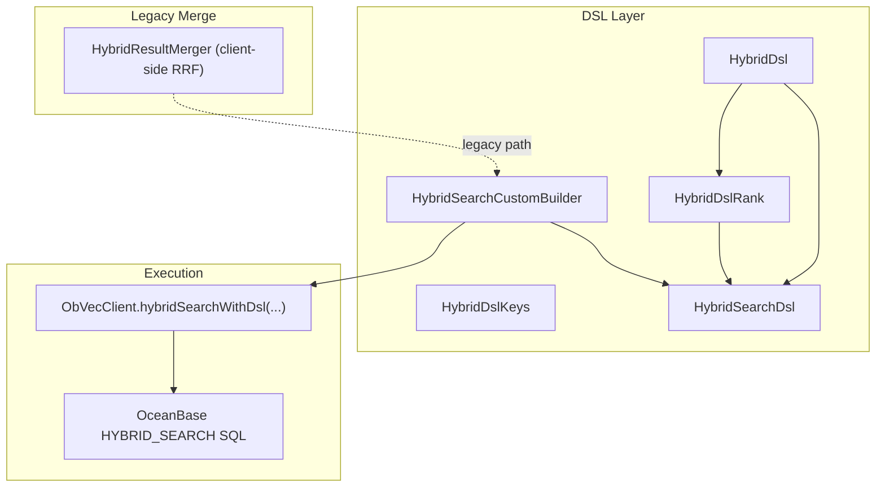
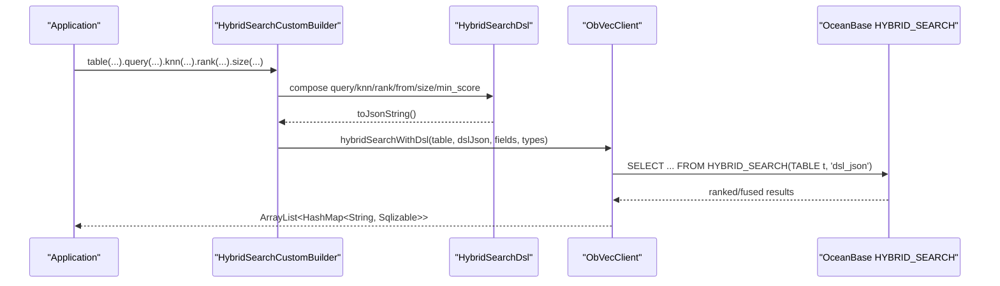
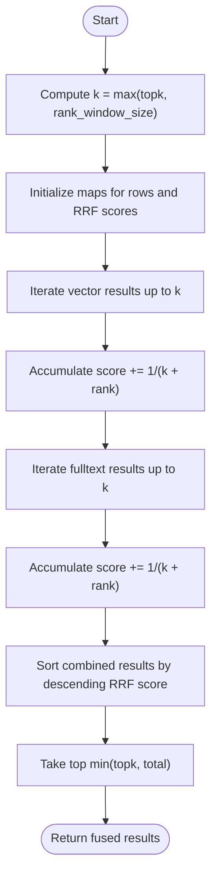
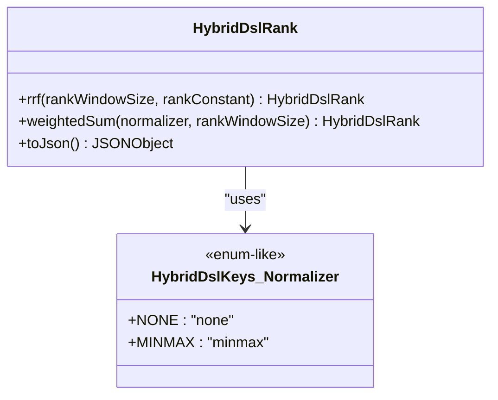
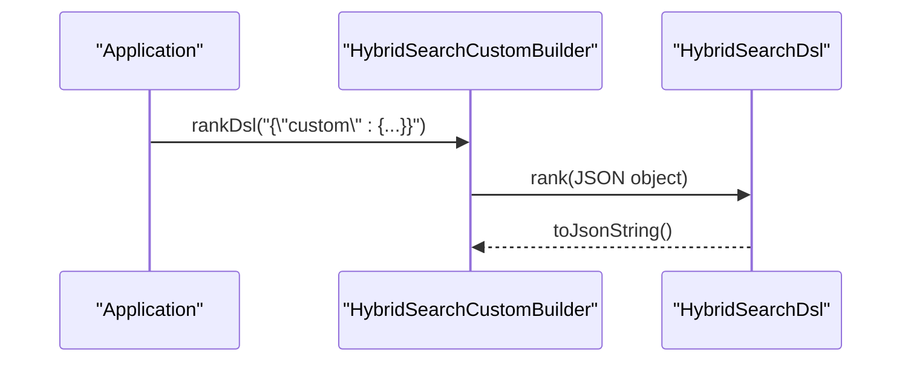
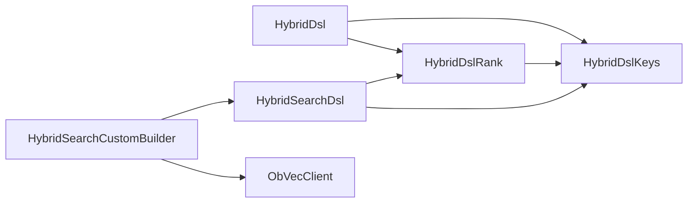

# Ranking Algorithms and Fusion

<cite>
**Referenced Files in This Document**
- [HybridDslRank.java](file://src/main/java/com/oceanbase/obvector4j/hybrid/core/dsl/HybridDslRank.java)
- [HybridDsl.java](file://src/main/java/com/oceanbase/obvector4j/hybrid/core/dsl/HybridDsl.java)
- [HybridDslKeys.java](file://src/main/java/com/oceanbase/obvector4j/hybrid/core/dsl/HybridDslKeys.java)
- [HybridSearchDsl.java](file://src/main/java/com/oceanbase/obvector4j/hybrid/core/HybridSearchDsl.java)
- [HybridSearchCustomBuilder.java](file://src/main/java/com/oceanbase/obvector4j/hybrid/core/HybridSearchCustomBuilder.java)
- [HybridResultMerger.java](file://src/main/java/com/oceanbase/obvector4j/hybrid/HybridResultMerger.java)
- [05-hybrid-search-dsl.md](file://docs/en/05-hybrid-search-dsl.md)
- [HybridDslTest.java](file://src/test/java/com/oceanbase/obvector4j/unit/HybridDslTest.java)
</cite>

## Table of Contents
1. [Introduction](#introduction)
2. [Project Structure](#project-structure)
3. [Core Components](#core-components)
4. [Architecture Overview](#architecture-overview)
5. [Detailed Component Analysis](#detailed-component-analysis)
6. [Dependency Analysis](#dependency-analysis)
7. [Performance Considerations](#performance-considerations)
8. [Troubleshooting Guide](#troubleshooting-guide)
9. [Conclusion](#conclusion)
10. [Appendices](#appendices)

## Introduction
This document explains ranking algorithms and result fusion strategies available through the HYBRID_SEARCH DSL in obvector4j. It covers:
- Reciprocal Rank Fusion (RRF), including rank window size and rank constant parameters
- Weighted sum normalization with minmax scaling
- Custom ranking strategies via raw JSON
- How to combine multiple search signals (text relevance, vector similarity, scalar filters) using different ranking approaches
- Performance implications and guidance for selecting optimal ranking strategies

## Project Structure
The ranking-related functionality is implemented across a small set of focused classes:
- DSL keys and constants define the JSON schema used by OceanBase 4.6.0+ HYBRID_SEARCH
- DSL builders construct typed query, knn, and rank sections
- A custom builder composes the final DSL and executes it against the database
- Legacy client-side RRF merging exists for older hybrid APIs

**Diagram sources**
- [HybridDsl.java:1-237](file://src/main/java/com/oceanbase/obvector4j/hybrid/core/dsl/HybridDsl.java#L1-L237)
- [HybridDslRank.java:1-48](file://src/main/java/com/oceanbase/obvector4j/hybrid/core/dsl/HybridDslRank.java#L1-L48)
- [HybridDslKeys.java:1-134](file://src/main/java/com/oceanbase/obvector4j/hybrid/core/dsl/HybridDslKeys.java#L1-L134)
- [HybridSearchDsl.java:1-254](file://src/main/java/com/oceanbase/obvector4j/hybrid/core/HybridSearchDsl.java#L1-L254)
- [HybridSearchCustomBuilder.java:1-164](file://src/main/java/com/oceanbase/obvector4j/hybrid/core/HybridSearchCustomBuilder.java#L1-L164)
- [HybridResultMerger.java:1-76](file://src/main/java/com/oceanbase/obvector4j/hybrid/HybridResultMerger.java#L1-L76)

**Section sources**
- [HybridDsl.java:1-237](file://src/main/java/com/oceanbase/obvector4j/hybrid/core/dsl/HybridDsl.java#L1-L237)
- [HybridDslRank.java:1-48](file://src/main/java/com/oceanbase/obvector4j/hybrid/core/dsl/HybridDslRank.java#L1-L48)
- [HybridDslKeys.java:1-134](file://src/main/java/com/oceanbase/obvector4j/hybrid/core/dsl/HybridDslKeys.java#L1-L134)
- [HybridSearchDsl.java:1-254](file://src/main/java/com/oceanbase/obvector4j/hybrid/core/HybridSearchDsl.java#L1-L254)
- [HybridSearchCustomBuilder.java:1-164](file://src/main/java/com/oceanbase/obvector4j/hybrid/core/HybridSearchCustomBuilder.java#L1-L164)
- [HybridResultMerger.java:1-76](file://src/main/java/com/oceanbase/obvector4j/hybrid/HybridResultMerger.java#L1-L76)

## Core Components
- HybridDslKeys: Defines all JSON keys for HYBRID_SEARCH, including rank strategy keys and normalizer values
- HybridDsl: Provides factory methods to build query, knn, and rank sections; includes convenience methods for RRF and weighted_sum
- HybridDslRank: Builds the rank section for RRF or weighted_sum with optional rank_window_size and normalizer
- HybridSearchDsl: Mutable DSL document that merges query/knn/rank/from/size/min_score into a final JSON string
- HybridSearchCustomBuilder: High-level builder that sets table, output fields, and executes the DSL via ObVecClient
- HybridResultMerger: Client-side RRF merger used by legacy hybrid search paths (not the 4.6.0+ server-side fusion)

Key configuration points:
- RRF parameters: rank_window_size, rank_constant
- Weighted sum parameters: normalizer (none, minmax), optional rank_window_size
- Boosting: per-signal boost on query and knn influences weighted_sum and WRRF behavior

**Section sources**
- [HybridDslKeys.java:89-133](file://src/main/java/com/oceanbase/obvector4j/hybrid/core/dsl/HybridDslKeys.java#L89-L133)
- [HybridDsl.java:159-200](file://src/main/java/com/oceanbase/obvector4j/hybrid/core/dsl/HybridDsl.java#L159-L200)
- [HybridDslRank.java:15-42](file://src/main/java/com/oceanbase/obvector4j/hybrid/core/dsl/HybridDslRank.java#L15-L42)
- [HybridSearchDsl.java:116-142](file://src/main/java/com/oceanbase/obvector4j/hybrid/core/HybridSearchDsl.java#L116-L142)
- [HybridSearchCustomBuilder.java:84-98](file://src/main/java/com/oceanbase/obvector4j/hybrid/core/HybridSearchCustomBuilder.java#L84-L98)
- [HybridResultMerger.java:15-49](file://src/main/java/com/oceanbase/obvector4j/hybrid/HybridResultMerger.java#L15-L49)

## Architecture Overview
The typical flow for HYBRID_SEARCH with ranking/fusion:
- Build typed expressions for text query and vector knn
- Choose a ranking strategy (RRF or weighted_sum) and configure parameters
- Assemble the DSL document and execute via the custom builder
- The database performs fused scoring and returns results

**Diagram sources**
- [HybridSearchCustomBuilder.java:147-162](file://src/main/java/com/oceanbase/obvector4j/hybrid/core/HybridSearchCustomBuilder.java#L147-L162)
- [HybridSearchDsl.java:199-227](file://src/main/java/com/oceanbase/obvector4j/hybrid/core/HybridSearchDsl.java#L199-L227)

## Detailed Component Analysis

### RRF (Reciprocal Rank Fusion)
- Purpose: Combine rankings from multiple lists (e.g., full-text and vector) without requiring normalized scores
- Parameters:
  - rank_window_size: limits contribution depth; larger windows include more distant ranks
  - rank_constant: additive constant controlling decay; higher values reduce influence of top ranks
- Usage:
  - Server-side via DSL rank.rrf(rank_window_size, rank_constant)
  - Legacy client-side merge uses similar logic with k = max(topk, rank_window_size)

**Diagram sources**
- [HybridResultMerger.java:15-49](file://src/main/java/com/oceanbase/obvector4j/hybrid/HybridResultMerger.java#L15-L49)

**Section sources**
- [HybridDslRank.java:15-25](file://src/main/java/com/oceanbase/obvector4j/hybrid/core/dsl/HybridDslRank.java#L15-L25)
- [HybridDsl.java:159-165](file://src/main/java/com/oceanbase/obvector4j/hybrid/core/dsl/HybridDsl.java#L159-L165)
- [HybridResultMerger.java:15-49](file://src/main/java/com/oceanbase/obvector4j/hybrid/HybridResultMerger.java#L15-L49)

### Weighted Sum Normalization with Min-Max Scaling
- Purpose: Normalize each signal’s scores to a common scale before linear combination
- Parameters:
  - normalizer: none or minmax
  - rank_window_size: optional; can constrain normalization window
- Behavior:
  - With minmax, scores are scaled to [0,1] pairs, enabling meaningful thresholds via min_score
  - Boosts on query and knn affect relative contributions

**Diagram sources**
- [HybridDslRank.java:27-42](file://src/main/java/com/oceanbase/obvector4j/hybrid/core/dsl/HybridDslRank.java#L27-L42)
- [HybridDslKeys.java:126-132](file://src/main/java/com/oceanbase/obvector4j/hybrid/core/dsl/HybridDslKeys.java#L126-L132)

**Section sources**
- [HybridDslRank.java:27-42](file://src/main/java/com/oceanbase/obvector4j/hybrid/core/dsl/HybridDslRank.java#L27-L42)
- [HybridDsl.java:167-173](file://src/main/java/com/oceanbase/obvector4j/hybrid/core/dsl/HybridDsl.java#L167-L173)
- [05-hybrid-search-dsl.md:313-329](file://docs/en/05-hybrid-search-dsl.md#L313-L329)

### Custom Ranking Strategies
- You can pass any valid rank JSON fragment directly to the DSL
- Use rankDsl(String) to inject custom server-side fusion logic beyond RRF and weighted_sum

**Diagram sources**
- [HybridSearchCustomBuilder.java:94-98](file://src/main/java/com/oceanbase/obvector4j/hybrid/core/HybridSearchCustomBuilder.java#L94-L98)
- [HybridSearchDsl.java:116-142](file://src/main/java/com/oceanbase/obvector4j/hybrid/core/HybridSearchDsl.java#L116-L142)

**Section sources**
- [HybridSearchCustomBuilder.java:94-98](file://src/main/java/com/oceanbase/obvector4j/hybrid/core/HybridSearchCustomBuilder.java#L94-L98)
- [HybridSearchDsl.java:116-142](file://src/main/java/com/oceanbase/obvector4j/hybrid/core/HybridSearchDsl.java#L116-L142)

### Combining Multiple Search Signals
- Text relevance: use match/multi_match/match_phrase/query_string inside query
- Vector similarity: use knn with field, k, query_vector, and optional filter_mode/search_options
- Scalar filters: place term/range/terms/json/array ops in bool.filter or knn.filter
- Ranking: choose rrf or weighted_sum(minmax) depending on needs

Examples (paths only):
- RRF with text + vector: [HybridDslTest.java:14-29](file://src/test/java/com/oceanbase/obvector4j/unit/HybridDslTest.java#L14-L29)
- Weighted sum minmax with boosts and min_score: [HybridDslTest.java:78-93](file://src/test/java/com/oceanbase/obvector4j/unit/HybridDslTest.java#L78-L93)
- Multi-path knn with independent filters: [HybridDslTest.java:52-65](file://src/test/java/com/oceanbase/obvector4j/unit/HybridDslTest.java#L52-L65)
- Bool must/should/filter composition: [HybridDslTest.java:31-50](file://src/test/java/com/oceanbase/obvector4j/unit/HybridDslTest.java#L31-L50)

**Section sources**
- [HybridDsl.java:31-86](file://src/main/java/com/oceanbase/obvector4j/hybrid/core/dsl/HybridDsl.java#L31-L86)
- [HybridDsl.java:155-173](file://src/main/java/com/oceanbase/obvector4j/hybrid/core/dsl/HybridDsl.java#L155-L173)
- [HybridDslTest.java:14-93](file://src/test/java/com/oceanbase/obvector4j/unit/HybridDslTest.java#L14-L93)
- [05-hybrid-search-dsl.md:249-329](file://docs/en/05-hybrid-search-dsl.md#L249-L329)

## Dependency Analysis
- HybridDsl depends on HybridDslNode and HybridDslKeys to produce typed expressions
- HybridDslRank depends on HybridDslKeys for JSON key names
- HybridSearchDsl aggregates query/knn/rank and serializes to JSON
- HybridSearchCustomBuilder orchestrates building and execution
- Legacy HybridResultMerger implements client-side RRF for older APIs

**Diagram sources**
- [HybridDsl.java:1-237](file://src/main/java/com/oceanbase/obvector4j/hybrid/core/dsl/HybridDsl.java#L1-L237)
- [HybridDslRank.java:1-48](file://src/main/java/com/oceanbase/obvector4j/hybrid/core/dsl/HybridDslRank.java#L1-L48)
- [HybridDslKeys.java:1-134](file://src/main/java/com/oceanbase/obvector4j/hybrid/core/dsl/HybridDslKeys.java#L1-L134)
- [HybridSearchDsl.java:1-254](file://src/main/java/com/oceanbase/obvector4j/hybrid/core/HybridSearchDsl.java#L1-L254)
- [HybridSearchCustomBuilder.java:1-164](file://src/main/java/com/oceanbase/obvector4j/hybrid/core/HybridSearchCustomBuilder.java#L1-L164)

**Section sources**
- [HybridDsl.java:1-237](file://src/main/java/com/oceanbase/obvector4j/hybrid/core/dsl/HybridDsl.java#L1-L237)
- [HybridDslRank.java:1-48](file://src/main/java/com/oceanbase/obvector4j/hybrid/core/dsl/HybridDslRank.java#L1-L48)
- [HybridDslKeys.java:1-134](file://src/main/java/com/oceanbase/obvector4j/hybrid/core/dsl/HybridDslKeys.java#L1-L134)
- [HybridSearchDsl.java:1-254](file://src/main/java/com/oceanbase/obvector4j/hybrid/core/HybridSearchDsl.java#L1-L254)
- [HybridSearchCustomBuilder.java:1-164](file://src/main/java/com/oceanbase/obvector4j/hybrid/core/HybridSearchCustomBuilder.java#L1-L164)

## Performance Considerations
- RRF
  - Pros: Robust to disparate score scales; no need for normalization
  - Cons: Sensitive to rank_window_size and rank_constant; large windows increase computation
  - Guidance: Tune rank_window_size near expected top-k; adjust rank_constant to control top-rank dominance
- Weighted Sum with Min-Max
  - Pros: Interpretable thresholds via min_score; good when signals are comparable after normalization
  - Cons: Requires proper normalization; sensitive to outliers if not windowed
  - Guidance: Use minmax with rank_window_size to limit outlier impact; calibrate boosts to balance signals
- Custom Ranking
  - Pros: Full flexibility for domain-specific fusion
  - Cons: Must ensure correctness and performance on the server side
- Legacy Client-Side RRF
  - Adds in-process sorting and aggregation; prefer server-side fusion when available (4.6.0+)

[No sources needed since this section provides general guidance]

## Troubleshooting Guide
Common issues and checks:
- Missing rank section defaults to weighted_sum when both query and knn are present
- Ensure rank_window_size > 0 for RRF; otherwise an exception is thrown
- For weighted_sum, normalizer cannot be empty; choose none or minmax
- min_score may return fewer rows than size; validate expectations
- Verify that scalar conditions are placed in filter clauses, not must/should

Relevant validation points:
- RRF parameter validation: [HybridDslRank.java:15-18](file://src/main/java/com/oceanbase/obvector4j/hybrid/core/dsl/HybridDslRank.java#L15-L18)
- Weighted sum normalizer validation: [HybridDslRank.java:30-33](file://src/main/java/com/oceanbase/obvector4j/hybrid/core/dsl/HybridDslRank.java#L30-L33)
- Default fusion behavior note: [05-hybrid-search-dsl.md:295-297](file://docs/en/05-hybrid-search-dsl.md#L295-L297)
- Pagination and min_score semantics: [05-hybrid-search-dsl.md:331-338](file://docs/en/05-hybrid-search-dsl.md#L331-L338)

**Section sources**
- [HybridDslRank.java:15-33](file://src/main/java/com/oceanbase/obvector4j/hybrid/core/dsl/HybridDslRank.java#L15-L33)
- [05-hybrid-search-dsl.md:295-338](file://docs/en/05-hybrid-search-dsl.md#L295-L338)

## Conclusion
For HYBRID_SEARCH in obvector4j:
- Use RRF when you want robust, scale-invariant fusion across heterogeneous signals
- Use weighted_sum with minmax when you need interpretable thresholds and can normalize effectively
- Leverage boosts and filters to shape signal contributions
- Prefer server-side fusion (4.6.0+) for performance and consistency
- Validate parameters and understand how rank_window_size and rank_constant affect outcomes

[No sources needed since this section summarizes without analyzing specific files]

## Appendices

### Configuration Reference
- RRF
  - rank_window_size: positive integer; controls depth of rank contribution
  - rank_constant: positive integer; controls decay of rank contribution
- Weighted Sum
  - normalizer: none | minmax
  - rank_window_size: optional; constrains normalization window
- Top-level DSL keys
  - query, knn, rank, from, size, min_score

**Section sources**
- [HybridDslKeys.java:89-133](file://src/main/java/com/oceanbase/obvector4j/hybrid/core/dsl/HybridDslKeys.java#L89-L133)
- [05-hybrid-search-dsl.md:113-123](file://docs/en/05-hybrid-search-dsl.md#L113-L123)