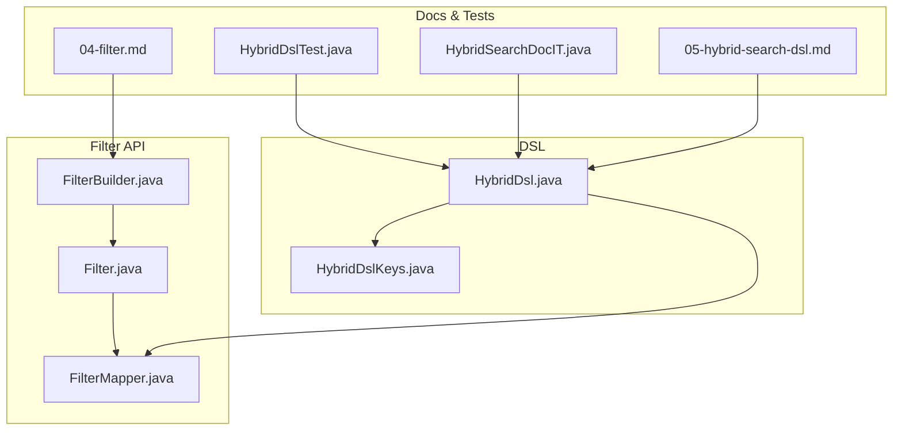
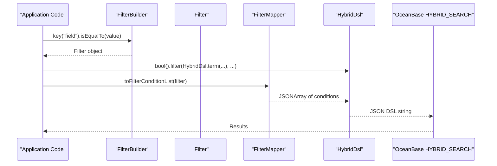
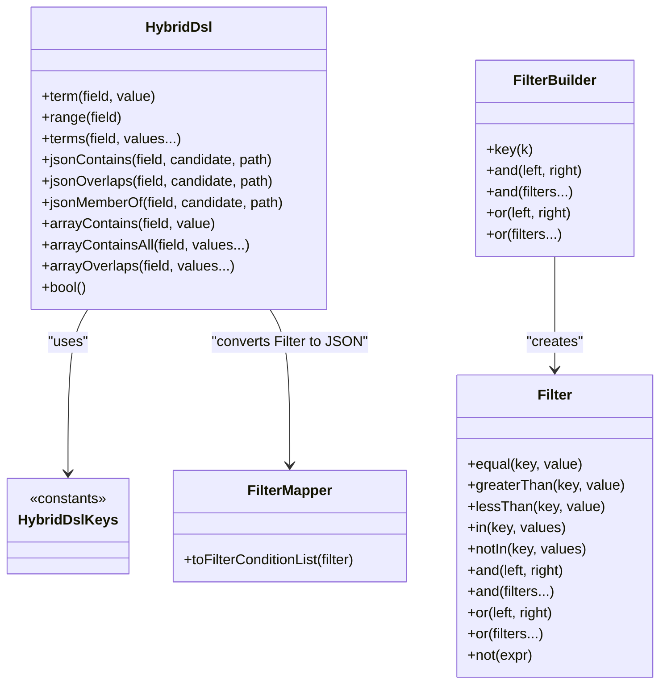

# Scalar Filter Expressions

<cite>
**Referenced Files in This Document**
- [HybridDsl.java](file://src/main/java/com/oceanbase/obvector4j/hybrid/core/dsl/HybridDsl.java)
- [HybridDslKeys.java](file://src/main/java/com/oceanbase/obvector4j/hybrid/core/dsl/HybridDslKeys.java)
- [Filter.java](file://src/main/java/com/oceanbase/obvector4j/filter/Filter.java)
- [FilterBuilder.java](file://src/main/java/com/oceanbase/obvector4j/filter/FilterBuilder.java)
- [FilterMapper.java](file://src/main/java/com/oceanbase/obvector4j/filter/FilterMapper.java)
- [05-hybrid-search-dsl.md](file://docs/en/05-hybrid-search-dsl.md)
- [04-filter.md](file://docs/en/04-filter.md)
- [HybridDslTest.java](file://src/test/java/com/oceanbase/obvector4j/unit/HybridDslTest.java)
- [HybridSearchDocIT.java](file://src/test/java/com/oceanbase/obvector4j/integration/remote/HybridSearchDocIT.java)
</cite>

## Update Summary
**Changes Made**
- Updated Boolean Logic Composition section to document new varargs support for AND and OR operations
- Added comprehensive examples showing the enhanced filter construction capabilities
- Updated API reference sections to include varargs method signatures
- Enhanced troubleshooting guide with validation error information
- Updated code examples to demonstrate more intuitive and less verbose filter construction

## Table of Contents
1. [Introduction](#introduction)
2. [Project Structure](#project-structure)
3. [Core Components](#core-components)
4. [Architecture Overview](#architecture-overview)
5. [Detailed Component Analysis](#detailed-component-analysis)
6. [Dependency Analysis](#dependency-analysis)
7. [Performance Considerations](#performance-considerations)
8. [Troubleshooting Guide](#troubleshooting-guide)
9. [Conclusion](#conclusion)
10. [Appendices](#appendices)

## Introduction
This document explains scalar filter expressions in the HYBRID_SEARCH DSL, focusing on:
- Term queries for exact value matching
- Range queries for numeric comparisons
- Terms queries for multiple value matching
- Boolean logic composition (must, should, filter, must_not) with enhanced varargs support
- JSON operations: jsonContains, jsonOverlaps, jsonMemberOf
- Array operations: arrayContains, arrayContainsAll, arrayOverlaps
It also provides complex filtering scenarios combining multiple conditions and nested boolean logic, along with performance optimization techniques for large datasets.

## Project Structure
The relevant implementation is split across:
- DSL factory and keys for building query expressions
- A type-safe Filter API and its mapping to the JSON DSL used by HYBRID_SEARCH
- Documentation and tests demonstrating usage patterns



**Diagram sources**
- [HybridDsl.java:1-237](file://src/main/java/com/oceanbase/obvector4j/hybrid/core/dsl/HybridDsl.java#L1-L237)
- [HybridDslKeys.java:1-134](file://src/main/java/com/oceanbase/obvector4j/hybrid/core/dsl/HybridDslKeys.java#L1-L134)
- [Filter.java:1-230](file://src/main/java/com/oceanbase/obvector4j/filter/Filter.java#L1-L230)
- [FilterBuilder.java:1-167](file://src/main/java/com/oceanbase/obvector4j/filter/FilterBuilder.java#L1-L167)
- [FilterMapper.java:1-396](file://src/main/java/com/oceanbase/obvector4j/filter/FilterMapper.java#L1-L396)
- [05-hybrid-search-dsl.md:1-447](file://docs/en/05-hybrid-search-dsl.md#L1-L447)
- [04-filter.md:1-553](file://docs/en/04-filter.md#L1-L553)
- [HybridDslTest.java:1-157](file://src/test/java/com/oceanbase/obvector4j/unit/HybridDslTest.java#L1-L157)
- [HybridSearchDocIT.java:1-351](file://src/test/java/com/oceanbase/obvector4j/integration/remote/HybridSearchDocIT.java#L1-L351)

**Section sources**
- [HybridDsl.java:1-237](file://src/main/java/com/oceanbase/obvector4j/hybrid/core/dsl/HybridDsl.java#L1-L237)
- [HybridDslKeys.java:1-134](file://src/main/java/com/oceanbase/obvector4j/hybrid/core/dsl/HybridDslKeys.java#L1-L134)
- [Filter.java:1-230](file://src/main/java/com/oceanbase/obvector4j/filter/Filter.java#L1-L230)
- [FilterBuilder.java:1-167](file://src/main/java/com/oceanbase/obvector4j/filter/FilterBuilder.java#L1-L167)
- [FilterMapper.java:1-396](file://src/main/java/com/oceanbase/obvector4j/filter/FilterMapper.java#L1-L396)
- [05-hybrid-search-dsl.md:1-447](file://docs/en/05-hybrid-search-dsl.md#L1-L447)
- [04-filter.md:1-553](file://docs/en/04-filter.md#L1-L553)
- [HybridDslTest.java:1-157](file://src/test/java/com/oceanbase/obvector4j/unit/HybridDslTest.java#L1-L157)
- [HybridSearchDocIT.java:1-351](file://src/test/java/com/oceanbase/obvector4j/integration/remote/HybridSearchDocIT.java#L1-L351)

## Core Components
- HybridDsl: Factory methods for building DSL expressions including term, range, terms, json*, and array* filters; bool builder; knn/rank helpers.
- HybridDslKeys: Fixed JSON keywords for all DSL elements (term, range, terms, json_contains, array_contains, etc.).
- Filter and FilterBuilder: Type-safe, fluent API to build scalar filters that are converted into the same JSON DSL via FilterMapper, now with enhanced varargs support for more intuitive filter construction.
- FilterMapper: Converts Filter objects into a flat condition list compatible with HYBRID_SEARCH's query.bool.filter or knn.filter.

Key responsibilities:
- Build correct JSON structures for scalar and JSON/array filters
- Compose boolean logic using must/should/filter/must_not with enhanced varargs support
- Merge multiple range constraints on the same field
- Convert IN/NOT_IN into should/must_not arrays

**Updated** Enhanced with varargs support for AND and OR operations providing more intuitive and less verbose filter construction with validation ensuring at least two filters are provided.

**Section sources**
- [HybridDsl.java:88-144](file://src/main/java/com/oceanbase/obvector4j/hybrid/core/dsl/HybridDsl.java#L88-L144)
- [HybridDslKeys.java:28-44](file://src/main/java/com/oceanbase/obvector4j/hybrid/core/dsl/HybridDslKeys.java#L28-L44)
- [Filter.java:14-30](file://src/main/java/com/oceanbase/obvector4j/filter/Filter.java#L14-L30)
- [FilterBuilder.java:57-145](file://src/main/java/com/oceanbase/obvector4j/filter/FilterBuilder.java#L57-L145)
- [FilterMapper.java:20-98](file://src/main/java/com/oceanbase/obvector4j/filter/FilterMapper.java#L20-L98)

## Architecture Overview
The following sequence shows how a typed Filter becomes part of a HYBRID_SEARCH DSL expression and is serialized to JSON.



**Diagram sources**
- [FilterBuilder.java:18-20](file://src/main/java/com/oceanbase/obvector4j/filter/FilterBuilder.java#L18-L20)
- [Filter.java:114-162](file://src/main/java/com/oceanbase/obvector4j/filter/Filter.java#L114-L162)
- [FilterMapper.java:20-27](file://src/main/java/com/oceanbase/obvector4j/filter/FilterMapper.java#L20-L27)
- [HybridDsl.java:230-235](file://src/main/java/com/oceanbase/obvector4j/hybrid/core/dsl/HybridDsl.java#L230-L235)

## Detailed Component Analysis

### Term Queries (Exact Value Matching)
- Purpose: Match an exact value on a scalar field or a dotted JSON path.
- DSL entry points:
  - HybridDsl.term(field, value)
  - Filter.equal(key, value) via FilterBuilder.key(key).isEqualTo(value)
- Behavior:
  - Produces a term query in the final JSON.
  - Supports dotted paths like "doc_json.name".
- Examples:
  - See test assertions for term presence and usage in bool.filter.
  - Integration test demonstrates term on a dotted JSON path.

**Section sources**
- [HybridDsl.java:90-93](file://src/main/java/com/oceanbase/obvector4j/hybrid/core/dsl/HybridDsl.java#L90-L93)
- [Filter.java:114-116](file://src/main/java/com/oceanbase/obvector4j/filter/Filter.java#L114-L116)
- [FilterBuilder.java:70-72](file://src/main/java/com/oceanbase/obvector4j/filter/FilterBuilder.java#L70-L72)
- [HybridDslTest.java:31-50](file://src/test/java/com/oceanbase/obvector4j/unit/HybridDslTest.java#L31-L50)
- [HybridSearchDocIT.java:284-297](file://src/test/java/com/oceanbase/obvector4j/integration/remote/HybridSearchDocIT.java#L284-L297)

### Range Queries (Numeric Comparisons)
- Purpose: Compare numeric fields with gt/gte/lt/lte bounds.
- DSL entry points:
  - HybridDsl.range(field).gte(...).lte(...)
  - Filter.greaterThan/isGreaterThanOrEqualTo/lessThan/isLessThanOrEqualTo via FilterBuilder
- Behavior:
  - Multiple range constraints on the same field are merged into a single range object.
- Examples:
  - Unit tests assert range presence inside bool.filter.
  - Integration tests demonstrate range filters applied to both query and knn branches.

**Section sources**
- [HybridDsl.java:95-98](file://src/main/java/com/oceanbase/obvector4j/hybrid/core/dsl/HybridDsl.java#L95-L98)
- [Filter.java:122-136](file://src/main/java/com/oceanbase/obvector4j/filter/Filter.java#L122-L136)
- [FilterBuilder.java:84-107](file://src/main/java/com/oceanbase/obvector4j/filter/FilterBuilder.java#L84-L107)
- [FilterMapper.java:258-279](file://src/main/java/com/oceanbase/obvector4j/filter/FilterMapper.java#L258-L279)
- [HybridDslTest.java:31-50](file://src/test/java/com/oceanbase/obvector4j/unit/HybridDslTest.java#L31-L50)
- [HybridSearchDocIT.java:88-102](file://src/test/java/com/oceanbase/obvector4j/integration/remote/HybridSearchDocIT.java#L88-L102)

### Terms Queries (Multiple Value Matching)
- Purpose: Match any of several values on a field.
- DSL entry point:
  - HybridDsl.terms(field, v1, v2, ...)
- Behavior:
  - Produces a terms query with an array of candidate values.
- Examples:
  - Refer to documentation examples for terms usage.

**Section sources**
- [HybridDsl.java:100-104](file://src/main/java/com/oceanbase/obvector4j/hybrid/core/dsl/HybridDsl.java#L100-L104)
- [05-hybrid-search-dsl.md:173-182](file://docs/en/05-hybrid-search-dsl.md#L173-L182)

### Boolean Logic Composition
- Clauses:
  - must: AND with scoring
  - should: OR-like with minimum_should_match control
  - filter: AND without scoring (recommended for scalar/json/array)
  - must_not: NOT without scoring
- Rules:
  - At least one positive clause required
  - Scalar/json/array expressions belong in filter
  - minimum_should_match defaults depend on context
- **Enhanced Varargs Support**:
  - `Filter.and(Filter... filters)` - Combines multiple filters with left-associative evaluation
  - `Filter.or(Filter... filters)` - Combines multiple filters with left-associative evaluation
  - `FilterBuilder.and(Filter... filters)` - Convenience method delegating to Filter.and()
  - `FilterBuilder.or(Filter... filters)` - Convenience method delegating to Filter.or()
  - Validation ensures at least two filters are provided, throwing IllegalArgumentException otherwise
- Examples:
  - Unit and integration tests show must + filter combinations and should + filter with explicit minimum_should_match.
  - New examples demonstrate simplified multi-filter construction with varargs.

**Updated** Enhanced with varargs support for more intuitive and less verbose filter construction. The new methods provide left-associative evaluation where `and(a, b, c)` equals `((a AND b) AND c)` and `or(a, b, c)` equals `((a OR b) OR c)`.

**Section sources**
- [05-hybrid-search-dsl.md:196-246](file://docs/en/05-hybrid-search-dsl.md#L196-L246)
- [HybridDslTest.java:126-140](file://src/test/java/com/oceanbase/obvector4j/unit/HybridDslTest.java#L126-L140)
- [HybridSearchDocIT.java:230-267](file://src/test/java/com/oceanbase/obvector4j/integration/remote/HybridSearchDocIT.java#L230-L267)
- [Filter.java:152-194](file://src/main/java/com/oceanbase/obvector4j/filter/Filter.java#L152-L194)
- [FilterBuilder.java:29-62](file://src/main/java/com/oceanbase/obvector4j/filter/FilterBuilder.java#L29-L62)

### JSON Operations
- jsonContains(field, candidate[, path])
- jsonOverlaps(field, candidate[, path])
- jsonMemberOf(field, candidate[, path])
- Usage:
  - Typically placed inside bool.filter
  - Path parameter allows targeting nested JSON locations
- Examples:
  - Unit tests assert presence of these operators in generated DSL.

**Section sources**
- [HybridDsl.java:108-130](file://src/main/java/com/oceanbase/obvector4j/hybrid/core/dsl/HybridDsl.java#L108-L130)
- [HybridDslTest.java:95-108](file://src/test/java/com/oceanbase/obvector4j/unit/HybridDslTest.java#L95-L108)

### Array Operations
- arrayContains(field, value)
- arrayContainsAll(field, v1, v2, ...)
- arrayOverlaps(field, v1, v2, ...)
- Usage:
  - Place inside bool.filter
- Examples:
  - Unit tests assert array_contains and array_overlaps presence.
  - Integration test validates array_contains behavior against data.

**Section sources**
- [HybridDsl.java:132-144](file://src/main/java/com/oceanbase/obvector4j/hybrid/core/dsl/HybridDsl.java#L132-L144)
- [HybridDslTest.java:95-108](file://src/test/java/com/oceanbase/obvector4j/unit/HybridDslTest.java#L95-L108)
- [HybridSearchDocIT.java:269-282](file://src/test/java/com/oceanbase/obvector4j/integration/remote/HybridSearchDocIT.java#L269-L282)

### Complex Filtering Scenarios
- Combining multiple conditions:
  - Use bool.filter to aggregate term, range, terms, json*, and array* predicates.
  - **Enhanced with varargs**: Simplify complex AND/OR operations with multiple filters.
- Nested boolean logic:
  - Nest must/should/filter/must_not within bool nodes to express complex rules.
  - Combine traditional binary operations with new varargs methods for optimal readability.
- Practical example references:
  - Text match + bool filter + knn with RRF
  - Weighted sum normalization with min_score
  - Multi-path knn with independent filters per path

**Updated** Enhanced with varargs support allowing more intuitive construction of complex filtering scenarios with reduced verbosity.

**Section sources**
- [05-hybrid-search-dsl.md:384-418](file://docs/en/05-hybrid-search-dsl.md#L384-L418)
- [HybridDslTest.java:78-93](file://src/test/java/com/oceanbase/obvector4j/unit/HybridDslTest.java#L78-93)
- [HybridSearchDocIT.java:142-166](file://src/test/java/com/oceanbase/obvector4j/integration/remote/HybridSearchDocIT.java#L142-166)

### Performance Optimization Techniques
- Prefer filter clauses for scalar/json/array predicates to avoid scoring overhead.
- Use terms instead of many ORs when matching multiple discrete values.
- Combine multiple range bounds on the same field to leverage merging.
- Choose appropriate rank fusion:
  - RRF for robust ranking
  - weighted_sum with minmax normalizer paired with min_score for thresholding
- Tune knn search_options (ef_search, refine_k) and filter_mode (pre/pre-knn/post) based on dataset size and latency targets.
- **Optimization with varargs**: Use varargs methods to reduce nested complexity while maintaining performance.

**Section sources**
- [05-hybrid-search-dsl.md:373-381](file://docs/en/05-hybrid-search-dsl.md#L373-L381)
- [05-hybrid-search-dsl.md:295-329](file://docs/en/05-hybrid-search-dsl.md#L295-L329)
- [FilterMapper.java:258-279](file://src/main/java/com/oceanbase/obvector4j/filter/FilterMapper.java#L258-L279)

## Dependency Analysis
The following diagram maps core dependencies among DSL and Filter components.



**Updated** Enhanced with varargs support for and/or operations in both Filter and FilterBuilder classes.

**Diagram sources**
- [HybridDsl.java:88-144](file://src/main/java/com/oceanbase/obvector4j/hybrid/core/dsl/HybridDsl.java#L88-L144)
- [HybridDslKeys.java:28-44](file://src/main/java/com/oceanbase/obvector4j/hybrid/core/dsl/HybridDslKeys.java#L28-L44)
- [Filter.java:114-194](file://src/main/java/com/oceanbase/obvector4j/filter/Filter.java#L114-L194)
- [FilterBuilder.java:18-62](file://src/main/java/com/oceanbase/obvector4j/filter/FilterBuilder.java#L18-L62)
- [FilterMapper.java:20-27](file://src/main/java/com/oceanbase/obvector4j/filter/FilterMapper.java#L20-L27)

**Section sources**
- [HybridDsl.java:1-237](file://src/main/java/com/oceanbase/obvector4j/hybrid/core/dsl/HybridDsl.java#L1-L237)
- [Filter.java:1-230](file://src/main/java/com/oceanbase/obvector4j/filter/Filter.java#L1-L230)
- [FilterBuilder.java:1-167](file://src/main/java/com/oceanbase/obvector4j/filter/FilterBuilder.java#L1-L167)
- [FilterMapper.java:1-396](file://src/main/java/com/oceanbase/obvector4j/filter/FilterMapper.java#L1-L396)

## Performance Considerations
- Keep scalar/json/array filters in bool.filter to avoid unnecessary scoring.
- Use terms over multiple ORs for better readability and potential optimizations.
- Merge multiple range constraints on the same field to reduce query complexity.
- Select rank fusion strategy based on use case:
  - RRF for general hybrid ranking
  - weighted_sum with minmax and min_score for score-thresholded retrieval
- For knn, adjust ef_search/refine_k and choose filter_mode aligned with data volume and latency goals.
- **Varargs optimization**: Use varargs methods to create flatter, more efficient filter trees while maintaining readability.

[No sources needed since this section provides general guidance]

## Troubleshooting Guide
Common issues and resolutions:
- Empty or null keys:
  - Ensure field names are non-empty strings; validation occurs during conversion.
- Incorrect placement of scalar/json/array filters:
  - Always place them in bool.filter, not in must/should.
- Unexpected results with should:
  - Verify minimum_should_match semantics when only should clauses exist.
- Type mismatches:
  - Ensure value types align with schema (e.g., numbers vs strings).
- **Varargs validation errors**:
  - When using `Filter.and()` or `Filter.or()` with varargs, ensure at least two filters are provided
  - IllegalArgumentException will be thrown if fewer than two filters are passed
  - Example: `Filter.and(filter1)` throws exception, but `Filter.and(filter1, filter2)` works correctly
- Debugging:
  - Inspect generated JSON via customSearch().buildDsl() to validate structure.

**Updated** Added troubleshooting guidance for varargs validation errors and proper usage patterns.

**Section sources**
- [FilterMapper.java:224-237](file://src/main/java/com/oceanbase/obvector4j/filter/FilterMapper.java#L224-L237)
- [05-hybrid-search-dsl.md:173-182](file://docs/en/05-hybrid-search-dsl.md#L173-L182)
- [05-hybrid-search-dsl.md:196-246](file://docs/en/05-hybrid-search-dsl.md#L196-L246)
- [04-filter.md:480-513](file://docs/en/04-filter.md#L480-L513)
- [Filter.java:164-166](file://src/main/java/com/oceanbase/obvector4j/filter/Filter.java#L164-L166)
- [Filter.java:186-188](file://src/main/java/com/oceanbase/obvector4j/filter/Filter.java#L186-L188)

## Conclusion
Scalar filter expressions in HYBRID_SEARCH provide precise, efficient filtering alongside vector and text search. By composing term, range, terms, json*, and array* predicates within boolean contexts—especially filter—you can build powerful, scalable queries. The enhanced varargs support for AND and OR operations makes filter construction more intuitive and less verbose while maintaining backward compatibility. Follow best practices for placement, merging, and ranking to achieve optimal performance on large datasets.

[No sources needed since this section summarizes without analyzing specific files]

## Appendices

### Quick Reference: DSL Entry Points
- Term: HybridDsl.term(field, value)
- Range: HybridDsl.range(field).gte(...).lte(...)
- Terms: HybridDsl.terms(field, v1, v2, ...)
- JSON: HybridDsl.jsonContains/jsonOverlaps/jsonMemberOf(field, candidate[, path])
- Array: HybridDsl.arrayContains/arrayContainsAll/arrayOverlaps(field, values...)
- Boolean: HybridDsl.bool().must()/should()/filter()/must_not()

**Section sources**
- [HybridDsl.java:88-144](file://src/main/java/com/oceanbase/obvector4j/hybrid/core/dsl/HybridDsl.java#L88-L144)
- [HybridDslKeys.java:28-44](file://src/main/java/com/oceanbase/obvector4j/hybrid/core/dsl/HybridDslKeys.java#L28-L44)

### Enhanced Filter API Reference

#### Filter Class - Varargs Methods
- `and(Filter... filters)` - Creates an AND filter combining multiple filters (at least two required)
- `or(Filter... filters)` - Creates an OR filter combining multiple filters (at least two required)

#### FilterBuilder Class - Varargs Methods  
- `and(Filter... filters)` - Convenience method for creating AND filters with varargs
- `or(Filter... filters)` - Convenience method for creating OR filters with varargs

#### Usage Examples

**Traditional approach (still supported):**
```java
Filter filter = FilterBuilder.and(
    FilterBuilder.key("category_id").isEqualTo(1),
    FilterBuilder.key("price").isGreaterThanOrEqualTo(100.0)
);
```

**Enhanced varargs approach:**
```java
// Multiple AND conditions
Filter filter = FilterBuilder.and(
    FilterBuilder.key("category_id").isEqualTo(1),
    FilterBuilder.key("price").isGreaterThanOrEqualTo(100.0),
    FilterBuilder.key("status").isEqualTo("active"),
    FilterBuilder.key("rating").isGreaterThanOrEqualTo(4.0)
);

// Multiple OR conditions
Filter filter = FilterBuilder.or(
    FilterBuilder.key("category_id").isEqualTo(1),
    FilterBuilder.key("category_id").isEqualTo(2),
    FilterBuilder.key("category_id").isEqualTo(3)
);
```

**Section sources**
- [Filter.java:152-194](file://src/main/java/com/oceanbase/obvector4j/filter/Filter.java#L152-L194)
- [FilterBuilder.java:29-62](file://src/main/java/com/oceanbase/obvector4j/filter/FilterBuilder.java#L29-L62)