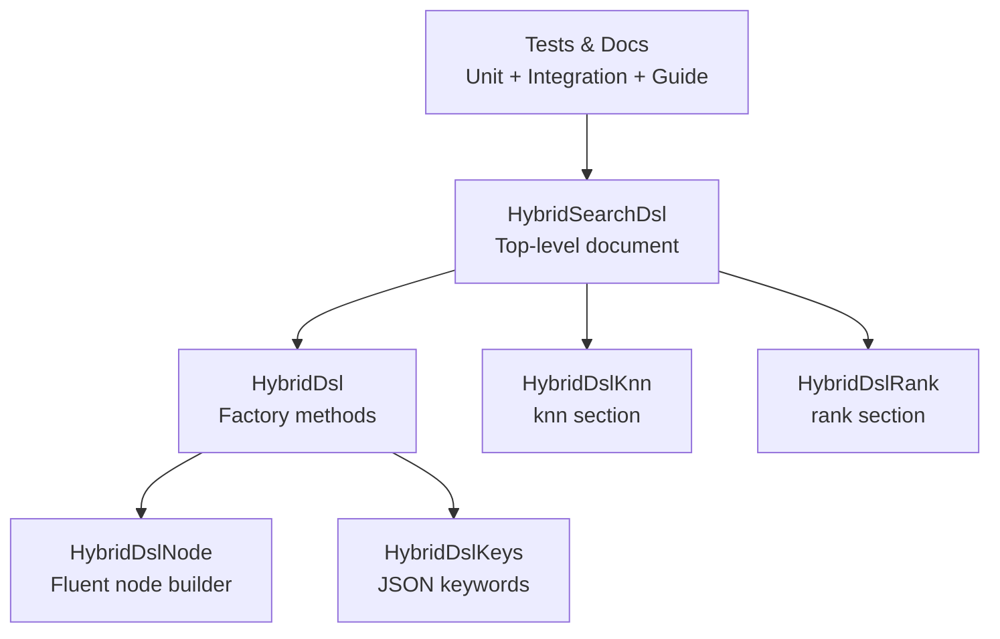
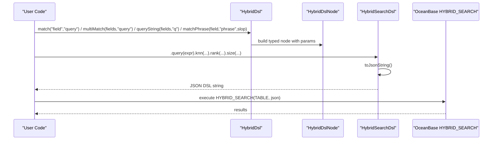
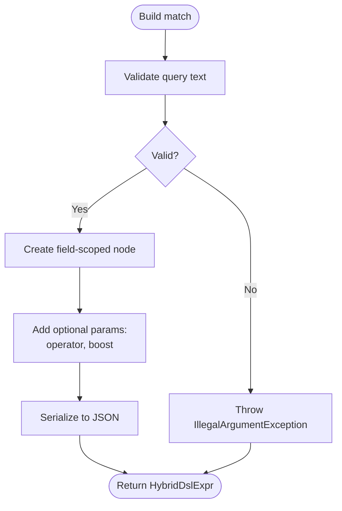
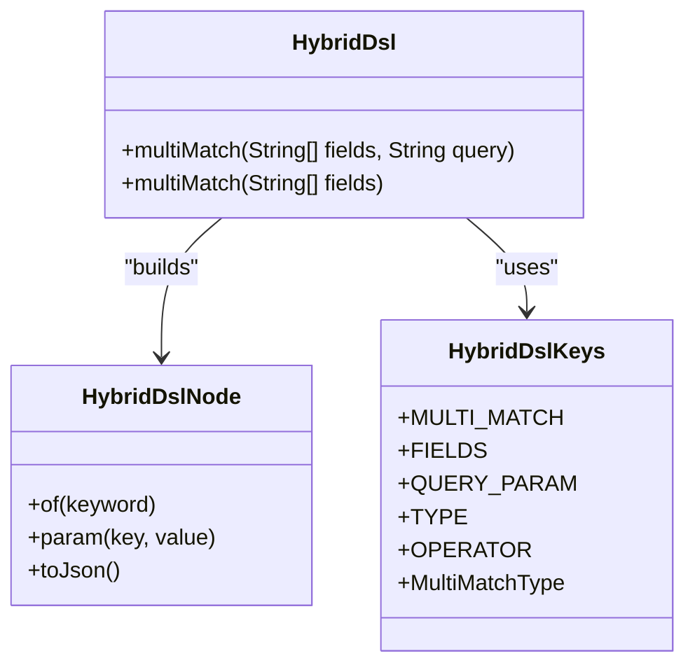
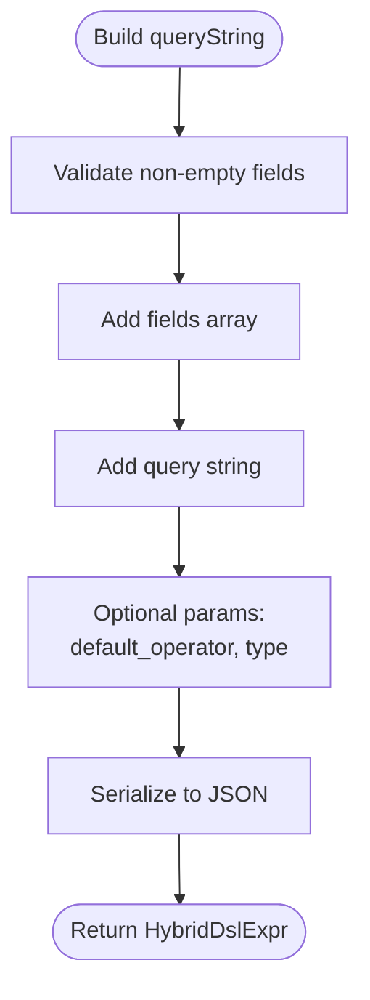
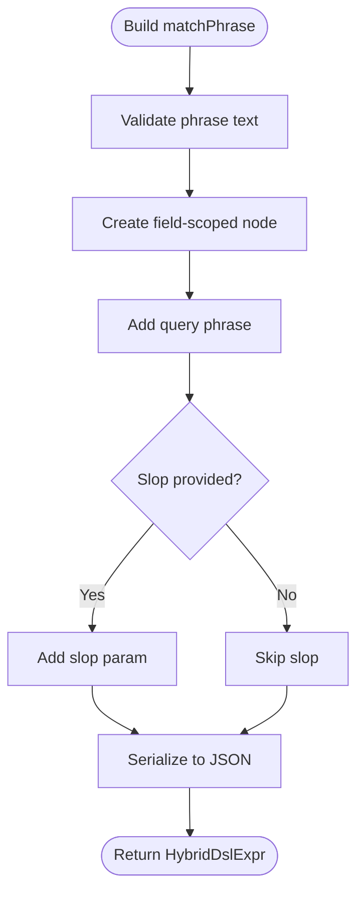
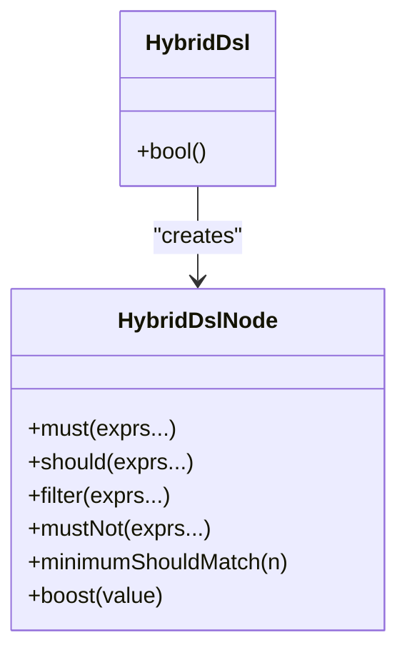
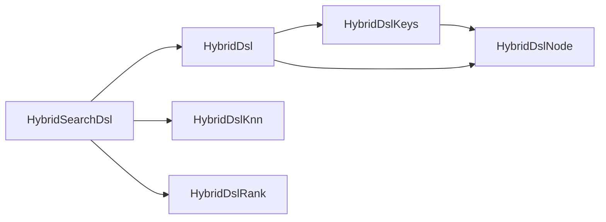

# Text Search Expressions

<cite>
**Referenced Files in This Document**
- [HybridDsl.java](file://src/main/java/com/oceanbase/obvector4j/hybrid/core/dsl/HybridDsl.java)
- [HybridDslNode.java](file://src/main/java/com/oceanbase/obvector4j/hybrid/core/dsl/HybridDslNode.java)
- [HybridDslKeys.java](file://src/main/java/com/oceanbase/obvector4j/hybrid/core/dsl/HybridDslKeys.java)
- [HybridSearchDsl.java](file://src/main/java/com/oceanbase/obvector4j/hybrid/core/HybridSearchDsl.java)
- [HybridDslKnn.java](file://src/main/java/com/oceanbase/obvector4j/hybrid/core/dsl/HybridDslKnn.java)
- [HybridDslRank.java](file://src/main/java/com/oceanbase/obvector4j/hybrid/core/dsl/HybridDslRank.java)
- [05-hybrid-search-dsl.md](file://docs/en/05-hybrid-search-dsl.md)
- [HybridDslTest.java](file://src/test/java/com/oceanbase/obvector4j/unit/HybridDslTest.java)
- [HybridSearchDocIT.java](file://src/test/java/com/oceanbase/obvector4j/integration/remote/HybridSearchDocIT.java)
</cite>

## Table of Contents
1. [Introduction](#introduction)
2. [Project Structure](#project-structure)
3. [Core Components](#core-components)
4. [Architecture Overview](#architecture-overview)
5. [Detailed Component Analysis](#detailed-component-analysis)
6. [Dependency Analysis](#dependency-analysis)
7. [Performance Considerations](#performance-considerations)
8. [Troubleshooting Guide](#troubleshooting-guide)
9. [Conclusion](#conclusion)
10. [Appendices](#appendices)

## Introduction
This document explains text search expression builders for the HYBRID_SEARCH DSL, focusing on:
- match: single-field full-text search
- multiMatch: multi-field queries with field weighting
- queryString: advanced query syntax across fields
- matchPhrase: exact phrase matching with slop support

It also covers parameter options such as boost values and field weighting, and provides examples ranging from simple keyword matching to complex boolean queries. Performance considerations and best practices are included to help optimize text search behavior.

## Project Structure
The text search expressions are implemented under the hybrid.core.dsl package and integrated into the top-level HybridSearchDsl builder. The key files include:
- Expression factories and helpers: HybridDsl, HybridDslNode
- Keyword constants: HybridDslKeys
- Top-level DSL document builder: HybridSearchDsl
- KNN and rank sections (for context): HybridDslKnn, HybridDslRank
- Documentation and tests: 05-hybrid-search-dsl.md, HybridDslTest.java, HybridSearchDocIT.java

**Diagram sources**
- [HybridDsl.java:1-237](file://src/main/java/com/oceanbase/obvector4j/hybrid/core/dsl/HybridDsl.java#L1-L237)
- [HybridDslNode.java:1-267](file://src/main/java/com/oceanbase/obvector4j/hybrid/core/dsl/HybridDslNode.java#L1-L267)
- [HybridDslKeys.java:1-134](file://src/main/java/com/oceanbase/obvector4j/hybrid/core/dsl/HybridDslKeys.java#L1-L134)
- [HybridSearchDsl.java:1-254](file://src/main/java/com/oceanbase/obvector4j/hybrid/core/HybridSearchDsl.java#L1-L254)
- [HybridDslKnn.java:1-101](file://src/main/java/com/oceanbase/obvector4j/hybrid/core/dsl/HybridDslKnn.java#L1-L101)
- [HybridDslRank.java:1-48](file://src/main/java/com/oceanbase/obvector4j/hybrid/core/dsl/HybridDslRank.java#L1-L48)

**Section sources**
- [HybridDsl.java:1-237](file://src/main/java/com/oceanbase/obvector4j/hybrid/core/dsl/HybridDsl.java#L1-L237)
- [HybridDslNode.java:1-267](file://src/main/java/com/oceanbase/obvector4j/hybrid/core/dsl/HybridDslNode.java#L1-L267)
- [HybridDslKeys.java:1-134](file://src/main/java/com/oceanbase/obvector4j/hybrid/core/dsl/HybridDslKeys.java#L1-L134)
- [HybridSearchDsl.java:1-254](file://src/main/java/com/oceanbase/obvector4j/hybrid/core/HybridSearchDsl.java#L1-L254)
- [05-hybrid-search-dsl.md:1-447](file://docs/en/05-hybrid-search-dsl.md#L1-L447)

## Core Components
- HybridDsl: Provides factory methods for text search expressions (match, multiMatch, queryString, matchPhrase), scalar filters, JSON/array filters, bool composition, knn/rank helpers, and convenience methods like textVectorRrf and textVectorWeightedSum.
- HybridDslNode: Fluent node builder that constructs typed JSON nodes for any keyword, including field-scoped parameters, range bounds, bool clauses, and validation.
- HybridDslKeys: Centralized constants for all JSON keys used by the DSL.
- HybridSearchDsl: Top-level mutable document builder that composes query, knn, rank, pagination, and min_score into a final JSON string.

Key responsibilities:
- Build and validate text search expressions
- Compose bool queries with must/should/filter/must_not
- Support field weighting via multiMatch fields array and boost parameters
- Integrate with knn and rank fusion for hybrid search

**Section sources**
- [HybridDsl.java:31-86](file://src/main/java/com/oceanbase/obvector4j/hybrid/core/dsl/HybridDsl.java#L31-L86)
- [HybridDslNode.java:35-181](file://src/main/java/com/oceanbase/obvector4j/hybrid/core/dsl/HybridDslNode.java#L35-L181)
- [HybridDslKeys.java:21-63](file://src/main/java/com/oceanbase/obvector4j/hybrid/core/dsl/HybridDslKeys.java#L21-L63)
- [HybridSearchDsl.java:16-163](file://src/main/java/com/oceanbase/obvector4j/hybrid/core/HybridSearchDsl.java#L16-L163)

## Architecture Overview
Text search expressions are built using fluent APIs and serialized into JSON objects conforming to the HYBRID_SEARCH DSL specification. The flow is:
- User calls HybridDsl factory methods to create expression nodes
- Nodes are composed into a HybridSearchDsl document
- The document serializes to a JSON string executed by OceanBase HYBRID_SEARCH

**Diagram sources**
- [HybridDsl.java:31-86](file://src/main/java/com/oceanbase/obvector4j/hybrid/core/dsl/HybridDsl.java#L31-L86)
- [HybridDslNode.java:35-181](file://src/main/java/com/oceanbase/obvector4j/hybrid/core/dsl/HybridDslNode.java#L35-L181)
- [HybridSearchDsl.java:199-227](file://src/main/java/com/oceanbase/obvector4j/hybrid/core/HybridSearchDsl.java#L199-L227)

## Detailed Component Analysis

### match: Single-field full-text search
- Purpose: Term-level match on one field; supports operator and boost parameters.
- Builder usage:
  - Simple form: field and query provided directly
  - Parameterized form: use field-only builder to add query, operator, boost, etc.
- Key parameters:
  - query: search text
  - operator: OR or AND
  - boost: field-level boost value
- Examples:
  - Simple match: see [HybridDslTest.java:14-29](file://src/test/java/com/oceanbase/obvector4j/unit/HybridDslTest.java#L14-L29)
  - Match with boost: see [HybridDslTest.java:78-93](file://src/test/java/com/oceanbase/obvector4j/unit/HybridDslTest.java#L78-L93)
  - Integration example: see [HybridSearchDocIT.java:104-122](file://src/test/java/com/oceanbase/obvector4j/integration/remote/HybridSearchDocIT.java#L104-L122)

**Diagram sources**
- [HybridDsl.java:33-42](file://src/main/java/com/oceanbase/obvector4j/hybrid/core/dsl/HybridDsl.java#L33-L42)
- [HybridDslNode.java:38-54](file://src/main/java/com/oceanbase/obvector4j/hybrid/core/dsl/HybridDslNode.java#L38-L54)
- [HybridDslNode.java:261-265](file://src/main/java/com/oceanbase/obvector4j/hybrid/core/dsl/HybridDslNode.java#L261-L265)

**Section sources**
- [HybridDsl.java:33-42](file://src/main/java/com/oceanbase/obvector4j/hybrid/core/dsl/HybridDsl.java#L33-L42)
- [HybridDslNode.java:38-54](file://src/main/java/com/oceanbase/obvector4j/hybrid/core/dsl/HybridDslNode.java#L38-L54)
- [HybridDslTest.java:14-29](file://src/test/java/com/oceanbase/obvector4j/unit/HybridDslTest.java#L14-L29)
- [HybridDslTest.java:78-93](file://src/test/java/com/oceanbase/obvector4j/unit/HybridDslTest.java#L78-L93)
- [HybridSearchDocIT.java:104-122](file://src/test/java/com/oceanbase/obvector4j/integration/remote/HybridSearchDocIT.java#L104-L122)

### multiMatch: Multi-field queries with field weighting
- Purpose: Search across multiple fields; supports field weighting via "^weight" syntax in fields array and type/operator parameters.
- Builder usage:
  - Provide fields array and query text
  - Use fields with weights like "title^0.3"
  - Set type (best_fields, most_fields) and operator (OR, AND)
- Key parameters:
  - fields: array of field names with optional weights
  - query: search text
  - type: best_fields or most_fields
  - operator: OR or AND
- Examples:
  - Basic multiMatch: see [HybridDslTest.java:52-65](file://src/test/java/com/oceanbase/obvector4j/unit/HybridDslTest.java#L52-L65)
  - Field weighting and type/operator: see [HybridDslTest.java:142-155](file://src/test/java/com/oceanbase/obvector4j/unit/HybridDslTest.java#L142-L155)
  - In bool should clause: see [HybridDslTest.java:126-140](file://src/test/java/com/oceanbase/obvector4j/unit/HybridDslTest.java#L126-L140)

**Diagram sources**
- [HybridDsl.java:44-56](file://src/main/java/com/oceanbase/obvector4j/hybrid/core/dsl/HybridDsl.java#L44-L56)
- [HybridDslNode.java:56-60](file://src/main/java/com/oceanbase/obvector4j/hybrid/core/dsl/HybridDslNode.java#L56-L60)
- [HybridDslKeys.java:24-26](file://src/main/java/com/oceanbase/obvector4j/hybrid/core/dsl/HybridDslKeys.java#L24-L26)

**Section sources**
- [HybridDsl.java:44-56](file://src/main/java/com/oceanbase/obvector4j/hybrid/core/dsl/HybridDsl.java#L44-L56)
- [HybridDslNode.java:56-60](file://src/main/java/com/oceanbase/obvector4j/hybrid/core/dsl/HybridDslNode.java#L56-L60)
- [HybridDslKeys.java:24-26](file://src/main/java/com/oceanbase/obvector4j/hybrid/core/dsl/HybridDslKeys.java#L24-L26)
- [HybridDslTest.java:52-65](file://src/test/java/com/oceanbase/obvector4j/unit/HybridDslTest.java#L52-L65)
- [HybridDslTest.java:142-155](file://src/test/java/com/oceanbase/obvector4j/unit/HybridDslTest.java#L142-L155)
- [HybridDslTest.java:126-140](file://src/test/java/com/oceanbase/obvector4j/unit/HybridDslTest.java#L126-L140)

### queryString: Advanced query syntax
- Purpose: Full query-string syntax across specified fields, enabling operators, grouping, and advanced patterns.
- Builder usage:
  - Provide fields array and query string
  - Supports default_operator and other query_string parameters via param
- Key parameters:
  - fields: array of target fields
  - query: query string
  - default_operator: AND or OR
- Examples:
  - Basic queryString: see [HybridDsl.java:58-71](file://src/main/java/com/oceanbase/obvector4j/hybrid/core/dsl/HybridDsl.java#L58-L71)
  - Usage in docs: see [05-hybrid-search-dsl.md:167-171](file://docs/en/05-hybrid-search-dsl.md#L167-L171)

**Diagram sources**
- [HybridDsl.java:58-71](file://src/main/java/com/oceanbase/obvector4j/hybrid/core/dsl/HybridDsl.java#L58-L71)
- [HybridDslNode.java:226-230](file://src/main/java/com/oceanbase/obvector4j/hybrid/core/dsl/HybridDslNode.java#L226-L230)

**Section sources**
- [HybridDsl.java:58-71](file://src/main/java/com/oceanbase/obvector4j/hybrid/core/dsl/HybridDsl.java#L58-L71)
- [05-hybrid-search-dsl.md:167-171](file://docs/en/05-hybrid-search-dsl.md#L167-L171)

### matchPhrase: Exact phrase matching with slop
- Purpose: Phrase match with optional slop to allow word reordering and insertions/deletions.
- Builder usage:
  - Provide field, query phrase, and optional slop integer
- Key parameters:
  - query: phrase text
  - slop: allowed distance between terms
- Examples:
  - Basic matchPhrase: see [HybridDsl.java:73-86](file://src/main/java/com/oceanbase/obvector4j/hybrid/core/dsl/HybridDsl.java#L73-L86)
  - Usage in docs: see [05-hybrid-search-dsl.md:161-165](file://docs/en/05-hybrid-search-dsl.md#L161-L165)

**Diagram sources**
- [HybridDsl.java:73-86](file://src/main/java/com/oceanbase/obvector4j/hybrid/core/dsl/HybridDsl.java#L73-L86)
- [HybridDslNode.java:38-54](file://src/main/java/com/oceanbase/obvector4j/hybrid/core/dsl/HybridDslNode.java#L38-L54)

**Section sources**
- [HybridDsl.java:73-86](file://src/main/java/com/oceanbase/obvector4j/hybrid/core/dsl/HybridDsl.java#L73-L86)
- [05-hybrid-search-dsl.md:161-165](file://docs/en/05-hybrid-search-dsl.md#L161-L165)

### Boolean Queries and Composition
- Purpose: Combine text and scalar conditions using must, should, filter, must_not; control scoring and filtering semantics.
- Key behaviors:
  - must/should contribute to scoring; filter/must_not do not
  - minimum_should_match defaults depend on presence of must/filter
- Examples:
  - Bool with must and filter: see [HybridDslTest.java:31-50](file://src/test/java/com/oceanbase/obvector4j/unit/HybridDslTest.java#L31-L50)
  - Bool with should and filter, explicit minimum_should_match: see [HybridSearchDocIT.java:230-267](file://src/test/java/com/oceanbase/obvector4j/integration/remote/HybridSearchDocIT.java#L230-L267)
  - Bool boost: see [HybridDslTest.java:126-140](file://src/test/java/com/oceanbase/obvector4j/unit/HybridDslTest.java#L126-L140)

**Diagram sources**
- [HybridDslNode.java:133-168](file://src/main/java/com/oceanbase/obvector4j/hybrid/core/dsl/HybridDslNode.java#L133-L168)
- [HybridDsl.java:148-151](file://src/main/java/com/oceanbase/obvector4j/hybrid/core/dsl/HybridDsl.java#L148-L151)

**Section sources**
- [HybridDslNode.java:133-168](file://src/main/java/com/oceanbase/obvector4j/hybrid/core/dsl/HybridDslNode.java#L133-L168)
- [HybridDslTest.java:31-50](file://src/test/java/com/oceanbase/obvector4j/unit/HybridDslTest.java#L31-L50)
- [HybridSearchDocIT.java:230-267](file://src/test/java/com/oceanbase/obvector4j/integration/remote/HybridSearchDocIT.java#L230-L267)
- [HybridDslTest.java:126-140](file://src/test/java/com/oceanbase/obvector4j/unit/HybridDslTest.java#L126-L140)

### Boost Values and Field Weighting
- Field-level boost:
  - match.boost: increases influence of a specific field’s score
  - knn.boost: adjusts vector branch contribution in fusion
- Field weighting in multiMatch:
  - Use "field^weight" entries in fields array
  - Optionally set type (best_fields, most_fields) and operator (OR, AND)
- Examples:
  - match.boost and weighted_sum normalization: see [HybridDslTest.java:78-93](file://src/test/java/com/oceanbase/obvector4j/unit/HybridDslTest.java#L78-L93)
  - WRRF with boosts: see [HybridSearchDocIT.java:195-210](file://src/test/java/com/oceanbase/obvector4j/integration/remote/HybridSearchDocIT.java#L195-L210)
  - multiMatch field weights: see [HybridDslTest.java:142-155](file://src/test/java/com/oceanbase/obvector4j/unit/HybridDslTest.java#L142-L155)

**Section sources**
- [HybridDslTest.java:78-93](file://src/test/java/com/oceanbase/obvector4j/unit/HybridDslTest.java#L78-L93)
- [HybridSearchDocIT.java:195-210](file://src/test/java/com/oceanbase/obvector4j/integration/remote/HybridSearchDocIT.java#L195-L210)
- [HybridDslTest.java:142-155](file://src/test/java/com/oceanbase/obvector4j/unit/HybridDslTest.java#L142-L155)

### Query Optimization Techniques
- Rank fusion strategies:
  - RRF (Reciprocal Rank Fusion) with window size and constant
  - Weighted sum with normalizer (none, minmax) and optional rank_window_size
- Min-score filtering:
  - Apply min_score to threshold fused scores
- Examples:
  - RRF setup: see [HybridDslTest.java:110-124](file://src/test/java/com/oceanbase/obvector4j/unit/HybridDslTest.java#L110-L124)
  - Weighted sum minmax with min_score: see [HybridSearchDocIT.java:212-228](file://src/test/java/com/oceanbase/obvector4j/integration/remote/HybridSearchDocIT.java#L212-L228)
  - Convenience helpers: see [HybridDsl.java:175-200](file://src/main/java/com/oceanbase/obvector4j/hybrid/core/dsl/HybridDsl.java#L175-L200)

**Section sources**
- [HybridDslTest.java:110-124](file://src/test/java/com/oceanbase/obvector4j/unit/HybridDslTest.java#L110-L124)
- [HybridSearchDocIT.java:212-228](file://src/test/java/com/oceanbase/obvector4j/integration/remote/HybridSearchDocIT.java#L212-L228)
- [HybridDsl.java:175-200](file://src/main/java/com/oceanbase/obvector4j/hybrid/core/dsl/HybridDsl.java#L175-L200)

## Dependency Analysis
Text search expression builders rely on shared constants and a common node-building mechanism. The relationships are:

**Diagram sources**
- [HybridDslKeys.java:1-134](file://src/main/java/com/oceanbase/obvector4j/hybrid/core/dsl/HybridDslKeys.java#L1-L134)
- [HybridDslNode.java:1-267](file://src/main/java/com/oceanbase/obvector4j/hybrid/core/dsl/HybridDslNode.java#L1-L267)
- [HybridDsl.java:1-237](file://src/main/java/com/oceanbase/obvector4j/hybrid/core/dsl/HybridDsl.java#L1-L237)
- [HybridSearchDsl.java:1-254](file://src/main/java/com/oceanbase/obvector4j/hybrid/core/HybridSearchDsl.java#L1-L254)
- [HybridDslKnn.java:1-101](file://src/main/java/com/oceanbase/obvector4j/hybrid/core/dsl/HybridDslKnn.java#L1-L101)
- [HybridDslRank.java:1-48](file://src/main/java/com/oceanbase/obvector4j/hybrid/core/dsl/HybridDslRank.java#L1-L48)

**Section sources**
- [HybridDslKeys.java:1-134](file://src/main/java/com/oceanbase/obvector4j/hybrid/core/dsl/HybridDslKeys.java#L1-L134)
- [HybridDslNode.java:1-267](file://src/main/java/com/oceanbase/obvector4j/hybrid/core/dsl/HybridDslNode.java#L1-L267)
- [HybridDsl.java:1-237](file://src/main/java/com/oceanbase/obvector4j/hybrid/core/dsl/HybridDsl.java#L1-L237)
- [HybridSearchDsl.java:1-254](file://src/main/java/com/oceanbase/obvector4j/hybrid/core/HybridSearchDsl.java#L1-L254)

## Performance Considerations
- Prefer filter clauses for scalar/json/array conditions to avoid unnecessary scoring overhead.
- Use appropriate rank fusion:
  - RRF for robust ranking without normalization
  - Weighted sum with minmax when combining disparate score ranges; pair with min_score
- Tune knn search_options (ef_search, refine_k, filter_mode) to balance accuracy and latency.
- Limit top-level sub-queries: one query plus up to three knn paths.
- Use string-form query_vector for efficiency.

[No sources needed since this section provides general guidance]

## Troubleshooting Guide
Common issues and validations:
- Empty or invalid query text: constructors enforce non-empty text and throw exceptions.
- Empty fields arrays: multiMatch and queryString require non-empty fields.
- Range without bounds: building a range node without gte/gt/lte/lt throws an error at serialization.
- Empty bool query: bool must have at least one clause; otherwise serialization fails.
- Invalid JSON inputs: raw DSL and merge operations parse and validate JSON strings.

Examples of validation points:
- Require text validation: see [HybridDslNode.java:261-265](file://src/main/java/com/oceanbase/obvector4j/hybrid/core/dsl/HybridDslNode.java#L261-L265)
- Require non-empty fields: see [HybridDslNode.java:255-259](file://src/main/java/com/oceanbase/obvector4j/hybrid/core/dsl/HybridDslNode.java#L255-L259)
- Range bounds check: see [HybridDslNode.java:172-174](file://src/main/java/com/oceanbase/obvector4j/hybrid/core/dsl/HybridDslNode.java#L172-L174)
- Bool empty check: see [HybridDslNode.java:175-177](file://src/main/java/com/oceanbase/obvector4j/hybrid/core/dsl/HybridDslNode.java#L175-L177)
- Raw DSL parsing errors: see [HybridSearchDsl.java:229-237](file://src/main/java/com/oceanbase/obvector4j/hybrid/core/HybridSearchDsl.java#L229-L237)

**Section sources**
- [HybridDslNode.java:255-265](file://src/main/java/com/oceanbase/obvector4j/hybrid/core/dsl/HybridDslNode.java#L255-L265)
- [HybridDslNode.java:172-177](file://src/main/java/com/oceanbase/obvector4j/hybrid/core/dsl/HybridDslNode.java#L172-L177)
- [HybridSearchDsl.java:229-237](file://src/main/java/com/oceanbase/obvector4j/hybrid/core/HybridSearchDsl.java#L229-L237)

## Conclusion
The HYBRID_SEARCH DSL text search builders provide a concise, fluent API for constructing powerful full-text queries. With match, multiMatch, queryString, and matchPhrase, users can implement everything from simple keyword searches to complex boolean combinations. Boost values and field weighting enable fine-grained control over relevance, while rank fusion and min_score offer optimization strategies. Proper use of filter clauses and knn search options further improves performance and result quality.

[No sources needed since this section summarizes without analyzing specific files]

## Appendices
- Reference documentation: see [05-hybrid-search-dsl.md:126-194](file://docs/en/05-hybrid-search-dsl.md#L126-L194)
- Unit test coverage: see [HybridDslTest.java:1-157](file://src/test/java/com/oceanbase/obvector4j/unit/HybridDslTest.java#L1-L157)
- Integration examples: see [HybridSearchDocIT.java:104-297](file://src/test/java/com/oceanbase/obvector4j/integration/remote/HybridSearchDocIT.java#L104-L297)

**Section sources**
- [05-hybrid-search-dsl.md:126-194](file://docs/en/05-hybrid-search-dsl.md#L126-L194)
- [HybridDslTest.java:1-157](file://src/test/java/com/oceanbase/obvector4j/unit/HybridDslTest.java#L1-L157)
- [HybridSearchDocIT.java:104-297](file://src/test/java/com/oceanbase/obvector4j/integration/remote/HybridSearchDocIT.java#L104-L297)