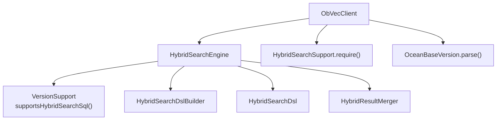
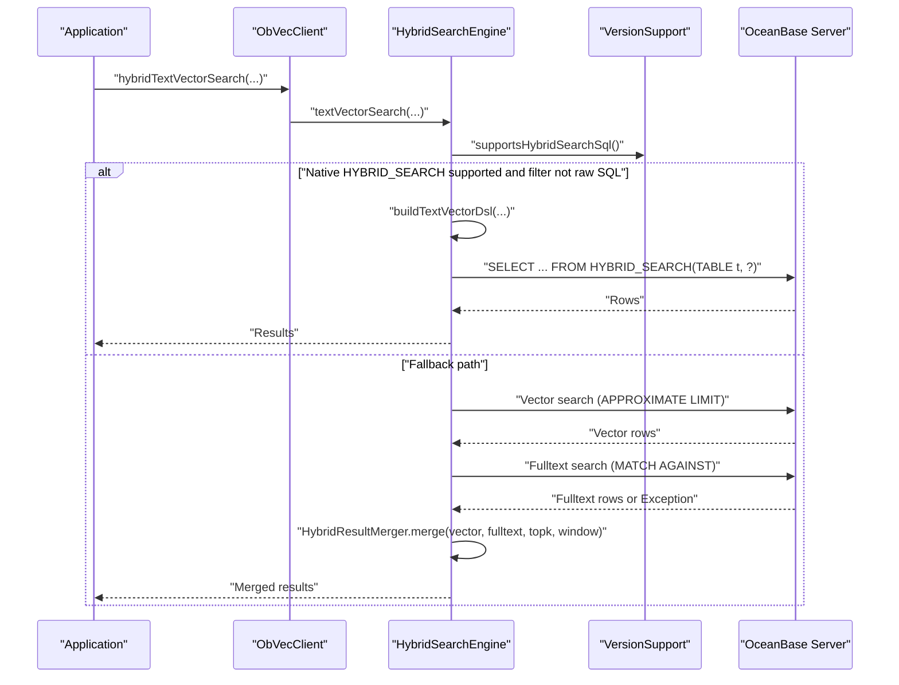
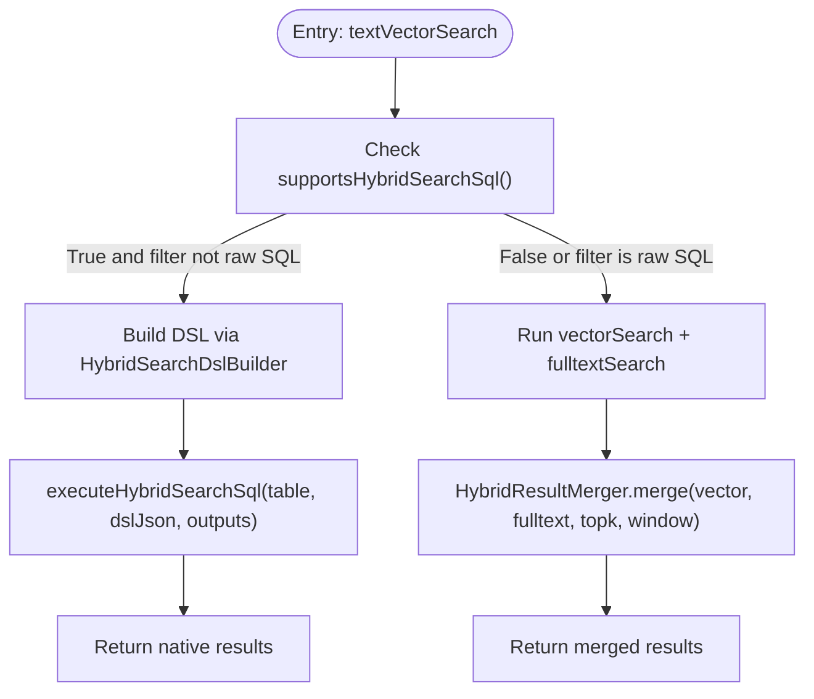
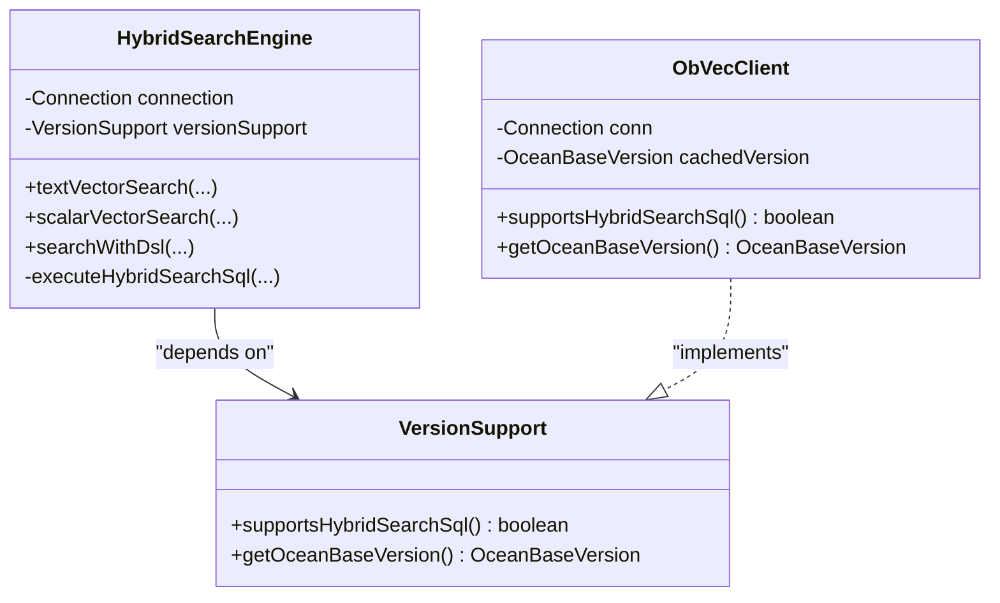
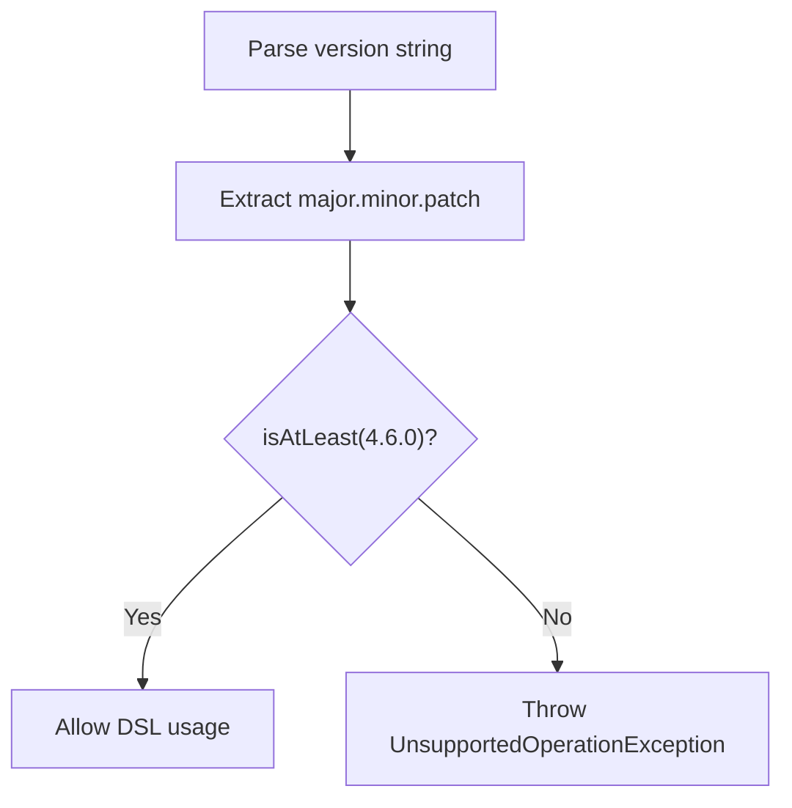
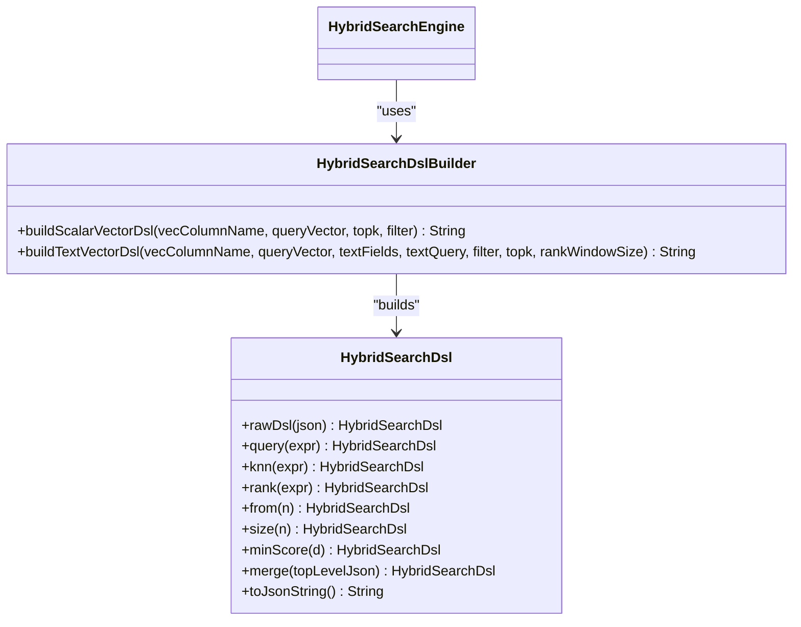
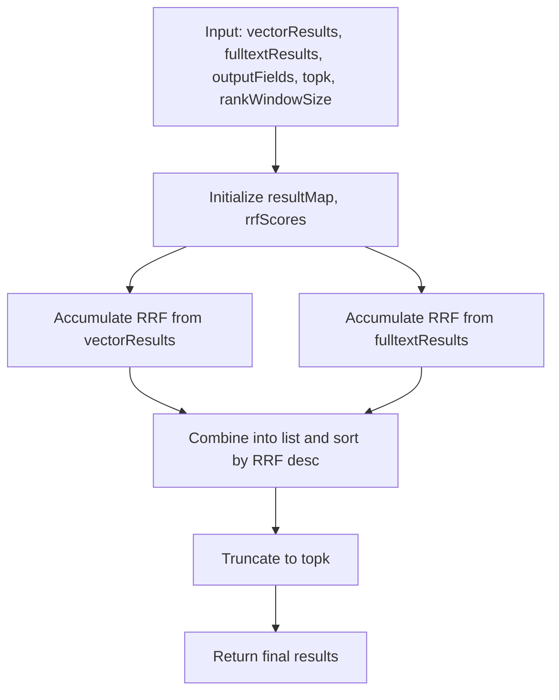
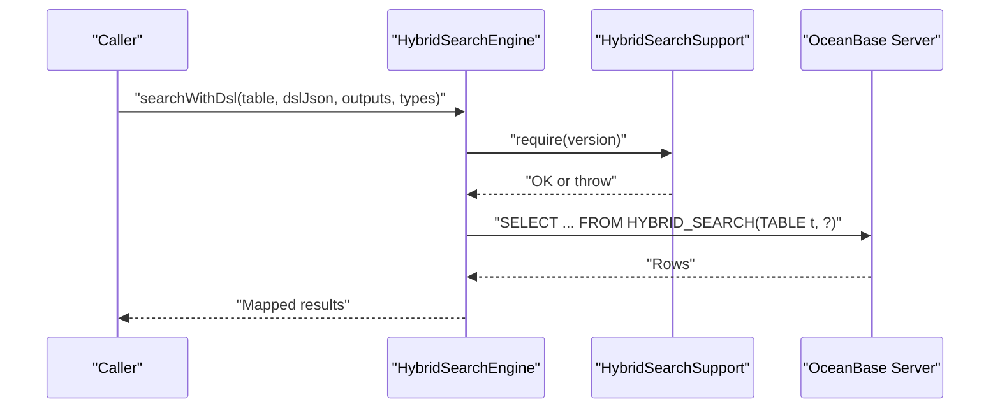
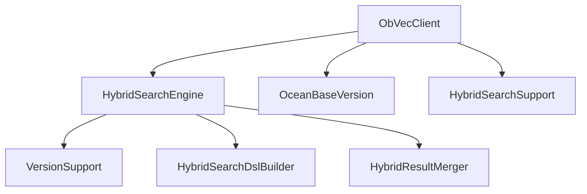

# Hybrid Search Engine Core

<cite>
**Referenced Files in This Document**
- [HybridSearchEngine.java](file://src/main/java/com/oceanbase/obvector4j/hybrid/HybridSearchEngine.java)
- [ObVecClient.java](file://src/main/java/com/oceanbase/obvector4j/ObVecClient.java)
- [OceanBaseVersion.java](file://src/main/java/com/oceanbase/obvector4j/version/OceanBaseVersion.java)
- [HybridSearchSupport.java](file://src/main/java/com/oceanbase/obvector4j/hybrid/core/HybridSearchSupport.java)
- [HybridSearchDsl.java](file://src/main/java/com/oceanbase/obvector4j/hybrid/core/HybridSearchDsl.java)
- [HybridSearchDslBuilder.java](file://src/main/java/com/oceanbase/obvector4j/hybrid/core/HybridSearchDslBuilder.java)
- [HybridResultMerger.java](file://src/main/java/com/oceanbase/obvector4j/hybrid/HybridResultMerger.java)
</cite>

## Update Summary
**Changes Made**
- Updated error handling section to reflect improved exception propagation in fulltext search operations
- Revised troubleshooting guide to address new error visibility behavior
- Updated performance considerations regarding error handling patterns

## Table of Contents
1. [Introduction](#introduction)
2. [Project Structure](#project-structure)
3. [Core Components](#core-components)
4. [Architecture Overview](#architecture-overview)
5. [Detailed Component Analysis](#detailed-component-analysis)
6. [Dependency Analysis](#dependency-analysis)
7. [Performance Considerations](#performance-considerations)
8. [Troubleshooting Guide](#troubleshooting-guide)
9. [Conclusion](#conclusion)
10. [Appendices](#appendices)

## Introduction
This document explains the core implementation of the Hybrid Search Engine, focusing on its intelligent query strategy selection mechanism that automatically routes between native HYBRID_SEARCH SQL (available in OceanBase 4.6.0+) and legacy SQL approaches based on runtime version compatibility detection. It documents the VersionSupport interface, connection management, decision logic for choosing optimal search strategies, the executeHybridSearchSql method for direct DSL execution, error handling patterns, and performance considerations. Practical examples are provided to demonstrate version-aware query construction, fallback mechanisms when native features are unavailable, and best practices for production deployment.

## Project Structure
The hybrid search functionality is implemented across a small set of cohesive modules:
- Strategy routing and execution: HybridSearchEngine
- Version detection and gating: ObVecClient, OceanBaseVersion, HybridSearchSupport
- DSL construction for native HYBRID_SEARCH: HybridSearchDsl, HybridSearchDslBuilder
- Legacy result merging: HybridResultMerger

**Diagram sources**
- [ObVecClient.java](file://src/main/java/com/oceanbase/obvector4j/ObVecClient.java)
- [HybridSearchEngine.java](file://src/main/java/com/oceanbase/obvector4j/hybrid/HybridSearchEngine.java)
- [HybridSearchDslBuilder.java](file://src/main/java/com/oceanbase/obvector4j/hybrid/core/HybridSearchDslBuilder.java)
- [HybridSearchDsl.java](file://src/main/java/com/oceanbase/obvector4j/hybrid/core/HybridSearchDsl.java)
- [HybridResultMerger.java](file://src/main/java/com/oceanbase/obvector4j/hybrid/HybridResultMerger.java)
- [HybridSearchSupport.java](file://src/main/java/com/oceanbase/obvector4j/hybrid/core/HybridSearchSupport.java)
- [OceanBaseVersion.java](file://src/main/java/com/oceanbase/obvector4j/version/OceanBaseVersion.java)

**Section sources**
- [HybridSearchEngine.java](file://src/main/java/com/oceanbase/obvector4j/hybrid/HybridSearchEngine.java)
- [ObVecClient.java](file://src/main/java/com/oceanbase/obvector4j/ObVecClient.java)
- [OceanBaseVersion.java](file://src/main/java/com/oceanbase/obvector4j/version/OceanBaseVersion.java)
- [HybridSearchSupport.java](file://src/main/java/com/oceanbase/obvector4j/hybrid/core/HybridSearchSupport.java)
- [HybridSearchDsl.java](file://src/main/java/com/oceanbase/obvector4j/hybrid/core/HybridSearchDsl.java)
- [HybridSearchDslBuilder.java](file://src/main/java/com/oceanbase/obvector4j/hybrid/core/HybridSearchDslBuilder.java)
- [HybridResultMerger.java](file://src/main/java/com/oceanbase/obvector4j/hybrid/HybridResultMerger.java)

## Core Components
- HybridSearchEngine: Central orchestrator that selects between native HYBRID_SEARCH SQL and legacy vector + fulltext fallback paths. It exposes textVectorSearch and scalarVectorSearch methods, plus searchWithDsl for direct DSL execution. Internally uses executeHybridSearchSql for native execution and legacy helpers for fallback.
- VersionSupport: Interface used by HybridSearchEngine to detect whether the connected OceanBase supports HYBRID_SEARCH SQL and to retrieve the parsed version.
- ObVecClient: Provides connection management, version parsing, and implements VersionSupport. It also gates access to the 4.6.0+ DSL entry points via HybridSearchSupport.require.
- HybridSearchSupport: Static gate that enforces minimum version requirements for DSL APIs.
- HybridSearchDsl and HybridSearchDslBuilder: Build JSON DSL documents consumed by HYBRID_SEARCH SQL. The builder provides convenience methods for common scenarios (scalar-vector and text-vector).
- HybridResultMerger: Implements Reciprocal Rank Fusion (RRF) to merge results from vector and fulltext searches in the legacy path.

Key responsibilities:
- Intelligent routing: Choose native HYBRID_SEARCH SQL when supported and filters are compatible; otherwise fall back to legacy approach.
- Version detection: Parse server version strings and compare against feature thresholds.
- Execution: Prepare and execute SQL statements with parameter binding and map results into typed Sqlizable objects.
- Error handling: Validate inputs, enforce version constraints, and propagate errors appropriately for proper debugging and monitoring.

**Section sources**
- [HybridSearchEngine.java](file://src/main/java/com/oceanbase/obvector4j/hybrid/HybridSearchEngine.java)
- [ObVecClient.java](file://src/main/java/com/oceanbase/obvector4j/ObVecClient.java)
- [HybridSearchSupport.java](file://src/main/java/com/oceanbase/obvector4j/hybrid/core/HybridSearchSupport.java)
- [HybridSearchDsl.java](file://src/main/java/com/oceanbase/obvector4j/hybrid/core/HybridSearchDsl.java)
- [HybridSearchDslBuilder.java](file://src/main/java/com/oceanbase/obvector4j/hybrid/core/HybridSearchDslBuilder.java)
- [HybridResultMerger.java](file://src/main/java/com/oceanbase/obvector4j/hybrid/HybridResultMerger.java)

## Architecture Overview
The system follows a strategy pattern driven by runtime version detection. When a client invokes hybrid search, the engine checks if the database supports native HYBRID_SEARCH SQL. If yes and filters are compatible, it builds a DSL JSON and executes it directly. Otherwise, it performs separate vector and fulltext queries and merges results using RRF.

**Diagram sources**
- [ObVecClient.java](file://src/main/java/com/oceanbase/obvector4j/ObVecClient.java)
- [HybridSearchEngine.java](file://src/main/java/com/oceanbase/obvector4j/hybrid/HybridSearchEngine.java)
- [HybridSearchDslBuilder.java](file://src/main/java/com/oceanbase/obvector4j/hybrid/core/HybridSearchDslBuilder.java)
- [HybridResultMerger.java](file://src/main/java/com/oceanbase/obvector4j/hybrid/HybridResultMerger.java)

## Detailed Component Analysis

### HybridSearchEngine: Strategy Selection and Execution
Responsibilities:
- Route queries to native HYBRID_SEARCH SQL or legacy fallback based on VersionSupport.
- Build DSL JSON for native execution via HybridSearchDslBuilder.
- Execute native SQL through executeHybridSearchSql.
- Perform legacy vector and fulltext searches and merge results with HybridResultMerger.

Decision logic:
- For textVectorSearch: If supportsHybridSearchSql() returns true and filterExpr is not a raw SQL string, build DSL and use native path. Otherwise, run vectorSearch and fulltextSearch separately and merge.
- For scalarVectorSearch: If supportsHybridSearchSql() returns true and filterExpr is not a raw SQL string, build DSL and use native path. Otherwise, run vectorSearch only.

Execution details:
- executeHybridSearchSql constructs SELECT ... FROM HYBRID_SEARCH(TABLE `table`, ?), binds DSL JSON, and maps ResultSet columns to typed Sqlizable values using output fields and data types.
- Legacy vectorSearch computes distance and score expressions based on metric type and uses APPROXIMATE LIMIT for performance.
- Legacy fulltextSearch uses MATCH AGAINST IN NATURAL LANGUAGE MODE and now properly propagates exceptions rather than swallowing them silently.

**Updated** Fulltext search operations now propagate exceptions instead of returning empty results, ensuring failures are visible to calling code for proper error handling and debugging.

**Diagram sources**
- [HybridSearchEngine.java](file://src/main/java/com/oceanbase/obvector4j/hybrid/HybridSearchEngine.java)
- [HybridSearchDslBuilder.java](file://src/main/java/com/oceanbase/obvector4j/hybrid/core/HybridSearchDslBuilder.java)
- [HybridResultMerger.java](file://src/main/java/com/oceanbase/obvector4j/hybrid/HybridResultMerger.java)

**Section sources**
- [HybridSearchEngine.java](file://src/main/java/com/oceanbase/obvector4j/hybrid/HybridSearchEngine.java)

### VersionSupport Interface and Connection Management
VersionSupport abstracts version detection and allows HybridSearchEngine to remain decoupled from connection specifics. ObVecClient implements this interface and caches the parsed OceanBaseVersion for reuse.

Key behaviors:
- supportsHybridSearchSql(): Compares current version against HYBRID_SEARCH_SQL_MIN threshold.
- getOceanBaseVersion(): Returns parsed version object.
- Connection lifecycle: ObVecClient manages JDBC Connection creation and resource cleanup in other operations; HybridSearchEngine reuses the provided connection for prepared statements.

**Diagram sources**
- [HybridSearchEngine.java](file://src/main/java/com/oceanbase/obvector4j/hybrid/HybridSearchEngine.java)
- [ObVecClient.java](file://src/main/java/com/oceanbase/obvector4j/ObVecClient.java)

**Section sources**
- [HybridSearchEngine.java](file://src/main/java/com/oceanbase/obvector4j/hybrid/HybridSearchEngine.java)
- [ObVecClient.java](file://src/main/java/com/oceanbase/obvector4j/ObVecClient.java)

### Version Detection and Gating
OceanBaseVersion parses version strings and compares semantic versions. HybridSearchSupport enforces minimum version requirements for DSL APIs.

Highlights:
- Parsing supports both generic version strings and OceanBase-specific formats.
- Comparison uses major.minor.patch ordering.
- require(version) throws an exception if below 4.6.0, preventing misuse of DSL APIs.

**Diagram sources**
- [OceanBaseVersion.java](file://src/main/java/com/oceanbase/obvector4j/version/OceanBaseVersion.java)
- [HybridSearchSupport.java](file://src/main/java/com/oceanbase/obvector4j/hybrid/core/HybridSearchSupport.java)

**Section sources**
- [OceanBaseVersion.java](file://src/main/java/com/oceanbase/obvector4j/version/OceanBaseVersion.java)
- [HybridSearchSupport.java](file://src/main/java/com/oceanbase/obvector4j/hybrid/core/HybridSearchSupport.java)

### DSL Construction for Native HYBRID_SEARCH
HybridSearchDslBuilder provides convenience methods to construct DSL JSON for common scenarios:
- buildScalarVectorDsl: Builds knn expression with optional filter and size=topk.
- buildTextVectorDsl: Combines match/multiMatch query with knn and rrf rank, adjusting knnK and windowSize based on rankWindowSize.

HybridSearchDsl offers fluent APIs to compose query, knn, rank, from, size, min_score, and merge additional keys.

**Diagram sources**
- [HybridSearchDslBuilder.java](file://src/main/java/com/oceanbase/obvector4j/hybrid/core/HybridSearchDslBuilder.java)
- [HybridSearchDsl.java](file://src/main/java/com/oceanbase/obvector4j/hybrid/core/HybridSearchDsl.java)

**Section sources**
- [HybridSearchDslBuilder.java](file://src/main/java/com/oceanbase/obvector4j/hybrid/core/HybridSearchDslBuilder.java)
- [HybridSearchDsl.java](file://src/main/java/com/oceanbase/obvector4j/hybrid/core/HybridSearchDsl.java)

### Legacy Result Merging (RRF)
When native HYBRID_SEARCH is unavailable, the engine runs vector and fulltext searches separately and merges them using Reciprocal Rank Fusion. The algorithm:
- Accumulates ranks from both result sets.
- Computes RRF scores using k (window size) and rank position.
- Sorts combined results by descending RRF score and truncates to topk.

**Diagram sources**
- [HybridResultMerger.java](file://src/main/java/com/oceanbase/obvector4j/hybrid/HybridResultMerger.java)

**Section sources**
- [HybridResultMerger.java](file://src/main/java/com/oceanbase/obvector4j/hybrid/HybridResultMerger.java)

### Direct DSL Execution: searchWithDsl and executeHybridSearchSql
- searchWithDsl: Validates version via HybridSearchSupport.require, validates output fields, and delegates to executeHybridSearchSql.
- executeHybridSearchSql: Constructs SELECT ... FROM HYBRID_SEARCH(TABLE table, ?), binds DSL JSON, iterates ResultSet, and maps each column to typed Sqlizable values using SqlizableFactory.

**Diagram sources**
- [HybridSearchEngine.java](file://src/main/java/com/oceanbase/obvector4j/hybrid/HybridSearchEngine.java)
- [HybridSearchSupport.java](file://src/main/java/com/oceanbase/obvector4j/hybrid/core/HybridSearchSupport.java)

**Section sources**
- [HybridSearchEngine.java](file://src/main/java/com/oceanbase/obvector4j/hybrid/HybridSearchEngine.java)
- [HybridSearchSupport.java](file://src/main/java/com/oceanbase/obvector4j/hybrid/core/HybridSearchSupport.java)

## Dependency Analysis
The following diagram shows key dependencies among components involved in hybrid search execution and version gating.

**Diagram sources**
- [ObVecClient.java](file://src/main/java/com/oceanbase/obvector4j/ObVecClient.java)
- [HybridSearchEngine.java](file://src/main/java/com/oceanbase/obvector4j/hybrid/HybridSearchEngine.java)
- [HybridSearchDslBuilder.java](file://src/main/java/com/oceanbase/obvector4j/hybrid/core/HybridSearchDslBuilder.java)
- [HybridResultMerger.java](file://src/main/java/com/oceanbase/obvector4j/hybrid/HybridResultMerger.java)
- [OceanBaseVersion.java](file://src/main/java/com/oceanbase/obvector4j/version/OceanBaseVersion.java)
- [HybridSearchSupport.java](file://src/main/java/com/oceanbase/obvector4j/hybrid/core/HybridSearchSupport.java)

**Section sources**
- [ObVecClient.java](file://src/main/java/com/oceanbase/obvector4j/ObVecClient.java)
- [HybridSearchEngine.java](file://src/main/java/com/oceanbase/obvector4j/hybrid/HybridSearchEngine.java)
- [HybridSearchDslBuilder.java](file://src/main/java/com/oceanbase/obvector4j/hybrid/core/HybridSearchDslBuilder.java)
- [HybridResultMerger.java](file://src/main/java/com/oceanbase/obvector4j/hybrid/HybridResultMerger.java)
- [OceanBaseVersion.java](file://src/main/java/com/oceanbase/obvector4j/version/OceanBaseVersion.java)
- [HybridSearchSupport.java](file://src/main/java/com/oceanbase/obvector4j/hybrid/core/HybridSearchSupport.java)

## Performance Considerations
- Prefer native HYBRID_SEARCH SQL when available: It consolidates ranking and filtering in the database, reducing network round-trips and application-side merging overhead.
- Use APPROXIMATE LIMIT in legacy vectorSearch to improve performance at scale.
- Tune rankWindowSize: Larger windows can improve recall but increase computation; default behavior scales with topk when unspecified.
- Metric-specific score normalization: The engine computes normalized scores for cosine, l2, and inner product metrics to ensure consistent ranking across different similarity measures.
- Avoid unnecessary fulltext queries: If no text fields are specified, fulltextSearch short-circuits to return empty results, minimizing overhead.
- **Exception Propagation**: Fulltext search operations now properly propagate exceptions rather than swallowing them, which may impact performance monitoring and error handling strategies in production environments.

## Troubleshooting Guide
Common issues and resolutions:
- UnsupportedOperationException when accessing DSL APIs: Ensure the connected OceanBase version is 4.6.0 or later. HybridSearchSupport.require will throw if the version is below the threshold.
- **Fulltext search exceptions**: Fulltext search operations now properly propagate exceptions instead of returning empty results. Verify fulltext indexes exist and MATCH AGAINST syntax is correct. Catch and handle these exceptions appropriately in your application code.
- Filter expression incompatibility: If filterExpr is a raw SQL string, the engine falls back to the legacy path even if native HYBRID_SEARCH is supported. Convert filters to structured Filter objects when possible to leverage native execution.
- Output field mapping errors: Ensure outputFields and outputDataTypes are correctly aligned; SqlizableFactory.build relies on these to parse ResultSet values.
- **Error Visibility**: With improved error handling, fulltext search failures are now visible to calling code. Implement proper try-catch blocks around hybrid search operations to handle potential database connectivity issues, index problems, or query syntax errors.

**Updated** Fulltext search error handling has been improved to provide better visibility into failures, making debugging and monitoring more effective.

**Section sources**
- [HybridSearchSupport.java](file://src/main/java/com/oceanbase/obvector4j/hybrid/core/HybridSearchSupport.java)
- [HybridSearchEngine.java](file://src/main/java/com/oceanbase/obvector4j/hybrid/HybridSearchEngine.java)

## Conclusion
The Hybrid Search Engine provides a robust, version-aware strategy for executing hybrid queries against OceanBase. By detecting support for native HYBRID_SEARCH SQL and falling back to a well-tested legacy path, it ensures compatibility across deployments while optimizing performance where possible. The VersionSupport abstraction cleanly separates version concerns from execution logic, and the DSL builders simplify constructing advanced queries. Following the recommended best practices—using structured filters, tuning rankWindowSize, leveraging native execution, and implementing proper error handling for fulltext search operations—will yield reliable and efficient hybrid search results in production environments.

**Updated** The improved error handling in fulltext search operations ensures that failures are properly propagated to calling code, enabling better debugging, monitoring, and error recovery strategies in production deployments.

## Appendices

### Practical Examples and Best Practices
- Version-aware query construction:
  - Use ObVecClient.hybridTextVectorSearch or scalarVectorSearch to benefit from automatic routing.
  - For custom control, build DSL via HybridSearchDslBuilder or HybridSearchDsl and call searchWithDsl after verifying version support.
- Fallback mechanisms:
  - When native features are unavailable, the engine automatically merges vector and fulltext results using RRF. Ensure your filters are compatible with the legacy path if you must pass raw SQL strings.
- Production deployment:
  - Cache version information at startup to avoid repeated parsing.
  - Monitor fulltext index health and MATCH AGAINST performance.
  - Set appropriate HNSW parameters (e.g., ef_search) for vector index quality vs. latency trade-offs.
  - **Implement comprehensive error handling**: Wrap hybrid search operations in try-catch blocks to handle fulltext search exceptions and other database-related errors gracefully.

**Updated** Production deployments should implement robust error handling to manage fulltext search exceptions that are now properly propagated rather than being silently swallowed.