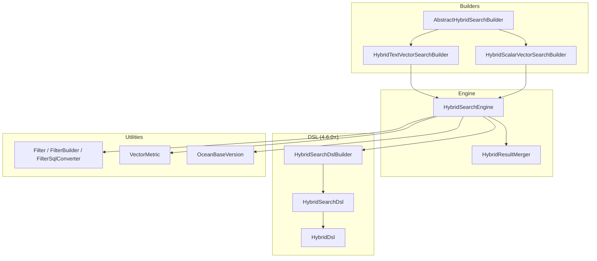
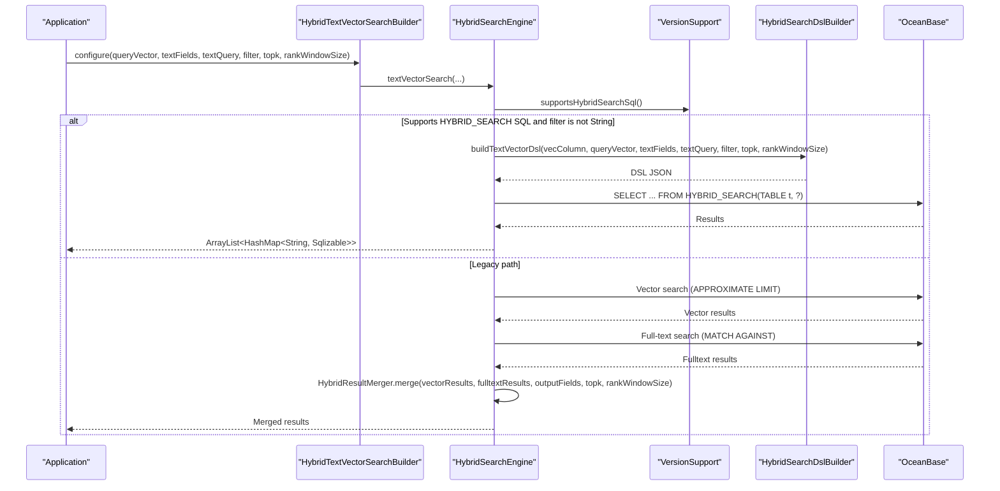
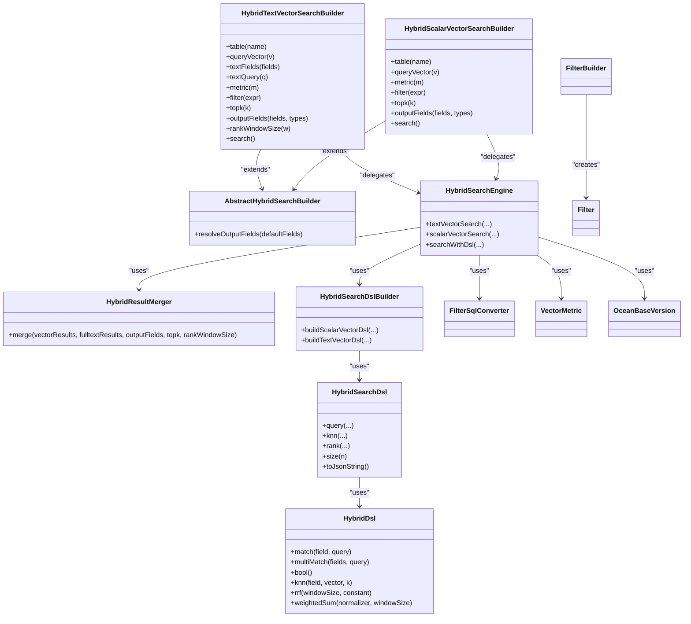
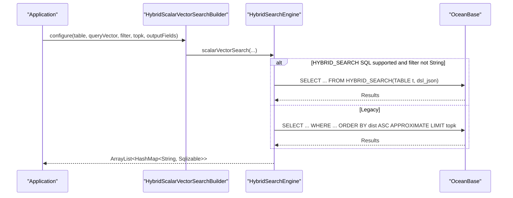
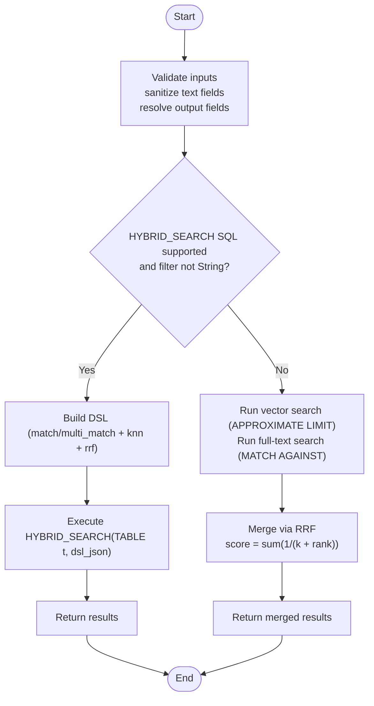
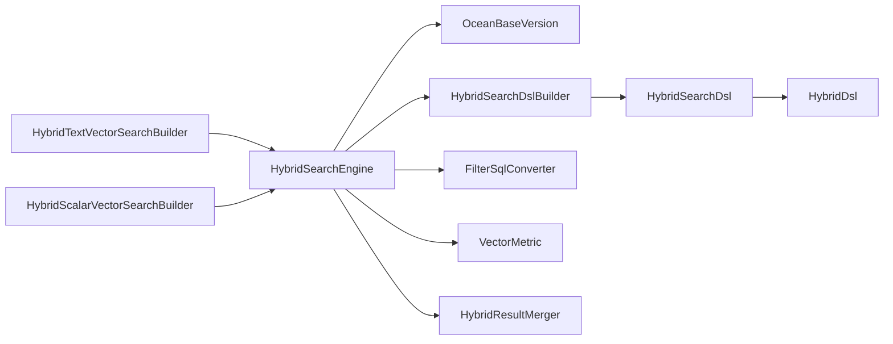

# Hybrid Search Implementation

<cite>
**Referenced Files in This Document**
- [HybridSearchEngine.java](file://src/main/java/com/oceanbase/obvector4j/hybrid/HybridSearchEngine.java)
- [HybridTextVectorSearchBuilder.java](file://src/main/java/com/oceanbase/obvector4j/hybrid/HybridTextVectorSearchBuilder.java)
- [HybridScalarVectorSearchBuilder.java](file://src/main/java/com/oceanbase/obvector4j/hybrid/HybridScalarVectorSearchBuilder.java)
- [AbstractHybridSearchBuilder.java](file://src/main/java/com/oceanbase/obvector4j/hybrid/AbstractHybridSearchBuilder.java)
- [HybridResultMerger.java](file://src/main/java/com/oceanbase/obvector4j/hybrid/HybridResultMerger.java)
- [HybridSearchDslBuilder.java](file://src/main/java/com/oceanbase/obvector4j/hybrid/v460/HybridSearchDslBuilder.java)
- [HybridSearchDsl.java](file://src/main/java/com/oceanbase/obvector4j/hybrid/v460/HybridSearchDsl.java)
- [HybridDsl.java](file://src/main/java/com/oceanbase/obvector4j/hybrid/v460/dsl/HybridDsl.java)
- [Filter.java](file://src/main/java/com/oceanbase/obvector4j/filter/Filter.java)
- [FilterSqlConverter.java](file://src/main/java/com/oceanbase/obvector4j/filter/FilterSqlConverter.java)
- [FilterBuilder.java](file://src/main/java/com/oceanbase/obvector4j/filter/FilterBuilder.java)
- [VectorMetric.java](file://src/main/java/com/oceanbase/obvector4j/util/VectorMetric.java)
- [OceanBaseVersion.java](file://src/main/java/com/oceanbase/obvector4j/version/OceanBaseVersion.java)
- [HybridSearchTest.java](file://src/test/java/com/oceanbase/obvector4j/integration/container/HybridSearchTest.java)
</cite>

## Table of Contents
1. [Introduction](#introduction)
2. [Project Structure](#project-structure)
3. [Core Components](#core-components)
4. [Architecture Overview](#architecture-overview)
5. [Detailed Component Analysis](#detailed-component-analysis)
6. [Dependency Analysis](#dependency-analysis)
7. [Performance Considerations](#performance-considerations)
8. [Troubleshooting Guide](#troubleshooting-guide)
9. [Conclusion](#conclusion)
10. [Appendices](#appendices)

## Introduction
This document explains the hybrid search implementation that combines semantic similarity (vector) with keyword or scalar filtering. It covers intelligent query strategy selection based on OceanBase version compatibility, automatic routing between native HYBRID_SEARCH SQL and legacy approaches, builder APIs for full-text + vector and scalar + vector patterns, result fusion via Reciprocal Rank Fusion (RRF), ranking algorithms, relevance scoring, and tuning parameters. Practical examples demonstrate combining semantic similarity with keyword matching, implementing faceted search with vector embeddings, and optimizing hybrid query performance.

## Project Structure
The hybrid search feature is implemented under a layered structure:
- Builder layer: fluent APIs to construct queries
- Engine layer: version-aware execution and SQL generation
- DSL layer (4.6.0+): typed JSON DSL construction for native HYBRID_SEARCH
- Utilities: filters, metrics, versioning, and result merging

**Diagram sources**
- [HybridTextVectorSearchBuilder.java:1-135](file://src/main/java/com/oceanbase/obvector4j/hybrid/HybridTextVectorSearchBuilder.java#L1-L135)
- [HybridScalarVectorSearchBuilder.java:1-102](file://src/main/java/com/oceanbase/obvector4j/hybrid/HybridScalarVectorSearchBuilder.java#L1-L102)
- [AbstractHybridSearchBuilder.java:1-57](file://src/main/java/com/oceanbase/obvector4j/hybrid/AbstractHybridSearchBuilder.java#L1-L57)
- [HybridSearchEngine.java:1-281](file://src/main/java/com/oceanbase/obvector4j/hybrid/HybridSearchEngine.java#L1-L281)
- [HybridResultMerger.java:1-76](file://src/main/java/com/oceanbase/obvector4j/hybrid/HybridResultMerger.java#L1-L76)
- [HybridSearchDslBuilder.java:1-71](file://src/main/java/com/oceanbase/obvector4j/hybrid/v460/HybridSearchDslBuilder.java#L1-L71)
- [HybridSearchDsl.java:1-254](file://src/main/java/com/oceanbase/obvector4j/hybrid/v460/HybridSearchDsl.java#L1-L254)
- [HybridDsl.java:1-237](file://src/main/java/com/oceanbase/obvector4j/hybrid/v460/dsl/HybridDsl.java#L1-L237)
- [Filter.java:1-194](file://src/main/java/com/oceanbase/obvector4j/filter/Filter.java#L1-L194)
- [FilterBuilder.java:1-147](file://src/main/java/com/oceanbase/obvector4j/filter/FilterBuilder.java#L1-L147)
- [FilterSqlConverter.java:1-119](file://src/main/java/com/oceanbase/obvector4j/filter/FilterSqlConverter.java#L1-L119)
- [VectorMetric.java:1-41](file://src/main/java/com/oceanbase/obvector4j/util/VectorMetric.java#L1-L41)
- [OceanBaseVersion.java:1-86](file://src/main/java/com/oceanbase/obvector4j/version/OceanBaseVersion.java#L1-L86)

**Section sources**
- [HybridSearchEngine.java:1-281](file://src/main/java/com/oceanbase/obvector4j/hybrid/HybridSearchEngine.java#L1-L281)
- [HybridTextVectorSearchBuilder.java:1-135](file://src/main/java/com/oceanbase/obvector4j/hybrid/HybridTextVectorSearchBuilder.java#L1-L135)
- [HybridScalarVectorSearchBuilder.java:1-102](file://src/main/java/com/oceanbase/obvector4j/hybrid/HybridScalarVectorSearchBuilder.java#L1-L102)
- [AbstractHybridSearchBuilder.java:1-57](file://src/main/java/com/oceanbase/obvector4j/hybrid/AbstractHybridSearchBuilder.java#L1-L57)
- [HybridResultMerger.java:1-76](file://src/main/java/com/oceanbase/obvector4j/hybrid/HybridResultMerger.java#L1-L76)
- [HybridSearchDslBuilder.java:1-71](file://src/main/java/com/oceanbase/obvector4j/hybrid/v460/HybridSearchDslBuilder.java#L1-L71)
- [HybridSearchDsl.java:1-254](file://src/main/java/com/oceanbase/obvector4j/hybrid/v460/HybridSearchDsl.java#L1-L254)
- [HybridDsl.java:1-237](file://src/main/java/com/oceanbase/obvector4j/hybrid/v460/dsl/HybridDsl.java#L1-L237)
- [Filter.java:1-194](file://src/main/java/com/oceanbase/obvector4j/filter/Filter.java#L1-L194)
- [FilterBuilder.java:1-147](file://src/main/java/com/oceanbase/obvector4j/filter/FilterBuilder.java#L1-L147)
- [FilterSqlConverter.java:1-119](file://src/main/java/com/oceanbase/obvector4j/filter/FilterSqlConverter.java#L1-L119)
- [VectorMetric.java:1-41](file://src/main/java/com/oceanbase/obvector4j/util/VectorMetric.java#L1-L41)
- [OceanBaseVersion.java:1-86](file://src/main/java/com/oceanbase/obvector4j/version/OceanBaseVersion.java#L1-L86)

## Core Components
- HybridTextVectorSearchBuilder: Fluent API for full-text + vector hybrid search. Validates inputs, resolves output fields, and delegates to the engine.
- HybridScalarVectorSearchBuilder: Fluent API for scalar + vector hybrid search. Validates inputs, resolves output fields, and delegates to the engine.
- AbstractHybridSearchBuilder: Shared utilities for output field resolution and type inference.
- HybridSearchEngine: Version-aware execution engine. Routes to native HYBRID_SEARCH SQL (4.6.0+) or legacy paths; builds SQL for vector and full-text searches; merges results using RRF when needed.
- HybridResultMerger: Implements Reciprocal Rank Fusion (RRF) to combine independent ranked lists into a unified ranking.
- v460 DSL: HybridSearchDslBuilder and HybridSearchDsl provide typed builders to generate JSON DSL for native HYBRID_SEARCH.
- Filter system: Filter, FilterBuilder, and FilterSqlConverter support type-safe filter expressions converted to WHERE clauses.
- VectorMetric: Resolves distance functions and formats vector literals for SQL.
- OceanBaseVersion: Parses and compares versions to gate features.

**Section sources**
- [HybridTextVectorSearchBuilder.java:1-135](file://src/main/java/com/oceanbase/obvector4j/hybrid/HybridTextVectorSearchBuilder.java#L1-L135)
- [HybridScalarVectorSearchBuilder.java:1-102](file://src/main/java/com/oceanbase/obvector4j/hybrid/HybridScalarVectorSearchBuilder.java#L1-L102)
- [AbstractHybridSearchBuilder.java:1-57](file://src/main/java/com/oceanbase/obvector4j/hybrid/AbstractHybridSearchBuilder.java#L1-L57)
- [HybridSearchEngine.java:1-281](file://src/main/java/com/oceanbase/obvector4j/hybrid/HybridSearchEngine.java#L1-L281)
- [HybridResultMerger.java:1-76](file://src/main/java/com/oceanbase/obvector4j/hybrid/HybridResultMerger.java#L1-L76)
- [HybridSearchDslBuilder.java:1-71](file://src/main/java/com/oceanbase/obvector4j/hybrid/v460/HybridSearchDslBuilder.java#L1-L71)
- [HybridSearchDsl.java:1-254](file://src/main/java/com/oceanbase/obvector4j/hybrid/v460/HybridSearchDsl.java#L1-L254)
- [HybridDsl.java:1-237](file://src/main/java/com/oceanbase/obvector4j/hybrid/v460/dsl/HybridDsl.java#L1-L237)
- [Filter.java:1-194](file://src/main/java/com/oceanbase/obvector4j/filter/Filter.java#L1-L194)
- [FilterBuilder.java:1-147](file://src/main/java/com/oceanbase/obvector4j/filter/FilterBuilder.java#L1-L147)
- [FilterSqlConverter.java:1-119](file://src/main/java/com/oceanbase/obvector4j/filter/FilterSqlConverter.java#L1-L119)
- [VectorMetric.java:1-41](file://src/main/java/com/oceanbase/obvector4j/util/VectorMetric.java#L1-L41)
- [OceanBaseVersion.java:1-86](file://src/main/java/com/oceanbase/obvector4j/version/OceanBaseVersion.java#L1-L86)

## Architecture Overview
The engine selects the optimal path at runtime:
- If OceanBase supports HYBRID_SEARCH SQL (version ≥ 4.6.0) and filters are not raw strings, it constructs a typed DSL and executes via HYBRID_SEARCH(TABLE ..., dsl_json).
- Otherwise, it falls back to legacy mode:
  - Full-text + vector: runs two separate queries (full-text MATCH AGAINST and vector APPROXIMATE LIMIT), then merges using client-side RRF.
  - Scalar + vector: applies WHERE clause and performs vector search with APPROXIMATE LIMIT.

**Diagram sources**
- [HybridTextVectorSearchBuilder.java:1-135](file://src/main/java/com/oceanbase/obvector4j/hybrid/HybridTextVectorSearchBuilder.java#L1-L135)
- [HybridSearchEngine.java:1-281](file://src/main/java/com/oceanbase/obvector4j/hybrid/HybridSearchEngine.java#L1-L281)
- [HybridSearchDslBuilder.java:1-71](file://src/main/java/com/oceanbase/obvector4j/hybrid/v460/HybridSearchDslBuilder.java#L1-L71)
- [HybridResultMerger.java:1-76](file://src/main/java/com/oceanbase/obvector4j/hybrid/HybridResultMerger.java#L1-L76)

## Detailed Component Analysis

### Intelligent Query Strategy Selection
- Version gating: The engine uses a VersionSupport interface to detect if HYBRID_SEARCH SQL is available. The minimum supported version is defined by OceanBaseVersion.HYBRID_SEARCH_SQL_MIN.
- Routing logic:
  - For text + vector: if version supports HYBRID_SEARCH SQL and filterExpr is not a raw string, build DSL and execute natively.
  - Else: run dual queries and merge with RRF.
  - For scalar + vector: if version supports HYBRID_SEARCH SQL and filterExpr is not a raw string, build DSL and execute natively.
  - Else: apply WHERE clause and perform vector search with APPROXIMATE LIMIT.

Key behaviors:
- Output field validation and sanitization ensure safe column names and correct data types.
- When executing native HYBRID_SEARCH, the engine wraps the DSL JSON in a prepared statement parameter.

**Section sources**
- [HybridSearchEngine.java:1-281](file://src/main/java/com/oceanbase/obvector4j/hybrid/HybridSearchEngine.java#L1-L281)
- [OceanBaseVersion.java:1-86](file://src/main/java/com/oceanbase/obvector4j/version/OceanBaseVersion.java#L1-L86)

### HybridTextVectorSearchBuilder (Full-Text + Vector)
Responsibilities:
- Accepts table name, vector column, metric, query vector, text fields, text query, optional filter, topk, output fields, and rank window size.
- Validates required parameters and sanitizes text fields.
- Resolves output fields and infers data types if not provided.
- Delegates to engine’s textVectorSearch method.

Usage pattern:
- Configure via fluent setters and call search().

**Section sources**
- [HybridTextVectorSearchBuilder.java:1-135](file://src/main/java/com/oceanbase/obvector4j/hybrid/HybridTextVectorSearchBuilder.java#L1-L135)
- [AbstractHybridSearchBuilder.java:1-57](file://src/main/java/com/oceanbase/obvector4j/hybrid/AbstractHybridSearchBuilder.java#L1-L57)

### HybridScalarVectorSearchBuilder (Scalar + Vector)
Responsibilities:
- Accepts table name, vector column, metric, query vector, optional filter, topk, and output fields.
- Validates required parameters and resolves output fields with type inference.
- Delegates to engine’s scalarVectorSearch method.

Usage pattern:
- Configure via fluent setters and call search().

**Section sources**
- [HybridScalarVectorSearchBuilder.java:1-102](file://src/main/java/com/oceanbase/obvector4j/hybrid/HybridScalarVectorSearchBuilder.java#L1-L102)
- [AbstractHybridSearchBuilder.java:1-57](file://src/main/java/com/oceanbase/obvector4j/hybrid/AbstractHybridSearchBuilder.java#L1-L57)

### HybridResultMerger (Ranking and Fusion)
Algorithm:
- Uses Reciprocal Rank Fusion (RRF) to combine independent ranked lists from vector and full-text searches.
- Computes score per row key as sum over lists of 1/(k + rank), where k is rankWindowSize (defaults to topk if not set).
- Sorts combined results by descending RRF score and returns topk.

Complexity:
- Time: O(N log N) due to sorting, where N is number of unique rows across both lists.
- Space: O(N) for maps storing merged rows and scores.

Tuning:
- rankWindowSize controls sensitivity to early ranks; larger values reduce impact of lower-ranked items.

**Section sources**
- [HybridResultMerger.java:1-76](file://src/main/java/com/oceanbase/obvector4j/hybrid/HybridResultMerger.java#L1-L76)

### DSL Layer (4.6.0+)
- HybridSearchDslBuilder: Builds JSON DSL for scalar-vector and text-vector patterns, including RRF configuration and multi-field match.
- HybridSearchDsl: Mutable DSL document supporting query, knn, rank, from, size, min_score, and raw JSON override.
- HybridDsl: Typed helpers for match, multi_match, bool, knn, rrf, weighted_sum, and more.

Key points:
- Text + vector DSL composes query (match/multi_match), knn, and rank (rrf or weighted_sum).
- Scalar + vector DSL composes knn with optional filter conditions.
- Vector literal formatting and array handling are provided for DSL.

**Section sources**
- [HybridSearchDslBuilder.java:1-71](file://src/main/java/com/oceanbase/obvector4j/hybrid/v460/HybridSearchDslBuilder.java#L1-L71)
- [HybridSearchDsl.java:1-254](file://src/main/java/com/oceanbase/obvector4j/hybrid/v460/HybridSearchDsl.java#L1-L254)
- [HybridDsl.java:1-237](file://src/main/java/com/oceanbase/obvector4j/hybrid/v460/dsl/HybridDsl.java#L1-L237)

### Filters and Where Clause Generation
- Filter: Type-safe expression tree supporting comparisons, IN/NOT IN, LIKE, AND/OR/NOT.
- FilterBuilder: Fluent API to construct Filter objects.
- FilterSqlConverter: Converts Filter objects and raw string expressions to SQL WHERE clauses.

Integration:
- In legacy mode, filters are converted to WHERE clauses and applied to vector/full-text queries.
- In native mode, filters are mapped into DSL bool.filter sections.

**Section sources**
- [Filter.java:1-194](file://src/main/java/com/oceanbase/obvector4j/filter/Filter.java#L1-L194)
- [FilterBuilder.java:1-147](file://src/main/java/com/oceanbase/obvector4j/filter/FilterBuilder.java#L1-L147)
- [FilterSqlConverter.java:1-119](file://src/main/java/com/oceanbase/obvector4j/filter/FilterSqlConverter.java#L1-L119)

### Vector Metrics and Scoring
- VectorMetric: Maps metric names to distance functions and formats vector literals.
- Legacy scoring:
  - Cosine: normalized score derived from cosine_distance.
  - L2: inverse transform of l2_distance.
  - IP: shifted/scaled inner product.
- Native scoring: handled by server-side ranking (RRF or weighted_sum) within DSL.

**Section sources**
- [VectorMetric.java:1-41](file://src/main/java/com/oceanbase/obvector4j/util/VectorMetric.java#L1-L41)
- [HybridSearchEngine.java:1-281](file://src/main/java/com/oceanbase/obvector4j/hybrid/HybridSearchEngine.java#L1-L281)

### Class Relationships

**Diagram sources**
- [HybridTextVectorSearchBuilder.java:1-135](file://src/main/java/com/oceanbase/obvector4j/hybrid/HybridTextVectorSearchBuilder.java#L1-L135)
- [HybridScalarVectorSearchBuilder.java:1-102](file://src/main/java/com/oceanbase/obvector4j/hybrid/HybridScalarVectorSearchBuilder.java#L1-L102)
- [AbstractHybridSearchBuilder.java:1-57](file://src/main/java/com/oceanbase/obvector4j/hybrid/AbstractHybridSearchBuilder.java#L1-L57)
- [HybridSearchEngine.java:1-281](file://src/main/java/com/oceanbase/obvector4j/hybrid/HybridSearchEngine.java#L1-L281)
- [HybridResultMerger.java:1-76](file://src/main/java/com/oceanbase/obvector4j/hybrid/HybridResultMerger.java#L1-L76)
- [HybridSearchDslBuilder.java:1-71](file://src/main/java/com/oceanbase/obvector4j/hybrid/v460/HybridSearchDslBuilder.java#L1-L71)
- [HybridSearchDsl.java:1-254](file://src/main/java/com/oceanbase/obvector4j/hybrid/v460/HybridSearchDsl.java#L1-L254)
- [HybridDsl.java:1-237](file://src/main/java/com/oceanbase/obvector4j/hybrid/v460/dsl/HybridDsl.java#L1-L237)
- [Filter.java:1-194](file://src/main/java/com/oceanbase/obvector4j/filter/Filter.java#L1-L194)
- [FilterBuilder.java:1-147](file://src/main/java/com/oceanbase/obvector4j/filter/FilterBuilder.java#L1-L147)
- [FilterSqlConverter.java:1-119](file://src/main/java/com/oceanbase/obvector4j/filter/FilterSqlConverter.java#L1-L119)
- [VectorMetric.java:1-41](file://src/main/java/com/oceanbase/obvector4j/util/VectorMetric.java#L1-L41)
- [OceanBaseVersion.java:1-86](file://src/main/java/com/oceanbase/obvector4j/version/OceanBaseVersion.java#L1-L86)

### Sequence Diagrams for Key Workflows

#### Scalar + Vector Search Flow

**Diagram sources**
- [HybridScalarVectorSearchBuilder.java:1-102](file://src/main/java/com/oceanbase/obvector4j/hybrid/HybridScalarVectorSearchBuilder.java#L1-L102)
- [HybridSearchEngine.java:1-281](file://src/main/java/com/oceanbase/obvector4j/hybrid/HybridSearchEngine.java#L1-L281)

#### Full-Text + Vector Search Flow (Legacy Mode)

**Diagram sources**
- [HybridTextVectorSearchBuilder.java:1-135](file://src/main/java/com/oceanbase/obvector4j/hybrid/HybridTextVectorSearchBuilder.java#L1-L135)
- [HybridSearchEngine.java:1-281](file://src/main/java/com/oceanbase/obvector4j/hybrid/HybridSearchEngine.java#L1-L281)
- [HybridResultMerger.java:1-76](file://src/main/java/com/oceanbase/obvector4j/hybrid/HybridResultMerger.java#L1-L76)

## Dependency Analysis
- Builders depend on AbstractHybridSearchBuilder for shared output field resolution.
- Engine depends on:
  - Version detection (OceanBaseVersion)
  - DSL builders (v460) for native execution
  - Filter conversion for legacy WHERE clauses
  - VectorMetric for distance function mapping and vector literal formatting
  - HybridResultMerger for RRF-based fusion
- DSL layer depends on typed nodes and keys to produce valid JSON for HYBRID_SEARCH.

**Diagram sources**
- [HybridTextVectorSearchBuilder.java:1-135](file://src/main/java/com/oceanbase/obvector4j/hybrid/HybridTextVectorSearchBuilder.java#L1-L135)
- [HybridScalarVectorSearchBuilder.java:1-102](file://src/main/java/com/oceanbase/obvector4j/hybrid/HybridScalarVectorSearchBuilder.java#L1-L102)
- [HybridSearchEngine.java:1-281](file://src/main/java/com/oceanbase/obvector4j/hybrid/HybridSearchEngine.java#L1-L281)
- [HybridSearchDslBuilder.java:1-71](file://src/main/java/com/oceanbase/obvector4j/hybrid/v460/HybridSearchDslBuilder.java#L1-L71)
- [HybridSearchDsl.java:1-254](file://src/main/java/com/oceanbase/obvector4j/hybrid/v460/HybridSearchDsl.java#L1-L254)
- [HybridDsl.java:1-237](file://src/main/java/com/oceanbase/obvector4j/hybrid/v460/dsl/HybridDsl.java#L1-L237)
- [FilterSqlConverter.java:1-119](file://src/main/java/com/oceanbase/obvector4j/filter/FilterSqlConverter.java#L1-L119)
- [VectorMetric.java:1-41](file://src/main/java/com/oceanbase/obvector4j/util/VectorMetric.java#L1-L41)
- [HybridResultMerger.java:1-76](file://src/main/java/com/oceanbase/obvector4j/hybrid/HybridResultMerger.java#L1-L76)
- [OceanBaseVersion.java:1-86](file://src/main/java/com/oceanbase/obvector4j/version/OceanBaseVersion.java#L1-L86)

**Section sources**
- [HybridSearchEngine.java:1-281](file://src/main/java/com/oceanbase/obvector4j/hybrid/HybridSearchEngine.java#L1-L281)
- [HybridSearchDslBuilder.java:1-71](file://src/main/java/com/oceanbase/obvector4j/hybrid/v460/HybridSearchDslBuilder.java#L1-L71)
- [HybridSearchDsl.java:1-254](file://src/main/java/com/oceanbase/obvector4j/hybrid/v460/HybridSearchDsl.java#L1-L254)
- [HybridDsl.java:1-237](file://src/main/java/com/oceanbase/obvector4j/hybrid/v460/dsl/HybridDsl.java#L1-L237)
- [FilterSqlConverter.java:1-119](file://src/main/java/com/oceanbase/obvector4j/filter/FilterSqlConverter.java#L1-L119)
- [VectorMetric.java:1-41](file://src/main/java/com/oceanbase/obvector4j/util/VectorMetric.java#L1-L41)
- [HybridResultMerger.java:1-76](file://src/main/java/com/oceanbase/obvector4j/hybrid/HybridResultMerger.java#L1-L76)
- [OceanBaseVersion.java:1-86](file://src/main/java/com/oceanbase/obvector4j/version/OceanBaseVersion.java#L1-L86)

## Performance Considerations
- Prefer native HYBRID_SEARCH SQL (4.6.0+) to offload ranking and fusion to the database.
- Use appropriate metric types:
  - Cosine for normalized vectors (common for text embeddings).
  - L2 for general similarity.
  - IP for normalized vectors where dot product is meaningful.
- Tune rankWindowSize:
  - Larger windows reduce sensitivity to low-ranked items and can improve stability.
  - Default behavior uses topk or a multiple depending on path.
- Limit output fields to reduce network and serialization overhead.
- Ensure indexes exist:
  - Vector index on embedding column.
  - Full-text indexes on searched text columns.
- Avoid overly complex filters in legacy mode; prefer indexed scalar fields.

[No sources needed since this section provides general guidance]

## Troubleshooting Guide
Common issues and resolutions:
- Unsupported metric type: Ensure metric is one of "l2", "ip", or "cosine".
- Missing indexes: Create vector and full-text indexes before searching.
- Version mismatch: HYBRID_SEARCH DSL requires OceanBase 4.6.0+. Below that, the SDK falls back to legacy paths.
- Empty or invalid output fields: Provide non-empty output fields; types will be inferred if not specified.
- Filter expression errors: Use FilterBuilder to avoid malformed WHERE clauses.

Operational checks:
- Verify supportsHybridSearchSql() to confirm native path availability.
- Inspect exceptions thrown by version gating and DSL parsing.

**Section sources**
- [VectorMetric.java:1-41](file://src/main/java/com/oceanbase/obvector4j/util/VectorMetric.java#L1-L41)
- [OceanBaseVersion.java:1-86](file://src/main/java/com/oceanbase/obvector4j/version/OceanBaseVersion.java#L1-L86)
- [FilterSqlConverter.java:1-119](file://src/main/java/com/oceanbase/obvector4j/filter/FilterSqlConverter.java#L1-L119)
- [HybridSearchEngine.java:1-281](file://src/main/java/com/oceanbase/obvector4j/hybrid/HybridSearchEngine.java#L1-L281)

## Conclusion
The hybrid search implementation provides a robust, version-aware solution that automatically routes queries to native HYBRID_SEARCH SQL when available, falling back to efficient legacy strategies otherwise. Builders simplify query construction, while RRF ensures high-quality fusion of independent rankings. With proper indexing, metric selection, and parameter tuning, users can achieve accurate and performant hybrid retrieval combining semantics and keywords/scalar constraints.

[No sources needed since this section summarizes without analyzing specific files]

## Appendices

### Practical Examples

- Combining semantic similarity with keyword matching:
  - Use HybridTextVectorSearchBuilder with textFields/textQuery and queryVector.
  - On 4.6.0+, this compiles to a DSL with match/multi_match, knn, and rrf.
  - Reference usage patterns in integration tests.

- Implementing faceted search with vector embeddings:
  - Use HybridScalarVectorSearchBuilder with FilterBuilder to constrain categories, price ranges, and status.
  - Combine with vector similarity to return semantically similar items within facets.

- Optimizing hybrid query performance:
  - Enable native HYBRID_SEARCH SQL by ensuring OceanBase 4.6.0+.
  - Set rankWindowSize appropriately for RRF.
  - Select suitable metric and limit output fields.

For concrete code examples, see:
- [HybridSearchTest.java:1-800](file://src/test/java/com/oceanbase/obvector4j/integration/container/HybridSearchTest.java#L1-L800)

**Section sources**
- [HybridSearchTest.java:1-800](file://src/test/java/com/oceanbase/obvector4j/integration/container/HybridSearchTest.java#L1-L800)