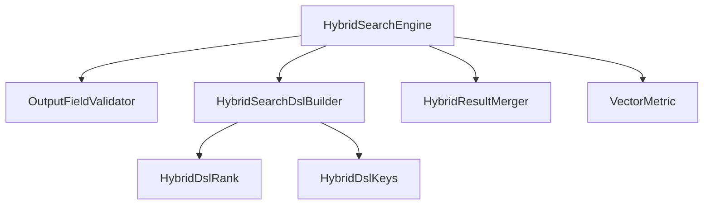
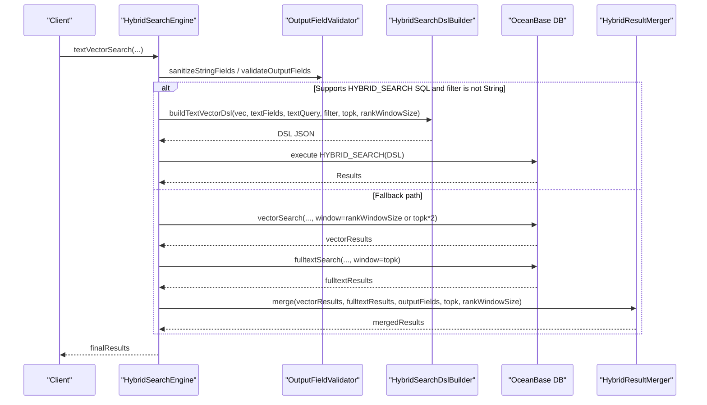
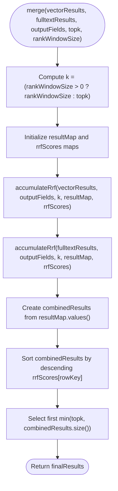
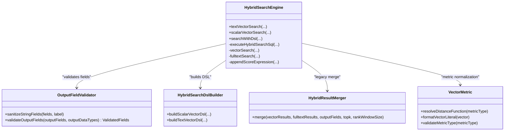
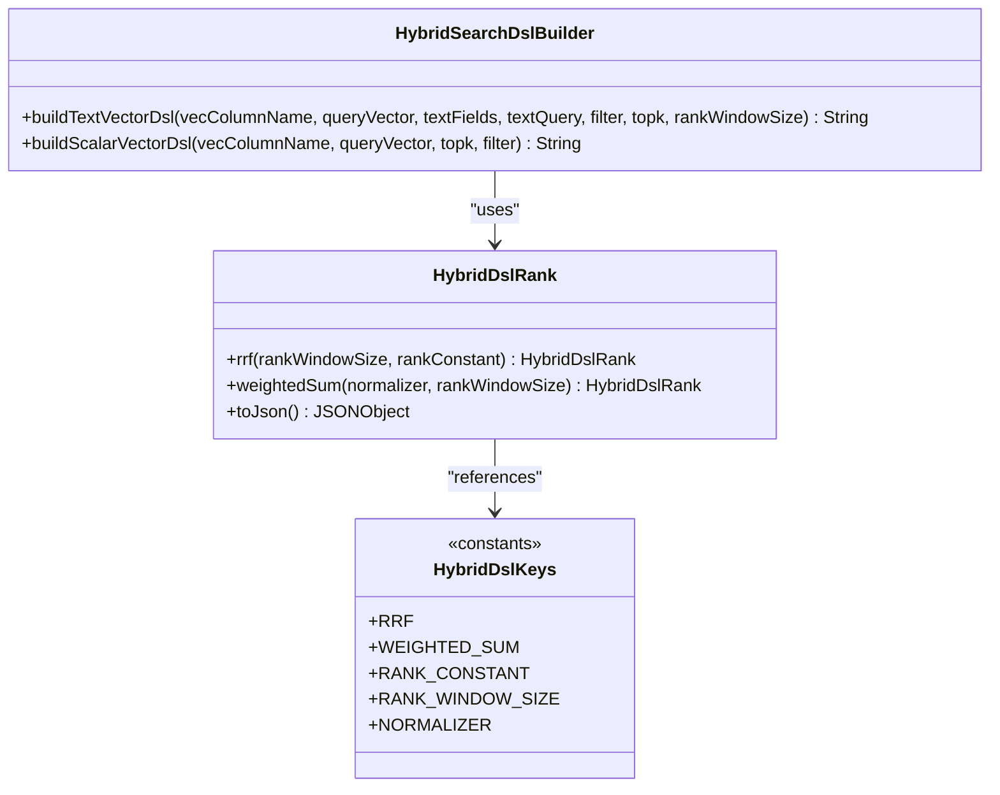
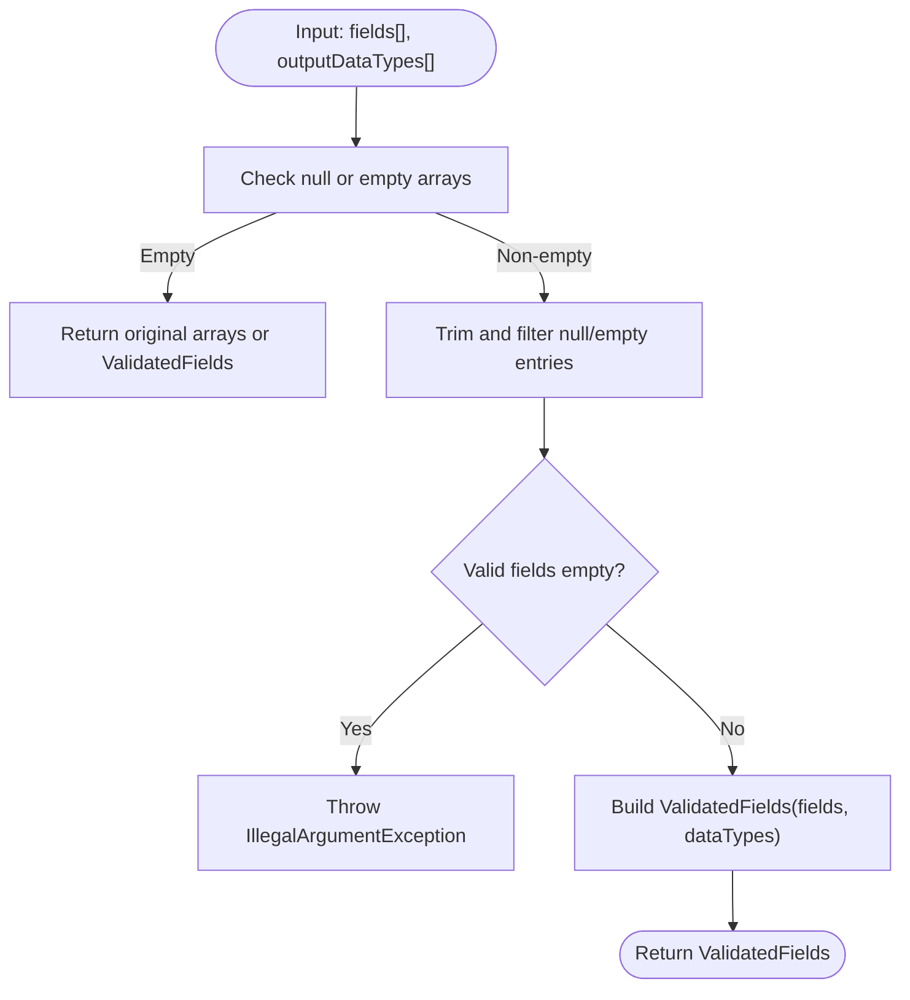
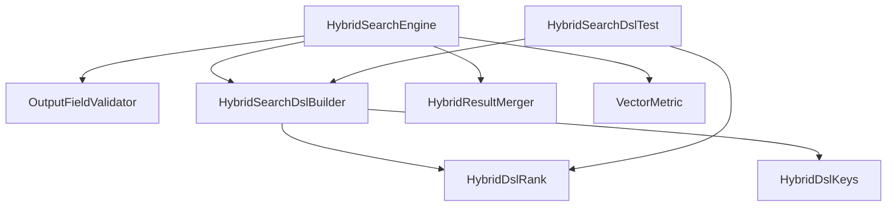

# Result Merging and Ranking

<cite>
**Referenced Files in This Document**
- [HybridResultMerger.java](file://src/main/java/com/oceanbase/obvector4j/hybrid/HybridResultMerger.java)
- [OutputFieldValidator.java](file://src/main/java/com/oceanbase/obvector4j/hybrid/OutputFieldValidator.java)
- [HybridSearchEngine.java](file://src/main/java/com/oceanbase/obvector4j/hybrid/HybridSearchEngine.java)
- [HybridSearchDslBuilder.java](file://src/main/java/com/oceanbase/obvector4j/hybrid/core/HybridSearchDslBuilder.java)
- [HybridDslRank.java](file://src/main/java/com/oceanbase/obvector4j/hybrid/core/dsl/HybridDslRank.java)
- [HybridDslKeys.java](file://src/main/java/com/oceanbase/obvector4j/hybrid/core/dsl/HybridDslKeys.java)
- [VectorMetric.java](file://src/main/java/com/oceanbase/obvector4j/util/VectorMetric.java)
- [AbstractHybridSearchBuilder.java](file://src/main/java/com/oceanbase/obvector4j/hybrid/AbstractHybridSearchBuilder.java)
- [HybridSearchDslTest.java](file://src/test/java/com/oceanbase/obvector4j/unit/HybridSearchDslTest.java)
</cite>

## Table of Contents
1. [Introduction](#introduction)
2. [Project Structure](#project-structure)
3. [Core Components](#core-components)
4. [Architecture Overview](#architecture-overview)
5. [Detailed Component Analysis](#detailed-component-analysis)
6. [Dependency Analysis](#dependency-analysis)
7. [Performance Considerations](#performance-considerations)
8. [Troubleshooting Guide](#troubleshooting-guide)
9. [Conclusion](#conclusion)
10. [Appendices](#appendices)

## Introduction
This document explains the result merging and ranking algorithms used by the hybrid search implementation, focusing on:
- Fusion strategies for combining vector similarity scores with full-text relevance scores
- Normalization techniques for different scoring scales
- Top-k selection algorithm
- The impact of rankWindowSize on result quality and performance
- Score weighting mechanisms and tie-breaking strategies
- OutputFieldValidator’s role in ensuring type safety and preventing SQL injection
- Practical guidance for tuning merge parameters, customizing ranking weights, and optimizing latency vs accuracy trade-offs

The system supports two execution paths:
- Legacy path (pre-4.6.0): client-side Reciprocal Rank Fusion (RRF) using HybridResultMerger
- Native path (4.6.0+): server-side HYBRID_SEARCH DSL with RRF or weighted_sum normalization via HybridSearchDslBuilder and related DSL classes

## Project Structure
Key components involved in merging and ranking:
- HybridSearchEngine orchestrates query execution and selects between native DSL and legacy fallback
- HybridResultMerger implements client-side RRF for legacy path
- HybridSearchDslBuilder constructs JSON DSL for native path, including rank configuration
- HybridDslRank and HybridDslKeys define supported ranking strategies and constants
- OutputFieldValidator sanitizes and validates output fields to prevent injection and ensure type safety
- VectorMetric provides metric validation and score normalization expressions for legacy vector queries

**Diagram sources**
- [HybridSearchEngine.java](file://src/main/java/com/oceanbase/obvector4j/hybrid/HybridSearchEngine.java)
- [HybridResultMerger.java](file://src/main/java/com/oceanbase/obvector4j/hybrid/HybridResultMerger.java)
- [HybridSearchDslBuilder.java](file://src/main/java/com/oceanbase/obvector4j/hybrid/core/HybridSearchDslBuilder.java)
- [HybridDslRank.java](file://src/main/java/com/oceanbase/obvector4j/hybrid/core/dsl/HybridDslRank.java)
- [HybridDslKeys.java](file://src/main/java/com/oceanbase/obvector4j/hybrid/core/dsl/HybridDslKeys.java)
- [VectorMetric.java](file://src/main/java/com/oceanbase/obvector4j/util/VectorMetric.java)
- [OutputFieldValidator.java](file://src/main/java/com/oceanbase/obvector4j/hybrid/OutputFieldValidator.java)

**Section sources**
- [HybridSearchEngine.java](file://src/main/java/com/oceanbase/obvector4j/hybrid/HybridSearchEngine.java)
- [HybridResultMerger.java](file://src/main/java/com/oceanbase/obvector4j/hybrid/HybridResultMerger.java)
- [HybridSearchDslBuilder.java](file://src/main/java/com/oceanbase/obvector4j/hybrid/core/HybridSearchDslBuilder.java)
- [HybridDslRank.java](file://src/main/java/com/oceanbase/obvector4j/hybrid/core/dsl/HybridDslRank.java)
- [HybridDslKeys.java](file://src/main/java/com/oceanbase/obvector4j/hybrid/core/dsl/HybridDslKeys.java)
- [VectorMetric.java](file://src/main/java/com/oceanbase/obvector4j/util/VectorMetric.java)
- [OutputFieldValidator.java](file://src/main/java/com/oceanbase/obvector4j/hybrid/OutputFieldValidator.java)

## Core Components
- HybridResultMerger: Implements Reciprocal Rank Fusion (RRF) for legacy hybrid search. It merges vector and full-text results into a single ranked list using ranks from both lists and a configurable k parameter derived from rankWindowSize or topk.
- HybridSearchEngine: Orchestrates text-vector search. For 4.6.0+, it builds a HYBRID_SEARCH DSL with RRF or weighted_sum; otherwise, it runs separate vector and full-text queries and merges them using HybridResultMerger.
- HybridSearchDslBuilder: Builds JSON DSL for native HYBRID_SEARCH, including rank configuration such as rrf(rank_window_size, rank_constant) and weighted_sum(normalizer, rank_window_size).
- HybridDslRank: Encapsulates rank strategy construction (rrf and weighted_sum), validating parameters like rank_window_size and normalizer values.
- HybridDslKeys: Defines fixed JSON keys for HYBRID_SEARCH DSL, including rank-related keys (rrf, weighted_sum, rank_constant, rank_window_size, normalizer).
- OutputFieldValidator: Sanitizes and validates output field names and data types, throwing exceptions for invalid inputs to prevent malformed SQL and injection risks.
- VectorMetric: Validates metric types and generates normalized score expressions for legacy vector queries (cosine, l2, ip).

**Section sources**
- [HybridResultMerger.java](file://src/main/java/com/oceanbase/obvector4j/hybrid/HybridResultMerger.java)
- [HybridSearchEngine.java](file://src/main/java/com/oceanbase/obvector4j/hybrid/HybridSearchEngine.java)
- [HybridSearchDslBuilder.java](file://src/main/java/com/oceanbase/obvector4j/hybrid/core/HybridSearchDslBuilder.java)
- [HybridDslRank.java](file://src/main/java/com/oceanbase/obvector4j/hybrid/core/dsl/HybridDslRank.java)
- [HybridDslKeys.java](file://src/main/java/com/oceanbase/obvector4j/hybrid/core/dsl/HybridDslKeys.java)
- [OutputFieldValidator.java](file://src/main/java/com/oceanbase/obvector4j/hybrid/OutputFieldValidator.java)
- [VectorMetric.java](file://src/main/java/com/oceanbase/obvector4j/util/VectorMetric.java)

## Architecture Overview
The hybrid search flow adapts based on database version and filter expression type:
- If the database supports HYBRID_SEARCH SQL (version >= 4.6.0) and the filter is not a raw string, the engine builds a DSL and executes it server-side.
- Otherwise, it performs separate vector and full-text searches and merges results client-side using RRF.

**Diagram sources**
- [HybridSearchEngine.java](file://src/main/java/com/oceanbase/obvector4j/hybrid/HybridSearchEngine.java)
- [HybridSearchDslBuilder.java](file://src/main/java/com/oceanbase/obvector4j/hybrid/core/HybridSearchDslBuilder.java)
- [HybridResultMerger.java](file://src/main/java/com/oceanbase/obvector4j/hybrid/HybridResultMerger.java)
- [OutputFieldValidator.java](file://src/main/java/com/oceanbase/obvector4j/hybrid/OutputFieldValidator.java)

## Detailed Component Analysis

### HybridResultMerger: Legacy RRF Merge Algorithm
- Purpose: Combine vector and full-text result lists into a unified ranking using Reciprocal Rank Fusion.
- Key behavior:
  - Computes k = max(rankWindowSize if provided and > 0, else topk)
  - Accumulates RRF scores per row key (based on first output field) across both lists
  - Sorts combined results by descending RRF score
  - Selects top-k results capped by topk
- Tie-breaking: Stable sort by descending score; no explicit secondary key beyond score comparison.
- Complexity: O(n log n) due to sorting, where n is number of unique rows across both lists.

**Diagram sources**
- [HybridResultMerger.java](file://src/main/java/com/oceanbase/obvector4j/hybrid/HybridResultMerger.java)

**Section sources**
- [HybridResultMerger.java](file://src/main/java/com/oceanbase/obvector4j/hybrid/HybridResultMerger.java)

### HybridSearchEngine: Orchestration and Score Normalization
- Text-vector search path:
  - Validates and sanitizes output fields and text fields
  - If native HYBRID_SEARCH is available and filter is not a raw string, builds DSL and executes server-side
  - Otherwise, runs vectorSearch and fulltextSearch separately and merges via HybridResultMerger
- Legacy vector score normalization:
  - For cosine: score = (2 - distance) / 2
  - For l2: score = 1 / (1 + distance)
  - For ip/inner_product: score = (distance + 1) / 2
- Full-text search:
  - Uses MATCH AGAINST IN NATURAL LANGUAGE MODE and orders by score DESC
- Windowing:
  - For fallback path, vectorSearch uses window = rankWindowSize if provided and > 0, else topk * 2
  - fulltextSearch uses topk directly

**Diagram sources**
- [HybridSearchEngine.java](file://src/main/java/com/oceanbase/obvector4j/hybrid/HybridSearchEngine.java)
- [OutputFieldValidator.java](file://src/main/java/com/oceanbase/obvector4j/hybrid/OutputFieldValidator.java)
- [HybridSearchDslBuilder.java](file://src/main/java/com/oceanbase/obvector4j/hybrid/core/HybridSearchDslBuilder.java)
- [HybridResultMerger.java](file://src/main/java/com/oceanbase/obvector4j/hybrid/HybridResultMerger.java)
- [VectorMetric.java](file://src/main/java/com/oceanbase/obvector4j/util/VectorMetric.java)

**Section sources**
- [HybridSearchEngine.java](file://src/main/java/com/oceanbase/obvector4j/hybrid/HybridSearchEngine.java)
- [VectorMetric.java](file://src/main/java/com/oceanbase/obvector4j/util/VectorMetric.java)

### HybridSearchDslBuilder and HybridDslRank: Native Ranking Strategies
- RRF strategy:
  - Configured via rrf(rank_window_size, rank_constant)
  - Default rank_constant is 60 when building text-vector DSL
- Weighted sum strategy:
  - Configured via weighted_sum(normalizer, rank_window_size)
  - Supported normalizers include none and minmax
- Window sizing:
  - knn.k is set to rankWindowSize if provided and > 0, else topk * 2
  - rank_window_size is set to rankWindowSize if provided and > 0, else topk

**Diagram sources**
- [HybridSearchDslBuilder.java](file://src/main/java/com/oceanbase/obvector4j/hybrid/core/HybridSearchDslBuilder.java)
- [HybridDslRank.java](file://src/main/java/com/oceanbase/obvector4j/hybrid/core/dsl/HybridDslRank.java)
- [HybridDslKeys.java](file://src/main/java/com/oceanbase/obvector4j/hybrid/core/dsl/HybridDslKeys.java)

**Section sources**
- [HybridSearchDslBuilder.java](file://src/main/java/com/oceanbase/obvector4j/hybrid/core/HybridSearchDslBuilder.java)
- [HybridDslRank.java](file://src/main/java/com/oceanbase/obvector4j/hybrid/core/dsl/HybridDslRank.java)
- [HybridDslKeys.java](file://src/main/java/com/oceanbase/obvector4j/hybrid/core/dsl/HybridDslKeys.java)

### OutputFieldValidator: Type Safety and Injection Prevention
- Responsibilities:
  - Sanitize string fields by trimming and filtering null/empty entries
  - Validate output fields and corresponding data types, ensuring non-empty sets
  - Throw IllegalArgumentException for invalid configurations
- Impact:
  - Prevents empty or malformed field lists that could lead to unsafe SQL generation
  - Ensures consistent mapping between field names and data types for safe result parsing

**Diagram sources**
- [OutputFieldValidator.java](file://src/main/java/com/oceanbase/obvector4j/hybrid/OutputFieldValidator.java)

**Section sources**
- [OutputFieldValidator.java](file://src/main/java/com/oceanbase/obvector4j/hybrid/OutputFieldValidator.java)

### AbstractHybridSearchBuilder: Output Field Resolution
- Resolves default output fields if not specified
- Infers column data types when not provided
- Validates counts match between fields and data types

**Section sources**
- [AbstractHybridSearchBuilder.java](file://src/main/java/com/oceanbase/obvector4j/hybrid/AbstractHybridSearchBuilder.java)

## Dependency Analysis
- HybridSearchEngine depends on:
  - OutputFieldValidator for input validation
  - HybridSearchDslBuilder for native DSL construction
  - HybridResultMerger for legacy merging
  - VectorMetric for metric validation and score normalization
- HybridSearchDslBuilder depends on:
  - HybridDslRank for rank strategy construction
  - HybridDslKeys for constant definitions
- HybridResultMerger depends on:
  - Sqlizable model for row representation
- Tests demonstrate usage patterns for DSL construction and ranking strategies

**Diagram sources**
- [HybridSearchEngine.java](file://src/main/java/com/oceanbase/obvector4j/hybrid/HybridSearchEngine.java)
- [HybridSearchDslBuilder.java](file://src/main/java/com/oceanbase/obvector4j/hybrid/core/HybridSearchDslBuilder.java)
- [HybridDslRank.java](file://src/main/java/com/oceanbase/obvector4j/hybrid/core/dsl/HybridDslRank.java)
- [HybridDslKeys.java](file://src/main/java/com/oceanbase/obvector4j/hybrid/core/dsl/HybridDslKeys.java)
- [HybridResultMerger.java](file://src/main/java/com/oceanbase/obvector4j/hybrid/HybridResultMerger.java)
- [VectorMetric.java](file://src/main/java/com/oceanbase/obvector4j/util/VectorMetric.java)
- [HybridSearchDslTest.java](file://src/test/java/com/oceanbase/obvector4j/unit/HybridSearchDslTest.java)

**Section sources**
- [HybridSearchEngine.java](file://src/main/java/com/oceanbase/obvector4j/hybrid/HybridSearchEngine.java)
- [HybridSearchDslBuilder.java](file://src/main/java/com/oceanbase/obvector4j/hybrid/core/HybridSearchDslBuilder.java)
- [HybridDslRank.java](file://src/main/java/com/oceanbase/obvector4j/hybrid/core/dsl/HybridDslRank.java)
- [HybridDslKeys.java](file://src/main/java/com/oceanbase/obvector4j/hybrid/core/dsl/HybridDslKeys.java)
- [HybridResultMerger.java](file://src/main/java/com/oceanbase/obvector4j/hybrid/HybridResultMerger.java)
- [VectorMetric.java](file://src/main/java/com/oceanbase/obvector4j/util/VectorMetric.java)
- [HybridSearchDslTest.java](file://src/test/java/com/oceanbase/obvector4j/unit/HybridSearchDslTest.java)

## Performance Considerations
- rankWindowSize impacts:
  - Larger windows increase candidate pool size for both vector and full-text searches, improving recall but increasing latency
  - In legacy path, vectorSearch uses window = rankWindowSize or topk * 2; fulltextSearch uses topk
  - In native path, knn.k is set similarly, and rank_window_size controls RRF/weighted_sum windowing
- Score normalization:
  - Legacy path applies metric-specific normalization to bring distances into comparable ranges before merging
  - Native path can use minmax normalization for weighted_sum to align scales
- Top-k selection:
  - Final results are limited to topk after merging/sorting
- Tie-breaking:
  - No explicit secondary key beyond score; consider deterministic ordering at the database level if needed

[No sources needed since this section provides general guidance]

## Troubleshooting Guide
- Empty or invalid output fields:
  - OutputFieldValidator throws IllegalArgumentException if all fields are null/empty after trimming
  - Ensure outputFields and outputDataTypes are aligned and non-empty
- Unsupported metric types:
  - VectorMetric.validateMetricType throws UnsupportedOperationException for unsupported metrics
  - Use supported metrics: cosine, l2, ip/inner_product
- Full-text search failures:
  - Legacy fulltextSearch catches errors and returns empty results with a warning; verify MATCH AGAINST availability and field indexing
- Version compatibility:
  - Native HYBRID_SEARCH requires OceanBase version >= 4.6.0; otherwise, fallback path is used

**Section sources**
- [OutputFieldValidator.java](file://src/main/java/com/oceanbase/obvector4j/hybrid/OutputFieldValidator.java)
- [VectorMetric.java](file://src/main/java/com/oceanbase/obvector4j/util/VectorMetric.java)
- [HybridSearchEngine.java](file://src/main/java/com/oceanbase/obvector4j/hybrid/HybridSearchEngine.java)

## Conclusion
The hybrid search implementation provides robust merging and ranking through:
- Client-side RRF for legacy environments
- Server-side HYBRID_SEARCH DSL supporting RRF and weighted_sum with normalization options
- Strong input validation to ensure type safety and prevent SQL injection
- Flexible parameter tuning via rankWindowSize, rankConstant, and normalizer choices
Users should select the appropriate execution path based on database version and tune parameters to balance latency and accuracy according to their use case.

[No sources needed since this section summarizes without analyzing specific files]

## Appendices

### Practical Tuning Examples
- RRF tuning:
  - Increase rankWindowSize to improve recall at the cost of latency
  - Adjust rankConstant to control sensitivity to rank positions
- Weighted sum with minmax:
  - Use minmax normalizer to align disparate score scales
  - Set rankWindowSize to limit candidate pool while maintaining fairness
- Boosting components:
  - Apply boost parameters to text and vector queries to emphasize one modality
- Latency vs accuracy:
  - Smaller topk and rankWindowSize reduce latency but may lower recall
  - Larger windows and refined KNN settings improve accuracy with higher latency

**Section sources**
- [HybridSearchDslTest.java](file://src/test/java/com/oceanbase/obvector4j/unit/HybridSearchDslTest.java)
- [HybridDslRank.java](file://src/main/java/com/oceanbase/obvector4j/hybrid/core/dsl/HybridDslRank.java)
- [HybridDslKeys.java](file://src/main/java/com/oceanbase/obvector4j/hybrid/core/dsl/HybridDslKeys.java)