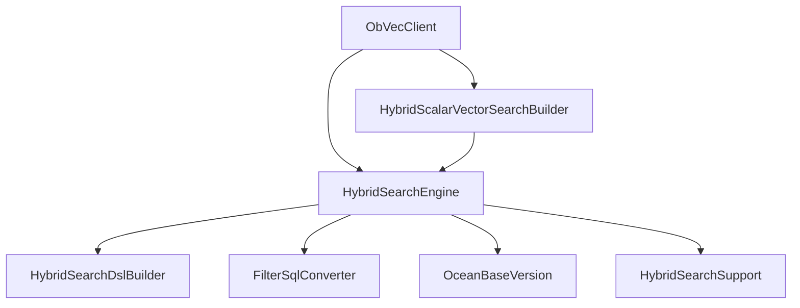
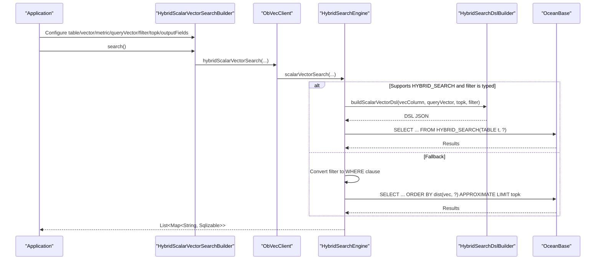
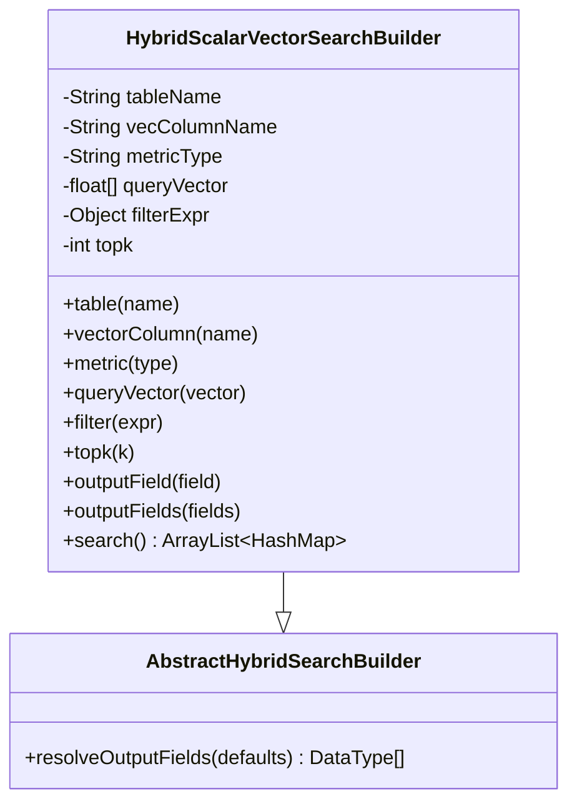
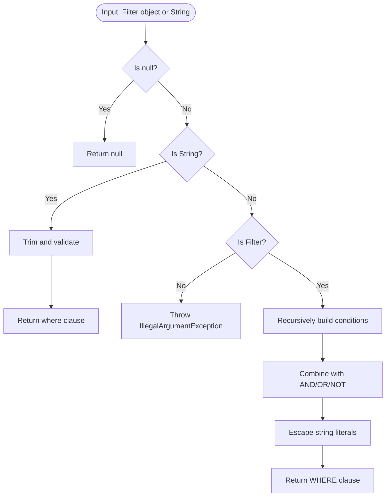
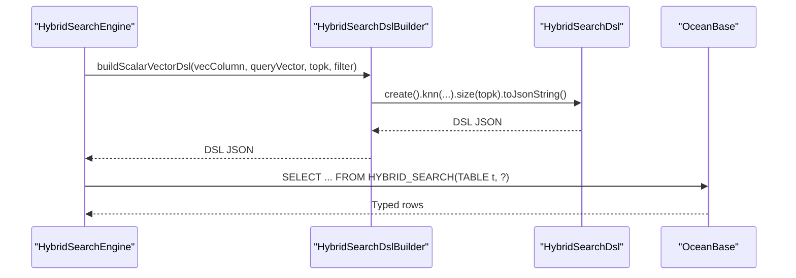
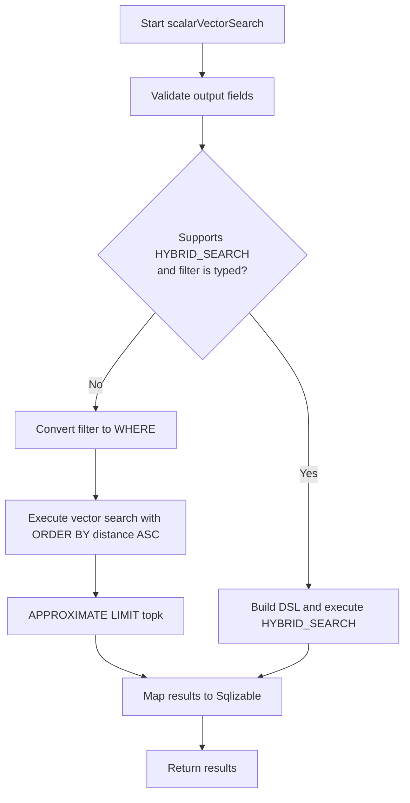
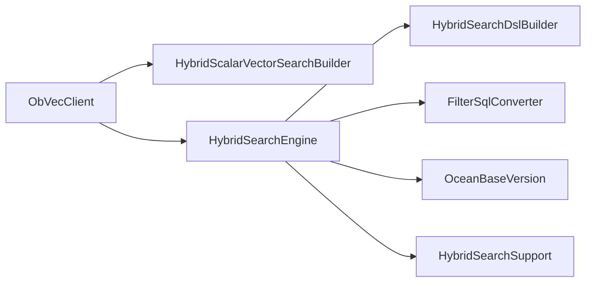

# Scalar + Vector Search Builder

<cite>
**Referenced Files in This Document**
- [HybridScalarVectorSearchBuilder.java](file://src/main/java/com/oceanbase/obvector4j/hybrid/HybridScalarVectorSearchBuilder.java)
- [AbstractHybridSearchBuilder.java](file://src/main/java/com/oceanbase/obvector4j/hybrid/AbstractHybridSearchBuilder.java)
- [HybridSearchEngine.java](file://src/main/java/com/oceanbase/obvector4j/hybrid/HybridSearchEngine.java)
- [Filter.java](file://src/main/java/com/oceanbase/obvector4j/filter/Filter.java)
- [FilterBuilder.java](file://src/main/java/com/oceanbase/obvector4j/filter/FilterBuilder.java)
- [FilterSqlConverter.java](file://src/main/java/com/oceanbase/obvector4j/filter/FilterSqlConverter.java)
- [HybridSearchDslBuilder.java](file://src/main/java/com/oceanbase/obvector4j/hybrid/core/HybridSearchDslBuilder.java)
- [HybridSearchDsl.java](file://src/main/java/com/oceanbase/obvector4j/hybrid/core/HybridSearchDsl.java)
- [ObVecClient.java](file://src/main/java/com/oceanbase/obvector4j/ObVecClient.java)
- [OceanBaseVersion.java](file://src/main/java/com/oceanbase/obvector4j/version/OceanBaseVersion.java)
- [HybridSearchSupport.java](file://src/main/java/com/oceanbase/obvector4j/hybrid/core/HybridSearchSupport.java)
- [HybridSearchTest.java](file://src/test/java/com/oceanbase/obvector4j/integration/container/HybridSearchTest.java)
</cite>

## Table of Contents
1. [Introduction](#introduction)
2. [Project Structure](#project-structure)
3. [Core Components](#core-components)
4. [Architecture Overview](#architecture-overview)
5. [Detailed Component Analysis](#detailed-component-analysis)
6. [Dependency Analysis](#dependency-analysis)
7. [Performance Considerations](#performance-considerations)
8. [Troubleshooting Guide](#troubleshooting-guide)
9. [Conclusion](#conclusion)
10. [Appendices](#appendices)

## Introduction
This document explains the scalar + vector search builder implementation that combines structured data filtering with semantic similarity search. It focuses on:
- Using HybridScalarVectorSearchBuilder to build queries that mix scalar filters and vector similarity.
- Integrating Filter expressions (typed or string-based).
- Generating optimized HYBRID_SEARCH SQL via buildScalarVectorDsl when supported by OceanBase 4.6.0+.
- Falling back to pure vector search with WHERE clauses for older versions.
- Practical examples for recommendation systems, product search with category filters, and time-series analysis with semantic similarity.

## Project Structure
The relevant code is organized into:
- Builders: fluent APIs for hybrid search.
- Engine: routing between native HYBRID_SEARCH and legacy paths.
- Filters: typed filter model and SQL conversion.
- DSL: JSON DSL builders for HYBRID_SEARCH.
- Client: entry points and version checks.

**Diagram sources**
- [ObVecClient.java](file://src/main/java/com/oceanbase/obvector4j/ObVecClient.java)
- [HybridSearchEngine.java](file://src/main/java/com/oceanbase/obvector4j/hybrid/HybridSearchEngine.java)
- [HybridScalarVectorSearchBuilder.java](file://src/main/java/com/oceanbase/obvector4j/hybrid/HybridScalarVectorSearchBuilder.java)
- [HybridSearchDslBuilder.java](file://src/main/java/com/oceanbase/obvector4j/hybrid/core/HybridSearchDslBuilder.java)
- [FilterSqlConverter.java](file://src/main/java/com/oceanbase/obvector4j/filter/FilterSqlConverter.java)
- [OceanBaseVersion.java](file://src/main/java/com/oceanbase/obvector4j/version/OceanBaseVersion.java)
- [HybridSearchSupport.java](file://src/main/java/com/oceanbase/obvector4j/hybrid/core/HybridSearchSupport.java)

**Section sources**
- [ObVecClient.java](file://src/main/java/com/oceanbase/obvector4j/ObVecClient.java)
- [HybridSearchEngine.java](file://src/main/java/com/oceanbase/obvector4j/hybrid/HybridSearchEngine.java)
- [HybridScalarVectorSearchBuilder.java](file://src/main/java/com/oceanbase/obvector4j/hybrid/HybridScalarVectorSearchBuilder.java)

## Core Components
- HybridScalarVectorSearchBuilder: Fluent API to configure table, vector column, metric, query vector, filter, topk, and output fields. Delegates execution to ObVecClient.hybridScalarVectorSearch.
- AbstractHybridSearchBuilder: Shared utilities for resolving output fields and inferring data types from metadata.
- HybridSearchEngine: Orchestrates execution path selection (native HYBRID_SEARCH vs fallback), builds DSL or WHERE clause, executes SQL, and maps results.
- Filter and FilterBuilder: Type-safe expression tree for scalar constraints; supports comparisons, IN/NOT_IN, LIKE, AND/OR/NOT.
- FilterSqlConverter: Converts Filter objects or raw strings to SQL WHERE clauses for fallback execution.
- HybridSearchDslBuilder: Builds JSON DSL for HYBRID_SEARCH including knn and optional filter integration.
- ObVecClient: Entry point for users; provides scalarVectorSearch() builder and delegates to engine.

Key responsibilities:
- Validation and type inference for output fields.
- Automatic routing based on database version and filter type.
- Safe parameterization and result mapping.

**Section sources**
- [HybridScalarVectorSearchBuilder.java](file://src/main/java/com/oceanbase/obvector4j/hybrid/HybridScalarVectorSearchBuilder.java)
- [AbstractHybridSearchBuilder.java](file://src/main/java/com/oceanbase/obvector4j/hybrid/AbstractHybridSearchBuilder.java)
- [HybridSearchEngine.java](file://src/main/java/com/oceanbase/obvector4j/hybrid/HybridSearchEngine.java)
- [Filter.java](file://src/main/java/com/oceanbase/obvector4j/filter/Filter.java)
- [FilterBuilder.java](file://src/main/java/com/oceanbase/obvector4j/filter/FilterBuilder.java)
- [FilterSqlConverter.java](file://src/main/java/com/oceanbase/obvector4j/filter/FilterSqlConverter.java)
- [HybridSearchDslBuilder.java](file://src/main/java/com/oceanbase/obvector4j/hybrid/core/HybridSearchDslBuilder.java)
- [ObVecClient.java](file://src/main/java/com/oceanbase/obvector4j/ObVecClient.java)

## Architecture Overview
The scalar + vector search flow:
- User constructs a query using HybridScalarVectorSearchBuilder.
- The builder validates inputs and calls ObVecClient.hybridScalarVectorSearch.
- HybridSearchEngine decides:
  - If OceanBase 4.6.0+ and filter is not a raw string: build HYBRID_SEARCH DSL via HybridSearchDslBuilder.buildScalarVectorDsl and execute through HYBRID_SEARCH(TABLE ... , ?).
  - Else: convert filter to WHERE clause and run vector search with distance ordering and LIMIT.

**Diagram sources**
- [HybridScalarVectorSearchBuilder.java](file://src/main/java/com/oceanbase/obvector4j/hybrid/HybridScalarVectorSearchBuilder.java)
- [ObVecClient.java](file://src/main/java/com/oceanbase/obvector4j/ObVecClient.java)
- [HybridSearchEngine.java](file://src/main/java/com/oceanbase/obvector4j/hybrid/HybridSearchEngine.java)
- [HybridSearchDslBuilder.java](file://src/main/java/com/oceanbase/obvector4j/hybrid/core/HybridSearchDslBuilder.java)

## Detailed Component Analysis

### HybridScalarVectorSearchBuilder
- Purpose: Fluent configuration for scalar + vector hybrid search.
- Key methods:
  - table, vectorColumn, metric, queryVector, filter (string or Filter), topk, outputField(s).
  - search(): validates required fields, resolves output field types, and delegates to client.
- Behavior:
  - Throws if table name, query vector, or output fields are missing.
  - Uses AbstractHybridSearchBuilder.resolveOutputFields to infer types when not provided.

**Diagram sources**
- [HybridScalarVectorSearchBuilder.java](file://src/main/java/com/oceanbase/obvector4j/hybrid/HybridScalarVectorSearchBuilder.java)
- [AbstractHybridSearchBuilder.java](file://src/main/java/com/oceanbase/obvector4j/hybrid/AbstractHybridSearchBuilder.java)

**Section sources**
- [HybridScalarVectorSearchBuilder.java](file://src/main/java/com/oceanbase/obvector4j/hybrid/HybridScalarVectorSearchBuilder.java)
- [AbstractHybridSearchBuilder.java](file://src/main/java/com/oceanbase/obvector4j/hybrid/AbstractHybridSearchBuilder.java)

### Filter Integration and Conversion
- Filter model supports comparison, IN/NOT_IN, LIKE, and logical operators AND/OR/NOT.
- FilterBuilder provides fluent construction for common predicates.
- FilterSqlConverter converts Filter or raw string to SQL WHERE clause for fallback execution.

**Diagram sources**
- [Filter.java](file://src/main/java/com/oceanbase/obvector4j/filter/Filter.java)
- [FilterBuilder.java](file://src/main/java/com/oceanbase/obvector4j/filter/FilterBuilder.java)
- [FilterSqlConverter.java](file://src/main/java/com/oceanbase/obvector4j/filter/FilterSqlConverter.java)

**Section sources**
- [Filter.java](file://src/main/java/com/oceanbase/obvector4j/filter/Filter.java)
- [FilterBuilder.java](file://src/main/java/com/oceanbase/obvector4j/filter/FilterBuilder.java)
- [FilterSqlConverter.java](file://src/main/java/com/oceanbase/obvector4j/filter/FilterSqlConverter.java)

### buildScalarVectorDsl and Native HYBRID_SEARCH Routing
- When OceanBase supports HYBRID_SEARCH (version >= 4.6.0) and filter is not a raw string, HybridSearchEngine uses HybridSearchDslBuilder.buildScalarVectorDsl to generate DSL JSON.
- The DSL includes knn with optional filter integration and size.
- Execution uses HYBRID_SEARCH(TABLE `t`, ?) with prepared statement binding.

**Diagram sources**
- [HybridSearchEngine.java](file://src/main/java/com/oceanbase/obvector4j/hybrid/HybridSearchEngine.java)
- [HybridSearchDslBuilder.java](file://src/main/java/com/oceanbase/obvector4j/hybrid/core/HybridSearchDslBuilder.java)
- [HybridSearchDsl.java](file://src/main/java/com/oceanbase/obvector4j/hybrid/core/HybridSearchDsl.java)

**Section sources**
- [HybridSearchEngine.java](file://src/main/java/com/oceanbase/obvector4j/hybrid/HybridSearchEngine.java)
- [HybridSearchDslBuilder.java](file://src/main/java/com/oceanbase/obvector4j/hybrid/core/HybridSearchDslBuilder.java)
- [HybridSearchDsl.java](file://src/main/java/com/oceanbase/obvector4j/hybrid/core/HybridSearchDsl.java)

### Fallback Path: Pure Vector Search with WHERE
- For unsupported versions or when filter is a raw string, the engine:
  - Converts filter to WHERE clause.
  - Executes vector search with distance function ordering and APPROXIMATE LIMIT.
  - Maps results to Sqlizable values using inferred output types.

**Diagram sources**
- [HybridSearchEngine.java](file://src/main/java/com/oceanbase/obvector4j/hybrid/HybridSearchEngine.java)
- [FilterSqlConverter.java](file://src/main/java/com/oceanbase/obvector4j/filter/FilterSqlConverter.java)

**Section sources**
- [HybridSearchEngine.java](file://src/main/java/com/oceanbase/obvector4j/hybrid/HybridSearchEngine.java)
- [FilterSqlConverter.java](file://src/main/java/com/oceanbase/obvector4j/filter/FilterSqlConverter.java)

### Output Field Resolution and Type Inference
- AbstractHybridSearchBuilder.resolveOutputFields:
  - Filters out null/empty field names.
  - Infers data types via ObVecClient.inferColumnDataType if not explicitly provided.
  - Validates counts match and returns DataType array for safe mapping.

**Section sources**
- [AbstractHybridSearchBuilder.java](file://src/main/java/com/oceanbase/obvector4j/hybrid/AbstractHybridSearchBuilder.java)
- [ObVecClient.java](file://src/main/java/com/oceanbase/obvector4j/ObVecClient.java)

## Dependency Analysis
- ObVecClient exposes scalarVectorSearch() which creates HybridScalarVectorSearchBuilder and delegates to HybridSearchEngine.
- HybridSearchEngine depends on:
  - Version support (OceanBaseVersion, HybridSearchSupport).
  - DSL builder (HybridSearchDslBuilder, HybridSearchDsl).
  - Filter converter (FilterSqlConverter).
  - Vector metric utilities and result mapping.

**Diagram sources**
- [ObVecClient.java](file://src/main/java/com/oceanbase/obvector4j/ObVecClient.java)
- [HybridSearchEngine.java](file://src/main/java/com/oceanbase/obvector4j/hybrid/HybridSearchEngine.java)
- [HybridSearchDslBuilder.java](file://src/main/java/com/oceanbase/obvector4j/hybrid/core/HybridSearchDslBuilder.java)
- [FilterSqlConverter.java](file://src/main/java/com/oceanbase/obvector4j/filter/FilterSqlConverter.java)
- [OceanBaseVersion.java](file://src/main/java/com/oceanbase/obvector4j/version/OceanBaseVersion.java)
- [HybridSearchSupport.java](file://src/main/java/com/oceanbase/obvector4j/hybrid/core/HybridSearchSupport.java)

**Section sources**
- [ObVecClient.java](file://src/main/java/com/oceanbase/obvector4j/ObVecClient.java)
- [HybridSearchEngine.java](file://src/main/java/com/oceanbase/obvector4j/hybrid/HybridSearchEngine.java)

## Performance Considerations
- Prefer native HYBRID_SEARCH (4.6.0+) for combined scoring and efficient filtering.
- Use typed Filter objects to enable DSL generation; raw strings force fallback path.
- Set appropriate topk and rank window sizes (for text-vector scenarios) to balance recall and latency.
- Ensure vector indexes exist on the target column and full-text indexes for text fields when applicable.
- Tune HNSW ef_search variable for approximate nearest neighbor performance.

[No sources needed since this section provides general guidance]

## Troubleshooting Guide
Common issues and resolutions:
- Missing table name, query vector, or output fields: ensure all required parameters are set before calling search().
- Unsupported HYBRID_SEARCH: if running below 4.6.0, the system falls back to vector search with WHERE; verify index availability.
- Filter type mismatch: only String or Filter objects are accepted; other types throw an exception.
- Output field count/type mismatch: resolveOutputFields enforces matching counts and infers types; provide explicit DataType arrays if inference fails.

**Section sources**
- [HybridScalarVectorSearchBuilder.java](file://src/main/java/com/oceanbase/obvector4j/hybrid/HybridScalarVectorSearchBuilder.java)
- [FilterSqlConverter.java](file://src/main/java/com/oceanbase/obvector4j/filter/FilterSqlConverter.java)
- [HybridSearchSupport.java](file://src/main/java/com/oceanbase/obvector4j/hybrid/core/HybridSearchSupport.java)
- [OceanBaseVersion.java](file://src/main/java/com/oceanbase/obvector4j/version/OceanBaseVersion.java)

## Conclusion
HybridScalarVectorSearchBuilder offers a clean, type-safe way to combine scalar filters with vector similarity. On supported databases, it leverages native HYBRID_SEARCH via generated DSL for optimal performance; otherwise, it safely falls back to vector search with WHERE clauses. Proper use of Filter expressions, correct output field specification, and indexing strategies yield robust hybrid search experiences across diverse applications.

[No sources needed since this section summarizes without analyzing specific files]

## Appendices

### Practical Examples

- Recommendation system:
  - Build a query vector from user preferences.
  - Use scalar filters for genre or author constraints.
  - Execute scalarVectorSearch with topk and output fields like title and rating.

- Product search with category filters:
  - Combine price range and category_id filters with vector similarity for product embeddings.
  - Use IN/NOT_IN for multi-category selection.

- Time-series analysis with semantic similarity:
  - Filter by timestamp ranges and sensor IDs.
  - Retrieve similar patterns using vector similarity over embedding columns.

For concrete usage patterns, see integration tests demonstrating setup, insertion, and queries.

**Section sources**
- [HybridSearchTest.java](file://src/test/java/com/oceanbase/obvector4j/integration/container/HybridSearchTest.java)