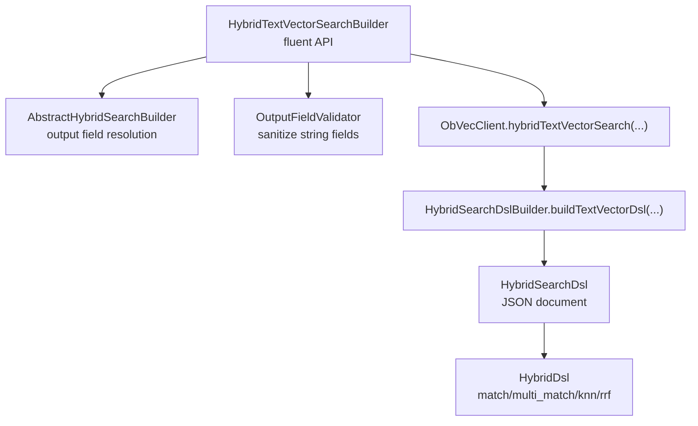
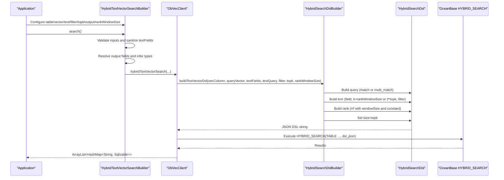
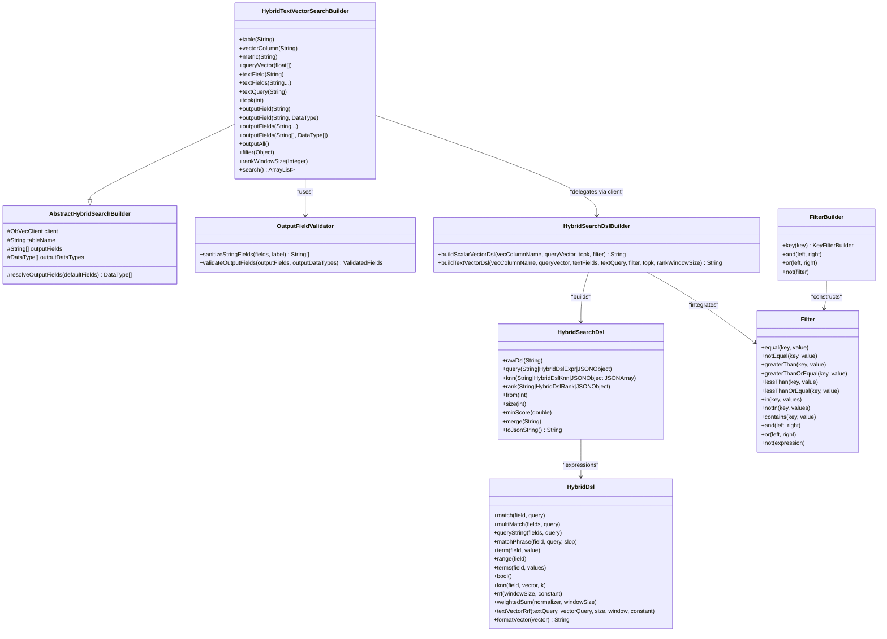
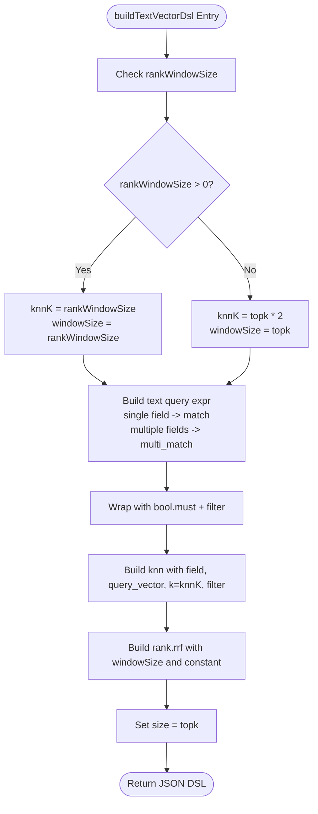

# Text + Vector Search Builder

<cite>
**Referenced Files in This Document**
- [HybridTextVectorSearchBuilder.java](file://src/main/java/com/oceanbase/obvector4j/hybrid/HybridTextVectorSearchBuilder.java)
- [AbstractHybridSearchBuilder.java](file://src/main/java/com/oceanbase/obvector4j/hybrid/AbstractHybridSearchBuilder.java)
- [OutputFieldValidator.java](file://src/main/java/com/oceanbase/obvector4j/hybrid/OutputFieldValidator.java)
- [HybridSearchDslBuilder.java](file://src/main/java/com/oceanbase/obvector4j/hybrid/core/HybridSearchDslBuilder.java)
- [HybridSearchDsl.java](file://src/main/java/com/oceanbase/obvector4j/hybrid/core/HybridSearchDsl.java)
- [HybridDsl.java](file://src/main/java/com/oceanbase/obvector4j/hybrid/core/dsl/HybridDsl.java)
- [Filter.java](file://src/main/java/com/oceanbase/obvector4j/filter/Filter.java)
- [FilterBuilder.java](file://src/main/java/com/oceanbase/obvector4j/filter/FilterBuilder.java)
- [03-hybrid-search.md](file://docs/en/03-hybrid-search.md)
- [05-hybrid-search-dsl.md](file://docs/en/05-hybrid-search-dsl.md)
- [HybridSearchDslTest.java](file://src/test/java/com/oceanbase/obvector4j/unit/HybridSearchDslTest.java)
</cite>

## Table of Contents
1. [Introduction](#introduction)
2. [Project Structure](#project-structure)
3. [Core Components](#core-components)
4. [Architecture Overview](#architecture-overview)
5. [Detailed Component Analysis](#detailed-component-analysis)
6. [Dependency Analysis](#dependency-analysis)
7. [Performance Considerations](#performance-considerations)
8. [Troubleshooting Guide](#troubleshooting-guide)
9. [Conclusion](#conclusion)
10. [Appendices](#appendices)

## Introduction
This document explains the text + vector search builder implementation that combines semantic similarity search with full-text keyword matching using HybridTextVectorSearchBuilder. It covers:
- Configuring textFields and textQuery
- Integrating Filter expressions for faceted filtering
- Building the HYBRID_SEARCH DSL via HybridSearchDslBuilder.buildTextVectorDsl
- Optimizing ranking with rankWindowSize
- Validating output fields and data types
- Practical examples for building retrieval systems, combining embeddings with metadata filters, and tuning relevance through field weighting

## Project Structure
The text + vector search path is implemented by a fluent builder that validates inputs, resolves output fields, and delegates to the client. On OceanBase 4.6.0+, the SDK builds a JSON DSL for HYBRID_SEARCH using HybridSearchDslBuilder and HybridSearchDsl.

**Diagram sources**
- [HybridTextVectorSearchBuilder.java](file://src/main/java/com/oceanbase/obvector4j/hybrid/HybridTextVectorSearchBuilder.java)
- [AbstractHybridSearchBuilder.java](file://src/main/java/com/oceanbase/obvector4j/hybrid/AbstractHybridSearchBuilder.java)
- [OutputFieldValidator.java](file://src/main/java/com/oceanbase/obvector4j/hybrid/OutputFieldValidator.java)
- [HybridSearchDslBuilder.java](file://src/main/java/com/oceanbase/obvector4j/hybrid/core/HybridSearchDslBuilder.java)
- [HybridSearchDsl.java](file://src/main/java/com/oceanbase/obvector4j/hybrid/core/HybridSearchDsl.java)
- [HybridDsl.java](file://src/main/java/com/oceanbase/obvector4j/hybrid/core/dsl/HybridDsl.java)

**Section sources**
- [HybridTextVectorSearchBuilder.java](file://src/main/java/com/oceanbase/obvector4j/hybrid/HybridTextVectorSearchBuilder.java)
- [AbstractHybridSearchBuilder.java](file://src/main/java/com/oceanbase/obvector4j/hybrid/AbstractHybridSearchBuilder.java)
- [OutputFieldValidator.java](file://src/main/java/com/oceanbase/obvector4j/hybrid/OutputFieldValidator.java)
- [HybridSearchDslBuilder.java](file://src/main/java/com/oceanbase/obvector4j/hybrid/core/HybridSearchDslBuilder.java)
- [HybridSearchDsl.java](file://src/main/java/com/oceanbase/obvector4j/hybrid/core/HybridSearchDsl.java)
- [HybridDsl.java](file://src/main/java/com/oceanbase/obvector4j/hybrid/core/dsl/HybridDsl.java)

## Core Components
- HybridTextVectorSearchBuilder: Fluent API to configure table, vector column, metric, query vector, text fields, text query, filter, topk, output fields, and rank window size; executes search.
- AbstractHybridSearchBuilder: Shared utilities to resolve output fields and infer data types when not provided.
- OutputFieldValidator: Sanitizes and validates field names and output fields.
- HybridSearchDslBuilder: Builds JSON DSL for HYBRID_SEARCH (text+vector), including RRF configuration and knn parameters.
- HybridSearchDsl and HybridDsl: Mutable DSL document and typed expression builders for query, knn, rank, pagination, and min_score.
- Filter and FilterBuilder: Type-safe filter construction for scalar conditions.

Key responsibilities:
- Input validation and sanitization
- Output field inference and type safety
- DSL composition for native HYBRID_SEARCH on 4.6.0+
- Integration of Filter into both text query and knn paths

**Section sources**
- [HybridTextVectorSearchBuilder.java](file://src/main/java/com/oceanbase/obvector4j/hybrid/HybridTextVectorSearchBuilder.java)
- [AbstractHybridSearchBuilder.java](file://src/main/java/com/oceanbase/obvector4j/hybrid/AbstractHybridSearchBuilder.java)
- [OutputFieldValidator.java](file://src/main/java/com/oceanbase/obvector4j/hybrid/OutputFieldValidator.java)
- [HybridSearchDslBuilder.java](file://src/main/java/com/oceanbase/obvector4j/hybrid/core/HybridSearchDslBuilder.java)
- [HybridSearchDsl.java](file://src/main/java/com/oceanbase/obvector4j/hybrid/core/HybridSearchDsl.java)
- [HybridDsl.java](file://src/main/java/com/oceanbase/obvector4j/hybrid/core/dsl/HybridDsl.java)
- [Filter.java](file://src/main/java/com/oceanbase/obvector4j/filter/Filter.java)
- [FilterBuilder.java](file://src/main/java/com/oceanbase/obvector4j/filter/FilterBuilder.java)

## Architecture Overview
End-to-end flow from builder to DSL execution:

**Diagram sources**
- [HybridTextVectorSearchBuilder.java](file://src/main/java/com/oceanbase/obvector4j/hybrid/HybridTextVectorSearchBuilder.java)
- [HybridSearchDslBuilder.java](file://src/main/java/com/oceanbase/obvector4j/hybrid/core/HybridSearchDslBuilder.java)
- [HybridSearchDsl.java](file://src/main/java/com/oceanbase/obvector4j/hybrid/core/HybridSearchDsl.java)
- [HybridDsl.java](file://src/main/java/com/oceanbase/obvector4j/hybrid/core/dsl/HybridDsl.java)

## Detailed Component Analysis

### HybridTextVectorSearchBuilder
Responsibilities:
- Accepts table name, vector column, metric, query vector, text fields, text query, filter, topk, output fields, and rankWindowSize
- Validates required inputs and sanitizes textFields
- Resolves output fields and infers data types if not provided
- Delegates to ObVecClient.hybridTextVectorSearch with all parameters

Important behaviors:
- textFields must be non-empty; sanitized to remove null/empty entries
- If outputFields are not set, defaults to textFields
- rankWindowSize controls knn k and rrf window size

Validation and error handling:
- Throws IllegalArgumentException for missing table, empty query vector, empty text fields, or empty text query
- Ensures output fields count matches data types count after resolution

**Section sources**
- [HybridTextVectorSearchBuilder.java](file://src/main/java/com/oceanbase/obvector4j/hybrid/HybridTextVectorSearchBuilder.java)
- [AbstractHybridSearchBuilder.java](file://src/main/java/com/oceanbase/obvector4j/hybrid/AbstractHybridSearchBuilder.java)
- [OutputFieldValidator.java](file://src/main/java/com/oceanbase/obvector4j/hybrid/OutputFieldValidator.java)

### OutputFieldValidator and AbstractHybridSearchBuilder
- OutputFieldValidator.sanitizeStringFields trims and removes null/empty strings; throws if all are invalid
- AbstractHybridSearchBuilder.resolveOutputFields:
  - Defaults outputFields to provided defaultFields if not set
  - Filters out null/empty fields
  - Infers DataType per field via client.inferColumnDataType if not explicitly provided
  - Validates counts match between fields and data types

Complexity:
- O(n) over number of output fields for trimming and validation
- Additional cost for type inference calls proportional to number of fields

**Section sources**
- [OutputFieldValidator.java](file://src/main/java/com/oceanbase/obvector4j/hybrid/OutputFieldValidator.java)
- [AbstractHybridSearchBuilder.java](file://src/main/java/com/oceanbase/obvector4j/hybrid/AbstractHybridSearchBuilder.java)

### HybridSearchDslBuilder.buildTextVectorDsl
Builds the HYBRID_SEARCH JSON DSL for text + vector search:
- Computes knnK and windowSize based on rankWindowSize:
  - If rankWindowSize > 0: knnK = rankWindowSize, windowSize = rankWindowSize
  - Else: knnK = topk * 2, windowSize = topk
- Builds text query expression:
  - Single text field → match
  - Multiple fields → multi_match
- Wraps text query with bool.must and includes filter in query.filter
- Adds knn with field, query_vector, k=knnK, and filter
- Adds rank.rrf with windowSize and constant (default 60)
- Sets size = topk

Integration with Filter:
- Filter is applied to both text query (must + filter) and knn (filter)

Ranking optimization:
- rankWindowSize tunes the fusion window and candidate pool size for better recall vs. precision trade-off

**Section sources**
- [HybridSearchDslBuilder.java](file://src/main/java/com/oceanbase/obvector4j/hybrid/core/HybridSearchDslBuilder.java)
- [HybridDsl.java](file://src/main/java/com/oceanbase/obvector4j/hybrid/core/dsl/HybridDsl.java)

### HybridSearchDsl and HybridDsl
- HybridSearchDsl: Mutable DSL document supporting raw JSON override, typed setters for query/knn/rank/from/size/minScore, merge, and toJsonString
- HybridDsl: Factory methods for match, multi_match, match_phrase, query_string, term, range, terms, json/array ops, bool, knn, rrf, weighted_sum, and convenience textVectorRrf/textVectorWeightedSum

Usage patterns:
- Compose query and knn expressions
- Apply rank fusion (RRF or weighted sum)
- Control pagination and score thresholds

**Section sources**
- [HybridSearchDsl.java](file://src/main/java/com/oceanbase/obvector4j/hybrid/core/HybridSearchDsl.java)
- [HybridDsl.java](file://src/main/java/com/oceanbase/obvector4j/hybrid/core/dsl/HybridDsl.java)

### Filter and FilterBuilder
- Filter: Immutable tree representing comparison and logical operations
- FilterBuilder: Fluent API to construct filters with key-based operations and combinators (and/or/not)

Integration points:
- Used in HybridSearchDslBuilder to wrap text query and knn filter sections
- Supports complex faceted scenarios by composing multiple conditions

**Section sources**
- [Filter.java](file://src/main/java/com/oceanbase/obvector4j/filter/Filter.java)
- [FilterBuilder.java](file://src/main/java/com/oceanbase/obvector4j/filter/FilterBuilder.java)

### Class Diagram

**Diagram sources**
- [HybridTextVectorSearchBuilder.java](file://src/main/java/com/oceanbase/obvector4j/hybrid/HybridTextVectorSearchBuilder.java)
- [AbstractHybridSearchBuilder.java](file://src/main/java/com/oceanbase/obvector4j/hybrid/AbstractHybridSearchBuilder.java)
- [OutputFieldValidator.java](file://src/main/java/com/oceanbase/obvector4j/hybrid/OutputFieldValidator.java)
- [HybridSearchDslBuilder.java](file://src/main/java/com/oceanbase/obvector4j/hybrid/core/HybridSearchDslBuilder.java)
- [HybridSearchDsl.java](file://src/main/java/com/oceanbase/obvector4j/hybrid/core/HybridSearchDsl.java)
- [HybridDsl.java](file://src/main/java/com/oceanbase/obvector4j/hybrid/core/dsl/HybridDsl.java)
- [Filter.java](file://src/main/java/com/oceanbase/obvector4j/filter/Filter.java)
- [FilterBuilder.java](file://src/main/java/com/oceanbase/obvector4j/filter/FilterBuilder.java)

### Flowchart: DSL Building Logic

**Diagram sources**
- [HybridSearchDslBuilder.java](file://src/main/java/com/oceanbase/obvector4j/hybrid/core/HybridSearchDslBuilder.java)
- [HybridDsl.java](file://src/main/java/com/oceanbase/obvector4j/hybrid/core/dsl/HybridDsl.java)

## Dependency Analysis
- HybridTextVectorSearchBuilder depends on:
  - AbstractHybridSearchBuilder for output field resolution
  - OutputFieldValidator for input sanitization
  - ObVecClient for executing hybridTextVectorSearch
- HybridSearchDslBuilder depends on:
  - HybridSearchDsl for document assembly
  - HybridDsl for typed expression factories
  - Filter for integrating scalar conditions
- HybridSearchDsl depends on:
  - HybridDsl for expression nodes and constants
- Filter and FilterBuilder provide a composable filter model used across components

Potential coupling:
- Strong cohesion within hybrid.core for DSL building
- Loose coupling via ObVecClient interface for execution
- No circular dependencies observed among analyzed files

External integration points:
- OceanBase HYBRID_SEARCH SQL interface (4.6.0+)
- Full-text indexes on text fields and vector index on embedding column

**Section sources**
- [HybridTextVectorSearchBuilder.java](file://src/main/java/com/oceanbase/obvector4j/hybrid/HybridTextVectorSearchBuilder.java)
- [HybridSearchDslBuilder.java](file://src/main/java/com/oceanbase/obvector4j/hybrid/core/HybridSearchDslBuilder.java)
- [HybridSearchDsl.java](file://src/main/java/com/oceanbase/obvector4j/hybrid/core/HybridSearchDsl.java)
- [HybridDsl.java](file://src/main/java/com/oceanbase/obvector4j/hybrid/core/dsl/HybridDsl.java)
- [Filter.java](file://src/main/java/com/oceanbase/obvector4j/filter/Filter.java)
- [FilterBuilder.java](file://src/main/java/com/oceanbase/obvector4j/filter/FilterBuilder.java)

## Performance Considerations
- rankWindowSize:
  - Controls knn k and RRF window size
  - Larger windows improve recall but increase computation; typical heuristic is >= topk
- Metric selection:
  - cosine for normalized vectors (common for text embeddings)
  - l2 for general similarity
  - ip for inner product on normalized vectors
- Output fields:
  - Specify only needed fields to reduce payload and type inference overhead
- Indexing:
  - Ensure vector index exists on embedding column
  - Create full-text indexes on all text fields used in search
- Pagination and min_score:
  - Use size and min_score to control result volume and quality

[No sources needed since this section provides general guidance]

## Troubleshooting Guide
Common issues and resolutions:
- Missing table name or empty query vector:
  - Ensure table and queryVector are set before search
- Empty text fields or text query:
  - Provide at least one non-empty text field and a non-empty textQuery
- Output fields mismatch:
  - Ensure outputFields count equals outputDataTypes length after resolution
- Invalid DSL:
  - Verify at least one of query or knn is present in DSL
- Version compatibility:
  - Native HYBRID_SEARCH requires OceanBase ≥ 4.6.0; otherwise use legacy paths

Relevant validations:
- Builder-level checks for required parameters
- OutputFieldValidator sanitization and validation
- HybridSearchDsl requirement for query or knn

**Section sources**
- [HybridTextVectorSearchBuilder.java](file://src/main/java/com/oceanbase/obvector4j/hybrid/HybridTextVectorSearchBuilder.java)
- [AbstractHybridSearchBuilder.java](file://src/main/java/com/oceanbase/obvector4j/hybrid/AbstractHybridSearchBuilder.java)
- [OutputFieldValidator.java](file://src/main/java/com/oceanbase/obvector4j/hybrid/OutputFieldValidator.java)
- [HybridSearchDsl.java](file://src/main/java/com/oceanbase/obvector4j/hybrid/core/HybridSearchDsl.java)
- [HybridSearchDslTest.java](file://src/test/java/com/oceanbase/obvector4j/unit/HybridSearchDslTest.java)

## Conclusion
HybridTextVectorSearchBuilder offers a robust, type-safe way to combine full-text and vector search. By configuring textFields, textQuery, and Filter expressions, and tuning rankWindowSize, you can achieve high-quality results with efficient ranking via RRF. The underlying DSL builders ensure correct composition of query, knn, and rank sections for OceanBase 4.6.0+.

[No sources needed since this section summarizes without analyzing specific files]

## Appendices

### Practical Examples

- Basic text + vector search:
  - Configure table, queryVector, textFields, textQuery, metric, topk, and execute search
- Combining embeddings with metadata filtering:
  - Build a Filter using FilterBuilder and pass it to the builder
- Optimizing relevance with field weighting:
  - Use multi_match with boosted fields and tune rankWindowSize for better fusion

For detailed usage patterns and constraints, see:
- [03-hybrid-search.md](file://docs/en/03-hybrid-search.md)
- [05-hybrid-search-dsl.md](file://docs/en/05-hybrid-search-dsl.md)

**Section sources**
- [03-hybrid-search.md](file://docs/en/03-hybrid-search.md)
- [05-hybrid-search-dsl.md](file://docs/en/05-hybrid-search-dsl.md)