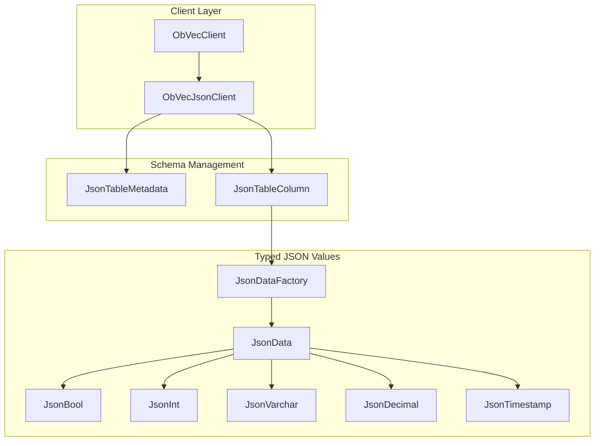
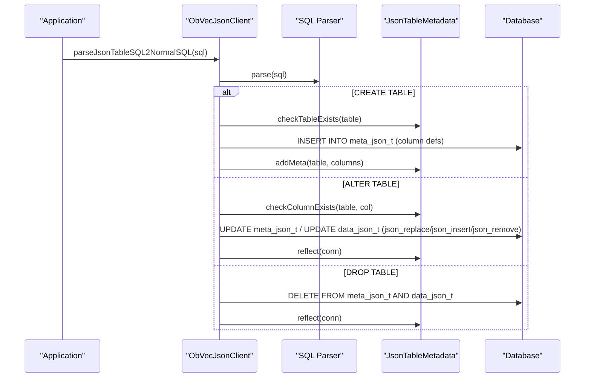
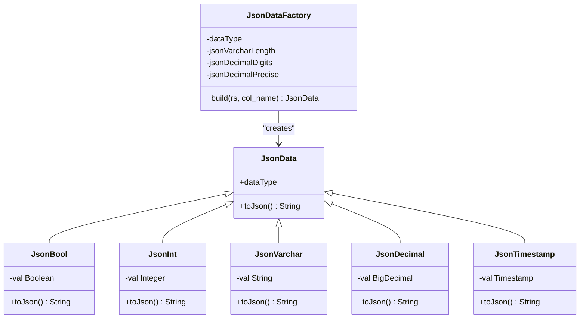
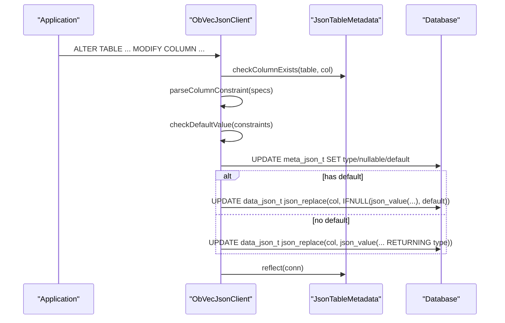
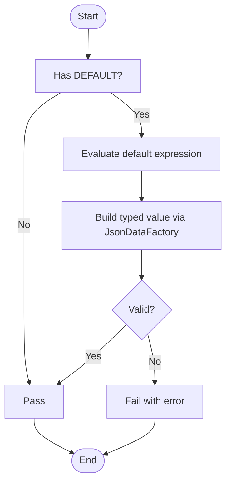

# JSON Virtual Table System

<cite>
**Referenced Files in This Document**
- [ObVecJsonClient.java](file://src/main/java/com/oceanbase/obvector4j/ObVecJsonClient.java)
- [ObVecClient.java](file://src/main/java/com/oceanbase/obvector4j/ObVecClient.java)
- [JsonTableMetadata.java](file://src/main/java/com/oceanbase/obvector4j/json_table/JsonTableMetadata.java)
- [JsonTableColumn.java](file://src/main/java/com/oceanbase/obvector4j/json_table/JsonTableColumn.java)
- [JsonDataFactory.java](file://src/main/java/com/oceanbase/obvector4j/json_table/JsonDataFactory.java)
- [JsonDataType.java](file://src/main/java/com/oceanbase/obvector4j/json_table/JsonDataType.java)
- [JsonData.java](file://src/main/java/com/oceanbase/obvector4j/json_table/JsonData.java)
- [JsonBool.java](file://src/main/java/com/oceanbase/obvector4j/json_table/JsonBool.java)
- [JsonInt.java](file://src/main/java/com/oceanbase/obvector4j/json_table/JsonInt.java)
- [JsonVarchar.java](file://src/main/java/com/oceanbase/obvector4j/json_table/JsonVarchar.java)
- [JsonDecimal.java](file://src/main/java/com/oceanbase/obvector4j/json_table/JsonDecimal.java)
- [JsonTimestamp.java](file://src/main/java/com/oceanbase/obvector4j/json_table/JsonTimestamp.java)
</cite>

## Update Summary
**Changes Made**
- Updated resource management section to reflect improved try-with-resources implementation
- Enhanced error handling documentation for JsonTableMetadata.reflect() and JsonTableColumn.validation() methods
- Added reliability improvements section covering modern Java resource management patterns
- Updated troubleshooting guide with new error handling behaviors

## Table of Contents
1. [Introduction](#introduction)
2. [Project Structure](#project-structure)
3. [Core Components](#core-components)
4. [Architecture Overview](#architecture-overview)
5. [Detailed Component Analysis](#detailed-component-analysis)
6. [Resource Management and Error Handling](#resource-management-and-error-handling)
7. [Dependency Analysis](#dependency-analysis)
8. [Performance Considerations](#performance-considerations)
9. [Troubleshooting Guide](#troubleshooting-guide)
10. [Conclusion](#conclusion)
11. [Appendices](#appendices)

## Introduction
This document explains the JSON virtual table system that enables dynamic schema evolution over semi-structured data. It focuses on:
- Schema discovery and management via JsonTableMetadata
- Dynamic column definitions via JsonTableColumn
- Typed JSON value creation via JsonDataFactory and its concrete types
- Automatic schema inference from CREATE TABLE statements
- Type mapping between relational types and JSON values
- Query transformation for semi-structured data using SQL-like syntax
- Practical examples, performance considerations, indexing strategies, and best practices for evolving schemas without downtime

The system is implemented as a client-side layer that intercepts DDL (CREATE/ALTER/DROP) to maintain metadata and transform operations into native JSON storage updates.

## Project Structure
At a high level, the JSON virtual table system consists of:
- A client entry point that parses SQL and orchestrates schema changes
- Metadata persistence and caching for virtual tables
- Column-level type handling and validation
- Factory-based construction of typed JSON values

**Diagram sources**
- [ObVecJsonClient.java](file://src/main/java/com/oceanbase/obvector4j/ObVecJsonClient.java)
- [ObVecClient.java](file://src/main/java/com/oceanbase/obvector4j/ObVecClient.java)
- [JsonTableMetadata.java](file://src/main/java/com/oceanbase/obvector4j/json_table/JsonTableMetadata.java)
- [JsonTableColumn.java](file://src/main/java/com/oceanbase/obvector4j/json_table/JsonTableColumn.java)
- [JsonDataFactory.java](file://src/main/java/com/oceanbase/obvector4j/json_table/JsonDataFactory.java)
- [JsonData.java](file://src/main/java/com/oceanbase/obvector4j/json_table/JsonData.java)
- [JsonBool.java](file://src/main/java/com/oceanbase/obvector4j/json_table/JsonBool.java)
- [JsonInt.java](file://src/main/java/com/oceanbase/obvector4j/json_table/JsonInt.java)
- [JsonVarchar.java](file://src/main/java/com/oceanbase/obvector4j/json_table/JsonVarchar.java)
- [JsonDecimal.java](file://src/main/java/com/oceanbase/obvector4j/json_table/JsonDecimal.java)
- [JsonTimestamp.java](file://src/main/java/com/oceanbase/obvector4j/json_table/JsonTimestamp.java)

**Section sources**
- [ObVecJsonClient.java](file://src/main/java/com/oceanbase/obvector4j/ObVecJsonClient.java)
- [ObVecClient.java](file://src/main/java/com/oceanbase/obvector4j/ObVecClient.java)

## Core Components
- ObVecJsonClient: Parses SQL (CREATE/ALTER/DROP), enforces constraints, persists metadata, and transforms JSON documents accordingly.
- JsonTableMetadata: Caches and reflects virtual table/column metadata from a persistent meta store with improved resource management.
- JsonTableColumn: Encapsulates column definition, default values, nullability, and delegates type-specific behavior to JsonDataFactory with enhanced error handling.
- JsonDataFactory: Builds typed JSON values based on declared column types.
- Typed JSON wrappers: JsonBool, JsonInt, JsonVarchar, JsonDecimal, JsonTimestamp implement consistent serialization to JSON-compatible strings.

Key responsibilities:
- Schema discovery: Reflecting metadata from the meta store into an in-memory cache with automatic resource cleanup.
- Type mapping: Relational types to typed JSON values and back to JSON literals.
- Validation: Enforcing defaults, lengths, precision/scale, and nullability at schema time with robust error handling.
- Evolution: Applying ALTER operations atomically with transactional guarantees.

**Section sources**
- [ObVecJsonClient.java](file://src/main/java/com/oceanbase/obvector4j/ObVecJsonClient.java)
- [JsonTableMetadata.java](file://src/main/java/com/oceanbase/obvector4j/json_table/JsonTableMetadata.java)
- [JsonTableColumn.java](file://src/main/java/com/oceanbase/obvector4j/json_table/JsonTableColumn.java)
- [JsonDataFactory.java](file://src/main/java/com/oceanbase/obvector4j/json_table/JsonDataFactory.java)
- [JsonBool.java](file://src/main/java/com/oceanbase/obvector4j/json_table/JsonBool.java)
- [JsonInt.java](file://src/main/java/com/oceanbase/obvector4j/json_table/JsonInt.java)
- [JsonVarchar.java](file://src/main/java/com/oceanbase/obvector4j/json_table/JsonVarchar.java)
- [JsonDecimal.java](file://src/main/java/com/oceanbase/obvector4j/json_table/JsonDecimal.java)
- [JsonTimestamp.java](file://src/main/java/com/oceanbase/obvector4j/json_table/JsonTimestamp.java)

## Architecture Overview
The JSON virtual table system uses two internal tables:
- Data table: Stores user documents as JSON payloads along with routing keys.
- Meta table: Stores per-table column definitions, types, nullability, and default expressions.

**Diagram sources**
- [ObVecJsonClient.java](file://src/main/java/com/oceanbase/obvector4j/ObVecJsonClient.java)
- [JsonTableMetadata.java](file://src/main/java/com/oceanbase/obvector4j/json_table/JsonTableMetadata.java)

## Detailed Component Analysis

### ObVecJsonClient
Responsibilities:
- Initialize and manage internal data and meta tables
- Parse SQL and dispatch to handlers for CREATE/ALTER/DROP
- Validate column specs (DEFAULT, NOT NULL) and default expressions
- Apply schema evolution by updating both meta and data stores
- Maintain in-memory metadata cache and refresh it after mutations

Highlights:
- Transactional execution for all DDL operations
- Mapping of logical column types to JSON return types for safe casting
- Support for ADD COLUMN, MODIFY COLUMN, CHANGE COLUMN, DROP COLUMN, and RENAME TABLE

**Section sources**
- [ObVecJsonClient.java](file://src/main/java/com/oceanbase/obvector4j/ObVecJsonClient.java)

### JsonTableMetadata
Responsibilities:
- Reflect current schema from meta table into memory with improved resource management
- Provide lookup helpers for table and column existence
- Manage cache lifecycle (add/delete/clear)

Behavior:
- Queries meta table and constructs JsonTableColumn entries using try-with-resources for automatic cleanup
- Parses stored default expressions and validates them with enhanced error handling
- Exposes methods to check and retrieve metadata

**Updated** The reflect() method now uses try-with-resources pattern for Statement and ResultSet objects, eliminating manual resource cleanup and improving reliability.

**Section sources**
- [JsonTableMetadata.java](file://src/main/java/com/oceanbase/obvector4j/json_table/JsonTableMetadata.java)

### JsonTableColumn
Responsibilities:
- Represent a single column's definition and constraints
- Determine appropriate JsonDataFactory based on declared type
- Validate default values against the factory with simplified error handling

Type mapping logic:
- TINYINT -> boolean
- INT -> integer
- VARCHAR(n) -> string with length constraint
- DECIMAL(p,s) -> decimal with precision/scale
- TIMESTAMP -> timestamp

Validation:
- Ensures non-nullable columns with defaults are well-formed
- Delegates actual parsing/validation to JsonDataFactory with robust exception handling

**Updated** The validation() method now provides simplified error handling flow, removing unnecessary printStackTrace() calls and providing cleaner exception propagation.

**Section sources**
- [JsonTableColumn.java](file://src/main/java/com/oceanbase/obvector4j/json_table/JsonTableColumn.java)

### JsonDataFactory and Typed JSON Wrappers
Responsibilities:
- Build typed JSON values from JDBC ResultSet or raw inputs
- Enforce type-specific constraints (length, precision/scale)
- Serialize values to JSON-compatible strings

Supported types:
- Boolean, Integer, String (with length), Decimal (with precision/scale), Timestamp

Constraints:
- Length checks for strings
- Precision/scale validation and rounding for decimals
- Null-safe serialization

**Section sources**
- [JsonDataFactory.java](file://src/main/java/com/oceanbase/obvector4j/json_table/JsonDataFactory.java)
- [JsonData.java](file://src/main/java/com/oceanbase/obvector4j/json_table/JsonData.java)
- [JsonBool.java](file://src/main/java/com/oceanbase/obvector4j/json_table/JsonBool.java)
- [JsonInt.java](file://src/main/java/com/oceanbase/obvector4j/json_table/JsonInt.java)
- [JsonVarchar.java](file://src/main/java/com/oceanbase/obvector4j/json_table/JsonVarchar.java)
- [JsonDecimal.java](file://src/main/java/com/oceanbase/obvector4j/json_table/JsonDecimal.java)
- [JsonTimestamp.java](file://src/main/java/com/oceanbase/obvector4j/json_table/JsonTimestamp.java)

### Class Diagram: Typed JSON Value Model

**Diagram sources**
- [JsonData.java](file://src/main/java/com/oceanbase/obvector4j/json_table/JsonData.java)
- [JsonBool.java](file://src/main/java/com/oceanbase/obvector4j/json_table/JsonBool.java)
- [JsonInt.java](file://src/main/java/com/oceanbase/obvector4j/json_table/JsonInt.java)
- [JsonVarchar.java](file://src/main/java/com/oceanbase/obvector4j/json_table/JsonVarchar.java)
- [JsonDecimal.java](file://src/main/java/com/oceanbase/obvector4j/json_table/JsonDecimal.java)
- [JsonTimestamp.java](file://src/main/java/com/oceanbase/obvector4j/json_table/JsonTimestamp.java)
- [JsonDataFactory.java](file://src/main/java/com/oceanbase/obvector4j/json_table/JsonDataFactory.java)

### Sequence Diagram: ALTER MODIFY COLUMN

**Diagram sources**
- [ObVecJsonClient.java](file://src/main/java/com/oceanbase/obvector4j/ObVecJsonClient.java)
- [JsonTableMetadata.java](file://src/main/java/com/oceanbase/obvector4j/json_table/JsonTableMetadata.java)

### Flowchart: Default Value Validation

**Diagram sources**
- [ObVecJsonClient.java](file://src/main/java/com/oceanbase/obvector4j/ObVecJsonClient.java)
- [JsonTableColumn.java](file://src/main/java/com/oceanbase/obvector4j/json_table/JsonTableColumn.java)
- [JsonDataFactory.java](file://src/main/java/com/oceanbase/obvector4j/json_table/JsonDataFactory.java)

## Resource Management and Error Handling

### Modern Resource Management Patterns
The JSON virtual table system implements modern Java resource management patterns to ensure reliable database connection handling and prevent resource leaks.

#### Try-With-Resources Implementation
**Updated** The system now uses try-with-resources statements throughout critical database operations:

- **JsonTableMetadata.reflect()**: Uses try-with-resources for Statement and ResultSet objects, automatically closing resources even when exceptions occur
- **ObVecJsonClient operations**: All SQL operations use try-with-resources for PreparedStatement and Statement objects
- **Automatic cleanup**: Resources are guaranteed to be closed in reverse order of their declaration, preventing connection leaks

#### Enhanced Error Handling
**Updated** Error handling has been simplified and made more robust:

- **Simplified exception flow**: Removed unnecessary printStackTrace() calls in favor of clean exception propagation
- **Consistent error messages**: All validation errors provide clear, actionable error messages
- **Graceful degradation**: Resource failures are handled gracefully without leaving connections in inconsistent states

#### Resource Lifecycle Management
The system follows strict resource lifecycle patterns:

1. **Acquisition**: Resources are acquired within try-with-resources blocks
2. **Usage**: Operations execute within the scope of resource availability
3. **Cleanup**: Resources are automatically closed when the try block exits, whether normally or due to exceptions
4. **Exception Propagation**: Exceptions are propagated up the call stack with minimal wrapping

**Section sources**
- [JsonTableMetadata.java:35-80](file://src/main/java/com/oceanbase/obvector4j/json_table/JsonTableMetadata.java#L35-L80)
- [JsonTableColumn.java:81-88](file://src/main/java/com/oceanbase/obvector4j/json_table/JsonTableColumn.java#L81-L88)
- [ObVecJsonClient.java:65-80](file://src/main/java/com/oceanbase/obvector4j/ObVecJsonClient.java#L65-L80)

## Dependency Analysis
- ObVecJsonClient depends on:
  - JsonTableMetadata for schema reflection and caching with improved resource management
  - JsonTableColumn for column-level type resolution and validation with enhanced error handling
  - JsonDataFactory and typed wrappers for building and validating values
  - SQL parser to interpret DDL statements
- JsonTableMetadata depends on:
  - Database connection to read meta_json_t with automatic resource cleanup
  - JsonTableColumn to construct column objects
- JsonTableColumn depends on:
  - JsonDataFactory for type-specific behavior with simplified error handling
- JsonDataFactory depends on:
  - Typed JSON wrappers for serialization and validation

Potential coupling points:
- Type string parsing in JsonTableColumn and ObVecJsonClient must remain consistent
- Default expression evaluation relies on database function support
- Resource management patterns must be consistently applied across all database operations

**Diagram sources**
- [ObVecJsonClient.java](file://src/main/java/com/oceanbase/obvector4j/ObVecJsonClient.java)
- [JsonTableMetadata.java](file://src/main/java/com/oceanbase/obvector4j/json_table/JsonTableMetadata.java)
- [JsonTableColumn.java](file://src/main/java/com/oceanbase/obvector4j/json_table/JsonTableColumn.java)
- [JsonDataFactory.java](file://src/main/java/com/oceanbase/obvector4j/json_table/JsonDataFactory.java)

**Section sources**
- [ObVecJsonClient.java](file://src/main/java/com/oceanbase/obvector4j/ObVecJsonClient.java)
- [JsonTableMetadata.java](file://src/main/java/com/oceanbase/obvector4j/json_table/JsonTableMetadata.java)
- [JsonTableColumn.java](file://src/main/java/com/oceanbase/obvector4j/json_table/JsonTableColumn.java)
- [JsonDataFactory.java](file://src/main/java/com/oceanbase/obvector4j/json_table/JsonDataFactory.java)

## Performance Considerations
- Schema operations are transactional; large-scale ALTERs may lock rows and impact throughput.
- Prefer batched schema changes and off-peak maintenance windows for heavy modifications.
- Use explicit output fields and filters to minimize scanning when querying JSON documents.
- Avoid overly wide VARCHAR or high-precision DECIMAL unless necessary to reduce storage and CPU overhead.
- For frequent path access patterns, consider denormalization or materialized views if supported by your environment.
- **Updated** Resource management improvements reduce connection overhead and improve overall system reliability under load.

## Troubleshooting Guide
Common issues and resolutions:
- Invalid default value: Ensure DEFAULT expressions evaluate to valid typed values under the declared column type.
- Unsupported column spec: Only DEFAULT and NOT NULL are supported in column specs.
- Duplicate table or column names: CREATE TABLE and ADD COLUMN enforce uniqueness within a user context.
- Type mismatch during MODIFY: The new type must be compatible; the system attempts safe casting using JSON functions.
- **Updated** Resource-related errors: Connection leaks are now prevented through try-with-resources; if connection issues persist, check database connectivity and pool configuration.

Operational tips:
- Refresh metadata after external changes to meta_json_t using the provided refresh method.
- Inspect logs emitted during schema operations to diagnose failures.
- **Updated** Monitor resource usage patterns; the improved resource management should eliminate most connection-related issues.

**Section sources**
- [ObVecJsonClient.java](file://src/main/java/com/oceanbase/obvector4j/ObVecJsonClient.java)
- [JsonTableMetadata.java](file://src/main/java/com/oceanbase/obvector4j/json_table/JsonTableMetadata.java)

## Conclusion
The JSON virtual table system provides a robust mechanism for dynamic schema evolution over semi-structured data. By separating schema metadata from JSON payloads and enforcing type safety through factories and validators, it enables safe, transactional schema changes while preserving compatibility with SQL-like interfaces. The recent improvements in resource management and error handling further enhance system reliability and maintainability. Proper use of constraints, careful type selection, and mindful query design will help achieve reliable performance and smooth evolution over time.

## Appendices

### Examples and Best Practices

- Creating a virtual table from a JSON collection:
  - Define a CREATE TABLE statement with typed columns and constraints.
  - The client persists column definitions and initializes defaults.
  - Subsequent inserts can target the virtual table name; underlying storage remains JSON.

- Performing schema evolution without downtime:
  - Use ALTER TABLE ADD/MODIFY/COLUMN to evolve schemas.
  - The system applies changes atomically and updates existing documents where applicable.
  - Refresh metadata to ensure consistency after external changes.

- Querying nested JSON structures:
  - Use standard SQL SELECT with projected fields.
  - Combine with WHERE clauses to filter on JSON paths as supported by the database.

- Indexing strategies for JSON paths:
  - Create indexes on frequently accessed scalar fields extracted from JSON.
  - Use full-text indexes for text-heavy fields when applicable.
  - Evaluate composite indexes for common filter combinations.

- Managing evolving document schemas:
  - Keep column types stable; prefer widening conversions (e.g., smaller to larger numeric types).
  - Validate defaults rigorously before deployment.
  - Monitor metadata cache and refresh when necessary.
  - **Updated** Leverage improved resource management for better operational stability.