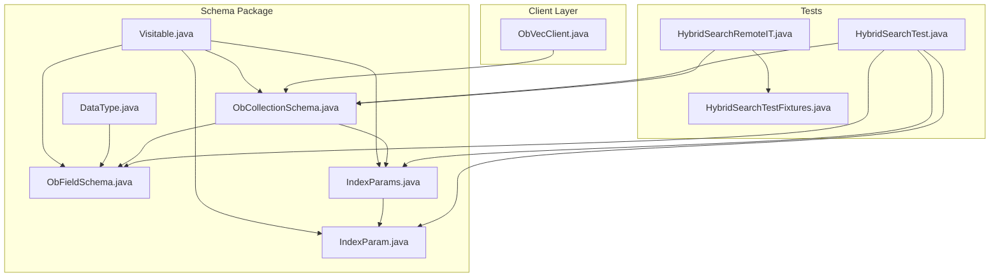
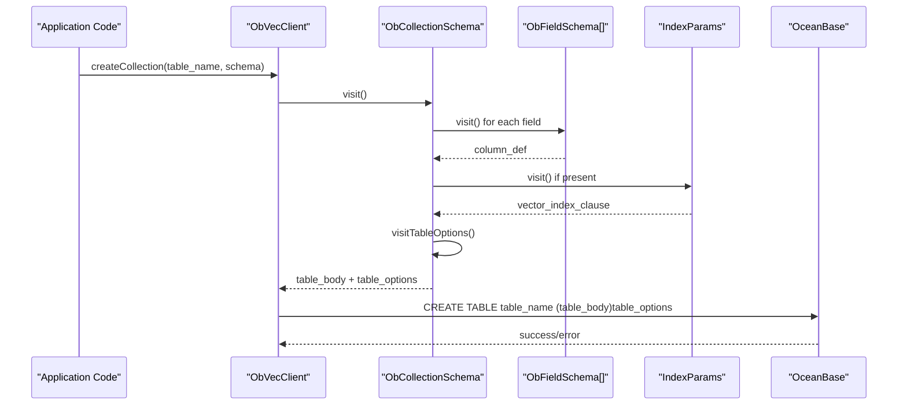
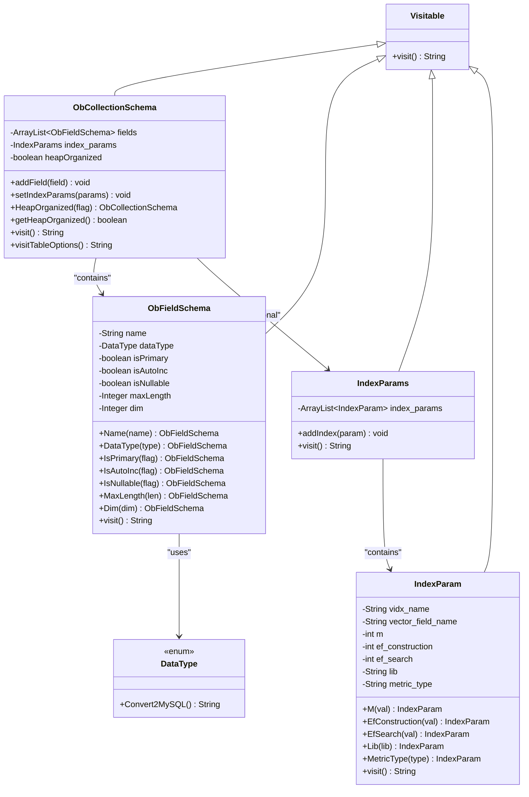
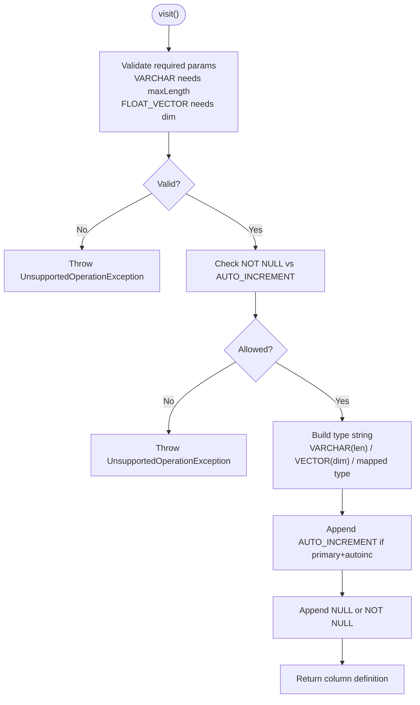
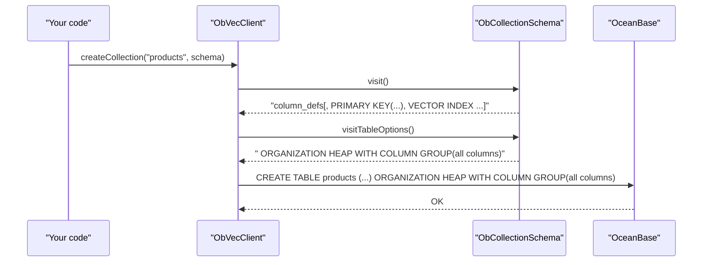
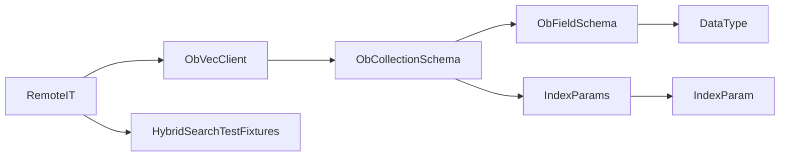

# Collection Schema Definition

<cite>
**Referenced Files in This Document**
- [ObCollectionSchema.java](file://src/main/java/com/oceanbase/obvector4j/schema/ObCollectionSchema.java)
- [ObFieldSchema.java](file://src/main/java/com/oceanbase/obvector4j/schema/ObFieldSchema.java)
- [IndexParam.java](file://src/main/java/com/oceanbase/obvector4j/schema/IndexParam.java)
- [IndexParams.java](file://src/main/java/com/oceanbase/obvector4j/schema/IndexParams.java)
- [DataType.java](file://src/main/java/com/oceanbase/obvector4j/schema/DataType.java)
- [Visitable.java](file://src/main/java/com/oceanbase/obvector4j/schema/Visitable.java)
- [ObVecClient.java](file://src/main/java/com/oceanbase/obvector4j/ObVecClient.java)
- [HybridSearchTest.java](file://src/test/java/com/oceanbase/obvector4j/integration/container/HybridSearchTest.java)
- [HybridSearchRemoteIT.java](file://src/test/java/com/oceanbase/obvector4j/integration/remote/HybridSearchRemoteIT.java)
- [HybridSearchTestFixtures.java](file://src/test/java/com/oceanbase/obvector4j/support/HybridSearchTestFixtures.java)
</cite>

## Update Summary
**Changes Made**
- Added documentation for new heap-organized table support through `HeapOrganized(boolean)` method
- Updated architecture diagrams to include `visitTableOptions()` method
- Enhanced examples to demonstrate hybrid search table creation with ORGANIZATION HEAP
- Added best practices for heap-organized tables and migration strategies
- Updated troubleshooting guide with heap-organized table considerations

## Table of Contents
1. Introduction
2. Project Structure
3. Core Components
4. Architecture Overview
5. Detailed Component Analysis
6. Dependency Analysis
7. Performance Considerations
8. Troubleshooting Guide
9. Conclusion

## Introduction
This document explains how to define table structures using the ObCollectionSchema class and related schema components. It covers:
- Building schemas with a fluent builder pattern for fields and indexes
- Adding multiple scalar and vector columns
- Configuring HNSW index parameters for vector search
- **NEW**: Creating heap-organized tables required for hybrid search capabilities
- The visitor-based SQL generation that produces CREATE TABLE statements compatible with OceanBase
- Practical examples, best practices, performance considerations, and migration strategies

**Updated** Added comprehensive coverage of heap-organized table support for hybrid search operations including scalar-vector, text-vector, and HYBRID_SEARCH DSL functionality.

## Project Structure
The schema subsystem lives under the schema package and is consumed by the client layer to generate DDL and manage vector indexes.

**Diagram sources**
- [ObCollectionSchema.java:1-77](file://src/main/java/com/oceanbase/obvector4j/schema/ObCollectionSchema.java#L1-L77)
- [ObFieldSchema.java:1-104](file://src/main/java/com/oceanbase/obvector4j/schema/ObFieldSchema.java#L1-L104)
- [IndexParams.java:1-28](file://src/main/java/com/oceanbase/obvector4j/schema/IndexParams.java#L1-L28)
- [IndexParam.java:1-65](file://src/main/java/com/oceanbase/obvector4j/schema/IndexParam.java#L1-L65)
- [DataType.java:1-36](file://src/main/java/com/oceanbase/obvector4j/schema/DataType.java#L1-L36)
- [Visitable.java:1-6](file://src/main/java/com/oceanbase/obvector4j/schema/Visitable.java#L1-L6)
- [ObVecClient.java:122-131](file://src/main/java/com/oceanbase/obvector4j/ObVecClient.java#L122-L131)
- [HybridSearchTest.java:84-107](file://src/test/java/com/oceanbase/obvector4j/integration/container/HybridSearchTest.java#L84-L107)
- [HybridSearchRemoteIT.java:88-93](file://src/test/java/com/oceanbase/obvector4j/integration/remote/HybridSearchRemoteIT.java#L88-L93)
- [HybridSearchTestFixtures.java:10-12](file://src/test/java/com/oceanbase/obvector4j/support/HybridSearchTestFixtures.java#L10-L12)

**Section sources**
- [ObCollectionSchema.java:1-77](file://src/main/java/com/oceanbase/obvector4j/schema/ObCollectionSchema.java#L1-L77)
- [ObFieldSchema.java:1-104](file://src/main/java/com/oceanbase/obvector4j/schema/ObFieldSchema.java#L1-L104)
- [IndexParams.java:1-28](file://src/main/java/com/oceanbase/obvector4j/schema/IndexParams.java#L1-L28)
- [IndexParam.java:1-65](file://src/main/java/com/oceanbase/obvector4j/schema/IndexParam.java#L1-L65)
- [DataType.java:1-36](file://src/main/java/com/oceanbase/obvector4j/schema/DataType.java#L1-L36)
- [Visitable.java:1-6](file://src/main/java/com/oceanbase/obvector4j/schema/Visitable.java#L1-L6)
- [ObVecClient.java:122-131](file://src/main/java/com/oceanbase/obvector4j/ObVecClient.java#L122-L131)
- [HybridSearchTest.java:84-107](file://src/test/java/com/oceanbase/obvector4j/integration/container/HybridSearchTest.java#L84-L107)
- [HybridSearchRemoteIT.java:88-93](file://src/test/java/com/oceanbase/obvector4j/integration/remote/HybridSearchRemoteIT.java#L88-L93)
- [HybridSearchTestFixtures.java:10-12](file://src/test/java/com/oceanbase/obvector4j/support/HybridSearchTestFixtures.java#L10-L12)

## Core Components
- Visitable: Abstract base defining a visit() method used to produce SQL fragments.
- ObCollectionSchema: Represents a table schema; aggregates field definitions and optional vector index parameters; generates the full table definition via visit(); **NEW**: supports heap-organized table configuration via HeapOrganized() method and visitTableOptions().
- ObFieldSchema: Describes a single column (name, type, constraints); supports builder-style setters and validates required parameters for VARCHAR and FLOAT_VECTOR types.
- IndexParams: Holds one or more IndexParam entries; serializes them into VECTOR INDEX clauses.
- IndexParam: Encapsulates HNSW index configuration (name, target vector field, m, ef_construction, ef_search, lib, metric_type).
- DataType: Enum mapping logical types to MySQL-compatible types and special handling for VECTOR.

Key behaviors:
- Builder pattern: Fluent setters on ObFieldSchema and IndexParam return the instance to allow chaining.
- Visitor pattern: Each component implements visit() to render its SQL fragment; ObCollectionSchema composes these fragments into a complete CREATE TABLE body.
- Validation: ObFieldSchema enforces presence of maxLength for VARCHAR and dim for FLOAT_VECTOR; prevents nullable auto-increment primary keys.
- **NEW**: Heap-organized table support enables hybrid search capabilities through ORGANIZATION HEAP WITH COLUMN GROUP(all columns) clause.

**Section sources**
- [Visitable.java:1-6](file://src/main/java/com/oceanbase/obvector4j/schema/Visitable.java#L1-L6)
- [ObCollectionSchema.java:1-77](file://src/main/java/com/oceanbase/obvector4j/schema/ObCollectionSchema.java#L1-L77)
- [ObFieldSchema.java:1-104](file://src/main/java/com/oceanbase/obvector4j/schema/ObFieldSchema.java#L1-L104)
- [IndexParams.java:1-28](file://src/main/java/com/oceanbase/obvector4j/schema/IndexParams.java#L1-L28)
- [IndexParam.java:1-65](file://src/main/java/com/oceanbase/obvector4j/schema/IndexParam.java#L1-L65)
- [DataType.java:1-36](file://src/main/java/com/oceanbase/obvector4j/schema/DataType.java#L1-L36)

## Architecture Overview
The schema classes implement a simple visitor pattern to assemble SQL fragments. ObVecClient consumes the generated fragment to execute CREATE TABLE, now including table options for heap-organized tables.

**Diagram sources**
- [ObVecClient.java:122-131](file://src/main/java/com/oceanbase/obvector4j/ObVecClient.java#L122-L131)
- [ObCollectionSchema.java:40-74](file://src/main/java/com/oceanbase/obvector4j/schema/ObCollectionSchema.java#L40-L74)
- [ObFieldSchema.java:85-103](file://src/main/java/com/oceanbase/obvector4j/schema/ObFieldSchema.java#L85-L103)
- [IndexParams.java:16-27](file://src/main/java/com/oceanbase/obvector4j/schema/IndexParams.java#L16-L27)

## Detailed Component Analysis

### ObCollectionSchema
Responsibilities:
- Maintain ordered list of ObFieldSchema instances
- Optionally hold IndexParams for vector indexes
- Compose final table definition by joining column definitions, optional PRIMARY KEY clause, and optional vector index clauses
- **NEW**: Configure heap-organized table storage for hybrid search capabilities

Processing logic:
- Iterates fields to collect primary key names and build column definitions
- If any primary keys are marked, appends a PRIMARY KEY(...) clause
- If IndexParams are set, appends their serialized form
- **NEW**: visitTableOptions() returns ORGANIZATION HEAP WITH COLUMN GROUP(all columns) when heapOrganized is true

Complexity:
- Time O(n) over number of fields
- Space O(n) for intermediate strings

Error handling:
- Delegates validation to ObFieldSchema.visit()

Best practices:
- Always add at least one primary key column when appropriate
- Keep field order stable for predictable DDL output
- **NEW**: Use HeapOrganized(true) for all hybrid search tables requiring scalar-vector, text-vector, or HYBRID_SEARCH DSL operations

**Section sources**
- [ObCollectionSchema.java:1-77](file://src/main/java/com/oceanbase/obvector4j/schema/ObCollectionSchema.java#L1-L77)

#### Class Diagram

**Diagram sources**
- [ObCollectionSchema.java:1-77](file://src/main/java/com/oceanbase/obvector4j/schema/ObCollectionSchema.java#L1-L77)
- [ObFieldSchema.java:1-104](file://src/main/java/com/oceanbase/obvector4j/schema/ObFieldSchema.java#L1-L104)
- [IndexParams.java:1-28](file://src/main/java/com/oceanbase/obvector4j/schema/IndexParams.java#L1-L28)
- [IndexParam.java:1-65](file://src/main/java/com/oceanbase/obvector4j/schema/IndexParam.java#L1-L65)
- [DataType.java:1-36](file://src/main/java/com/oceanbase/obvector4j/schema/DataType.java#L1-L36)
- [Visitable.java:1-6](file://src/main/java/com/oceanbase/obvector4j/schema/Visitable.java#L1-L6)

### ObFieldSchema
Responsibilities:
- Define a column with name and data type
- Configure constraints: primary key, auto increment, nullability
- Enforce required parameters for VARCHAR (maxLength) and FLOAT_VECTOR (dim)
- Render a column definition string via visit()

Validation rules:
- VARCHAR requires maxLength
- FLOAT_VECTOR requires dim
- Auto-increment primary key cannot be nullable

Complexity:
- visit() is O(1)

**Section sources**
- [ObFieldSchema.java:1-104](file://src/main/java/com/oceanbase/obvector4j/schema/ObFieldSchema.java#L1-L104)

#### Flowchart: Column Definition Generation

**Diagram sources**
- [ObFieldSchema.java:65-103](file://src/main/java/com/oceanbase/obvector4j/schema/ObFieldSchema.java#L65-L103)

### IndexParams and IndexParam
Responsibilities:
- IndexParams holds multiple IndexParam entries and renders them as VECTOR INDEX clauses
- IndexParam configures HNSW parameters:
  - m: graph branching factor
  - ef_construction: construction-time search scope
  - ef_search: runtime search scope
  - lib: underlying library (e.g., vsag)
  - metric_type: distance function (e.g., l2, inner_product)

Constraints:
- Metric type must be supported; otherwise an exception is thrown

Usage:
- Attach to ObCollectionSchema via setIndexParams to include vector index definitions in the CREATE TABLE statement

**Section sources**
- [IndexParams.java:1-28](file://src/main/java/com/oceanbase/obvector4j/schema/IndexParams.java#L1-L28)
- [IndexParam.java:1-65](file://src/main/java/com/oceanbase/obvector4j/schema/IndexParam.java#L1-L65)

### Data Types
DataType maps logical types to MySQL-compatible types and includes special handling for VECTOR.

Examples:
- INT32 -> INT
- DOUBLE -> DOUBLE
- STRING -> LONGTEXT
- VARCHAR -> VARCHAR
- JSON -> JSON
- FLOAT_VECTOR -> VECTOR

**Section sources**
- [DataType.java:1-36](file://src/main/java/com/oceanbase/obvector4j/schema/DataType.java#L1-L36)

### Integration with ObVecClient
ObVecClient.createCollection builds the final CREATE TABLE statement by invoking collection.visit() and collection.visitTableOptions(), then executing it against OceanBase.

**Diagram sources**
- [ObVecClient.java:122-131](file://src/main/java/com/oceanbase/obvector4j/ObVecClient.java#L122-L131)
- [ObCollectionSchema.java:40-74](file://src/main/java/com/oceanbase/obvector4j/schema/ObCollectionSchema.java#L40-L74)

**Section sources**
- [ObVecClient.java:122-131](file://src/main/java/com/oceanbase/obvector4j/ObVecClient.java#L122-L131)

## Dependency Analysis
- ObCollectionSchema depends on ObFieldSchema and IndexParams
- ObFieldSchema depends on DataType
- IndexParams depends on IndexParam
- ObVecClient depends on ObCollectionSchema to generate DDL
- Tests demonstrate realistic usage patterns for mixed scalar/vector schemas and index configuration
- **NEW**: Remote integration tests validate heap-organized table requirements for hybrid search

**Diagram sources**
- [ObVecClient.java:122-131](file://src/main/java/com/oceanbase/obvector4j/ObVecClient.java#L122-L131)
- [ObCollectionSchema.java:1-77](file://src/main/java/com/oceanbase/obvector4j/schema/ObCollectionSchema.java#L1-L77)
- [ObFieldSchema.java:1-104](file://src/main/java/com/oceanbase/obvector4j/schema/ObFieldSchema.java#L1-L104)
- [IndexParams.java:1-28](file://src/main/java/com/oceanbase/obvector4j/schema/IndexParams.java#L1-L28)
- [IndexParam.java:1-65](file://src/main/java/com/oceanbase/obvector4j/schema/IndexParam.java#L1-L65)
- [DataType.java:1-36](file://src/main/java/com/oceanbase/obvector4j/schema/DataType.java#L1-L36)
- [HybridSearchRemoteIT.java:88-93](file://src/test/java/com/oceanbase/obvector4j/integration/remote/HybridSearchRemoteIT.java#L88-L93)
- [HybridSearchTestFixtures.java:10-12](file://src/test/java/com/oceanbase/obvector4j/support/HybridSearchTestFixtures.java#L10-L12)

**Section sources**
- [ObVecClient.java:122-131](file://src/main/java/com/oceanbase/obvector4j/ObVecClient.java#L122-L131)
- [ObCollectionSchema.java:1-77](file://src/main/java/com/oceanbase/obvector4j/schema/ObCollectionSchema.java#L1-L77)
- [ObFieldSchema.java:1-104](file://src/main/java/com/oceanbase/obvector4j/schema/ObFieldSchema.java#L1-L104)
- [IndexParams.java:1-28](file://src/main/java/com/oceanbase/obvector4j/schema/IndexParams.java#L1-L28)
- [IndexParam.java:1-65](file://src/main/java/com/oceanbase/obvector4j/schema/IndexParam.java#L1-L65)
- [DataType.java:1-36](file://src/main/java/com/oceanbase/obvector4j/schema/DataType.java#L1-L36)
- [HybridSearchRemoteIT.java:88-93](file://src/test/java/com/oceanbase/obvector4j/integration/remote/HybridSearchRemoteIT.java#L88-L93)
- [HybridSearchTestFixtures.java:10-12](file://src/test/java/com/oceanbase/obvector4j/support/HybridSearchTestFixtures.java#L10-L12)

## Performance Considerations
- Vector index tuning:
  - m controls graph connectivity; higher values can improve recall but increase memory and build time
  - ef_construction affects index build quality; larger values improve accuracy at the cost of longer build times
  - ef_search influences query latency and recall; larger values increase accuracy but slow queries
- Dimensionality:
  - Ensure FLOAT_VECTOR.dim matches actual embedding sizes; mismatches cause validation errors
- Primary keys:
  - Prefer compact, high-cardinality primary keys for efficient lookups and joins
- Nullability:
  - Avoid nullable auto-increment primary keys; this is explicitly disallowed
- Full-text indexes:
  - For text-heavy hybrid search, consider creating FULLTEXT indexes on text columns after table creation
- **NEW**: Heap-organized table performance:
  - ORGANIZATION HEAP WITH COLUMN GROUP(all columns) enables hybrid search but may impact pure vector search performance
  - Column group organization optimizes for mixed workload scenarios
  - Consider table organization based on primary use case: hybrid search vs. pure vector operations

[No sources needed since this section provides general guidance]

## Troubleshooting Guide
Common issues and resolutions:
- Missing required parameters:
  - VARCHAR without maxLength or FLOAT_VECTOR without dim triggers an exception during visit()
- Invalid constraint combination:
  - Marking a column as both auto-increment and nullable throws an exception
- Unsupported metric type:
  - Setting an unsupported metric type in IndexParam throws an exception
- DDL execution failures:
  - Verify OceanBase compatibility and ensure vector index syntax is supported by your cluster version
- **NEW**: Heap-organized table issues:
  - Hybrid search operations require ORGANIZATION HEAP WITH COLUMN GROUP(all columns) table organization
  - Tables created without heap organization will fail hybrid search queries
  - Migration from non-heap to heap organization requires table recreation
  - Verify OceanBase version supports heap-organized tables for hybrid search features

Where to look:
- ObFieldSchema validation and rendering
- IndexParam metric type validation
- ObVecClient DDL execution path
- **NEW**: ObCollectionSchema.visitTableOptions() for heap organization settings

**Section sources**
- [ObFieldSchema.java:65-103](file://src/main/java/com/oceanbase/obvector4j/schema/ObFieldSchema.java#L65-L103)
- [IndexParam.java:37-48](file://src/main/java/com/oceanbase/obvector4j/schema/IndexParam.java#L37-L48)
- [ObVecClient.java:122-131](file://src/main/java/com/oceanbase/obvector4j/ObVecClient.java#L122-L131)
- [ObCollectionSchema.java:69-74](file://src/main/java/com/oceanbase/obvector4j/schema/ObCollectionSchema.java#L69-L74)

## Conclusion
ObCollectionSchema, together with ObFieldSchema, IndexParams, and IndexParam, provides a clean, extensible way to define tables with both scalar and vector columns. The visitor pattern centralizes SQL generation, while the builder-style APIs make schema definitions readable and maintainable. **NEW**: The addition of heap-organized table support enables powerful hybrid search capabilities including scalar-vector, text-vector, and HYBRID_SEARCH DSL operations. By following the validation rules, heap organization requirements, and tuning guidelines, you can design robust schemas that integrate smoothly with OceanBase's advanced vector and hybrid search capabilities.

**Updated** Enhanced conclusion to emphasize the importance of heap-organized tables for hybrid search functionality and the comprehensive feature set now available through the updated schema system.

[No sources needed since this section summarizes without analyzing specific files]