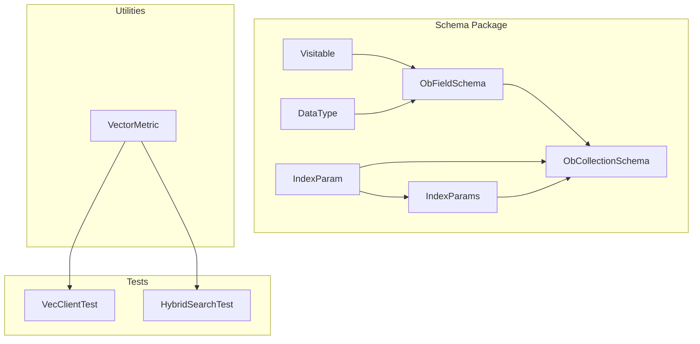
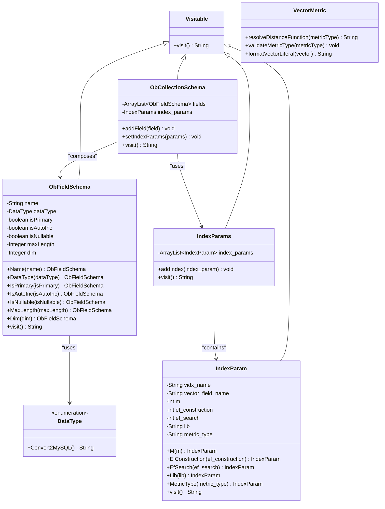
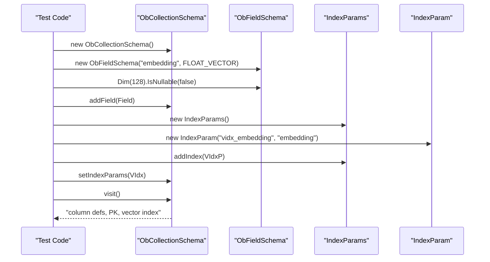
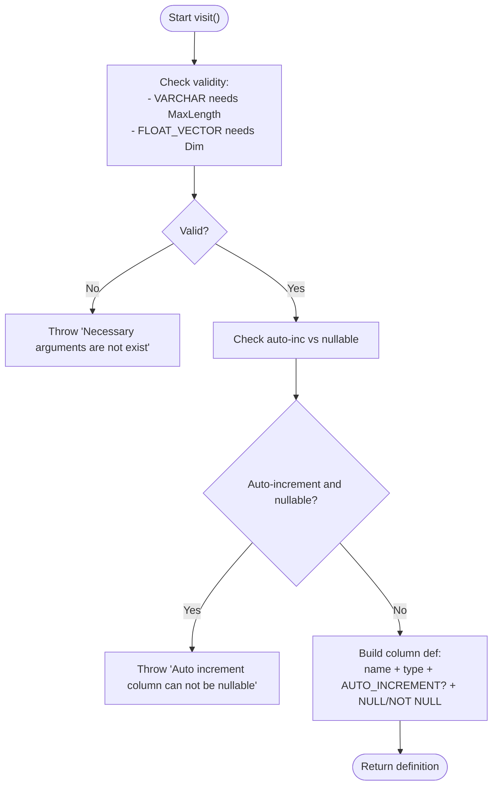
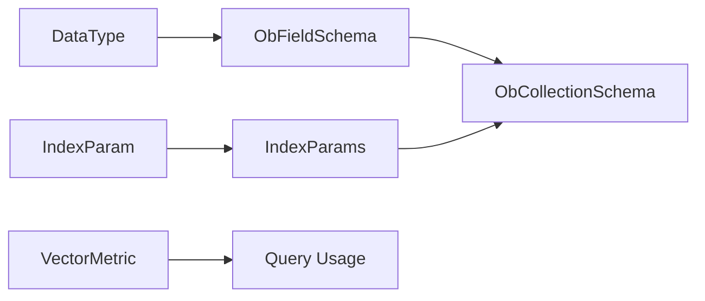

# Field Schema and Column Definitions

<cite>
**Referenced Files in This Document**
- [ObFieldSchema.java](file://src/main/java/com/oceanbase/obvector4j/schema/ObFieldSchema.java)
- [DataType.java](file://src/main/java/com/oceanbase/obvector4j/schema/DataType.java)
- [IndexParam.java](file://src/main/java/com/oceanbase/obvector4j/schema/IndexParam.java)
- [IndexParams.java](file://src/main/java/com/oceanbase/obvector4j/schema/IndexParams.java)
- [ObCollectionSchema.java](file://src/main/java/com/oceanbase/obvector4j/schema/ObCollectionSchema.java)
- [Visitable.java](file://src/main/java/com/oceanbase/obvector4j/schema/Visitable.java)
- [VectorMetric.java](file://src/main/java/com/oceanbase/obvector4j/util/VectorMetric.java)
- [VecClientTest.java](file://src/test/java/com/oceanbase/obvector4j/integration/container/VecClientTest.java)
- [HybridSearchTest.java](file://src/test/java/com/oceanbase/obvector4j/integration/container/HybridSearchTest.java)
</cite>

## Table of Contents
1. [Introduction](#introduction)
2. [Project Structure](#project-structure)
3. [Core Components](#core-components)
4. [Architecture Overview](#architecture-overview)
5. [Detailed Component Analysis](#detailed-component-analysis)
6. [Dependency Analysis](#dependency-analysis)
7. [Performance Considerations](#performance-considerations)
8. [Troubleshooting Guide](#troubleshooting-guide)
9. [Conclusion](#conclusion)
10. [Appendices](#appendices)

## Introduction
This document explains the field schema and column definition system used to define tables for vector and scalar data. It focuses on the ObFieldSchema class, its relationship with the DataType enumeration, supported types (including scalar and vector), and how to configure vector columns and indexes. Practical examples are provided via references to test code that demonstrates primary keys, nullable constraints, VARCHAR length, vector dimensions, and index parameters.

## Project Structure
The schema-related classes live under the schema package and work together to generate table definitions and vector index specifications. Tests demonstrate usage patterns for creating collections with mixed scalar and vector fields.

**Diagram sources**
- [Visitable.java:1-6](file://src/main/java/com/oceanbase/obvector4j/schema/Visitable.java#L1-L6)
- [ObFieldSchema.java:1-105](file://src/main/java/com/oceanbase/obvector4j/schema/ObFieldSchema.java#L1-L105)
- [DataType.java:1-36](file://src/main/java/com/oceanbase/obvector4j/schema/DataType.java#L1-L36)
- [IndexParam.java:1-65](file://src/main/java/com/oceanbase/obvector4j/schema/IndexParam.java#L1-L65)
- [IndexParams.java:1-29](file://src/main/java/com/oceanbase/obvector4j/schema/IndexParams.java#L1-L29)
- [ObCollectionSchema.java:1-47](file://src/main/java/com/oceanbase/obvector4j/schema/ObCollectionSchema.java#L1-L47)
- [VectorMetric.java:1-40](file://src/main/java/com/oceanbase/obvector4j/util/VectorMetric.java#L1-L40)
- [VecClientTest.java:70-187](file://src/test/java/com/oceanbase/obvector4j/integration/container/VecClientTest.java#L70-L187)
- [HybridSearchTest.java:80-279](file://src/test/java/com/oceanbase/obvector4j/integration/container/HybridSearchTest.java#L80-L279)

**Section sources**
- [ObFieldSchema.java:1-105](file://src/main/java/com/oceanbase/obvector4j/schema/ObFieldSchema.java#L1-L105)
- [DataType.java:1-36](file://src/main/java/com/oceanbase/obvector4j/schema/DataType.java#L1-L36)
- [IndexParam.java:1-65](file://src/main/java/com/oceanbase/obvector4j/schema/IndexParam.java#L1-L65)
- [IndexParams.java:1-29](file://src/main/java/com/oceanbase/obvector4j/schema/IndexParams.java#L1-L29)
- [ObCollectionSchema.java:1-47](file://src/main/java/com/oceanbase/obvector4j/schema/ObCollectionSchema.java#L1-L47)
- [Visitable.java:1-6](file://src/main/java/com/oceanbase/obvector4j/schema/Visitable.java#L1-L6)
- [VectorMetric.java:1-40](file://src/main/java/com/oceanbase/obvector4j/util/VectorMetric.java#L1-L40)
- [VecClientTest.java:70-187](file://src/test/java/com/oceanbase/obvector4j/integration/container/VecClientTest.java#L70-L187)
- [HybridSearchTest.java:80-279](file://src/test/java/com/oceanbase/obvector4j/integration/container/HybridSearchTest.java#L80-L279)

## Core Components
- ObFieldSchema: Defines a single column with name, type, constraints, and special properties like length or dimension.
- DataType: Enumerates supported logical types and maps them to database types.
- IndexParam and IndexParams: Define vector index parameters and aggregate multiple index definitions.
- ObCollectionSchema: Aggregates fields and optional index parameters into a complete table definition.
- VectorMetric: Utility for validating and resolving distance metric names used in queries.

Key responsibilities:
- Type mapping and validation for each column.
- Generation of SQL-like column definitions.
- Construction of vector index clauses.
- Assembly of full collection schema including primary key and index sections.

**Section sources**
- [ObFieldSchema.java:12-103](file://src/main/java/com/oceanbase/obvector4j/schema/ObFieldSchema.java#L12-L103)
- [DataType.java:3-35](file://src/main/java/com/oceanbase/obvector4j/schema/DataType.java#L3-L35)
- [IndexParam.java:12-63](file://src/main/java/com/oceanbase/obvector4j/schema/IndexParam.java#L12-L63)
- [IndexParams.java:8-27](file://src/main/java/com/oceanbase/obvector4j/schema/IndexParams.java#L8-L27)
- [ObCollectionSchema.java:9-44](file://src/main/java/com/oceanbase/obvector4j/schema/ObCollectionSchema.java#L9-L44)
- [VectorMetric.java:11-27](file://src/main/java/com/oceanbase/obvector4j/util/VectorMetric.java#L11-L27)

## Architecture Overview
The schema components implement a visitor pattern base class to produce string representations of schema elements. ObCollectionSchema composes ObFieldSchema instances and IndexParams to render a complete table definition. VectorMetric supports query-time metric resolution.

**Diagram sources**
- [Visitable.java:1-6](file://src/main/java/com/oceanbase/obvector4j/schema/Visitable.java#L1-L6)
- [ObFieldSchema.java:1-105](file://src/main/java/com/oceanbase/obvector4j/schema/ObFieldSchema.java#L1-L105)
- [DataType.java:1-36](file://src/main/java/com/oceanbase/obvector4j/schema/DataType.java#L1-L36)
- [IndexParam.java:1-65](file://src/main/java/com/oceanbase/obvector4j/schema/IndexParam.java#L1-L65)
- [IndexParams.java:1-29](file://src/main/java/com/oceanbase/obvector4j/schema/IndexParams.java#L1-L29)
- [ObCollectionSchema.java:1-47](file://src/main/java/com/oceanbase/obvector4j/schema/ObCollectionSchema.java#L1-L47)
- [VectorMetric.java:1-40](file://src/main/java/com/oceanbase/obvector4j/util/VectorMetric.java#L1-L40)

## Detailed Component Analysis

### ObFieldSchema: Column Definition
ObFieldSchema defines a column with:
- Name and DataType
- Primary key flag
- Auto-increment flag
- Nullable flag
- Length for VARCHAR
- Dimension for FLOAT_VECTOR

Validation rules enforced at visit time:
- VARCHAR requires MaxLength to be set.
- FLOAT_VECTOR requires Dim to be set.
- An auto-increment column cannot be nullable.

Generated output includes the column name, type (with required parameters), optional AUTO_INCREMENT, and NULL/NOT NULL.

Practical usage patterns from tests:
- Integer primary key with auto increment.
- Non-nullable vector column with explicit dimension.
- JSON column marked nullable.

**Section sources**
- [ObFieldSchema.java:12-103](file://src/main/java/com/oceanbase/obvector4j/schema/ObFieldSchema.java#L12-L103)
- [VecClientTest.java:73-81](file://src/test/java/com/oceanbase/obvector4j/integration/container/VecClientTest.java#L73-L81)
- [VecClientTest.java:129-135](file://src/test/java/com/oceanbase/obvector4j/integration/container/VecClientTest.java#L129-L135)

### DataType: Supported Types and Mapping
Supported logical types include:
- Boolean and integer variants: BOOL, INT8, INT16, INT32, INT64
- Floating point: FLOAT, DOUBLE
- Text and structured: STRING, VARCHAR, JSON
- Vector: FLOAT_VECTOR

Each type maps to a database type via Convert2MySQL. Special handling exists in ObFieldSchema for VARCHAR(length) and VECTOR(dim).

Common usage in tests:
- INT32 for identifiers
- DOUBLE for numeric attributes
- STRING for text content
- JSON for semi-structured payloads
- FLOAT_VECTOR for embeddings

**Section sources**
- [DataType.java:3-35](file://src/main/java/com/oceanbase/obvector4j/schema/DataType.java#L3-L35)
- [ObFieldSchema.java:75-83](file://src/main/java/com/oceanbase/obvector4j/schema/ObFieldSchema.java#L75-L83)
- [HybridSearchTest.java:92-99](file://src/test/java/com/oceanbase/obvector4j/integration/container/HybridSearchTest.java#L92-L99)
- [VecClientTest.java:73-78](file://src/test/java/com/oceanbase/obvector4j/integration/container/VecClientTest.java#L73-L78)

### Vector Columns and Index Configuration
Vector columns use DataType.FLOAT_VECTOR and require Dim to be specified. Vector search performance is controlled by an HNSW-style index defined via IndexParam and aggregated by IndexParams.

IndexParam configuration options:
- Name and target vector field
- M (graph connectivity)
- ef_construction (index build-time parameter)
- ef_search (search-time parameter)
- Library selection
- Distance metric type

Supported metric types for index creation:
- l2
- inner_product

Note: The index builder validates metric types and throws an exception if unsupported. For query-time metrics, VectorMetric supports additional aliases such as cosine and ip.

Usage patterns from tests:
- Creating a vector index on a FLOAT_VECTOR column.
- Setting metric type to inner_product for index creation.
- Using metric strings like "l2", "ip", and "cosine" in queries.

**Section sources**
- [IndexParam.java:12-48](file://src/main/java/com/oceanbase/obvector4j/schema/IndexParam.java#L12-L48)
- [IndexParams.java:12-27](file://src/main/java/com/oceanbase/obvector4j/schema/IndexParams.java#L12-L27)
- [ObCollectionSchema.java:18-44](file://src/main/java/com/oceanbase/obvector4j/schema/ObCollectionSchema.java#L18-L44)
- [VectorMetric.java:11-27](file://src/main/java/com/oceanbase/obvector4j/util/VectorMetric.java#L11-L27)
- [VecClientTest.java:83-86](file://src/test/java/com/oceanbase/obvector4j/integration/container/VecClientTest.java#L83-L86)
- [VecClientTest.java:146-150](file://src/test/java/com/oceanbase/obvector4j/integration/container/VecClientTest.java#L146-L150)
- [HybridSearchTest.java:101-105](file://src/test/java/com/oceanbase/obvector4j/integration/container/HybridSearchTest.java#L101-L105)

### ObCollectionSchema: Assembling Table Definitions
ObCollectionSchema aggregates:
- A list of ObFieldSchema fields
- Optional IndexParams

It generates:
- Comma-separated column definitions
- A PRIMARY KEY clause when any field is marked primary
- A vector index section when IndexParams are present

This class orchestrates the final schema string representation.

**Section sources**
- [ObCollectionSchema.java:9-44](file://src/main/java/com/oceanbase/obvector4j/schema/ObCollectionSchema.java#L9-L44)

### Sequence: Creating a Collection with Vector Index
The following sequence shows how schema objects are composed and rendered during collection creation.

**Diagram sources**
- [ObCollectionSchema.java:22-44](file://src/main/java/com/oceanbase/obvector4j/schema/ObCollectionSchema.java#L22-L44)
- [ObFieldSchema.java:86-103](file://src/main/java/com/oceanbase/obvector4j/schema/ObFieldSchema.java#L86-L103)
- [IndexParams.java:16-27](file://src/main/java/com/oceanbase/obvector4j/schema/IndexParams.java#L16-L27)
- [IndexParam.java:58-63](file://src/main/java/com/oceanbase/obvector4j/schema/IndexParam.java#L58-L63)
- [HybridSearchTest.java:85-107](file://src/test/java/com/oceanbase/obvector4j/integration/container/HybridSearchTest.java#L85-L107)

### Flowchart: Validation Rules for ObFieldSchema

**Diagram sources**
- [ObFieldSchema.java:65-103](file://src/main/java/com/oceanbase/obvector4j/schema/ObFieldSchema.java#L65-L103)

## Dependency Analysis
- ObFieldSchema depends on DataType for type mapping and uses its own validation logic for VARCHAR and FLOAT_VECTOR.
- ObCollectionSchema composes multiple ObFieldSchema instances and optionally IndexParams.
- IndexParams contains multiple IndexParam instances; IndexParam validates metric types and renders index clauses.
- VectorMetric is used at query time to validate and resolve metric names.

**Diagram sources**
- [DataType.java:19-35](file://src/main/java/com/oceanbase/obvector4j/schema/DataType.java#L19-L35)
- [ObFieldSchema.java:75-83](file://src/main/java/com/oceanbase/obvector4j/schema/ObFieldSchema.java#L75-L83)
- [ObCollectionSchema.java:22-44](file://src/main/java/com/oceanbase/obvector4j/schema/ObCollectionSchema.java#L22-L44)
- [IndexParam.java:37-48](file://src/main/java/com/oceanbase/obvector4j/schema/IndexParam.java#L37-L48)
- [IndexParams.java:16-27](file://src/main/java/com/oceanbase/obvector4j/schema/IndexParams.java#L16-L27)
- [VectorMetric.java:11-27](file://src/main/java/com/oceanbase/obvector4j/util/VectorMetric.java#L11-L27)

**Section sources**
- [ObFieldSchema.java:65-103](file://src/main/java/com/oceanbase/obvector4j/schema/ObFieldSchema.java#L65-L103)
- [ObCollectionSchema.java:22-44](file://src/main/java/com/oceanbase/obvector4j/schema/ObCollectionSchema.java#L22-L44)
- [IndexParam.java:37-48](file://src/main/java/com/oceanbase/obvector4j/schema/IndexParam.java#L37-L48)
- [IndexParams.java:16-27](file://src/main/java/com/oceanbase/obvector4j/schema/IndexParams.java#L16-L27)
- [VectorMetric.java:11-27](file://src/main/java/com/oceanbase/obvector4j/util/VectorMetric.java#L11-L27)

## Performance Considerations
- Vector index parameters (M, ef_construction, ef_search) influence build time and query latency. Larger values typically improve recall but increase memory and construction cost.
- Choosing the correct metric type is critical: l2 and inner_product are supported for index creation; cosine is supported for query-time distance functions.
- Ensure vector dimensions match the actual embedding size to avoid runtime errors.

[No sources needed since this section provides general guidance]

## Troubleshooting Guide
Common issues and resolutions:
- Missing MaxLength for VARCHAR: ObFieldSchema will throw an exception indicating necessary arguments are missing. Set MaxLength before visiting the schema.
- Missing Dim for FLOAT_VECTOR: Same exception applies; always specify Dim for vector columns.
- Auto-increment combined with nullable: Not allowed; remove IsNullable(true) from auto-increment primary key columns.
- Unsupported metric type for index creation: Only l2 and inner_product are accepted by IndexParam.MetricType. Use these values when defining vector indexes. For queries, VectorMetric supports l2, ip, and cosine.

Relevant error paths:
- ObFieldSchema validation and constraint checks
- IndexParam metric type validation
- VectorMetric metric validation for queries

**Section sources**
- [ObFieldSchema.java:65-92](file://src/main/java/com/oceanbase/obvector4j/schema/ObFieldSchema.java#L65-L92)
- [IndexParam.java:37-48](file://src/main/java/com/oceanbase/obvector4j/schema/IndexParam.java#L37-L48)
- [VectorMetric.java:11-27](file://src/main/java/com/oceanbase/obvector4j/util/VectorMetric.java#L11-L27)

## Conclusion
ObFieldSchema and related classes provide a robust, validated way to define both scalar and vector columns, assemble primary keys, and configure vector indexes. By adhering to the validation rules and using appropriate metric types, you can reliably create collections optimized for hybrid search scenarios.

[No sources needed since this section summarizes without analyzing specific files]

## Appendices

### Practical Examples (by reference)
- Scalar primary key with auto increment and non-nullable vector column:
  - See [VecClientTest.java:73-81](file://src/test/java/com/oceanbase/obvector4j/integration/container/VecClientTest.java#L73-L81)
- Simple vector-only table with auto-increment id:
  - See [VecClientTest.java:129-135](file://src/test/java/com/oceanbase/obvector4j/integration/container/VecClientTest.java#L129-L135)
- Mixed schema with vector, double, int, and status fields plus vector index:
  - See [HybridSearchTest.java:219-241](file://src/test/java/com/oceanbase/obvector4j/integration/container/HybridSearchTest.java#L219-L241)
- Full-text and vector index setup:
  - See [HybridSearchTest.java:85-107](file://src/test/java/com/oceanbase/obvector4j/integration/container/HybridSearchTest.java#L85-L107)
- Metric usage in queries and index creation:
  - See [VecClientTest.java:146-150](file://src/test/java/com/oceanbase/obvector4j/integration/container/VecClientTest.java#L146-L150)
  - See [HybridSearchTest.java:165](file://src/test/java/com/oceanbase/obvector4j/integration/container/HybridSearchTest.java#L165)

[No sources needed since this section lists references only]