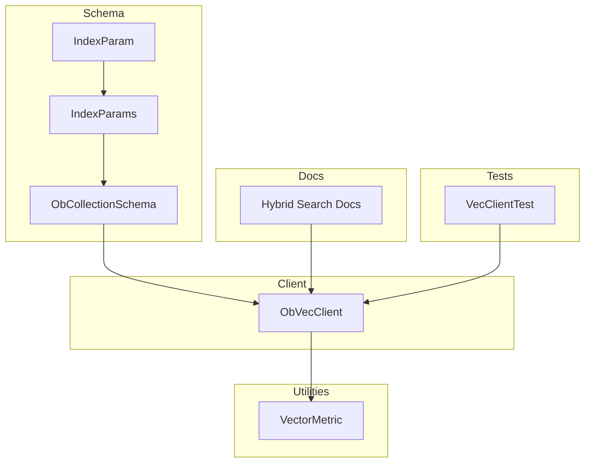
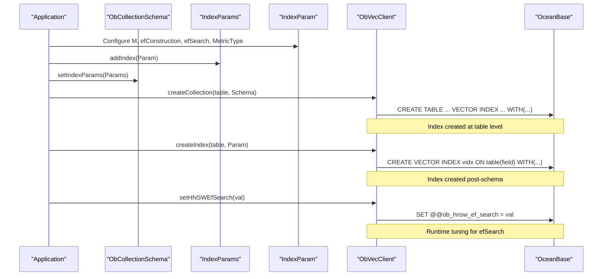
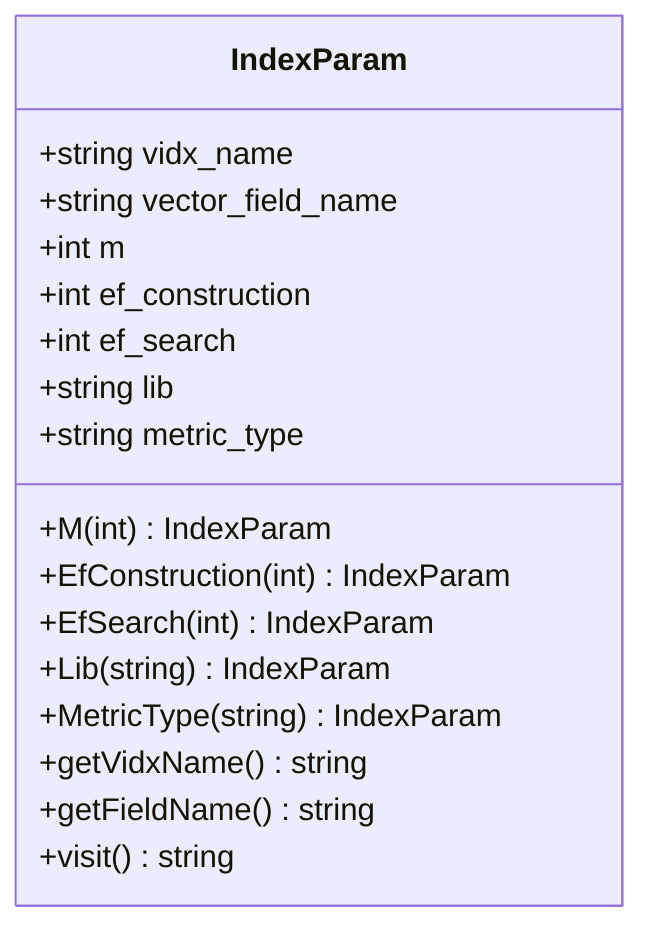
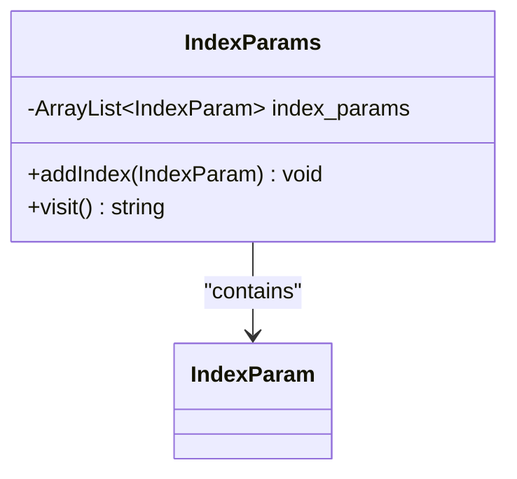
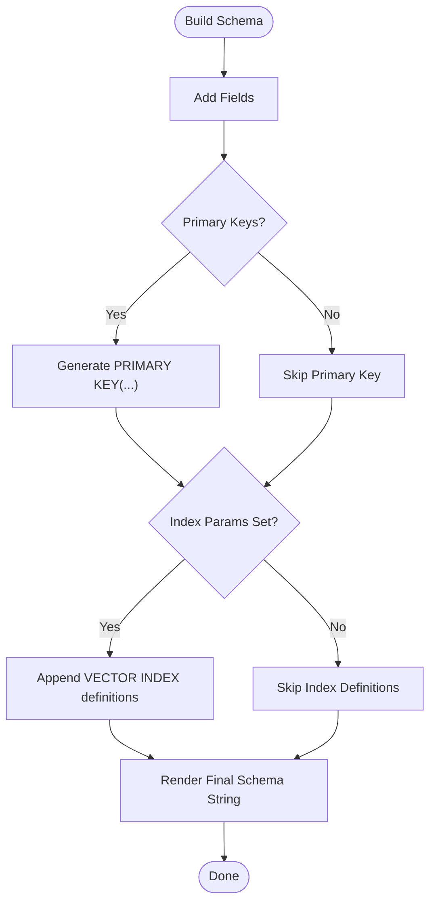
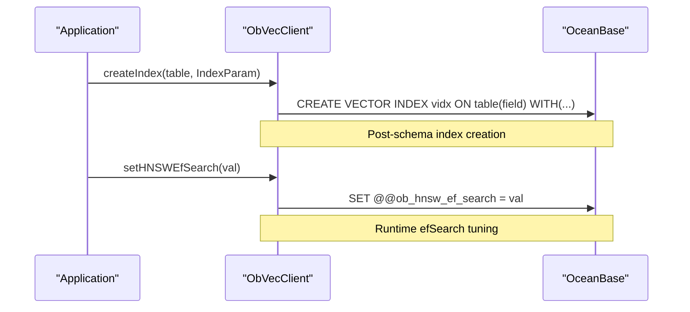
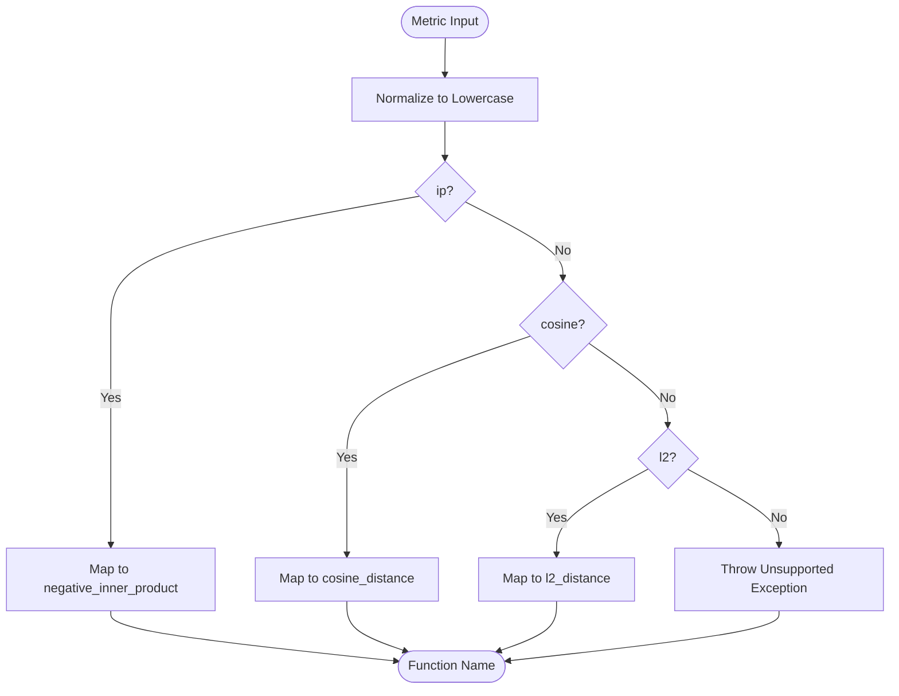
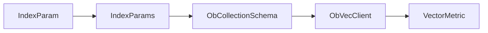

# Index Configuration and Optimization

<cite>
**Referenced Files in This Document**
- [IndexParam.java](file://src/main/java/com/oceanbase/obvector4j/schema/IndexParam.java)
- [IndexParams.java](file://src/main/java/com/oceanbase/obvector4j/schema/IndexParams.java)
- [ObCollectionSchema.java](file://src/main/java/com/oceanbase/obvector4j/schema/ObCollectionSchema.java)
- [ObVecClient.java](file://src/main/java/com/oceanbase/obvector4j/ObVecClient.java)
- [VectorMetric.java](file://src/main/java/com/oceanbase/obvector4j/util/VectorMetric.java)
- [03-hybrid-search.md](file://docs/en/03-hybrid-search.md)
- [VecClientTest.java](file://src/test/java/com/oceanbase/obvector4j/integration/container/VecClientTest.java)
</cite>

## Table of Contents
1. [Introduction](#introduction)
2. [Project Structure](#project-structure)
3. [Core Components](#core-components)
4. [Architecture Overview](#architecture-overview)
5. [Detailed Component Analysis](#detailed-component-analysis)
6. [Dependency Analysis](#dependency-analysis)
7. [Performance Considerations](#performance-considerations)
8. [Troubleshooting Guide](#troubleshooting-guide)
9. [Conclusion](#conclusion)
10. [Appendices](#appendices)

## Introduction
This document explains how to configure and optimize indexes for vector tables using the obvector4j SDK. It focuses on:
- Defining table-level index parameters with IndexParams
- Specifying individual vector index options with IndexParam
- Configuring HNSW-based vector indexes (M, efConstruction, efSearch)
- Understanding metric types and their impact
- Best practices for query optimization, memory usage, build time, and maintenance
- Examples for different query patterns and monitoring strategies

The codebase currently exposes a single vector index algorithm (HNSW) via IndexParam. Scalar indexing is handled by standard relational indexes and full-text indexes; composite index strategies are achieved by combining scalar fields and filters.

## Project Structure
Relevant parts of the project structure for indexing:
- Schema layer: IndexParam, IndexParams, ObCollectionSchema
- Client layer: ObVecClient (DDL execution, index creation, runtime variable control)
- Utilities: VectorMetric (metric validation and SQL function mapping)
- Documentation: Hybrid search guide includes examples of creating vector indexes and full-text indexes
- Tests: Integration tests demonstrate index creation and usage

**Diagram sources**
- [IndexParam.java:1-65](file://src/main/java/com/oceanbase/obvector4j/schema/IndexParam.java#L1-L65)
- [IndexParams.java:1-29](file://src/main/java/com/oceanbase/obvector4j/schema/IndexParams.java#L1-L29)
- [ObCollectionSchema.java:1-47](file://src/main/java/com/oceanbase/obvector4j/schema/ObCollectionSchema.java#L1-L47)
- [ObVecClient.java:154-198](file://src/main/java/com/oceanbase/obvector4j/ObVecClient.java#L154-L198)
- [VectorMetric.java:1-41](file://src/main/java/com/oceanbase/obvector4j/util/VectorMetric.java#L1-L41)
- [03-hybrid-search.md:158-198](file://docs/en/03-hybrid-search.md#L158-L198)
- [VecClientTest.java:83-88](file://src/test/java/com/oceanbase/obvector4j/integration/container/VecClientTest.java#L83-L88)

**Section sources**
- [IndexParam.java:1-65](file://src/main/java/com/oceanbase/obvector4j/schema/IndexParam.java#L1-L65)
- [IndexParams.java:1-29](file://src/main/java/com/oceanbase/obvector4j/schema/IndexParams.java#L1-L29)
- [ObCollectionSchema.java:1-47](file://src/main/java/com/oceanbase/obvector4j/schema/ObCollectionSchema.java#L1-L47)
- [ObVecClient.java:154-198](file://src/main/java/com/oceanbase/obvector4j/ObVecClient.java#L154-L198)
- [VectorMetric.java:1-41](file://src/main/java/com/oceanbase/obvector4j/util/VectorMetric.java#L1-L41)
- [03-hybrid-search.md:158-198](file://docs/en/03-hybrid-search.md#L158-L198)
- [VecClientTest.java:83-88](file://src/test/java/com/oceanbase/obvector4j/integration/container/VecClientTest.java#L83-L88)

## Core Components
- IndexParam: Defines a single vector index specification including name, target field, HNSW parameters (M, efConstruction, efSearch), library selection, and distance metric type. It generates the WITH clause used by CREATE VECTOR INDEX.
- IndexParams: Aggregates multiple IndexParam instances and renders them as part of a table definition or index creation statement.
- ObCollectionSchema: Builds the full table schema string, including columns, primary keys, and optional vector index definitions from IndexParams.
- ObVecClient: Executes DDL statements such as CREATE TABLE and CREATE VECTOR INDEX, and provides runtime control over HNSW efSearch via session variables.
- VectorMetric: Validates and maps metric names to database functions for approximate nearest neighbor queries.

Key responsibilities:
- IndexParam encapsulates per-index configuration and parameter validation for supported metrics.
- IndexParams composes multiple index definitions into a single schema fragment.
- ObCollectionSchema integrates index definitions into table creation.
- ObVecClient translates these objects into SQL executed against OceanBase.

**Section sources**
- [IndexParam.java:1-65](file://src/main/java/com/oceanbase/obvector4j/schema/IndexParam.java#L1-L65)
- [IndexParams.java:1-29](file://src/main/java/com/oceanbase/obvector4j/schema/IndexParams.java#L1-L29)
- [ObCollectionSchema.java:1-47](file://src/main/java/com/oceanbase/obvector4j/schema/ObCollectionSchema.java#L1-L47)
- [ObVecClient.java:154-198](file://src/main/java/com/oceanbase/obvector4j/ObVecClient.java#L154-L198)
- [VectorMetric.java:1-41](file://src/main/java/com/oceanbase/obvector4j/util/VectorMetric.java#L1-L41)

## Architecture Overview
The following diagram shows how index configuration flows from Java objects to SQL executed by the client.

**Diagram sources**
- [ObCollectionSchema.java:22-44](file://src/main/java/com/oceanbase/obvector4j/schema/ObCollectionSchema.java#L22-L44)
- [IndexParams.java:16-27](file://src/main/java/com/oceanbase/obvector4j/schema/IndexParams.java#L16-L27)
- [IndexParam.java:58-63](file://src/main/java/com/oceanbase/obvector4j/schema/IndexParam.java#L58-L63)
- [ObVecClient.java:154-198](file://src/main/java/com/oceanbase/obvector4j/ObVecClient.java#L154-L198)
- [ObVecClient.java:64-114](file://src/main/java/com/oceanbase/obvector4j/ObVecClient.java#L64-L114)

## Detailed Component Analysis

### IndexParam: Individual Index Specification
- Purpose: Define a single vector index with HNSW-specific parameters and metric type.
- Parameters:
  - Name and target field
  - M: Controls graph connectivity; higher values increase recall and memory usage
  - efConstruction: Build-time search width; higher values improve index quality but increase build time and memory
  - efSearch: Query-time search width; controlled at runtime via session variable
  - lib: Underlying library selection (default vsag)
  - metric_type: Supported values include l2 and inner_product
- Validation: MetricType enforces allowed values; unsupported metrics throw an exception.
- Output: visit() produces the WITH clause appended to CREATE VECTOR INDEX.

**Diagram sources**
- [IndexParam.java:1-65](file://src/main/java/com/oceanbase/obvector4j/schema/IndexParam.java#L1-L65)

**Section sources**
- [IndexParam.java:1-65](file://src/main/java/com/oceanbase/obvector4j/schema/IndexParam.java#L1-L65)

### IndexParams: Table-Level Index Definitions
- Purpose: Aggregate multiple IndexParam instances and render them as part of a table definition.
- Behavior: visit() concatenates multiple VECTOR INDEX definitions separated by commas.

**Diagram sources**
- [IndexParams.java:1-29](file://src/main/java/com/oceanbase/obvector4j/schema/IndexParams.java#L1-L29)

**Section sources**
- [IndexParams.java:1-29](file://src/main/java/com/oceanbase/obvector4j/schema/IndexParams.java#L1-L29)

### ObCollectionSchema: Integrating Indexes into Table Creation
- Purpose: Build the full CREATE TABLE statement including columns, primary key, and optional vector index definitions.
- Behavior: If index_params is set, it appends the rendered vector index definitions to the table schema.

**Diagram sources**
- [ObCollectionSchema.java:22-44](file://src/main/java/com/oceanbase/obvector4j/schema/ObCollectionSchema.java#L22-L44)

**Section sources**
- [ObCollectionSchema.java:1-47](file://src/main/java/com/oceanbase/obvector4j/schema/ObCollectionSchema.java#L1-L47)

### ObVecClient: Executing Index DDL and Runtime Tuning
- createCollection: Renders table schema via ObCollectionSchema.visit() and executes CREATE TABLE.
- createIndex: Executes CREATE VECTOR INDEX using IndexParam.visit().
- setHNSWEfSearch/getHNSWEfSearch: Manages runtime efSearch via session variable @@ob_hnsw_ef_search.

**Diagram sources**
- [ObVecClient.java:175-198](file://src/main/java/com/oceanbase/obvector4j/ObVecClient.java#L175-L198)
- [ObVecClient.java:64-114](file://src/main/java/com/oceanbase/obvector4j/ObVecClient.java#L64-L114)

**Section sources**
- [ObVecClient.java:154-198](file://src/main/java/com/oceanbase/obvector4j/ObVecClient.java#L154-L198)
- [ObVecClient.java:64-114](file://src/main/java/com/oceanbase/obvector4j/ObVecClient.java#L64-L114)

### VectorMetric: Distance Function Mapping
- Purpose: Validate metric names and map them to database functions for approximate nearest neighbor queries.
- Supported mappings:
  - ip -> negative_inner_product
  - cosine -> cosine_distance
  - l2 -> l2_distance

**Diagram sources**
- [VectorMetric.java:11-27](file://src/main/java/com/oceanbase/obvector4j/util/VectorMetric.java#L11-L27)

**Section sources**
- [VectorMetric.java:1-41](file://src/main/java/com/oceanbase/obvector4j/util/VectorMetric.java#L1-L41)

## Dependency Analysis
- IndexParam depends on no other schema classes; it encapsulates its own parameters and rendering logic.
- IndexParams depends on IndexParam to aggregate multiple index definitions.
- ObCollectionSchema depends on IndexParams to append vector index definitions during table creation.
- ObVecClient depends on IndexParam and ObCollectionSchema to generate and execute DDL.
- VectorMetric is used by query paths to validate and map metric types.

**Diagram sources**
- [IndexParam.java:1-65](file://src/main/java/com/oceanbase/obvector4j/schema/IndexParam.java#L1-L65)
- [IndexParams.java:1-29](file://src/main/java/com/oceanbase/obvector4j/schema/IndexParams.java#L1-L29)
- [ObCollectionSchema.java:1-47](file://src/main/java/com/oceanbase/obvector4j/schema/ObCollectionSchema.java#L1-L47)
- [ObVecClient.java:154-198](file://src/main/java/com/oceanbase/obvector4j/ObVecClient.java#L154-L198)
- [VectorMetric.java:1-41](file://src/main/java/com/oceanbase/obvector4j/util/VectorMetric.java#L1-L41)

**Section sources**
- [IndexParam.java:1-65](file://src/main/java/com/oceanbase/obvector4j/schema/IndexParam.java#L1-L65)
- [IndexParams.java:1-29](file://src/main/java/com/oceanbase/obvector4j/schema/IndexParams.java#L1-L29)
- [ObCollectionSchema.java:1-47](file://src/main/java/com/oceanbase/obvector4j/schema/ObCollectionSchema.java#L1-L47)
- [ObVecClient.java:154-198](file://src/main/java/com/oceanbase/obvector4j/ObVecClient.java#L154-L198)
- [VectorMetric.java:1-41](file://src/main/java/com/oceanbase/obvector4j/util/VectorMetric.java#L1-L41)

## Performance Considerations
- Algorithm selection: The current implementation uses HNSW exclusively via IndexParam. IVF is not exposed in the schema classes.
- Parameter tuning:
  - M: Higher values can improve recall but increase memory and build time.
  - efConstruction: Larger values improve index quality and recall at the cost of longer build times and more memory.
  - efSearch: Controls query-time trade-off between latency and recall; adjustable at runtime via session variable.
- Metric choice:
  - Use l2 for general similarity.
  - Use inner_product for normalized vectors where dot product ranking is desired.
  - For cosine similarity in queries, use VectorMetric mapping; note that IndexParam supports l2 and inner_product for index construction.
- Memory usage: HNSW graphs scale with dimensionality and M; plan capacity accordingly.
- Build time implications: Large datasets with high efConstruction will take longer to build indexes.
- Maintenance requirements:
  - After creating indexes, allow time for building before heavy querying.
  - Monitor and adjust efSearch based on observed latency/recall trade-offs.
  - Full-text indexes may be needed for text-heavy hybrid searches.

[No sources needed since this section provides general guidance]

## Troubleshooting Guide
- Unsupported metric type when configuring IndexParam: Ensure metric_type is one of the supported values (l2, inner_product).
- Incorrect metric mapping in queries: Use VectorMetric.validateMetricType to ensure compatibility with query functions.
- Index not improving performance: Verify that efSearch is tuned appropriately and that the dataset size and dimensions justify the chosen M and efConstruction.
- Index creation failures: Confirm that the target table exists and the vector column type matches expectations.

**Section sources**
- [IndexParam.java:37-48](file://src/main/java/com/oceanbase/obvector4j/schema/IndexParam.java#L37-L48)
- [VectorMetric.java:25-27](file://src/main/java/com/oceanbase/obvector4j/util/VectorMetric.java#L25-L27)

## Conclusion
The obvector4j SDK provides a focused API for defining HNSW-based vector indexes through IndexParam and IndexParams, integrated into table schemas via ObCollectionSchema and executed by ObVecClient. While only HNSW is exposed at the schema level, runtime tuning of efSearch allows dynamic adjustment of query performance. For optimal results, carefully tune M, efConstruction, and efSearch according to workload characteristics, choose appropriate metrics, and combine vector indexes with scalar and full-text indexes for hybrid search scenarios.

[No sources needed since this section summarizes without analyzing specific files]

## Appendices

### Examples and Patterns

- Creating a vector index at table creation time:
  - Build ObCollectionSchema with fields and set IndexParams containing IndexParam entries.
  - Execute createCollection to render and apply the schema.
  - Reference: [03-hybrid-search.md:158-198](file://docs/en/03-hybrid-search.md#L158-L198)

- Creating a vector index after table creation:
  - Construct IndexParam with name, field, and parameters.
  - Call createIndex on ObVecClient.
  - Reference: [VecClientTest.java:146-148](file://src/test/java/com/oceanbase/obvector4j/integration/container/VecClientTest.java#L146-L148)

- Runtime efSearch tuning:
  - Use setHNSWEfSearch to adjust efSearch for subsequent queries.
  - Reference: [VecClientTest.java:168-181](file://src/test/java/com/oceanbase/obvector4j/integration/container/VecClientTest.java#L168-L181)

- Scalar filtering combined with vector search:
  - Use FilterBuilder to construct conditions and pass to scalarVectorSearch or textVectorSearch.
  - Reference: [03-hybrid-search.md:345-398](file://docs/en/03-hybrid-search.md#L345-L398)

- Full-text indexes for hybrid search:
  - Create full-text indexes on text columns using createFulltextIndex.
  - Reference: [03-hybrid-search.md:196-198](file://docs/en/03-hybrid-search.md#L196-L198)

**Section sources**
- [03-hybrid-search.md:158-198](file://docs/en/03-hybrid-search.md#L158-L198)
- [VecClientTest.java:146-148](file://src/test/java/com/oceanbase/obvector4j/integration/container/VecClientTest.java#L146-L148)
- [VecClientTest.java:168-181](file://src/test/java/com/oceanbase/obvector4j/integration/container/VecClientTest.java#L168-L181)
- [03-hybrid-search.md:345-398](file://docs/en/03-hybrid-search.md#L345-L398)
- [03-hybrid-search.md:196-198](file://docs/en/03-hybrid-search.md#L196-L198)