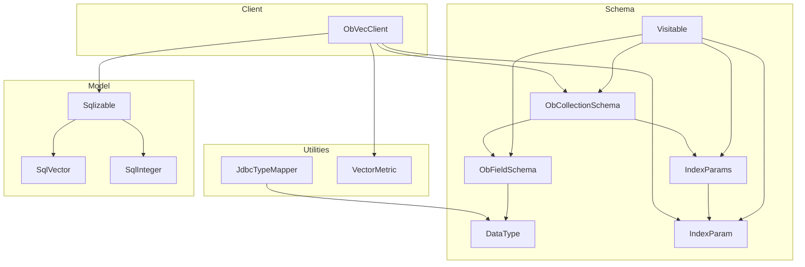
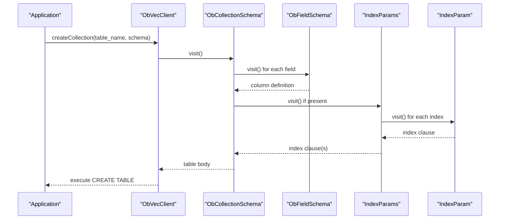
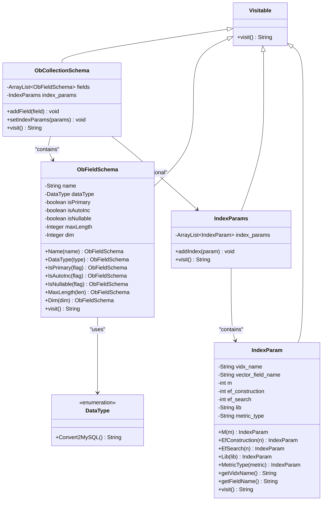
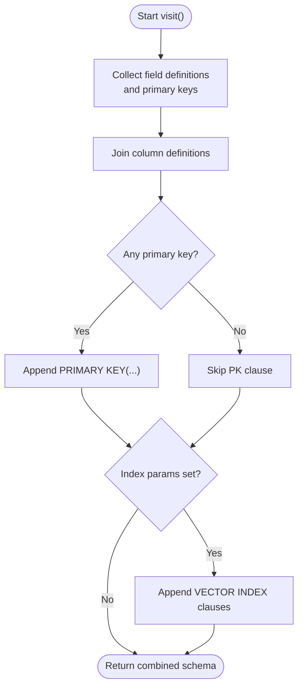
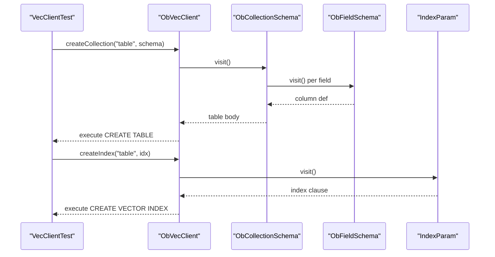
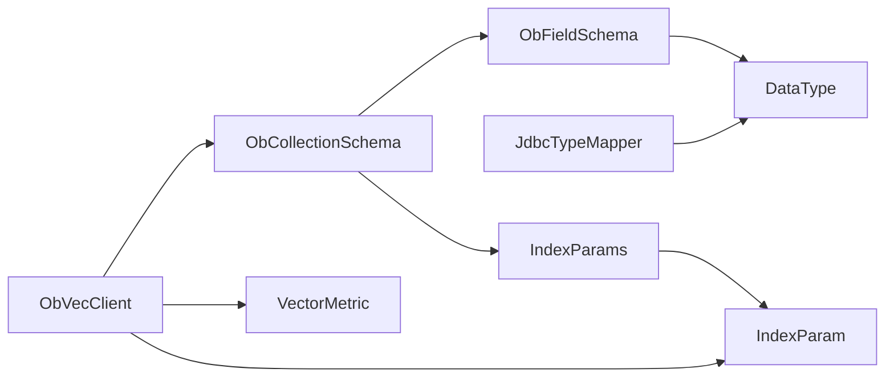

# Schema Design and Data Types

<cite>
**Referenced Files in This Document**
- [ObCollectionSchema.java](file://src/main/java/com/oceanbase/obvector4j/schema/ObCollectionSchema.java)
- [ObFieldSchema.java](file://src/main/java/com/oceanbase/obvector4j/schema/ObFieldSchema.java)
- [DataType.java](file://src/main/java/com/oceanbase/obvector4j/schema/DataType.java)
- [IndexParam.java](file://src/main/java/com/oceanbase/obvector4j/schema/IndexParam.java)
- [IndexParams.java](file://src/main/java/com/oceanbase/obvector4j/schema/IndexParams.java)
- [Visitable.java](file://src/main/java/com/oceanbase/obvector4j/schema/Visitable.java)
- [JdbcTypeMapper.java](file://src/main/java/com/oceanbase/obvector4j/util/JdbcTypeMapper.java)
- [VectorMetric.java](file://src/main/java/com/oceanbase/obvector4j/util/VectorMetric.java)
- [Sqlizable.java](file://src/main/java/com/oceanbase/obvector4j/model/Sqlizable.java)
- [SqlVector.java](file://src/main/java/com/oceanbase/obvector4j/model/SqlVector.java)
- [SqlInteger.java](file://src/main/java/com/oceanbase/obvector4j/model/SqlInteger.java)
- [ObVecClient.java](file://src/main/java/com/oceanbase/obvector4j/ObVecClient.java)
- [VecClientTest.java](file://src/test/java/com/oceanbase/obvector4j/integration/container/VecClientTest.java)
</cite>

## Table of Contents
1. Introduction
2. Project Structure
3. Core Components
4. Architecture Overview
5. Detailed Component Analysis
6. Dependency Analysis
7. Performance Considerations
8. Troubleshooting Guide
9. Conclusion

## Introduction
This document explains the schema definition and type system used to model tables with mixed scalar and vector columns, generate SQL via a visitor pattern, and manage vector indexes for performance. It covers:
- ObCollectionSchema for table structure definition
- ObFieldSchema for column specifications
- DataType enumeration for supported data types and their mapping to database types
- Vector column configuration including dimension specification and index parameters (HNSW-based)
- Visitor pattern implementation for SQL generation
- Automatic primary key handling and constraint validation
- Examples for creating tables, defining indexes, and querying vectors
- Data type mapping, validation rules, and migration strategies

## Project Structure
The schema-related code is organized under the schema package, with supporting utilities for JDBC type mapping and vector metric resolution. The client orchestrates schema creation and index management.

**Diagram sources**
- [Visitable.java:1-6](file://src/main/java/com/oceanbase/obvector4j/schema/Visitable.java#L1-L6)
- [ObCollectionSchema.java:1-47](file://src/main/java/com/oceanbase/obvector4j/schema/ObCollectionSchema.java#L1-L47)
- [ObFieldSchema.java:1-105](file://src/main/java/com/oceanbase/obvector4j/schema/ObFieldSchema.java#L1-L105)
- [DataType.java:1-36](file://src/main/java/com/oceanbase/obvector4j/schema/DataType.java#L1-L36)
- [IndexParams.java:1-29](file://src/main/java/com/oceanbase/obvector4j/schema/IndexParams.java#L1-L29)
- [IndexParam.java:1-65](file://src/main/java/com/oceanbase/obvector4j/schema/IndexParam.java#L1-L65)
- [JdbcTypeMapper.java:1-68](file://src/main/java/com/oceanbase/obvector4j/util/JdbcTypeMapper.java#L1-L68)
- [VectorMetric.java:1-41](file://src/main/java/com/oceanbase/obvector4j/util/VectorMetric.java#L1-L41)
- [Sqlizable.java:1-10](file://src/main/java/com/oceanbase/obvector4j/model/Sqlizable.java#L1-L10)
- [SqlVector.java:1-33](file://src/main/java/com/oceanbase/obvector4j/model/SqlVector.java#L1-L33)
- [SqlInteger.java:1-23](file://src/main/java/com/oceanbase/obvector4j/model/SqlInteger.java#L1-L23)
- [ObVecClient.java:150-349](file://src/main/java/com/oceanbase/obvector4j/ObVecClient.java#L150-L349)

**Section sources**
- [ObCollectionSchema.java:1-47](file://src/main/java/com/oceanbase/obvector4j/schema/ObCollectionSchema.java#L1-L47)
- [ObFieldSchema.java:1-105](file://src/main/java/com/oceanbase/obvector4j/schema/ObFieldSchema.java#L1-L105)
- [DataType.java:1-36](file://src/main/java/com/oceanbase/obvector4j/schema/DataType.java#L1-L36)
- [IndexParam.java:1-65](file://src/main/java/com/oceanbase/obvector4j/schema/IndexParam.java#L1-L65)
- [IndexParams.java:1-29](file://src/main/java/com/oceanbase/obvector4j/schema/IndexParams.java#L1-L29)
- [Visitable.java:1-6](file://src/main/java/com/oceanbase/obvector4j/schema/Visitable.java#L1-L6)
- [JdbcTypeMapper.java:1-68](file://src/main/java/com/oceanbase/obvector4j/util/JdbcTypeMapper.java#L1-L68)
- [VectorMetric.java:1-41](file://src/main/java/com/oceanbase/obvector4j/util/VectorMetric.java#L1-L41)
- [Sqlizable.java:1-10](file://src/main/java/com/oceanbase/obvector4j/model/Sqlizable.java#L1-L10)
- [SqlVector.java:1-33](file://src/main/java/com/oceanbase/obvector4j/model/SqlVector.java#L1-L33)
- [SqlInteger.java:1-23](file://src/main/java/com/oceanbase/obvector4j/model/SqlInteger.java#L1-L23)
- [ObVecClient.java:150-349](file://src/main/java/com/oceanbase/obvector4j/ObVecClient.java#L150-L349)

## Core Components
- Visitable: Abstract base class providing a visit() method for SQL string generation across schema elements.
- ObCollectionSchema: Represents a table schema; aggregates fields and optional vector index definitions; generates CREATE TABLE clause fragments.
- ObFieldSchema: Represents a column; supports scalar and vector types, primary key, auto-increment, nullability, length/dimension constraints; validates required parameters and emits column definitions.
- DataType: Enumerates supported logical types and maps them to database types.
- IndexParams: Holds multiple vector index definitions for a collection.
- IndexParam: Defines a single vector index with HNSW parameters and distance metric.

Key responsibilities:
- Validation: Enforce presence of maxLength for VARCHAR and dim for FLOAT_VECTOR; prevent nullable auto-increment columns.
- SQL Generation: Compose column definitions, primary keys, and vector index clauses using the visitor pattern.
- Type Mapping: Provide consistent mapping from logical types to database types and JDBC metadata inference.

**Section sources**
- [Visitable.java:1-6](file://src/main/java/com/oceanbase/obvector4j/schema/Visitable.java#L1-L6)
- [ObCollectionSchema.java:1-47](file://src/main/java/com/oceanbase/obvector4j/schema/ObCollectionSchema.java#L1-L47)
- [ObFieldSchema.java:1-105](file://src/main/java/com/oceanbase/obvector4j/schema/ObFieldSchema.java#L1-L105)
- [DataType.java:1-36](file://src/main/java/com/oceanbase/obvector4j/schema/DataType.java#L1-L36)
- [IndexParams.java:1-29](file://src/main/java/com/oceanbase/obvector4j/schema/IndexParams.java#L1-L29)
- [IndexParam.java:1-65](file://src/main/java/com/oceanbase/obvector4j/schema/IndexParam.java#L1-L65)

## Architecture Overview
The schema components implement a simple visitor pattern where each element produces its SQL fragment via visit(). The client composes these fragments into full statements for table creation and index management.

**Diagram sources**
- [ObVecClient.java:150-173](file://src/main/java/com/oceanbase/obvector4j/ObVecClient.java#L150-L173)
- [ObCollectionSchema.java:22-44](file://src/main/java/com/oceanbase/obvector4j/schema/ObCollectionSchema.java#L22-L44)
- [ObFieldSchema.java:85-103](file://src/main/java/com/oceanbase/obvector4j/schema/ObFieldSchema.java#L85-L103)
- [IndexParams.java:16-27](file://src/main/java/com/oceanbase/obvector4j/schema/IndexParams.java#L16-L27)
- [IndexParam.java:58-63](file://src/main/java/com/oceanbase/obvector4j/schema/IndexParam.java#L58-L63)

## Detailed Component Analysis

### Class Model and Relationships

**Diagram sources**
- [Visitable.java:1-6](file://src/main/java/com/oceanbase/obvector4j/schema/Visitable.java#L1-L6)
- [ObCollectionSchema.java:1-47](file://src/main/java/com/oceanbase/obvector4j/schema/ObCollectionSchema.java#L1-L47)
- [ObFieldSchema.java:1-105](file://src/main/java/com/oceanbase/obvector4j/schema/ObFieldSchema.java#L1-L105)
- [DataType.java:1-36](file://src/main/java/com/oceanbase/obvector4j/schema/DataType.java#L1-L36)
- [IndexParams.java:1-29](file://src/main/java/com/oceanbase/obvector4j/schema/IndexParams.java#L1-L29)
- [IndexParam.java:1-65](file://src/main/java/com/oceanbase/obvector4j/schema/IndexParam.java#L1-L65)

### Visitor Pattern and SQL Generation
- Each schema element overrides visit() to return its SQL fragment.
- ObCollectionSchema.visit() concatenates column definitions, appends PRIMARY KEY if any field is marked primary, and includes vector index clauses when provided.
- ObFieldSchema.visit() validates constraints and formats column definitions, including AUTO_INCREMENT and NULL/NOT NULL.
- IndexParams.visit() builds VECTOR INDEX clauses by delegating to IndexParam.visit(), which renders HNSW parameters and distance metric.

**Diagram sources**
- [ObCollectionSchema.java:22-44](file://src/main/java/com/oceanbase/obvector4j/schema/ObCollectionSchema.java#L22-L44)
- [ObFieldSchema.java:85-103](file://src/main/java/com/oceanbase/obvector4j/schema/ObFieldSchema.java#L85-L103)
- [IndexParams.java:16-27](file://src/main/java/com/oceanbase/obvector4j/schema/IndexParams.java#L16-L27)
- [IndexParam.java:58-63](file://src/main/java/com/oceanbase/obvector4j/schema/IndexParam.java#L58-L63)

**Section sources**
- [ObCollectionSchema.java:22-44](file://src/main/java/com/oceanbase/obvector4j/schema/ObCollectionSchema.java#L22-L44)
- [ObFieldSchema.java:85-103](file://src/main/java/com/oceanbase/obvector4j/schema/ObFieldSchema.java#L85-L103)
- [IndexParams.java:16-27](file://src/main/java/com/oceanbase/obvector4j/schema/IndexParams.java#L16-L27)
- [IndexParam.java:58-63](file://src/main/java/com/oceanbase/obvector4j/schema/IndexParam.java#L58-L63)

### Data Types and Mapping
- DataType enumerates logical types and provides Convert2MySQL() to map to database types.
- JdbcTypeMapper.fromJdbc() infers DataType from JDBC metadata, prioritizing type names and falling back to JDBC type codes.

Notes:
- FLOAT_VECTOR maps to VECTOR in the database.
- STRING maps to LONGTEXT; VARCHAR requires explicit maxLength at the field level.
- Numeric mappings include TINYINT, SMALLINT, INT, BIGINT, FLOAT, DOUBLE, JSON.

**Section sources**
- [DataType.java:19-34](file://src/main/java/com/oceanbase/obvector4j/schema/DataType.java#L19-L34)
- [JdbcTypeMapper.java:14-66](file://src/main/java/com/oceanbase/obvector4j/util/JdbcTypeMapper.java#L14-L66)

### Vector Column Configuration and Index Parameters
- Dimension: Set via ObFieldSchema.Dim(int). Required for FLOAT_VECTOR.
- Distance metrics:
  - IndexParam.MetricType supports l2 and inner_product.
  - Query-time metric resolution uses VectorMetric.resolveDistanceFunction, which also supports ip and cosine.
- HNSW parameters:
  - m: graph connectivity
  - ef_construction: build-time search scope
  - ef_search: runtime search scope
  - lib: underlying library (default vsag)
  - type: hnsw

Examples of usage are demonstrated in integration tests for both inline index definition and post-creation index creation.

**Section sources**
- [ObFieldSchema.java:60-73](file://src/main/java/com/oceanbase/obvector4j/schema/ObFieldSchema.java#L60-L73)
- [IndexParam.java:37-48](file://src/main/java/com/oceanbase/obvector4j/schema/IndexParam.java#L37-L48)
- [VectorMetric.java:11-27](file://src/main/java/com/oceanbase/obvector4j/util/VectorMetric.java#L11-L27)
- [VecClientTest.java:83-88](file://src/test/java/com/oceanbase/obvector4j/integration/container/VecClientTest.java#L83-L88)
- [VecClientTest.java:146-148](file://src/test/java/com/oceanbase/obvector4j/integration/container/VecClientTest.java#L146-L148)

### Automatic Primary Key Handling and Constraint Validation
- Primary key: Mark a field with IsPrimary(true); ObCollectionSchema.visit() collects all primary key fields and appends a composite PRIMARY KEY clause.
- Auto increment: Use IsAutoInc(true) on a primary key field; ObFieldSchema.visit() adds AUTO_INCREMENT only when both primary and auto-increment flags are true.
- Nullability: If a field is auto-increment, it cannot be nullable; ObFieldSchema.visit() enforces this rule.
- Required parameters:
  - VARCHAR requires maxLength; otherwise, validation fails.
  - FLOAT_VECTOR requires dim; otherwise, validation fails.

**Section sources**
- [ObCollectionSchema.java:26-39](file://src/main/java/com/oceanbase/obvector4j/schema/ObCollectionSchema.java#L26-L39)
- [ObFieldSchema.java:65-103](file://src/main/java/com/oceanbase/obvector4j/schema/ObFieldSchema.java#L65-L103)

### Usage Examples

#### Creating a Table with Mixed Scalar and Vector Columns
- Define an integer primary key with auto-increment.
- Define a FLOAT_VECTOR column with a specific dimension.
- Optionally add JSON or other scalar columns.
- Attach vector index parameters either inline via ObCollectionSchema.setIndexParams or later via ObVecClient.createIndex.

Reference example path:
- [VecClientTest.java:72-88](file://src/test/java/com/oceanbase/obvector4j/integration/container/VecClientTest.java#L72-L88)

#### Defining Vector Indexes for Optimal Performance
- Inline index definition:
  - Create IndexParams, add IndexParam with vidx name and vector field, configure M, EfConstruction, EfSearch, Lib, MetricType, then set on ObCollectionSchema.
- Post-creation index:
  - Call ObVecClient.createIndex with an IndexParam configured for the target table and vector column.

Reference example paths:
- [VecClientTest.java:83-88](file://src/test/java/com/oceanbase/obvector4j/integration/container/VecClientTest.java#L83-L88)
- [VecClientTest.java:146-148](file://src/test/java/com/oceanbase/obvector4j/integration/container/VecClientTest.java#L146-L148)

#### Querying Vectors with Different Metrics
- Use ObVecClient.query with metric_type values such as l2, ip, or cosine.
- VectorMetric.validateMetricType ensures supported metrics; resolveDistanceFunction maps to the appropriate distance function.

Reference example paths:
- [VecClientTest.java:100-108](file://src/test/java/com/oceanbase/obvector4j/integration/container/VecClientTest.java#L100-L108)
- [VecClientTest.java:150-156](file://src/test/java/com/oceanbase/obvector4j/integration/container/VecClientTest.java#L150-L156)
- [VectorMetric.java:11-27](file://src/main/java/com/oceanbase/obvector4j/util/VectorMetric.java#L11-L27)

**Section sources**
- [VecClientTest.java:72-88](file://src/test/java/com/oceanbase/obvector4j/integration/container/VecClientTest.java#L72-L88)
- [VecClientTest.java:146-148](file://src/test/java/com/oceanbase/obvector4j/integration/container/VecClientTest.java#L146-L148)
- [VecClientTest.java:100-108](file://src/test/java/com/oceanbase/obvector4j/integration/container/VecClientTest.java#L100-L108)
- [VecClientTest.java:150-156](file://src/test/java/com/oceanbase/obvector4j/integration/container/VecClientTest.java#L150-L156)
- [VectorMetric.java:11-27](file://src/main/java/com/oceanbase/obvector4j/util/VectorMetric.java#L11-L27)

### Data Flow: From Schema to SQL Execution

**Diagram sources**
- [VecClientTest.java:88-88](file://src/test/java/com/oceanbase/obvector4j/integration/container/VecClientTest.java#L88-L88)
- [ObVecClient.java:154-173](file://src/main/java/com/oceanbase/obvector4j/ObVecClient.java#L154-L173)
- [ObVecClient.java:175-198](file://src/main/java/com/oceanbase/obvector4j/ObVecClient.java#L175-L198)
- [ObCollectionSchema.java:22-44](file://src/main/java/com/oceanbase/obvector4j/schema/ObCollectionSchema.java#L22-L44)
- [ObFieldSchema.java:85-103](file://src/main/java/com/oceanbase/obvector4j/schema/ObFieldSchema.java#L85-L103)
- [IndexParam.java:58-63](file://src/main/java/com/oceanbase/obvector4j/schema/IndexParam.java#L58-L63)

## Dependency Analysis
- ObCollectionSchema depends on ObFieldSchema and IndexParams.
- ObFieldSchema depends on DataType.
- IndexParams depends on IndexParam.
- ObVecClient depends on schema classes and VectorMetric for query-time metric validation and function selection.
- JdbcTypeMapper depends on DataType for reverse mapping from JDBC metadata.

**Diagram sources**
- [ObCollectionSchema.java:1-47](file://src/main/java/com/oceanbase/obvector4j/schema/ObCollectionSchema.java#L1-L47)
- [ObFieldSchema.java:1-105](file://src/main/java/com/oceanbase/obvector4j/schema/ObFieldSchema.java#L1-L105)
- [IndexParams.java:1-29](file://src/main/java/com/oceanbase/obvector4j/schema/IndexParams.java#L1-L29)
- [IndexParam.java:1-65](file://src/main/java/com/oceanbase/obvector4j/schema/IndexParam.java#L1-L65)
- [ObVecClient.java:150-349](file://src/main/java/com/oceanbase/obvector4j/ObVecClient.java#L150-L349)
- [JdbcTypeMapper.java:1-68](file://src/main/java/com/oceanbase/obvector4j/util/JdbcTypeMapper.java#L1-L68)
- [VectorMetric.java:1-41](file://src/main/java/com/oceanbase/obvector4j/util/VectorMetric.java#L1-L41)

**Section sources**
- [ObCollectionSchema.java:1-47](file://src/main/java/com/oceanbase/obvector4j/schema/ObCollectionSchema.java#L1-L47)
- [ObFieldSchema.java:1-105](file://src/main/java/com/oceanbase/obvector4j/schema/ObFieldSchema.java#L1-L105)
- [IndexParams.java:1-29](file://src/main/java/com/oceanbase/obvector4j/schema/IndexParams.java#L1-L29)
- [IndexParam.java:1-65](file://src/main/java/com/oceanbase/obvector4j/schema/IndexParam.java#L1-L65)
- [ObVecClient.java:150-349](file://src/main/java/com/oceanbase/obvector4j/ObVecClient.java#L150-L349)
- [JdbcTypeMapper.java:1-68](file://src/main/java/com/oceanbase/obvector4j/util/JdbcTypeMapper.java#L1-L68)
- [VectorMetric.java:1-41](file://src/main/java/com/oceanbase/obvector4j/util/VectorMetric.java#L1-L41)

## Performance Considerations
- HNSW parameter tuning:
  - m controls graph branching; higher values increase recall but use more memory and construction time.
  - ef_construction affects build quality; larger values improve accuracy at the cost of indexing time.
  - ef_search influences query latency and recall; larger values yield better recall with higher latency.
- Metric selection:
  - Choose l2 for Euclidean distance, inner_product for similarity based on dot product, and cosine for angular similarity.
- Index strategy:
  - For high-dimensional vectors, consider adjusting m and ef_construction to balance memory and recall.
  - For low-latency queries, tune ef_search according to acceptable latency budgets.

[No sources needed since this section provides general guidance]

## Troubleshooting Guide
Common issues and resolutions:
- Missing required parameters:
  - VARCHAR without maxLength or FLOAT_VECTOR without dim triggers validation errors during visit(). Ensure you set MaxLength or Dim accordingly.
- Invalid auto-increment configuration:
  - Auto-increment columns cannot be nullable. Remove IsNullable(true) from auto-increment primary key fields.
- Unsupported metric type:
  - IndexParam.MetricType accepts l2 and inner_product. For query-time metrics, VectorMetric supports l2, ip, and cosine. Use supported values to avoid exceptions.
- Index not found or mismatched field:
  - When creating vector indexes, ensure the vector field name matches the column defined in the schema.

Operational references:
- Validation and error throwing in field schema:
  - [ObFieldSchema.java:65-92](file://src/main/java/com/oceanbase/obvector4j/schema/ObFieldSchema.java#L65-L92)
- Metric validation and resolution:
  - [VectorMetric.java:11-27](file://src/main/java/com/oceanbase/obvector4j/util/VectorMetric.java#L11-L27)
- Index creation flow:
  - [ObVecClient.java:175-198](file://src/main/java/com/oceanbase/obvector4j/ObVecClient.java#L175-L198)

**Section sources**
- [ObFieldSchema.java:65-92](file://src/main/java/com/oceanbase/obvector4j/schema/ObFieldSchema.java#L65-L92)
- [VectorMetric.java:11-27](file://src/main/java/com/oceanbase/obvector4j/util/VectorMetric.java#L11-L27)
- [ObVecClient.java:175-198](file://src/main/java/com/oceanbase/obvector4j/ObVecClient.java#L175-L198)

## Conclusion
The schema subsystem provides a robust, extensible way to define tables with mixed scalar and vector columns, enforce constraints, and generate SQL through a clear visitor pattern. With configurable HNSW index parameters and comprehensive metric support, it enables efficient vector search while maintaining strong typing and validation. For schema evolution, prefer adding new columns and indexes rather than altering existing ones, and leverage JdbcTypeMapper to reconcile database metadata with SDK types.

[No sources needed since this section summarizes without analyzing specific files]