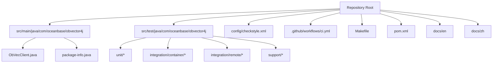
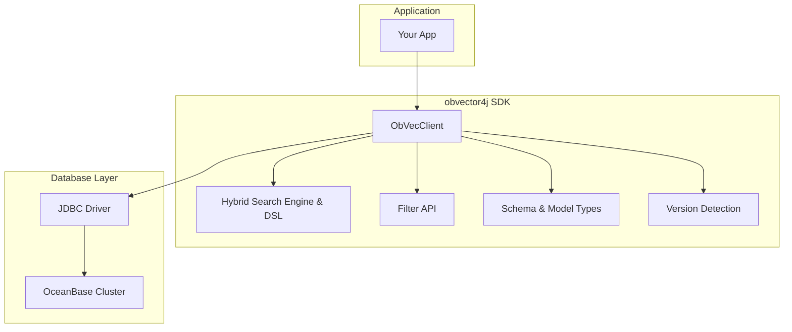
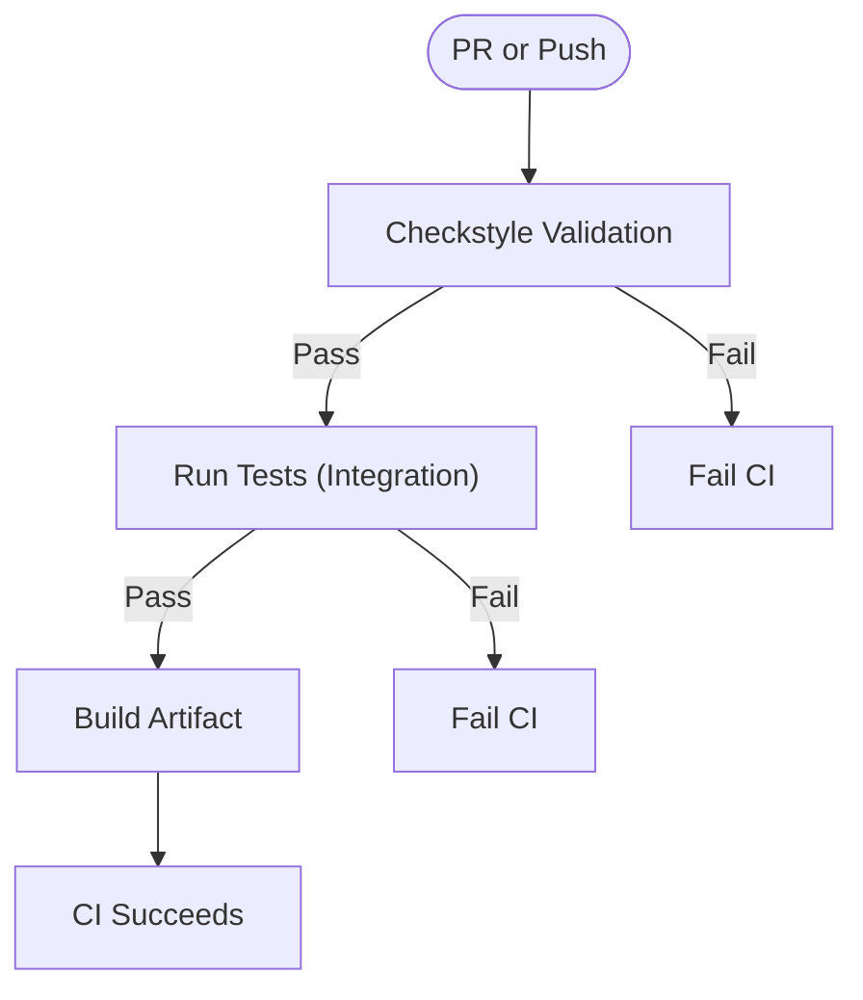
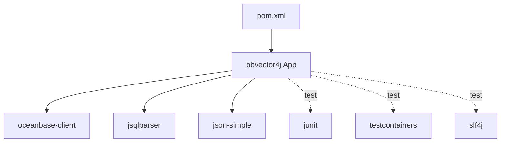

# Contribution Guidelines

<cite>
**Referenced Files in This Document**
- [CONTRIBUTING.md](file://CONTRIBUTING.md)
- [README.md](file://README.md)
- [pom.xml](file://pom.xml)
- [Makefile](file://Makefile)
- [.github/workflows/ci.yml](file://.github/workflows/ci.yml)
- [config/checkstyle.xml](file://config/checkstyle.xml)
- [ObVecClient.java](file://src/main/java/com/oceanbase/obvector4j/ObVecClient.java)
- [package-info.java](file://src/main/java/com/oceanbase/obvector4j/package-info.java)
- [HybridDslTest.java](file://src/test/java/com/oceanbase/obvector4j/unit/HybridDslTest.java)
- [VecClientTest.java](file://src/test/java/com/oceanbase/obvector4j/integration/container/VecClientTest.java)
- [OceanBaseContainerTestBase.java](file://src/test/java/com/oceanbase/obvector4j/support/OceanBaseContainerTestBase.java)
</cite>

## Table of Contents
1. [Introduction](#introduction)
2. [Project Structure](#project-structure)
3. [Core Components](#core-components)
4. [Architecture Overview](#architecture-overview)
5. [Detailed Component Analysis](#detailed-component-analysis)
6. [Dependency Analysis](#dependency-analysis)
7. [Performance Considerations](#performance-considerations)
8. [Troubleshooting Guide](#troubleshooting-guide)
9. [Conclusion](#conclusion)
10. [Appendices](#appendices)

## Introduction
This document provides clear, actionable contribution guidelines for the obvector4j project. It consolidates environment setup, coding standards, testing practices, CI expectations, and development workflows so contributors can work efficiently and consistently.

## Project Structure
The repository is a Java 8 Maven project with:
- Source code under src/main/java
- Unit tests under src/test/java/.../unit
- Integration tests using Testcontainers under src/test/java/.../integration/container
- Remote integration tests against an external OceanBase cluster under src/test/java/.../integration/remote
- Documentation in docs/en and docs/zh
- Build and quality tooling via Maven and Checkstyle
- GitHub Actions CI pipeline

**Diagram sources**
- [pom.xml:1-20](file://pom.xml#L1-L20)
- [Makefile:1-30](file://Makefile#L1-L30)
- [.github/workflows/ci.yml:1-58](file://.github/workflows/ci.yml#L1-L58)
- [ObVecClient.java:1-50](file://src/main/java/com/oceanbase/obvector4j/ObVecClient.java#L1-L50)
- [package-info.java:1-31](file://src/main/java/com/oceanbase/obvector4j/package-info.java#L1-L31)

**Section sources**
- [README.md:80-88](file://README.md#L80-L88)
- [pom.xml:101-186](file://pom.xml#L101-L186)
- [Makefile:1-30](file://Makefile#L1-L30)

## Core Components
- ObVecClient: Primary entry point for vector table CRUD, index management, and search operations.
- Hybrid Search: DSL and builders for hybrid queries (text + vector).
- Filter API: Type-safe filter construction.
- Schema and Model: Data types, field/index definitions, and JDBC value wrappers.
- Version detection: OceanBase version checks to enable feature flags.
- JSON virtual tables: Client for JSON-based querying.

Contributors should focus on these areas when adding features or fixing bugs.

**Section sources**
- [ObVecClient.java:46-85](file://src/main/java/com/oceanbase/obvector4j/ObVecClient.java#L46-L85)
- [package-info.java:17-29](file://src/main/java/com/oceanbase/obvector4j/package-info.java#L17-L29)

## Architecture Overview
At a high level:
- Application code uses JDBC to interact with OceanBase.
- The client exposes fluent APIs for schema, indexing, and search.
- Hybrid search builds structured DSLs that are translated into native SQL where supported.
- Tests use JUnit; integration tests leverage Testcontainers or remote clusters.

[No sources needed since this diagram shows conceptual workflow, not actual code structure]

## Detailed Component Analysis

### Development Environment and Quick Start
- Requirements: JDK 8, Maven 3.6+, Docker (for integration tests).
- Quick commands: build, unit-test, test, format-check.

Recommended workflow:
- Clone the repo
- Run make format-check before committing
- Run make unit-test locally
- Use make test for containerized integration tests
- For remote IT, set environment variables and run mvn test -Premote-it

**Section sources**
- [CONTRIBUTING.md:5-20](file://CONTRIBUTING.md#L5-L20)
- [README.md:92-112](file://README.md#L92-L112)
- [pom.xml:188-239](file://pom.xml#L188-L239)

### Coding Standards and License Headers
- All Java files must include the Mulan PSL v2 license header at the top.
- Code style enforced by Checkstyle:
  - No tabs; use 4 spaces
  - No trailing whitespace
  - Max line length 150 characters
  - No unused imports or wildcard imports
  - Braces required for control structures
  - Empty catch blocks must contain a comment
  - equals() and hashCode() must be implemented together
  - Do not catch Throwable or Error

Run make format-check to validate.

**Section sources**
- [CONTRIBUTING.md:22-58](file://CONTRIBUTING.md#L22-L58)
- [config/checkstyle.xml:16-71](file://config/checkstyle.xml#L16-L71)

### Exception Handling Best Practices
- Catch specific exceptions (e.g., SQLException), never Throwable.
- Avoid e.printStackTrace(); prefer SLF4J logging or JUnit assertions.
- Prefer throwing from test methods over try-catch blocks.

**Section sources**
- [CONTRIBUTING.md:60-65](file://CONTRIBUTING.md#L60-L65)

### Commit Messages and PR Process
- Use clear English commit messages describing what and why.
- Fork, create a branch, ensure all checks pass, then open a PR with description and motivation.

**Section sources**
- [CONTRIBUTING.md:66-83](file://CONTRIBUTING.md#L66-L83)

### Testing Strategy
- Unit tests:
  - Place under src/test/java/.../unit
  - Run with make unit-test
- Integration tests:
  - Place under src/test/java/.../integration/container
  - Use Testcontainers to spin up OceanBase
  - Run with make test
- Remote integration tests:
  - Place under src/test/java/.../integration/remote
  - Requires env vars and mvn test -Premote-it

Example patterns:
- Unit tests assert DSL generation and behavior without DB.
- Integration tests exercise full CRUD and search flows against a real database instance.

**Section sources**
- [CONTRIBUTING.md:84-114](file://CONTRIBUTING.md#L84-L114)
- [HybridDslTest.java:1-30](file://src/test/java/com/oceanbase/obvector4j/unit/HybridDslTest.java#L1-L30)
- [VecClientTest.java:1-30](file://src/test/java/com/oceanbase/obvector4j/integration/container/VecClientTest.java#L1-L30)
- [OceanBaseContainerTestBase.java:42-96](file://src/test/java/com/oceanbase/obvector4j/support/OceanBaseContainerTestBase.java#L42-L96)

### Continuous Integration Expectations
CI runs three jobs:
- Format check: validates code style with Checkstyle
- Test: runs integration tests (unit + container)
- Build: packages the artifact

All jobs require Java 8 and will fail if any step fails.

**Diagram sources**
- [.github/workflows/ci.yml:14-58](file://.github/workflows/ci.yml#L14-L58)

**Section sources**
- [.github/workflows/ci.yml:1-58](file://.github/workflows/ci.yml#L1-58)

### Entry Point and Public API
- Start with ObVecClient as the main entry point.
- Subpackages provide schema, model, hybrid search, filter, version detection, and JSON virtual table support.

**Section sources**
- [ObVecClient.java:46-85](file://src/main/java/com/oceanbase/obvector4j/ObVecClient.java#L46-L85)
- [package-info.java:17-29](file://src/main/java/com/oceanbase/obvector4j/package-info.java#L17-L29)

### Example: Building Hybrid Search DSL
When contributing to hybrid search features:
- Ensure DSL builders produce correct JSON keys and values.
- Validate combinations like match/multiMatch, knn filters, ranking strategies.
- Keep tests focused on DSL correctness and edge cases.

**Section sources**
- [HybridDslTest.java:30-92](file://src/test/java/com/oceanbase/obvector4j/unit/HybridDslTest.java#L30-L92)

### Example: Integration Test Patterns
For integration tests:
- Use OceanBaseContainerTestBase to obtain JDBC URL and credentials.
- Create collections, insert data, query, delete, and verify results.
- Exercise HNSW settings and index creation.

**Section sources**
- [VecClientTest.java:76-198](file://src/test/java/com/oceanbase/obvector4j/integration/container/VecClientTest.java#L76-L198)
- [OceanBaseContainerTestBase.java:42-96](file://src/test/java/com/oceanbase/obvector4j/support/OceanBaseContainerTestBase.java#L42-L96)

## Dependency Analysis
Key dependencies and their roles:
- oceanbase-client: JDBC driver for OceanBase
- jsqlparser: SQL parsing utilities
- json-simple: JSON handling
- junit: Unit testing framework
- testcontainers: Containerized integration tests
- slf4j-api/simple: Logging in tests

Maven profiles:
- integration: includes unit and container integration tests
- remote-it: includes remote integration tests
- all-tests: includes all tests

**Diagram sources**
- [pom.xml:19-75](file://pom.xml#L19-L75)

**Section sources**
- [pom.xml:19-75](file://pom.xml#L19-L75)
- [pom.xml:188-239](file://pom.xml#L188-L239)

## Performance Considerations
- Prefer batched inserts and prepared statements to reduce round-trips.
- Tune HNSW ef_search appropriately for latency vs recall trade-offs.
- Avoid unnecessary object allocations in hot paths.
- Use proper exception handling to prevent resource leaks.

[No sources needed since this section provides general guidance]

## Troubleshooting Guide
Common issues and resolutions:
- Checkstyle failures:
  - Fix tabs, trailing whitespace, long lines, unused imports, missing braces, empty catch blocks, and equals/hashCode pairs.
- Missing license headers:
  - Add the Mulan PSL v2 header to all new Java files.
- Integration tests failing due to Docker:
  - Ensure Docker is running and accessible; verify OCEANBASE_URI or allow Testcontainers to start the container.
- Remote IT failures:
  - Verify environment variables and connectivity to the target OceanBase cluster.

**Section sources**
- [config/checkstyle.xml:16-71](file://config/checkstyle.xml#L16-L71)
- [CONTRIBUTING.md:22-58](file://CONTRIBUTING.md#L22-L58)
- [OceanBaseContainerTestBase.java:42-96](file://src/test/java/com/oceanbase/obvector4j/support/OceanBaseContainerTestBase.java#L42-L96)

## Conclusion
Follow these guidelines to contribute effectively: maintain consistent code style, add appropriate tests, respect licensing, and ensure CI passes. When in doubt, refer to existing unit and integration tests for patterns and examples.

[No sources needed since this section summarizes without analyzing specific files]

## Appendices

### Make Targets Reference
- build: package without tests
- unit-test: run unit tests only
- test: run unit + container integration tests
- format-check: run Checkstyle validation

**Section sources**
- [Makefile:1-30](file://Makefile#L1-L30)

### Maven Profiles Reference
- integration: unit + container integration tests
- remote-it: remote integration tests
- all-tests: all tests

**Section sources**
- [pom.xml:188-239](file://pom.xml#L188-L239)