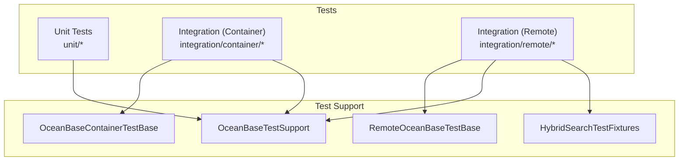
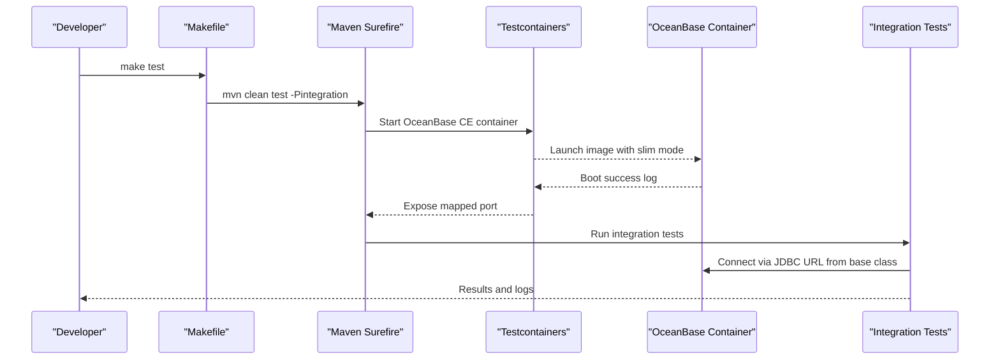
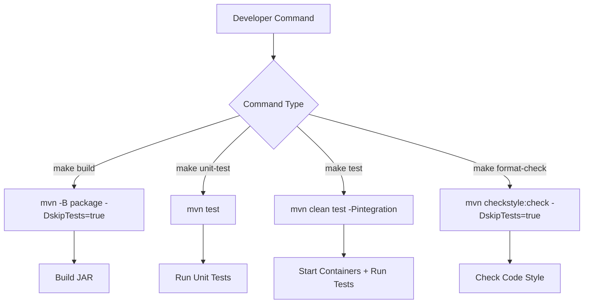
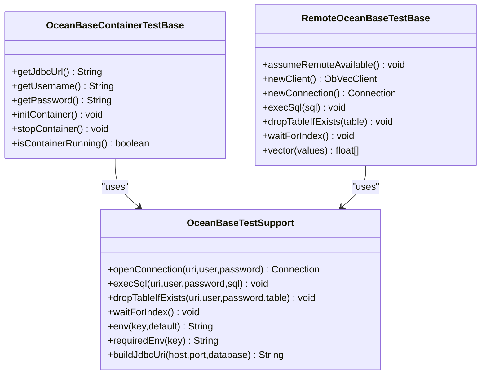
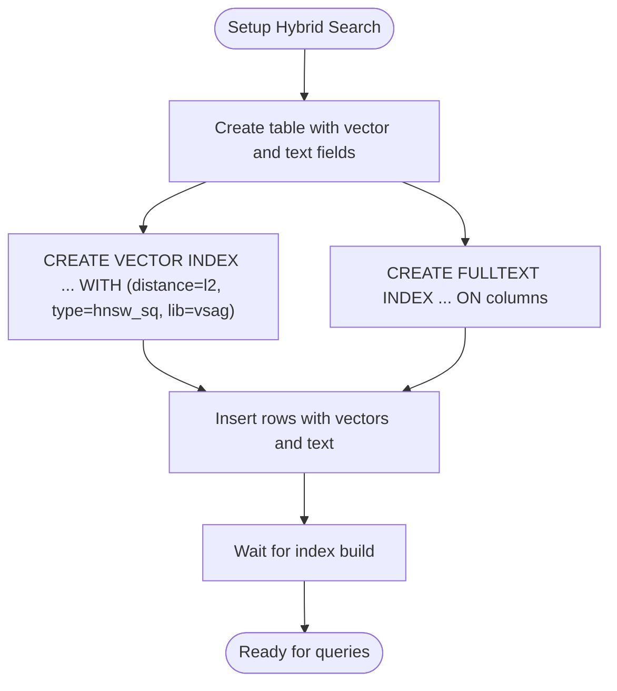
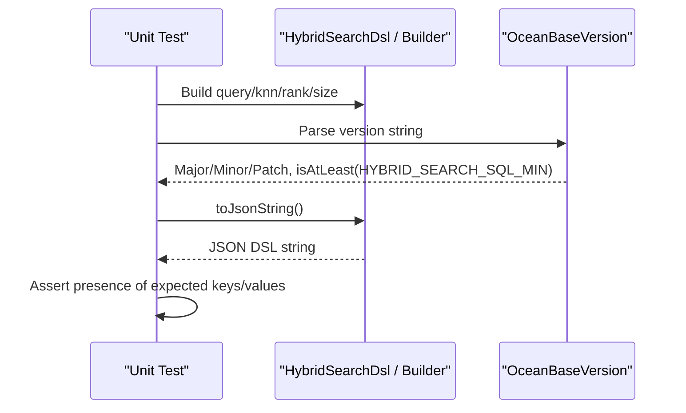
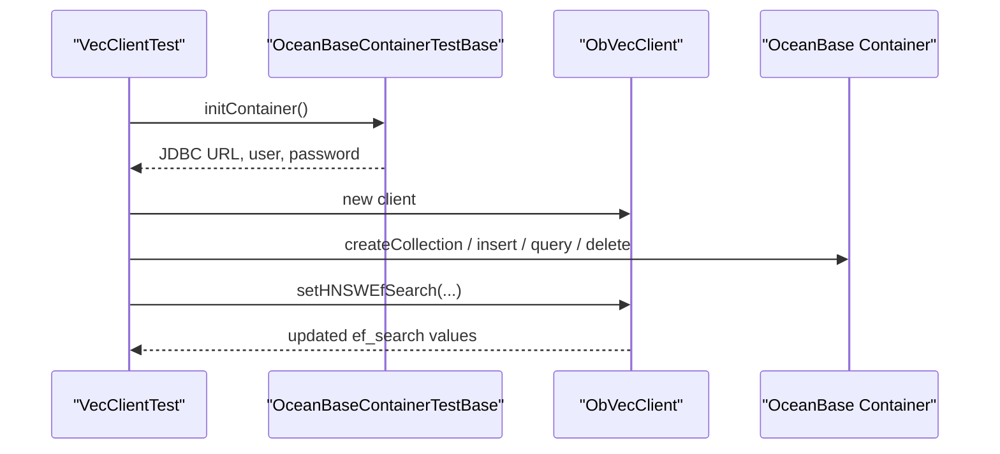
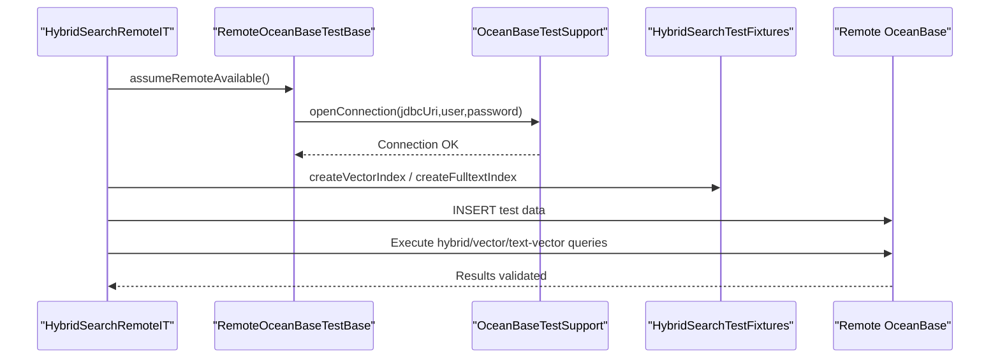
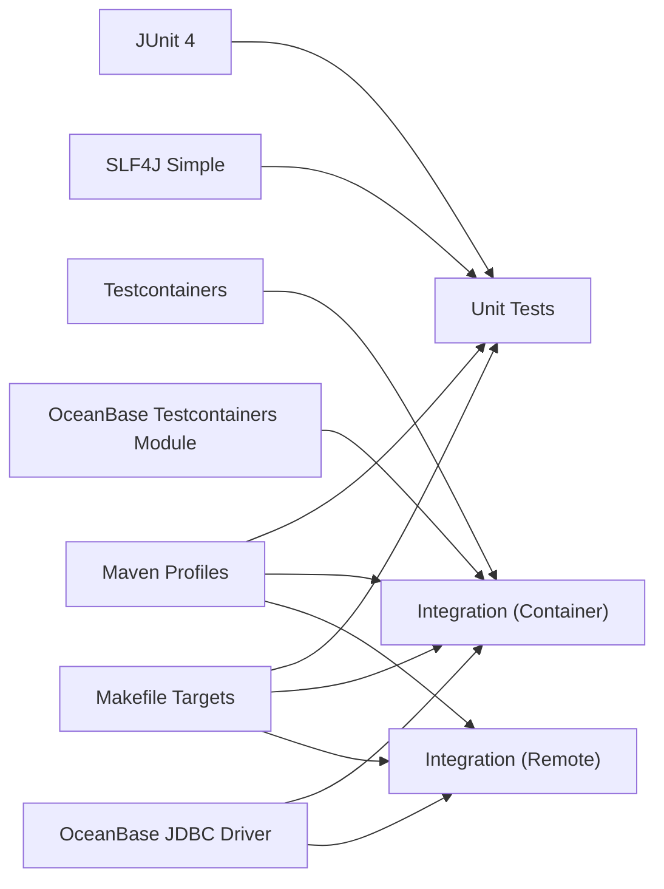

# Testing and Development Guide

<cite>
**Referenced Files in This Document**
- [README.md](file://README.md)
- [pom.xml](file://pom.xml)
- [Makefile](file://Makefile)
- [.github/workflows/ci.yml](file://.github/workflows/ci.yml)
- [OceanBaseContainerTestBase.java](file://src/test/java/com/oceanbase/obvector4j/support/OceanBaseContainerTestBase.java)
- [RemoteOceanBaseTestBase.java](file://src/test/java/com/oceanbase/obvector4j/support/RemoteOceanBaseTestBase.java)
- [OceanBaseTestSupport.java](file://src/test/java/com/oceanbase/obvector4j/support/OceanBaseTestSupport.java)
- [HybridSearchTestFixtures.java](file://src/test/java/com/oceanbase/obvector4j/support/HybridSearchTestFixtures.java)
- [VecClientTest.java](file://src/test/java/com/oceanbase/obvector4j/integration/container/VecClientTest.java)
- [HybridSearchTest.java](file://src/test/java/com/oceanbase/obvector4j/integration/container/HybridSearchTest.java)
- [HybridSearchRemoteIT.java](file://src/test/java/com/oceanbase/obvector4j/integration/remote/HybridSearchRemoteIT.java)
- [HybridDslTest.java](file://src/test/java/com/oceanbase/obvector4j/unit/HybridDslTest.java)
- [HybridSearchDslTest.java](file://src/test/java/com/oceanbase/obvector4j/unit/HybridSearchDslTest.java)
</cite>

## Update Summary
**Changes Made**
- Updated all build and test commands to use Makefile targets instead of direct Maven invocations
- Added comprehensive Makefile target documentation with descriptions
- Updated local development workflow examples to use consistent make commands
- Enhanced CI/CD integration section to reflect Makefile-based workflow
- Added troubleshooting guidance for Makefile usage

## Table of Contents
1. [Introduction](#introduction)
2. [Project Structure](#project-structure)
3. [Core Components](#core-components)
4. [Architecture Overview](#architecture-overview)
5. [Detailed Component Analysis](#detailed-component-analysis)
6. [Dependency Analysis](#dependency-analysis)
7. [Performance Considerations](#performance-considerations)
8. [Troubleshooting Guide](#troubleshooting-guide)
9. [Conclusion](#conclusion)
10. [Appendices](#appendices)

## Introduction
This guide explains how to develop and test applications using OceanBase Vector4J with a focus on testing strategies:
- Unit tests for DSL, filters, and JSON table utilities without external dependencies
- Integration tests using Testcontainers for local development against an ephemeral OceanBase instance
- Remote integration tests against a real OceanBase cluster
- Test base classes, fixtures, and environment configuration
- Examples for writing effective tests for custom filters, hybrid search queries, and JSON table operations
- Performance testing guidelines, test data management, and continuous integration setup

The repository provides a unified Makefile interface for consistent developer experience across all build and test operations, along with Maven profiles for advanced scenarios and a GitHub Actions workflow to execute containerized integration tests automatically.

## Project Structure
The test suite is organized into three layers:
- unit: Pure Java tests that validate DSL building, filter mapping, and version parsing without any database
- integration/container: Tests that use Testcontainers to start a local OceanBase instance
- integration/remote: Tests that connect to an externally provided OceanBase cluster via environment variables

**Diagram sources**
- [pom.xml:188-239](file://pom.xml#L188-L239)
- [OceanBaseContainerTestBase.java:1-104](file://src/test/java/com/oceanbase/obvector4j/support/OceanBaseContainerTestBase.java#L1-L104)
- [RemoteOceanBaseTestBase.java:1-87](file://src/test/java/com/oceanbase/obvector4j/support/RemoteOceanBaseTestBase.java#L1-L87)
- [OceanBaseTestSupport.java:1-59](file://src/test/java/com/oceanbase/obvector4j/support/OceanBaseTestSupport.java#L1-L59)
- [HybridSearchTestFixtures.java:1-32](file://src/test/java/com/oceanbase/obvector4j/support/HybridSearchTestFixtures.java#L1-L32)

**Section sources**
- [README.md:92-112](file://README.md#L92-L112)
- [pom.xml:188-239](file://pom.xml#L188-L239)

## Core Components
This section summarizes the key testing components and their responsibilities.

### Build System and Makefile Targets
The project now uses a unified Makefile interface for consistent developer experience:

- **Build targets**:
  - `make build`: Builds the project (skips tests)
  - `make unit-test`: Runs only unit tests
  - `make test`: Runs integration tests (unit + container-based)
  - `make format-check`: Checks code style with Checkstyle
  - `make help`: Shows available targets and descriptions

- **Maven profiles** (for advanced scenarios):
  - Default profile runs only unit tests
  - integration profile includes unit + container-based integration tests
  - remote-it profile runs only remote integration tests
  - all-tests profile runs all tests together

### Containerized Test Base
- Starts or reuses an OceanBase CE container unless OCEANBASE_URI is set
- Provides JDBC URL, username, password helpers
- Manages lifecycle of the container

### Remote Test Base
- Skips tests when OCEANBASE_REMOTE_IT is not enabled
- Validates connectivity before running tests
- Provides helper methods to create clients and execute SQL

### Shared Support Utilities
- JDBC connection helpers, index creation helpers, vector builder, env var helpers

### Fixtures for Hybrid Search
- DDL and index creation helpers for vector and fulltext indexes
- Common table prefix and row store organization constants

**Section sources**
- [Makefile:1-30](file://Makefile#L1-L30)
- [pom.xml:188-239](file://pom.xml#L188-L239)
- [OceanBaseContainerTestBase.java:1-104](file://src/test/java/com/oceanbase/obvector4j/support/OceanBaseContainerTestBase.java#L1-L104)
- [RemoteOceanBaseTestBase.java:1-87](file://src/test/java/com/oceanbase/obvector4j/support/RemoteOceanBaseTestBase.java#L1-L87)
- [OceanBaseTestSupport.java:1-59](file://src/test/java/com/oceanbase/obvector4j/support/OceanBaseTestSupport.java#L1-L59)
- [HybridSearchTestFixtures.java:1-32](file://src/test/java/com/oceanbase/obvector4j/support/HybridSearchTestFixtures.java#L1-L32)

## Architecture Overview
The testing architecture separates concerns across unit, containerized integration, and remote integration tests. The CI pipeline executes containerized integration tests by default using the unified Makefile interface.

**Diagram sources**
- [Makefile:6-8](file://Makefile#L6-L8)
- [pom.xml:189-205](file://pom.xml#L189-L205)
- [OceanBaseContainerTestBase.java:67-80](file://src/test/java/com/oceanbase/obvector4j/support/OceanBaseContainerTestBase.java#L67-L80)
- [.github/workflows/ci.yml:38](file://.github/workflows/ci.yml#L38)

## Detailed Component Analysis

### Build System and Makefile Interface
The Makefile provides a consistent interface for all development tasks:

- **Unified Commands**: All build and test operations use simple `make` commands
- **Color-coded Output**: Visual feedback with colored status messages
- **Help System**: Built-in help with `make help` shows all available targets
- **Standard Workflow**: Consistent experience across different environments

**Diagram sources**
- [Makefile:15-23](file://Makefile#L15-L23)

**Section sources**
- [Makefile:1-30](file://Makefile#L1-L30)

### Test Base Classes and Lifecycle Management
- OceanBaseContainerTestBase
  - Initializes a Testcontainers OceanBase CE container if OCEANBASE_URI is not set
  - Provides getJdbcUrl(), getUsername(), getPassword()
  - Manages container startup and shutdown
- RemoteOceanBaseTestBase
  - Enables/disables remote tests based on OCEANBASE_REMOTE_IT
  - Validates driver availability and connectivity
  - Provides newClient(), execSql(), dropTableIfExists(), waitForIndex(), vector()

**Diagram sources**
- [OceanBaseContainerTestBase.java:1-104](file://src/test/java/com/oceanbase/obvector4j/support/OceanBaseContainerTestBase.java#L1-L104)
- [RemoteOceanBaseTestBase.java:1-87](file://src/test/java/com/oceanbase/obvector4j/support/RemoteOceanBaseTestBase.java#L1-L87)
- [OceanBaseTestSupport.java:1-59](file://src/test/java/com/oceanbase/obvector4j/support/OceanBaseTestSupport.java#L1-L59)

**Section sources**
- [OceanBaseContainerTestBase.java:1-104](file://src/test/java/com/oceanbase/obvector4j/support/OceanBaseContainerTestBase.java#L1-L104)
- [RemoteOceanBaseTestBase.java:1-87](file://src/test/java/com/oceanbase/obvector4j/support/RemoteOceanBaseTestBase.java#L1-L87)
- [OceanBaseTestSupport.java:1-59](file://src/test/java/com/oceanbase/obvector4j/support/OceanBaseTestSupport.java#L1-L59)

### Fixture Creation for Hybrid Search Scenarios
- HybridSearchTestFixtures
  - Provides common DDL fragments and index creation helpers
  - Encapsulates vector and fulltext index creation with consistent parameters
  - Offers a simple SqlExecutor interface for reuse across tests

**Diagram sources**
- [HybridSearchTestFixtures.java:17-26](file://src/test/java/com/oceanbase/obvector4j/support/HybridSearchTestFixtures.java#L17-L26)

**Section sources**
- [HybridSearchTestFixtures.java:1-32](file://src/test/java/com/oceanbase/obvector4j/support/HybridSearchTestFixtures.java#L1-L32)

### Unit Testing Patterns for Filters, DSL, and Version Parsing
- Filter API validation
  - Tests assert correct SQL-like filter expressions are built and applied in hybrid queries
- DSL composition
  - Tests verify match/multi-match, bool must/filter/should, range, term, jsonContains, arrayContains/arrayOverlaps
  - Tests cover knn options like similarity, efSearch, refineK, filterMode, and ranking strategies (RRF, weightedSum)
- Version parsing and feature gating
  - Tests parse version strings and determine HYBRID_SEARCH SQL capability thresholds

**Diagram sources**
- [HybridDslTest.java:14-155](file://src/test/java/com/oceanbase/obvector4j/unit/HybridDslTest.java#L14-L155)
- [HybridSearchDslTest.java:12-110](file://src/test/java/com/oceanbase/obvector4j/unit/HybridSearchDslTest.java#L12-L110)

**Section sources**
- [HybridDslTest.java:1-157](file://src/test/java/com/oceanbase/obvector4j/unit/HybridDslTest.java#L1-L157)
- [HybridSearchDslTest.java:1-111](file://src/test/java/com/oceanbase/obvector4j/unit/HybridSearchDslTest.java#L1-L111)

### Integration Testing with Testcontainers
- VecClientTest
  - Demonstrates collection CRUD, vector insert/query/delete, and HNSW ef_search settings
  - Uses OceanBaseContainerTestBase to obtain JDBC credentials and manage container lifecycle
- HybridSearchTest
  - Covers text-vector hybrid search, scalar-vector hybrid search, and Filter API usage
  - Creates tables, indexes, inserts data, waits for indexing, then validates results

**Diagram sources**
- [VecClientTest.java:48-186](file://src/test/java/com/oceanbase/obvector4j/integration/container/VecClientTest.java#L48-L186)
- [OceanBaseContainerTestBase.java:67-80](file://src/test/java/com/oceanbase/obvector4j/support/OceanBaseContainerTestBase.java#L67-L80)

**Section sources**
- [VecClientTest.java:1-187](file://src/test/java/com/oceanbase/obvector4j/integration/container/VecClientTest.java#L1-L187)
- [HybridSearchTest.java:1-800](file://src/test/java/com/oceanbase/obvector4j/integration/container/HybridSearchTest.java#L1-L800)

### Remote Cluster Testing Setup
- RemoteOceanBaseTestBase
  - Requires OCEANBASE_REMOTE_IT=1 and either OCEANBASE_URI or host/port/user/password/database
  - Performs a connectivity check and skips tests if unavailable
- HybridSearchRemoteIT
  - Exercises scalar-vector search with filters, text-vector hybrid search, pure vector search, native HYBRID_SEARCH SQL path, and custom DSL
  - Uses HybridSearchTestFixtures for index creation and shared DDL patterns

**Diagram sources**
- [RemoteOceanBaseTestBase.java:23-57](file://src/test/java/com/oceanbase/obvector4j/support/RemoteOceanBaseTestBase.java#L23-L57)
- [HybridSearchRemoteIT.java:35-335](file://src/test/java/com/oceanbase/obvector4j/integration/remote/HybridSearchRemoteIT.java#L35-L335)
- [HybridSearchTestFixtures.java:17-26](file://src/test/java/com/oceanbase/obvector4j/support/HybridSearchTestFixtures.java#L17-L26)
- [OceanBaseTestSupport.java:16-36](file://src/test/java/com/oceanbase/obvector4j/support/OceanBaseTestSupport.java#L16-L36)

**Section sources**
- [RemoteOceanBaseTestBase.java:1-87](file://src/test/java/com/oceanbase/obvector4j/support/RemoteOceanBaseTestBase.java#L1-L87)
- [HybridSearchRemoteIT.java:1-335](file://src/test/java/com/oceanbase/obvector4j/integration/remote/HybridSearchRemoteIT.java#L1-L335)

### Writing Effective Unit Tests for Custom Filters
- Use FilterBuilder to construct complex conditions (equality, ranges, IN lists, AND/OR combinations)
- Validate that filters are correctly embedded into hybrid search requests
- For DSL-only scenarios, assert JSON structure contains expected keys and values

Example references:
- Filter composition and assertion in hybrid search flows
- DSL assertions for match, multiMatch, bool, range, term, jsonContains, arrayContains/arrayOverlaps

**Section sources**
- [HybridSearchTest.java:359-605](file://src/test/java/com/oceanbase/obvector4j/integration/container/HybridSearchTest.java#L359-L605)
- [HybridDslTest.java:31-108](file://src/test/java/com/oceanbase/obvector4j/unit/HybridDslTest.java#L31-L108)

### Writing Effective Unit Tests for Hybrid Search Queries
- Validate both simplified APIs (scalarVectorSearch, textVectorSearch) and custom DSL paths
- Ensure output field selection and result shape are correct
- Verify ranking behavior (RRF, weighted sum) and window size effects

Example references:
- Text-vector hybrid search with multiple text fields and metric selection
- Scalar-vector hybrid search with filters and output field typing

**Section sources**
- [HybridSearchTest.java:72-199](file://src/test/java/com/oceanbase/obvector4j/integration/container/HybridSearchTest.java#L72-L199)
- [HybridSearchTest.java:204-354](file://src/test/java/com/oceanbase/obvector4j/integration/container/HybridSearchTest.java#L204-L354)
- [HybridSearchDslTest.java:55-73](file://src/test/java/com/oceanbase/obvector4j/unit/HybridSearchDslTest.java#L55-L73)

### Writing Effective Unit Tests for JSON Table Operations
- While this guide focuses on testing patterns, JSON table utilities can be tested similarly to other domain objects:
  - Construct JsonData instances and assert serialization/deserialization
  - Validate column metadata and type mappings
  - Combine with filter expressions to ensure compatibility with JSON fields

[No sources needed since this section doesn't analyze specific files]

### Mocking Strategies for External Dependencies
- Prefer lightweight unit tests that do not require a database; rely on pure Java logic for DSL and filter building
- For integration tests, avoid mocking the database; instead, use Testcontainers or a remote cluster to validate end-to-end behavior
- If you must isolate parts of your application under test, mock only non-database services (e.g., HTTP clients, caches) while keeping database interactions real through containers

[No sources needed since this section doesn't analyze specific files]

## Dependency Analysis
The test suite depends on JUnit 4, SLF4J for logging, and Testcontainers with the OceanBase module. Profiles control which tests are included.

**Diagram sources**
- [pom.xml:19-75](file://pom.xml#L19-L75)
- [pom.xml:188-239](file://pom.xml#L188-L239)
- [Makefile:1-30](file://Makefile#L1-L30)

**Section sources**
- [pom.xml:19-75](file://pom.xml#L19-L75)
- [pom.xml:188-239](file://pom.xml#L188-L239)
- [Makefile:1-30](file://Makefile#L1-L30)

## Performance Considerations
- Indexing strategy
  - Use appropriate vector index types and metrics (e.g., L2, inner product) and tune efSearch for recall vs latency trade-offs
- Ranking parameters
  - Adjust rank_window_size and rank_constant for RRF; consider min_score and boost weights for relevance tuning
- Query patterns
  - Limit topk to necessary sizes; select only required outputFields to reduce payload
- Data volume
  - Keep test datasets small but representative; generate deterministic vectors for reproducibility
- Concurrency
  - Avoid parallelizing heavy integration tests within a single container; prefer sequential execution per container lifecycle

[No sources needed since this section provides general guidance]

## Troubleshooting Guide
Common issues and resolutions:

### Build System Issues
- **Make command not found**: Install GNU Make on your system
- **Permission denied**: Ensure you have execute permissions on the Makefile
- **Unknown target**: Use `make help` to see all available targets

### Missing environment variables for remote tests
- Ensure OCEANBASE_REMOTE_IT=1 and provide OCEANBASE_URI or host/port/user/password/database

### Container startup failures
- Check Docker availability and network; increase startup timeout if needed
- Verify Docker daemon is running and accessible

### Index readiness
- Use waitForIndex helper or add explicit sleeps between index creation and queries

### Driver classpath
- Confirm oceanbase-client dependency is present and driver class is loadable

**Section sources**
- [Makefile:25-29](file://Makefile#L25-L29)
- [RemoteOceanBaseTestBase.java:23-57](file://src/test/java/com/oceanbase/obvector4j/support/RemoteOceanBaseTestBase.java#L23-L57)
- [OceanBaseTestSupport.java:34-53](file://src/test/java/com/oceanbase/obvector4j/support/OceanBaseTestSupport.java#L34-L53)

## Conclusion
This guide outlined a comprehensive testing approach for OceanBase Vector4J with a unified Makefile interface:
- Use unit tests for DSL, filters, and version parsing
- Use Testcontainers for fast, isolated integration tests locally
- Use remote integration tests for validating against real clusters
- Leverage shared bases and fixtures to keep tests maintainable
- Follow performance and data management best practices
- Integrate tests into CI using Makefile targets and GitHub Actions
- Enjoy consistent developer experience with standardized build commands

## Appendices

### Running Tests Locally
The project now provides a unified interface through Makefile targets:

- **Unit tests only**: `make unit-test`
- **Containerized integration tests**: `make test`
- **Build project**: `make build`
- **Code style check**: `make format-check`
- **Show help**: `make help`

For advanced scenarios requiring direct Maven control:
- **Remote integration tests**: export OCEANBASE_REMOTE_IT=1 and required env vars, then `mvn test -Premote-it`
- **All tests**: `mvn test -Pall-tests`

**Section sources**
- [README.md:92-112](file://README.md#L92-L112)
- [Makefile:1-30](file://Makefile#L1-L30)
- [pom.xml:188-239](file://pom.xml#L188-L239)

### Continuous Integration Setup
GitHub Actions workflow uses Makefile targets for consistent execution:

- **Format check job**: Runs `make format-check`
- **Test job**: Executes `make test` with containerized integration tests
- **Build job**: Runs `make build` after successful tests

The workflow ensures consistent behavior across development and CI environments.

**Section sources**
- [.github/workflows/ci.yml:1-58](file://.github/workflows/ci.yml#L1-L58)
- [Makefile:1-30](file://Makefile#L1-L30)

### Makefile Target Reference
Complete reference for all available Makefile targets:

| Target | Description | Underlying Command |
|--------|-------------|-------------------|
| `make build` | Build the project (skip tests) | `mvn -B package -DskipTests=true -Dmaven.javadoc.skip=true` |
| `make unit-test` | Run unit tests only | `mvn test` |
| `make test` | Run integration tests (unit + container) | `mvn clean test -Pintegration` |
| `make format-check` | Check code style with Checkstyle | `mvn checkstyle:check -DskipTests=true` |
| `make help` | Show help with all available targets | Built-in help system |

**Section sources**
- [Makefile:1-30](file://Makefile#L1-L30)