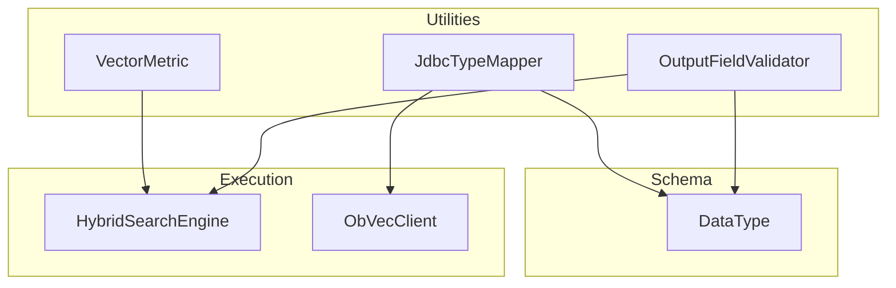
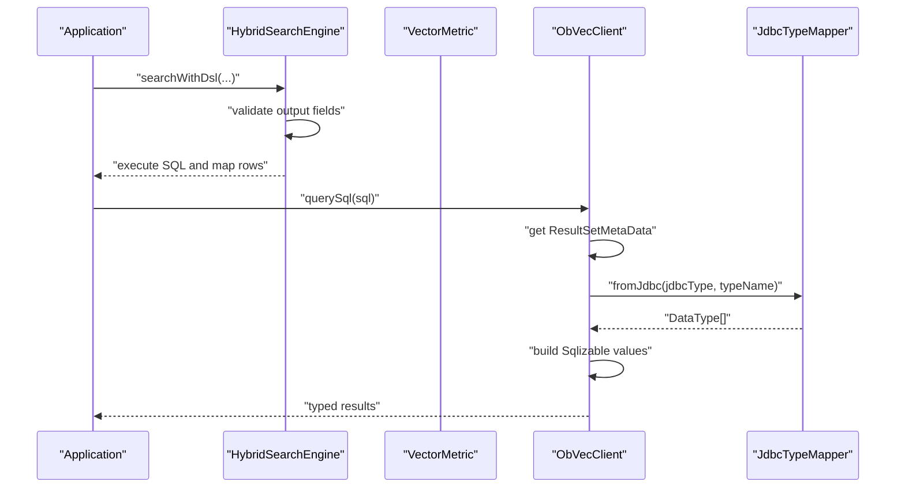
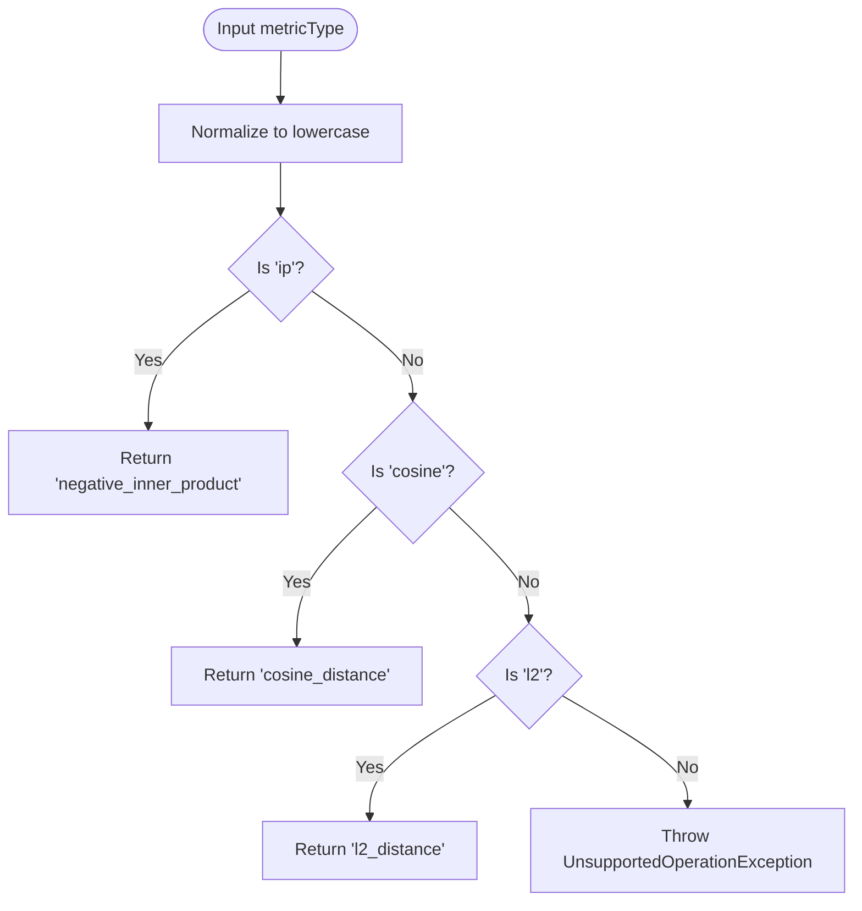
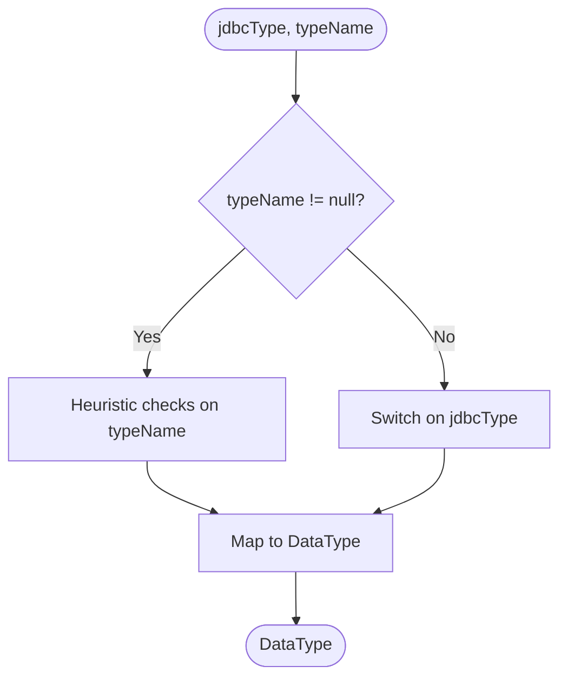
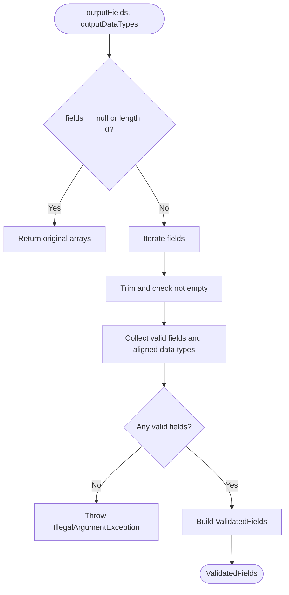
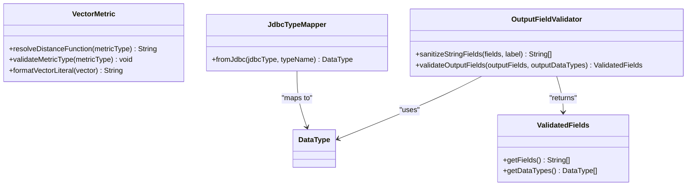

# Utilities and Helper Classes

<cite>
**Referenced Files in This Document**
- [VectorMetric.java](file://src/main/java/com/oceanbase/obvector4j/util/VectorMetric.java)
- [JdbcTypeMapper.java](file://src/main/java/com/oceanbase/obvector4j/util/JdbcTypeMapper.java)
- [OutputFieldValidator.java](file://src/main/java/com/oceanbase/obvector4j/hybrid/OutputFieldValidator.java)
- [DataType.java](file://src/main/java/com/oceanbase/obvector4j/schema/DataType.java)
- [HybridSearchEngine.java](file://src/main/java/com/oceanbase/obvector4j/hybrid/HybridSearchEngine.java)
- [ObVecClient.java](file://src/main/java/com/oceanbase/obvector4j/ObVecClient.java)
</cite>

## Table of Contents
1. [Introduction](#introduction)
2. [Project Structure](#project-structure)
3. [Core Components](#core-components)
4. [Architecture Overview](#architecture-overview)
5. [Detailed Component Analysis](#detailed-component-analysis)
6. [Dependency Analysis](#dependency-analysis)
7. [Performance Considerations](#performance-considerations)
8. [Troubleshooting Guide](#troubleshooting-guide)
9. [Conclusion](#conclusion)

## Introduction
This document explains the utility classes and helper functions that support core functionality: VectorMetric for distance calculation algorithms, JdbcTypeMapper for database type compatibility, and OutputFieldValidator for result set validation. It includes usage examples, extension guidance, performance characteristics, JDBC driver compatibility considerations, and validation strategies for query results.

## Project Structure
The utilities are organized under util and hybrid packages and integrate with schema types and client execution paths:
- VectorMetric provides metric resolution and vector literal formatting used by SQL generation.
- JdbcTypeMapper maps JDBC metadata to SDK DataType for consistent result mapping.
- OutputFieldValidator sanitizes and validates output fields and data types for hybrid search queries.
- These utilities are consumed by HybridSearchEngine and ObVecClient during query execution and result processing.

**Diagram sources**
- [VectorMetric.java:11-27](file://src/main/java/com/oceanbase/obvector4j/util/VectorMetric.java#L11-L27)
- [JdbcTypeMapper.java:14-66](file://src/main/java/com/oceanbase/obvector4j/util/JdbcTypeMapper.java#L14-L66)
- [OutputFieldValidator.java:31-74](file://src/main/java/com/oceanbase/obvector4j/hybrid/OutputFieldValidator.java#L31-L74)
- [DataType.java:3-17](file://src/main/java/com/oceanbase/obvector4j/schema/DataType.java#L3-L17)
- [HybridSearchEngine.java:100-143](file://src/main/java/com/oceanbase/obvector4j/hybrid/HybridSearchEngine.java#L100-L143)
- [ObVecClient.java:530-557](file://src/main/java/com/oceanbase/obvector4j/ObVecClient.java#L530-L557)

**Section sources**
- [VectorMetric.java:1-40](file://src/main/java/com/oceanbase/obvector4j/util/VectorMetric.java#L1-L40)
- [JdbcTypeMapper.java:1-67](file://src/main/java/com/oceanbase/obvector4j/util/JdbcTypeMapper.java#L1-L67)
- [OutputFieldValidator.java:1-76](file://src/main/java/com/oceanbase/obvector4j/hybrid/OutputFieldValidator.java#L1-L76)
- [DataType.java:1-36](file://src/main/java/com/oceanbase/obvector4j/schema/DataType.java#L1-L36)
- [HybridSearchEngine.java:100-143](file://src/main/java/com/oceanbase/obvector4j/hybrid/HybridSearchEngine.java#L100-L143)
- [ObVecClient.java:530-557](file://src/main/java/com/oceanbase/obvector4j/ObVecClient.java#L530-L557)

## Core Components
- VectorMetric
  - Resolves user-friendly metric names to database function names (e.g., cosine, L2, inner product).
  - Validates metric types and formats float arrays into vector literals for SQL.
- JdbcTypeMapper
  - Converts JDBC column metadata (type code and type name) into SDK DataType for consistent result mapping.
- OutputFieldValidator
  - Sanitizes and validates output field names and associated data types for hybrid search queries.

Usage highlights:
- VectorMetric is used when building vector search SQL and computing scores.
- JdbcTypeMapper is used when inferring column types from ResultSetMetaData.
- OutputFieldValidator is used before executing hybrid search queries to ensure safe and valid field lists.

**Section sources**
- [VectorMetric.java:11-27](file://src/main/java/com/oceanbase/obvector4j/util/VectorMetric.java#L11-L27)
- [VectorMetric.java:29-39](file://src/main/java/com/oceanbase/obvector4j/util/VectorMetric.java#L29-L39)
- [JdbcTypeMapper.java:14-66](file://src/main/java/com/oceanbase/obvector4j/util/JdbcTypeMapper.java#L14-L66)
- [OutputFieldValidator.java:31-74](file://src/main/java/com/oceanbase/obvector4j/hybrid/OutputFieldValidator.java#L31-L74)

## Architecture Overview
The utilities participate in two primary flows:
- Vector search flow: Metric resolution and vector literal formatting feed into SQL generation and scoring expressions.
- Result mapping flow: JDBC metadata is mapped to DataType, which drives typed value construction for each column.

**Diagram sources**
- [HybridSearchEngine.java:100-143](file://src/main/java/com/oceanbase/obvector4j/hybrid/HybridSearchEngine.java#L100-L143)
- [ObVecClient.java:530-557](file://src/main/java/com/oceanbase/obvector4j/ObVecClient.java#L530-L557)
- [JdbcTypeMapper.java:14-66](file://src/main/java/com/oceanbase/obvector4j/util/JdbcTypeMapper.java#L14-L66)

## Detailed Component Analysis

### VectorMetric
Purpose:
- Normalize metric identifiers to database-specific distance functions.
- Validate metric inputs.
- Format float arrays into vector literals suitable for SQL.

Key behaviors:
- Metric resolution supports common identifiers and maps them to specific functions.
- Validation delegates to resolution; unsupported metrics raise an exception.
- Vector literal formatting constructs a bracketed list of floats.

**Diagram sources**
- [VectorMetric.java:11-23](file://src/main/java/com/oceanbase/obvector4j/util/VectorMetric.java#L11-L23)

Usage in SQL generation:
- Distance function selection and vector literal formatting are applied when constructing vector search queries and score expressions.

**Section sources**
- [VectorMetric.java:11-27](file://src/main/java/com/oceanbase/obvector4j/util/VectorMetric.java#L11-L27)
- [VectorMetric.java:29-39](file://src/main/java/com/oceanbase/obvector4j/util/VectorMetric.java#L29-L39)
- [HybridSearchEngine.java:145-198](file://src/main/java/com/oceanbase/obvector4j/hybrid/HybridSearchEngine.java#L145-L198)

Extending VectorMetric:
- To add a new metric, extend the resolution logic to map a new identifier to a supported database function.
- Ensure corresponding score expression handling is updated where metric-specific transformations occur.

Example integration points:
- Metric validation and resolution are invoked prior to SQL construction.
- Vector literal formatting is used to bind query vectors into prepared statements.

**Section sources**
- [HybridSearchEngine.java:145-198](file://src/main/java/com/oceanbase/obvector4j/hybrid/HybridSearchEngine.java#L145-L198)

### JdbcTypeMapper
Purpose:
- Convert JDBC column metadata into SDK DataType for consistent result mapping.

Mapping strategy:
- Prefer type name heuristics (e.g., VECTOR/FLOAT_VECTOR, TINYINT/BOOLEAN, SMALLINT, BIGINT, INT, FLOAT, DOUBLE/DECIMAL/NUMERIC, JSON, VARCHAR/CHAR/TEXT).
- Fall back to JDBC type codes for standard numeric and string categories.
- Default to STRING when neither heuristic nor JDBC type matches.

**Diagram sources**
- [JdbcTypeMapper.java:14-66](file://src/main/java/com/oceanbase/obvector4j/util/JdbcTypeMapper.java#L14-L66)

Integration:
- Used when inferring column types from ResultSetMetaData to build typed Sqlizable values.

**Section sources**
- [JdbcTypeMapper.java:14-66](file://src/main/java/com/oceanbase/obvector4j/util/JdbcTypeMapper.java#L14-L66)
- [ObVecClient.java:530-557](file://src/main/java/com/oceanbase/obvector4j/ObVecClient.java#L530-L557)

Handling type conversions between Java and database representations:
- The mapper aligns JDBC types with SDK DataType, enabling downstream builders to construct appropriate Sqlizable wrappers for each column.
- For custom drivers or non-standard type names, rely on JDBC type codes or adjust heuristics if necessary.

**Section sources**
- [JdbcTypeMapper.java:14-66](file://src/main/java/com/oceanbase/obvector4j/util/JdbcTypeMapper.java#L14-L66)
- [DataType.java:3-17](file://src/main/java/com/oceanbase/obvector4j/schema/DataType.java#L3-L17)

### OutputFieldValidator
Purpose:
- Sanitize and validate output field names and their associated data types for hybrid search queries.

Validation rules:
- Null or empty arrays are accepted as-is for some methods; otherwise, null/blank entries are filtered out.
- If all entries are invalid after filtering, an IllegalArgumentException is thrown.
- Returns a ValidatedFields container holding sanitized fields and optional aligned data types.

**Diagram sources**
- [OutputFieldValidator.java:50-74](file://src/main/java/com/oceanbase/obvector4j/hybrid/OutputFieldValidator.java#L50-L74)

Usage:
- Applied before executing hybrid search queries to ensure safe and valid SELECT columns.

**Section sources**
- [OutputFieldValidator.java:31-74](file://src/main/java/com/oceanbase/obvector4j/hybrid/OutputFieldValidator.java#L31-L74)
- [HybridSearchEngine.java:100-112](file://src/main/java/com/oceanbase/obvector4j/hybrid/HybridSearchEngine.java#L100-L112)

## Dependency Analysis
The utilities have clear, low-coupling dependencies:
- VectorMetric depends only on basic language features and is used by SQL-generating components.
- JdbcTypeMapper depends on DataType and java.sql.Types.
- OutputFieldValidator depends on DataType and returns a simple container.

**Diagram sources**
- [VectorMetric.java:11-27](file://src/main/java/com/oceanbase/obvector4j/util/VectorMetric.java#L11-L27)
- [JdbcTypeMapper.java:14-66](file://src/main/java/com/oceanbase/obvector4j/util/JdbcTypeMapper.java#L14-L66)
- [OutputFieldValidator.java:10-26](file://src/main/java/com/oceanbase/obvector4j/hybrid/OutputFieldValidator.java#L10-L26)
- [DataType.java:3-17](file://src/main/java/com/oceanbase/obvector4j/schema/DataType.java#L3-L17)

**Section sources**
- [VectorMetric.java:1-40](file://src/main/java/com/oceanbase/obvector4j/util/VectorMetric.java#L1-L40)
- [JdbcTypeMapper.java:1-67](file://src/main/java/com/oceanbase/obvector4j/util/JdbcTypeMapper.java#L1-L67)
- [OutputFieldValidator.java:1-76](file://src/main/java/com/oceanbase/obvector4j/hybrid/OutputFieldValidator.java#L1-L76)
- [DataType.java:1-36](file://src/main/java/com/oceanbase/obvector4j/schema/DataType.java#L1-L36)

## Performance Considerations
- Distance metrics
  - Cosine distance: Normalization-sensitive; may be more expensive due to normalization semantics depending on implementation.
  - L2 distance: Straightforward Euclidean computation; often efficient for approximate nearest neighbor indexing.
  - Inner product: Equivalent to negative inner product for ranking; can be fast but sensitive to vector magnitude.
- SQL-level operations
  - Vector literal formatting uses StringBuilder and iterates over vector elements once; complexity is linear in vector dimension.
  - Score expressions introduce additional arithmetic per row; prefer using server-side approximations where available.
- Type mapping
  - JdbcTypeMapper performs constant-time heuristics and switch-case decisions; negligible overhead compared to I/O.
- Validation
  - OutputFieldValidator trims and filters fields; linear in number of fields; early exit for empty inputs.

[No sources needed since this section provides general guidance]

## Troubleshooting Guide
Common issues and resolutions:
- Unsupported metric type
  - Symptom: Exception indicating unsupported metric.
  - Resolution: Use one of the supported identifiers; verify spelling and case-insensitivity behavior.
- Empty or invalid output fields
  - Symptom: Exception after sanitization indicates no valid fields remain.
  - Resolution: Provide non-null, non-blank field names; ensure alignment with actual table columns.
- Incorrect type inference
  - Symptom: Mismatched types when reading results.
  - Resolution: Inspect JDBC metadata; consider providing explicit DataType arrays when possible.

**Section sources**
- [VectorMetric.java:22-23](file://src/main/java/com/oceanbase/obvector4j/util/VectorMetric.java#L22-L23)
- [OutputFieldValidator.java:44-47](file://src/main/java/com/oceanbase/obvector4j/hybrid/OutputFieldValidator.java#L44-L47)
- [OutputFieldValidator.java:68-70](file://src/main/java/com/oceanbase/obvector4j/hybrid/OutputFieldValidator.java#L68-L70)
- [ObVecClient.java:530-557](file://src/main/java/com/oceanbase/obvector4j/ObVecClient.java#L530-L557)

## Conclusion
These utilities provide essential building blocks for robust vector search and result mapping:
- VectorMetric ensures correct and validated metric usage in SQL generation.
- JdbcTypeMapper standardizes type inference across heterogeneous JDBC drivers.
- OutputFieldValidator safeguards query construction by validating and sanitizing output fields.
Adhering to these helpers improves correctness, portability, and maintainability across different database environments.

[No sources needed since this section summarizes without analyzing specific files]